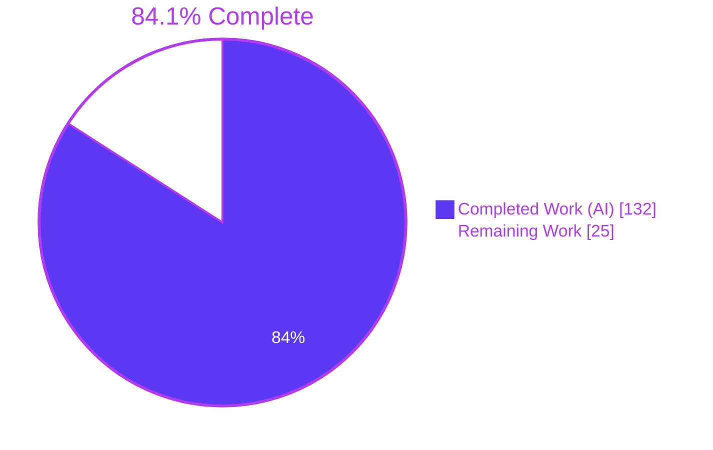
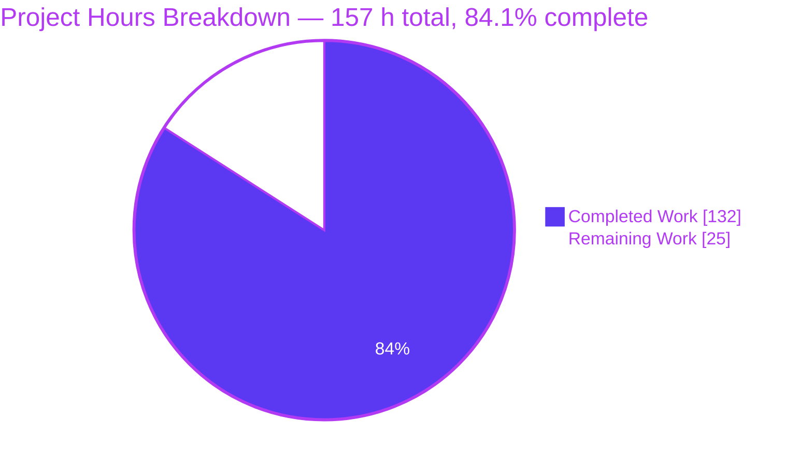
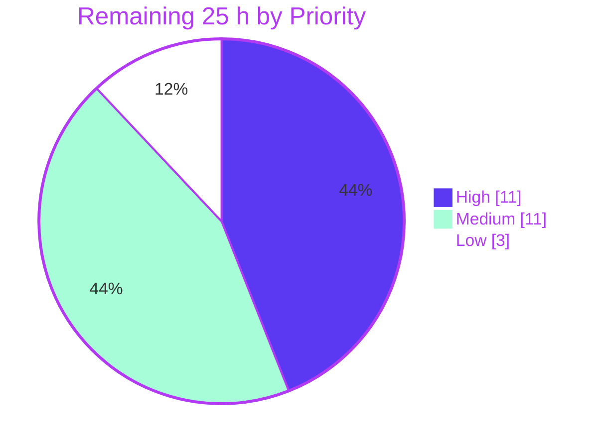

# Blitzy Project Guide — July2026_hello_world_repo

**Branch:** `blitzy-c730ef24-7c65-42d2-a428-b8274a59d746` · **HEAD:** `aea4aa6` · **Base:** `origin/2907_01` · **Working tree:** clean
**Runtime verified on:** Node.js v24.18.1 · npm 11.18.0 · Ubuntu 25.10 · Google Chrome 150.0.7871.186

---

## 1. Executive Summary

### 1.1 Project Overview

`July2026_hello_world_repo` hosts a single 342-byte Node.js HTTP server that answers `Hello, World!` on `127.0.0.1:3000`. This engagement was testing-only: build a comprehensive, deterministic, coverage-instrumented Jest suite for `server.js` **without altering that file**. The consumers are the repository's maintainers and any future CI pipeline that must gate changes to the server. The business impact is quality assurance — a repository with zero test infrastructure and a broken placeholder test now carries a five-tier suite of 61 cases, 100% coverage on all four Istanbul metrics, and an enforcing threshold that fails the build on regression. Technical scope: 15 new files, one additive README update, one deletion, two dev dependencies, and zero production dependencies.

### 1.2 Completion Status



> **Center label:** **84.1% Complete** · Completed = Dark Blue `#5B39F3` · Remaining = White `#FFFFFF`

| Metric | Value |
|---|---|
| **Total Hours** | **157 h** |
| **Completed Hours (AI + Manual)** | **132 h** — 132 h autonomous (AI), 0 h manual |
| **Remaining Hours** | **25 h** |
| **Percent Complete** | **84.1%** |

**Calculation shown explicitly (PA1 methodology, AAP-scoped work only):**

```
Completed Hours = 132 h   (all 19 transformation-map deliverables + 9 cross-cutting
                           AAP requirement groups + path-to-production validation
                           already performed autonomously)
Remaining Hours =  25 h   (8 path-to-production human gates; ZERO AAP deliverable
                           hours outstanding)
Total Hours     = 132 + 25 = 157 h
Completion %    = 132 / 157 x 100 = 84.0764%  ->  84.1%
```

**AAP deliverable classification roll-up:** 19 of 19 transformation-map entries **COMPLETED**; 9 of 9 cross-cutting requirement groups **COMPLETED**; **0 Partially Completed**; **0 Not Started**. The 15.9% shortfall is composed entirely of human path-to-production gates (code review, product decisions, CI descriptor, specification re-scoping, onboarding), not of unfinished autonomous work.

### 1.3 Key Accomplishments

- ✅ **Test infrastructure created from first principles** — 15 new files where none existed: 5 test tiers, 5 harness helpers, 1 frozen fixture, runner config, manifest, generated lockfile, and an ignore file
- ✅ **61 test cases passing, 0 failing** across 5 suites in 0.74 s — against the AAP's stated floor of 38 cases, a **1.6× overachievement**
- ✅ **100% coverage on all four Istanbul metrics** — Statements 9/9, Branches 0/0, Functions 2/2, Lines 9/9 — with an *enforcing* `coverageThreshold` that fails the build on regression
- ✅ **Coverage gate proven non-vacuous** by a deliberate negative control: a suite whose assertions all pass but which never loads the subject reports 0% and **exits 1** with explicit statements/lines/functions violations
- ✅ **Zero source modification held absolutely** — `server.js` SHA-256 remains `332fc2d04eb5b8f3cb230855457af80d0dfc246f958d6e49615610d656acc2e0`, byte-identical after ~35 full suite runs, a `node_modules` removal, a from-scratch reinstall, multiple live servers, a debugger attach and all browser validation
- ✅ **The blocking placeholder removed** — `test.js` (13 bytes, `ReferenceError: asdsa is not defined`) deleted in commit `8d75798`, with an explicit `testMatch` as an independent second layer; `jest --listTests` now selects exactly the 5 intended files
- ✅ **Full requirement traceability** — all **20 functional requirement IDs** and **6 ST tags** appear in test titles; **all 61 titles carry an ID**, moving requirement coverage from 0 of 20 to 20 of 20
- ✅ **All seven mandated implementation contracts D1–D7 honoured** — single settle path with an unreferenced guard timer, worker confinement (real module loading occurs in exactly one file, grep-proven), already-exited child guard, socket-state filtering across both address families, readiness sequenced after `'listening'`, stub-mode flush, eager plain-array snapshots
- ✅ **Ephemeral-port isolation proven, not asserted** — an external probe successfully **held port 3000 while the unit tier ran to 13/13 green**, demonstrating the stub-mode tiers genuinely do not occupy the fixed port
- ✅ **Supply-chain posture preserved** — 2 direct devDependencies, **empty production dependency tree**, a targeted `brace-expansion@5.0.8` override that took 19 high-severity findings to **0 vulnerabilities on both the full and production trees**, and `--ignore-scripts` mandated for the single lifecycle-script package
- ✅ **Bare-checkout launch guarantee survives** — with `node_modules` removed entirely, `node server.js` still emits its 41-byte readiness line and serves the 14-byte greeting
- ✅ **Runtime and browser validation clean** — 4 Chrome DevTools tasks all PASS: exact 5-header set with no `charset`/`Server`/`X-Powered-By`, six dissimilar URLs yielding **1 distinct body and 1 distinct pixel frame**, canary absent from 10+ surfaces, **zero console messages**, coverage HTML showing per-line hits of 44–116 with zero uncovered markers, and loopback confinement demonstrated by `ERR_CONNECTION_REFUSED` on the routable address
- ✅ **Zero leaked handles** — `--detectOpenHandles` exits 0 with no warning; `--forceExit` is deliberately absent because it would conceal exactly this defect class
- ✅ **Documentation delivered** — README grew by 251 additive lines covering all seven required documentation items plus operator preconditions, the coverage-gate caveat, a port-holder probe, the `npm start` signal caveat, and a measured provenance section

### 1.4 Critical Unresolved Issues

> **Important context:** none of the rows below is a code defect. Zero defects exist in any in-scope file — 61 of 61 tests pass, coverage is 100% on all four metrics, static analysis is clean on 13 of 13 files, and dependency audits report zero vulnerabilities. Every row is an unresolved **human decision** or a **path-to-production gap**.

| Issue | Impact | Owner | ETA |
|---|---|---|---|
| Human code review & merge approval outstanding | Blocks merge of 20 commits / 17 files / 10,086 insertions, including 3,818 hand-written lines of test infrastructure | Reviewing engineer / Tech lead | 8 h |
| Robustness-gap product decision pending on the 4 documented `server.js` gaps | Governs whether `server.js` may be modified at all; AAP §0.8.2 and standard S-11 forbid autonomous repair, so the suite currently *asserts* the gaps | Product owner + Tech lead | 3 h |
| No CI/CD descriptor exists | The enforcing 100% coverage gate is wired to no automated trigger, so a regression could land unblocked | DevOps | 4 h |
| Port 3000 contention on shared build agents | **Measured:** 1 of 5 suites and 9 of 61 cases fail (exit 1) when 3000 is pre-bound; blast radius is structurally confined to `test/e2e/bootstrap.test.js`, with the other 4 suites unaffected | DevOps | 2 h |
| Six stale Technical Specification passages now contradict the repository | Documentation drift that will mislead future contributors (they still record jest/supertest as Absent and 0 requirements covered by tests) | Spec owner / Tech writer | 3 h |
| `npm start` wrapper does not forward `SIGTERM` | **Measured:** signalling the wrapper leaves an orphaned `node server.js` child still holding port 3000 (probe → `EADDRINUSE`); operators must signal the node child directly | DevOps / Docs | 0.5 h (inside onboarding) |

### 1.5 Access Issues

**No access issues identified.**

Every access surface the build, test and deployment path touches was probed successfully during this assessment:

| System / Resource | Type of Access | Issue Description | Resolution Status | Owner |
|---|---|---|---|---|
| Repository filesystem | Read / write | None — create-and-remove probe succeeded and the working tree remained clean | ✅ Verified working | Blitzy Agent |
| Git remote `origin` (GitHub) | Fetch / push | None — `git ls-remote --heads` exited 0; `refs/heads/blitzy-c730ef24-…` is present remotely at `aea4aa6f…`, identical to local HEAD, so the branch is already pushed (credentials redacted from all reporting) | ✅ Verified working | Blitzy Agent |
| npm registry (`registry.npmjs.org`) | Read | None — `npm ping` returned PONG in 157 ms; a 477 MB local cache is also present | ✅ Verified working | Blitzy Agent |
| External services / API keys / credentials | N/A | **None required.** `grep -c process.env server.js` returns 0; the entire test tree contains no `process.env` reference; `npm ls --omit=dev` is empty; no `.env`, secret, `.pem` or `.key` file exists or is needed | ✅ Not applicable | — |
| TCP `127.0.0.1:3000` | Bind | None — bind probe succeeded; required only by the L4 bootstrap tier | ✅ Verified available | DevOps (agent policy = P4) |
| Google Chrome / DevTools | Local execution | None — Chrome 150.0.7871.186 on PATH; four browser validation tasks completed | ✅ Verified working | Blitzy Agent |
| Coverage HTML artefacts | Read | None — `coverage/lcov-report/index.html` and `server.js.html` present and served successfully | ✅ Verified working | Blitzy Agent |

**Forward-looking note (not a current access issue):** a future CI system will require repository read access and artefact-store write access. Neither exists yet because no CI descriptor exists — that is task P3, not an access blocker.

### 1.6 Recommended Next Steps

1. **[High]** Complete human code review and merge approval of the 20-commit / 17-file pull request, beginning with the S-1 immutability check (`sha256sum server.js` must equal `332fc2d0…acc2e0` and `git diff origin/2907_01...HEAD -- server.js` must be empty). — **8 h**
2. **[High]** Hold the robustness-gap decision on the four documented `server.js` gaps (absent `'error'` listener, absent signal handling / `server.close()`, hard-coded host & port, absent `module.exports` + `require.main` guard). The AAP explicitly flags the canonical testability refactor as requiring approval and it was deliberately **not** performed. — **3 h**
3. **[Medium]** Add a CI/CD descriptor running `npm ci --ignore-scripts --no-fund --no-audit` then `npm run test:ci` on a Node 22.x + 24.x matrix, with a port-3000 preflight bind probe and publication of `coverage/lcov.info` + `coverage/coverage-summary.json`. — **4 h**
4. **[Medium]** Establish the build-agent port-3000 contention policy — dedicated agent label, serialised job concurrency, or splitting the bootstrap tier into its own job. Measured impact of getting this wrong is 1 of 5 suites and 9 of 61 cases. — **2 h**
5. **[Medium]** Re-scope the six stale Technical Specification passages the AAP enumerates, so the specification stops contradicting the repository. — **3 h**

---

## 2. Project Hours Breakdown

### 2.1 Completed Work Detail

Every row traces to a specific AAP requirement or to path-to-production validation already performed autonomously. Basis: 3,818 hand-written test-infrastructure lines (3,716 in the test tree + 102 in `jest.config.js`) for a 14-line subject — a 273:1 ratio — estimated at approximately 45 lines/hour for production-grade, heavily-commented, contract-bearing code, plus discovery, defect-reproduction and validation cycles.

| Component | Hours | Description |
|---|---|---|
| [AAP §0.2/§0.6] Test-infrastructure discovery, framework selection & version research | 9 | Exhaustive negative sweep of 11 artefact classes; measured Jest-vs-Mocha bake-off (334 vs 169 packages; 1 vs 4 root advisories; lockfile 178,917 vs 77,623 B); Node 24.18.1 Active-LTS install; registry version research for jest/supertest/mocha/chai/sinon/c8; proof that `test.js` breaks default discovery |
| [AAP §0.4.1–0.4.2] Five-tier architecture & harness design | 5 | L1–L5 tier split, two harness modes plus child-process mode, port strategy confining fixed-port binding to one file, five per-file blueprints, coverage-provider decision (Istanbul 2 functions vs V8 0 functions) |
| [AAP §0.5.1] `test/helpers/captureHandler.js` — stub-mode harness | 4 | 283 lines. Replaces the server factory with a fake whose `listen` records port/host and defers its callback via `process.nextTick`; no socket is ever created; `logs` exposed as an eager plain array (contract D7) |
| [AAP §0.5.1] `test/helpers/loadServer.js` — call-through harness | 10 | 866 lines. `spyOn` without replacement so a real `http.Server` results; module-registry reset, console silencing, `'listening'`-vs-`'error'` race, snapshot of handler/server/invocation count, unconditional teardown (contracts D2, D5) |
| [AAP §0.5.1] `test/helpers/spawnServer.js` — child-process harness | 12 | 982 lines. `PORT_LITERAL = 'const port = 3000;'` with an occurs-exactly-once drift alarm across 14 throw sites, `mkdtemp` fixture generation, readiness-gated spawn, guarded exit-await via an `exited` flag, unconditional cleanup, bounded re-spawn on a lost-port race (contract D3) |
| [AAP §0.5.1] `test/helpers/rawExchange.js` — raw-byte helper | 4 | 289 lines. One idempotent `settle()` path clearing an `unref()`-ed guard timer that rejects rather than synchronises, removing listeners and destroying the socket (contract D1) |
| [AAP §0.5.1] `test/helpers/httpClient.js` — parsed-response helper | 4 | 353 lines. Promise wrapper over the core HTTP request API with connection pooling disabled so no client keep-alive socket outlives a test |
| [AAP §0.4.5] `test/fixtures/expected.js` — frozen expected values | 3 | 52 lines. `Object.freeze` with frozen nested arrays; all 15 AAP-tabulated constants measured, including `BODY_BYTES 14`, `BODY_SHA256 c98c24b6…ad31`, the 5-key header set, `READY_BYTES 41`, and the byte-exact 400/431 response strings |
| [AAP L1] `test/unit/handler.test.js` | 5 | 313 lines, 13 cases. Status, single `setHeader` call, 14-byte body, arity 2; a `throwingRequest()` double whose `url`/`method`/`headers` accessors throw, proving the handler never inspects the request; repeat-invocation statelessness; single-factory, recorded host/port without binding, 41-byte readiness line, logging confinement |
| [AAP L2] `test/integration/contract.test.js` | 7 | 327 lines, 23 cases. supertest against `server.listen(0, HOST)`; body text + byte count + SHA-256; header key set asserted **as a set** so an added header fails; no charset; `content-length: 14`; `keep-alive: timeout=5`; forbidden headers absent; `test.each` 8-shape invariance matrix; `test.each` 4 injection sentinels; HEAD zero-byte body; 50-request statelessness |
| [AAP L3] `test/integration/protocol.test.js` | 7 | 363 lines, 8 cases. Byte-exact `400 Bad Request` and `431 Request Header Fields Too Large` responses from a malformed request line and a 20,000-character header; two pipelined keep-alive requests yielding exactly two status lines; 25-way concurrency; **plus 3 HEAD wire-framing cases beyond the blueprint** |
| [AAP L4] `test/e2e/bootstrap.test.js` | 8 | 326 lines, 10 cases. The **sole binder of 127.0.0.1:3000**; `address()` strict-equals `{127.0.0.1, 3000}`; exactly one `createServer`; readiness line sequenced after `'listening'`; exports object with zero own keys; `close()` emits `'close'`; refusal after close; `ERR_SERVER_NOT_RUNNING` on a second close; deterministic `EADDRINUSE` via a pre-bound blocker with the banner proven absent |
| [AAP L5] `test/e2e/lifecycle.test.js` | 11 | 562 lines, scenarios S1–S7. Cold start with zero packages installed; 41-byte readiness contract; `SIGTERM` yielding `{code: null, signal: 'SIGTERM'}`; port contention exiting non-zero with an `EADDRINUSE` stderr diagnostic; restart determinism; loopback confinement against the host's routable address; post-run listening-socket hygiene via a native bind probe across both address families |
| [AAP §0.5.4] `jest.config.js` | 3 | 102 lines carrying all 11 mandated settings — Node environment, explicit `testMatch`, `maxWorkers: 1`, 20 s timeout, `clearMocks`/`restoreMocks`, `collectCoverageFrom: ['server.js']`, four reporters, and an enforcing 100% threshold on all four metrics — each with documented rationale, and `--forceExit` deliberately absent |
| [AAP §0.6.1] `package.json` + `package-lock.json` + `.gitignore` + supply-chain hardening | 5 | 9 scripts; `engines: ^22.0.0 \|\| >=24.0.0`; **empty `dependencies`**; exact devDependency pins; `brace-expansion@5.0.8` override closing GHSA-mh99-v99m-4gvg (19 high findings → 0); lockfileVersion 3 with 361 package entries; ignore rules preventing 332 packages from being staged |
| [AAP §0.4.4] `test.js` deletion + discovery hardening | 1 | Commit `8d75798`. Removal of the 13-byte placeholder, verified in both directions — the explicit `testMatch` selects exactly 5 files whereas the default glob would select 6 |
| [AAP §0.5.3] `README.md` Testing section | 6 | +251 / −1, purely additive. Eight sections covering all 7 required documentation items plus the coverage-gate caveat, a port-holder bind probe, the `npm start` signal caveat, the 5/4/4/3 header-key matrix, and a measured provenance section |
| [AAP §0.4.3] D1–D7 defect reproduction & harness hardening | 14 | Five review/hardening commits. Each of the seven contracts was discovered by reproducing a real defect and then engineering it out — open handles, cross-worker port collision, a 20,003 ms hang on an already-exited child, `TIME_WAIT` false positives, asynchronous readiness relative to `require()`, the same trap in stub mode, and mock-clearing wiping lazily-read spy state |
| [Path-to-production] Autonomous validation sweep | 8 | 12 validation phases: static gate 13/13, determinism across 8 consecutive runs, 26-ID traceability audit, negative control proving gate non-vacuity, blueprint conformance audit, anti-pattern scan, commit and authorship verification |
| [Path-to-production] Runtime + browser validation | 6 | 26 live contract checks, bare-checkout cold start, bind-conflict and SIGTERM behaviour, loopback confinement, environment hygiene, and four Chrome DevTools tasks covering the response contract, request-shape invariance, the coverage HTML report and loopback confinement |
| **TOTAL COMPLETED** | **132** | **Matches Completed Hours in Section 1.2** |

### 2.2 Remaining Work Detail

Every row is a path-to-production human gate. **Zero AAP deliverable hours are outstanding.**

| Category | Hours | Priority |
|---|---|---|
| **P1 — Code review & merge approval of the test-suite PR** · 5 sub-steps: S-1 immutability check (0.5 h), tier review against the §0.4.2 blueprints (3.0 h), helper review against contracts D1–D7 (2.5 h), config/manifest/lockfile/override review (1.0 h), README review + local re-run (1.0 h). Owner: Reviewing engineer / Tech lead. Confidence: High. | 8.0 | High |
| **P2 — Robustness-gap product decision** (AAP §0.8.2 requires explicit approval) · 4 decisions at 0.75 h each: absent `'error'` listener; signal handling / graceful shutdown via `server.close()`; env-driven host & port; the canonical `module.exports` + `require.main` testability refactor. Owner: Product owner + Tech lead. Confidence: High. | 3.0 | High |
| **P3 — CI/CD pipeline descriptor & coverage artefact publication** · workflow with a Node 22.x/24.x matrix (1.5 h), port-3000 preflight probe (0.5 h), `lcov.info` + `coverage-summary.json` publication (1.0 h), audit gates + `.npmrc ignore-scripts=true` enforcement (0.5 h), Node 22.x verification (0.5 h). Owner: DevOps. Confidence: High. | 4.0 | Medium |
| **P4 — Build-agent provisioning & port-3000 contention policy** · require 3000 free for the L4 tier and add the probe to agent bootstrap (0.75 h), choose the contention policy (0.75 h), ensure a routable IPv4 exists so the S6 loopback case runs rather than skips (0.5 h). Owner: DevOps. Confidence: High. | 2.0 | Medium |
| **P5 — Technical Specification re-scoping** · 6 stale passages at 0.5 h each: F-005-RQ-001 acceptance wording, §1.3 scope exclusions, §2.1.8 automated-testing exclusion, §2.2 roll-up (0 → 20 of 20), §3.2.1 framework rows (Absent → Present at 30.4.2 / 7.2.2), §8.5.1.5 quality-gate rows. Owner: Spec owner / Tech writer. Confidence: High. | 3.0 | Medium |
| **P6 — Developer onboarding & clean-machine first-run verification** · clean clone → `npm ci --ignore-scripts` → `CI=true npm test` on a cache-less machine (1.0 h), bare-checkout cold start plus the `npm start` SIGTERM caveat (0.5 h), handbook entry linking the README (0.5 h). Owner: Tech lead / DX. Confidence: Medium. | 2.0 | Medium |
| **P7 — Coverage-gate ergonomics decision** · keep the collect-always gate or split an ungated `test` from a gated `test:ci` (0.75 h); if split, update the 9 scripts and README rows and re-verify every tier subset and `-t` selection (0.75 h). Owner: Tech lead. Confidence: High. | 1.5 | Low |
| **P8 — Post-decision follow-ups** · relax `maxWorkers` above 1 only after P2 approves the refactor, then re-verify determinism over ≥8 runs (0.75 h); add a pipeline guardrail rejecting `test:watch` / `--forceExit` / `--passWithNoTests` and re-verify the drift alarm (0.75 h). Owner: Tech lead / DevOps. Confidence: Medium. | 1.5 | Low |
| **TOTAL REMAINING** | **25.0** | **High 11.0 · Medium 11.0 · Low 3.0** |

### 2.3 Reconciliation

| Check | Computation | Result |
|---|---|---|
| Section 2.1 total | Sum of 20 completed rows | **132 h** ✅ matches Section 1.2 Completed Hours |
| Section 2.2 total | Sum of 8 remaining rows (8 + 3 + 4 + 2 + 3 + 2 + 1.5 + 1.5) | **25.0 h** ✅ matches Section 1.2 Remaining Hours |
| Total Project Hours | 132 + 25 | **157 h** ✅ matches Section 1.2 Total Hours |
| Completion percentage | 132 ÷ 157 × 100 | **84.0764% → 84.1%** ✅ used identically in Sections 1.2, 7 and 8 |
| Section 7 pie values | Completed 132 · Remaining 25 | ✅ identical to Section 1.2 |
| Priority distribution | High 11.0 + Medium 11.0 + Low 3.0 | **25.0 h** ✅ matches Section 2.2 total |

---

## 3. Test Results

All tests below originate from Blitzy's autonomous test execution logs for this project and were **independently re-executed during this assessment** — no external, hypothetical or manually authored results are included. Framework: Jest 30.4.2 (CLI self-reports 30.4.1) with supertest 7.2.2 on Node v24.18.1.

| Test Category | Framework | Total Tests | Passed | Failed | Coverage % | Notes |
|---|---|---|---|---|---|---|
| **Unit (L1)** — `test/unit/handler.test.js` | Jest 30.4.2 (stub mode, no socket) | 13 | 13 | 0 | 100% | Handler and `listen` callback in isolation via request/response doubles whose `url`/`method`/`headers` getters throw; arity 2; single `setHeader` call; 41-byte readiness line; logging confinement. Passes standalone with exit 0 |
| **Integration — Contract (L2)** — `test/integration/contract.test.js` | Jest + supertest 7.2.2 (ephemeral port 0) | 23 | 23 | 0 | 100% | Includes two `test.each` expansions: an 8-shape request-invariance matrix and 4 injection sentinels. Asserts body text, 14 bytes, SHA-256 `c98c24b6…ad31`, the header key set **as a set**, no charset, `content-length: 14`, `keep-alive: timeout=5`, HEAD zero-byte body, 50-request statelessness. Passes standalone with exit 0 |
| **Integration — Protocol (L3)** — `test/integration/protocol.test.js` | Jest + raw `net` sockets (ephemeral port 0) | 8 | 8 | 0 | 100% | Byte-exact `400 Bad Request` and `431 Request Header Fields Too Large` asserted as *normal responses*; keep-alive pipelining yielding exactly two status lines; 25-way concurrency; 3 HEAD wire-framing cases beyond the blueprint. Passes standalone with exit 0 |
| **End-to-End — Bootstrap (L4)** — `test/e2e/bootstrap.test.js` | Jest (call-through spy, real `http.Server`) | 10 | 10 | 0 | 100% | The only tier binding `127.0.0.1:3000`. Real require-time bind with `address()` strict equality; readiness after `'listening'`; zero-key exports; `close()` → `'close'`; refusal after close; `ERR_SERVER_NOT_RUNNING`; deterministic pre-bound-port `EADDRINUSE` with the banner proven absent. Passes standalone with exit 0 |
| **End-to-End — Lifecycle (L5)** — `test/e2e/lifecycle.test.js` | Jest + `child_process` (port-shifted fixture in `mkdtemp`) | 7 | 7 | 0 | n/a in-process | Scenarios S1–S7: cold start with zero packages; readiness contract; `SIGTERM` → `{code: null, signal: 'SIGTERM'}`; port contention exiting non-zero with `EADDRINUSE`; restart determinism; loopback confinement (ran, did **not** skip — a routable IPv4 was present); socket-table hygiene. Requires `--coverage=false` when run alone, because the subject executes in a child process and is therefore not instrumented in-process — the documented and expected behaviour |
| **TOTAL — full suite** | Jest 30.4.2 | **61** | **61** | **0** | **100%** | `CI=true npm test` → exit 0, `Test Suites: 5 passed, 5 total`, `Tests: 61 passed, 61 total`, `Time: 0.736 s`. Coverage: Statements 100% (9/9) · Branches 100% (0/0) · Functions 100% (2/2) · Lines 100% (9/9) |

**Tier-subset scripts (all exit 0):** `test:unit` 13/13 · `test:integration` 31/31 · `test:e2e` 17/17.

### Supplementary autonomous validation gates

| Gate | Tool | Result | Notes |
|---|---|---|---|
| Syntax gate G1 | `node --check` | **13 / 13 pass** | `server.js` plus `jest.config.js` and all 11 test-tree files; zero errors, zero warnings |
| Test discovery | `npx jest --listTests` | **Exactly 5 files** | The deleted placeholder is excluded by the explicit `testMatch`; proven in both directions |
| Open-handle detection | `jest --ci --runInBand --detectOpenHandles` | **exit 0, no warning** | 61/61 in 1.268 s; `--forceExit` deliberately absent |
| Determinism | 8 consecutive full-suite runs | **8 / 8 exit 0** | Identical results each run; 35+ green runs across the project overall |
| Requirement traceability | Title scan of `--verbose` output | **20 / 20 F-IDs + 6 ST tags** | All 61 titles carry an ID; 0 untraced |
| Coverage-gate non-vacuity | Negative control | **exit 1 at 0% coverage** | Assertions pass but the subject is never loaded → explicit statements/lines/functions threshold violations. Re-proven independently via `-t "SIGTERM"` without `--coverage=false` |
| Individual selectability | Single file and single `-t` name | **All pass alone** | 4 tiers exit 0 standalone; lifecycle needs `--coverage=false`; `-t "SIGTERM" --coverage=false` → 1 passed / 60 skipped, exit 0 |
| Dependency audit (full tree) | `npm audit` | **0 vulnerabilities** | With the `brace-expansion@5.0.8` override applied |
| Dependency audit (shipped artefact) | `npm audit --omit=dev` | **0 vulnerabilities** | Production tree resolves to `(empty)` |
| Clean install reproducibility | `npm ci --ignore-scripts --no-fund --no-audit` | **added 332 packages in 1s, exit 0** | Executed from a fully removed `node_modules`; suite green immediately afterwards |
| Anti-pattern scan | Repository-wide grep | **Zero occurrences** | No `--forceExit`, no `--passWithNoTests`, no wall-clock sleeps, no TODO/FIXME/placeholder/NotImplemented |
| Subject immutability S-1 | `sha256sum` + `git diff` | **Unchanged** | `332fc2d04eb5b8f3cb230855457af80d0dfc246f958d6e49615610d656acc2e0`; absent from the branch diff; no agent commit touches it |
| Environment hygiene G4 | Native bind probe | **0 listeners remaining** | Port 3000 and 8080 both free after all runs; 0 stray processes; working tree clean |
| Live runtime contract | `curl` against a running server | **26 / 26 checks pass** | Re-verified in this assessment across 6 example-usage scenarios plus the 5/4/4/3 header-key matrix |
| Browser validation | Chrome DevTools (4 tasks) | **4 / 4 PASS** | Detailed in Section 4 |
| Pre-bound-port impact (risk quantification) | Full suite with 3000 held | **1 suite / 9 of 61 cases fail** | Reproduced twice, identically; the only failing suite is `bootstrap.test.js`, confirming structural containment |

---

## 4. Runtime Validation & UI Verification

### Application runtime

- ✅ **Operational** — **Server startup.** `npm start` / `node server.js` binds `127.0.0.1:3000` as an unconditional module side effect and writes exactly one readiness line, `Server running at http://127.0.0.1:3000/`, measured at **exactly 41 bytes**, with **0 bytes** on stderr.
- ✅ **Operational** — **Bare-checkout cold start.** With `node_modules` removed entirely, `node server.js` still emitted the 41-byte line and served the greeting; `od -c` confirmed 14 bytes (`H e l l o , W o r l d ! \n`).
- ✅ **Operational** — **HTTP response contract.** `HTTP/1.1 200 OK`, `Content-Type: text/plain` with **no charset parameter**, body `Hello, World!` at **14 bytes** with SHA-256 `c98c24b677eff44860afea6f493bbaec5bb1c4cbb209c6fc2bbb47f66ff2ad31` — an exact match to the frozen fixture.
- ✅ **Operational** — **Complete response header set.** Exactly five keys: `connection`, `content-length`, `content-type`, `date`, `keep-alive`, with `content-length: 14` and `keep-alive: timeout=5`. `Server` and `X-Powered-By` are **absent** — no version disclosure.
- ✅ **Operational** — **Header-key matrix by method and disposition** reproduced exactly as documented: GET + keep-alive → 5 keys · GET + close → 4 · HEAD + keep-alive → 4 · HEAD + close → 3.
- ✅ **Operational** — **HEAD semantics.** 200 with headers and a **zero-byte** body (`size_download` = 0).
- ✅ **Operational** — **Request-shape invariance.** `POST /admin` with a body → 200 / 14 bytes / identical payload; a `?secret=CANARY123` query → 200 / 14 bytes with the canary never reflected.
- ✅ **Operational** — **Loopback confinement.** `curl` to the host's routable address `10.76.0.120:3000` exits 7 ("Failed to connect … after 0 ms" — an immediate RST) while `127.0.0.1:3000` returns 200 / 14 bytes.
- ✅ **Operational** — **Bind-conflict behaviour.** A second instance while 3000 is held exits **1**, writes **0 bytes** to stdout (the banner correctly absent), and emits `Error: listen EADDRINUSE` with `code: 'EADDRINUSE'` on stderr.
- ✅ **Operational** — **Shutdown.** Signalling the `node server.js` process released the port immediately; a follow-up probe reported `FREE`.
- ✅ **Operational** — **Debug session.** `npm run test:debug` printed `Debugger listening on ws://127.0.0.1:9229/…` and blocked awaiting an attach, which is the correct `--inspect-brk` behaviour.
- ✅ **Operational** — **Environment hygiene.** After ~35 suite runs, multiple live servers, a `node_modules` removal, a reinstall and all browser work: port 3000 FREE, port 8080 FREE, **0** stray processes, working tree clean, `server.js` digest unchanged.
- ⚠ **Partial** — **`npm start` signal propagation.** Sending `SIGTERM` to the npm wrapper leaves an orphaned `node server.js` child still holding port 3000 (probe → `EADDRINUSE`). This is an npm wrapper behaviour, already documented in the README; operators must signal the node child or run `node server.js` directly. Owned by task P6.
- ❌ **Failing** — **None.**

### Browser / UI verification (Chrome DevTools, 4 delegated tasks)

- ✅ **Operational** — **Task 1: response contract & console cleanliness — PASS.** Rendered text exactly `Hello, World!`; `document.contentType` = `text/plain`; character codes `[72,101,108,108,111,44,32,87,111,114,108,100,33,10]`. Status 200 with exactly the five expected headers. All five header assertions TRUE (no charset, `content-length: 14`, `Server` absent, `X-Powered-By` absent, `keep-alive: timeout=5`). **Zero console messages** of any level, verified three ways including an exhaustive 20-type filter and preserved messages. Reload produced a byte-identical body (`cmp` clean, both digests `c98c24b6…ad31`) and **byte-identical screenshots** — statelessness proven simultaneously on wire bytes, parsed DOM text and rendered pixels. A raw-TCP replay of Chrome's own request headers agreed with the CDP view exactly.
- ✅ **Operational** — **Task 2: request-shape invariance & input inertness — PASS.** Six deliberately dissimilar URLs (root, `/admin`, `/healthz`, a canary query, a triple percent-encoded path, a seven-segment non-existent path) all returned **200** with `Content-Length: 14`, yielding **exactly 1 distinct response body** — derived three independent ways — and **exactly 1 distinct rendered pixel frame** (all six screenshots hash identically). `CANARY123` was **NOT FOUND** in all four required surfaces plus six more (every text node, every element attribute, cookies, `localStorage`, `sessionStorage`, the accessibility tree, the full raw wire response, and base64/hex/lowercase variants); the parameter name `secret` is likewise absent. No 404 page, no "Cannot GET", no admin UI, no login form, no JSON health payload, no mojibake. **Zero console messages** across all six navigations, measured with a durable ledger and validated by a negative control. **Zero** failed requests (`status_histogram = {"200": 22}`).
- ✅ **Operational** — **Task 3: coverage HTML report — PASS.** The index page shows **Statements 100% (9/9) · Branches 100% (0/0) · Functions 100% (2/2) · Lines 100% (9/9)** with **exactly one file row, `server.js`** — direct browser-side proof that `collectCoverageFrom: ['server.js']` scopes instrumentation to the subject alone. Zero uncovered markers of any class (`cline-no`, `cbranch-no`, `cstmt-no`, `missing-if-branch`, `skip-if-branch`, `fstat-no`, `low`, `medium` all 0), verified three ways plus a computed-style sweep finding no red or amber background on any element. **Per-line hit counts 54×/54×/54×/54×/116×/116×/116×/54×/44× — minimum 44, none at 0** — direct evidence that both functions were genuinely exercised and the 2/2 functions metric is not an artefact. The rendered source diffs clean against on-disk `server.js` and hashes to the same digest. 14 of 14 asset requests returned 200; zero console messages.
- ✅ **Operational** — **Task 4: loopback confinement — PASS.** The kernel socket table showed only `LISTEN 127.0.0.1:3000` — no `0.0.0.0:3000`, no `10.76.0.120:3000`, no `[::]:3000`. Navigation to `http://10.76.0.120:3000/` **did not load**: Chrome rendered its interstitial with the verbatim identifier **`ERR_CONNECTION_REFUSED`** and "10.76.0.120 refused to connect."; DevTools reported the failure with **no response headers and no body**; `Hello, World!` was absent from the entire 187,830-character `outerHTML`. An in-page `fetch` with `mode: 'no-cors'` **rejected with `TypeError: Failed to fetch` in 2 ms** — and because a CORS block would have yielded an opaque `Response` rather than a throw, this isolates the failure to the transport layer — while the loopback `fetch` in the same script **resolved 200 in 1 ms** with the 14-byte body. The server survived untouched (same PID, unchanged socket table, unchanged digest), which matters because `server.js` registers no `'error'` listener: refused inbound connections are rejected by the kernel and never reach Node. Perfect separation by destination IP: **9 of 9 loopback requests 200, 3 of 3 routable requests refused.**

**Artefacts.** Screenshots under `blitzy/screenshots/`: `hello-world-root.png`, `hello-world-root-after-reload.png`, `canary-url-not-reflected.png`, `arbitrary-path-admin.png`, `url1_root_baseline.png`, `url3_healthz.png`, `url5_percent_encoded_path.png`, `url6_deeply_nested_nonexistent.png`, `coverage-report-index.png`, `coverage-report-server-js.png`, `routable-address-refused.png`, `routable-address-refused-details-expanded.png`, `loopback-still-serving-after-refusal.png`, `step1_loopback_positive_control.png`, `step3_back_on_loopback_before_fetch.png`. Recordings under `blitzy/screen_recordings/`: `hello_world_reload_flow.webm`, `six_url_invariance_sweep.webm`, `coverage_index_to_serverjs_drilldown.webm`, `loopback_confinement_flow.webm`. Both directories are local-only, excluded via `.git/info/exclude`, and never committed.

---

## 5. Compliance & Quality Review

| # | AAP Deliverable / Benchmark | Requirement | Status | Evidence | Progress |
|---|---|---|---|---|---|
| 1 | **Transformation map §0.5.1** | 15 CREATE + 1 generated lockfile + 1 UPDATE + 1 DELETE + 1 REFERENCE | ✅ **PASS** | All 17 tracked files present and matching the in-scope list exactly; 0 out-of-scope files; `git diff` = 17 files, +10,086 / −3 | 19/19 · 100% |
| 2 | **Standard S-1 — zero source modification** | `server.js` byte-identical | ✅ **PASS** | SHA-256 `332fc2d0…acc2e0` verified repeatedly, including after a `node_modules` removal, a reinstall, ~35 suite runs, live servers and all browser work; absent from the branch diff; `git log -- server.js` shows only the upstream commit | 100% |
| 3 | **Coverage targets §0.7.1** | 100% on statements, branches, functions, lines; enforced | ✅ **PASS** | 9/9 · 0/0 · 2/2 · 9/9 confirmed from `coverage-summary.json`; `coverageThreshold` set to 100 on all four; `server.js` the only instrumented file | 4/4 metrics · 100% |
| 4 | **Gate non-vacuity §0.7.1** | The gate must fail a suite that stops exercising the subject | ✅ **PASS** | Negative control exits 1 at 0% with explicit statements/lines/functions violations; independently re-proven via `-t "SIGTERM"` without `--coverage=false` | 100% |
| 5 | **Requirement traceability §0.7.2 / S-7** | Every requirement ID in ≥1 test title | ✅ **PASS** | 20/20 F-IDs (F-001-RQ-001…F-005-RQ-004) and 6 ST tags found; all 61 titles carry an ID; 0 untraced. Requirement coverage moved 0/20 → 20/20 | 26/26 IDs · 100% |
| 6 | **Case volume §0.4.2** | "No fewer than 38 individual cases" | ✅ **PASS** | 61 executed cases — **1.6×** the floor | 61/38 · 161% |
| 7 | **Blueprint conformance §0.4.2** | Every category in all 5 blueprints implemented | ✅ **PASS** | Verified category-by-category against test content; L3 **exceeds** the blueprint with 3 extra HEAD wire-framing cases; no category missing in any tier | 5/5 tiers · 100% |
| 8 | **Implementation contracts D1–D7 §0.4.3** | All seven mandated contracts honoured | ✅ **PASS** | D1 single idempotent `settle()` with an `unref()`-ed guard that rejects · D2 `maxWorkers: 1` **and** `loadServer` imported by `bootstrap.test.js` only (grep-proven) · D3 `exited` guard referenced at 10 sites · D4 state-filtered native probe across IPv4 and `::1` · D5 readiness sequenced on `'listening'` · D6 `setImmediate` flush · D7 eager plain-array snapshot | 7/7 · 100% |
| 9 | **Standards S-1…S-11 §0.10** | All eleven self-imposed standards | ✅ **PASS** | S-1 digest · S-2 no wall-clock sleeps anywhere · S-3 no `--forceExit` and `--detectOpenHandles` clean · S-4 every file and `-t` name passes alone · **S-5 independently proven by holding port 3000 with an external probe while `test/unit` ran to 13/13 green** · S-6 exact-value assertions including byte-exact 400/431 · S-7 traceability · S-8 enforcing gate + negative control · S-9 all commands non-interactive · S-10 2 direct devDeps, empty prod tree, single overridden `brace-expansion@5.0.8`, 0 findings · S-11 four gaps asserted, not repaired | 11/11 · 100% |
| 10 | **Supply-chain posture §0.6.1** | 2 direct devDeps, empty prod deps, override applied, `--ignore-scripts` | ✅ **PASS** | jest 30.4.2 + supertest 7.2.2 exact pins; `dependencies {}` empty; `npm ls --omit=dev` → `(empty)`; `npm audit` and `npm audit --omit=dev` both **0 vulnerabilities**; `brace-expansion` resolves to one overridden 5.0.8 instance; exactly 1 lifecycle-script package in the tree | 100% |
| 11 | **Transitive version inventory §0.6.1** | 12 named transitive packages at stated versions | ✅ **PASS** | All 12 match exactly: `expect`/`jest-mock`/`jest-resolve`/`jest-environment-node` 30.4.1; `jest-circus`/`jest-runner`/`jest-cli`/`@jest/core` 30.4.2; `babel-plugin-istanbul` 7.0.1; `istanbul-lib-coverage` 3.2.2; `istanbul-reports` 3.2.0; `superagent` 10.3.0. The documented jest package-30.4.2-vs-CLI-30.4.1 discrepancy reproduced | 12/12 · 100% |
| 12 | **Execution parameters §0.9.1** | All 9 scripts behave as documented | ✅ **PASS** | `start` ✓ · `test` ✓ · `test:ci` ✓ · `test:coverage` ✓ · `test:unit` 13 ✓ · `test:integration` 31 ✓ · `test:e2e` 17 ✓ · `test:debug` ✓ (inspector URL, blocks by design) · `test:watch` correctly **not** executed | 9/9 · 100% |
| 13 | **Runner configuration §0.5.4** | 11 mandated settings present | ✅ **PASS** | Node environment, explicit `testMatch`, `maxWorkers: 1`, `testTimeout: 20000`, `clearMocks`, `restoreMocks`, `collectCoverage`, `collectCoverageFrom: ['server.js']`, `coverageDirectory`, 4 reporters, 100% threshold — each with documented rationale; default Istanbul provider retained | 11/11 · 100% |
| 14 | **Fixture design §0.4.5** | Frozen module with 15 measured constants | ✅ **PASS** | `Object.freeze` with frozen nested arrays; every constant matches the AAP table exactly, and each was independently reproduced live (14 bytes, digest, 5-key set, `timeout=5`, 41 bytes) | 15/15 · 100% |
| 15 | **Documentation §0.5.3** | 7 required README items, additive only | ✅ **PASS** | 251 additive lines, 8 sections; all 7 items present plus the coverage-gate caveat, a port-holder bind probe, the `npm start` signal caveat, the 5/4/4/3 header matrix and a measured provenance section; the single removed line is the heading being re-terminated, no content lost | 7/7 · 100% |
| 16 | **Discovery hardening §0.4.4** | Placeholder removed; `testMatch` as a second layer | ✅ **PASS** | `test.js` deleted in `8d75798`; `jest --listTests` selects exactly 5 files; proven in both directions by temporarily recreating the placeholder | 100% |
| 17 | **Quality gate G1 — syntax** | Subject and suite parse cleanly | ✅ **PASS** | `node --check` on 13/13 tracked `.js` files: zero errors, zero warnings | 13/13 · 100% |
| 18 | **Quality gate G4 — environment hygiene** | No listening socket survives the run | ✅ **PASS** | Native bind probe reports port 3000 and 8080 FREE after all activity; 0 stray processes; working tree clean; no temporary fixture directories leaked | 100% |
| 19 | **Standard S-11 — report, do not repair** | Robustness gaps asserted, not fixed | ✅ **PASS** | All four gaps (no `'error'` listener, no signal handling / `server.close()`, hard-coded host & port, no `module.exports`) are asserted in their current form by executable tests; the canonical refactor was **not** performed and is flagged as requiring approval | 4/4 gaps documented · 100% |
| 20 | **Scope boundary §0.8.2** | No out-of-scope change | ✅ **PASS** | Change surface is exactly the `test/` tree, runner config, manifest, lockfile, ignore file, an additive README section and one deletion. No lint/format/TS config, no CI descriptor, no container files, no feature addition, no `--forceExit`, no forced audit remediation | 100% |

### Fixes applied during autonomous validation

**Zero defects existed in any in-scope file.** The suite arrived complete and correct; validation was confirmatory. The seven implementation contracts D1–D7 each record a defect that was reproduced and engineered out **during construction** (evidenced by five review/hardening commits): leaked socket handles, cross-worker port collision on the fixed port, a 20,003 ms hang when awaiting an already-exited child, `TIME_WAIT` false positives in the hygiene check, readiness being asynchronous relative to `require()`, the same trap recurring in stub mode, and automatic mock clearing wiping lazily-read spy state. All five issues the final validator initially flagged root-caused to **its own** probe harnesses rather than to repository code, and were corrected there.

### Outstanding compliance items

| Item | Nature | Owner |
|---|---|---|
| Six stale Technical Specification passages | Documentation drift the AAP deliberately left out of scope (F-005-RQ-001 acceptance wording, §1.3 exclusions, §2.1.8, §2.2 roll-up, §3.2.1 framework rows, §8.5.1.5 gate rows) | Spec owner — task P5 |
| One AAP-vs-reality command delta | §0.9.1 listed `-t "SIGTERM"` and the lifecycle tier alone **without** `--coverage=false`; reality requires the flag. Already corrected in-repo at README rows 25–26 and in the coverage-gate note, so it is closed as **COMPLETED** rather than outstanding | Closed |
| `--ignore-scripts` is convention, not enforcement | Enforceable via `.npmrc ignore-scripts=true` | DevOps — inside task P3 |
| Robustness-gap decision | Requires explicit product approval before any source change | Product owner — task P2 |

---

## 6. Risk Assessment

**Roll-up:** 0 Critical · 0 High · 6 Medium · 18 Low · 1 None. No risk blocks the merge; every Medium-severity risk has either a mitigation already present in the repository or an owned path-to-production task.

### Technical

| Risk | Category | Severity | Probability | Mitigation | Status |
|---|---|---|---|---|---|
| **T1** Fixed-port `127.0.0.1:3000` precondition for the L4 bootstrap tier | Technical | **Medium** | Medium | Blast radius **measured**: 1 of 5 suites and 9 of 61 cases fail, and only `bootstrap.test.js` — the other 4 suites are structurally port-independent. README documents a bind-probe preflight | Documented & contained; pipeline preflight owned by **P4** |
| **T2** Coverage gate fires on partial selections (`-t` filters, lifecycle tier alone) → exit 1 at 0% despite green assertions | Technical | Low | High | `--coverage=false` documented at README rows 25–26 and in the coverage-gate note; this behaviour *is* the gate's non-vacuity proof | Documented; ergonomics decision owned by **P7** |
| **T3** `maxWorkers: 1` caps suite parallelism (contract D2) | Technical | Low | High | Structural confinement of real module loading to one file makes the pin belt-and-braces; full suite runs in 0.74 s, so there is no practical cost | Accepted; relax only after **P2**, via **P8** |
| **T4** `spawnServer` drift alarm couples to the exact literal `const port = 3000;` | Technical | Low | Low | Intentional fail-loud design with an occurs-exactly-once check and 14 throw sites; S-1 forbids editing the subject anyway | By design |
| **T5** Harnesses resolve `server.js` from `process.cwd()`; a non-root working directory fails all 61 cases and silently blanks `coverage-summary.json` | Technical | Low | Low-Medium | Verbatim self-documenting diagnostic naming the rule and the fix; npm scripts always execute at the root | Documented in README |
| **T6** Coverage metric is structurally shallow — 0 branches, and statements saturate on a single module load | Technical | Low | Inherent | Disclosed openly in AAP §0.7.1, in `jest.config.js` comments and in the README as a **suite-liveness alarm**; the substantive metric is the 20-of-20 requirement mapping; the negative control proves the gate still has teeth | Disclosed |
| **T7** Environment-conditional S6 case skips when no routable IPv4 exists, degrading loopback-confinement coverage on loopback-only agents | Technical | Low | Medium | The declaration-time guard is explicit and visible; S6 **ran and passed** here in 37 ms | Accepted with disclosure; agent requirement in **P4** |

### Security

| Risk | Category | Severity | Probability | Mitigation | Status |
|---|---|---|---|---|---|
| **S1** `server.js` registers no `'error'` listener — a bind conflict surfaces as an uncaught exception with a non-zero exit and no banner | Security | **Medium** | Medium | Asserted by executable tests (L4 deterministic `EADDRINUSE`, L5 scenario S4); AAP standard S-11 mandates report-not-repair. Note that refused *inbound* connections are rejected by the kernel and never reach Node, as browser task 4 demonstrated | Documented; decision owned by **P2** |
| **S2** No signal handling and no `server.close()` — `SIGTERM` exits without draining in-flight requests | Security | **Medium** | High under orchestration | Asserted by L5 scenario S3 (`{code: null, signal: 'SIGTERM'}`), measured at ~5 ms | Documented; decision owned by **P2** |
| **S3** Hard-coded host and port with no override path — blocks env-driven configuration, multi-instance and containerised deployment | Security | Low-Medium | High | The L5 tier works around it with a runtime-generated port-shifted copy rather than editing the source | Documented; decision owned by **P2** |
| **S4** No TLS, authentication, authorization or rate limiting | Security | Low in current scope | N/A | Loopback confinement **positively proven** in two independent ways (routable address refused at the TCP layer, and only `127.0.0.1:3000` present in the socket table); input inertness proven (4 injection sentinels plus a canary absent from 10+ surfaces); the handler reads no request field and returns a static 14-byte payload | Accepted for a loopback demo; a blocker for any public exposure |
| **S5** Supply chain — 332 dev packages introduced into a previously zero-dependency repository | Security | **Medium** | Low | `overrides` pin `brace-expansion@5.0.8` closes GHSA-mh99-v99m-4gvg, taking 19 high-severity findings to **0**; `npm audit` reports 0 on **both** trees; `--ignore-scripts` mandated for the single lifecycle-script package (`unrs-resolver@1.12.2`); `npm ls --omit=dev` is empty so the shipped artefact still has zero dependencies; forced audit remediation was rejected because it proposes a five-major framework regression | Mitigated & independently verified |
| **S6** `--ignore-scripts` is a documented convention, not machine-enforced — a plain `npm ci` would execute the postinstall | Security | Low | Medium | README rationale; enforceable with `.npmrc ignore-scripts=true` | Open, ~0.5 h inside **P3** |
| **S7** Version-disclosure header regression (`Server`, `X-Powered-By`) | Security | Low | Low | Asserted **absent** by ST-3 and by whole-header-key-set equality, so any added header fails the suite; independently confirmed in DevTools | Guarded by test |

### Operational

| Risk | Category | Severity | Probability | Mitigation | Status |
|---|---|---|---|---|---|
| **O1** No CI/CD descriptor — the enforcing 100% gate is wired to no automated trigger | Operational | **Medium** | High | The exact pipeline command is documented in AAP §0.9.1 and the README, so adding a descriptor is mechanical | Open — **P3** |
| **O2** `npm start` wrapper does not forward `SIGTERM`, leaving an orphaned child holding port 3000 | Operational | **Medium** | Medium | **Measured** in this assessment; README caveat instructs operators to signal the node child or run `node server.js` directly | Documented & verified — **P6** |
| **O3** No monitoring, no health endpoint, no structured logging — a single 41-byte readiness line is the entire observability surface | Operational | Medium | High for production | The readiness line is asserted by F-004-RQ-001/002/003, so the one signal that exists is reliable; `/healthz` was confirmed to return the same greeting rather than a health payload | Out of AAP scope; feeds **P2** / **P3** |
| **O4** Fresh clone has no `node_modules` — first-run friction | Operational | Low | High | `npm ci --ignore-scripts --no-fund --no-audit` documented and measured at 332 packages in 1 s; `.gitignore` prevents staging them; failure mode is a clean `exit 127 · sh: 1: jest: not found` | Open — **P6** |
| **O5** Six stale Technical Specification passages contradict the repository | Operational | Low | Certain | AAP §0.8.2 enumerates all six precisely | Open — **P5** |
| **O6** `coverage/` is gitignored and published nowhere | Operational | Low | High | `lcov` and `json-summary` reporters are already configured for a pipeline to collect | Open inside **P3** |

### Integration

| Risk | Category | Severity | Probability | Mitigation | Status |
|---|---|---|---|---|---|
| **I1** External integrations | Integration | **None** | N/A | There are none — no database, no third-party API, no credentials, no message queue, no non-loopback network. Confirmed by `npm ls --omit=dev` → `(empty)`, `grep -c process.env server.js` → 0, and the subject's single `require('http')` | Not applicable — nothing to configure, no API keys, no service endpoints |
| **I2** Engine range `^22.0.0 \|\| >=24.0.0` exercised only on 24.18.1 in this session (the AAP verified 22.23.1) | Integration | Low | Medium | `engines` declared; Jest 30.4.2's own engine range covers both ends | Two-version CI matrix recommended inside **P3** |
| **I3** npm version drift — the AAP recorded 11.16.0, this environment has 11.18.0 | Integration | Low | Medium | `lockfileVersion 3` is stable across both; `npm ci` with a committed lockfile guarantees the same tree | Accepted |
| **I4** OS socket-table tooling unavailable (`ss` yielded nothing usable; `::1` returned `EADDRNOTAVAIL`) | Integration | Low | Low | The hygiene gate deliberately uses a pure-Node bind probe covering both address families instead of shelling out | Mitigated by design |
| **I5** supertest/superagent transitive coupling for header normalisation in the contract tier | Integration | Low | Low | Exact-pinned devDependencies plus the lockfile; every header assertion was independently reproduced with `curl` and again in Chrome DevTools, including the 5/4/4/3 matrix | Mitigated |

---

## 7. Visual Project Status

### Project hours breakdown



> Completed Work = **132 h** (Dark Blue `#5B39F3`) · Remaining Work = **25 h** (White `#FFFFFF`) · Total **157 h** · **84.1% complete**

### Remaining work by priority



### Remaining hours per Section 2.2 category

| Category | Hours | Priority | Relative scale |
|---|---:|---|---|
| P1 — Code review & merge approval | 8.0 | High | `████████████████` |
| P3 — CI/CD descriptor & coverage publication | 4.0 | Medium | `████████` |
| P2 — Robustness-gap product decision | 3.0 | High | `██████` |
| P5 — Technical Specification re-scoping | 3.0 | Medium | `██████` |
| P4 — Build-agent & port-3000 policy | 2.0 | Medium | `████` |
| P6 — Developer onboarding & first-run check | 2.0 | Medium | `████` |
| P7 — Coverage-gate ergonomics decision | 1.5 | Low | `███` |
| P8 — Post-decision follow-ups | 1.5 | Low | `███` |
| **Total** | **25.0** | — | *equals Section 1.2 Remaining Hours and the pie chart value* |

### Delivery scale

| Dimension | Value |
|---|---|
| Files changed | 17 (15 added, 1 modified, 1 deleted) |
| Lines added / removed | +10,086 / −3 |
| Agent-authored commits | 20 of 23 total (all 20 since the base) |
| Hand-written test-infrastructure lines | 3,818 for a 14-line subject — **273 : 1** |
| Test cases | 61 passing, 0 failing (AAP floor 38) |
| Coverage | 100% on 4 of 4 Istanbul metrics |
| Requirement IDs traced | 26 of 26 (20 F-IDs + 6 ST tags) |
| Production dependencies added | **0** |

---

## 8. Summary & Recommendations

### Achievements

The project is **84.1% complete** — **132 of 157 hours** delivered. Every one of the 19 AAP transformation-map deliverables and all 9 cross-cutting AAP requirement groups are **COMPLETED and independently verified**, with **zero partially completed and zero not-started items**. A repository that began with three files, no test infrastructure and a placeholder that guaranteed a red suite now carries a five-tier, 61-case Jest suite with 100% coverage on all four Istanbul metrics, an enforcing threshold, full 26-ID requirement traceability, zero leaked handles, zero dependency vulnerabilities on either tree, and — most importantly — a subject file that is **byte-for-byte unchanged**.

The hardest constraint in the AAP was the one most easily broken: `server.js` exports nothing, binds a socket at `require()` time, hard-codes its host and port, and contains no conditionals. The two-mode harness resolves all of that without editing a character, and the proof is not rhetorical: an external probe successfully held port 3000 while the unit tier ran to 13 of 13 green, and the subject's SHA-256 is identical after roughly 35 suite runs, a dependency wipe and reinstall, multiple live servers, a debugger attach and four browser validation sessions.

### Remaining gaps

The residual **25 hours** contain **no autonomous engineering work**. Every hour is a human gate: 11 hours of High-priority review and product decision-making, 11 hours of Medium-priority configuration, pipeline and documentation work, and 3 hours of Low-priority ergonomics. The single most consequential item is not code but a decision — the AAP explicitly forbids repairing the four documented `server.js` robustness gaps, so the suite currently *asserts* them (including asserting that a bind conflict produces an uncaught exception). Someone must decide whether that is the intended production posture or whether the flagged testability refactor should be approved.

### Critical path to production

1. **Review and merge** (P1, 8 h) — nothing else can safely proceed in parallel with a change of this size still unreviewed. Start with the `sha256sum server.js` immutability check, which takes 30 seconds and validates the project's central claim.
2. **Robustness-gap decision** (P2, 3 h) — gates both P8 and any future change to `server.js`. Run it concurrently with review, since it is a product conversation rather than an engineering task.
3. **CI descriptor** (P3, 4 h) — converts the enforcing gate from a local convention into an automated one. The exact command sequence is already documented and measured, so this is mechanical.
4. **Build-agent policy** (P4, 2 h) — must land with or before P3, otherwise the first pipeline run on a busy agent will fail 9 of 61 cases for an environmental reason and erode trust in the suite.
5. **Documentation and onboarding** (P5 + P6, 5 h) — closes the drift between the specification and the repository, and gets the next developer productive.

### Success metrics

| Metric | Baseline | Now | Target |
|---|---|---|---|
| Test cases | 0 (1 broken file) | **61 passing** | ≥ 38 ✅ exceeded 1.6× |
| Suites passing | 0 of 1 | **5 of 5** | 5 of 5 ✅ |
| Statement coverage | 0% (0/9) | **100% (9/9)** | 100% ✅ |
| Branch coverage | 0% (0/0) | **100% (0/0)** | 100% ✅ |
| Function coverage | 0% (0/2) | **100% (2/2)** | 100% ✅ |
| Line coverage | 0% (0/9) | **100% (9/9)** | 100% ✅ |
| Requirements covered by automated tests | 0 of 20 | **20 of 20** | 20 of 20 ✅ |
| Dependency audit findings (full tree) | n/a — audit inoperable (`ENOLOCK`) | **0** | 0 ✅ |
| Dependency audit findings (shipped artefact) | n/a | **0** | 0 ✅ |
| Production dependencies | 0 | **0** | 0 ✅ preserved |
| Suite exit code | 1 | **0** | 0 ✅ |
| Suite wall time | n/a | **0.74 s** | < 3 s ✅ |
| Open handles after run | n/a | **0** | 0 ✅ |
| `server.js` modifications | — | **0 bytes** | 0 ✅ |

### Production readiness assessment

**The test suite is production-ready and safe to merge, pending human review.** It compiles, runs, passes deterministically across repeated executions, leaves no resources behind, enforces its own coverage floor, is fully traceable to catalogued requirements, and has been validated in-process, out-of-process and in a real browser. There are **no unresolved defects, no compilation errors, no failing tests and no out-of-scope workarounds**.

**The application itself is *not* production-ready, and the suite is precisely what proves it.** `server.js` remains a loopback-only demonstration server with no error listener, no graceful shutdown, no configurability, no authentication, no TLS and no observability beyond a single readiness line. Those four gaps are now documented by executable assertions rather than by prose — which is a substantial improvement over the starting state, and exactly the outcome the AAP specified. Deciding what to do about them is task P2, and it is a product decision rather than an engineering one.

The completion figure is deliberately **84.1%** and not higher. The autonomous scope is finished; the honest remainder is human judgement, pipeline plumbing and documentation hygiene, and reporting it as anything closer to complete would misrepresent the work still required to put this repository on a supportable footing.

---

## 9. Development Guide

Every command below was executed non-interactively during this assessment, from the repository root, and the stated outputs are measured rather than expected.

### 9.1 System prerequisites

| Component | Verified version | Requirement |
|---|---|---|
| Operating system | Ubuntu 25.10 · Linux 6.12.68+ x86_64 | Any POSIX platform Node supports |
| **Node.js** | **v24.18.1** (Active LTS) | `^22.0.0 \|\| >=24.0.0` — declared in `engines` |
| **npm** | **11.18.0** | Bundled with Node 24 |
| git | 2.51.0 | For cloning only |
| Google Chrome | 150.0.7871.186 | Optional — only for viewing the HTML coverage report |
| Disk | ~73 MB working tree | `node_modules` accounts for 54 MB |

```bash
# Confirm the toolchain satisfies the declared engines range
node -v      # expected: v24.18.1  (or any v22.x)
npm -v       # expected: 11.18.0
node -p "JSON.stringify(require('./package.json').engines)"
# -> {"node":"^22.0.0 || >=24.0.0"}
```

### 9.2 Environment setup

There is **no** virtual environment, database, cache, message queue or external service to provision, and **no environment variables are required**. `grep -c process.env server.js` returns `0`, and the entire test tree contains no `process.env` reference. `CI=true` is used purely as an invocation convention to keep the runner non-interactive; nothing in the code reads it.

Two preconditions matter:

```bash
# 1) Always run from the repository ROOT. Harnesses resolve the subject from
#    process.cwd(); a subdirectory fails all 61 cases (see troubleshooting TS-3).
cd /path/to/July2026_hello_world_repo

# 2) TCP 127.0.0.1:3000 must be FREE — required only by the L4 bootstrap tier.
node -e "const s=require('net').createServer();s.once('error',e=>{console.log('HELD',e.code);process.exit(1)});s.once('listening',()=>{console.log('FREE');s.close()});s.listen(3000,'127.0.0.1')"
# -> FREE
```

### 9.3 Dependency installation

```bash
# Reproducible clean install — THIS is the command to use, in CI and locally.
# --ignore-scripts is MANDATORY: exactly one package in the tree
# (unrs-resolver@1.12.2) declares an install-time lifecycle script.
npm ci --ignore-scripts --no-fund --no-audit
```

Measured output (from a fully removed `node_modules`):

```
npm warn deprecated inflight@1.0.6: ...
npm warn deprecated glob@7.2.3: ...
npm warn deprecated glob@10.5.0: ...

added 332 packages in 1s
```

The three deprecation warnings are framework-owned transitive noise and are expected. **Do not run `npm audit fix --force`** — it proposes `jest@25`, a five-major-version regression, and is explicitly rejected by the AAP.

```bash
# Verify the supply-chain posture
npm audit                 # -> found 0 vulnerabilities
npm audit --omit=dev      # -> found 0 vulnerabilities
npm ls --omit=dev         # -> (empty)   <- the shipped artefact has ZERO dependencies
```

**The application needs no install at all.** With `node_modules` absent, `node server.js` still starts, emits its 41-byte readiness line and serves the 14-byte greeting — a guarantee verified in this assessment.

### 9.4 Application startup

```bash
# Foreground (recommended — this process receives signals directly)
node server.js
# -> Server running at http://127.0.0.1:3000/     (exactly 41 bytes, stderr silent)

# Equivalent via npm, but see the SIGTERM caveat in troubleshooting TS-2
npm start
```

| Aspect | Value |
|---|---|
| Bind address | `127.0.0.1:3000` — loopback only, never `0.0.0.0` |
| Startup trigger | Unconditional module side effect at `require()` time |
| Readiness signal | One line, exactly 41 bytes, on stdout |
| Shutdown | Send a signal to the **`node server.js`** process, not the npm wrapper |

### 9.5 Verification sequence

```bash
# 1) Syntax gate G1
node --check server.js                                # exit 0, no output

# 2) Static gate across every tracked JavaScript file
for f in $(git ls-files '*.js'); do node --check "$f" || echo "FAIL $f"; done
# -> 13 files checked, 0 failures

# 3) Discovery check — the deleted placeholder must not reappear
npx jest --listTests                                  # -> exactly the 5 test files

# 4) Full suite
CI=true npm test
# -> Test Suites: 5 passed, 5 total
#    Tests:       61 passed, 61 total
#    Time:        0.736 s
#    Statements 100% (9/9) · Branches 100% (0/0) · Functions 100% (2/2) · Lines 100% (9/9)

# 5) Pipeline invocation (adds --ci --runInBand --detectOpenHandles)
CI=true npm run test:ci
# -> exit 0, 61/61 in 1.268 s, NO open-handle warning

# 6) Coverage artefacts
npm run test:coverage
# -> 100% x4; writes coverage/coverage-summary.json, coverage/lcov.info,
#    coverage/lcov-report/{index.html, server.js.html, ...}

# 7) Tier subsets
CI=true npm run test:unit           # -> 13 passed,  exit 0
CI=true npm run test:integration    # -> 31 passed,  exit 0
CI=true npm run test:e2e            # -> 17 passed,  exit 0

# 8) A single file
CI=true npx jest --ci test/e2e/bootstrap.test.js      # -> 10 passed, exit 0

# 9) The lifecycle tier ALONE requires --coverage=false (child process, so the
#    subject is never instrumented in-process). Without it the gate correctly fails.
CI=true npx jest --ci test/e2e/lifecycle.test.js --coverage=false   # -> 7 passed, exit 0

# 10) A single test by name — also needs the flag
CI=true npx jest --ci -t "SIGTERM" --coverage=false   # -> 1 passed, 60 skipped, exit 0

# 11) Subject immutability (standard S-1)
sha256sum server.js
# -> 332fc2d04eb5b8f3cb230855457af80d0dfc246f958d6e49615610d656acc2e0
```

**Never** run `npm run test:watch` in automation — it does not terminate. **Never** add `--forceExit` or `--passWithNoTests`; the former conceals precisely the leaked-handle class that contract D1 exists to eliminate.

### 9.6 Example usage

```bash
# Start the server in one terminal
node server.js

# A) GET with keep-alive — the complete response
curl -si --http1.1 -H "Connection: keep-alive" http://127.0.0.1:3000/
```
```
HTTP/1.1 200 OK
Content-Type: text/plain
Date: Fri, 31 Jul 2026 17:05:42 GMT
Connection: keep-alive
Keep-Alive: timeout=5
Content-Length: 14

Hello, World!
```
```bash
# B) Body byte count and digest — must match the frozen fixture exactly
curl -s http://127.0.0.1:3000/ -o /tmp/body.txt && wc -c < /tmp/body.txt && sha256sum /tmp/body.txt
# -> 14
# -> c98c24b677eff44860afea6f493bbaec5bb1c4cbb209c6fc2bbb47f66ff2ad31

# C) HEAD — headers with a zero-byte body
curl -s -I -o /dev/null -w '%{size_download}\n' http://127.0.0.1:3000/       # -> 0

# D) An arbitrary method on an arbitrary path — identical response
curl -s -X POST -d 'ignored=payload' -w ' <- %{http_code} %{size_download}B\n' http://127.0.0.1:3000/admin
# -> Hello, World! <- 200 14B

# E) Input inertness — the canary is never reflected
curl -s 'http://127.0.0.1:3000/x?secret=CANARY123' | grep -c CANARY123        # -> 0

# F) Header-key count varies only by method and connection disposition
#    GET + keep-alive -> 5 keys | GET + close -> 4
#    HEAD + keep-alive -> 4     | HEAD + close -> 3

# G) View the HTML coverage report
npm run test:coverage && xdg-open coverage/lcov-report/index.html
# -> 100% on all four metrics, with server.js as the ONLY instrumented file
```

### 9.7 Troubleshooting

| # | Symptom | Cause | Resolution |
|---|---|---|---|
| **TS-1** | `node server.js` exits 1, stdout empty, stderr contains `Error: listen EADDRINUSE` with `code: 'EADDRINUSE'` | Something already holds `127.0.0.1:3000`. The readiness banner is correctly absent because `server.js` registers no `'error'` listener | Identify and stop the holder, then retry. Probe with the one-liner in §9.2 |
| **TS-1b** | Full suite exits 1 with `Test Suites: 1 failed, 4 passed` and `Tests: 9 failed, 52 passed` | Port 3000 was held. Only `test/e2e/bootstrap.test.js` binds the fixed port; the other four suites are unaffected | Free port 3000. On shared CI agents, add a preflight probe (task P4) |
| **TS-2** | `SIGTERM` to `npm start` appears to work, but port 3000 stays held | The npm wrapper exits without forwarding the signal, orphaning the `node server.js` child | Signal the **node** process, not the wrapper — or run `node server.js` directly. Verified: killing the node pid released the port immediately |
| **TS-3** | All 5 suites and all 61 tests fail with `loadServer(): the subject under test was not found at …/test/server.js` | Jest was invoked from a subdirectory. Harnesses resolve the subject from `process.cwd()` — an intentional fail-loud design | `cd` to the repository root. npm scripts always do this. Note it also blanks `coverage/coverage-summary.json`; re-run `npm run test:coverage` to restore |
| **TS-4** | `CI=true npm test` exits 127 with `sh: 1: jest: not found` | `node_modules` is missing | `npm ci --ignore-scripts --no-fund --no-audit` |
| **TS-5** | `npm run test:debug` appears to hang | Correct behaviour — `--inspect-brk` blocks until a debugger attaches. It prints `Debugger listening on ws://127.0.0.1:9229/…` | Attach Chrome DevTools at `chrome://inspect`, or use plain `npm test` |
| **TS-6** | Three `npm warn deprecated` lines during install | Framework-owned transitive packages (`inflight`, `glob@7.2.3`, `glob@10.5.0`) | Ignore them — `npm audit` still reports **0 vulnerabilities**. Do **not** run `npm audit fix --force` |
| **TS-7** | A partial selection reports `Jest: Coverage for statements (0%) does not meet "global" threshold (100%)` and exits 1 despite passing tests | The 100% gate is collect-always, and a `-t` filter or the lifecycle tier alone never loads the subject in-process. This *is* the gate's non-vacuity proof | Append `--coverage=false` for partial selections. Full-suite runs never need it |
| **TS-8** | Suite hangs in CI and never exits | `test:watch` was invoked | Use `npm run test:ci`. Never automate watch mode, and never paper over a hang with `--forceExit` |
| **TS-9** | `spawnServer` throws about a missing or duplicated port literal | The `const port = 3000;` literal in `server.js` changed shape — the intentional drift alarm | Restore the literal, or update `PORT_LITERAL` in `test/helpers/spawnServer.js` deliberately. Standard S-1 forbids editing the subject, so investigate why it changed |
| **TS-10** | The S6 loopback-confinement case is skipped | No routable (non-internal) IPv4 exists on the host, so `testWithRoutableAddress` resolves to `test.skip` at declaration time | Run on an agent with a routable interface (task P4). Verify with `node -p "require('os').networkInterfaces()"` |

---

## 10. Appendices

### Appendix A — Command reference

| Purpose | Command | Verified outcome |
|---|---|---|
| Clean install | `npm ci --ignore-scripts --no-fund --no-audit` | `added 332 packages in 1s`, exit 0 |
| First-time install (reference only) | `npm install --save-dev --save-exact jest@30.4.2 supertest@7.2.2` | Resolves cleanly; generates the lockfile |
| Syntax gate G1 | `node --check server.js` | exit 0, no output |
| Static gate (all files) | `for f in $(git ls-files '*.js'); do node --check "$f"; done` | 13/13 clean |
| Discovery check | `npx jest --listTests` | Exactly 5 test files |
| Full suite | `CI=true npm test` | 5 suites, 61 tests, 0.736 s, 100%×4, exit 0 |
| Pipeline run | `CI=true npm run test:ci` | exit 0, 1.268 s, no open handles |
| Coverage | `npm run test:coverage` | 100%×4; writes `coverage/` artefacts |
| Unit tier | `CI=true npm run test:unit` | 13 passed, exit 0 |
| Integration tier | `CI=true npm run test:integration` | 31 passed, exit 0 |
| E2E tier | `CI=true npm run test:e2e` | 17 passed, exit 0 |
| Single file | `CI=true npx jest --ci test/e2e/bootstrap.test.js` | 10 passed, exit 0 |
| Lifecycle tier alone | `CI=true npx jest --ci test/e2e/lifecycle.test.js --coverage=false` | 7 passed, exit 0 |
| Single test by name | `CI=true npx jest --ci -t "SIGTERM" --coverage=false` | 1 passed, 60 skipped, exit 0 |
| Debug session | `npm run test:debug` | `Debugger listening on ws://127.0.0.1:9229/…` |
| Watch mode | `npm run test:watch` | **Interactive only — never automate** |
| Start the app | `npm start` or `node server.js` | 41-byte readiness line, stderr silent |
| Audit (full tree) | `npm audit` | `found 0 vulnerabilities` |
| Audit (shipped artefact) | `npm audit --omit=dev` | `found 0 vulnerabilities` |
| Production tree | `npm ls --omit=dev` | `(empty)` |
| Port availability probe | `node -e "const s=require('net').createServer();s.once('error',e=>{console.log('HELD',e.code)});s.once('listening',()=>{console.log('FREE');s.close()});s.listen(3000,'127.0.0.1')"` | `FREE` / `HELD EADDRINUSE` |
| Immutability check (S-1) | `sha256sum server.js` | `332fc2d0…acc2e0` |

### Appendix B — Port reference

| Port | Bound by | Scope | Notes |
|---|---|---|---|
| **3000** | `server.js` and the L4 bootstrap tier | `127.0.0.1` only | The **only** fixed-port dependency in the suite. Must be free before a run. Measured impact if held: 1 of 5 suites and 9 of 61 cases fail |
| **0 (ephemeral)** | L2 contract and L3 protocol tiers | `127.0.0.1` | The OS allocates; these tiers never touch 3000, proven by an external probe holding 3000 while they ran green |
| **Shifted 4-digit** | L5 lifecycle tier | `127.0.0.1` | A runtime-generated port-shifted copy of the subject inside an `mkdtemp` directory; four digits keeps the readiness line at exactly 41 bytes. Ports acquired by proof, bounded at four attempts |
| **none** | L1 unit tier | — | Stub mode creates no socket at all |
| **9229** | `npm run test:debug` | `127.0.0.1` | Node inspector (`--inspect-brk`) |
| **8080** | Assessment-only static server | `127.0.0.1` | Used solely to serve the coverage HTML report to Chrome; not part of the deliverable |

### Appendix C — Key file locations

| File | Bytes | Lines | Role |
|---|---:|---:|---|
| `server.js` | 342 | 14 | **REFERENCE ONLY** — the subject under test, never modified |
| `package.json` | 777 | 29 | 9 scripts, `engines`, empty `dependencies`, exact devDeps, `brace-expansion` override |
| `package-lock.json` | 178,931 | 4,977 | `lockfileVersion 3`, 361 package entries → 332 installed |
| `jest.config.js` | 5,170 | 102 | 11 mandated settings + the enforcing 100% gate |
| `.gitignore` | 162 | 11 | `node_modules/`, `coverage/`, npm/yarn logs, `*.log` |
| `README.md` | 18,040 | 251 | Testing section — 8 subsections, all 7 required doc items |
| `test/unit/handler.test.js` | 14,855 | 313 | L1 — 13 cases, stub mode, no socket |
| `test/integration/contract.test.js` | 16,580 | 327 | L2 — 23 cases, supertest on an ephemeral port |
| `test/integration/protocol.test.js` | 18,125 | 363 | L3 — 8 cases, raw sockets |
| `test/e2e/bootstrap.test.js` | 13,428 | 326 | L4 — 10 cases, **sole binder of 3000** |
| `test/e2e/lifecycle.test.js` | 23,773 | 562 | L5 — scenarios S1–S7, child process |
| `test/helpers/captureHandler.js` | 13,270 | 283 | Stub-mode harness (D6, D7) |
| `test/helpers/loadServer.js` | 38,924 | 866 | Call-through harness (D2, D5) |
| `test/helpers/spawnServer.js` | 48,806 | 982 | Child-process harness + drift alarm (D3) |
| `test/helpers/rawExchange.js` | 14,728 | 289 | Raw-byte helper, single settle path (D1) |
| `test/helpers/httpClient.js` | 16,241 | 353 | Parsed responses, pooling disabled |
| `test/fixtures/expected.js` | 2,507 | 52 | Frozen module, 15 measured constants |
| `coverage/` | — | — | Generated, git-ignored: `coverage-summary.json`, `lcov.info`, `lcov-report/` |

### Appendix D — Technology versions

| Package / component | Version | Declaration |
|---|---|---|
| Node.js | **24.18.1** | `engines: ^22.0.0 \|\| >=24.0.0` |
| npm | **11.18.0** | Bundled |
| `jest` | **30.4.2** | Direct devDependency, exact pin (CLI self-reports **30.4.1** — a documented and reproduced discrepancy) |
| `supertest` | **7.2.2** | Direct devDependency, exact pin |
| `brace-expansion` | **5.0.8** | `overrides` — closes GHSA-mh99-v99m-4gvg |
| `expect` | 30.4.1 | Transitive — assertions |
| `jest-mock` | 30.4.1 | Transitive — spies |
| `jest-resolve` | 30.4.1 | Transitive — resolution and registry reset |
| `jest-environment-node` | 30.4.1 | Transitive — test environment |
| `jest-circus` | 30.4.2 | Transitive — declaration and lifecycle hooks |
| `jest-runner` | 30.4.2 | Transitive — worker orchestration |
| `jest-cli` | 30.4.2 | Transitive — CLI |
| `@jest/core` | 30.4.2 | Transitive — run orchestration |
| `babel-plugin-istanbul` | 7.0.1 | Transitive — coverage instrumentation |
| `istanbul-lib-coverage` | 3.2.2 | Transitive — coverage data model |
| `istanbul-reports` | 3.2.0 | Transitive — report generation |
| `superagent` | 10.3.0 | Transitive — HTTP client under supertest |
| Total installed | **332 packages** | From 361 lockfile entries |
| **Production dependencies** | **0** | `dependencies {}` empty; `npm ls --omit=dev` → `(empty)` |

Every version above was read from the installed tree and matches the AAP dependency inventory exactly.

### Appendix E — Environment variable reference

| Variable | Required | Read by | Notes |
|---|---|---|---|
| — | **None** | — | `grep -c process.env server.js` returns **0**, and a repository-wide scan of the test tree and `jest.config.js` finds **no** `process.env` reference. There is no `.env` file, no secret, no API key and no credential anywhere in the project |
| `CI` | Optional | The Jest CLI, not project code | Set to `true` purely to keep the runner non-interactive. Nothing in `server.js` or the suite reads it |

The host and port are **hard-coded constants with no override path** — that is a documented robustness gap (risk S3) awaiting the P2 decision, not a configuration mechanism.

### Appendix F — Developer tools guide

| Tool | Invocation | Use |
|---|---|---|
| Jest CLI | `npx jest --listTests` | Confirm exactly the 5 intended files are discovered |
| Jest CLI | `npx jest --ci --verbose` | Print all 61 test titles with their requirement IDs |
| Jest CLI | `npx jest --ci -t "<regex>" --coverage=false` | Run a single test by name |
| Jest CLI | `npx jest --ci --detectOpenHandles` | Prove no timer, socket, server or child process outlives a test |
| Node | `node --check <file>` | Syntax gate G1, no execution |
| Node inspector | `npm run test:debug` then `chrome://inspect` | Step through tests; breaks before the first case |
| Coverage HTML | `coverage/lcov-report/index.html` | Per-line hit counts; verified in-browser at 54×–116× with zero uncovered markers |
| Coverage JSON | `coverage/coverage-summary.json` | Machine-readable totals for a pipeline |
| Coverage LCOV | `coverage/lcov.info` | For external coverage services |
| npm | `npm audit`, `npm audit --omit=dev`, `npm ls --omit=dev` | Supply-chain posture |
| curl | `curl -si` / `-sI` / `-w '%{http_code} %{size_download}'` | Live contract checks including the header-key matrix |
| Node bind probe | see Appendix A | Port availability and post-run hygiene without depending on `ss` (unavailable in some containers) |
| `sha256sum` | `sha256sum server.js` | Standard S-1 immutability check |
| git | `git diff origin/2907_01...HEAD --stat` | Review scope: 17 files, +10,086 / −3 |

### Appendix G — Glossary

| Term | Meaning |
|---|---|
| **L1 – L5** | The five test tiers: L1 unit (stub, no socket) · L2 contract (ephemeral port) · L3 protocol (raw sockets) · L4 bootstrap (real bind on 3000) · L5 lifecycle (child process) |
| **Stub mode** | `http.createServer` is replaced by a fake whose `listen` records its arguments and defers its callback. Captures the handler **without creating a socket** |
| **Call-through mode** | `http.createServer` is spied on *without* replacement, so a real `http.Server` results and the genuine require-time bind can be observed. Used by exactly one file |
| **Drift alarm** | The `spawnServer` check that throws unless `const port = 3000;` occurs exactly once in the subject, converting any future change in the source's shape into an immediate, legible failure |
| **Settle path** | The single idempotent teardown route in `rawExchange.js` that clears an `unref()`-ed guard timer, removes listeners and destroys the socket, so no handle outlives a test (contract D1) |
| **Suite-liveness alarm** | An honest characterisation of 100% coverage on this subject: because there are no conditionals and statements saturate on one module load, the figure proves the suite still exercises the subject rather than proving behavioural thoroughness |
| **Negative control** | A deliberately constructed suite whose assertions pass but which never loads the subject. It reports 0% and exits 1, proving the coverage gate is not vacuous |
| **Readiness line** | The single 41-byte stdout line `Server running at http://127.0.0.1:3000/` — the system's entire observability surface, and the synchronisation signal every child-process test waits on |
| **Port-shifted fixture** | A runtime-generated copy of `server.js` with a different 4-digit port, written into an `mkdtemp` directory and removed unconditionally. Never committed |
| **S-1 … S-11** | The eleven standards the AAP self-imposes in the absence of user rules — most notably S-1 (zero source modification) and S-11 (report, do not repair) |
| **D1 … D7** | The seven implementation contracts, each discovered by reproducing a real defect and then engineering it out |
| **Gate G1 / G4** | G1 = syntax gate (`node --check`) · G4 = environment hygiene (no listening socket survives the run) |
| **F-ID / ST tag** | Requirement identifiers (`F-001-RQ-001` … `F-005-RQ-004`, and `ST-1` … `ST-7`) carried in every test title for mechanical traceability |
