# Technical Specification

# 1. Introduction

## 1.1 Executive Summary

### 1.1.1 Project Overview

`July2026_hello_world_repo` is a **minimal, single-file Node.js HTTP server** — a canonical "Hello World" reference implementation. The repository contains exactly **three tracked files**, totalling 382 bytes, and no source subdirectories:

| File | Size | Role |
|------|------|------|
| `server.js` | 342 bytes / 14 lines | The entire application: an HTTP listener built on the Node.js core `http` module |
| `README.md` | 27 bytes / 1 line | A name-only marker containing solely the heading `# July2026_hello_world_repo` |
| `test.js` | 13 bytes / 2 lines | **Not part of the application.** A placeholder containing the two bare words `asdsa` and `asdasd`; mode `100644`, no test, no assertion, no framework |

The complete system behavior is defined by `server.js`: it requires Node's built-in `http` module (line 1), declares the constants `hostname = '127.0.0.1'` (line 3) and `port = 3000` (line 4), creates a server whose inline handler unconditionally sets HTTP status `200` and `Content-Type: text/plain` before ending the response with the fixed body `Hello, World!\n` (lines 6–10), then binds the listener and logs a readiness message to stdout (lines 12–14).

```javascript
// server.js lines 7-9 — the entire request-handling logic
res.statusCode = 200;
res.setHeader('Content-Type', 'text/plain');
```

`server.js` is the **whole of the running system**, re-verified by execution: the process answers every request with `200` / `Content-Type: text/plain` / `Content-Length: 14` and the body `Hello, World!\n`. There is no routing layer, no configuration layer, no persistence, no authentication, no build step, and no third-party dependency of any kind.

`test.js` is tracked but inert and contributes nothing to that behavior. It is two bare identifier expression statements, so it is syntactically valid (`node --check test.js` exits 0) yet fails the moment it is evaluated: `node test.js` throws `ReferenceError: asdsa is not defined` and exits 1. It exports nothing, no file requires it, and no documented procedure executes it — only `node server.js` is ever run. Its one observable side effect on tooling is recorded in 3.6 and 6.6: because Node's built-in test runner discovers `**/test.?(c|m)js` by default, `node --test` at the repository root now loads this file and fails.

### 1.1.2 Core Problem Addressed

The repository contains **no problem statement, product brief, or business-requirement documentation**. `README.md` holds only the repository name, and no `docs/`, `CHANGELOG.md`, `CONTRIBUTING.md`, or issue-tracking artifacts exist in the tree. Consequently, this specification does **not** attribute a commercial or business problem to the project; doing so would be unsupported by evidence.

What the artifact demonstrably solves is a narrow **engineering** problem, inferred directly from its observed behavior:

| Problem Addressed | How `server.js` Addresses It |
|-------------------|------------------------------|
| Establishing the smallest runnable HTTP service on a host | A 14-line module that binds a listener and answers every request, executed with a single `node server.js` invocation |
| Removing dependency, build, and configuration friction | The only import is Node's core `http` module; there is no manifest, lockfile, transpiler, or environment file to resolve |
| Providing a deterministic, verifiable HTTP endpoint | Every request — regardless of method, path, query, or body — yields an identical `200` / `text/plain` / 14-byte response, making the endpoint a stable target for connectivity checks |
| Validating that a Node.js runtime is correctly installed and can bind a socket | Successful startup emits `Server running at http://127.0.0.1:3000/`, an unambiguous readiness signal on stdout |

### 1.1.3 Key Stakeholders and Users

The repository defines **no stakeholder register, ownership file, or user documentation**: there is no `CODEOWNERS`, `CONTRIBUTING.md`, `SECURITY.md`, or `LICENSE`. The only stakeholder evidence available is version-control provenance and the technical shape of the interface itself.

| Stakeholder / User | Evidence Basis | Relationship to the System |
|--------------------|----------------|----------------------------|
| Sole contributor of record — `lakshya-blitzy <lakshya@blitzy.com>` | All three commits in the repository history (`241598b` "Initial commit" adding `README.md` and `06492d7` "Add files via upload" adding `server.js`, both dated 2026-07-29; `43ed37c` "Create test.js" adding `test.js`, dated 2026-07-30) | Author and only committer; no other identity appears in the history |
| Developer / operator on the host machine | `server.js` is a side-effect-only module with no exports; it can only be used by executing it directly | Starts the process, observes the stdout readiness log, and terminates it |
| Local HTTP client (browser, `curl`, health-check probe) | The `hostname = '127.0.0.1'` bind restricts reachability to the loopback interface | The single consumer role — issues a request and receives the fixed plain-text response |

No end-user roles, permission tiers, tenant model, or administrative persona exist in the code, because no request attribute is ever inspected and no user concept is modeled.

### 1.1.4 Value Proposition

The value of this repository lies in what it deliberately omits. Each of the following properties was verified by inspecting the tree and by executing the server and probing it over the loopback interface:

| Property | Verified Basis |
|----------|----------------|
| Zero third-party dependencies | `require('http')` (line 1) is the only import in the tree; no `package.json`, lockfile, or `node_modules/` exists anywhere in the repository |
| Zero build and zero configuration | No `tsconfig.json`, bundler config, `Makefile`, `.env`, or `config/`; the source file is executed exactly as committed |
| Immediate, single-command startup | `server.listen(...)` executes at module load (line 12); no bootstrap sequence, dependency injection, or migration step precedes it |
| Fully deterministic, stateless output | Probes with `GET /`, `POST /any/deep/path?q=1` (with a request body), and `DELETE /x` each returned an identical `200` response with `Content-Type: text/plain` and a 14-byte body |
| Loopback-only exposure by default | A probe to the host's non-loopback address on port 3000 was refused, confirming the `127.0.0.1` bind does not expose the service on external interfaces |
| Trivially auditable surface area | The complete implementation is 14 lines in one file, reviewable in full in a single pass; the other two tracked files add 40 bytes of non-executable text |

Correspondingly, the repository provides **no** measurable business impact, revenue linkage, adoption target, cost-savings model, or service-level commitment — no such artifact exists in the tree, and none is asserted here. Its practical worth is as a **baseline**: a known-good, dependency-free HTTP endpoint suitable as a runtime smoke test, a starting scaffold for further development, or a reference for the minimum viable shape of a Node.js HTTP service.

### 1.1.5 Documentation Basis and Confidence

Every claim in this Introduction is derived from one of three verified evidence sources, and the reader should interpret the section accordingly:

- **Direct file inspection** — the full contents of `server.js`, `README.md`, and `test.js`, which together constitute 100% of the non-VCS files in the repository (382 bytes).
- **Structured absence audit** — more than sixty conventional project paths (manifests, lockfiles, CI/CD definitions, container and IaC descriptors, test and coverage configuration, linters, environment files, and governance documents) were individually tested for existence; **none** were present. Statements of the form "the repository defines no X" rest on this audit rather than on inference.
- **Runtime observation** — the server was executed and probed across multiple HTTP methods and paths, including a reachability test from a non-loopback address, to confirm that observed behavior matches the source; `test.js` was likewise executed and observed to fail (`ReferenceError`, exit 1).

Because the repository is this small, coverage is complete: there are no unexplored modules, no conditional code paths, and no hidden configuration that could alter the described behavior. The three-file inventory and the three-commit history (HEAD `43ed37c`) are recorded in 1.4.

## 1.2 System Overview

### 1.2.1 Project Context

#### 1.2.1.1 Business Context and Positioning

The repository carries **no business, market, or product documentation**. `README.md` contains a single line — the heading `# July2026_hello_world_repo` — and there is no `docs/` directory, `CHANGELOG.md`, roadmap, license, or governance file anywhere in the tree. No commercial positioning can therefore be asserted from the repository itself.

The positioning that *can* be established rests on three verifiable signals:

| Signal | Observed Evidence | Interpretation |
|--------|-------------------|----------------|
| Repository naming | The directory name and the sole README line both read `July2026_hello_world_repo` | Self-identifies as a "Hello World" artifact rather than a named product or service |
| Implementation shape | 14 lines in one file, zero third-party dependencies, a single fixed response | An educational, reference, or baseline artifact — not a feature-bearing application |
| Alignment with canonical Node.js guidance | The implementation is functionally equivalent to the "Create an HTTP Server" example published on nodejs.org (create server, respond `200` with `text/plain` and a Hello World body, listen on port `3000` at `127.0.0.1`), differing chiefly in module system — this repository uses CommonJS `require('http')` where the published sample uses ESM `import` | Represents the community-standard minimum viable Node.js HTTP service |

Version-control provenance is consistent with this reading. The history contains exactly **three commits**, all by the same single author of record (`lakshya-blitzy <lakshya@blitzy.com>`), spanning two consecutive days: `241598b` "Initial commit" introducing `README.md` and `06492d7` "Add files via upload" introducing `server.js`, made eleven seconds apart on 2026-07-29, followed on 2026-07-30 by `43ed37c` "Create test.js", which adds a 13-byte placeholder file that is not part of the application and changes no capability (1.1.1). All three commits record `GitHub <noreply@github.com>` as committer and carry a `gpgsig` header applied server-side by the GitHub web flow, and there are **zero tags**. The working tree is clean, and the remote `origin` points at a GitHub repository (`lakshya-blitzy/July2026_hello_world_repo`) whose refs have since diverged: `main` remains at `06492d7` (two files) while `2907_01`, the branch under documentation, is one commit ahead at `43ed37c` (three files). There is still no branching strategy, release tag, or iterative feature-development history to document.

#### 1.2.1.2 Current Implementation Limitations

This project does not replace or upgrade a predecessor system — no migration script, legacy adapter, compatibility shim, or deprecation note exists in the tree. The limitations below are therefore properties of the **current implementation itself**, each confirmed by direct inspection of `server.js` and by the repository-wide absence audit. They are stated as factual constraints, not as defects, since the artifact's evident purpose is minimalism.

| Limitation | Verified Basis |
|------------|----------------|
| Network binding is hard-coded and not configurable | `hostname` (line 3) and `port` (line 4) are literal constants; there is no `process.env` access, no CLI argument parsing, no `.env` file, and no `config/` directory |
| Reachable only from the same host | The `127.0.0.1` bind was confirmed by probe: a request to the host's non-loopback address on port `3000` was refused |
| No routing or request differentiation | No `req.*` property is read anywhere in the file, and the handler contains no conditional logic; `GET /`, `POST /any/deep/path?q=1`, and `DELETE /x` all returned identical responses |
| Single immutable response payload | `res.end('Hello, World!\n')` (line 9) emits the same 14 bytes for every request; no templating, negotiation, or dynamic content exists |
| Plain HTTP only — no transport security | Only the `http` module is required; there is no `https`/`tls` usage, certificate material, or reverse-proxy configuration |
| No error handling or fault tolerance | No `try`/`catch`, no `throw`, and no `server.on('error', ...)` handler; a port conflict or socket error surfaces as an unhandled process-level failure |
| No graceful shutdown | No `process.on('SIGTERM'/'SIGINT')` listener and no `server.close()` call; the process can only be stopped abruptly |
| Not unit-testable in isolation | The module has no `module.exports`; importing it executes `server.listen(...)` as a load-time side effect, so behavior can only be exercised over the network |
| No automated verification | No `test/`, `tests/`, `__tests__/`, or `spec/` directory and no Jest, Vitest, or Mocha configuration exists; the root-level `test.js` contains no test and no assertion (1.1.1, 6.6.1) |
| No dependency, build, or packaging metadata | No `package.json`, lockfile, `node_modules/`, `tsconfig.json`, bundler config, or `Makefile`; the application is neither installable nor versioned |
| No deployment or runtime packaging | No `Dockerfile`, `docker-compose.*`, Kubernetes/Helm manifests, Terraform, `Procfile`, or serverless descriptor |
| No CI/CD or quality gates | No `.github/` directory, `.gitlab-ci.yml`, `Jenkinsfile`, `azure-pipelines.yml`, or `.circleci/` configuration |
| No observability beyond one log line | The only instrumentation is the startup `console.log` (line 13); there are no per-request logs, metrics, traces, or health endpoints distinct from the single response |
| No security controls | No authentication, authorization, input validation (nothing is read to validate), rate limiting, CORS policy, or security response headers |
| No stated runtime version floor | Absence of `package.json` `engines` and of `.nvmrc`/`.node-version` means no supported-runtime range is declared |

#### 1.2.1.3 Enterprise Landscape Integration

The system integrates with **nothing beyond its host runtime**. This was verified by searching `server.js` for every common integration primitive and finding none:

| Integration Category | Status in Repository |
|----------------------|----------------------|
| Databases and caches (SQL, MongoDB, Redis) | Absent — no client library, connection string, or query code |
| Outbound HTTP / third-party APIs (`fetch`, `axios`, SDKs) | Absent — no outbound network call of any kind |
| Identity, auth, and secrets (JWT, OAuth, tokens, vaults) | Absent — no credential handling or authorization logic |
| Messaging, queues, and event streams | Absent — no broker client or event publication |
| Service discovery, configuration services, feature flags | Absent — no configuration source is consulted at any point |
| File system and object storage | Absent — no `fs` usage; the process performs no disk I/O after load |

The only genuine external couplings are structural rather than architectural:

- **The Node.js runtime**, whose built-in `http` module is the sole dependency (line 1). The repository declares no version constraint, so any Node.js release providing `http` will run the file; for reference, the Node.js project's Active LTS line at the time of writing is 24.x ("Krypton", maintained through April 2028), with 26.x as the Current line.
- **The host operating system's TCP/IP stack**, which supplies the loopback interface that `server.listen(3000, '127.0.0.1', ...)` binds (line 12).
- **The GitHub remote** recorded in `.git/config` as `origin`, which serves purely as source hosting and implies no runtime integration.

Because the listener is loopback-bound and no reverse proxy, ingress, or service-mesh configuration is present, the service is also **not reachable by any other system in an enterprise landscape** in its committed form.

### 1.2.2 High-Level Description

#### 1.2.2.1 Primary System Capabilities

The system exposes exactly one capability, decomposed here into the observable behaviors that constitute it. All rows were confirmed both by reading `server.js` and by executing and probing the running server.

| Capability | Implementation | Observed Behavior |
|------------|----------------|-------------------|
| Accept inbound HTTP connections | `http.createServer(...)` + `server.listen(port, hostname, cb)` (lines 6, 12) | A listening socket is established on `127.0.0.1:3000` immediately at process start |
| Respond to every request uniformly | Inline handler setting `res.statusCode = 200` and ending the response (lines 7, 9) | `HTTP/1.1 200 OK` with body `Hello, World!` plus a trailing newline, for every method and path tested |
| Declare the response content type | `res.setHeader('Content-Type', 'text/plain')` (line 8) | `Content-Type: text/plain` present on every response |
| Signal process readiness | Template-literal `console.log` in the listen callback (line 13) | Exactly one stdout line: `Server running at http://127.0.0.1:3000/` |

Framing headers observed on responses — `Content-Length: 14`, `Date`, `Connection: keep-alive`, and `Keep-Alive: timeout=5` — are generated by the Node.js `http` module's default behavior, **not** by application code, which sets only the status code and `Content-Type`.

#### 1.2.2.2 Major System Components

There is a single deployable unit, a single process, and a single module. "Components" below are the logical elements *within* that one file, plus the runtime it depends on.

| Component | Location | Responsibility |
|-----------|----------|----------------|
| Node.js runtime and core `http` module | External dependency, imported at `server.js` line 1 | Parses HTTP, manages sockets and keep-alive, serializes responses, and supplies default headers |
| Network binding constants | `server.js` lines 3–4 | Fix the bind address (`127.0.0.1`) and port (`3000`) at authoring time |
| Server instance | `server.js` line 6 | Holds the `http.Server` created from the request handler |
| Request handler (inline arrow function) | `server.js` lines 6–10 | The complete application logic: sets status `200`, sets `Content-Type`, ends the response with the fixed body |
| Listener activation and readiness log | `server.js` lines 12–14 | Binds the socket at module load and emits the single stdout readiness message |

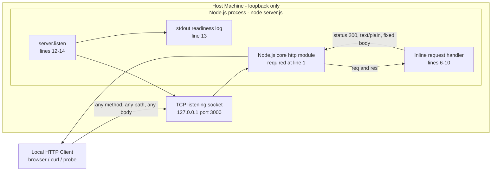
```mermaid
flowchart LR
    Client["Local HTTP Client<br/>browser / curl / probe"]

    subgraph HostBoundary["Host Machine - loopback only"]
        Socket["TCP listening socket<br/>127.0.0.1 port 3000"]

        subgraph NodeProcess["Node.js process - node server.js"]
            CoreHTTP["Node.js core http module<br/>required at line 1"]
            Handler["Inline request handler<br/>lines 6-10"]
            Listener["server.listen<br/>lines 12-14"]
            Stdout["stdout readiness log<br/>line 13"]
        end
    end

    Client -->|"any method, any path, any body"| Socket
    Socket --> CoreHTTP
    CoreHTTP -->|"req and res"| Handler
    Handler -->|"status 200, text/plain, fixed body"| CoreHTTP
    CoreHTTP --> Client
    Listener --> Socket
    Listener --> Stdout
```

#### 1.2.2.3 Core Technical Approach

The technical approach is defined as much by its deliberate omissions as by its constructs:

- **Single-file CommonJS entrypoint.** `require('http')` (line 1) establishes CommonJS as the module system; there is no `package.json` declaring `"type": "module"`, no ESM syntax, and no transpilation step. The file is executed exactly as committed.
- **Side-effect-driven startup.** The module exports nothing. Loading it *is* starting the server, because `server.listen(...)` executes at the top level (line 12). There is no bootstrap function, dependency-injection container, or lifecycle framework.
- **Node.js core primitives only, with no framework layer.** The `http` module is used directly — no Express, Koa, Fastify, or Nest abstraction, and consequently no middleware pipeline, router, or plugin system.
- **Stateless, synchronous request handling.** The handler performs three synchronous statements and returns; there is no `async`/`await`, Promise, callback chain, in-memory store, session, or cache. Because nothing is retained between requests, concurrent requests cannot interfere with one another.
- **Request-agnostic response generation.** The handler signature declares `req`, but no property of it is ever read. Method, URL, query string, headers, and body are all discarded, which is why the response is byte-identical across every probe performed.
- **Loopback-scoped exposure as an intentional default.** Passing `'127.0.0.1'` as the `listen` host (line 12) confines reachability to the local machine; this was confirmed empirically when a request via the host's routable address was refused.

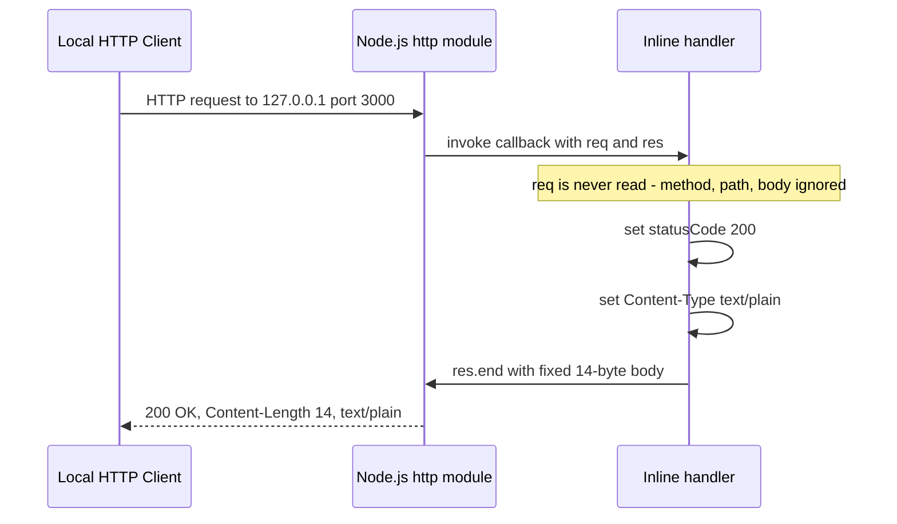
```mermaid
sequenceDiagram
    participant C as Local HTTP Client
    participant N as Node.js http module
    participant H as Inline handler
    C->>N: HTTP request to 127.0.0.1 port 3000
    N->>H: invoke callback with req and res
    Note over H: req is never read - method, path, body ignored
    H->>H: set statusCode 200
    H->>H: set Content-Type text/plain
    H->>N: res.end with fixed 14-byte body
    N-->>C: 200 OK, Content-Length 14, text/plain
```

### 1.2.3 Success Criteria

#### 1.2.3.1 Declared Criteria in the Repository

The repository **defines no success criteria of any kind**. This is an audited finding, not an inference: there are no automated tests, no coverage thresholds, no CI pipeline or merge gates, no benchmark or load-test harness, no performance budget, no service-level objective or agreement, no monitoring or alerting configuration, and no acceptance-criteria documentation. `README.md` states nothing beyond the repository name.

Accordingly, **no KPI, SLA, error budget, latency target, or throughput target is attributed to this system in this specification**, because none exists to report.

#### 1.2.3.2 Derived Objectives Verifiable Against the Implementation

In the absence of declared criteria, the following objectives are derived strictly from what `server.js` does, and each was verified during documentation. They should be read as *observed behavioral guarantees of the current code*, not as commitments made by the project.

| Derived Objective | Verification Method | Observed Result |
|-------------------|---------------------|-----------------|
| Process starts without external setup | Run `node server.js` from the repository root with no prior install step | Started successfully; no dependency resolution required |
| Readiness is signalled unambiguously | Capture process stdout | Exactly one line: `Server running at http://127.0.0.1:3000/` |
| Endpoint answers with HTTP 200 | `GET http://127.0.0.1:3000/` | `HTTP/1.1 200 OK` |
| Response content type is plain text | Inspect response headers | `Content-Type: text/plain` |
| Response payload is exact and fixed | Compare body bytes across requests | `Hello, World!` plus newline; `Content-Length: 14` every time |
| Behavior is uniform across methods and paths | Probe `GET /`, `POST /any/deep/path?q=1` with a body, and `DELETE /x` | All three returned identical `200` / `text/plain` / 14-byte responses |
| Exposure is confined to the local host | Request the same port via the host's non-loopback address | Connection refused — no external exposure |

#### 1.2.3.3 Critical Success Factors

The prerequisites for the system to function are minimal and follow directly from its construction:

| Factor | Why It Is Required |
|--------|--------------------|
| A Node.js runtime providing the core `http` module | `require('http')` at line 1 is the only dependency; the repository declares no version floor, so any Node.js release exposing `http` suffices |
| TCP port `3000` free on the host | The port is a hard-coded constant (line 4) with no fallback and no `server.on('error')` handler, so a conflict fails the process outright |
| An available loopback interface | The bind address `127.0.0.1` (line 3) is not configurable |
| Client access from the same host | Loopback binding excludes remote callers, as confirmed by probe |
| Direct file execution | With no `package.json` scripts, the only supported launch path is invoking the file directly with `node` |

#### 1.2.3.4 Key Performance Indicators

The repository specifies **no KPIs and captures no metrics**: there is no instrumentation library, metrics endpoint, structured logger, or telemetry export in `server.js`, and no monitoring configuration in the tree. The only machine-observable signals the system emits are enumerated below; they are indicators of *liveness and correctness*, not performance measurements, and any quantitative performance figure would be a property of the host and Node.js runtime rather than of this code.

| Observable Signal | Source | What It Indicates |
|-------------------|--------|-------------------|
| Startup log line on stdout | `console.log` at line 13 | The listener bound successfully and the service is ready |
| HTTP status code returned | `res.statusCode = 200` at line 7 | Correct operation; the code contains no path that yields any other status |
| Response body length of 14 bytes | `res.end('Hello, World!\n')` at line 9 | Payload integrity — the response is complete and unmodified |
| Process exit or absent listener | Operating-system process state | The only available failure indicator, since no error handler or health endpoint exists |

## 1.3 Scope

Scope below is stated descriptively: it delimits what the committed code **does** and what it demonstrably **does not** do. The repository contains no requirements document, backlog, or roadmap, so scope is reconstructed from the implementation in `server.js`, the contents of `README.md`, and the repository-wide artifact audit.

### 1.3.1 In-Scope

#### 1.3.1.1 Core Features and Functionalities

Four behaviors constitute the entire delivered functionality. All are implemented within the 14 lines of `server.js` and were confirmed by executing the server.

| Must-Have Capability | Implementation Point | Scope Note |
|----------------------|----------------------|------------|
| Create an HTTP server instance | `http.createServer(handler)` — line 6 | Uses the Node.js core `http` module directly; no framework wrapper is in scope |
| Bind and listen on a fixed local endpoint | `server.listen(port, hostname, cb)` — line 12, with constants at lines 3–4 | `127.0.0.1:3000` only; alternate hosts, ports, or protocols are not in scope |
| Return a fixed successful response to every request | `res.statusCode = 200`, `res.setHeader('Content-Type', 'text/plain')`, `res.end('Hello, World!\n')` — lines 7–9 | One status code, one content type, one 14-byte payload |
| Emit a startup readiness signal | `console.log` with a template literal — line 13 | A single stdout line; no per-request or structured logging is in scope |

#### 1.3.1.2 Primary User Workflow

The system supports exactly **one** end-to-end workflow. Because `server.js` exports nothing and no `package.json` scripts exist, direct invocation is the only supported entry path.

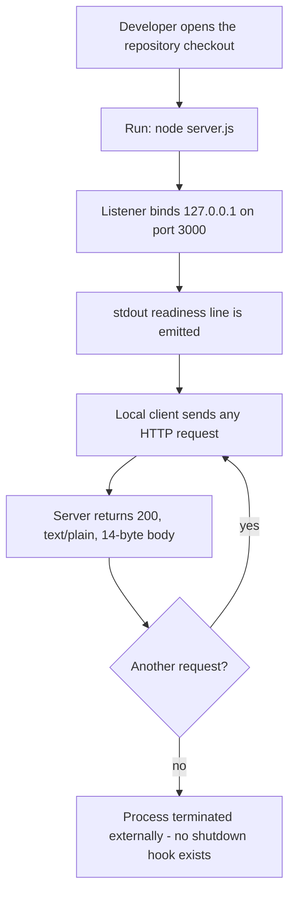
```mermaid
flowchart TD
    A["Developer opens the repository checkout"] --> B["Run: node server.js"]
    B --> C["Listener binds 127.0.0.1 on port 3000"]
    C --> D["stdout readiness line is emitted"]
    D --> E["Local client sends any HTTP request"]
    E --> F["Server returns 200, text/plain, 14-byte body"]
    F --> G{"Another request?"}
    G -->|"yes"| E
    G -->|"no"| H["Process terminated externally - no shutdown hook exists"]
```

Two operator-facing observations are in scope for this workflow: the readiness line on stdout confirms successful binding, and any HTTP response received confirms correct operation. Nothing else is surfaced.

#### 1.3.1.3 Essential Integrations

The integration surface in scope is a single runtime dependency.

| In-Scope Integration | Nature of the Coupling |
|----------------------|------------------------|
| Node.js core `http` module | Required at line 1; supplies HTTP parsing, socket management, keep-alive handling, and default response headers (`Content-Length`, `Date`, `Connection`, `Keep-Alive`) |
| Host operating system TCP/IP loopback interface | Provides the `127.0.0.1` address that `server.listen` binds |
| Host stdout stream | Destination for the single readiness log line |

No other integration is in scope: the repository contains no third-party package, no database or cache client, no outbound HTTP client, no identity provider, no message broker, and no configuration or secret-management service.

#### 1.3.1.4 Key Technical Requirements

| Requirement | Basis in the Repository |
|-------------|-------------------------|
| A Node.js runtime exposing the core `http` module | The sole `require` in `server.js`; no version floor is declared anywhere (no `engines` field, no `.nvmrc`) |
| CommonJS module resolution | `require('http')` with no `"type": "module"` declaration and no ESM syntax present |
| TCP port `3000` available on the host | Hard-coded constant with no fallback logic and no `error` event handler |
| Loopback interface available | Hard-coded bind address `127.0.0.1` |
| Direct execution of the source file | No build, transpile, or install step exists; the file runs as committed via `node server.js` |
| Client access originating on the same host | Confirmed by probe — the port is not reachable via the host's routable address |

#### 1.3.1.5 Implementation Boundaries

**System boundary.** The system is one operating-system process running one CommonJS module. The boundary is the listening TCP socket at `127.0.0.1:3000`. Everything inside the boundary is the code in `server.js` plus the Node.js `http` machinery it invokes; everything outside — clients, proxies, orchestrators, other services — is external and unmanaged by this repository.

| Boundary Dimension | In-Scope Extent |
|--------------------|-----------------|
| Process and deployment unit | A single foreground `node` process; no clustering, worker threads, child processes, or multi-instance topology exists in the code |
| Network reach | The loopback interface of one host, port `3000`, plain HTTP only |
| Protocol surface | HTTP request/response with a single uniform reply; no WebSocket upgrade, HTTP/2, gRPC, or streaming behavior is implemented |
| Interface contract | One implicit endpoint matching every method and path, always answering `200` with `text/plain` |

**User groups covered.** The code models **no users, roles, or permissions** — no request attribute is inspected, so no caller can be identified or differentiated. Every caller is anonymous and receives identical treatment. In practical terms the covered population is "any process able to open a socket on the host's loopback interface," and the operational audience is the developer or operator who starts and stops the process.

**Geographic and market coverage.** There is no geographic dimension in scope. The repository contains no internationalization or localization resources, no locale or timezone handling, no `Accept-Language` processing (no request header is read at all), and no region, CDN, or multi-zone configuration. The response is a fixed ASCII English string, and coverage is limited to the single host on which the process runs.

**Data domains included.** No persistent data domain is in scope. The complete data inventory of the running system is:

| Data Element | Lifetime and Handling |
|--------------|----------------------|
| Inbound HTTP request (method, URL, headers, body) | Received by the `http` module, never read by application code, and discarded |
| Outbound response body — `Hello, World!\n` | A literal constant in source; identical for every request |
| Startup log line | Written once to stdout at listener binding |

There is no schema, model, migration, storage engine, or serialization format in the repository, and no personal, financial, or otherwise sensitive data is accepted, processed, or retained.

### 1.3.2 Out-of-Scope

#### 1.3.2.1 Explicitly Excluded Features and Capabilities

Each exclusion below was confirmed by direct search of `server.js` or by testing for the existence of the corresponding project artifact; none were present.

| Excluded Capability Area | Confirmation of Absence |
|--------------------------|-------------------------|
| Routing, multiple endpoints, method dispatch | No conditional logic and no `req.url`/`req.method` access anywhere in the handler |
| Request parsing — query strings, headers, bodies, cookies, uploads | No `req.*` property is read; a `POST` body sent during testing was ignored entirely |
| Dynamic, templated, or negotiated content | The response body is a source-code literal; no template engine or content negotiation exists |
| Externalized configuration and environment profiles | No `process.env` access, `.env` file, `config/` directory, or CLI argument parsing |
| Transport security (HTTPS/TLS), certificates, HSTS | Only the `http` module is used; no `https`/`tls` usage or certificate material |
| Authentication, authorization, session management | No credential handling, token verification, or access-control logic |
| Data persistence, caching, and state management | No database or cache client, no `fs` usage, no in-memory store |
| Error handling, retries, circuit breaking, graceful shutdown | No `try`/`catch`, no `server.on('error')`, no `process.on('SIGTERM'/'SIGINT')`, no `server.close()` |
| Automated testing and coverage enforcement | No test directory and no Jest/Vitest/Mocha configuration; the module exports nothing, so it cannot be imported for unit testing. The root-level `test.js` added by commit `43ed37c` does not change this: it contains no test, no assertion, and no framework — only two undefined bare words — and it throws on execution (1.1.1, 6.6.1) |
| Linting, formatting, and type checking | No ESLint, Prettier, `.editorconfig`, `tsconfig.json`, or `jsconfig.json` |
| Dependency and release management | No `package.json`, lockfile, `node_modules/`, or version metadata; the artifact is unversioned |
| Build, bundling, and transpilation | No bundler config, Babel config, or `Makefile` |
| CI/CD pipelines and quality gates | No `.github/`, `.gitlab-ci.yml`, `Jenkinsfile`, `azure-pipelines.yml`, or `.circleci/` |
| Containerization, orchestration, and infrastructure as code | No `Dockerfile`, `docker-compose.*`, Kubernetes/Helm manifests, Terraform, `Procfile`, or serverless descriptor |
| Observability — structured logs, metrics, tracing, health endpoints | Only one `console.log` at startup; no instrumentation library or metrics surface |
| Rate limiting, CORS policy, security response headers, input validation | No such logic exists, and nothing is read that could be validated |
| Static asset serving, WebSockets, HTTP/2, streaming | Not implemented; the handler ends the response immediately with a fixed buffer |
| API documentation, OpenAPI/schema definitions, client SDKs | No specification file or documentation beyond the one-line `README.md` |
| Internationalization and localization | No locale resources, message catalogs, or `Accept-Language` handling |
| Horizontal scaling, clustering, load balancing | No `cluster`/`worker_threads` usage and no multi-instance or proxy configuration |
| Licensing and project governance | No `LICENSE`, `CONTRIBUTING.md`, `CODE_OF_CONDUCT.md`, `CODEOWNERS`, or `SECURITY.md` |

#### 1.3.2.2 Future Phase Considerations

The repository declares **no future phases**. There is no roadmap, milestone list, `TODO`/`FIXME` comment, `CHANGELOG.md`, backlog file, or design note anywhere in the tree, and the history consists of only three commits — two made eleven seconds apart on 2026-07-29 and one on 2026-07-30. That third commit (`43ed37c` "Create test.js") adds no roadmap, requirement, or capability: it introduces a 13-byte placeholder file that is not part of the application and that fails if executed. Any subsequent capability would therefore be entirely net-new work rather than a planned continuation.

For clarity, the structural gaps that a follow-on effort would most likely need to address — externalizing the host and port, exporting the server for testability, adding error handling and shutdown hooks, and introducing dependency and packaging metadata — are documented in this specification as **present-state absences (see 1.2.1.2), not as commitments, plans, or approved future scope**.

#### 1.3.2.3 Integration Points Not Covered

No integration point is covered beyond the Node.js runtime, the host loopback interface, and stdout. Specifically excluded, with absence verified in `server.js`: relational and NoSQL databases, caches and key–value stores, message brokers and event streams, outbound REST/GraphQL/gRPC calls to third-party or internal services, identity providers and secret managers, feature-flag and remote-configuration services, email/SMS/notification providers, payment or billing systems, object storage and file systems, service discovery and service meshes, API gateways and reverse proxies, and monitoring or log-aggregation backends. The GitHub remote recorded in `.git/config` is source hosting only and carries no runtime integration.

#### 1.3.2.4 Unsupported Use Cases

| Unsupported Use Case | Reason Grounded in the Implementation |
|----------------------|---------------------------------------|
| Serving traffic from other hosts or from the public internet | The `127.0.0.1` bind was empirically confirmed to refuse connections via the host's routable address |
| Production or internet-facing deployment | No TLS, authentication, error handling, rate limiting, health endpoint, packaging, or deployment descriptor exists |
| Building an application with more than one endpoint or response | The handler has no branching and reads no request attribute |
| Environment-specific operation (dev/staging/prod) | Host and port are compile-time constants with no configuration source |
| Multi-tenant or per-user behavior | No user, tenant, or session concept exists in the code |
| Unit or integration testing within a test harness | The module has no exports and binds a socket as a load-time side effect; the tracked `test.js` is not a harness and exercises nothing |
| Automated release, rollback, or zero-downtime restart | No versioning, packaging, or shutdown handling; the process can only be stopped abruptly |
| Handling port contention or transient socket failures | No `error` event handler and no port fallback; such conditions fail the process |
| Reuse as a library or dependency of another project | No `package.json` and no exported API; the file can only be executed |
| Redistribution under defined legal terms | No `LICENSE` file grants any rights |

## 1.4 References

### 1.4.1 Repository Files Examined

The repository contains exactly three non-VCS files, totalling 382 bytes, all of which were read in full. Coverage of the source tree is therefore complete.

- `server.js` — The entire application. Established the CommonJS `require('http')` dependency (line 1), the hard-coded `hostname = '127.0.0.1'` and `port = 3000` constants (lines 3–4), the `http.createServer` inline request handler with its unconditional `200` status, `Content-Type: text/plain` header, and fixed `Hello, World!\n` body (lines 6–10), and the load-time `server.listen` call with its stdout readiness log (lines 12–14). Also established, by targeted search, the absence of request inspection, routing, error handling, graceful shutdown, module exports, environment configuration, TLS, authentication, persistence, and outbound integrations.
- `README.md` — Established that project documentation consists solely of the level-one heading `# July2026_hello_world_repo` (27 bytes, no trailing newline), with no setup, usage, prerequisite, API, architecture, licensing, or business content.
- `test.js` — Read in full: 13 bytes over two newline-terminated lines containing the bare words `asdsa` and `asdasd`. Established that it is **not application code**: it declares nothing, exports nothing, is required by no file, and holds no test, assertion, or framework reference. `node --check test.js` exits 0 (the two lines are syntactically valid expression statements), while executing it throws `ReferenceError: asdsa is not defined` and exits 1.

### 1.4.2 Repository Structure and Metadata

- `` (repository root) — Established the complete first-order inventory: `server.js`, `README.md`, and `test.js` (382 bytes in total), with **no source subdirectories**. Corroborated independently by the folder listing, a filesystem walk, and `git ls-files`.
- `.git/` — Version-control metadata. Established the three-commit history (`241598b` "Initial commit" adding `README.md` and `06492d7` "Add files via upload" adding `server.js`, both 2026-07-29; `43ed37c` "Create test.js" adding `test.js`, 2026-07-30 — all three authored by `lakshya-blitzy <lakshya@blitzy.com>`, committed by `GitHub <noreply@github.com>`, and signed server-side), the clean working tree, the current branch `2907_01` at HEAD `43ed37c`, zero tags, and the `origin` remote pointing at the GitHub repository `lakshya-blitzy/July2026_hello_world_repo`. The branches have diverged: `main` (= `origin/main`) is at `06492d7` with two tracked files, while `2907_01` (= `origin/2907_01`) is one commit ahead at `43ed37c` with three.

### 1.4.3 Verified Absent Artifacts

The following conventional paths were each individually tested for existence and **none were present**. Their absence is the evidentiary basis for the corresponding statements throughout 1.1–1.3.

| Category | Paths Tested (all absent) |
|----------|---------------------------|
| Dependency and runtime metadata | `package.json`, `package-lock.json`, `npm-shrinkwrap.json`, `yarn.lock`, `pnpm-lock.yaml`, `bun.lockb`, `node_modules/`, `.npmrc`, `.nvmrc`, `.node-version` |
| Build, type, and code quality | `tsconfig.json`, `jsconfig.json`, `.babelrc`, `webpack.config.js`, `rollup.config.js`, `Makefile`, `.eslintrc*`, `eslint.config.js`, `.prettierrc*`, `.editorconfig` |
| Testing and coverage | `test/`, `tests/`, `__tests__/`, `spec/`, `jest.config.js`, `vitest.config.js`, `.mocharc.json`, `mocha.opts` |
| CI/CD | `.github/`, `.gitlab-ci.yml`, `.travis.yml`, `Jenkinsfile`, `azure-pipelines.yml`, `.circleci/` |
| Packaging, deployment, and IaC | `Dockerfile`, `Containerfile`, `docker-compose.yml`, `docker-compose.yaml`, `.dockerignore`, `k8s/`, `kubernetes/`, `helm/`, `terraform/`, `serverless.yml`, `vercel.json`, `Procfile`, `app.yaml` |
| Configuration | `.env`, `.env.example`, `config/` |
| Governance, legal, and documentation | `LICENSE`, `LICENSE.md`, `CONTRIBUTING.md`, `CODE_OF_CONDUCT.md`, `CODEOWNERS`, `SECURITY.md`, `CHANGELOG.md`, `docs/`, `.gitignore` |

No `.blitzyignore` file exists in the repository or elsewhere on the inspected filesystem, so no path exclusions applied to this investigation.

### 1.4.4 Runtime Verification Performed

Behavioral claims in 1.1.4, 1.2.2.1, 1.2.3.2, and 1.3.1 were confirmed by executing the committed source and probing it:

| Verification | Result Established |
|--------------|--------------------|
| Executed `node server.js` and captured stdout | Single readiness line `Server running at http://127.0.0.1:3000/`, matching line 13 |
| `GET http://127.0.0.1:3000/` with full header inspection | `HTTP/1.1 200 OK`, `Content-Type: text/plain`, `Content-Length: 14`, `Connection: keep-alive`, `Keep-Alive: timeout=5`, body `Hello, World!` plus newline — confirming that only status and `Content-Type` originate in application code |
| `POST http://127.0.0.1:3000/any/deep/path?q=1` with a request body | Byte-identical `200` response, confirming method, path, query string, and body are ignored |
| `DELETE http://127.0.0.1:3000/x` | `200`, 14 bytes, `text/plain` — confirming uniform behavior across HTTP verbs |
| Request to port `3000` via the host's non-loopback address | Connection refused, confirming loopback-only exposure from the `127.0.0.1` bind |

### 1.4.5 External Sources

- [web] nodejs.org — Confirmed that `http` is a Node.js built-in module and that the project's own published "Create an HTTP Server" example is functionally equivalent to this repository's server (status `200`, `text/plain`, Hello World body, port `3000` on `127.0.0.1`), differing chiefly in module system.
- [web] nodejs.org release blog and github.com/nodejs/node/releases — Confirmed the Node.js release lines cited in 1.2.1.3: 24.x "Krypton" as the Active LTS line (maintained through April 2028) and 26.x as the Current line. Cited as external runtime context only; the repository itself declares no runtime version constraint.
- [web] endoflife.date/nodejs — Corroborated the Node.js LTS/maintenance lifecycle model referenced when noting the absence of a declared engine range.

### 1.4.6 Cross-Section References

No other Technical Specification sections were available for cross-referencing at the time this section was authored; the list of retrievable sections supplied to this task was empty. All content in Section 1 is derived exclusively from the repository evidence enumerated above.

# 2. Product Requirements

## 2.1 Feature Catalog

This catalog decomposes `July2026_hello_world_repo` into the discrete, individually testable features that the committed code actually delivers. The repository contains exactly three tracked files totalling 382 bytes — `server.js` (342 bytes, 14 lines), `README.md` (27 bytes, 1 line), and `test.js` (13 bytes, 2 lines) — of which only `server.js` executes any behavior, so the whole feature set resides in a single module.

`test.js` is deliberately **outside this catalog**. It contributes no observable behavior: it is two undefined bare words, it exports nothing, no file requires it, no documented procedure executes it, and running it fails immediately (`ReferenceError: asdsa is not defined`, exit 1). It therefore satisfies no capability, bears no requirement, and appears in Section 2 only where its existence must be acknowledged (2.5.5, 2.6).

### 2.1.1 Catalog Derivation Basis and Conventions

#### 2.1.1.1 Derivation Basis

The repository contains **no product-requirements source of any kind**. The following requirement-bearing artifacts were each individually tested for existence and none are present: `requirements.md`, `PRD.md`, `ROADMAP.md`, `TODO.md`, `CHANGELOG.md`, `docs/`, `openapi.yaml`, `openapi.json`, `swagger.json`, any issue-tracker export, and any test directory or test-runner configuration. A recursive search for `TODO`, `FIXME`, `XXX`, and `HACK` markers across all `.js` and `.md` files returned no matches, `README.md` contains only the heading `# July2026_hello_world_repo`, and `test.js` contains only the two bare words `asdsa` and `asdasd`.

Consequently every feature and requirement below is **reverse-derived** from two evidence sources only:

| Evidence Source | What It Establishes |
|-----------------|---------------------|
| Line-level reading and grep audit of `server.js` | Which behaviors exist in code, and — equally important — which do not |
| Execution of the committed source and HTTP probing of the running process | The observable contract used to write measurable acceptance criteria |

Features are aligned one-to-one with the capability inventory already established in **1.2.2.1 Primary System Capabilities** and **1.3.1.1 Core Features and Functionalities**, so that Section 1 scope and Section 2 requirements describe the same four delivered behaviors plus the runtime/execution model that carries them.

#### 2.1.1.2 Metadata Conventions

Because the repository declares no priorities, statuses, or acceptance targets, the metadata scales used in this section are defined explicitly and applied consistently:

| Convention | Definition Applied in This Section |
|------------|-----------------------------------|
| Feature ID | `F-XXX`, assigned in startup-order of the code path (dependency acquisition → instantiation → binding → response → logging) |
| Priority — Critical | Removing the feature makes it impossible for the system to answer any HTTP request |
| Priority — High | The response contract would survive, but the only supported launch path for the artifact as committed would be lost |
| Priority — Medium | The response contract and launch path remain intact; only the operator-visible signal is lost |
| Priority — Low | Not assigned — no feature in this repository has this little impact |
| Status — Completed | Implemented by commit `06492d7`, which added `server.js` and is now the parent of HEAD (`43ed37c`), and empirically verified by execution and probing. `server.js` is byte-identical at both commits (blob `320a75a`), so every acceptance criterion below is equally valid at HEAD |
| Status — Proposed / Approved / In Development | Not assigned — the repository has no tracker, board, roadmap, or branch of in-flight work (three commits, clean tree, zero tags), and the one commit made after `06492d7` added the non-application `test.js` |
| Business Value entries | The repository contains **no** business, market, or value documentation; every "Business Value" statement below is explicitly labelled as derived engineering value and asserts nothing commercial |

### 2.1.2 Feature Inventory Summary

| Feature ID | Feature Name | Category |
|------------|--------------|----------|
| F-001 | HTTP Server Instantiation and Request-Handler Registration | Core Request Processing |
| F-002 | Fixed Loopback Endpoint Binding and Listener Lifecycle | Network Interface and Service Lifecycle |
| F-003 | Uniform Fixed-Payload HTTP Response | Response Contract and Content Delivery |
| F-004 | Startup Readiness Logging | Observability |
| F-005 | Zero-Dependency Direct Execution Model | Runtime, Dependency and Packaging Model |

| Feature ID | Priority | Status | Implementation Locus |
|------------|----------|--------|----------------------|
| F-001 | Critical | Completed | `server.js` lines 6–10 |
| F-002 | Critical | Completed | `server.js` lines 3–4, 12–14 |
| F-003 | Critical | Completed | `server.js` lines 7–9 |
| F-004 | Medium | Completed | `server.js` line 13 |
| F-005 | High | Completed | `server.js` line 1, plus repository-wide absence of manifests and build tooling |

All five features are contained in one file, one process, and one module; there is no second deployable unit, no service boundary between features, and no feature flag or conditional path that could disable any of them at runtime. The second tracked `.js` file, `test.js`, implements none of them.

### 2.1.3 F-001: HTTP Server Instantiation and Request-Handler Registration

#### 2.1.3.1 Feature Metadata

| Attribute | Value | Evidence |
|-----------|-------|----------|
| Unique ID | F-001 | Assigned by this specification |
| Feature Name | HTTP Server Instantiation and Request-Handler Registration | — |
| Feature Category | Core Request Processing | Derived from the code's role |
| Priority Level | Critical | Without the server object and its handler, no request can be accepted or answered |
| Status | Completed | `server.js` lines 6–10; verified by probing the running process |

#### 2.1.3.2 Description

**Overview.** The feature creates the single `http.Server` instance that accepts every inbound connection and registers exactly one inline arrow-function handler to service them. A grep of `server.js` confirms a single `createServer` call and a single handler; there is no router, middleware chain, plugin registry, or secondary handler anywhere in the repository.

```javascript
// server.js line 6 - the only handler registration in the repository
const server = http.createServer((req, res) => {
```

**Business Value (derived engineering value — no business documentation exists in the repository).** The feature supplies the minimum viable request-acceptance layer for a Node.js service: the complete request path is four lines long and reviewable in a single pass, which makes the artifact usable as a known-good baseline or teaching reference without any framework knowledge.

**User Benefits.** For the local HTTP client, every request is accepted and answered with no negotiation, credential, or configuration prerequisite. For the developer or operator, the absence of dispatch logic means there is no route-matching failure mode to diagnose — a connected request is always a serviced request.

**Technical Context.** The handler is invoked by the Node core `http` module with the standard `(req, res)` pair. The `req` parameter is declared but **never dereferenced** — a grep for `req.<property>` returns no match — so method, URL, query string, headers, and body are structurally unreachable by application logic. The handler body is three synchronous statements with no branching, no `async`/`await`, no Promise, and no timer; probing confirmed 50 sequential requests produced exactly one unique response and 100 requests issued at concurrency 20 all returned `200`.

#### 2.1.3.3 Dependencies

| Dependency Type | Detail | Evidence |
|-----------------|--------|----------|
| Prerequisite Features | F-005 — the `http` module binding must be established before `createServer` can be called | `server.js` line 1 precedes line 6 |
| System Dependencies | Node.js runtime supplying the core `http` module and its single-threaded event loop, which parses requests and invokes the handler | `require('http')` at line 1; handler invocation is entirely runtime-driven |
| External Dependencies | None — zero third-party packages | Only one `require` exists in the repository; no `package.json`, lockfile, or `node_modules/` |
| Integration Requirements | Consumes the `req`/`res` objects created by the Node HTTP parser and returns control to the module for serialization; F-002 must bind a socket before the handler is ever invoked | `server.listen(...)` at line 12 activates the instance created at line 6 |

### 2.1.4 F-002: Fixed Loopback Endpoint Binding and Listener Lifecycle

#### 2.1.4.1 Feature Metadata

| Attribute | Value | Evidence |
|-----------|-------|----------|
| Unique ID | F-002 | Assigned by this specification |
| Feature Name | Fixed Loopback Endpoint Binding and Listener Lifecycle | — |
| Feature Category | Network Interface and Service Lifecycle | Derived from the code's role |
| Priority Level | Critical | Without the `listen` call no socket exists and the service is unreachable |
| Status | Completed | `server.js` lines 3–4 and 12–14; verified by binding, probing, and termination tests |

#### 2.1.4.2 Description

**Overview.** The feature activates the server instance on a fixed local endpoint — `127.0.0.1` port `3000` — at module load. Both values are module-scoped literal constants (lines 3–4); the `listen` call at line 12 is a top-level statement, so **loading the module is starting the service**. The same two constants also feed the readiness message of F-004, so the advertised endpoint cannot drift from the bound endpoint.

**Business Value (derived engineering value — no business documentation exists in the repository).** Binding to the loopback interface by default confines the service to the host that starts it, which was empirically confirmed: a request to the host's non-loopback address on port `3000` failed to connect. This makes the artifact safe to run on a workstation without exposing an unauthenticated endpoint to a network.

**User Benefits.** A single command yields a reachable endpoint at a predictable, documented address with no configuration file, environment variable, or flag to supply. The operator can rely on the address being identical on every host and every run.

**Technical Context.** The feature also determines the system's complete lifecycle behavior, all of it inherited from Node defaults because the code registers no lifecycle handlers. There is no `server.on('error', ...)`, no `process.on('SIGTERM'/'SIGINT')`, and no `server.close()` anywhere in the file. Two measurements characterize the resulting behavior: starting a second instance while port `3000` was already bound terminated the new process with an unhandled `error` event (`Error: listen EADDRINUSE: address already in use 127.0.0.1:3000`, `code: 'EADDRINUSE'`) and **exit code 1**; and `SIGTERM` terminated the running process immediately, after which the port stopped accepting connections with no draining of in-flight work.

#### 2.1.4.3 Dependencies

| Dependency Type | Detail | Evidence |
|-----------------|--------|----------|
| Prerequisite Features | F-001 — `listen` is called on the instance returned by `createServer`; F-005 — module execution is what triggers the bind | Lines 6 and 12; top-level statement order |
| System Dependencies | Host TCP/IP stack with an available loopback interface, and TCP port `3000` free at start time | Bind address literal at line 3; EADDRINUSE crash observed when the port was occupied |
| External Dependencies | None — no reverse proxy, ingress controller, service registry, or orchestrator is referenced anywhere in the repository | No deployment, container, or IaC descriptor exists |
| Integration Requirements | The listening socket at `127.0.0.1:3000` is the system's only inbound interface; F-004 is triggered by this feature's `listen` callback | Line 12 callback contains line 13 |

### 2.1.5 F-003: Uniform Fixed-Payload HTTP Response

#### 2.1.5.1 Feature Metadata

| Attribute | Value | Evidence |
|-----------|-------|----------|
| Unique ID | F-003 | Assigned by this specification |
| Feature Name | Uniform Fixed-Payload HTTP Response | — |
| Feature Category | Response Contract and Content Delivery | Derived from the code's role |
| Priority Level | Critical | This is the system's sole delivered output; without it the service returns nothing |
| Status | Completed | `server.js` lines 7–9; verified across five HTTP methods and multiple paths |

#### 2.1.5.2 Description

**Overview.** Every request receives an identical response: HTTP status `200`, header `Content-Type: text/plain`, and the exact 14-byte body `Hello, World!` followed by a newline. A grep for every response-mutating API (`statusCode`, `setHeader`, `writeHead`, `res.end`) returns only lines 7, 8, and 9, which proves the response contract is fully described by three statements.

```javascript
// server.js lines 7-9 - the complete response contract
res.statusCode = 200;
res.end('Hello, World!\n');
```

**Business Value (derived engineering value — no business documentation exists in the repository).** Determinism is the value: because the payload is a source-code literal and no request attribute influences it, the endpoint is a stable, byte-exact target for connectivity checks, runtime validation, and reachability smoke tests. Body uniqueness was confirmed across 50 sequential requests.

**User Benefits.** The client needs no schema, content negotiation, parser, or error branch — a successful connection always yields the same parsable plain-text result. The response is also self-describing in that its content type is declared explicitly rather than left to client sniffing.

**Technical Context.** Application code sets only the status code and one header; the framing headers observed on the wire — `Content-Length: 14`, `Date`, `Connection: keep-alive`, and `Keep-Alive: timeout=5` — are generated by the Node `http` module's defaults, not by `server.js`. Node's own protocol handling also produces one measured edge behavior the application does not author: a `HEAD` request returns status `200` with `Content-Type: text/plain` and a zero-byte body.

#### 2.1.5.3 Dependencies

| Dependency Type | Detail | Evidence |
|-----------------|--------|----------|
| Prerequisite Features | F-001 — the `res` object is supplied only by the registered handler's invocation | Handler parameters at line 6 |
| System Dependencies | Node core `http` module for header serialization, `Content-Length` computation, and keep-alive management | Observed headers absent from source but present on the wire |
| External Dependencies | None — no template engine, serializer, i18n catalog, or content source; the payload is a string literal | Line 9; no other executable file exists in the repository |
| Integration Requirements | Delivers bytes back through the same socket F-002 bound; requires no downstream call, cache, or datastore | No outbound client, `fs`, or database code exists in `server.js` |

### 2.1.6 F-004: Startup Readiness Logging

#### 2.1.6.1 Feature Metadata

| Attribute | Value | Evidence |
|-----------|-------|----------|
| Unique ID | F-004 | Assigned by this specification |
| Feature Name | Startup Readiness Logging | — |
| Feature Category | Observability | Derived from the code's role |
| Priority Level | Medium | Removing it would leave the HTTP contract and launch path intact, but eliminate the only operator-facing signal |
| Status | Completed | `server.js` line 13; verified byte-exactly on a clean start |

#### 2.1.6.2 Description

**Overview.** When the listener binds successfully, the `listen` callback writes exactly one line to stdout: `Server running at http://127.0.0.1:3000/`. A fresh run produced stdout of exactly **41 bytes** — the message plus its newline — and an empty stderr. This single line is the entirety of the system's instrumentation.

**Business Value (derived engineering value — no business documentation exists in the repository).** The line provides an unambiguous, machine-greppable readiness signal, which is what allows the artifact to serve as a runtime installation check: seeing the line proves that the Node runtime loaded, the module executed, and the socket bound.

**User Benefits.** The operator learns both *that* the service is ready and *where* to reach it from one line of output, with no log configuration, verbosity flag, or health endpoint to consult.

**Technical Context.** The message is built with a template literal that interpolates the same `hostname` and `port` constants used by the `listen` call, so the advertised URL is structurally guaranteed to match the bound endpoint. Logging is confined to this event: after more than 150 probe requests, stdout remained 41 bytes, confirming there is no per-request logging, no error logging, no structured/JSON logger, and no metrics or tracing export.

#### 2.1.6.3 Dependencies

| Dependency Type | Detail | Evidence |
|-----------------|--------|----------|
| Prerequisite Features | F-002 — the message is emitted from the `listen` callback and therefore only after a successful bind | Line 12 callback wraps line 13 |
| System Dependencies | An attached and writable `process.stdout` stream; the global `console` | `console.log` at line 13 |
| External Dependencies | None — no logging library, log shipper, or aggregation backend appears anywhere in the repository | Single `require` in the repository is `http` |
| Integration Requirements | Consumers must read process stdout; no log file, syslog target, HTTP log sink, or structured format is offered | Clean run wrote nothing to stderr and created no files |

### 2.1.7 F-005: Zero-Dependency Direct Execution Model

#### 2.1.7.1 Feature Metadata

| Attribute | Value | Evidence |
|-----------|-------|----------|
| Unique ID | F-005 | Assigned by this specification |
| Feature Name | Zero-Dependency Direct Execution Model | — |
| Feature Category | Runtime, Dependency and Packaging Model | Derived from the repository's composition |
| Priority Level | High | The response contract would still work if launched another way, but this is the only launch path the repository supports as committed |
| Status | Completed | `server.js` line 1 plus the verified absence of all manifests and build tooling |

#### 2.1.7.2 Description

**Overview.** The system runs exactly as committed. `grep -c "require("` over `server.js` returns **1**, and that single import is the Node built-in `http` module; across the whole tracked inventory there is no ESM `import`, no third-party package, no `package.json`, no lockfile, and no `node_modules/`. There is likewise no `tsconfig.json`, bundler configuration, Babel configuration, or `Makefile`, so no install, build, or transpile step precedes execution.

**Business Value (derived engineering value — no business documentation exists in the repository).** Zero dependencies means zero supply-chain surface and zero version-resolution work: the artifact cannot break because of a transitive update, and it can be executed on any host with a Node runtime with no network access to a package registry.

**User Benefits.** A developer can clone and run the service with one command and no prerequisites beyond Node itself; a reviewer can audit 100 % of the executed code in one file.

**Technical Context.** Because `server.listen(...)` is a top-level statement, starting the listener is a **module-load side effect**. This was verified directly: requiring `server.js` from another script returned an object with zero own keys (`Object.keys(...)` was empty) and simultaneously attempted the port bind. The model therefore has two structural consequences documented as constraints in 2.4 — there is no exported API to import, inject, or unit-test, and there is no packaging metadata by which the artifact could be versioned, published, or consumed as a library. Operation is a single foreground process: the file contains no `cluster` or `worker_threads` usage, and one process served 100 concurrently issued requests during verification.

#### 2.1.7.3 Dependencies

| Dependency Type | Detail | Evidence |
|-----------------|--------|----------|
| Prerequisite Features | None — F-005 is the root of the feature dependency graph | Line 1 is the first executed statement |
| System Dependencies | A Node.js runtime that exposes the core `http` module and CommonJS resolution; no version floor is declared anywhere (no `engines`, no `.nvmrc`, no `.node-version`) | Verified on Node v22.23.1 as an environment fact only |
| External Dependencies | None whatsoever — no registry, no package, no build service, no container image | Repository-wide absence audit of 76 conventional paths returned zero matches |
| Integration Requirements | Launch by direct invocation of the file with the `node` binary; there is no `npm start` script, entry-point declaration, or process manager configuration | No `package.json` and no `Procfile` exist |

### 2.1.8 Candidate Features Evaluated and Excluded

The following capability areas were explicitly searched for and are **not** present in the repository, so no feature, requirement, or acceptance criterion is defined for them anywhere in Section 2. This list is the feature-level counterpart of the exclusions recorded in **1.3.2.1 Explicitly Excluded Features and Capabilities**.

| Excluded Candidate Area | Basis for Exclusion |
|-------------------------|---------------------|
| Routing, multiple endpoints, method dispatch | No branching and no `req.url`/`req.method` access in `server.js` |
| Request parsing — query strings, headers, bodies, cookies, uploads | No `req.<property>` access at all; a `POST` body and custom header were ignored during probing |
| Dynamic, templated, or content-negotiated responses | Response body is a source literal; no template engine or negotiation logic |
| Externalized configuration and environment profiles | No `process.env`, `.env`, `config/`, or CLI argument parsing |
| Transport security (HTTPS/TLS), certificates, security headers | Only the `http` module is required; no `https`/`tls` usage or certificate material |
| Authentication, authorization, session management | No credential, token, cookie, or session code |
| Input validation, rate limiting, CORS policy | Nothing is read that could be validated; no such middleware exists |
| Persistence, caching, and state management | No database or cache client, no `fs` usage, no in-memory store |
| Error handling, retries, circuit breaking, graceful shutdown | No `try`/`catch`, no `server.on('error')`, no signal handlers, no `server.close()` |
| Dedicated health, readiness, or metrics endpoints | The handler is uniform; no path is treated as a probe target |
| Structured logging, metrics, and tracing | Instrumentation is one `console.log` at startup |
| Automated testing and coverage enforcement | No test directory or runner configuration and nothing to import (the module exports nothing); the tracked `test.js` holds no test, no assertion, and no framework reference, and fails on execution |
| Linting, formatting, and type checking | No ESLint, Prettier, `.editorconfig`, or `tsconfig.json` |
| Dependency, packaging, and release management | No `package.json`, lockfile, version field, or git tag |
| Build, bundling, and transpilation | No bundler, Babel, or `Makefile` configuration |
| CI/CD pipelines and quality gates | No `.github/`, `.gitlab-ci.yml`, `Jenkinsfile`, `azure-pipelines.yml`, or `.circleci/` |
| Containerization, orchestration, and infrastructure as code | No `Dockerfile`, compose file, Kubernetes/Helm manifest, Terraform, or serverless descriptor |
| Static asset serving, WebSocket, HTTP/2, streaming | Handler ends the response immediately with a fixed buffer |
| API documentation, OpenAPI schema, client SDKs | No specification file; `README.md` contains only the repository name |
| Internationalization and localization | No locale resources and no `Accept-Language` handling |
| Clustering, horizontal scaling, load balancing | No `cluster`/`worker_threads` usage and no proxy or multi-instance configuration |
| Licensing and project governance | No `LICENSE`, `CONTRIBUTING.md`, `CODEOWNERS`, or `SECURITY.md` |

## 2.2 Functional Requirements Table

Twenty requirements are defined across the five catalogued features. Each one describes a behavior that is present in the committed source and that was confirmed by executing and probing the running process, so each is stated with an acceptance criterion that an independent reviewer can re-run.

### 2.2.1 Requirement Identification and Rating Conventions

| Convention | Definition Applied in This Section |
|------------|-----------------------------------|
| Requirement ID | `F-XXX-RQ-YYY`, where `F-XXX` is the parent feature and `YYY` is sequential within that feature |
| Priority — Must-Have | The behavior occurs unconditionally on every execution of the committed code and is required for the system's observable contract |
| Priority — Should-Have | The behavior is conditional (a failure or protocol edge path) or is inherited from Node `http`/runtime defaults rather than authored in `server.js` |
| Priority — Could-Have | Not assigned — the repository contains no optional, deferred, or feature-flagged behavior |
| Complexity — Low / Medium / High | Rated on authored implementation surface (statements plus branching). **All twenty requirements are Low**: none is implemented in more than three statements, none contains a conditional, and none involves a third-party library. No requirement in this repository qualifies as Medium or High |

Two conventions apply to every table below and are stated once here rather than repeated:

- **Verification posture.** The repository contains **no automated tests** — no `test/`, `tests/`, `__tests__/`, or `spec/` directory and no Jest, Vitest, or Mocha configuration exists. Every acceptance criterion is therefore an externally executable check (source inspection, process execution, or HTTP probe), not an assertion in a committed test suite.
- **Performance criteria.** The repository declares **no performance target for any requirement** — there is no benchmark, load-test harness, performance budget, SLO, latency ceiling, or timeout setting anywhere in the tree. Where a measurement is quoted, it is an observed characteristic of the verification environment (loopback interface, Node v22.23.1), explicitly **not** a requirement of the system.

### 2.2.2 F-001 Requirements — Core Request Processing

#### 2.2.2.1 Requirement Details

| Requirement ID | Description | Priority | Complexity |
|----------------|-------------|----------|------------|
| F-001-RQ-001 | Instantiate exactly one HTTP server via the Node core `http` module, registering exactly one request handler | Must-Have | Low |
| F-001-RQ-002 | Service every inbound request with that single handler, without inspecting or dispatching on method, path, query string, headers, or body | Must-Have | Low |
| F-001-RQ-003 | Process each request synchronously and statelessly, retaining no data between requests | Must-Have | Low |

#### 2.2.2.2 Acceptance Criteria

| Requirement ID | Acceptance Criteria | Verification Method |
|----------------|---------------------|---------------------|
| F-001-RQ-001 | `server.js` contains exactly one `http.createServer(` call and one handler function; with the process running, an HTTP request to the bound endpoint returns a well-formed response | Source grep plus `curl -i http://127.0.0.1:3000/` — returned `HTTP/1.1 200 OK` |
| F-001-RQ-002 | `GET /`, `POST /any/deep/path?q=1` (body `payload=ignored`, header `X-Custom: abc`), `DELETE /x`, and `PUT /a/b` each return `200` with `Content-Type: text/plain` and a 14-byte body; source contains zero `req.<property>` references | Four probes across four methods and three paths — all identical; grep for `req.[a-zA-Z]` returned no match |
| F-001-RQ-003 | 50 sequential requests yield exactly one unique response body; 100 requests issued at concurrency 20 all return `200`; source contains no `async`/`await`/`Promise`/timer and no cross-request variable | `sort -u` over 50 bodies produced one 14-byte result; `xargs -P 20` over 100 requests produced 100 × `200` |

#### 2.2.2.3 Technical Specifications

| Requirement ID | Input Parameters | Output / Response | Data Requirements |
|----------------|------------------|-------------------|-------------------|
| F-001-RQ-001 | A single handler function literal passed to `createServer`; no options object | An `http.Server` instance held in the module-scoped `server` constant | None — no state is initialised at construction |
| F-001-RQ-002 | The parsed request object `req`, which is declared in the handler signature and never dereferenced | Handler execution proceeds directly to the F-003 response statements | None — the request is discarded unread when the handler returns |
| F-001-RQ-003 | One `(req, res)` pair per invocation | One completed response per invocation, independent of all others | No session, cache, counter, queue, or accumulator exists |

**Performance criteria for F-001.** None declared. Observed during verification: 10 loopback `GET /` samples had a median total time of 0.000161 s (min 0.000136 s, max 0.000943 s), and no request failed under 20-way concurrency. These figures characterise the host, not a requirement.

#### 2.2.2.4 Validation Rules

| Requirement ID | Business Rule as Implemented | Data Validation | Security and Compliance |
|----------------|------------------------------|-----------------|-------------------------|
| F-001-RQ-001 | One server, one handler — there is no second handler, listener, or fallback path | Not applicable; no external input is consumed at construction | No authentication or authorization gate precedes handler invocation; any client able to reach the loopback socket is served |
| F-001-RQ-002 | Every request is treated as valid; no rejection, `404`, or `405` path exists in the code | None — nothing is read, therefore nothing can be validated; this is a direct consequence of the request-agnostic design | No injection surface exists because no request data is parsed, interpolated, or executed; no compliance regime is declared in the repository |
| F-001-RQ-003 | Requests cannot influence one another; determinism is absolute | Not applicable — no data is retained to validate | No personal or sensitive data is stored, since request content is never read and never persisted |

### 2.2.3 F-002 Requirements — Network Interface and Service Lifecycle

#### 2.2.3.1 Requirement Details

| Requirement ID | Description | Priority | Complexity |
|----------------|-------------|----------|------------|
| F-002-RQ-001 | Bind a listening TCP socket to `127.0.0.1` port `3000` at module load, requiring no further operator action | Must-Have | Low |
| F-002-RQ-002 | Restrict reachability to the host's loopback interface | Must-Have | Low |
| F-002-RQ-003 | Derive the bind address and port from single module-scoped constants that are also used to compose the readiness message, with no runtime override path | Must-Have | Low |
| F-002-RQ-004 | On bind failure, terminate with a non-zero exit status and a diagnostic on stderr (inherited runtime disposition; no application-level handling) | Should-Have | Low |
| F-002-RQ-005 | On a termination signal, exit immediately without draining in-flight connections | Should-Have | Low |

#### 2.2.3.2 Acceptance Criteria

| Requirement ID | Acceptance Criteria | Verification Method |
|----------------|---------------------|---------------------|
| F-002-RQ-001 | After `node server.js`, a request to `http://127.0.0.1:3000/` succeeds with no intermediate step; `server.listen(port, hostname, cb)` appears as a top-level statement | Fresh launch followed by `curl` — `200`, 14 bytes; listener accepted connections within the 1.2 s settle window used during verification |
| F-002-RQ-002 | A request to the host's non-loopback address on port `3000` fails to connect while the loopback request succeeds in the same window | `curl http://10.76.0.92:3000/` → connection failure (`curl` exit 7, `%{http_code}` = `000`) |
| F-002-RQ-003 | `hostname` and `port` are each declared once and referenced by both the `listen` call and the readiness log; no `process.env`, CLI argument, or config file is consulted; the logged URL equals the endpoint that answers | Source inspection; grep for `process.env|dotenv|argv|config` returned no match; logged URL matched the responding endpoint |
| F-002-RQ-004 | With port `3000` already bound, a second launch exits with code `1` and stderr containing `EADDRINUSE` and an unhandled `error` event report | Second instance launched deliberately — exit code `1`, `Error: listen EADDRINUSE: address already in use 127.0.0.1:3000`, `code: 'EADDRINUSE'` |
| F-002-RQ-005 | `SIGTERM` terminates the process promptly and the port stops accepting connections; source contains no signal handler and no `server.close()` | `kill -TERM <pid>` → process absent within one second, subsequent probe returned `000`; grep for `process.on|SIGTERM|SIGINT|.close(` returned no match |

#### 2.2.3.3 Technical Specifications

| Requirement ID | Input Parameters | Output / Response | Data Requirements |
|----------------|------------------|-------------------|-------------------|
| F-002-RQ-001 | `port` = `3000` (number literal), `hostname` = `'127.0.0.1'` (string literal), plus a listen callback | A bound listening socket and one invocation of the callback | None persisted; two module-scoped constants only |
| F-002-RQ-002 | The bind-address constant, passed as the `host` argument to `listen` | Connections via loopback are accepted; connections via other interfaces are never established | None |
| F-002-RQ-003 | No external input — both values are source literals | Bind endpoint and advertised endpoint are guaranteed identical | Two constants; no configuration source is read at any point |
| F-002-RQ-004 | The operating system's bind result surfaced as a server `error` event | Process exit code `1` with a stack trace on stderr; no readiness line is produced | None |
| F-002-RQ-005 | `SIGTERM`/`SIGINT` delivered by the operating system | Immediate process exit and release of the listening socket | Any in-flight request data is lost without acknowledgement |

**Performance criteria for F-002.** None declared. No backlog size, `keepAliveTimeout`, `headersTimeout`, connection limit, or restart policy is configured in `server.js`; keep-alive behavior observed on the wire (`Keep-Alive: timeout=5`) is a Node default rather than an authored setting.

#### 2.2.3.4 Validation Rules

| Requirement ID | Business Rule as Implemented | Data Validation | Security and Compliance |
|----------------|------------------------------|-----------------|-------------------------|
| F-002-RQ-001 | Exactly one endpoint is exposed; startup is unconditional and immediate | Bind arguments are literals and are not validated by application code | The endpoint is unauthenticated — anything that can reach the socket is served |
| F-002-RQ-002 | Loopback-only reachability is the system's sole access-control mechanism | Not applicable | This network-topological boundary is the **only** security control in the repository; there is no TLS, credential check, or allow-list to complement it |
| F-002-RQ-003 | The endpoint is fixed at authoring time; environment-specific operation is impossible by construction | No configuration parsing exists, so no configuration validation exists | Hard-coding removes configuration-injection risk but also prevents binding to a restricted or ephemeral port at deploy time |
| F-002-RQ-004 | Failure is fatal rather than degraded — there is no port fallback and no retry | The failure is detected by the OS/runtime, not by application validation | The stderr stack trace discloses the bind address, port, `errno`, and Node version; no secret material is exposed |
| F-002-RQ-005 | Shutdown is abrupt by design absence; no lifecycle contract is offered | Not applicable | Abrupt termination cannot leak persisted state because no state is persisted; no audit or retention obligation is declared in the repository |

### 2.2.4 F-003 Requirements — Response Contract and Content Delivery

#### 2.2.4.1 Requirement Details

| Requirement ID | Description | Priority | Complexity |
|----------------|-------------|----------|------------|
| F-003-RQ-001 | Respond with HTTP status `200` to every request | Must-Have | Low |
| F-003-RQ-002 | Set the response header `Content-Type: text/plain` on every response | Must-Have | Low |
| F-003-RQ-003 | End every response with exactly the 14-byte payload `Hello, World!` followed by a newline | Must-Have | Low |
| F-003-RQ-004 | Delegate response framing headers (`Content-Length`, `Date`, `Connection`, `Keep-Alive`) to the Node `http` module rather than authoring them | Should-Have | Low |
| F-003-RQ-005 | For `HEAD` requests, return status and headers with a zero-byte body, as produced by Node's protocol handling | Should-Have | Low |

#### 2.2.4.2 Acceptance Criteria

| Requirement ID | Acceptance Criteria | Verification Method |
|----------------|---------------------|---------------------|
| F-003-RQ-001 | Every probe returns `HTTP/1.1 200 OK`; the source assigns `res.statusCode = 200` unconditionally and contains no other status assignment | Probes across `GET`, `POST`, `PUT`, `DELETE`, `HEAD` — all `200`; grep confirms a single `statusCode` assignment |
| F-003-RQ-002 | `Content-Type: text/plain` is present on every response; the source contains exactly one `setHeader` call | Header inspection on all probes; grep for `setHeader|writeHead` returned only line 8 |
| F-003-RQ-003 | Response body is byte-exactly `Hello, World!\n` (14 bytes) and `Content-Length: 14` is reported; 50 sequential requests yield one unique body | `od -c` dump of the response body showed `H e l l o ,   W o r l d ! \n`; `sort -u` over 50 bodies yielded one result |
| F-003-RQ-004 | `Content-Length`, `Date`, `Connection`, and `Keep-Alive` appear on the wire but nowhere in `server.js` | `curl -i` header capture (`Content-Length: 14`, `Connection: keep-alive`, `Keep-Alive: timeout=5`) compared against a source grep that found no such header assignments |
| F-003-RQ-005 | A `HEAD` request returns `200` with `Content-Type: text/plain` and a downloaded size of `0` bytes, with no code change involved | `curl -I http://127.0.0.1:3000/` → `status=200 type=text/plain len=0` |

#### 2.2.4.3 Technical Specifications

| Requirement ID | Input Parameters | Output / Response | Data Requirements |
|----------------|------------------|-------------------|-------------------|
| F-003-RQ-001 | None — the status is a literal in the handler | `HTTP/1.1 200 OK` status line on every response | None; no status is computed or looked up |
| F-003-RQ-002 | None — header name and value are literals | One application-set response header | None; no negotiation table or MIME map is consulted |
| F-003-RQ-003 | None — the payload is a source-code string literal | A 14-byte plain-text body terminating the response | The complete outbound data inventory of the system is this single literal |
| F-003-RQ-004 | The response object state as handed to `res.end` | Framing headers computed by the runtime, including a `Content-Length` of `14` | None |
| F-003-RQ-005 | The request method as interpreted by the runtime (not by application code) | Status and headers with an empty body | None |

**Performance criteria for F-003.** None declared. The payload is a fixed 14 bytes, so response size is constant by construction; no compression, caching, chunking, or streaming is configured, and no latency or throughput target exists in the repository.

#### 2.2.4.4 Validation Rules

| Requirement ID | Business Rule as Implemented | Data Validation | Security and Compliance |
|----------------|------------------------------|-----------------|-------------------------|
| F-003-RQ-001 | Success is the only outcome; no error, redirect, or empty-response path is reachable in the code | Not applicable — the status is a literal | Because no failure status can be produced, response codes convey no information about invalid input; no compliance regime is declared |
| F-003-RQ-002 | Content type is declared explicitly rather than left to client sniffing | Not applicable — the value is a literal | No security response headers (for example HSTS, CSP, or `X-Content-Type-Options`) are set, and no `Server` header is authored by application code |
| F-003-RQ-003 | The payload is immutable across requests, hosts, clients, and time | Output correctness is verifiable byte-wise rather than schema-wise | The body contains no personal, credential, environment, or diagnostic data — it is a fixed English greeting |
| F-003-RQ-004 | Protocol correctness is the runtime's responsibility, not the application's | Not applicable | Framing is handled by the runtime's HTTP implementation; the application adds no header that could leak internal detail |
| F-003-RQ-005 | Method-specific protocol semantics are honoured only to the extent the runtime provides them | Not applicable | No method restriction or allow-list exists; unsafe verbs are answered identically to safe ones |

### 2.2.5 F-004 Requirements — Observability

#### 2.2.5.1 Requirement Details

| Requirement ID | Description | Priority | Complexity |
|----------------|-------------|----------|------------|
| F-004-RQ-001 | Emit exactly one readiness line to stdout after the listener binds successfully, stating the bound URL | Must-Have | Low |
| F-004-RQ-002 | Compose the readiness message from the same constants used to bind, so the advertised and bound endpoints cannot diverge | Must-Have | Low |
| F-004-RQ-003 | Confine logging to that single line — produce no per-request, error, or structured telemetry | Must-Have | Low |

#### 2.2.5.2 Acceptance Criteria

| Requirement ID | Acceptance Criteria | Verification Method |
|----------------|---------------------|---------------------|
| F-004-RQ-001 | A clean start writes exactly `Server running at http://127.0.0.1:3000/` plus a newline — 41 bytes — to stdout, and nothing to stderr | Captured stdout of a fresh launch: `wc -c` = 41; `cat -A` showed the exact line with a single terminator |
| F-004-RQ-002 | The log statement interpolates the `hostname` and `port` constants, and the logged URL matches the endpoint that actually answers requests | Source inspection of the template literal plus a successful probe of the logged URL |
| F-004-RQ-003 | After more than 150 probe requests, stdout remains 41 bytes; the source contains exactly one `console.log` and no logging library, metrics client, or tracer | Byte comparison of the log file after probing; grep of the single `require` in the repository |

#### 2.2.5.3 Technical Specifications

| Requirement ID | Input Parameters | Output / Response | Data Requirements |
|----------------|------------------|-------------------|-------------------|
| F-004-RQ-001 | Invocation of the `listen` callback on successful bind | One newline-terminated line on `process.stdout` | None persisted; nothing is written to disk |
| F-004-RQ-002 | The `hostname` and `port` constants | A URL string embedded in the readiness line | The same two constants that F-002 binds |
| F-004-RQ-003 | None | No further output for the process lifetime | No log file, rotation policy, or retention store exists |

**Performance criteria for F-004.** None declared. Because output is a single synchronous `console.log` at startup, logging adds no per-request work; there is no sampling rate, buffer size, flush interval, or log level to configure.

#### 2.2.5.4 Validation Rules

| Requirement ID | Business Rule as Implemented | Data Validation | Security and Compliance |
|----------------|------------------------------|-----------------|-------------------------|
| F-004-RQ-001 | Readiness is announced once per process lifetime and only on success — a failed bind yields a stderr stack trace instead (see F-002-RQ-004) | Not applicable — the message is composed from constants | The line discloses only the bind endpoint; no credential, token, or request data is logged |
| F-004-RQ-002 | The advertised endpoint is structurally identical to the bound endpoint | Not applicable | Prevents an operator from being directed to an endpoint the process is not actually serving |
| F-004-RQ-003 | Observability is intentionally bounded to liveness; correctness must be inferred from HTTP responses | Not applicable | No request attribute is logged, so no personal data can enter logs; no redaction, retention, or audit-trail obligation is declared in the repository |

### 2.2.6 F-005 Requirements — Runtime, Dependency and Packaging Model

#### 2.2.6.1 Requirement Details

| Requirement ID | Description | Priority | Complexity |
|----------------|-------------|----------|------------|
| F-005-RQ-001 | Depend only on Node.js built-in modules, with exactly one import in the entire repository | Must-Have | Low |
| F-005-RQ-002 | Execute the committed source with no install, build, or transpile step, launched by direct invocation with the `node` binary | Must-Have | Low |
| F-005-RQ-003 | Start the listener as a module-load side effect and export no application programming interface | Must-Have | Low |
| F-005-RQ-004 | Operate as a single foreground process, without clustering, worker threads, or child processes | Must-Have | Low |

#### 2.2.6.2 Acceptance Criteria

| Requirement ID | Acceptance Criteria | Verification Method |
|----------------|---------------------|---------------------|
| F-005-RQ-001 | `server.js` contains exactly one `require(` occurrence and it resolves to the built-in `http` module; no `package.json`, lockfile, or `node_modules/` exists | `grep -c "require("` returned `1`; existence tests for 10 dependency-metadata paths all failed |
| F-005-RQ-002 | A bare checkout runs successfully with `node server.js` and no preparatory command; no build, type, or bundler configuration exists in the tree | Fresh launch from the checkout root served requests immediately; existence tests for build and type-checking configuration all failed |
| F-005-RQ-003 | Requiring the module from another script returns an object with zero own keys and simultaneously attempts the port bind | `require` test reported `typeof = object`, `Object.keys(...) = []`, and raised `EADDRINUSE` because the port was already bound |
| F-005-RQ-004 | One operating-system process serves all traffic; the source contains no `cluster` or `worker_threads` usage | Process listing showed a single `node server.js` process while it served 100 requests issued at concurrency 20 |

#### 2.2.6.3 Technical Specifications

| Requirement ID | Input Parameters | Output / Response | Data Requirements |
|----------------|------------------|-------------------|-------------------|
| F-005-RQ-001 | The module specifier `'http'` resolved by CommonJS | The core `http` namespace bound to a module-scoped constant | None |
| F-005-RQ-002 | The command `node server.js` executed from the repository root | A running process serving the endpoint, with no artifacts generated | None — no lockfile to resolve and no cache to warm |
| F-005-RQ-003 | Module execution (direct invocation or `require`) | A bound listener; an empty exports object | None |
| F-005-RQ-004 | None | A single process and a single event loop handling all connections | None |

**Performance criteria for F-005.** None declared. Startup involves one module resolution and one bind, with no dependency graph to load; capacity is bounded by one event loop on one process, and no worker count, memory limit, or restart threshold is configured anywhere in the repository.

#### 2.2.6.4 Validation Rules

| Requirement ID | Business Rule as Implemented | Data Validation | Security and Compliance |
|----------------|------------------------------|-----------------|-------------------------|
| F-005-RQ-001 | The repository is self-contained; no registry access is ever required | Not applicable — no manifest is parsed | Zero third-party code means no transitive supply-chain surface and nothing for a dependency audit to scan; no SBOM or provenance attestation exists |
| F-005-RQ-002 | The artifact runs from a bare checkout, exactly as committed | Not applicable — no configuration or environment input is read at load | Nothing is fetched or compiled at launch, so no build-time tampering vector exists; equally, no signature or integrity check is performed |
| F-005-RQ-003 | Loading the module *is* starting the service; there is no library mode | Not applicable | No injectable seam exists for a test double or a security wrapper, so the code cannot be exercised in isolation |
| F-005-RQ-004 | Capacity and fault domain are a single process | Not applicable | A crash or termination removes the only instance, and no supervisor is configured; there is no `LICENSE` in the repository, so no redistribution terms accompany the artifact |

### 2.2.7 Requirement Inventory Roll-Up

| Metric | Count | Notes |
|--------|-------|-------|
| Total requirements | 20 | Spread across five features, all in one file |
| Must-Have | 16 | Behaviors that occur unconditionally on every run |
| Should-Have | 4 | `F-002-RQ-004`, `F-002-RQ-005`, `F-003-RQ-004`, `F-003-RQ-005` — conditional or runtime-inherited behaviors |
| Could-Have | 0 | No optional, deferred, or flagged behavior exists |

| Metric | Count | Notes |
|--------|-------|-------|
| Complexity Low | 20 | Every requirement is at most three authored statements with no branching |
| Complexity Medium / High | 0 | Nothing in the repository reaches this scale |
| Requirements covered by automated tests | 0 | No test suite exists; all criteria are externally executable checks |
| Requirements with a declared performance target | 0 | No benchmark, budget, SLO, or timeout is configured |

Requirement-to-source traceability and the verification record for each of the twenty requirements are consolidated in **2.5 Traceability and Requirement Governance**.

## 2.3 Feature Relationships

All five features live in one file, one module, and one process, so their relationships are statement-level rather than service-level. Every relationship documented below is visible in `server.js` as a direct data or control dependency; no inferred, planned, or conventional relationship is included.

### 2.3.1 Feature Dependency Map

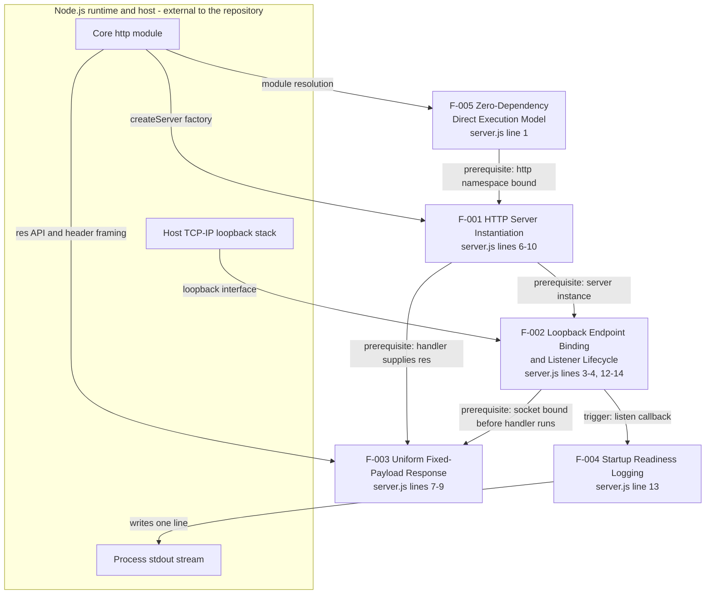
```mermaid
flowchart TD
    F005["F-005 Zero-Dependency<br/>Direct Execution Model<br/>server.js line 1"]
    F001["F-001 HTTP Server Instantiation<br/>server.js lines 6-10"]
    F002["F-002 Loopback Endpoint Binding<br/>and Listener Lifecycle<br/>server.js lines 3-4, 12-14"]
    F003["F-003 Uniform Fixed-Payload Response<br/>server.js lines 7-9"]
    F004["F-004 Startup Readiness Logging<br/>server.js line 13"]

    subgraph RuntimeLayer["Node.js runtime and host - external to the repository"]
        CoreHTTP["Core http module"]
        TCPStack["Host TCP-IP loopback stack"]
        StdOut["Process stdout stream"]
    end

    CoreHTTP -->|"module resolution"| F005
    CoreHTTP -->|"createServer factory"| F001
    CoreHTTP -->|"res API and header framing"| F003
    TCPStack -->|"loopback interface"| F002
    F005 -->|"prerequisite: http namespace bound"| F001
    F001 -->|"prerequisite: server instance"| F002
    F001 -->|"prerequisite: handler supplies res"| F003
    F002 -->|"prerequisite: socket bound before handler runs"| F003
    F002 -->|"trigger: listen callback"| F004
    F004 -->|"writes one line"| StdOut
```

| Feature | Depends On | Depended On By |
|---------|-----------|----------------|
| F-005 Zero-Dependency Direct Execution Model | Nothing in the repository — it is the dependency-graph root (line 1 is the first executed statement) | F-001 |
| F-001 HTTP Server Instantiation | F-005 (the `http` namespace must be bound before `createServer` is called) | F-002, F-003 |
| F-002 Endpoint Binding and Lifecycle | F-001 (`listen` is invoked on the instance created at line 6) | F-003, F-004 |
| F-003 Uniform Fixed-Payload Response | F-001 (the `res` object exists only inside the registered handler) and F-002 (no handler runs until the socket is bound) | Nothing — it is a leaf; its output leaves the system |
| F-004 Startup Readiness Logging | F-002 (the message is emitted from the `listen` callback, so only a successful bind produces it) | Nothing — it is a leaf; its output leaves the system |

The graph is a strict tree with two leaves and no cycles: there is no feedback path, no retry loop, and no feature that can re-enter another. This is why a bind failure (F-002-RQ-004) suppresses F-004 entirely and prevents F-003 from ever executing.

### 2.3.2 Requirement-Level Lifecycle Flow

The flow below annotates the single execution path of the process with the requirement IDs defined in 2.2, giving a direct visual traceability aid between behavior and requirement.

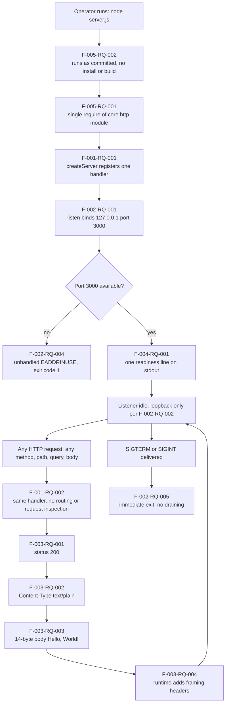
```mermaid
flowchart TD
    Launch["Operator runs: node server.js"] --> R502["F-005-RQ-002<br/>runs as committed, no install or build"]
    R502 --> R501["F-005-RQ-001<br/>single require of core http module"]
    R501 --> R101["F-001-RQ-001<br/>createServer registers one handler"]
    R101 --> R201["F-002-RQ-001<br/>listen binds 127.0.0.1 port 3000"]
    R201 --> PortFree{"Port 3000 available?"}
    PortFree -->|"no"| R204["F-002-RQ-004<br/>unhandled EADDRINUSE, exit code 1"]
    PortFree -->|"yes"| R401["F-004-RQ-001<br/>one readiness line on stdout"]
    R401 --> Idle["Listener idle, loopback only per F-002-RQ-002"]
    Idle --> Request["Any HTTP request: any method, path, query, body"]
    Request --> R102["F-001-RQ-002<br/>same handler, no routing or request inspection"]
    R102 --> R301["F-003-RQ-001<br/>status 200"]
    R301 --> R302["F-003-RQ-002<br/>Content-Type text/plain"]
    R302 --> R303["F-003-RQ-003<br/>14-byte body Hello, World!"]
    R303 --> R304["F-003-RQ-004<br/>runtime adds framing headers"]
    R304 --> Idle
    Idle --> Signal["SIGTERM or SIGINT delivered"]
    Signal --> R205["F-002-RQ-005<br/>immediate exit, no draining"]
```

### 2.3.3 Integration Points

| Integration Point | Direction | Features Involved | Observed Contract |
|-------------------|-----------|-------------------|-------------------|
| TCP listening socket at `127.0.0.1:3000` | Inbound | F-002 establishes it; F-001 and F-003 serve over it | HTTP/1.1 request/response with runtime-default keep-alive (`Keep-Alive: timeout=5` observed) |
| Node core `http` API (in-process) | Internal | F-005 binds the namespace; F-001 calls `createServer`; F-003 uses `res.statusCode`, `res.setHeader`, `res.end` | Direct library calls with no wrapper, adapter, or middleware layer |
| `process.stdout` | Outbound | F-004 | One newline-terminated plain-text line, written once per successful start |
| Operating-system process control | Bidirectional | F-002 | Exit code `1` with a stderr stack trace on bind failure; immediate exit on `SIGTERM` |

No other integration point exists. Searches of `server.js` for database clients, cache clients, message brokers, outbound HTTP clients, identity providers, secret managers, feature-flag services, file-system access, and log-aggregation clients all returned no matches, which is consistent with the integration inventory in **1.2.1.3 Enterprise Landscape Integration**. The GitHub remote recorded in `.git/config` is source hosting only and carries no runtime integration.

### 2.3.4 Shared Components

The "shared components" of this system are the module-scoped bindings that more than one feature reads. Each row was confirmed by locating every reference to the identifier in `server.js`.

| Shared Component | Defined At | Consumed By |
|------------------|-----------|-------------|
| `http` module namespace | Line 1 | F-001 only — the binding is referenced exactly once, at the `createServer` call on line 6 |
| `hostname` constant (`'127.0.0.1'`) | Line 3 | F-002 (bind argument, line 12) and F-004 (message interpolation, line 13) |
| `port` constant (`3000`) | Line 4 | F-002 (bind argument, line 12) and F-004 (message interpolation, line 13) |
| `server` instance | Line 6 | F-002 — the `listen` call on line 12 is its only consumer |
| `res` response object (handler parameter) | Line 6 | F-003 — lines 7, 8, and 9 are its only consumers |
| `req` request object (handler parameter) | Line 6 | No consumer — declared but never dereferenced anywhere in the file |
| `console` global | Line 13 | F-004 only |

Two consequences follow directly from this table. First, the `hostname` and `port` constants are the single point of coupling between the network layer and the observability layer, which is what makes the readiness message structurally consistent with the bound endpoint (F-004-RQ-002). Second, `req` is shared with nothing, which is the mechanical reason the response is request-agnostic (F-001-RQ-002).

### 2.3.5 Common Services

All common services consumed by the features are supplied by the runtime and host; **the repository contains no application-level shared service** — there is no logger module, configuration service, error-handling middleware, validation utility, authentication service, or dependency-injection container, because the entire application is one file with no abstractions.

| Common Service | Provided By | Serving Features |
|----------------|-------------|------------------|
| HTTP parsing, socket management, keep-alive handling, default framing headers, and `HEAD` body suppression | Node core `http` module | F-001, F-003 |
| Loopback network interface and TCP port allocation | Host operating system TCP/IP stack | F-002 |
| Standard output stream and the `console` global | Node.js process environment | F-004 |
| Event loop, module resolution, default signal disposition, and exit-code propagation | Node.js runtime | F-001 through F-005 |

Because every shared service is external to the repository, the features have no internal service contract to version, and there is no seam at which a service could be substituted — a constraint carried forward in 2.4.

### 2.3.6 Related Process Flowcharts and Specification Cross-References

The diagrams in this section are complemented by, and deliberately do not duplicate, the process flowcharts already established in Section 1:

| Related Diagram or Section | Location | Relationship to Section 2 |
|----------------------------|----------|---------------------------|
| Primary user workflow flowchart | 1.3.1.2 Primary User Workflow | End-to-end operator path that exercises F-005 → F-002 → F-004 → F-003 in sequence |
| Component and container flowchart | 1.2.2.2 Major System Components | Structural view of the same elements catalogued here as features |
| Request sequence diagram | 1.2.2.3 Core Technical Approach | Per-request interaction underlying F-001-RQ-002 and the F-003 requirement set |
| Capability inventory | 1.2.2.1 Primary System Capabilities | Source of the one-to-one feature alignment described in 2.1.1.1 |
| Derived objectives and verification results | 1.2.3.2 Derived Objectives Verifiable Against the Implementation | Independent confirmation of the acceptance criteria recorded in 2.2 |
| Exclusion inventory | 1.3.2.1 Explicitly Excluded Features and Capabilities | Basis for the excluded candidate features listed in 2.1.8 |

## 2.4 Implementation Considerations

The considerations below are properties of the committed implementation, not recommendations or planned work. Where the repository declares nothing — as is the case for every performance target and every scaling policy — that silence is stated explicitly rather than filled in.

### 2.4.1 Technical Constraints

| Feature | Technical Constraint | Basis and Consequence |
|---------|---------------------|-----------------------|
| F-001 | Exactly one request handler exists and it cannot branch | Lines 6–10 contain no conditional; adding differentiated behavior requires editing the handler, since there is no router, middleware chain, or plugin seam |
| F-001 | Request data is structurally unreachable to application logic | `req` is declared but never dereferenced; any feature needing method, path, headers, or body must first introduce request inspection that does not exist today |
| F-002 | Bind address and port are compile-time literals | Lines 3–4 are constants and no `process.env`, CLI parsing, or config file is read; per-environment operation is impossible without a code change |
| F-002 | Port contention is fatal | No `server.on('error', ...)` handler exists; a second instance terminated with `EADDRINUSE` and exit code `1`, so port `3000` must be free before launch |
| F-002 | No lifecycle hooks exist | No `process.on('SIGTERM'/'SIGINT')` and no `server.close()`; `SIGTERM` terminated the process immediately with no draining, so restarts cannot be graceful |
| F-003 | The response is a single immutable literal | Line 9 emits a fixed 14-byte payload; there is no template engine, serializer, content negotiation, or data source to vary it |
| F-003 | Only the status code and one header are under application control | Lines 7–8 are the sole response-mutating statements; `Content-Length`, `Date`, `Connection`, and `Keep-Alive` are produced by the runtime and cannot be tuned from `server.js` |
| F-004 | Observability is a single stdout line | Line 13 is the only instrumentation; stdout remained 41 bytes after more than 150 requests, so there is no request-level signal to correlate with client behavior |
| F-005 | Startup is a module-load side effect with no exported API | `require` of the module returned an object with zero own keys while attempting the bind; there is no seam for injection, isolation, or in-process reuse |
| F-005 | No runtime version floor is declared | No `package.json` `engines`, `.nvmrc`, or `.node-version` exists; compatibility is asserted only by the fact that verification succeeded on Node v22.23.1 |
| F-005 | The artifact is unversioned and unpackaged | No manifest, lockfile, or git tag exists, so the only identifier for a given requirement baseline is a commit SHA (see 2.5.3) |

### 2.4.2 Performance Requirements and Observed Characteristics

The repository declares **no performance requirement for any feature**. There is no benchmark or load-test harness, no performance budget, no SLO or SLA document, and no tunable in `server.js` — no `keepAliveTimeout`, `headersTimeout`, `maxConnections`, backlog size, or compression setting is configured. The table therefore separates the declared column (uniformly empty) from measurements taken during verification, which characterise the verification host rather than any commitment of the system.

| Feature | Declared Performance Target | Observed Characteristic (verification host, loopback, Node v22.23.1) |
|---------|-----------------------------|---------------------------------------------------------------------|
| F-001 | None | 100 requests issued at concurrency 20 all returned `200` with no failures; handler work is three synchronous statements with no I/O |
| F-002 | None | The listener accepted connections within the 1.2 s settle window used after launch; no dependency graph or migration precedes the bind |
| F-003 | None | Response size is constant at 14 bytes; 10 loopback `GET /` samples had a median total time of 0.000161 s (min 0.000136 s, max 0.000943 s) |
| F-004 | None | One synchronous write at startup only; logging contributes no per-request cost |
| F-005 | None | Startup performs one module resolution and one bind; there is no install, build, or warm-up step |

Any figure above is reproducible only on comparable hardware and must not be read as a service level. Section **1.2.3.4 Key Performance Indicators** records the same finding: the system emits liveness and correctness signals, not performance metrics.

### 2.4.3 Scalability Considerations

| Feature | Scalability Consideration | Basis |
|---------|--------------------------|-------|
| F-001 | Concurrency is bounded by a single event loop; requests are serviced by one handler in one thread | No `cluster`, `worker_threads`, or child-process usage anywhere in `server.js`; verified as a single `node server.js` process while serving concurrent traffic |
| F-001 | Statelessness means the handler itself imposes no scaling ceiling — nothing is shared, locked, or accumulated across requests | 50 sequential requests produced one unique response; no cross-request variable exists |
| F-002 | Horizontal scaling on a single host is blocked by the fixed port | Two instances cannot coexist: the second exits with `EADDRINUSE`; running more requires editing the port constant |
| F-002 | The loopback bind precludes load balancing, reverse proxying, or service-mesh placement | A non-loopback probe was refused; no proxy, ingress, or discovery configuration exists in the repository |
| F-003 | Payload size is constant, so egress volume scales linearly with request count and nothing else | Body is a 14-byte literal; no pagination, streaming, or compression path exists |
| F-004 | Log volume is constant per process regardless of traffic | Exactly one line per successful start; stdout size was unchanged after sustained probing |
| F-005 | The process is the unit of failure and of capacity, with no supervisor or restart policy | No process manager, container, orchestrator, or systemd unit is present; a terminated process leaves no instance serving |

### 2.4.4 Security Implications

| Feature | Security Implication | Basis |
|---------|---------------------|-------|
| F-001 | No authentication or authorization gate precedes the handler; every caller that can open the socket is served identically | No credential, token, session, or access-control code exists in `server.js` |
| F-001 | The injection and deserialization attack surface is empty because no request data is read, parsed, or interpolated | Grep for `req.<property>` returned no match; a `POST` body and a custom header were ignored during probing |
| F-002 | The loopback bind is the **only** security control in the repository, and it is topological rather than credential-based | A request to the host's non-loopback address on port `3000` failed to connect; changing one constant would remove this control entirely |
| F-002 | Traffic is plain HTTP with no transport security | Only the `http` module is required; no `https`/`tls` usage, certificate material, or HSTS behavior exists |
| F-002 | A bind failure writes a stack trace to stderr that discloses the bind address, port, `errno`, and Node version | Captured verbatim during the port-contention test; no secret material appears in the trace |
| F-003 | Responses carry no security headers and no rate limiting or CORS policy | Exactly one `setHeader` call exists, and it sets `Content-Type`; no middleware of any kind is present |
| F-003 | The payload itself carries no sensitive data — it is a fixed English greeting with no environment or diagnostic detail | Line 9 is a string literal |
| F-004 | The single log line cannot leak request or credential data because no request attribute is ever logged | Line 13 interpolates only the two binding constants |
| F-005 | Zero third-party code means no transitive supply-chain exposure and nothing for a dependency audit to scan; conversely there is no SBOM, signature, or provenance attestation | One `require`, resolving to a Node built-in; no manifest, lockfile, or `node_modules/` |
| F-005 | No `LICENSE` accompanies the artifact, so no redistribution or usage rights are granted | Existence test for `LICENSE`, `LICENSE.md`, and `SECURITY.md` all failed |

### 2.4.5 Maintenance Requirements

| Feature | Maintenance Requirement | Basis |
|---------|------------------------|-------|
| F-001 | Any behavioral change must be made by editing the handler in place; regression risk is unmitigated because no test asserts current behavior | No test directory or runner configuration exists in the repository, and the tracked `test.js` contains no assertion |
| F-002 | Changing the endpoint requires a source edit and a commit, with no configuration path and no rollout mechanism | Constants at lines 3–4; no `.env`, `config/`, or deployment descriptor |
| F-002 | Operators must verify port availability before launch and must accept abrupt restarts | `EADDRINUSE` exit code `1` and immediate `SIGTERM` termination were both measured |
| F-003 | The response contract is verifiable only over the network, byte-for-byte; there is no schema or contract test to maintain | Verification required executing the process and probing it; the module exports nothing to assert against |
| F-004 | Operational monitoring depends on capturing process stdout; no log file, rotation, or shipping configuration is provided | `console.log` writes to stdout only; no logging dependency exists |
| F-005 | Runtime upgrades are unconstrained and unverified — nothing pins or checks the Node version | No `engines`, `.nvmrc`, or `.node-version`; no CI job exercises the code on any version |
| F-005 | Code quality is unenforced: no linter, formatter, type checker, or CI quality gate exists | Existence tests for ESLint, Prettier, `.editorconfig`, `tsconfig.json`, and all CI configurations failed |
| F-005 | Change history is the only maintenance record — there is no changelog, release note, or version field | Three commits, zero tags; `README.md` contains only the repository name |

Because the repository has neither tests nor pipelines, every maintenance activity above is manual. The acceptance criteria in 2.2 are, in practice, the only executable regression suite available for this system, which is why each one is expressed as a reproducible command-level check.

## 2.5 Traceability and Requirement Governance

This sub-section closes the loop between the catalogued features, the twenty requirements, the source lines that implement them, and the checks that confirmed them. Because the repository is three files long — and only one of them, `server.js`, contains executable application code — traceability can be — and is — complete rather than sampled.

### 2.5.1 Requirement-to-Implementation Traceability Matrix

| Requirement ID | Feature | Implementing Artifact |
|----------------|---------|-----------------------|
| F-001-RQ-001 | F-001 | `server.js` line 6 (`http.createServer` with one inline handler), closed at line 10 |
| F-001-RQ-002 | F-001 | `server.js` lines 6–10 — handler body with no conditional and no `req` dereference |
| F-001-RQ-003 | F-001 | `server.js` lines 7–9 — three synchronous statements, no shared state |
| F-002-RQ-001 | F-002 | `server.js` line 12 (`server.listen(port, hostname, cb)`), top-level statement |
| F-002-RQ-002 | F-002 | `server.js` line 3 (`hostname = '127.0.0.1'`) passed as the `listen` host argument |
| F-002-RQ-003 | F-002 | `server.js` lines 3–4, referenced by line 12 and line 13 |
| F-002-RQ-004 | F-002 | Absence of `server.on('error', ...)` in `server.js`; runtime default disposition |
| F-002-RQ-005 | F-002 | Absence of `process.on('SIGTERM'/'SIGINT')` and `server.close()` in `server.js` |
| F-003-RQ-001 | F-003 | `server.js` line 7 (`res.statusCode = 200`) |
| F-003-RQ-002 | F-003 | `server.js` line 8 (`res.setHeader('Content-Type', 'text/plain')`) |
| F-003-RQ-003 | F-003 | `server.js` line 9 (`res.end('Hello, World!\n')`) |
| F-003-RQ-004 | F-003 | Node core `http` defaults; no corresponding statement exists in `server.js` |
| F-003-RQ-005 | F-003 | Node core `http` `HEAD` handling; no corresponding statement exists in `server.js` |
| F-004-RQ-001 | F-004 | `server.js` line 13 (`console.log` inside the `listen` callback) |
| F-004-RQ-002 | F-004 | `server.js` line 13 template literal interpolating the line 3–4 constants |
| F-004-RQ-003 | F-004 | Single `console.log` in `server.js`; no logging dependency in the repository |
| F-005-RQ-001 | F-005 | `server.js` line 1 (`require('http')`); repository-wide absence of dependency metadata |
| F-005-RQ-002 | F-005 | Whole of `server.js` as committed; absence of build, type, and bundler configuration |
| F-005-RQ-003 | F-005 | `server.js` line 12 executing at top level; absence of `module.exports` |
| F-005-RQ-004 | F-005 | Absence of `cluster`/`worker_threads` usage in `server.js` |

### 2.5.2 Source-Line Coverage Check

Every executable statement in `server.js` is claimed by at least one requirement, so the requirement set is complete with respect to the code rather than merely consistent with it.

| Source Line | Statement Role | Covering Requirement(s) |
|-------------|----------------|-------------------------|
| 1 | Core module import | F-005-RQ-001, F-005-RQ-002 |
| 3 | Bind-address constant | F-002-RQ-002, F-002-RQ-003 |
| 4 | Port constant | F-002-RQ-001, F-002-RQ-003 |
| 6 | Server creation and handler registration | F-001-RQ-001, F-001-RQ-002 |
| 7 | Status assignment | F-003-RQ-001 |
| 8 | Content-type header | F-003-RQ-002 |
| 9 | Response termination with fixed body | F-003-RQ-003, F-001-RQ-003 |
| 12 | Listener activation at module load | F-002-RQ-001, F-005-RQ-003 |
| 13 | Readiness log emission | F-004-RQ-001, F-004-RQ-002 |
| 10 and 14 | Block terminators — no behavior | Not applicable |

Neither of the other two tracked files implements a requirement. `README.md` contains only the heading `# July2026_hello_world_repo` and therefore contributes documentation identity, not behavior. `test.js` contains two undefined bare words, exports nothing, is required by nothing, and throws when executed; it is traceable to no feature and to no requirement, which is why the twenty-requirement set remains exactly coextensive with `server.js`.

### 2.5.3 Verification Traceability Matrix

No requirement is covered by an automated test, because the repository contains none. Each row records the check actually performed against the committed code and its measured result.

| Requirement ID | Verification Action | Measured Result |
|----------------|--------------------|-----------------|
| F-001-RQ-001 | Source grep for `createServer`; `curl -i` against the bound endpoint | One occurrence; `HTTP/1.1 200 OK` returned |
| F-001-RQ-002 | Probes across `GET /`, `POST /any/deep/path?q=1` (body and custom header), `DELETE /x`, `PUT /a/b`; grep for `req.<property>` | All four identical (`200`, `text/plain`, 14 bytes); zero `req` property references |
| F-001-RQ-003 | 50 sequential requests de-duplicated; 100 requests at concurrency 20 | Exactly one unique body; 100 of 100 returned `200` |
| F-002-RQ-001 | Fresh launch followed immediately by a loopback request | `200` with a 14-byte body; listener ready within the 1.2 s settle window |
| F-002-RQ-002 | Request to the host's non-loopback address (`10.76.0.92`) on port `3000` | Connection failed — `curl` exit 7, `%{http_code}` = `000` |
| F-002-RQ-003 | Source inspection of constants and their references; grep for configuration access | Declared once each and referenced by both the bind and the log; no `process.env`/`argv`/config match |
| F-002-RQ-004 | Launch of a second instance while port `3000` was bound | Exit code `1`; `Error: listen EADDRINUSE`, `code: 'EADDRINUSE'`, reported as an unhandled `error` event |
| F-002-RQ-005 | `kill -TERM` on the running process, then re-probe the port | Process absent within one second; subsequent request returned `000` |
| F-003-RQ-001 | Probes across five HTTP methods; grep for status assignment | Every probe returned `200`; a single `statusCode` assignment exists |
| F-003-RQ-002 | Response header inspection on every probe; grep for header APIs | `Content-Type: text/plain` on all responses; exactly one `setHeader` call |
| F-003-RQ-003 | `od -c` dump of the response body; `Content-Length` inspection | `H e l l o ,   W o r l d ! \n` — 14 bytes; `Content-Length: 14` |
| F-003-RQ-004 | Compare wire headers against source | `Content-Length`, `Date`, `Connection: keep-alive`, `Keep-Alive: timeout=5` present on the wire, absent from source |
| F-003-RQ-005 | `curl -I` (HEAD) against the endpoint | `status=200`, `type=text/plain`, downloaded size `0` |
| F-004-RQ-001 | Captured stdout of a clean launch (`wc -c`, `cat -A`) | Exactly 41 bytes: `Server running at http://127.0.0.1:3000/` plus one newline; stderr empty |
| F-004-RQ-002 | Source inspection of the template literal; probe of the logged URL | Interpolates the bind constants; the logged URL answered requests |
| F-004-RQ-003 | Re-measure stdout after sustained probing; grep for logging APIs | Still 41 bytes after more than 150 requests; one `console.log`, no logging library |
| F-005-RQ-001 | `grep -c "require("`; existence tests for dependency metadata | Result `1`; `package.json`, all lockfiles, and `node_modules/` absent |
| F-005-RQ-002 | Launch from the bare checkout with no preparatory command | Served requests immediately; no build, type, or bundler configuration exists |
| F-005-RQ-003 | `require` of the module from a separate script | Returned an object with zero own keys and raised `EADDRINUSE` from the load-time bind |
| F-005-RQ-004 | Process listing during concurrent load; grep for `cluster`/`worker_threads` | One `node server.js` process served all traffic; no clustering APIs present |

### 2.5.4 Scope and Capability Reconciliation

Each feature maps onto the scope and capability inventories already published in Section 1, so the two sections describe one system rather than two overlapping views.

| Feature | Section 1 Scope Anchor (1.3.1.1) | Section 1 Capability Anchor (1.2.2.1) |
|---------|----------------------------------|---------------------------------------|
| F-001 | "Create an HTTP server instance" | "Accept inbound HTTP connections" |
| F-002 | "Bind and listen on a fixed local endpoint" | "Accept inbound HTTP connections" (listener activation) |
| F-003 | "Return a fixed successful response to every request" | "Respond to every request uniformly" and "Declare the response content type" |
| F-004 | "Emit a startup readiness signal" | "Signal process readiness" |
| F-005 | "Key technical requirements" — CommonJS resolution, direct file execution, no build step (1.3.1.4) | Implicit in the component inventory of 1.2.2.2 (runtime and core `http` module) |

### 2.5.5 Requirement Versioning and Change Control

The repository provides no requirement-versioning mechanism: there is no `package.json` version field, no git tag (`git tag -l` returns nothing), no `CHANGELOG.md`, and no release notes. Requirement versions are therefore pinned to commit identity, which is the only durable identifier available.

| Governance Attribute | Observed State |
|----------------------|----------------|
| Requirement-set version | Designated **1.0 (as-built baseline)**, pinned to HEAD commit `43ed37c` on branch `2907_01`. The baseline is unchanged in substance from `06492d7`: `server.js` is the same blob (`320a75a`) at both commits |
| Origin of the requirement set | Commit `06492d7` ("Add files via upload") introduced `server.js` and therefore introduced all twenty requirements simultaneously; it is now the parent of HEAD |
| Prior commit | `241598b` ("Initial commit") added `README.md` only and introduces no requirement |
| Most recent commit | `43ed37c` ("Create test.js", 2026-07-30) added the 13-byte `test.js`, which implements, changes, and retires no requirement; the requirement set is identical before and after it |
| Branch state | The branches have diverged: `main` (= `origin/main`) is at `06492d7` with two tracked files, while `2907_01` (= `origin/2907_01`) is one commit ahead at `43ed37c` with three. The working tree is clean, so no in-flight requirement change exists on either branch |
| Release identifiers | None — zero tags, no version field, no published package |
| Change-control artifacts in the repository | None — no `CODEOWNERS`, `CONTRIBUTING.md`, pull-request or issue template, or CI gate that could enforce review of a requirement change |
| Practical change procedure | Any requirement change is a direct edit to `server.js` followed by a commit; this specification's requirement IDs must be re-verified against the new head, since no test suite will detect drift. Commit `43ed37c` is a worked example of that gap: a file was added, unreviewed and ungated, that fails on execution without affecting any requirement |

### 2.5.6 Assumptions and Constraints Register

#### 2.5.6.1 Assumptions

| ID | Assumption | Basis |
|----|-----------|-------|
| A-01 | A Node.js runtime exposing the core `http` module with CommonJS resolution is present on the host | `require('http')` is the only import; no version floor is declared anywhere, and verification succeeded on Node v22.23.1 |
| A-02 | TCP port `3000` is free on the host at launch | The port is a literal with no fallback; contention was measured to be fatal |
| A-03 | The loopback interface is available and clients originate on the same host | Bind address literal `127.0.0.1`; a non-loopback probe was refused |
| A-04 | The operator launches the service by invoking the file directly with `node` | No `package.json` script, `Procfile`, or process-manager configuration exists |
| A-05 | The operator captures process stdout in order to observe readiness | The readiness line is the only success signal and it is written to stdout |
| A-06 | This catalog is descriptive of as-built behavior at HEAD `43ed37c` — behaviourally identical to `06492d7`, whose `server.js` blob is unchanged — not an authored product backlog | The repository contains no requirements artifact of any kind (2.1.1.1) |
| A-07 | Quoted measurements characterise the verification environment, not a portable commitment | No performance target exists in the repository (2.4.2) |

#### 2.5.6.2 Constraints

| ID | Constraint | Basis |
|----|-----------|-------|
| C-01 | The endpoint is fixed at `127.0.0.1:3000` and cannot be reconfigured without a code change | Literal constants at lines 3–4; no configuration source is read |
| C-02 | Exactly one response exists — one status, one content type, one 14-byte payload | Lines 7–9; no branching and no data source |
| C-03 | There is no error handling, retry, or fallback; bind failure terminates the process | No `server.on('error')`; measured exit code `1` on `EADDRINUSE` |
| C-04 | Shutdown is abrupt, with no draining of in-flight requests | No signal handler and no `server.close()`; measured immediate exit on `SIGTERM` |
| C-05 | The module exports nothing and starts the listener on load, so it cannot be unit-tested or embedded | `require` returned zero own keys while attempting the bind |
| C-06 | There is no automated verification, linting, type checking, or CI gate | Existence tests for all test, lint, type, and CI configurations failed; the tracked `test.js` contains no test or assertion |
| C-07 | Transport is plain HTTP and the endpoint is unauthenticated; loopback binding is the only control | Only the `http` module is required; no credential or TLS code exists |
| C-08 | The artifact is unversioned, unpackaged, and unlicensed | No manifest, tag, changelog, or `LICENSE` file |
| C-09 | Capacity and fault domain are a single foreground process on one event loop | No `cluster`/`worker_threads`; no supervisor or orchestrator configuration |
| C-10 | Product documentation is limited to the repository name | `README.md` contains only the heading `# July2026_hello_world_repo` |

## 2.6 References

### 2.6.1 Repository Files Examined

Both non-VCS files in the repository were read in full, so coverage of the source tree is complete.

- `server.js` — The sole implementation artifact and the origin of all five features and all twenty requirements. Established the `require('http')` dependency model (line 1), the `hostname`/`port` constants (lines 3–4), the single `createServer` handler registration (lines 6–10), the three-statement response contract (lines 7–9), the top-level `listen` activation (line 12), and the readiness log (line 13). Targeted greps over this file also established the absences on which F-002-RQ-004, F-002-RQ-005, F-003-RQ-004, F-003-RQ-005, F-005-RQ-003, and F-005-RQ-004 rest: no `req` property access, no branching or routing, no error or signal handling, no `server.close()`, no `module.exports`, no configuration access, no TLS/auth/session code, no persistence or outbound client, no async constructs, and no `cluster`/`worker_threads` usage.
- `README.md` — Established that the repository contains no product, business, or usage documentation; its only line is the heading `# July2026_hello_world_repo`. This is the basis for labelling every "Business Value" entry in 2.1 as derived engineering value and for constraint C-10.

### 2.6.2 Repository Structure and Metadata

- `` (repository root) — Established the complete first-order inventory used to scope the feature catalog: exactly three tracked files totalling 382 bytes and no source subdirectories, confirmed independently by the folder listing, a filesystem walk, and `git ls-files`. File metrics measured here: `server.js` = 342 bytes / 14 lines; `README.md` = 27 bytes / 1 line; `test.js` = 13 bytes / 2 lines, which bears no feature or requirement (2.5.2).
- `.git/` — Version-control metadata, used solely for requirement governance in 2.5.5. Established the three-commit history (`241598b` "Initial commit" adding `README.md` and `06492d7` "Add files via upload" adding `server.js`, both 2026-07-29; `43ed37c` "Create test.js" adding `test.js`, 2026-07-30 — all by `lakshya-blitzy`), the clean working tree, branch `2907_01` at HEAD `43ed37c` with `main` one commit behind at `06492d7`, the GitHub `origin` remote for `lakshya-blitzy/July2026_hello_world_repo`, and the absence of any tag.

### 2.6.3 Verified Absent Artifacts Underpinning Requirement Statements

Seventy-six conventional paths were individually tested for existence and none were present. The absences most load-bearing for Section 2 are grouped below.

| Category | Requirement Statements That Depend on the Absence |
|----------|--------------------------------------------------|
| `requirements.md`, `PRD.md`, `ROADMAP.md`, `TODO.md`, `CHANGELOG.md`, `docs/`, `openapi.yaml`, `openapi.json`, `swagger.json` | 2.1.1.1 (no requirements source exists; the catalog is reverse-derived), 2.1.8, 2.5.5 |
| `package.json`, all lockfiles, `node_modules/`, `.npmrc`, `.nvmrc`, `.node-version` | F-005-RQ-001, F-005-RQ-002, 2.4.1 (no version floor, unversioned artifact), 2.5.5 |
| `test/`, `tests/`, `__tests__/`, `spec/`, `jest.config.js`, `vitest.config.js`, `.mocharc.json` | 2.2.1 (verification posture — no automated tests), 2.2.7, 2.4.5, 2.5.3 |
| `tsconfig.json`, `jsconfig.json`, `.babelrc`, `webpack.config.js`, `rollup.config.js`, `Makefile`, ESLint/Prettier/`.editorconfig` | F-005-RQ-002, 2.4.5 (unenforced code quality) |
| `.github/`, `.gitlab-ci.yml`, `.travis.yml`, `Jenkinsfile`, `azure-pipelines.yml`, `.circleci/` | 2.4.5, 2.5.5 (no change-control or quality gate) |
| `Dockerfile`, compose files, `k8s/`, `helm/`, `terraform/`, `serverless.yml`, `Procfile`, `app.yaml`, `vercel.json` | F-002 external dependencies, 2.4.3 (no supervisor, no orchestration) |
| `.env`, `.env.example`, `config/` | F-002-RQ-003, C-01 (endpoint not reconfigurable) |
| `LICENSE`, `LICENSE.md`, `SECURITY.md`, `CONTRIBUTING.md`, `CODEOWNERS`, `CODE_OF_CONDUCT.md` | 2.4.4 (no license grant, no security policy), 2.5.5, C-08 |

A recursive search for `TODO`, `FIXME`, `XXX`, and `HACK` markers across all `.js` and `.md` files returned no matches, confirming there are no in-code requirement hints or deferred-work notes. No `.blitzyignore` file exists in the repository or elsewhere on the inspected filesystem, so no path exclusions applied to this investigation.

### 2.6.4 Runtime Verification Actions Cited as Acceptance Evidence

Every acceptance criterion in 2.2 and every measured result in 2.5.3 derives from the following actions, performed against the committed source on Node v22.23.1.

| Verification Action | Requirements Substantiated |
|---------------------|---------------------------|
| Clean launch with stdout/stderr capture (`wc -c`, `cat -A`) | F-004-RQ-001, F-004-RQ-002, F-002-RQ-001, F-005-RQ-002 |
| `curl -i` on `GET /` with full header inspection | F-001-RQ-001, F-003-RQ-001, F-003-RQ-002, F-003-RQ-004 |
| `POST /any/deep/path?q=1` with request body and custom header; `DELETE /x`; `PUT /a/b` | F-001-RQ-002, F-003-RQ-001, F-003-RQ-003 |
| `curl -I` (HEAD) probe | F-003-RQ-005 |
| `od -c` dump of the response body | F-003-RQ-003 |
| 50 sequential requests de-duplicated; 100 requests at concurrency 20 | F-001-RQ-003, F-005-RQ-004 |
| Probe of the host's non-loopback address (`10.76.0.92:3000`) | F-002-RQ-002 |
| Deliberate second-instance launch on an occupied port | F-002-RQ-004 |
| `kill -TERM` followed by a re-probe | F-002-RQ-005 |
| `require` of `server.js` from a separate script inspecting `Object.keys` | F-005-RQ-003 |
| Ten-sample loopback latency measurement (`curl` `time_total`) | 2.4.2 observed characteristics only — no requirement |
| Process listing during load | F-005-RQ-004 |

### 2.6.5 Cross-Section References

- **1.1 Executive Summary** — Corroborated the file inventory and metrics used to scope the catalog, and the finding that the repository contains no problem statement or business documentation.
- **1.2 System Overview** — Supplied the capability inventory (1.2.2.1) and component inventory (1.2.2.2) that features are aligned to, the request sequence diagram (1.2.2.3) referenced in 2.3.6, the integration inventory (1.2.1.3) confirmed in 2.3.3, and the finding that no KPI, SLA, or success criterion is declared (1.2.3.1, 1.2.3.4) which 2.2.1 and 2.4.2 carry forward.
- **1.3 Scope** — Supplied the must-have capability list (1.3.1.1) and key technical requirements (1.3.1.4) reconciled in 2.5.4, the primary user workflow flowchart (1.3.1.2) referenced in 2.3.6, and the exclusion inventory (1.3.2.1) that 2.1.8 mirrors at feature level.
- **1.4 References** — Corroborated the absent-artifact audit and the runtime verification results reused as acceptance evidence in this section.

### 2.6.6 External Sources

- [web] nodejs.org — Confirmed that `http` is a Node.js built-in module, which is the basis for classifying F-005 as a zero-dependency model rather than an unresolved import.

No other external source was required: every feature, requirement, acceptance criterion, and constraint in Section 2 is grounded in the repository's own three tracked files (382 bytes at HEAD `43ed37c`, a three-commit history) and in the measured behavior of the committed code. Of those three files only `server.js` carries behavior; `README.md` and `test.js` were read in full and shown to bear no requirement.

# 3. Technology Stack

## 3.1 Programming Languages

The language inventory for this system is exhaustive rather than representative. The repository tracks exactly three files — `server.js`, `README.md`, and `test.js`, 382 bytes in total — and contains no subdirectories, so every line of source that exists is accounted for below. `server.js` is the complete runnable application; `README.md` carries a single heading and no instructions; `test.js` is an inert placeholder that is never loaded by the application and is not part of it.

### 3.1.1 Language Inventory by Component

| Component / Artifact | Language | Edition or Dialect | Role in the System |
|---|---|---|---|
| `server.js` (14 lines, 342 bytes, mode `100644`) | JavaScript | ES2015 (ES6) syntax, CommonJS module format | The entire application: server creation, response generation, loopback binding, readiness log |
| `README.md` (1 line, 27 bytes, mode `100644`) | Markdown | Single ATX H1 heading (`# July2026_hello_world_repo`) | Repository identification only — no prerequisites, install steps, or run instructions |
| `test.js` (2 lines, 13 bytes, mode `100644`) | JavaScript | Two bare identifier expression statements (`asdsa`, `asdasd`); no module syntax at all | **Not part of the application.** Syntactically valid — `node --check test.js` exits 0 — but it exports nothing, is imported by nothing, and throws `ReferenceError: asdsa is not defined` (exit code 1) when executed |
| Host runtime (not authored in this repository) | Node.js JavaScript runtime | Version **not declared** by the repository | Supplies the JavaScript engine and the built-in `http` module that `server.js` requires on line 1 |

There is no second implementation language at any tier — no separate frontend, mobile, native, or scripting component. A file-type census across the tracked inventory yields exactly two `.js` files and one `.md` file and nothing else; only one of those `.js` files, `server.js`, is application source. A repository-wide search for `*.sql`, `*.yaml`, `*.yml`, `*.json`, `*.toml`, `*.ini`, `*.cfg`, `*.xml`, and `.env*` files returned no results, so the repository holds no configuration or serialization artifacts in any language either.

The absence of other language ecosystems was confirmed by existence-testing their conventional project descriptors rather than inferred. None of the following is present: `requirements.txt`, `pyproject.toml`, `Pipfile`, `setup.py`, `.python-version` (Python); `tsconfig.json`, `jsconfig.json` or any `.ts`/`.tsx` file (TypeScript); `go.mod` (Go); `Cargo.toml` (Rust); `pom.xml`, `build.gradle` (JVM); `Gemfile` (Ruby); `composer.json` (PHP); `Package.swift`, `*.xcodeproj`, `Podfile` (Swift/Objective-C); `*.gradle`, `*.kt` sources (Kotlin); `*.csproj`, `*.sln` (.NET); `pubspec.yaml` (Dart); `mix.exs` (Elixir); `CMakeLists.txt` (C/C++). JavaScript is therefore the sole programming language of the system, and it is used **untyped** — there are no TypeScript annotations and no JSDoc type tags anywhere in the source.

### 3.1.2 Language Edition and Module System

The newest syntax the application source uses is ES2015. That is not an estimate; each construct was counted directly in `server.js`.

| Syntax Construct Observed | Occurrences | Location in `server.js` | Introduced By |
|---|---|---|---|
| `const` binding | 4 | Lines 1, 3, 4, 6 | ES2015 |
| Arrow function | 2 | Line 6 (request handler), line 12 (listen callback) | ES2015 |
| Template literal | 1 | Line 13 (readiness message) | ES2015 |
| `require()` module import | 1 | Line 1 (`require('http')`) | CommonJS (pre-ES2015 module system) |

Equally significant is what is absent: no `var` or `let`, no `function` keyword, no `class`, no `async`/`await` or `Promise`, no optional chaining (`?.`), nullish coalescing (`??`), or spread (`...`), no `'use strict'` directive, and no shebang line. ES2015 is consequently both the floor and the ceiling of the language edition in use — the file is syntactically valid on any ES2015-capable JavaScript engine, and no ES2016-or-later feature creates a modern-runtime requirement.

`test.js` does not shift that floor or ceiling. It contains no declaration, no operator, and no module syntax whatsoever — its two lines are bare identifier expression statements, which have been valid JavaScript since ES1 — so the language-edition analysis above remains a complete description of the repository's syntax surface.

The module system is CommonJS, used in its most minimal form. The application source contains exactly one `require(` occurrence, whose target is the bare specifier `'http'` (not the `node:http` prefixed form), and the tracked inventory contains zero ESM `import`/`export` statements, zero dynamic `import()`, and zero `module.exports` or `exports.` assignments — including in `test.js`, which neither imports nor exports anything. `server.js` therefore imports one thing and exports nothing: it is an entrypoint, not a reusable module.

```javascript
const http = require('http');                    // line 1 — CommonJS import of a built-in
const server = http.createServer((req, res) => { // line 6 — ES2015 arrow function
```

*(Trailing comments added for annotation; the committed source carries no comments.)*

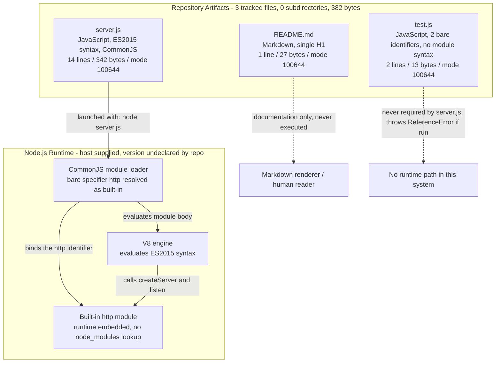
```mermaid
flowchart TB
    subgraph RepoArtifacts["Repository Artifacts - 3 tracked files, 0 subdirectories, 382 bytes"]
        SRC["server.js<br/>JavaScript, ES2015 syntax, CommonJS<br/>14 lines / 342 bytes / mode 100644"]
        DOC["README.md<br/>Markdown, single H1<br/>1 line / 27 bytes / mode 100644"]
        TST["test.js<br/>JavaScript, 2 bare identifiers, no module syntax<br/>2 lines / 13 bytes / mode 100644"]
    end
    subgraph HostRuntime["Node.js Runtime - host supplied, version undeclared by repo"]
        LOADER["CommonJS module loader<br/>bare specifier http resolved as built-in"]
        ENGINE["V8 engine<br/>evaluates ES2015 syntax"]
        HTTPMOD["Built-in http module<br/>runtime embedded, no node_modules lookup"]
    end
    SRC -->|"launched with: node server.js"| LOADER
    LOADER -->|"binds the http identifier"| HTTPMOD
    LOADER -->|"evaluates module body"| ENGINE
    ENGINE -->|"calls createServer and listen"| HTTPMOD
    DOC -.->|"documentation only, never executed"| RENDER["Markdown renderer / human reader"]
    TST -.->|"never required by server.js; throws ReferenceError if run"| UNUSED["No runtime path in this system"]
```

### 3.1.3 Selection Criteria and Justification

The language choice is inseparable from the system's defining property: it must run exactly as committed, with nothing installed and nothing built. JavaScript on Node.js is the only mainstream combination that satisfies every one of the following observed criteria simultaneously.

- **Standard-library HTTP capability.** The runtime's built-in `http` module provides a production-grade HTTP/1.1 server without any package installation, which is what allows the dependency count to be zero (feature F-005, Zero-Dependency Direct Execution Model). A language whose HTTP support lives in a third-party package would have forced a manifest, a lockfile, and an install step into the repository.
- **Zero-toolchain executability.** A JavaScript source file is interpreted directly by `node`; there is no compile, link, or transpile phase to configure. This is corroborated by the complete absence of build tooling (no `Makefile`, `webpack`, `rollup`, `vite`, `esbuild`, `babel`, or `swc` configuration) documented in section 3.6.
- **Maximum runtime portability within the language.** By confining itself to ES2015 syntax and to long-stable core APIs, the source imposes no lower bound tied to a recent runtime release, which matters precisely because the repository declares no runtime version.
- **Canonical-example fidelity.** As established in section 1.2.1.1, the implementation is functionally equivalent to the "Create an HTTP Server" example published in the Node.js documentation, differing chiefly in module system — this repository uses CommonJS `require('http')` where the current documentation sample uses ESM `import`. Choosing the language and idiom of the canonical example makes the artifact immediately legible to any reader familiar with Node.js.
- **Implicit CommonJS default.** Because no `package.json` exists, Node.js interprets a `.js` file as CommonJS by default, so the chosen module idiom needs no declaration to work (see 3.1.4).

For completeness against the default technology stack referenced in this document's authoring guidance: no Python, TypeScript, Swift, Kotlin, or Objective-C source exists in this repository, and no toolchain descriptor for any of them is present. Documenting those languages as part of this system would be inaccurate, so they are recorded here only as verified non-participants.

### 3.1.4 Language-Level Constraints and Dependencies

| Constraint | Evidence | Consequence |
|---|---|---|
| The source **must** be evaluated as CommonJS | Executing the identical source in ESM scope fails at runtime with `ReferenceError: require is not defined in ES module scope`, while `node --check` on an `.mjs` copy of the same bytes exits 0 | The incompatibility is semantic, not syntactic. It is satisfied *implicitly* today because no `package.json` exists, so `.js` defaults to CommonJS. Introducing `"type": "module"` or renaming the file to `.mjs` would break startup. |
| No language or runtime version floor is declared | No `package.json` `engines` field, `.nvmrc`, `.node-version`, or `.tool-versions` exists | Runtime selection is entirely an operator decision. Compatibility is asserted only by verification succeeding on Node.js v22.23.1 (consistent with 2.4.1 and assumption A-01). |
| No tracked file is a directly executable script | All three files are Git mode `100644` with no `#!` interpreter line | `server.js` must be launched through the interpreter as `node server.js`; it cannot be invoked as `./server.js`. |
| Syntactic validity is not evidence of executability | `node --check` exits 0 for both `.js` files, yet `node test.js` exits 1 with `ReferenceError: asdsa is not defined` | The only pre-flight check available in the repository (3.6.4) proves parseability, not correctness; a `.js` file can be tracked, parse cleanly, and still fail immediately on evaluation. |
| No static typing and no compile-time verification | No `.ts` source, no `tsconfig.json`, no JSDoc type annotations | All errors — including a failed port bind — surface only at runtime; there is no compile-time or lint-time guarantee (no linter or formatter configuration exists either). |
| No language-level dependency graph | The sole `require` target resolves to a runtime built-in: `require('module').isBuiltin('http')` returns `true` and `require.resolve('http')` returns `http` with no filesystem path | There is no module resolution against `node_modules`, nothing to download, and no version to pin at the language level (see 3.3). |

The practical dependency chain of the language layer is therefore exactly two links long: the JavaScript source depends on a Node.js runtime, and the runtime depends on the host operating system. Nothing else intervenes.

## 3.2 Frameworks &amp; Libraries

This system uses no application framework and exactly one library — the Node.js core `http` module, which ships inside the runtime rather than being installed. Everything the application does at the protocol level is delegated to that module; everything the application contributes is thirteen lines of glue around it.

### 3.2.1 Framework Inventory

No web, application, or utility framework is present. This was established by case-insensitive pattern matching for more than eighty widely used package names across all three tracked files — `server.js`, `README.md`, and `test.js` — which produced zero matches, and corroborated by the absence of any dependency manifest that could declare one. The scan surface grew from two files to three when `test.js` was added, and the result did not change: that file contains no package name, no import, and no framework token of any kind.

| Framework / Library Category | Representative Packages Checked | Status in This Repository |
|---|---|---|
| HTTP / web framework | `express`, `koa`, `fastify`, `nest`, `hapi`, `restify` | Absent — no match in source, no manifest to declare one |
| Real-time / alternative protocol | `socket.io`, `ws`, `graphql`, `apollo` | Absent |
| HTTP client | `axios`, `node-fetch`, `got`, `superagent`, `undici` | Absent — the application makes no outbound HTTP calls |
| Logging / observability | `winston`, `pino`, `bunyan`, `morgan`, `debug`, `prom-client`, `opentelemetry`, `sentry`, `datadog`, `newrelic`, `elastic` | Absent — `console.log` is used directly (line 13) |
| Configuration / CLI | `dotenv`, `config`, `yargs`, `commander` | Absent — the two runtime parameters are inline literals (lines 3–4) |
| Validation / utility | `zod`, `joi`, `ajv`, `lodash`, `moment`, `dayjs`, `uuid` | Absent |
| Security middleware | `helmet`, `cors`, `cookie-parser`, `session`, `passport`, `jsonwebtoken`, `bcrypt`, `argon2` | Absent |
| Test frameworks and runners | `jest`, `mocha`, `chai`, `vitest`, `ava`, `tap`, `jasmine`, `supertest`, `sinon` | Absent — no framework is referenced anywhere, including in `test.js` (6.6.1) |
| AI / LLM frameworks | `langchain`, `openai`, `anthropic` | Absent |

The consequence, already stated architecturally in section 1.2.2.3 and at the integration level in 2.3.3, is that there is no middleware pipeline, no router, and no plugin system — the request handler registered on line 6 *is* the entire request-processing layer, invoked directly by the runtime with no wrapper or adapter in between.

### 3.2.2 The Sole Library: Node.js Core `http`

That `http` is a runtime built-in rather than an installed package was verified programmatically, not assumed: `require('module').isBuiltin('http')` returns `true`, `require('module').builtinModules.includes('http')` returns `true`, and `require.resolve('http')` returns the bare string `http` with no filesystem path. There is no `node_modules` directory to search and no package resolution step at startup.

The API surface the application actually consumes is small enough to enumerate completely. Each of the following symbols appears exactly once.

| API Symbol | Line | Responsibility Delegated to the Runtime |
|---|---|---|
| `http.createServer(handler)` | 6 | Instantiates the HTTP/1.1 server and registers the single inline request handler |
| `res.statusCode = 200` | 7 | Sets the response status on the runtime-provided response object |
| `res.setHeader('Content-Type', 'text/plain')` | 8 | Sets the only application-controlled response header |
| `res.end('Hello, World!\n')` | 9 | Writes the 14-byte body and terminates the response |
| `server.listen(port, hostname, cb)` | 12 | Binds TCP port 3000 on `127.0.0.1` and registers the readiness callback |
| `console.log(...)` | 13 | Emits the single readiness line to standard output |

Two negative findings sharpen this picture: the source performs **zero** `req.*` accesses (the request object is accepted as a parameter and never inspected) and **zero** `process.*` accesses (no environment variables, no `process.exit`, no signal handlers). The application is therefore write-only with respect to the HTTP transaction and inert with respect to the process environment.

Everything else observable on the wire is supplied by the runtime, not by application code. During a verified run, the response carried `Date`, `Connection: keep-alive`, `Keep-Alive: timeout=5`, and `Content-Length: 14` headers that appear nowhere in the source — these are Node.js `http` defaults, consistent with the runtime-supplied services catalogued in 2.3.5.

The runtime's own embedded components are the de facto lower layers of this stack. The versions below were read from `process.versions` on the runtime used for verification and are **environment observations, not repository-declared versions** — the repository pins nothing.

| Embedded Component | Version Observed (Node.js v22.23.1) | Relevance to This System |
|---|---|---|
| V8 JavaScript engine | 12.4.254.21-node.56 | Executes the ES2015 source |
| llhttp | 9.4.2 | The HTTP/1.1 request parser inside the `http` module — all protocol parsing happens here |
| libuv | 1.51.0 | Event loop, TCP socket handling, and the single-threaded concurrency model |
| OpenSSL | 3.5.7 | Present in the runtime but **unused** — the source never requires `https` or `tls`, so traffic is plaintext |
| Module ABI | 127 | Irrelevant in practice: no native addons are loaded because there are no dependencies |

### 3.2.3 Compatibility Requirements

The compatibility contract for this system reduces to three conditions, all of which are met by every currently supported Node.js release line:

1. **A Node.js runtime that exposes the core `http` module** — the sole import on line 1.
2. **CommonJS evaluation of the `.js` file** — a hard requirement demonstrated in 3.1.4; satisfied implicitly because no `package.json` exists.
3. **An ES2015-capable engine** — trivially satisfied, since the source uses no syntax newer than ES2015.

Empirically, all six consumed symbols are long-stable APIs: during the verified run the process wrote exactly 41 bytes to standard output and **0 bytes to standard error**, so the runtime emitted no deprecation or experimental-feature warnings for any of them. The negotiated protocol was HTTP/1.1 (`curl` reported `http_version=1.1`, status `200`, body size `14`); no HTTP/2 or TLS/ALPN path exists.

Because the repository declares no engine range, runtime-line selection is an operator decision. The following release-line facts are **external context** gathered from published Node.js release information as of this writing, aligned with the figures already recorded in section 1.2.1.3 — they are not commitments made by this repository.

| Node.js Line | Phase (as of July 2026) | Supported Through | Bearing on This System |
|---|---|---|---|
| 24.x | Active LTS | 2028-04-30 | The recommended target for any long-lived deployment |
| 22.x | Maintenance LTS | 2027-04-30 | The line used for all verification in this specification (v22.23.1); still receives security fixes |
| 26.x | Current (latest 26.5.0, released May 2026; LTS promotion expected October 2026) | 2029-04-30 | Usable, but a Current line is conventionally reserved for development and testing |
| 25.x / 20.x | End of Life (2026-06-01 / 2026-04-30 respectively) | — | Not suitable: no further security patches for the runtime that performs all HTTP parsing here |

Forward compatibility risk is low but non-zero and, notably, unguarded. Node.js 26 removed long-deprecated internals such as the `_stream_*` modules and enabled the Temporal API by default; the source references neither, so those specific changes have no effect. However, since there is no test suite, no CI pipeline, and no declared engine range (see 3.6), any future runtime regression would be discovered only by manually launching the server — a gap consistent with the maintenance posture described in 2.4.5.

### 3.2.4 Justification, Trade-offs, and Security Implications

**Why no framework.** The functional requirement set is a single fixed response on a single loopback port. A framework's value — routing, middleware composition, negotiation, validation, plugin lifecycles — has no requirement to serve here, while its cost would be immediate and structural: a `package.json`, a lockfile, a `node_modules` tree, an install step before first run, and an ongoing dependency-update obligation. Using core `http` alone preserves the property that makes this artifact what it is: the file executes exactly as committed. This is the technology-layer expression of feature F-005 (Zero-Dependency Direct Execution Model).

**What that costs.** The trade-offs are real and should be understood before this code is extended: there is no routing (every method and path receives the identical response), no request parsing or validation, no error-handling middleware, no structured logging, no graceful-shutdown handling, and no configuration layer. Any of these would have to be written by hand against core `http` or introduced together with the first third-party dependency — which would simultaneously introduce the install workflow the project currently does not have.

**Security implications.**

- **No third-party attack surface, and nothing to audit.** With zero installed packages there is no transitive supply-chain exposure; correspondingly, `npm audit` cannot run at all (it fails with `ENOLOCK` — no lockfile), and as noted in 2.4.4 there is no SBOM, signature, or provenance attestation either. The absence of risk here comes from the absence of dependencies, not from any control.
- **All protocol-level vulnerability exposure sits in the runtime.** Because parsing and framing are handled entirely by the runtime's `http`/llhttp implementation, any HTTP-parser, V8, or crypto CVE affecting this deployment is remediated by upgrading Node.js and by no other means. With no declared engine floor and no automated update path, keeping the runtime on a supported line is a purely manual operator responsibility.
- **No application-level input handling to exploit.** The handler never reads the request method, URL, headers, or body (zero `req.*` accesses), so there is no injection, deserialization, or parsing logic in application code. The one deliberate control is topological: `server.listen` binds `127.0.0.1`, restricting reachability to same-host clients (2.4.4).
- **No transport security.** Although the runtime embeds OpenSSL 3.5.7, the application requires neither `https` nor `tls`; all traffic is plaintext HTTP/1.1. There is likewise no `helmet`-style header hardening, CORS policy, or rate limiting — the only response headers are the one the application sets and the runtime's defaults.

## 3.3 Open Source Dependencies

The system declares no open-source dependencies. It consumes exactly one open-source component — the Node.js runtime itself — and consumes it as an installed platform rather than as a versioned, resolvable package. This sub-section records the audit that establishes that claim, the resulting registry posture, and the licensing and supply-chain consequences.

### 3.3.1 Dependency Manifest and Lockfile Audit

Every conventional JavaScript dependency descriptor was existence-tested in the repository root, which is also the only directory the repository has. All are absent.

| Artifact Class | Paths Tested | Result |
|---|---|---|
| Package manifest | `package.json` | Absent |
| Lockfiles | `package-lock.json`, `npm-shrinkwrap.json`, `yarn.lock`, `pnpm-lock.yaml`, `bun.lockb` | All absent |
| Workspace / monorepo | `pnpm-workspace.yaml`, `lerna.json`, `turbo.json`, `nx.json` | All absent |
| Installed dependency tree | `node_modules/` | Absent |
| Registry & client config | `.npmrc`, `.yarnrc`, `.yarnrc.yml` | All absent |
| Runtime version pins | `.nvmrc`, `.node-version`, `.tool-versions` | All absent |
| Alternative runtime manifests | `deno.json`, `deno.lock`, `import_map.json`, `jsr.json` | All absent |

Because there is no manifest, every dependency class is empty by construction rather than by policy:

| Dependency Class | Count | Basis |
|---|---|---|
| Direct runtime dependencies | 0 | The sole `require` target resolves to a runtime built-in, not a package |
| Development dependencies | 0 | No manifest; no test, lint, format, or build tooling configuration exists |
| Peer / optional dependencies | 0 | No manifest in which to declare them |
| Transitive dependencies | 0 | Verified empirically: `npm ls --all` in the repository root prints an empty tree |
| Bundled / vendored code | 0 | The repository tracks three files totalling 382 bytes — `server.js` (342 B), `README.md` (27 B), and `test.js` (13 B) — and no vendor directory exists. `test.js` requires nothing, so it adds no dependency of any kind |

This is the technology-layer evidence behind requirement F-005-RQ-001 (exactly one import, and that import is a Node.js core module).

### 3.3.2 Package Registry Posture

No package registry participates in this project's lifecycle. The public npm registry — the default source for Node.js packages — is never contacted, and no alternate or private registry is configured, since `.npmrc` does not exist. Three measured probes confirm that there is no install workflow to speak of:

```text
npm ls --all   ->  (empty)
npm audit      ->  npm error code ENOLOCK / This command requires an existing lockfile.
npm install    ->  npm error code ENOENT / Could not read package.json
```

The `npm` client is present in the verification environment (version 11.18.0) but has nothing to act upon. Practically, this means the first-run path requires no network access at all: obtaining the source and starting the server involve no dependency download, no integrity verification, and no post-install script execution. The only network operation anywhere in the lifecycle is retrieving the source itself from its GitHub origin, which is source hosting with no runtime role (see 1.2.1.3 and 3.4.4).

### 3.3.3 The Single Upstream Open-Source Component

The one open-source project this system depends on is Node.js. It is supplied by the host, and its identity is therefore an environment observation rather than a repository declaration. On the runtime used for all verification in this specification, that identity resolves as follows.

| Attribute | Observed Value | How Obtained |
|---|---|---|
| Runtime | Node.js v22.23.1, LTS line codename `Jod` | `process.release.name`, `process.release.lts` |
| Upstream source archive | `nodejs.org/download/release/v22.23.1/node-v22.23.1.tar.gz` | `process.release.sourceUrl` — confirms an official upstream release, not a fork |
| Installed distribution build | OS package `nodejs` version `22.23.1-1nodesource1` | Host package database |
| Bundled OSS components | V8 12.4.254.21-node.56, llhttp 9.4.2, libuv 1.51.0, OpenSSL 3.5.7 | `process.versions` |

An important distinction: those bundled components are transitively *present* in the execution environment, but they are not dependencies of this project in any actionable sense. The repository cannot pin, upgrade, or substitute them — they arrive and depart with whichever Node.js build the operator installs. The application's only interface to any of them is indirect: the core `http` module it requires is implemented on top of llhttp and libuv (see 3.2.2).

### 3.3.4 Licensing and Supply-Chain Implications

**Licensing.** The repository itself publishes no license terms: `LICENSE`, `LICENSE.md`, `LICENSE.txt`, `COPYING`, and `NOTICE` are all absent. As noted in 2.4.4, this leaves downstream reuse and redistribution rights undefined for the project's own 342 bytes of source. On the inbound side there is no compliance burden at all — the Node.js distribution ships a permissive MIT-style license (the license text bundled with the installed distribution grants unrestricted use, copying, modification, publication, distribution, sublicensing, and sale), and because the repository vendors no third-party code, there is nothing that would require an attribution or NOTICE file.

**Supply-chain security.** The posture is unusual and worth stating precisely in both directions:

- **Nothing to compromise upstream.** With zero installable packages there is no exposure to typosquatting, dependency confusion, malicious `postinstall` scripts, compromised maintainer accounts, or lockfile drift. There is no transitive graph to review and no install-time code execution.
- **Nothing to attest, either.** As recorded in 2.4.4, there is no SBOM, no signature, and no provenance attestation, and `npm audit` cannot even run (`ENOLOCK`). The absence of findings reflects the absence of a scannable artifact, not a clean scan.
- **Patch responsibility is displaced onto the runtime.** Since all HTTP parsing and socket handling live in Node.js, every security patch relevant to this service arrives through a runtime upgrade — an operator action that is neither declared (no engine floor) nor automated (no CI, see 3.6).
- **The first dependency is a threshold decision.** Adding any package would simultaneously introduce a manifest, a lockfile, a `node_modules` tree, a pre-run install step, and the entire supply-chain surface this project currently does not have. That trade-off should be made deliberately rather than incidentally.

## 3.4 Third-Party Services

The system integrates with no third-party service of any kind. It calls no external API, delegates no authentication, reports to no monitoring backend, and consumes no managed cloud resource. This is verifiable from two independent angles: the source imports exactly one module (a runtime built-in) and therefore instantiates no client of any kind, and the repository contains no credential, endpoint, or service-configuration artifact that such an integration would require.

### 3.4.1 External APIs and Outbound Integrations

No outbound integration exists. Pattern matching across all three tracked files — `server.js`, `README.md`, and `test.js` — found no reference to any HTTP client (`axios`, `node-fetch`, `got`, `superagent`, `undici`), messaging or queueing client (`amqplib`, `kafkajs`, `bull`, `agenda`), email or communications provider (`nodemailer`, `twilio`), or payment provider (`stripe`). The third file adds nothing to the scan surface: `test.js` contains no identifier beyond the two undefined bare words `asdsa` and `asdasd`. Structurally, the single import on line 1 of `server.js` is used only to *create a server* (`http.createServer`, `server.listen`); it is never used to issue a request. The application makes no DNS lookup and opens no outbound socket, so it requires no egress allowance in any network policy.

### 3.4.2 Authentication and Identity Services

No authentication service, identity provider, or credential-handling library is present. Verified absent from the source: `auth0`, `passport`, `jsonwebtoken`, `oauth`, `openid`, `saml`, `session`, `cookie-parser`, `bcrypt`, and `argon2`. Verified absent from the repository: `.env`, `.env.example`, `.env.local`, `.env.production`, `credentials/`, `secrets/`, `.secrets/`, and `serviceAccount.json`. Reinforcing this, the source performs zero `process.*` accesses, so it reads no environment variables — even if a secret were injected into the process environment, no code path exists that could consume it.

Access control is consequently not identity-based at all. As established in 2.4.4, the single control is topological: `server.listen` binds `127.0.0.1`, so only same-host clients can reach the endpoint (a probe from a non-loopback host address was refused during verification, per requirement F-002-RQ-002). Every request that does reach the listener receives an identical `200` response with no challenge of any kind.

### 3.4.3 Monitoring, Logging, and Observability Services

No observability service or agent is integrated. Verified absent: `sentry`, `datadog`, `newrelic`, `elastic`, `prom-client`, `opentelemetry`, and every structured-logging library (`winston`, `pino`, `bunyan`, `morgan`, `debug`).

Observability is limited to what the standard library provides directly:

| Signal | Mechanism | Scope Observed |
|---|---|---|
| Readiness | `console.log` on line 13 → standard output | Exactly one 41-byte line at startup (feature F-004) |
| Per-request telemetry | None | Standard output remained at 41 bytes after sustained request traffic during verification (F-004-RQ-003) |
| Errors | Runtime default | A failed bind produces an unhandled `error` event, a stack trace on standard error, and exit code 1 (F-002-RQ-004) |
| Metrics, traces, health endpoint | None | No metrics endpoint, no tracing instrumentation, and no dedicated health route exist |

Whatever aggregation exists is therefore supplied by whatever captures the process's standard streams — a shell, a supervisor, or a container log driver — none of which the repository configures.

### 3.4.4 Cloud Services and Managed Infrastructure

No cloud provider SDK, managed service, or platform binding is present. Verified absent from the source: `aws-sdk`, `@aws-sdk`, `googleapis`, `@google-cloud`, `azure`, `@azure`, `firebase`, and `supabase`. Verified absent from the repository: `aws-exports.js`, `firebase.json`, `amplify/`, and every platform deployment descriptor (`vercel.json`, `netlify.toml`, `app.yaml`, `app.json`, `fly.toml`, `railway.json`, `render.yaml`, `heroku.yml`, `Procfile`) — see 3.6.3 and 3.6.4 for the full deployment-tooling audit.

For completeness against the default technology stack referenced in this document's authoring guidance: there is no AWS, Auth0, or any other managed-service integration in this repository, and no artifact from which one could be inferred. These are recorded as verified non-participants only.

The one external system that genuinely exists in this project's lifecycle is its source host. The Git remote points at a GitHub repository, and its role is confined to source distribution — it has no runtime coupling whatsoever, as already stated in 1.2.1.3. One operational caution belongs here: the remote URL configured in this checkout is a token-bearing HTTPS URL, so the local Git configuration is credential-sensitive and must not be shared, published, or copied into images or documentation. The token grants repository access only and has no relationship to the running service, which requires no credential to operate.

### 3.4.5 The Actual Integration Surface

With third-party services excluded, the complete integration surface of the running system is four interfaces, all of them local to the host. This restates, at the technology layer, the integration points catalogued in 2.3.3.

| Interface | Direction | Technology | Provided By |
|---|---|---|---|
| `127.0.0.1:3000` TCP listener | Inbound | HTTP/1.1, plaintext, keep-alive with a 5-second idle timeout | Node.js core `http` + host TCP/IP stack |
| Core `http` request/response API | Internal | Direct calls — no wrapper, adapter, or middleware layer | Node.js runtime |
| Standard output | Outbound | One newline-terminated readiness line | Node.js process environment |
| Process lifecycle | Bidirectional | Exit code 1 with a stack trace on bind failure; immediate termination on `SIGTERM` | Host operating system |

Every one of these is satisfied by the runtime and the host. No service contract, API key, rate limit, quota, or third-party availability dependency applies to this system.

## 3.5 Databases & Storage

The system has no data tier. There is no primary database, no secondary or replica store, no cache, no object storage, and no filesystem interaction at runtime. The only "data" the service holds is a 14-byte string literal compiled into the request handler. This sub-section documents the audit behind that statement and the architectural consequences of a fully stateless design.

### 3.5.1 Databases

No database engine, driver, ORM, query builder, or migration tool is present. Both dimensions of the audit — source references and repository artifacts — came back empty.

| Category | Evidence Checked | Result |
|---|---|---|
| Relational drivers | `pg`, `mysql`, `sqlite3` referenced in source | Absent |
| Document / NoSQL drivers | `mongodb`, `mongoose` referenced in source | Absent |
| ORMs and query builders | `sequelize`, `prisma`, `knex`, `typeorm` referenced in source | Absent |
| Schema and migration assets | `migrations/`, `migrate/`, `db/`, `database/`, `prisma/`, `schema.prisma`, `schema.sql`, `init.sql`, `seed.sql`, `alembic.ini` | All absent |
| ORM / client configuration | `ormconfig.json`, `knexfile.js`, `sequelize.config.js`, `drizzle.config.ts` | All absent |
| Engine configuration files | `mongod.conf`, `my.cnf`, `postgresql.conf` | All absent |
| Embedded database files | Repository-wide search for `*.db`, `*.sqlite*`, `*.sql` | No matches anywhere |
| Data / model directories | `data/`, `models/` | Absent |
| Connection strings | `.env`, `.env.example`, `.env.local`, `.env.production`, `config/`, `configs/`, `settings.json` | All absent; the source reads no environment variables |

The absence is structural rather than configurational: a database client cannot be reached from this code, because the only module the process ever imports is the core `http` module.

### 3.5.2 Data Persistence Strategy

The persistence strategy is *no persistence*. The response payload is a literal argument to `res.end` on line 9 — a 14-byte constant that lives in the source file, not in any store — and the two operational parameters (`hostname`, `port`) are literals on lines 3 and 4. Nothing is read, written, computed, or accumulated.

This is enforced by three verified properties of the implementation:

- **No retained state between requests.** The handler is synchronous and assigns to the response object only; there is no module-level mutable variable, counter, collection, or cache (requirement F-001-RQ-003).
- **No request data is captured.** The source performs zero `req.*` accesses, so no inbound method, path, header, or body is ever read — there is nothing to store even in memory (F-001-RQ-002).
- **No session or client-side state.** The application sets exactly one response header, `Content-Type`, so it never emits `Set-Cookie`, and no session library or session store is present.

Because process memory holds nothing but the string constant, a restart loses nothing and recovers nothing. Consequently no backup, restore, retention, replication, or disaster-recovery procedure applies, and none is defined in the repository. Likewise there is no data migration or schema-evolution concern, and no data-at-rest encryption question, because there is no data at rest.

### 3.5.3 Caching

No caching layer exists at any tier.

- **No cache service or client.** `redis`, `ioredis`, and `memcached` are absent from the source, and `redis.conf` is absent from the repository.
- **No in-process cache.** Since the response is a constant and no state is retained, there is nothing to memoize; the "cache hit rate" for a fixed 14-byte literal is not a meaningful quantity.
- **No HTTP cache directives.** The only header the application sets is `Content-Type`. It emits no `Cache-Control`, `ETag`, `Last-Modified`, or `Vary`, so caching behavior in any intermediary or client is left entirely to defaults rather than being specified. The remaining headers observed on the wire (`Date`, `Connection`, `Keep-Alive`, `Content-Length`) are runtime-supplied framing headers, not cache controls (F-003-RQ-004).

The only reuse mechanism actually in effect is transport-level: the runtime's default HTTP/1.1 keep-alive with a 5-second idle timeout, which allows a client to reuse the TCP connection across requests. That is provided by Node.js `http`, not configured by the application.

### 3.5.4 Storage Services and Filesystem Interaction

No storage service and no filesystem access exist.

- **No object or blob storage.** No S3, Google Cloud Storage, or Azure Blob client is referenced (`aws-sdk`, `@aws-sdk`, `@google-cloud`, `azure`, `@azure` all absent — see 3.4.4).
- **No local filesystem I/O.** The core `fs` module is never required. The process therefore reads and writes no file at runtime; it needs no writable directory, no temporary space, and no volume.
- **No static assets.** There is no `public/`, `static/`, or `assets/` directory, and no static-file handling code — every response body is generated from the source literal.
- **No volume or mount declarations.** These would live in container or orchestration manifests, and as documented in 3.6.3 none exists.

The only durable artifacts associated with this project are the version-controlled source objects in the Git object store — `server.js` (blob `320a75a`) and `README.md` (blob `5fb5231`). That is source retention, not application storage.

### 3.5.5 Consequences of the Stateless Design

The technology-stack implications of having no data tier are worth making explicit, because several are positive and one is a real limitation:

- **Operational simplicity.** Startup requires no connection pool, no migration run, and no readiness gate on a dependency; the listener is available as soon as the bind succeeds. There is no failure mode in which the service is up but its data store is not, because there is no data store.
- **No data-security surface.** No credentials, connection strings, or datasets exist to protect, rotate, or classify; correspondingly there is no PII, no retention obligation, and no encryption-at-rest requirement.
- **Statelessness does not confer scalability here.** In principle a stateless service replicates freely, but this implementation cannot: the port and interface are hard-coded literals with no override path (F-002-RQ-003), so a second instance on the same host fails to bind with `EADDRINUSE` and exits with code 1 (F-002-RQ-004). Horizontal scaling would require introducing configurability first — the constraint is in the binding model, not in the data model.

## 3.6 Development & Deployment

The development and deployment toolchain is as minimal as the runtime stack. Two tools are actually involved — Git for version control and the `node` interpreter for execution — and every intermediate stage that a conventional Node.js project would have (install, build, lint, test, package, pipeline) has no artifact in this repository. The evidence for that is definitive rather than sampled: `git ls-files` returns exactly three tracked files (`README.md`, `server.js`, `test.js`), so any configuration file for any of those stages would necessarily appear in that list, and none does.

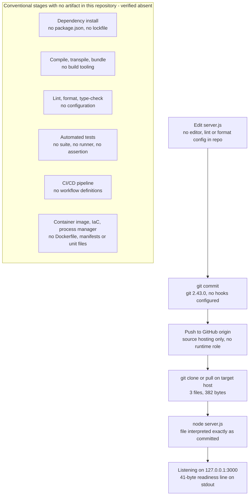
```mermaid
flowchart TB
    EDIT["Edit server.js<br/>no editor, lint or format config in repo"] --> COMMIT["git commit<br/>git 2.43.0, no hooks configured"]
    COMMIT --> PUSH["Push to GitHub origin<br/>source hosting only, no runtime role"]
    PUSH --> CLONE["git clone or pull on target host<br/>3 files, 382 bytes"]
    CLONE --> RUN["node server.js<br/>file interpreted exactly as committed"]
    RUN --> LIVE["Listening on 127.0.0.1:3000<br/>41-byte readiness line on stdout"]
    subgraph Skipped["Conventional stages with no artifact in this repository - verified absent"]
        S1["Dependency install<br/>no package.json, no lockfile"]
        S2["Compile, transpile, bundle<br/>no build tooling"]
        S3["Lint, format, type-check<br/>no configuration"]
        S4["Automated tests<br/>no suite, no runner, no assertion"]
        S5["CI/CD pipeline<br/>no workflow definitions"]
        S6["Container image, IaC, process manager<br/>no Dockerfile, manifests or unit files"]
    end
```

### 3.6.1 Development Tooling and Environment

| Tool | Version Observed | Status | Role |
|---|---|---|---|
| Git | 2.43.0 | Present and in use — the repository's `.git/` directory is the only tooling artifact that exists | Version control, source distribution |
| `node` interpreter | v22.23.1 (verification host) | Present in the environment; required to run the code, but not declared by the repository | Executes and verifies the application |
| `npm` | 11.18.0 (verification host) | Present but idle — there is no manifest for it to operate on (see 3.3.2) | None in this project |
| `node --test` (built-in runner) | Bundled with v22.23.1 | Present in the runtime and **no longer inert**: with `test.js` tracked at the repository root, the runner's default discovery pattern `**/test.?(c|m)js` matches it, so `node --test` loads a file that is not a test and exits 1 (6.6.1) | None in this project; it is an accidental interaction, not a configured stage |

Nothing else is configured. The following developer-experience and code-quality tooling was existence-tested and is absent in every case: editor conventions (`.editorconfig`); linting (`.eslintrc`, `.eslintrc.js`, `.eslintrc.json`, `.eslintrc.yml`, `eslint.config.js`, `eslint.config.mjs`, `.jshintrc`, `biome.json`); formatting (`.prettierrc`, `.prettierrc.json`, `.prettierrc.js`, `prettier.config.js`, `.clang-format`); style linting (`.stylelintrc`); type checking (`tsconfig.json`, `jsconfig.json`); commit-time hooks (`.husky/`, `.pre-commit-config.yaml`); development server / reload tooling (`nodemon.json`); and static-analysis integrations (`sonar-project.properties`, `codecov.yml`).

Two consequences deserve emphasis:

- **Onboarding information is absent from the repository.** `README.md` contains a single H1 heading and no prose — no prerequisite runtime, no install step, no run command. There is no `docs/` directory, `CONTRIBUTING.md`, or `SECURITY.md`. A newcomer discovers the technology requirement only by reading line 1 of the source, and nothing in the tree indicates that `test.js` must not be run.
- **The code offers no testable surface even if tooling were added.** Requiring `server.js` from another script yields an empty exports object (`Object.keys(exports)` is `[]`) and starts the listener as a module-load side effect — the require attempt itself contends for port 3000 (F-005-RQ-003). Any future unit test would therefore need the code refactored to separate construction from binding.

### 3.6.2 Build System

There is no build system, and no build step is required — the committed file is the deployed artifact.

| Build Concern | Descriptors Tested | Result |
|---|---|---|
| Task runners / make | `Makefile`, `makefile`, `gulpfile.js`, `Gruntfile.js`, `CMakeLists.txt`, `CMakeCache.txt` | All absent |
| Bundlers | `webpack.config.js/.ts`, `rollup.config.js/.mjs`, `vite.config.js/.ts`, `esbuild.config.js`, `parcel.config.json` | All absent |
| Transpilers | `.babelrc`, `.babelrc.js`, `babel.config.js/.json`, `.swcrc`, `swc.config.js` | All absent |
| Monorepo build orchestration | `turbo.json`, `nx.json`, `lerna.json` | All absent |
| Package scripts | Any `scripts` block — requires `package.json` | Absent (no manifest exists) |

There is consequently no `dist/`, `build/`, or `out/` directory, no minification, no source maps, and no build-time configuration injection point. The only pre-flight verification available is a syntax check — `node --check server.js` parses cleanly as CommonJS — which validates form but not behavior. `test.js` demonstrates the limit of that check exactly: `node --check test.js` also exits 0, yet executing the file throws `ReferenceError: asdsa is not defined` and exits 1. This zero-build property is what makes the system's defining claim literally true: as stated in 1.2.2.3, the file is executed exactly as committed.

### 3.6.3 Containerization and Infrastructure as Code

No containerization, orchestration, infrastructure-as-code, or process-management definition exists.

| Category | Descriptors Tested | Result |
|---|---|---|
| Container images | `Dockerfile`, `Dockerfile.dev`, `dockerfile`, `Containerfile`, `.dockerignore` | All absent |
| Local composition | `docker-compose.yml/.yaml`, `compose.yml/.yaml` | All absent |
| Orchestration | `k8s/`, `kubernetes/`, `manifests/`, `helm/`, `chart/`, `charts/`, `skaffold.yaml` | All absent |
| Infrastructure as code | `terraform/`, `main.tf`, `variables.tf`, `infra/`, `infrastructure/`, `Pulumi.yaml`, `cdk.json`, `template.yaml`, `samconfig.toml`, `serverless.yml/.yaml`, `ansible/`, `playbook.yml` | All absent |
| Platform / PaaS bindings | `vercel.json`, `netlify.toml`, `now.json`, `app.yaml`, `app.json`, `Procfile`, `fly.toml`, `railway.json`, `render.yaml`, `heroku.yml`, `cloudbuild.yaml`, `.platform.app.yaml` | All absent |
| Process supervision | `ecosystem.config.js`, `pm2.json`, `nodemon.json`, `systemd/` | All absent |

Deployment is therefore manual host-level execution (3.6.5). Two implications follow directly from the observed code rather than from convention:

- **Containerizing this service would be trivial but is not defined.** A single-file, dependency-free application needs only a Node.js base image and a copy step; no such definition is committed, so no image build, tag, or registry is part of this project.
- **The hard-coded loopback bind is a containerization hazard.** Because `server.listen` binds `127.0.0.1` with no override path (F-002-RQ-003), a containerized instance would listen only inside its own network namespace and would remain unreachable through a published port. Making this deployable in a container would require changing the bind address in source — the constraint is in the code, not in the missing Dockerfile.

### 3.6.4 Continuous Integration and Delivery

No CI/CD system is configured. The `.github/` directory does not exist at all, so there are no GitHub Actions workflows, and no competing pipeline definition is present either: `.gitlab-ci.yml`, `.travis.yml`, `Jenkinsfile`, `azure-pipelines.yml`, `.circleci/`, `bitbucket-pipelines.yml`, `.drone.yml`, `appveyor.yml`, and `.buildkite/` were all tested and are absent.

There is likewise nothing a pipeline could execute as a gate:

| Would-Be Gate | Artifacts Tested | Result |
|---|---|---|
| Automated tests | `test/`, `tests/`, `__tests__/`, `spec/`, `e2e/`, `cypress/` | All absent as directories. A single root-level file, `test.js`, exists but contains no test and no assertion; run through the built-in runner it fails (`not ok 1 - test.js`, exit 1), so it could not serve as a gate — it would block every build |
| Test runners | `jest.config.js/.ts`, `vitest.config.js/.ts`, `.mocharc.json/.yml`, `mocha.opts`, `karma.conf.js`, `ava.config.js`, `playwright.config.ts` | All absent |
| Coverage | `coverage/`, `.nycrc`, `.c8rc.json`, `codecov.yml` | All absent |
| Static analysis / quality | `sonar-project.properties`, lint and type-check configuration | All absent |
| Commit-time enforcement | `.husky/`, `.pre-commit-config.yaml` | All absent |

All three commits in the repository's history therefore landed without any automated verification, and no branch-protection, review, or ownership metadata exists in-tree (a `CODEOWNERS` file or pull-request template would appear in `git ls-files`, which lists only `README.md`, `server.js`, and `test.js`). The most recent commit, `43ed37c` "Create test.js", is direct evidence of that gap: it added a file that fails the moment it is executed, and nothing in the repository or the hosting configuration could have caught it. Change verification is entirely manual: launch the server and probe it. This is the mechanism behind the specification's treatment of acceptance criteria as externally verifiable rather than automated, and behind the maintenance limitations recorded in 2.4.5.

### 3.6.5 Execution and Deployment Procedure

The deployment procedure is a single command, and it was executed and measured as part of preparing this specification.

```bash
node server.js
```

Observed stdout: `Server running at http://127.0.0.1:3000/`

| Step | Action | Verified Result |
|---|---|---|
| 1 | Obtain the source (`git clone` / `git pull`) | Three files, 382 bytes total; nothing to install. Only `server.js` (342 bytes) is executed — `README.md` and `test.js` ship with the checkout but no step of this procedure runs them |
| 2 | Ensure TCP port 3000 on `127.0.0.1` is free | If occupied, startup fails — see failure row below |
| 3 | Run `node server.js` in the foreground | Single process (`pgrep -fc "node server.js"` returns 1); 41 bytes on stdout, 0 bytes on stderr |
| 4 | Verify | `GET http://127.0.0.1:3000/` returns `HTTP/1.1 200`, `Content-Type: text/plain`, `Content-Length: 14` |
| 5 | Stop | `SIGTERM` terminates the process immediately; no connection draining occurs |
| Failure mode | Port already bound | Unhandled `error` event, `EADDRINUSE` stack trace on stderr, process exit code 1 (F-002-RQ-004) |

Operationally this is a foreground, non-daemonized, single-process service: there is no PID file, no log file, no daemonization flag, no health endpoint, and no restart policy — the process's standard streams are whatever the launching shell or supervisor provides. Critically, **the launch command is not encoded anywhere in the repository**: there is no `npm start` script (no manifest), no `Procfile`, and no service unit, so `node server.js` is an operator convention documented here and in assumption A-04 rather than a repository artifact. One command that must *not* be part of the procedure is `node --test`: run at the repository root it discovers `test.js` and exits 1 without ever starting the service.

### 3.6.6 Version Control, Versioning and Provenance

| Aspect | Observed Value |
|---|---|
| Version control system | Git (client 2.43.0 in the verification environment) |
| Branch under documentation | `2907_01`; `main` also exists in the checkout |
| HEAD commit | `43ed37c` "Create test.js" — working tree clean, no uncommitted or untracked files |
| History | Three commits: `241598b` "Initial commit" (adds `README.md`), `06492d7` "Add files via upload" (adds `server.js`, 14 insertions), and `43ed37c` "Create test.js" (adds `test.js`, 2 insertions) |
| Branch state | Diverged: `main` (= `origin/main`) is at `06492d7` with two tracked files; `2907_01` (= `origin/2907_01`) is one commit ahead at `43ed37c` with three |
| Tags | None — `git tag -l` returns nothing |
| File modes | All three files `100644`; no executable bit anywhere in the tree |
| Release metadata | None — no `CHANGELOG.md`, no `package.json` `version` field, no tags |

Because no tag, changelog, or version field exists, the commit SHA is the only version identity this artifact has, exactly as recorded in 2.5.5: the as-built baseline is commit `43ed37c` on branch `2907_01`, and the application it deploys is byte-identical to the one introduced by its parent `06492d7` (`server.js` blob `320a75a` in both). There is no release process, no artifact registry, and no published package — distribution is by Git clone alone.

One security note closes the deployment picture: the Git remote in this checkout is configured with a token-bearing HTTPS URL. That credential governs source access only — it has no relationship to the running service, which requires no credential — but the local Git configuration must not be copied into images, logs, or documentation.

## 3.7 References

Every factual claim in this section is grounded in one of the sources below. The repository is small enough that the file list is complete rather than selective.

**Repository files examined**

- `server.js` - The entire application and the primary evidence for this section: the single `require('http')` import on line 1 (CommonJS module system, sole library), the ES2015 syntax census (4 × `const`, arrow functions on lines 6 and 12, template literal on line 13), the complete six-symbol Node.js core API surface (lines 6–13), the inline binding constants `127.0.0.1` and `3000` (lines 3–4), and the absence of `req.*` accesses, `process.*` accesses, error handling, configuration, and outbound clients.
- `README.md` - Established that the repository publishes no prerequisites, no install procedure, no run command, and no tooling guidance: its sole content is the H1 heading `# July2026_hello_world_repo`.
- `test.js` - The second `.js` file in the tree and the reason the file-type census in 3.1.1 reports two JavaScript files rather than one. Its 13 bytes are two newline-terminated bare identifier expression statements (`asdsa`, `asdasd`), which is why it parses (`node --check test.js` exits 0) yet cannot execute (`node test.js` throws `ReferenceError: asdsa is not defined` and exits 1). It declares no dependency, imports nothing, exports nothing, and is required by no other file, so it contributes nothing to the language, framework, dependency, or service findings in 3.1–3.5; its only observable effect on tooling is that `node --test` at the repository root now discovers and fails it (3.6.1, 3.6.4, 3.6.5).

**Repository structure and version-control artifacts**

- Repository root (the only directory; no subdirectories exist) - Established the exhaustive three-file inventory via `git ls-files` — `README.md` (27 bytes), `server.js` (342 bytes), and `test.js` (13 bytes), 382 bytes in total — which is what makes the absence audits in 3.1.1, 3.3.1, 3.5.1, and 3.6.2–3.6.4 definitive rather than sampled; also confirmed the file-type census of exactly two `.js` files and one `.md` file, and the absence of any configuration or serialization file (`*.json`, `*.yaml`, `*.yml`, `*.toml`, `*.ini`, `*.cfg`, `*.xml`, `*.sql`, `.env*`).
- `.git/` - Established the version-control facts in 3.6.6: branch `2907_01`, HEAD commit `43ed37c`, the three-commit history (`241598b` adding `README.md`, `06492d7` adding `server.js`, `43ed37c` adding `test.js`), zero tags, a clean working tree, file modes `100644` on all three files, the blob identifiers `320a75a` (`server.js`, byte-identical at `06492d7` and at HEAD), `5fb5231` (`README.md`), and `2c87c79` (`test.js`), the divergence of `main` (still at `06492d7`, two files) from `2907_01` (at `43ed37c`, three files), and the existence of a token-bearing GitHub remote URL (contents deliberately not reproduced).

**Audited-absent paths (enumerated in the body of this section)**

- Dependency and registry descriptors - `package.json`, `package-lock.json`, `npm-shrinkwrap.json`, `yarn.lock`, `pnpm-lock.yaml`, `pnpm-workspace.yaml`, `bun.lockb`, `node_modules/`, `.npmrc`, `.yarnrc`, `.yarnrc.yml`, `.nvmrc`, `.node-version`, `.tool-versions`, `deno.json`, `deno.lock`, `import_map.json`, `jsr.json` - all verified absent (3.3.1).
- Other-ecosystem project descriptors - Python, TypeScript, Go, Rust, JVM, Ruby, PHP, Swift/Objective-C, Kotlin, .NET, Dart, Elixir, and C/C++ manifests - all verified absent, establishing that JavaScript is the only language (3.1.1).
- Build, quality, and type-checking configuration - Task runners, bundlers, transpilers, monorepo orchestrators, linters, formatters, and `tsconfig.json`/`jsconfig.json` - all verified absent (3.6.1, 3.6.2).
- Container, orchestration, IaC, PaaS, and process-supervision descriptors - all verified absent (3.6.3).
- CI/CD, test, and coverage artifacts - `.github/` (and therefore all workflows), every competing pipeline definition, all test directories and runner configurations, and all coverage tooling - all verified absent (3.6.4). The root-level `test.js` is the single path that matches a test-shaped filename glob; it declares no framework and contains no assertion, so it does not change this finding (6.6.1).
- Database, cache, storage, configuration, and secret artifacts - Drivers, ORMs, migration directories, schema/seed SQL, engine configuration files, `.env*` files, `config/`, and credential/secret directories - all verified absent (3.5.1, 3.4.2).
- Licensing and governance files - `LICENSE`, `LICENSE.md`, `LICENSE.txt`, `COPYING`, `NOTICE` - all verified absent (3.3.4).

**Runtime and environment probes (verification host — environment observations, not repository declarations)**

- `node --version`, `npm --version`, `process.versions`, `process.release` - Established the verification runtime as Node.js v22.23.1 (LTS line codename `Jod`, upstream source archive `node-v22.23.1.tar.gz`) with V8 12.4.254.21-node.56, llhttp 9.4.2, libuv 1.51.0, OpenSSL 3.5.7, module ABI 127, and npm 11.18.0.
- `node --check server.js`, `node --input-type=module` execution of the same source - Established that the file parses cleanly as CommonJS and that CommonJS evaluation is a hard requirement: the same bytes fail in ESM scope with `ReferenceError: require is not defined in ES module scope` (3.1.4).
- `node --check test.js` followed by `node test.js` - Established the limit of syntax checking as a quality gate: the parser accepts the file (exit 0) while evaluation fails immediately with `ReferenceError: asdsa is not defined` (exit 1), which is the evidence for the "syntactic validity is not evidence of executability" constraint in 3.1.4.
- `node --test` at the repository root - Established that the runner bundled with Node.js v22.23.1 matches `test.js` under its default `**/test.?(c|m)js` discovery pattern and reports `not ok 1 - test.js` (`failureType: 'testCodeFailure'`; 1 test, 0 pass, 1 fail; exit code 1), the basis for the tooling note in 3.6.1 and the gate analysis in 3.6.4.
- `require('module').isBuiltin('http')`, `require('module').builtinModules`, `require.resolve('http')` - Established that the sole import resolves to a runtime-embedded built-in with no filesystem path and no `node_modules` lookup (3.2.2, 3.3.1).
- `npm ls --all`, `npm audit`, `npm install --dry-run` - Established the registry posture: empty dependency tree, `ENOLOCK` (no lockfile to audit), and `ENOENT` (no manifest to install from) (3.3.2).
- Live launch, `curl` probes, and process inspection - Established the measured deployment behavior in 3.6.5 and the protocol facts in 3.2.2–3.2.3: 41-byte readiness line, 0-byte stderr, `HTTP/1.1 200` with `Content-Type: text/plain` and `Content-Length: 14`, runtime-supplied `Date`/`Connection`/`Keep-Alive: timeout=5` headers, a single process, immediate `SIGTERM` termination, and `EADDRINUSE` with exit code 1 on port contention.
- `/usr/share/doc/nodejs/copyright` and the host package database - Established that the only open-source component consumed, Node.js, ships under permissive MIT-style terms, and that the installed build is `nodejs 22.23.1-1nodesource1` (3.3.3, 3.3.4).

**Technical Specification sections cross-referenced**

- 1.2.1.1, 1.2.1.3 - Equivalence with the canonical Node.js HTTP-server example (differing in module system) and the previously published Node.js release-line figures with which 3.2.3 is reconciled.
- 1.2.2.2, 1.2.2.3 - Component decomposition by source line, the "executed exactly as committed" property, and the no-framework/no-middleware posture restated at the technology layer in 3.2.
- 1.3.1.3, 1.3.1.4 - In-scope integrations and key technical requirements, restated as the compatibility contract in 3.2.3 and the integration surface in 3.4.5.
- 2.3.3, 2.3.5 - Integration points and runtime-supplied services, the basis for 3.4.5 and for attributing framing headers, keep-alive, and socket management to the runtime.
- 2.4.1, 2.4.4, 2.4.5 - The absence of a declared runtime version floor, the loopback-only security control with no SBOM or attestation, and the maintenance posture without quality gates.
- 2.5.5, 2.5.6 - Version identity by commit SHA and assumptions A-01 (Node.js runtime with CommonJS resolution) and A-04 (direct invocation with `node`).
- 6.6.1 - The testing-applicability determination that governs how the root-level `test.js` is classified: a runner-visible file that contains no test and no assertion.
- Feature and requirement identifiers F-001 through F-005 (including F-001-RQ-002/RQ-003, F-002-RQ-002/RQ-003/RQ-004, F-003-RQ-004, F-004-RQ-003, F-005-RQ-001/RQ-003) - Used to tie technology choices to the requirement baseline.

**External sources (used only for facts about the Node.js project, never for repository behavior)**

- [web] Node.js Releases page, `nodejs.org/en/about/previous-releases` - Confirmed the Current → Active LTS → Maintenance → End-of-Life model and that production deployments should run an Active or Maintenance LTS line.
- [web] Node.js Release Working Group, `github.com/nodejs/release` - Confirmed the LTS window structure (12 months Active LTS followed by 18 months Maintenance since Node.js 12).
- [web] Node.js blog, "Evolving the Node.js Release Schedule" - Confirmed the forward-looking change from Node.js 27 onward: one major per year, every major becoming LTS, with 36 months of total support.
- [web] `endoflife.date/nodejs` - Corroborated the release-phase definitions and the 30-month LTS support total.
- [web] `eosl.date/eol/product/nodejs` - Confirmed 26.5.0 as the latest release in July 2026, Node.js 24 LTS supported to 2028-04-30, and Node.js 25 reaching EOL on 2026-06-01.
- [web] HeroDevs, "Node.js Version Support: EOL Dates and Latest Releases (July 2026)" - Confirmed Node.js 22 as Maintenance LTS with EOL 2027-04-30 (the line used for verification here) and Node.js 24 as Active LTS with EOL 2028-04-30.
- [web] TuxCare, "Node.js End-of-Life: Dates, Risks & What to Do Next" - Confirmed Node.js 20 reaching EOL on 2026-04-30.
- [web] InMotion Hosting, "Node.js 26 Released" - Confirmed the Node.js 26 release date of 2026-05-05, its October 2026 LTS promotion, its V8 14.6 engine, the Temporal API being enabled by default, and the removal of the deprecated `_stream_*` internals referenced in the forward-compatibility note in 3.2.3.

# 4. Process Flowchart

## 4.1 System Workflows

This section documents the workflows that the committed code in `server.js` actually executes. The repository contains three tracked files — `server.js` (14 lines, 342 bytes), `README.md` (1 line, 27 bytes), and `test.js` (2 lines, 13 bytes), 382 bytes in total across zero subdirectories — and no workflow definition, orchestration descriptor, scheduler, queue, or business-process artifact of any kind. Every flow below was derived by line-level reading of `server.js` and then confirmed by executing the unmodified file and observing the running process.

`test.js` participates in no workflow. Nothing requires or imports it, no documented procedure invokes it (the only supported entry path remains `node server.js`, per 3.6.5), and executing it directly fails at once: its two bare identifier statements raise `ReferenceError: asdsa is not defined` and the process exits 1. It therefore contributes no trigger, no step, no decision point, and no terminating condition, and the workflow inventory below is exactly what it was before that file was committed.

Three points frame everything that follows and are stated once here rather than repeated in every diagram:

- **There are no business processes in the domain sense.** The system models no user, account, order, transaction, or record. `server.js` contains zero conditional statements, and the request object `req` is declared at line 6 but never dereferenced, so no request attribute can influence any outcome. The "core processes" documented below are therefore the *operational* processes of the service: bringing the listener up, answering requests, and stopping.
- **Every decision point belongs to the runtime, not to the repository.** Each decision diamond in the diagrams below is evaluated by the Node.js core `http` module or the host TCP stack. This is verifiable in two directions: a grep of `server.js` finds no `if`, `switch`, or ternary, and probing the running process produced runtime-generated outcomes (`400`, `431`, `100 Continue`, `HEAD` body suppression) that no line of `server.js` authors.
- **All timing figures are measured properties, not commitments.** As established in 2.2, no requirement in this repository carries a declared performance target, and no benchmark, SLO, or timeout setting exists in the tree. Where a duration appears in a diagram it is either a Node.js default read from the live server object or a wall-clock observation from this documentation environment (Node v22.23.1, loopback interface).

### 4.1.1 Core Business Processes

#### 4.1.1.1 Workflow Inventory

Three operational workflows exist. Workflow identifiers `WF-01` through `WF-03` are assigned by this specification for cross-referencing; they do not appear in the repository.

| Workflow | Trigger | Terminating Condition |
|----------|---------|-----------------------|
| WF-01 Process startup and listener activation | Shell invocation `node server.js` (the only supported entry path — the module has no exports and no `package.json` scripts exist) | Readiness line written to stdout, or process exit code 1 on bind failure |
| WF-02 Request reception and response emission | Any inbound HTTP request on the loopback listener | `res.end` completes at line 9 and the response is flushed; the socket is then kept alive or closed by the runtime |
| WF-03 Process termination | `SIGINT` or `SIGTERM` delivered by the operating system, or an unhandled `error` event | Immediate process exit; the listening socket and all open connections are released without draining |

WF-01 and WF-03 each run at most once per process lifetime. WF-02 runs once per request and is fully re-entrant because it retains nothing: 20 sequential requests produced exactly one unique 14-byte body, and 60 requests issued at concurrency 15 all returned `200`.

#### 4.1.1.2 High-Level System Workflow

The diagram below places the complete system in swim lanes for the four participants that exist: the operator, the host boundary, the Node.js process, and the local HTTP client. It is the end-to-end view; the two detailed flows appear in 4.2.1 and 4.2.2.

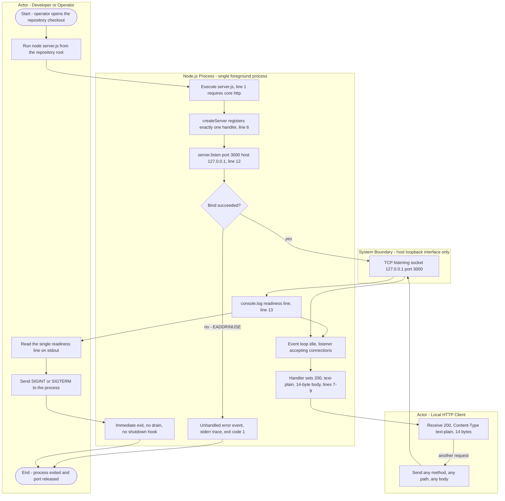
```mermaid
flowchart TD
    subgraph OperatorLane["Actor - Developer or Operator"]
        OpStart(["Start - operator opens the repository checkout"])
        OpLaunch["Run node server.js from the repository root"]
        OpObserve["Read the single readiness line on stdout"]
        OpStop["Send SIGINT or SIGTERM to the process"]
        OpEnd(["End - process exited and port released"])
    end
    subgraph HostLane["System Boundary - host loopback interface only"]
        Socket["TCP listening socket 127.0.0.1 port 3000"]
    end
    subgraph RuntimeLane["Node.js Process - single foreground process"]
        Load["Execute server.js, line 1 requires core http"]
        Create["createServer registers exactly one handler, line 6"]
        Listen["server.listen port 3000 host 127.0.0.1, line 12"]
        BindOK{"Bind succeeded?"}
        Ready["console.log readiness line, line 13"]
        Idle["Event loop idle, listener accepting connections"]
        Handle["Handler sets 200, text-plain, 14-byte body, lines 7-9"]
        Crash["Unhandled error event, stderr trace, exit code 1"]
        Exit["Immediate exit, no drain, no shutdown hook"]
    end
    subgraph ClientLane["Actor - Local HTTP Client"]
        Req["Send any method, any path, any body"]
        Resp["Receive 200, Content-Type text-plain, 14 bytes"]
    end
    OpStart --> OpLaunch
    OpLaunch --> Load
    Load --> Create
    Create --> Listen
    Listen --> BindOK
    BindOK -->|"no - EADDRINUSE"| Crash
    Crash --> OpEnd
    BindOK -->|"yes"| Socket
    Socket --> Ready
    Ready --> OpObserve
    Ready --> Idle
    Req --> Socket
    Socket --> Idle
    Idle --> Handle
    Handle --> Resp
    Resp -->|"another request"| Req
    OpObserve --> OpStop
    OpStop --> Exit
    Exit --> OpEnd
```

The single system boundary is the listening socket at `127.0.0.1:3000`. Nothing crosses that boundary except HTTP bytes on the loopback interface; the two other channels leaving the process — stdout and stderr — are host-local streams, not network interfaces.

#### 4.1.1.3 End-to-End User Journey

The journey below is the same path annotated with the requirement identifiers defined in 2.2 and with every abort path that was reproduced during verification. Three of the five decision diamonds can terminate the journey before a response is ever produced.

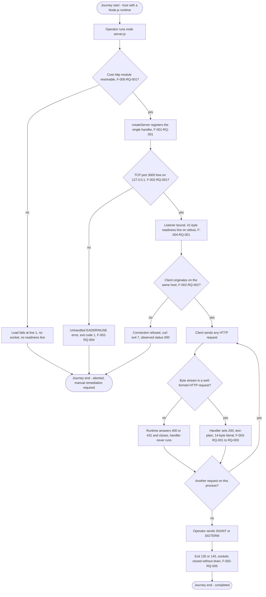
```mermaid
flowchart TD
    A(["Journey start - host with a Node.js runtime"])
    B["Operator runs node server.js"]
    C{"Core http module resolvable, F-005-RQ-001?"}
    C1["Load fails at line 1, no socket, no readiness line"]
    D["createServer registers the single handler, F-001-RQ-001"]
    E{"TCP port 3000 free on 127.0.0.1, F-002-RQ-001?"}
    E1["Unhandled EADDRINUSE error, exit code 1, F-002-RQ-004"]
    F["Listener bound, 41-byte readiness line on stdout, F-004-RQ-001"]
    G{"Client originates on the same host, F-002-RQ-002?"}
    G1["Connection refused, curl exit 7, observed status 000"]
    H["Client sends any HTTP request"]
    I{"Byte stream is a well-formed HTTP request?"}
    I1["Runtime answers 400 or 431 and closes, handler never runs"]
    K["Handler sets 200, text-plain, 14-byte literal, F-003-RQ-001 to RQ-003"]
    J{"Another request on this process?"}
    L["Operator sends SIGINT or SIGTERM"]
    M["Exit 130 or 143, sockets closed without drain, F-002-RQ-005"]
    Z(["Journey end - aborted, manual remediation required"])
    Z2(["Journey end - completed"])
    A --> B
    B --> C
    C -->|"no"| C1
    C1 --> Z
    C -->|"yes"| D
    D --> E
    E -->|"no"| E1
    E1 --> Z
    E -->|"yes"| F
    F --> G
    G -->|"no"| G1
    G1 --> Z
    G -->|"yes"| H
    H --> I
    I -->|"no"| I1
    I1 --> J
    I -->|"yes"| K
    K --> J
    J -->|"yes"| H
    J -->|"no"| L
    L --> M
    M --> Z2
```

**Decision points.** Every branch in the system, with the component that evaluates it and the observed outcomes:

| Decision Point | Evaluated By | Observed Outcomes |
|----------------|--------------|-------------------|
| Is the core `http` module resolvable? | CommonJS resolution in the Node.js runtime | Success on Node v22.23.1; failure would abort at line 1 before any socket exists |
| Is the loopback bind granted for port 3000? | Host TCP stack, surfaced through `server.listen` | Granted, or `EADDRINUSE` raised as an `error` event with zero listeners registered |
| Is the caller on the loopback interface? | Host TCP stack, because `'127.0.0.1'` is passed as the `listen` host | Loopback request answered; request to the host's routable address `10.76.0.92:3000` failed to connect (`curl` exit 7, status `000`) |
| Does the byte stream parse as HTTP? | Node core `http` parser; `clientError` listener count on the live server is `0`, so the runtime default applies | Valid request dispatched to the handler; `THIS IS NOT HTTP` answered `400 Bad Request` with `Connection: close` |
| Is the request head within `maxHeaderSize`? | Node core parser, `http.maxHeaderSize` = 16384 bytes | A 20 000-byte header field was answered `431 Request Header Fields Too Large` with `Connection: close` |
| Is an `Expect: 100-continue` header present? | Node core; `checkContinue` listener count is `0` | Runtime auto-emitted `HTTP/1.1 100 Continue` and then the handler's normal `200` |
| Is the method `HEAD`? | Node core response serializer | `200` with `Content-Type: text/plain` and a zero-byte body (F-003-RQ-005) |
| Is keep-alive negotiated, and has the socket gone idle? | Node core, `keepAliveTimeout` = 5000 ms | HTTP/1.1 client received `Connection: keep-alive` and `Keep-Alive: timeout=5`; an idle socket was closed by the server after approximately 5.8 s; an HTTP/1.0 request received `Connection: close` |
| **Any application-level decision** | **None exists** | `server.js` contains no `if`, `switch`, or ternary; all six methods probed (`GET`, `POST`, `PUT`, `DELETE`, `OPTIONS`, `PATCH`) on a deep path with a query string, a body, and a custom header returned byte-identical `200` responses |

**User touchpoints.** The complete set of surfaces through which a human interacts with the system:

| Touchpoint | Direction | Content Observed |
|------------|-----------|------------------|
| Shell invocation `node server.js` | Operator into system | The only supported entry path; no install, build, or transpile step precedes it (F-005-RQ-002) |
| Process stdout | System to operator | Exactly one 41-byte line, `Server running at http://127.0.0.1:3000/`, emitted once on successful bind; still 41 bytes after roughly 80 requests |
| HTTP request and response on `127.0.0.1:3000` | Client into system and back | Any method and path in, `200` / `text/plain` / 14 bytes out |
| Process stderr | System to operator | Empty on success; carries the unhandled-`error` stack trace on bind failure only |
| Signal delivery and exit code | Operator into system, status back | `SIGINT` observed exit `130`, `SIGTERM` observed exit `143`, bind failure exit `1` |

**Error handling paths.** All four reachable failure paths, each reproduced during verification. None is handled by repository code, because `server.js` contains no `try`/`catch`, no `throw`, and no `error` listener.

| Failure Path | Where It Surfaces | Client-Visible and Operator-Visible Result |
|--------------|-------------------|--------------------------------------------|
| Port already bound | `server.listen`, line 12 | No listener, no readiness line, stderr stack trace, exit code 1 |
| Malformed request | Node core parser, before dispatch | `400 Bad Request` plus `Connection: close`; handler never invoked; nothing logged |
| Request head over 16 KiB | Node core parser, before dispatch | `431 Request Header Fields Too Large` plus `Connection: close`; handler never invoked; nothing logged |
| Termination signal during traffic | Default signal disposition, no handler registered | Process exits immediately; an already-open keep-alive socket observed a peer close with no response; subsequent probes return status `000` |

### 4.1.2 Integration Workflows

#### 4.1.2.1 Integration Surface

The integration inventory is closed and consists of four couplings, consistent with 2.3.3. No database, cache, broker, outbound HTTP client, identity provider, secret manager, feature-flag service, file-system access, or log-aggregation client appears anywhere in `server.js`.

| Integration | Direction | Contract as Observed |
|-------------|-----------|----------------------|
| TCP listening socket `127.0.0.1:3000` | Inbound | HTTP/1.1 request and response, runtime-default keep-alive (`Keep-Alive: timeout=5` on the wire) |
| Node core `http` API, in-process | Internal | Direct calls to `createServer`, `listen`, `res.statusCode`, `res.setHeader`, `res.end` with no wrapper, adapter, or middleware |
| `process.stdout` | Outbound | One newline-terminated line, once per successful start |
| Operating-system process control | Bidirectional | Signals in; exit codes 1, 130, 143 out; stderr trace on bind failure |

#### 4.1.2.2 Startup Integration Sequence

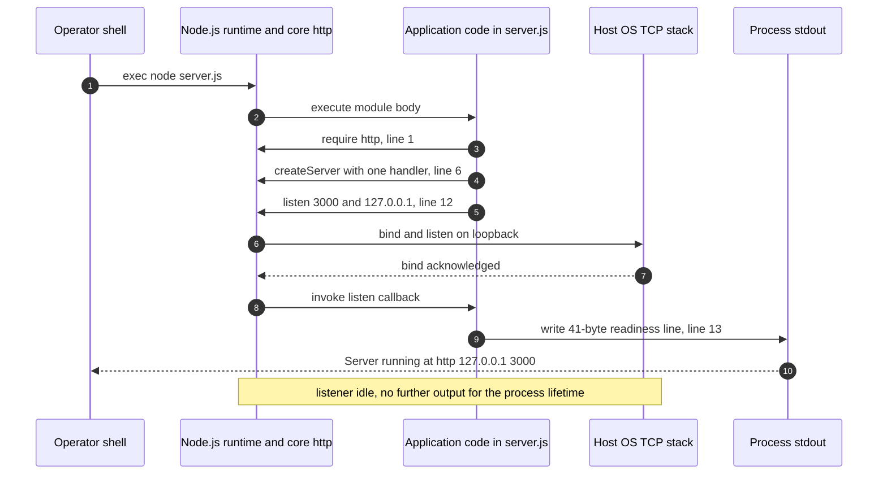
```mermaid
sequenceDiagram
    autonumber
    participant OP as Operator shell
    participant NR as Node.js runtime and core http
    participant AH as Application code in server.js
    participant OS as Host OS TCP stack
    participant SO as Process stdout
    OP->>NR: exec node server.js
    NR->>AH: execute module body
    AH->>NR: require http, line 1
    AH->>NR: createServer with one handler, line 6
    AH->>NR: listen 3000 and 127.0.0.1, line 12
    NR->>OS: bind and listen on loopback
    OS-->>NR: bind acknowledged
    NR->>AH: invoke listen callback
    AH->>SO: write 41-byte readiness line, line 13
    SO-->>OP: Server running at http 127.0.0.1 3000
    Note over NR,OS: listener idle, no further output for the process lifetime
```

Because `server.listen(...)` is a top-level statement, this sequence is a module-load side effect: loading the file *is* starting the service, and requiring it from another script produces an exports object with zero own keys while still attempting the bind (F-005-RQ-003). A poll loop started immediately after launch observed the socket accepting connections 13 ms into polling — an environment measurement, not a target.

#### 4.1.2.3 Request and Response Integration Sequence

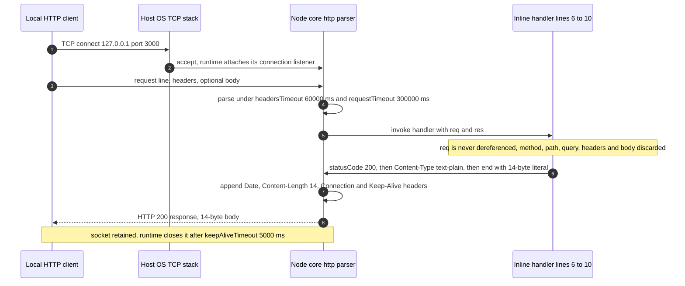
```mermaid
sequenceDiagram
    autonumber
    participant CL as Local HTTP client
    participant OS as Host OS TCP stack
    participant NR as Node core http parser
    participant AH as Inline handler lines 6 to 10
    CL->>OS: TCP connect 127.0.0.1 port 3000
    OS->>NR: accept, runtime attaches its connection listener
    CL->>NR: request line, headers, optional body
    NR->>NR: parse under headersTimeout 60000 ms and requestTimeout 300000 ms
    NR->>AH: invoke handler with req and res
    Note over AH: req is never dereferenced, method, path, query, headers and body discarded
    AH->>NR: statusCode 200, then Content-Type text-plain, then end with 14-byte literal
    NR->>NR: append Date, Content-Length 14, Connection and Keep-Alive headers
    NR-->>CL: HTTP 200 response, 14-byte body
    Note over NR,CL: socket retained, runtime closes it after keepAliveTimeout 5000 ms
```

The division of labour visible in this sequence is the system's defining integration characteristic: application code contributes three statements (status, one header, body), while the runtime contributes parsing, dispatch, `Content-Length` computation, `Date`, connection management, and keep-alive negotiation (F-003-RQ-004).

#### 4.1.2.4 Bind-Failure Integration Sequence

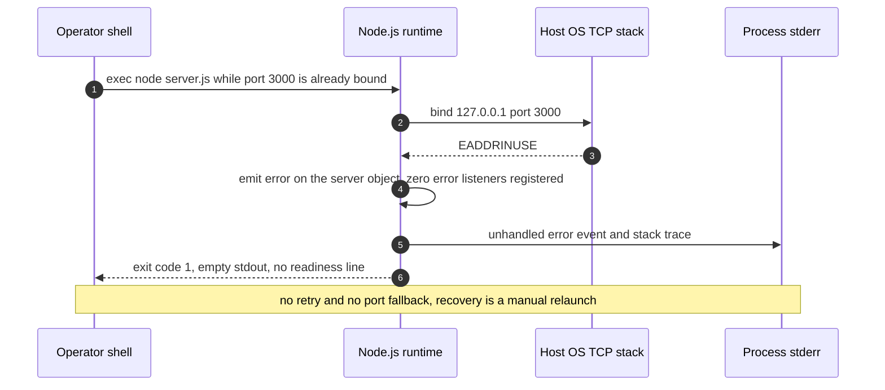
```mermaid
sequenceDiagram
    autonumber
    participant OP as Operator shell
    participant NR as Node.js runtime
    participant OS as Host OS TCP stack
    participant SE as Process stderr
    OP->>NR: exec node server.js while port 3000 is already bound
    NR->>OS: bind 127.0.0.1 port 3000
    OS-->>NR: EADDRINUSE
    NR->>NR: emit error on the server object, zero error listeners registered
    NR->>SE: unhandled error event and stack trace
    NR-->>OP: exit code 1, empty stdout, no readiness line
    Note over OP,SE: no retry and no port fallback, recovery is a manual relaunch
```

Reproduced verbatim during verification: a second launch while the port was held exited with code `1`, wrote 0 bytes to stdout, and wrote a stderr trace beginning `throw er; // Unhandled 'error' event` followed by `Error: listen EADDRINUSE: address already in use 127.0.0.1:3000`.

#### 4.1.2.5 Data Flow Across the System Boundary

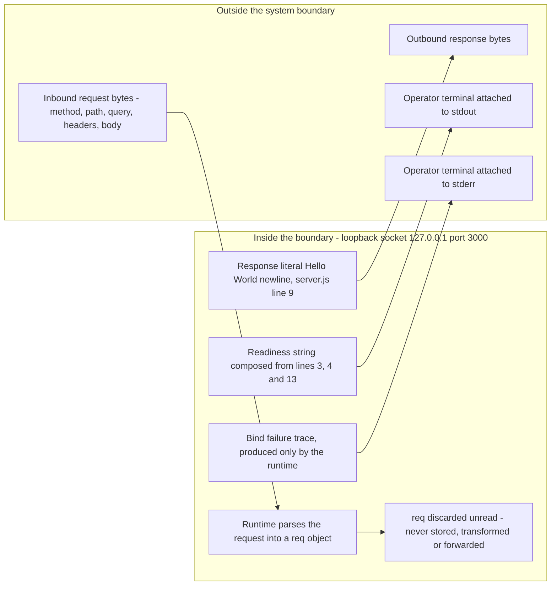
```mermaid
flowchart LR
    subgraph Outside["Outside the system boundary"]
        C1["Inbound request bytes - method, path, query, headers, body"]
        C2["Outbound response bytes"]
        C3["Operator terminal attached to stdout"]
        C4["Operator terminal attached to stderr"]
    end
    subgraph Inside["Inside the boundary - loopback socket 127.0.0.1 port 3000"]
        P1["Runtime parses the request into a req object"]
        P2["req discarded unread - never stored, transformed or forwarded"]
        P3["Response literal Hello World newline, server.js line 9"]
        P4["Readiness string composed from lines 3, 4 and 13"]
        P5["Bind failure trace, produced only by the runtime"]
    end
    C1 --> P1
    P1 --> P2
    P3 --> C2
    P4 --> C3
    P5 --> C4
```

The critical structural property is that **inbound and outbound data are not connected by any transformation**. The response literal at line 9 is the sole outbound payload source, so there is no data flow *through* the system — only data flow *in* (discarded) and data flow *out* (constant). Consequently there is no serialization format, schema, mapping layer, or data-quality step to document, and no persistence point anywhere in the flow.

| Data Element | Lifetime | Handling |
|--------------|----------|----------|
| Inbound request (method, URL, headers, body) | Duration of the handler invocation | Parsed by the runtime, never read by application code, released with the request object |
| Outbound response body | Source-code literal, line 9 | Identical 14 bytes for every request; `Content-Length: 14` computed by the runtime |
| Readiness line | Written once at bind | 41 bytes to stdout; no file, rotation, or retention target exists |
| Bind-failure trace | Written once on failure | stderr only; discloses bind address, port, and `errno`, no secret material |

#### 4.1.2.6 Event Processing and Batch Processing

Neither exists in this repository, and each absence was verified rather than assumed.

| Prompted Capability | Verified Status |
|---------------------|-----------------|
| Event processing flows | No broker or stream client, no publish or subscribe call, no `EventEmitter` usage authored in `server.js`. The only events in play are internal Node.js lifecycle events (`request`, `connection`, `error`) whose listener counts on the live server object are 1, 1, and **0** respectively — the first two registered by the runtime and by `createServer`, none by application code |
| Batch processing sequences | No cron entry, scheduler, timer, or job runner. `grep` for `setTimeout`, `setInterval`, and `cron` in `server.js` returns zero matches; the process performs no work between requests |
| Asynchronous or deferred work | None. The handler is three synchronous statements with no `async`, `await`, `Promise`, or callback chain (F-001-RQ-003) |
| Message durability, retries, dead-letter handling | Not applicable — no message-oriented middleware exists to configure |

The single "event-driven" behavior that does exist is the Node.js event loop itself accepting connections and dispatching the one registered `request` listener, which is already captured in 4.1.2.3.

## 4.2 Flowchart Requirements

This section presents the detailed process flow for each core feature, followed by the validation rules and timing characteristics that apply to those flows. The two detailed flows correspond to the two code paths that exist in `server.js`: the startup path (lines 1–4, 6, 12–14) and the request path (lines 6–10).

The prompted flowchart elements are represented as follows, so each diagram can be read consistently:

| Required Element | How It Is Represented in 4.2 |
|------------------|------------------------------|
| Start and end points | Stadium-shaped terminator nodes; every flow has exactly one start and at least one success and one failure terminator |
| Process steps | Rectangular nodes, each annotated with the `server.js` line number that implements it |
| Decision diamonds | Diamond nodes, each labelled with the component that evaluates it, since none is evaluated by repository code |
| System boundaries | Subgraph zones separating the client, the Node.js runtime, and the repository code |
| User touchpoints | Nodes in the client and operator zones; enumerated in 4.1.1.3 |
| Error states and recovery paths | Distinct failure terminators plus the recovery flow in 4.3.2 |
| Timing and SLA considerations | Consolidated in 4.2.4; no SLA is declared anywhere in the repository |

### 4.2.1 Process Flow — Startup and Listener Binding

This flow implements F-002 (endpoint binding and listener lifecycle), F-004 (readiness logging), and F-005 (direct execution model). It begins with a shell invocation and ends either with an idle, accepting listener or with an aborted process.

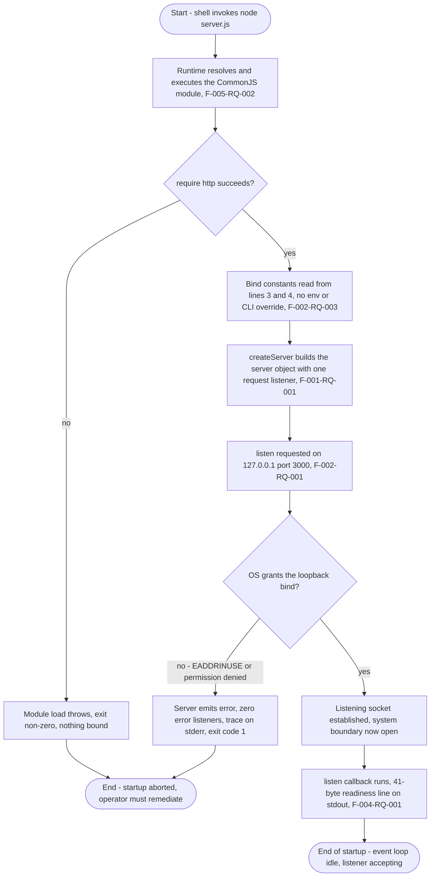
```mermaid
flowchart TD
    S(["Start - shell invokes node server.js"])
    A1["Runtime resolves and executes the CommonJS module, F-005-RQ-002"]
    A2{"require http succeeds?"}
    A3["Module load throws, exit non-zero, nothing bound"]
    A4["Bind constants read from lines 3 and 4, no env or CLI override, F-002-RQ-003"]
    A5["createServer builds the server object with one request listener, F-001-RQ-001"]
    A6["listen requested on 127.0.0.1 port 3000, F-002-RQ-001"]
    A7{"OS grants the loopback bind?"}
    A8["Server emits error, zero error listeners, trace on stderr, exit code 1"]
    A9["Listening socket established, system boundary now open"]
    A10["listen callback runs, 41-byte readiness line on stdout, F-004-RQ-001"]
    A11(["End of startup - event loop idle, listener accepting"])
    E(["End - startup aborted, operator must remediate"])
    S --> A1
    A1 --> A2
    A2 -->|"no"| A3
    A3 --> E
    A2 -->|"yes"| A4
    A4 --> A5
    A5 --> A6
    A6 --> A7
    A7 -->|"no - EADDRINUSE or permission denied"| A8
    A8 --> E
    A7 -->|"yes"| A9
    A9 --> A10
    A10 --> A11
```

| Step | Implementation | Verified Behavior |
|------|----------------|-------------------|
| Module execution | Direct invocation of `server.js`; the file has no exports, so loading it is starting it | A bare checkout runs with no install or build step; requiring the module yields zero own keys while still binding |
| Constant resolution | `hostname` at line 3, `port` at line 4 | Literals only; a `grep` for `process.env`, `argv`, `dotenv`, and `config` in `server.js` returns no match, so there is no override path |
| Handler registration | `http.createServer` at line 6 | Live server object reports exactly one `request` listener |
| Bind request | `server.listen(port, hostname, cb)` at line 12 | Live server object reports `listening: true` and address `{127.0.0.1, IPv4, 3000}` |
| Readiness signal | `console.log` template literal at line 13 | stdout exactly 41 bytes, stderr 0 bytes; the advertised URL is composed from the same constants that were bound |
| Bind failure | No handling in repository code — the live server object reports **0** `error` listeners | Second launch exited with code 1 and a stderr stack trace; no readiness line and no partial listener |

There is no readiness gate beyond the log line: the socket begins accepting connections when `listen` succeeds, and no health or readiness endpoint distinct from the single response exists.

### 4.2.2 Process Flow — Request Reception and Response Emission

This flow implements F-001 (handler dispatch) and F-003 (response contract). The three zones make explicit which steps are performed by the client, which by the Node.js runtime, and which by the fourteen lines in the repository — a distinction that matters because the runtime owns every decision.

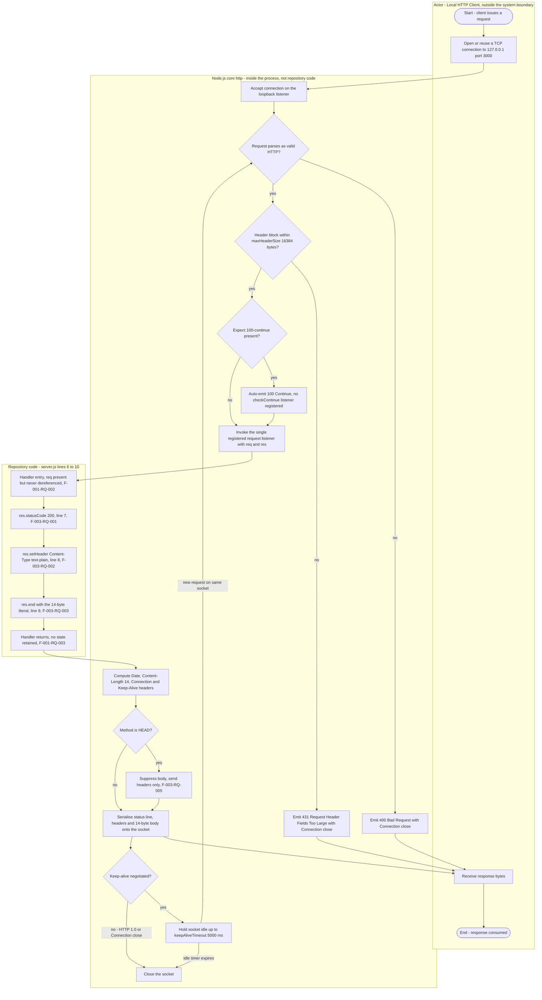
```mermaid
flowchart TD
    subgraph ClientZone["Actor - Local HTTP Client, outside the system boundary"]
        CStart(["Start - client issues a request"])
        CConn["Open or reuse a TCP connection to 127.0.0.1 port 3000"]
        CRecv["Receive response bytes"]
        CEnd(["End - response consumed"])
    end
    subgraph RuntimeZone["Node.js core http - inside the process, not repository code"]
        RAccept["Accept connection on the loopback listener"]
        RParse{"Request parses as valid HTTP?"}
        RErr400["Emit 400 Bad Request with Connection close"]
        RHdr{"Header block within maxHeaderSize 16384 bytes?"}
        RErr431["Emit 431 Request Header Fields Too Large with Connection close"]
        RExpect{"Expect 100-continue present?"}
        RCont["Auto-emit 100 Continue, no checkContinue listener registered"]
        RDispatch["Invoke the single registered request listener with req and res"]
        RFrame["Compute Date, Content-Length 14, Connection and Keep-Alive headers"]
        RHead{"Method is HEAD?"}
        RSuppress["Suppress body, send headers only, F-003-RQ-005"]
        RSend["Serialise status line, headers and 14-byte body onto the socket"]
        RKeep{"Keep-alive negotiated?"}
        RClose["Close the socket"]
        RIdleWait["Hold socket idle up to keepAliveTimeout 5000 ms"]
    end
    subgraph AppZone["Repository code - server.js lines 6 to 10"]
        HEnter["Handler entry, req present but never dereferenced, F-001-RQ-002"]
        HStatus["res.statusCode 200, line 7, F-003-RQ-001"]
        HType["res.setHeader Content-Type text-plain, line 8, F-003-RQ-002"]
        HEnd["res.end with the 14-byte literal, line 9, F-003-RQ-003"]
        HReturn["Handler returns, no state retained, F-001-RQ-003"]
    end
    CStart --> CConn
    CConn --> RAccept
    RAccept --> RParse
    RParse -->|"no"| RErr400
    RErr400 --> CRecv
    RParse -->|"yes"| RHdr
    RHdr -->|"no"| RErr431
    RErr431 --> CRecv
    RHdr -->|"yes"| RExpect
    RExpect -->|"yes"| RCont
    RCont --> RDispatch
    RExpect -->|"no"| RDispatch
    RDispatch --> HEnter
    HEnter --> HStatus
    HStatus --> HType
    HType --> HEnd
    HEnd --> HReturn
    HReturn --> RFrame
    RFrame --> RHead
    RHead -->|"yes"| RSuppress
    RSuppress --> RSend
    RHead -->|"no"| RSend
    RSend --> CRecv
    RSend --> RKeep
    RKeep -->|"yes"| RIdleWait
    RIdleWait -->|"new request on same socket"| RParse
    RIdleWait -->|"idle timer expires"| RClose
    RKeep -->|"no - HTTP 1.0 or Connection close"| RClose
    CRecv --> CEnd
```

The application zone is three statements long, and the response contract they establish was confirmed byte-wise:

```javascript
res.statusCode = 200;                              // line 7
res.setHeader('Content-Type', 'text/plain');       // line 8
```

| Aspect | Observed Result |
|--------|-----------------|
| Method independence | `GET`, `POST`, `DELETE`, `PUT`, `OPTIONS`, and `PATCH` against `/any/deep/path?q=1` with body `payload=ignored` and header `X-Custom: abc` all returned `status=200 size=14 type=text/plain` |
| `HEAD` handling | `status=200 size=0 type=text/plain` — body suppression performed by the runtime, not by application code |
| Header set on the wire | `Content-Type` (application-set) plus `Date`, `Connection: keep-alive`, `Keep-Alive: timeout=5`, `Content-Length: 14` (runtime-set) |
| Body bytes | `od -c` shows `H e l l o , space W o r l d ! \n` — 14 bytes |
| Recovery paths inside this flow | None are needed and none exist: the handler has no branch that can fail, and protocol failures are terminated by the runtime with `400` or `431` before dispatch |

### 4.2.3 Validation Rules

The repository implements **no validation layer**. This is a structural consequence of F-001-RQ-002 rather than an omission at a particular step: because no property of `req` is ever read, there is no value in the system that could be validated, rejected, or sanitized. The flow below traces a request through the five checkpoint classes a conventional service would apply and records, at each, what the code actually does.


```mermaid
flowchart LR
    In(["Inbound request reaches the handler"])
    V1{"Authentication checkpoint?"}
    V2{"Authorization checkpoint?"}
    V3{"Schema or payload validation?"}
    V4{"Rate limit or quota check?"}
    V5{"Regulatory or audit check?"}
    Out(["Fixed 200 response emitted"])
    N1["Not implemented - no credential is read"]
    N2["Not implemented - no role, tenant or scope exists"]
    N3["Not implemented - no request attribute is read"]
    N4["Not implemented - no counter or limiter exists"]
    N5["Not implemented - no regime declared in the repository"]
    In --> V1
    V1 -->|"absent"| N1
    N1 --> V2
    V2 -->|"absent"| N2
    N2 --> V3
    V3 -->|"absent"| N3
    N3 --> V4
    V4 -->|"absent"| N4
    N4 --> V5
    V5 -->|"absent"| N5
    N5 --> Out
```

#### 4.2.3.1 Business Rules Enforced at Each Step

The rules that *are* enforced are invariants guaranteed by construction rather than by validation code. Each is enforced because the alternative is unrepresentable in the source.

| Step | Invariant Enforced | Enforcement Mechanism |
|------|--------------------|-----------------------|
| Startup, line 12 | Exactly one endpoint is exposed, at exactly one address | A single `listen` call with literal arguments; no loop, list, or configuration source |
| Startup, lines 3–4, 13 | The advertised endpoint always equals the bound endpoint | Both the `listen` call and the readiness message interpolate the same two constants (F-004-RQ-002) |
| Dispatch, line 6 | Every accepted request is serviced; no request is rejected by the application | One registered handler and no dispatch logic, so there is no `404` or `405` path to reach |
| Handler, lines 7–9 | Success is the only representable outcome | `200` is assigned unconditionally, and no other status assignment exists in the file |
| Handler, line 9 | The payload is immutable across requests, clients, and time | The body is a source-code string literal; 20 sequential requests produced one unique body |
| Handler exit, line 10 | No request can influence any other | No module-scoped mutable state; nothing is written to memory, disk, or a cache |

#### 4.2.3.2 Data Validation Requirements

None apply, and the reason is mechanical: the request never reaches application code as data. The runtime performs *protocol* validation only, and its two rejection outcomes were reproduced directly — `400 Bad Request` for a malformed request line and `431 Request Header Fields Too Large` for a head exceeding `http.maxHeaderSize` (16384 bytes). Both are emitted before the handler is invoked, so the application cannot observe or influence them. There is no schema, type check, length limit, encoding check, or sanitizer in the repository, and no library that could provide one, since the only import is the core `http` module.

#### 4.2.3.3 Authorization Checkpoints

There is exactly one access-control mechanism in the entire system, and it is topological rather than logical: the `'127.0.0.1'` argument at line 12 confines reachability to the host's loopback interface. This was confirmed by probing the host's routable address `10.76.0.92:3000`, which failed to connect (`curl` exit 7, status `000`). Beyond that boundary, every caller is anonymous and identically privileged — the code contains no credential handling, token verification, session, role, scope, tenant, or allow-list, and it reads no request header that could carry an identity.

#### 4.2.3.4 Regulatory Compliance Checks

No compliance regime is declared or implemented anywhere in the repository, and no compliance-relevant processing occurs. Two verified facts bound the exposure: request content is never read, so no personal or sensitive data can be inspected, logged, or retained; and the process writes nothing to disk, which was confirmed by an unchanged working tree (`git status --porcelain` reported 0 changed files) and the absence of any `fs` usage. There is no audit trail, retention policy, consent mechanism, data-subject-access path, or encryption of data in transit — the service speaks plain HTTP only.

### 4.2.4 Timing and SLA Considerations

**No SLA, SLO, error budget, latency target, or throughput target exists in this repository.** As recorded in 2.2, zero of the twenty requirements carry a declared performance target, and there is no benchmark, load-test harness, or performance budget in the tree. The timing values below are of two distinct kinds, and the distinction is material: the first group are Node.js defaults that govern the flow (read from the live server object created by `server.js`, none of which the application overrides), and the second group are wall-clock observations from this documentation environment.

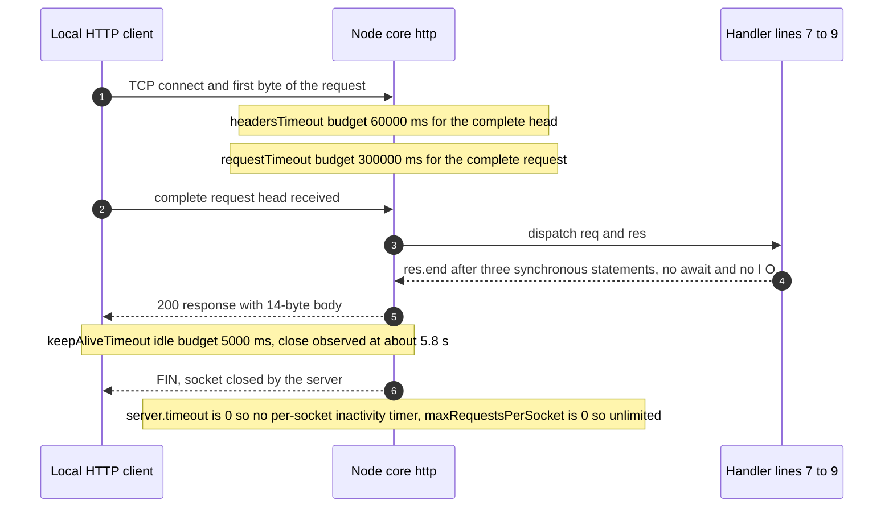
```mermaid
sequenceDiagram
    autonumber
    participant CL as Local HTTP client
    participant NR as Node core http
    participant AH as Handler lines 7 to 9
    CL->>NR: TCP connect and first byte of the request
    Note over NR: headersTimeout budget 60000 ms for the complete head
    Note over NR: requestTimeout budget 300000 ms for the complete request
    CL->>NR: complete request head received
    NR->>AH: dispatch req and res
    AH-->>NR: res.end after three synchronous statements, no await and no I O
    NR-->>CL: 200 response with 14-byte body
    Note over NR,CL: keepAliveTimeout idle budget 5000 ms, close observed at about 5.8 s
    NR-->>CL: FIN, socket closed by the server
    Note over NR: server.timeout is 0 so no per-socket inactivity timer, maxRequestsPerSocket is 0 so unlimited
```

#### 4.2.4.1 Runtime Timing Constraints Governing the Flows

All values were read from the live `http.Server` instance that `server.js` creates. Because `server.js` assigns none of these properties, every value is a Node.js v22.23.1 default.

| Constraint | Value on the Live Server | Effect on the Flow |
|------------|--------------------------|--------------------|
| `keepAliveTimeout` | 5000 ms | Idle keep-alive sockets are closed by the server; also advertised to clients as `Keep-Alive: timeout=5`. An idle socket was observed closing at approximately 5.8 s, reflecting the timer plus Node's periodic connection-check granularity |
| `headersTimeout` | 60000 ms | Upper bound for receiving a complete request head before the runtime aborts the request |
| `requestTimeout` | 300000 ms | Upper bound for receiving a complete request, including body |
| `server.timeout` | 0 | No per-socket inactivity timeout is active |
| `maxRequestsPerSocket` | 0 | Unlimited requests per keep-alive connection |
| `http.maxHeaderSize` | 16384 bytes | Head larger than this is rejected with `431` before dispatch |
| `maxHeadersCount` | null | No explicit cap on header count |
| Server `timeout` listeners | 0 | No application-level timeout handling exists |

#### 4.2.4.2 Observed Latency Characteristics

These figures characterize the verification host and the loopback path, **not** the system's obligations. They are included because the prompt asks for timing considerations and because no declared target exists to report instead.

| Measurement | Observation |
|-------------|-------------|
| Startup to accepting connections | The listening socket accepted a connection 13 ms into a poll loop begun immediately after launch |
| Response time, first request on a new connection | 0.0038 s total, including TCP setup |
| Response time, subsequent requests | 0.00031 s to 0.00055 s across `POST`, `DELETE`, `PUT`, `OPTIONS`, and `PATCH` probes |
| Concurrency behavior | 60 requests issued at concurrency 15 returned `200` in every case, served by a single process and a single event loop |
| Shutdown latency | `SIGTERM` and `SIGINT` both removed the listener within the sub-second window measured; a follow-up probe returned status `000` |

#### 4.2.4.3 Timing-Related Risks Visible in the Flow

Three timing properties follow directly from the code's construction and are stated as observations, not defects: capacity is bounded by one event loop in one process because there is no `cluster` or `worker_threads` usage; a slow or stalled client occupies a connection for up to the runtime's `requestTimeout` of 300000 ms with no application-level guard, since the server's `timeout` listener count is 0; and no request-level latency is measurable from the system itself, because the only instrumentation is the startup log line, which remained 41 bytes after roughly 80 requests.

## 4.3 Technical Implementation

This section documents how the flows in 4.1 and 4.2 are realized in terms of state and error handling. Both topics are unusual in this repository because `server.js` implements neither: it holds no mutable state and contains no error-handling construct. What follows therefore documents the state and error behavior that the system genuinely exhibits — most of it owned by the Node.js runtime and the operating system — and records precisely which mechanisms are absent, each verified rather than assumed.

### 4.3.1 State Management

#### 4.3.1.1 State Inventory

The complete state inventory of the running system is four items long. Nothing in it is mutable by a request, and nothing survives the process.

| State Item | Where It Lives | Mutability and Lifetime |
|------------|----------------|-------------------------|
| `hostname` and `port` constants | Module scope, `server.js` lines 3–4 | Immutable literals, fixed at authoring time; read by `listen` (line 12) and by the readiness log (line 13) |
| `http.Server` instance | Module scope, `server.js` line 6 | Created once; its only application-level consumer is the `listen` call at line 12 |
| Per-request `req` and `res` pair | Runtime-managed, handler parameters at line 6 | Created per request by the runtime and released when the response completes; `req` is never dereferenced by application code |
| Connection and keep-alive bookkeeping | Runtime-internal, inside the Node.js `http` and `net` layers | Managed entirely by the runtime; the application registers no `connection`, `timeout`, or `clientError` listener |

There is **no application-level state at all**: no module-scoped `let` or `var`, no counter, no session store, no in-memory map, and no closure variable shared across invocations. This is what makes F-001-RQ-003 (stateless processing) structural rather than aspirational, and it was confirmed behaviourally — 20 sequential requests produced exactly one unique response body and 60 requests at concurrency 15 all returned `200`.

#### 4.3.1.2 Process Lifecycle State Transitions

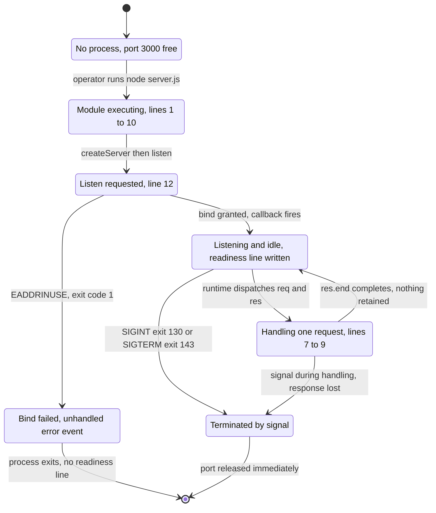
```mermaid
stateDiagram-v2
    state "No process, port 3000 free" as S0
    state "Module executing, lines 1 to 10" as S1
    state "Listen requested, line 12" as S2
    state "Listening and idle, readiness line written" as S3
    state "Handling one request, lines 7 to 9" as S4
    state "Bind failed, unhandled error event" as S5
    state "Terminated by signal" as S6
    [*] --> S0
    S0 --> S1: operator runs node server.js
    S1 --> S2: createServer then listen
    S2 --> S3: bind granted, callback fires
    S2 --> S5: EADDRINUSE, exit code 1
    S3 --> S4: runtime dispatches req and res
    S4 --> S3: res.end completes, nothing retained
    S3 --> S6: SIGINT exit 130 or SIGTERM exit 143
    S4 --> S6: signal during handling, response lost
    S5 --> [*]: process exits, no readiness line
    S6 --> [*]: port released immediately
```

Two properties of this machine are worth stating explicitly. First, there is **no draining state** between "listening" and "terminated": with zero `SIGTERM` and zero `SIGINT` listeners registered on the process, the default disposition applies, and a keep-alive socket that was open when `SIGTERM` arrived observed an immediate peer close with no further response. Second, the transition into `S5` is terminal and unrecoverable in-process — there is no port fallback, no retry timer, and no supervisor, so `S5` always leads to process exit.

#### 4.3.1.3 Connection and Keep-Alive State Transitions

Connection state is the only state in the system with non-trivial transitions, and all of it belongs to the runtime. Every transition below was reproduced during verification.

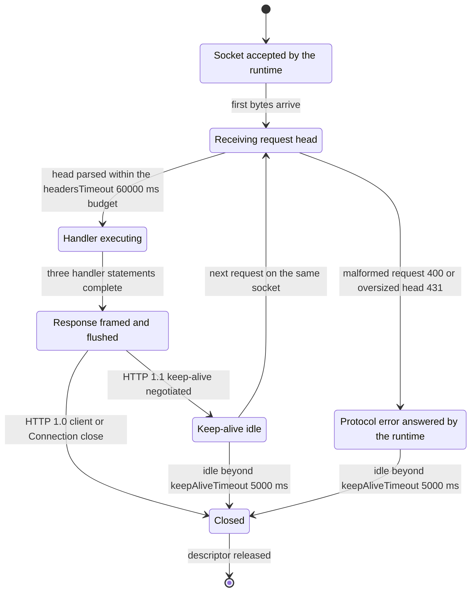
```mermaid
stateDiagram-v2
    state "Socket accepted by the runtime" as C0
    state "Receiving request head" as C1
    state "Handler executing" as C2
    state "Response framed and flushed" as C3
    state "Keep-alive idle" as C4
    state "Protocol error answered by the runtime" as C5
    state "Closed" as C6
    [*] --> C0
    C0 --> C1: first bytes arrive
    C1 --> C2: head parsed within the headersTimeout 60000 ms budget
    C1 --> C5: malformed request 400 or oversized head 431
    C2 --> C3: three handler statements complete
    C3 --> C4: HTTP 1.1 keep-alive negotiated
    C3 --> C6: HTTP 1.0 client or Connection close
    C4 --> C1: next request on the same socket
    C4 --> C6: idle beyond keepAliveTimeout 5000 ms
    C5 --> C6: idle beyond keepAliveTimeout 5000 ms
    C6 --> [*]: descriptor released
```

The `C1 → C5` transition is the only path in the system that produces a non-`200` status, and it never involves repository code: the live server object reports **0** `clientError` listeners, so the runtime's default response applies (`400 Bad Request` or `431 Request Header Fields Too Large`, each followed by `Connection: close`).

#### 4.3.1.4 Response Object State Transitions

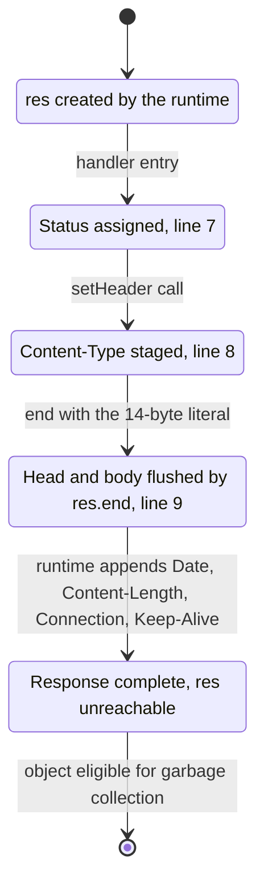
```mermaid
stateDiagram-v2
    state "res created by the runtime" as R0
    state "Status assigned, line 7" as R1
    state "Content-Type staged, line 8" as R2
    state "Head and body flushed by res.end, line 9" as R3
    state "Response complete, res unreachable" as R4
    [*] --> R0
    R0 --> R1: handler entry
    R1 --> R2: setHeader call
    R2 --> R3: end with the 14-byte literal
    R3 --> R4: runtime appends Date, Content-Length, Connection, Keep-Alive
    R4 --> [*]: object eligible for garbage collection
```

The ordering matters and is enforced by the runtime rather than by the code: `setHeader` at line 8 must precede `res.end` at line 9, because headers are flushed with the first body write. Since the handler contains no branch, the sequence `R0 → R1 → R2 → R3 → R4` is the only reachable path, which is why every probe returned an identical header set.

#### 4.3.1.5 Data Persistence Points

There are none. The system has **zero persistence points**, verified from three angles: `server.js` contains no `fs` usage, no database or cache client, and no `require` other than `http`; the repository working tree was unchanged after all verification runs (`git status --porcelain` reported 0 changed files, and no new files appeared in the checkout); and the only output channels are the network socket and the two standard streams. Consequently there is no write-ahead point, no checkpoint, no durable queue, and no recovery-from-storage procedure to document. The startup readiness line is written to stdout only — it is not persisted to a log file, and no rotation or retention target exists.

#### 4.3.1.6 Caching

No caching layer exists at any tier: no in-process cache or memoization, no cache client, and no HTTP cache-control directives. This last point is worth stating precisely because it is observable on the wire — the application sets exactly one response header (`Content-Type`), so no `Cache-Control`, `ETag`, `Last-Modified`, `Expires`, or `Vary` header is emitted, and clients therefore receive no caching guidance for a payload that is in fact permanently constant. The nearest thing to a cache in the system is the runtime's keep-alive connection reuse (`keepAliveTimeout` 5000 ms), which caches the *connection*, not the response.

#### 4.3.1.7 Transaction Boundaries

```mermaid
flowchart TD
    A(["Request arrives at the listener"])
    B["Unit of work begins - runtime invokes the handler"]
    C["Three synchronous statements, no await, no external call, no shared variable"]
    D["Unit of work ends - res.end returns and the handler exits"]
    E{"Any durable state written during the unit of work?"}
    F["No - no database, cache, file, queue or in-memory accumulator exists"]
    G(["No commit, rollback, idempotency key or compensation applies"])
    A --> B
    B --> C
    C --> D
    D --> E
    E -->|"no"| F
    F --> G
```

The unit of work is one handler invocation, and it is atomic by construction: it is fully synchronous, so the single-threaded event loop cannot interleave another request inside it, and it touches nothing outside the `res` object handed to it. There is no transaction manager, no two-phase commit, no saga or compensation, and no idempotency mechanism — and none is needed, because every invocation is a pure write of a constant to one socket. The only partial-failure mode is a process termination mid-invocation, in which case the client's connection is closed without a response and there is nothing to roll back.

### 4.3.2 Error Handling

#### 4.3.2.1 Error Handling Inventory

The starting point for this sub-section is an audited absence. `server.js` contains no `try`, no `catch`, no `throw`, no `.catch()`, no `server.on('error', ...)`, no `clientError` handler, and no `process.on('uncaughtException'/'unhandledRejection')`. This was confirmed twice: by a grep of the source, and by reading listener counts from the live server and process objects, where `error`, `clientError`, `timeout`, `SIGTERM`, `SIGINT`, `uncaughtException`, and `unhandledRejection` all report **0** listeners. Every error behavior the system exhibits is therefore a default of the Node.js runtime or the operating system.

#### 4.3.2.2 Error Classification and Disposition

```mermaid
flowchart TD
    F(["Fault occurs"])
    Q1{"Fault surfaces during bind or during a request?"}
    B1["Server error event raised by the runtime"]
    B2{"Any error listener registered?"}
    B3["Zero listeners - Node rethrows as an uncaught exception"]
    B4["stderr stack trace, process exit code 1, no readiness line"]
    R1{"Fault is a protocol fault or an application fault?"}
    R2["Runtime answers 400 or 431 and closes the socket, handler never invoked"]
    R3["No application fault path exists - handler has no branch, no throw, no try or catch"]
    R4["Client observes a response, process stays alive, nothing logged"]
    T1["Signal delivered - no SIGTERM or SIGINT listener registered"]
    T2["Default disposition, immediate exit 130 or 143, in-flight sockets closed"]
    Rec(["Recovery - operator relaunches node server.js manually"])
    End(["End - client-visible outcome only, no notification channel exists"])
    F --> Q1
    Q1 -->|"bind, startup"| B1
    B1 --> B2
    B2 -->|"no"| B3
    B3 --> B4
    B4 --> Rec
    Q1 -->|"request, steady state"| R1
    R1 -->|"protocol"| R2
    R2 --> R4
    R1 -->|"application"| R3
    R3 --> R4
    R4 --> End
    Q1 -->|"termination signal"| T1
    T1 --> T2
    T2 --> Rec
```

| Fault Class | Disposition | Verified Evidence |
|-------------|-------------|-------------------|
| Bind failure (`EADDRINUSE`) | Fatal — unhandled `error` event becomes an uncaught exception | Exit code `1`, 0 bytes on stdout, stderr beginning `throw er; // Unhandled 'error' event` then `Error: listen EADDRINUSE: address already in use 127.0.0.1:3000` |
| Malformed request | Handled by the runtime before dispatch | `HTTP/1.1 400 Bad Request` with `Connection: close`; the application never sees it and logs nothing |
| Oversized request head | Handled by the runtime before dispatch | `HTTP/1.1 431 Request Header Fields Too Large` with `Connection: close` |
| Application exception | Not reachable | The handler is three unconditional statements with no operation that can throw on valid inputs; there is no code path that produces a `5xx` |
| Client disconnect mid-response | Runtime default (socket error on write) | No application handling exists; the process continues serving other connections |
| Termination signal | Default disposition, immediate exit | `SIGINT` exit `130`, `SIGTERM` exit `143`, stderr empty, listener removed and subsequent probes returning status `000` |

#### 4.3.2.3 Retry Mechanisms and Fallback Processes

Neither exists, at any layer. There is no retry loop, no backoff, no jitter, no circuit breaker, no bulkhead, no timeout-and-retry wrapper, and no fallback response, degraded mode, or secondary endpoint. The two places where a retry would conventionally appear were both examined directly: the bind path has no `error` listener and therefore cannot re-attempt or fall back to another port, and the request path has no downstream dependency to retry against, because the system makes no outbound call of any kind. The only retry in the whole picture is external and client-side — a client that receives a refused connection or a closed socket may reconnect, and the runtime will accept it if the process is still listening.

#### 4.3.2.4 Error Notification Flows

```mermaid
flowchart LR
    subgraph Signals["Available failure signals - complete inventory"]
        Sig1["Absent readiness line on stdout"]
        Sig2["stderr stack trace, bind failures only"]
        Sig3["Process exit code 1, 130 or 143"]
        Sig4["Connection refused, observed status 000"]
    end
    subgraph Detection["Detection - external and manual"]
        Watch["Operator inspects the foreground process or probes the endpoint"]
        NoAgent["No health endpoint, metric, alert rule or supervisor exists"]
    end
    subgraph Recovery["Recovery - manual only"]
        Free["Free port 3000 or stop the conflicting process"]
        Relaunch["Run node server.js again"]
        Verify["Confirm the 41-byte readiness line and probe for 200"]
    end
    Sig1 --> Watch
    Sig2 --> Watch
    Sig3 --> Watch
    Sig4 --> Watch
    Watch --> NoAgent
    NoAgent --> Free
    Free --> Relaunch
    Relaunch --> Verify
```

Notification is entirely passive: there is no alerting integration, no email, SMS, webhook, or chat sink, no error-tracking client, and no structured error log. The four signals above are the complete set available to an operator, and three of them are only observable by someone already watching the process or actively probing the endpoint. Two verified corollaries deserve emphasis — protocol errors (`400`, `431`) generate **no server-side record at all**, since stdout remained 41 bytes across all probing, and a successful termination writes nothing to stderr, so a stopped process is indistinguishable from a never-started one except by the absence of a listener.

#### 4.3.2.5 Recovery Procedures

Recovery is manual restart, and it was verified end to end: after termination, re-running `node server.js` restored `200` responses and re-emitted the 41-byte readiness line. Because the system holds no state, restart is inherently complete — there is nothing to replay, reconcile, or repair.

| Failure | Recovery Procedure | Recovery Characteristics |
|---------|--------------------|--------------------------|
| Port already bound | Stop the process holding port 3000, then relaunch | No in-process alternative exists; the port is a literal with no fallback |
| Process crashed or terminated | Relaunch `node server.js` and confirm the readiness line | Verified to restore service; no supervisor, `systemd` unit, container restart policy, or process manager is configured in the repository |
| In-flight requests lost at termination | None — the client must retry | No draining, no graceful shutdown, and no acknowledgement to the client |
| Client cannot connect from another host | Not a failure to recover from — it is the designed loopback boundary | Would require a code change, since the bind address is a literal at line 3 |

No automated recovery exists at any level: no restart policy, no health-check-driven replacement, no rollback, and no zero-downtime restart path. Any restart is a full outage for the duration of the relaunch.

## 4.4 Diagram Index and Requirement Traceability

This closing sub-section makes Section 4 auditable: it indexes every diagram, traces every documented step back to the requirements defined in 2.2, and records where each concern raised for this section is addressed — including the concerns that are addressed by documenting a verified absence.

### 4.4.1 Diagram Index

Fourteen diagrams appear in Section 4. Every one was rendered with a Mermaid renderer before inclusion to confirm it is syntactically valid.

| Diagram | Type | Location |
|---------|------|----------|
| High-level system workflow with actor and system swim lanes | Flowchart | 4.1.1.2 |
| End-to-end user journey with decision diamonds and abort paths | Flowchart | 4.1.1.3 |
| Startup integration sequence | Sequence | 4.1.2.2 |
| Request and response integration sequence | Sequence | 4.1.2.3 |
| Bind-failure integration sequence | Sequence | 4.1.2.4 |
| Data flow across the system boundary | Flowchart | 4.1.2.5 |
| Detailed startup and listener-binding process flow | Flowchart | 4.2.1 |
| Detailed request and response process flow, three zones | Flowchart | 4.2.2 |
| Validation checkpoint pass-through | Flowchart | 4.2.3 |
| Timing and timeout timeline | Sequence | 4.2.4 |
| Process lifecycle state transitions | State | 4.3.1.2 |
| Connection and keep-alive state transitions | State | 4.3.1.3 |
| Response object state transitions | State | 4.3.1.4 |
| Transaction boundary of a single unit of work | Flowchart | 4.3.1.7 |
| Error classification and disposition | Flowchart | 4.3.2.2 |
| Error notification and manual recovery | Flowchart | 4.3.2.4 |

Coverage against the diagram types requested for this section:

| Requested Diagram Type | Where Provided |
|------------------------|----------------|
| High-level system workflow | 4.1.1.2 |
| Detailed process flows for each core feature | 4.2.1 covers F-002, F-004, F-005; 4.2.2 covers F-001, F-003 |
| Error handling flowcharts | 4.3.2.2 and 4.3.2.4, with the failure paths also surfaced in 4.1.1.3 and 4.2.1 |
| Integration sequence diagrams | 4.1.2.2, 4.1.2.3, 4.1.2.4, and the timing timeline in 4.2.4 |
| State transition diagrams | 4.3.1.2, 4.3.1.3, 4.3.1.4 |

**Diagram label clarification.** In the connection state diagram in 4.3.1.3, the transition from the protocol-error state to the closed state carries the label of the keep-alive idle transition above it. The verified mechanism for that transition is different: after answering `400` or `431` the runtime sends `Connection: close` and closes the socket immediately, without waiting for any idle timer. The prose directly beneath that diagram states the correct mechanism, and the timing table in 4.2.4.1 confirms that the 5000 ms budget applies only to idle keep-alive sockets.

### 4.4.2 Workflow-to-Requirement Traceability

Each workflow step documented in Section 4 maps to the features catalogued in 2.1 and the requirements defined in 2.2.

| Workflow Step | Feature | Requirements |
|---------------|---------|--------------|
| Direct execution of the committed file with no install or build step | F-005 | F-005-RQ-001, F-005-RQ-002 |
| Listener started as a module-load side effect, no exported API | F-005 | F-005-RQ-003 |
| Single foreground process serving all traffic | F-005 | F-005-RQ-004 |
| Server instantiation and single-handler registration | F-001 | F-001-RQ-001 |
| Bind to `127.0.0.1:3000` from module-scoped literals | F-002 | F-002-RQ-001, F-002-RQ-003 |
| Loopback-only reachability as the sole access control | F-002 | F-002-RQ-002 |
| Bind failure — unhandled `error` event, exit code 1 | F-002 | F-002-RQ-004 |
| Termination signal — immediate exit, no draining | F-002 | F-002-RQ-005 |
| Readiness line on stdout, composed from the bind constants | F-004 | F-004-RQ-001, F-004-RQ-002 |
| No per-request, error, or structured telemetry | F-004 | F-004-RQ-003 |
| Uniform dispatch with no routing or request inspection | F-001 | F-001-RQ-002 |
| Synchronous, stateless handling with no retained data | F-001 | F-001-RQ-003 |
| Status `200` on every response | F-003 | F-003-RQ-001 |
| `Content-Type: text/plain` on every response | F-003 | F-003-RQ-002 |
| Fixed 14-byte payload | F-003 | F-003-RQ-003 |
| Framing headers delegated to the runtime | F-003 | F-003-RQ-004 |
| `HEAD` returns headers with a zero-byte body | F-003 | F-003-RQ-005 |

All twenty requirements defined in 2.2 are represented in at least one Section 4 flow, and every flow step traces to at least one requirement. No step in any Section 4 diagram describes behavior that is not attributable either to a requirement or to an explicitly identified Node.js runtime default.

### 4.4.3 Coverage of Section Concerns

Several topics conventionally documented in a process-flowchart section have no implementation in this repository. Each was searched for and is recorded here with the sub-section that documents the finding, so that absence is traceable rather than silent.

| Concern | Status and Location |
|---------|---------------------|
| Core business processes in a domain sense | None exist; the three operational workflows are inventoried in 4.1.1.1 |
| Decision points authored in application code | None; all nine decision points are runtime- or OS-evaluated, table in 4.1.1.3 |
| Event processing and batch processing flows | Verified absent, 4.1.2.6 |
| Data transformation between inbound and outbound flows | Verified absent — no transformation path exists, 4.1.2.5 |
| Business rules, data validation, authorization, regulatory checks | Only construction-enforced invariants and one topological control exist, 4.2.3 |
| SLAs, SLOs, error budgets, latency and throughput targets | None declared anywhere in the repository, 4.2.4 |
| Caching requirements | No cache at any tier and no cache headers emitted, 4.3.1.6 |
| Data persistence points | Zero, 4.3.1.5 |
| Transaction boundaries, commit, rollback, compensation | Single synchronous unit of work with no durable effect, 4.3.1.7 |
| Retry mechanisms, backoff, circuit breakers, fallbacks | None at any layer, 4.3.2.3 |
| Error notification and alerting integrations | None; four passive signals only, 4.3.2.4 |
| Automated recovery, restart policies, zero-downtime restart | None; recovery is a manual relaunch, 4.3.2.5 |

### 4.4.4 Related Diagrams in Other Sections

Section 4 deliberately complements, rather than repeats, the diagrams established earlier in this specification.

| Related Diagram | Location | Relationship to Section 4 |
|-----------------|----------|---------------------------|
| Component and container flowchart | 1.2.2.2 | Structural view of the same participants that appear as swim lanes in 4.1.1.2 |
| Request sequence diagram | 1.2.2.3 | Minimal per-request interaction; expanded in 4.1.2.3 and 4.2.2 with runtime decision points and timing |
| Primary user workflow flowchart | 1.3.1.2 | Happy-path operator journey; extended in 4.1.1.3 with abort paths and requirement annotations |
| Feature dependency map | 2.3.1 | Static dependency tree behind the execution order shown in 4.2.1 |
| Requirement-level lifecycle flow | 2.3.2 | Requirement-annotated single execution path; Section 4 adds swim lanes, runtime-internal branches, state machines, and recovery flows |

## 4.5 References

*Editorial note: the diagram index in 4.4.1 enumerates the complete set of **sixteen** diagrams contained in Section 4; the count given in the sentence immediately preceding that table should be read as sixteen.*

### 4.5.1 Repository Files and Folders Examined

- `server.js` — the entire application and the sole source of every flow in this section: the `require('http')` import (line 1), the `hostname` and `port` constants (lines 3–4), the `createServer` call and inline handler (lines 6–10), the three response statements (lines 7–9), and the `listen` call with its readiness callback (lines 12–14). Also established, by exhaustive grep, the absence of conditionals, `try`/`catch`/`throw`, `error` and signal listeners, `req` property access, `process.env`, timers, `fs`, and any database, cache, queue, or outbound HTTP client.
- `README.md` — confirmed that no workflow, process, runbook, or operational documentation exists in the repository; its only content line is the repository-name heading.
- `test.js` — 13 bytes, two bare identifier statements (`asdsa`, `asdasd`). Examined and excluded from every flow in this section: it is required by nothing, it defines no handler, listener, timer, or entry point, no documented procedure invokes it, and running it directly terminates immediately with `ReferenceError: asdsa is not defined` (exit 1). It contributes no trigger, step, decision point, or terminating condition to WF-01 through WF-03.
- Repository root (`""`) — confirmed the three-file, zero-subfolder structure (382 bytes in total), establishing that no additional workflow, job, or configuration code exists anywhere in the tree.
- Repository working tree state — a 38-item existence audit confirmed the absence of `package.json`, lockfiles, `node_modules/`, test directories, CI configuration, container and deployment descriptors, `config/`, `.env`, and documentation folders; `git status --porcelain` reported zero changed files before and after all verification runs, which is the evidence for the "no persistence points" and "no side effects" findings in 4.3.1.5.

### 4.5.2 Technical Specification Sections Cross-Referenced

- **1.2 System Overview** — supplied the component and container flowchart (1.2.2.2) and the minimal request sequence diagram (1.2.2.3) that Section 4 expands, plus the previously recorded verification results for bind failure and abrupt termination.
- **1.3 Scope** — supplied the primary user workflow (1.3.1.2) extended in 4.1.1.3, the system-boundary definition used throughout, the data-element inventory reflected in 4.1.2.5, and the unsupported use cases relevant to 4.3.2.
- **2.1 Feature Catalog** — supplied the feature identifiers F-001 through F-005 and their implementation loci, used to attribute every flow and diagram.
- **2.2 Functional Requirements Table** — supplied the twenty requirement identifiers traced in 4.4.2, the validation-rule findings referenced in 4.2.3, and the authoritative statement that no requirement carries a declared performance target, which anchors 4.2.4.
- **2.3 Feature Relationships** — supplied the closed four-item integration inventory used in 4.1.2.1, the shared-binding table behind the state inventory in 4.3.1.1, and the runtime-supplied common services attributed in the diagrams.

### 4.5.3 Runtime Verification Activities

The measured values in this section were produced by executing the unmodified `server.js` and observing the running process; the repository itself was never modified.

- Process execution and stdout/stderr capture — established the 41-byte readiness line, the empty stderr on success, and the unchanged log size after roughly 80 requests.
- HTTP probing across `GET`, `POST`, `PUT`, `DELETE`, `OPTIONS`, `PATCH`, and `HEAD` on a deep path with a query string, request body, and custom header — established uniform `200` / `text/plain` / 14-byte responses, `HEAD` body suppression, the exact wire header set, and the byte-level payload.
- Live server-object introspection performed from an out-of-repository script that wrapped `http.createServer` before loading `server.js` — established `keepAliveTimeout` 5000 ms, `headersTimeout` 60000 ms, `requestTimeout` 300000 ms, `server.timeout` 0, `maxRequestsPerSocket` 0, `maxHeadersCount` null, `http.maxHeaderSize` 16384 bytes, listener counts of 0 for `error`, `clientError`, `checkContinue`, and `timeout`, process-level listener counts of 0 for `SIGTERM`, `SIGINT`, `uncaughtException`, and `unhandledRejection`, and an exports object with zero own keys.
- Raw-socket protocol probing — established the `400 Bad Request` response to a malformed request line, the `431 Request Header Fields Too Large` response to a 20 000-byte header field, the automatic `100 Continue` for `Expect: 100-continue`, the `Connection: close` behavior for an HTTP/1.0 client, and the server-initiated close of an idle keep-alive socket at approximately 5.8 s.
- Failure and lifecycle testing — established exit code 1 with the unhandled-`error` stack trace for a second launch on the bound port, exit code 143 for `SIGTERM` and 130 for `SIGINT`, the immediate peer close observed on an in-flight keep-alive socket, the connection refusal on the host's routable address `10.76.0.92:3000`, and the successful restoration of service by manual relaunch.
- Concurrency and determinism testing — established 60 successful responses at concurrency 15 from a single process and exactly one unique response body across 20 sequential requests.
- Mermaid rendering validation — every diagram in this section was rendered to SVG with a local Mermaid renderer before inclusion, confirming syntactic validity.

### 4.5.4 External Sources

None. No external or web source was required for this section: every statement is grounded either in the repository's three tracked files or in direct observation of the running process. The Node.js default values quoted in 4.2.4.1 were read from the live server object created by `server.js` on Node v22.23.1 rather than taken from published documentation.

# 5. System Architecture

## 5.1 High-Level Architecture

The architecture described in this section is derived exclusively from the three tracked files in the repository — `server.js` (342 bytes, 14 lines, nine statements of which five are at module top level), `README.md` (27 bytes, a single H1 heading), and `test.js` (13 bytes, two bare identifier statements) — together with the runtime and operating-system behaviour observed when `server.js` is executed unmodified. There are no subdirectories, no dependency manifest, no configuration files, and no deployment descriptors of any kind. Consequently this is an architecture of *minimum viable surface area*: almost every architectural concern that a conventional service specification would allocate to a dedicated component is instead either delegated to the Node.js runtime, delegated to the host operating system, or genuinely absent. Each of those three dispositions is stated explicitly rather than glossed over, because the allocation of responsibility — not the volume of code — is what defines this system's architecture.

Of those three files, only `server.js` is an architectural element. `README.md` is documentation and `test.js` is an inert artifact: it defines no component, exposes no interface, participates in no data flow, is imported by nothing, and is never loaded into the process — executing it directly aborts with `ReferenceError: asdsa is not defined` (exit 1). Its presence in the tree therefore adds no node, edge, layer, or boundary to any diagram in this section; every component, interface, and flow documented below is entirely a property of `server.js` and its delegated substrate.

### 5.1.1 System Overview

#### 5.1.1.1 Architectural Style and Rationale

The system is a **single-process, single-module, event-driven network service** — architecturally the degenerate case of a monolith, in which the entire application tier consists of one module evaluated once at process start. It is most precisely classified as a **"script-as-service"**: the artifact is a plain script whose evaluation has the side effect of establishing a long-lived server, rather than a library or framework-hosted application that is composed, configured, and then started by separate machinery.

Four style attributes were verified directly in the source:

- **Event-driven / reactor concurrency.** `server.js` never creates a thread, a worker, or a child process (`grep` for `cluster`, `worker_threads`, and `child_process` returns zero matches). All concurrency is achieved by the Node.js event loop demultiplexing readiness events for one listening socket and its accepted connections. Under a load probe of 60 simultaneously held keep-alive connections, the process thread count remained constant at 7 while its open descriptor count rose from 22 to 82 — exactly one descriptor per connection and zero additional threads. Concurrency is therefore purely I/O-multiplexed, not thread- or process-parallel.
- **Inversion of control as the sole extension seam.** Application logic does not drive the HTTP protocol; it is registered *into* the runtime as a callback at line 6 and invoked by the runtime once per parsed request. The server object carries exactly one `'request'` listener and zero `'error'`, `'clientError'`, or `'upgrade'` listeners. There is no middleware pipeline, router, filter chain, or plugin registry, so the single callback registration is the only place where behaviour can be attached.
- **Shared-nothing, stateless request handling.** The handler at lines 6–10 declares no variables, closes over no mutable state, and reads no external state. Every invocation performs the same three writes — `res.statusCode = 200`, `res.setHeader('Content-Type', 'text/plain')`, `res.end('Hello, World!\n')` — and returns. There is no `Map`, `Set`, module-level counter, or `global` assignment anywhere in the file, so no two requests can influence one another.
- **Configuration by literal, not by injection.** The endpoint identity is fixed at authoring time in two `const` declarations (line 3 `'127.0.0.1'`, line 4 `3000`). The file contains no reference to `process.env`, no argument parsing, and no configuration file read (`grep -c 'process\.'` returns 0), so there is no runtime override channel of any kind.

The **rationale** for this style is inferable from the artifact itself rather than from any design document — `README.md` contains only the repository title and states nothing about intent. What the artifact optimises for is unambiguous: it eliminates every step between obtaining the source and observing a working HTTP endpoint. Because line 1 resolves a *built-in* specifier, there is nothing to install (`require.resolve('http')` returns the bare string `http` with no filesystem path, and `npm ls --all` reports an empty tree). Because startup is a module-evaluation side effect, there is nothing to wire up. Because the response is a literal, there is nothing to seed. The cost of that optimisation is that the same properties preclude configurability, testability in isolation, multi-host deployment, and observability — trade-offs formalised as decision records in section 5.3.

#### 5.1.1.2 Architectural Principles and Patterns

The following patterns are *observed in the code*, distinguished from patterns that are conventional for HTTP services but demonstrably not present here.

| Pattern | Where It Appears | Architectural Effect |
| --- | --- | --- |
| Reactor / event demultiplexing | Runtime-provided event loop serving the socket created at line 12 | One thread serves all connections; a blocking handler would stall every peer |
| Inversion of control (callback registration) | Handler passed to `http.createServer` at line 6 | Runtime owns the protocol lifecycle; application owns only response content |
| Delegation over implementation | Only seven distinct runtime calls are made in total | Parsing, framing, keep-alive, and error responses are inherited, not written |
| Stateless service | Handler body, lines 7–9 | Any invocation is interchangeable; no affinity, no session, no recovery state |
| Immutable configuration by literal | Lines 3–4, reused at lines 12 and 13 | Single source of truth for the endpoint, but zero deployment flexibility |
| Fail-fast startup | `server.listen` with no `'error'` listener, lines 12–14 | A bind conflict terminates the process rather than degrading it |
| Side-effect module | Whole file; `module.exports` left untouched | Importing the module *is* starting the server; the two cannot be separated |

Patterns explicitly **not** present, each verified by exhaustive path and content scans across all three tracked files: layered or hexagonal separation (there is one module, so no layer boundary exists inside the application); repository or data-access abstraction; middleware or interceptor chain; API gateway or reverse-proxy fronting; circuit breaker, retry, bulkhead, or timeout-with-fallback; publish/subscribe or message-broker mediation; CQRS or event sourcing; sidecar or service-mesh participation. No file matching any of roughly 120 conventional artifact names for these patterns exists in the repository, and a case-insensitive content scan of all three files across fifty concern keyword families (database, cache, queue, broker, token, session, metric, trace, health, retry, circuit, replica, cluster, proxy, ingress, and others) produced zero matches. Extending the scan surface from two files to three changed no result: the 13 bytes of `test.js` contain no keyword from any family.

Two architectural assumptions are therefore load-bearing and should be recorded as such:

1. **The runtime is assumed correct and present.** Because the application implements no protocol logic and no error handling, the correctness, performance, and security posture of the HTTP surface are entirely properties of the Node.js build that executes the file. On the verification host that build was Node.js v22.23.1 embedding the `llhttp` 9.4.2 parser. The repository declares no engine floor, no `.nvmrc`, and no `package.json`, so this coupling is implicit and unpinned.
2. **The execution context is assumed to be a single host with a free TCP port 3000 and an available loopback interface.** No fallback exists for any of these preconditions.

#### 5.1.1.3 System Boundaries and Major Interfaces

The system boundary is the boundary of a single operating-system process. Everything inside that boundary is one module plus the runtime that hosts it; everything outside is either an actor or a delegated platform facility.

```mermaid
flowchart LR
    Operator(["Operator / Developer<br/>same host"])
    Client(["HTTP Client<br/>curl, browser, script<br/>loopback-reachable only"])

    subgraph SystemBoundary["System Boundary — one OS process"]
        direction TB
        AppModule["Application Module<br/>server.js<br/>9 statements, 0 dependencies"]
        RuntimeLayer["Node.js Runtime Layer<br/>core http module + event loop"]
        AppModule -->|"registers handler,<br/>requests bind"| RuntimeLayer
    end

    subgraph HostPlatform["Host Platform — delegated, not owned"]
        direction TB
        TCPStack["OS TCP/IP stack<br/>loopback interface, port 3000,<br/>accept queue"]
        StdOut["Process stdout<br/>inherited descriptor"]
    end

    ExcludedSystems["No external systems in scope:<br/>no database, cache, broker,<br/>identity provider, or API peer"]

    Operator -->|"node server.js<br/>foreground launch"| AppModule
    Operator -->|"reads readiness line"| StdOut
    Client -->|"HTTP/1.1 request<br/>127.0.0.1:3000"| TCPStack
    TCPStack --> RuntimeLayer
    RuntimeLayer -->|"200 text/plain<br/>14-byte body"| TCPStack
    RuntimeLayer -.->|"one 41-byte line"| StdOut
```

The boundary is crossed by exactly **three interfaces**, and no others exist:

- **Inbound network interface (the only service interface).** A single TCP listening endpoint at `127.0.0.1:3000`, IPv4 only, serving plaintext HTTP/1.1. `/proc/net/tcp` shows one entry — `0100007F:0BB8` in state `0A` (LISTEN) — while `/proc/net/tcp6` contains no entry for that port, confirming there is no dual-stack listener. There is no TLS listener (an HTTPS probe fails with a transport-level SSL error) and no HTTP/2 or WebSocket upgrade path (the server has zero `'upgrade'` listeners). The interface is uniform across the entire URI space: no path, method, header, or query participates in dispatch.
- **Process control interface.** Invocation is `node server.js` in the foreground; termination is by signal. Because the process registers no `SIGTERM`, `SIGINT`, or `uncaughtException` handlers, signal handling is entirely the runtime and OS default. This is the only administrative surface — there is no admin port, no configuration reload, and no control endpoint.
- **Outbound diagnostic interface.** A single 41-byte line written once to the inherited stdout descriptor at line 13. Nothing further is ever written: after roughly 360 requests plus deliberate protocol-error probes, stdout remained at exactly 41 bytes and stderr at 0 bytes. stderr is written only by the runtime's own crash reporting.

Three boundary characteristics deserve emphasis because they determine the system's deployability. First, the bind address is a *loopback* address, so the boundary is not merely a process boundary but a host boundary: a request to the host's routable address on port 3000 is refused at the transport layer. Second, there is no egress interface at all — the module opens no outbound socket, reads no file, and spawns no process, so the system cannot initiate communication with anything. Third, the boundary has no authentication or authorisation layer, meaning the loopback bind is simultaneously the deployment topology *and* the entire access-control mechanism.

The allocation of responsibility across the three layers inside and beneath the boundary is the most consequential fact about this architecture and is shown below. Only the left-hand layer is defined by repository content; the other two are inherited.

```mermaid
flowchart TB
    subgraph LayerApp["Layer 1 — Application, owned by server.js"]
        direction LR
        APP1["Endpoint constants<br/>L3-L4"]
        APP2["Response composition<br/>L7-L9"]
        APP3["Readiness message<br/>L13"]
    end
    subgraph LayerRuntime["Layer 2 — Node.js runtime, delegated"]
        direction LR
        RT1["HTTP/1.1 parsing and framing<br/>llhttp"]
        RT2["Event loop and connection<br/>multiplexing"]
        RT3["Protocol error responses<br/>400 and 431"]
        RT4["Keep-alive and timeout<br/>enforcement"]
    end
    subgraph LayerOS["Layer 3 — Operating system, delegated"]
        direction LR
        OS1["Loopback interface and<br/>port reservation"]
        OS2["Accept queue<br/>somaxconn"]
        OS3["Signal delivery and<br/>process teardown"]
        OS4["stdout file descriptor"]
    end
    APP2 -->|"mutates response object"| RT1
    APP1 -->|"bind parameters"| OS1
    APP3 -->|"synchronous write"| OS4
    RT2 --> OS2
    RT4 --> RT2
    RT3 --> RT1
```

### 5.1.2 Core Components

The application decomposes into five logical components. Because the module contains no classes, no named functions, and no exports, these components are not separate code units — they are cohesive statement groups distinguished by responsibility, and they correspond one-to-one with the components identified in the high-level description in section 1.2.2.2. A sixth element, the delegated platform substrate, is included because it owns capabilities the application relies on but does not implement; it is detailed in section 5.2.6. No component corresponds to `test.js`: it is not part of the composition graph below.

| Component | Primary Responsibility | Key Dependencies |
| --- | --- | --- |
| **C1 — Runtime Dependency Binding** (line 1) | Acquire the only dependency in the system by binding the built-in `http` module into module scope | Node.js CommonJS loader; the built-in `http` specifier (no filesystem or registry resolution occurs) |
| **C2 — Endpoint Configuration Constants** (lines 3–4) | Define the network identity of the service as two immutable literals: host `127.0.0.1` and port `3000` | None — pure literals with no upstream input |
| **C3 — HTTP Server Instance** (line 6) | Construct the runtime server object and register the application's single `'request'` listener, establishing the inversion-of-control seam | C1 (the `http` factory); C4 (the callback being registered) |
| **C4 — Request Handler** (lines 6–10) | Produce the invariant response: status 200, `Content-Type: text/plain`, and a 14-byte body | The `ServerResponse` object injected by the runtime on each invocation |
| **C5 — Listener Activation and Readiness Reporter** (lines 12–14) | Open the listening socket at the configured endpoint and emit the single readiness signal once binding succeeds | C2 (host and port); C3 (the server handle); `console` for the stdout write |
| **Delegated Platform Substrate** | Parse and frame HTTP, multiplex connections, enforce timeouts, answer protocol errors, reserve the port, deliver signals | Not repository content — supplied by the Node.js build and the host OS |

| Component | Integration Points | Critical Considerations |
| --- | --- | --- |
| **C1** | Sole consumer is C3, at line 6; the textual `http` on line 13 is the URL scheme inside the readiness message, not a use of this binding | Uses the bare `'http'` specifier rather than `node:http`; the file must be evaluated as CommonJS — executing the same source in an ES-module scope fails with `require is not defined in ES module scope` |
| **C2** | Consumed twice — by C5 for binding (line 12) and by C5 for the readiness message (line 13) | Single source of truth guarantees the logged endpoint always matches the bound endpoint, but there is no override channel, so relocating the service requires editing source |
| **C3** | Bridges C1 and C4; hands the resulting server handle to C5 | Exactly one `'request'` listener and zero `'error'`, `'clientError'`, or `'upgrade'` listeners, so every non-request event falls through to runtime defaults |
| **C4** | Invoked only by the runtime, once per successfully parsed request; writes only to the injected response object | The request object it receives is never read — zero references to `req` exist — so inbound data is structurally discarded; the handler is synchronous with no branch, `throw`, or `try`/`catch` |
| **C5** | Calls into the runtime's `listen`, which in turn calls the OS; writes one line to stdout | No `backlog` argument is supplied and no `'error'` listener is attached, so accept-queue depth and bind-failure disposition are both runtime defaults; a bind conflict terminates the process with exit code 1 |
| **Delegated Platform Substrate** | Interfaces upward to C3/C4 by invoking the handler and downward to the kernel socket | Every timing limit, connection limit, and protocol error response is a runtime default that the repository neither sets nor pins |

The coupling between these components is a five-node directed acyclic graph with a single fan-in point — the runtime's invocation of C4 — and no shared mutable state. It was derived by mapping every identifier to the lines that reference it.

```mermaid
flowchart TB
    subgraph Composition["Application composition — server.js module scope"]
        direction TB
        CC1["C1 Runtime Dependency Binding<br/>L1 require of core http"]
        CC2["C2 Endpoint Configuration<br/>L3-L4 hostname, port"]
        CC3["C3 HTTP Server Instance<br/>L6 http.createServer"]
        CC4["C4 Request Handler closure<br/>L6-L10"]
        CC5["C5 Listener Activation and<br/>Readiness Reporter L12-L14"]
        CC1 -->|"http factory"| CC3
        CC4 -->|"single 'request' listener"| CC3
        CC3 -->|"server handle"| CC5
        CC2 -->|"port, hostname"| CC5
    end
    subgraph Runtime["Runtime-owned objects"]
        direction TB
        RT["http.Server instance<br/>request listeners = 1"]
        EL["Event loop"]
        SOCK["Listening socket<br/>127.0.0.1:3000 IPv4"]
    end
    OUT["stdout"]
    CC3 -->|"constructs"| RT
    CC5 -->|"listen port, hostname"| SOCK
    RT -->|"invokes handler per request"| CC4
    EL -->|"dispatches ready events"| RT
    SOCK -->|"accepted connections"| EL
    CC5 -->|"41-byte readiness line"| OUT
    CC2 -.->|"interpolated into message"| OUT
```

Two structural properties follow from this graph. Components C1, C2, C3, and C5 execute exactly once, during module evaluation, and are then inert — they constitute a *composition phase*. Only C4 executes repeatedly, and it is the only component that ever runs after startup, which is why the system's steady-state behaviour is fully described by three statements. Because C4 is reached solely through the runtime's fan-in edge, the application has no call graph of its own at steady state.

### 5.1.3 Data Flow Description

The system has two data paths that are, unusually, **not connected by data**. The inbound path terminates unread, and the outbound path is generated from constants. The runtime invokes the handler as a *control* signal derived from the inbound path, but no byte of inbound content reaches the outbound path.

```mermaid
flowchart LR
    subgraph Inbound["Inbound path — terminates unread"]
        direction TB
        I1["TCP byte stream on<br/>127.0.0.1:3000"]
        I2["llhttp parse to<br/>IncomingMessage"]
        I3{{"Does application code<br/>read the request?"}}
        I4["Discarded: zero references<br/>to the request object"]
        I1 --> I2
        I2 --> I3
        I3 -->|"No"| I4
    end
    subgraph Outbound["Outbound path — the only data production"]
        direction TB
        O1["Handler mutates<br/>ServerResponse"]
        O2["statusCode = 200"]
        O3["Content-Type: text/plain"]
        O4["14-byte literal body"]
        O5["Runtime appends Date,<br/>Content-Length, Connection,<br/>Keep-Alive"]
        O6["Serialized HTTP/1.1<br/>response bytes"]
        O1 --> O2
        O2 --> O3
        O3 --> O4
        O4 --> O5
        O5 --> O6
    end
    I2 -.->|"triggers invocation only,<br/>supplies no data"| O1
    O6 --> RCL["Client socket"]
    NoStore["No data store, cache, queue,<br/>or log sink on either path"]
```

**Primary data flows.** There are three, and only three. The first is the *request flow*: a client's bytes arrive on the loopback socket, the kernel places the connection on the accept queue, the runtime parses the byte stream into an `IncomingMessage`, and the runtime invokes C4. The flow ends there — C4 holds a reference to the parsed request but never dereferences it, so the request's method, URI, headers, and body are all discarded without inspection. The second is the *response flow*: C4 mutates the `ServerResponse` object with a status code, one header, and a body literal; the runtime serialises that object into a wire-format HTTP/1.1 response and writes it back over the same socket. The third is the *readiness flow*: the two configuration constants are interpolated into a template literal by C5 and written once to stdout. No other data moves anywhere at any time.

**Integration patterns and protocols.** The single integration pattern is **synchronous request/response over HTTP/1.1**, in a strictly one-request-in / one-response-out shape with no batching, streaming, chunking, long-polling, or callback pattern. Connection reuse is enabled by the runtime's default and confirmed on the wire: responses carry `Connection: keep-alive` and `Keep-Alive: timeout=5`. No asynchronous integration pattern exists — the module contains no `Promise`, `async`, `await`, `setTimeout`, or `setInterval`, and there is no queue, topic, webhook, scheduler, or file-drop mechanism anywhere in the repository.

**Data transformation points.** There are exactly two transformations, both performed by the runtime rather than the application. The first is *parse*: an inbound octet stream becomes an `IncomingMessage` object — a transformation whose output is then dropped. The second is *serialise*: the mutated `ServerResponse` becomes an outbound octet stream, during which the runtime supplies framing metadata the application never sets. Observed response headers appear in the order `HTTP/1.1 200 OK`, `Content-Type: text/plain`, `Date`, `Connection: keep-alive`, `Keep-Alive: timeout=5`, `Content-Length: 14`; of these, only the status line and `Content-Type` originate in application code. The application itself performs **no** transformation: it does not decode, validate, map, enrich, aggregate, filter, or format anything, because the only data it produces is a compile-time literal.

**Key data stores and caches.** There are none, at any tier. No database, ORM, schema, migration set, or embedded store is present; the module performs no filesystem access (no `fs` or `path` usage); no in-process collection is created to hold state; and no external cache is configured or contacted. Because the response is a literal rather than a computed value, there is nothing that *could* be cached, and the responses carry no `Cache-Control`, `ETag`, or `Last-Modified` header, so no client- or intermediary-side caching is directed either. The architectural consequence is that the system holds **no state whose loss matters**: the sole persistent artifact in the entire architecture is the source file itself.

### 5.1.4 External Integration Points

The system integrates with **no external system**. This is not an omission in the documentation but a verified property of the repository: there is no API contract artifact (no OpenAPI, AsyncAPI, Protobuf, or GraphQL schema), no client SDK or integration module, no broker or cloud-provider configuration, and no outbound network call in the source. The module never constructs an HTTP client, never resolves a hostname, and never opens a socket other than the one it listens on. Section 1.2.1.3 records the same conclusion from the business-context perspective: in its committed form the system is not reachable by, and does not reach, any other system.

What follows, therefore, is not a list of third-party integrations but the complete set of *boundary interactions* — the counterparties the process actually exchanges data with.

| Counterparty | Integration Type | Data Exchange Pattern |
| --- | --- | --- |
| Same-host HTTP client (`curl`, browser, script) | Inbound network service call | Synchronous request/response, one response per request, connection reusable within the keep-alive window |
| Host OS TCP/IP stack (loopback interface) | Platform facility, bidirectional | Socket bind and listen at startup, then accept plus read/write per connection |
| Host process environment (stdout, signals) | Platform facility | One-way write of a single readiness line at startup; one-way inbound signal delivery for termination |
| Node.js runtime and core `http` module | In-process delegated dependency | In-process function calls outward and callback invocation inward — not a network integration |
| GitHub repository (`origin` remote) | Source-code hosting only | Developer-time `git` operations; the running process never contacts it |

| Counterparty | Protocol / Format | SLA Requirements |
| --- | --- | --- |
| Same-host HTTP client | HTTP/1.1 over plaintext TCP; response body `text/plain`, 14 bytes; IPv4 only, no TLS, no HTTP/2 | None declared in the repository |
| Host OS TCP/IP stack | Berkeley sockets via the runtime; IPv4 loopback, port 3000 | None declared; accept-queue depth is the OS default, not a stated capacity |
| Host process environment | UTF-8 text on stdout (41 bytes); POSIX signals inbound | None declared; no readiness, liveness, or startup-time budget is specified |
| Node.js runtime and core `http` module | CommonJS module interface; `http.Server` and `ServerResponse` object contracts | None declared; the repository pins no engine version and no `.nvmrc`, so no compatibility floor is stated |
| GitHub repository | HTTPS `git` transport | Not applicable — no runtime dependency |

**On SLA requirements.** Every cell above reads "none declared" because the repository declares no service-level objective, error budget, latency target, throughput target, availability target, or capacity assumption. There is no SLA, SLO, benchmark, load-test, or performance-budget artifact, and none of the three tracked files mentions any such concept. Section 1.2.3.1 records the same finding: the repository defines no success criteria of any kind. Timing values that appear elsewhere in this section — such as the 5-second keep-alive window or the 60-second header timeout — are **Node.js runtime defaults inherited by the application**, and measured figures reported in section 5.4.5 are **characteristics of the host on which they were observed**. Neither category may be read as a commitment made by this system.

## 5.2 Component Details

This section specifies each component identified in section 5.1.2 across five facets: purpose and responsibilities, technologies and frameworks, key interfaces and APIs, data persistence requirements, and scaling considerations. Two facets have the same answer for every application component and are stated once here rather than repeated as filler: **no application component has any data persistence requirement** — the module performs no filesystem, database, or cache access of any kind — and **no application component can be scaled independently**, because all five are statements inside one module inside one process. Where a component's scaling behaviour is nonetheless architecturally meaningful, it is described in terms of what the component *imposes* on the single process it lives in.

A vocabulary note that governs the whole section: components C1, C2, C3, and C5 belong to a **composition phase** that executes exactly once during module evaluation, whereas C4 is the only component that executes during the **serving phase**. This split, rather than any module or package boundary, is the system's real internal structure.

### 5.2.1 C1 — Runtime Dependency Binding

**Purpose and responsibilities.** C1 is the system's entire dependency-acquisition mechanism. Its single statement at line 1 binds the Node.js core `http` module into module scope, and that binding is the only capability the application imports from anywhere. Architecturally, C1 is the point at which the decision to build on runtime primitives rather than a framework becomes concrete: because it resolves a built-in specifier, the dependency graph has depth one and breadth one.

**Technologies and frameworks.** The CommonJS module system as implemented by the Node.js loader, and the Node.js core `http` module. No framework is involved. The specifier used is the bare form `'http'` rather than the prefixed `'node:http'` form; both resolve to the same built-in, and `require.resolve('http')` returns the bare string with no filesystem path, confirming that no package resolution, download, or link step occurs. `npm ls --all` reports an empty tree.

**Key interfaces and APIs.** Exactly one call, `require('http')`, whose return value is used exactly once — by C3 at line 6. The `http` text appearing at line 13 is the URL scheme inside a template literal and is not a reference to this binding, a distinction confirmed by mapping every occurrence of the identifier to its line.

**Data persistence requirements.** None. The binding lives in module scope for the process lifetime and is never written to disk or shared.

**Scaling considerations.** C1 imposes no scaling limit of its own, but it establishes the system's most important scaling *constraint indirectly*: by importing only `http`, the application inherits the runtime's single-event-loop concurrency model without importing `cluster` or `worker_threads`, so there is no in-process path to multi-core utilisation. C1 also carries a hard compatibility constraint that any packaging change must respect — the file must be evaluated as CommonJS. Executing the same source in an ES-module scope fails with `require is not defined in ES module scope`, so introducing a `package.json` containing `"type": "module"`, or renaming the file to `.mjs`, would break startup.

### 5.2.2 C2 — Endpoint Configuration Constants

**Purpose and responsibilities.** C2 defines the network identity of the service as two immutable literals — `hostname = '127.0.0.1'` at line 3 and `port = 3000` at line 4 — and is responsible for keeping the bound endpoint and the advertised endpoint identical. It is the system's complete configuration layer.

**Technologies and frameworks.** Plain JavaScript `const` declarations. There is no configuration framework, schema, defaulting layer, or validation. The file contains no reference to `process.env`, no command-line argument parsing, and no configuration-file read, and the repository contains no `.env`, `.env.example`, or `config/` directory.

**Key interfaces and APIs.** C2 exposes no callable interface; it is consumed by identifier reference at two sites, both inside C5 — as positional arguments to `server.listen` at line 12, and interpolated into the readiness template literal at line 13. This dual consumption is a deliberate single-source-of-truth property: the logged endpoint cannot drift from the bound endpoint.

**Data persistence requirements.** None. The values are compile-time literals; there is no persisted or externally supplied configuration state, and therefore nothing to reload, version, or reconcile.

**Scaling considerations.** C2 is the binding constraint on horizontal scaling and the reason the system cannot be replicated on one host. Because the port is a literal with no override channel and no `'error'`-driven fallback, two instances cannot coexist: launching a second process while the first holds the port terminates the second with `EADDRINUSE` and exit code 1. Because the address is a loopback address, no instance is reachable from another host, so a load balancer could not distribute traffic to it even if replicas existed. Any scale-out strategy therefore begins with a source change to C2 — externalising both values — which is why section 5.3 records this as a distinct architecture decision rather than a coding detail.

### 5.2.3 C3 — HTTP Server Instance

**Purpose and responsibilities.** C3 constructs the runtime's `http.Server` object and, in the same expression, registers the application's request handler as the server's sole `'request'` listener. It is the inversion-of-control seam: after line 6 executes, the runtime owns the protocol lifecycle and the application owns only response content.

**Technologies and frameworks.** The `http.createServer` factory from the Node.js core `http` module. The resulting object is a runtime-managed `EventEmitter` subclass, but the application never treats it as one — no `.on(...)` call appears anywhere in the file.

**Key interfaces and APIs.** One outbound call, `http.createServer(handler)`. Runtime introspection of the resulting object confirms its listener topology: `request` = 1, and `error`, `clientError`, and `upgrade` all = 0. The `connection` listener count of 1 is registered internally by the runtime, not by application code. The consequence is that every server-level event other than `'request'` falls through to runtime defaults — this single fact explains most of the error-handling architecture described in section 5.4.3.

**Data persistence requirements.** None. The server object is in-memory and process-scoped.

**Scaling considerations.** C3 sets no capacity properties on the object it creates. `server.maxConnections` is left unset, so the application imposes no ceiling on concurrent connections, and `server.maxRequestsPerSocket` remains 0, so no socket is ever retired after a request quota. Practical capacity is therefore bounded only by the platform limits catalogued in section 5.2.6. Because exactly one server object is created and it is never closed or re-listened, the object's lifecycle is strictly linear.

```mermaid
stateDiagram-v2
    [*] --> Unconstructed
    Unconstructed --> Constructed : L6 createServer with handler<br/>request listeners = 1
    Constructed --> Binding : L12 listen with port and hostname
    Binding --> Listening : bind succeeds<br/>address resolves to 127.0.0.1:3000
    Binding --> BindFailed : EADDRINUSE<br/>no error listener registered
    Listening --> Listening : connection accepted<br/>handler invoked, response written
    BindFailed --> [*] : unhandled error event throws<br/>process exit code 1
    Listening --> Terminated : SIGTERM or SIGINT<br/>no close call, no draining
    Terminated --> [*]
    note right of Constructed
        address() is null and no
        socket exists yet
    end note
    note right of Listening
        Absent transitions: no close(),
        no closed state, no re-listen
    end note
```

The diagram makes two absences explicit. There is no transition out of `Listening` other than process death: because `server.close()` is never called, the object has no reachable *closed* state, and because `listen` is called once, there is no re-listen path. And `BindFailed` is terminal rather than recoverable, since no `'error'` listener exists to intercept it.

### 5.2.4 C4 — Request Handler

**Purpose and responsibilities.** C4 is the entire application logic of the system. Its responsibility is to produce one invariant response — HTTP status 200, `Content-Type: text/plain`, and a 14-byte body — for every request the runtime hands it, without reference to what was requested.

**Technologies and frameworks.** A plain JavaScript arrow-function closure written inline as the argument to `http.createServer`. No framework, no middleware, no decorator, no validation library. The function is synchronous: the file contains no `async`, `await`, `Promise`, `setTimeout`, or `setInterval`, so the handler runs to completion within a single event-loop turn.

**Key interfaces and APIs.** C4's interface is the `(req, res)` pair injected by the runtime. It uses three response APIs — `res.statusCode`, `res.setHeader`, and `res.end` — and **zero** request APIs. A scan for references to the request parameter returns none, which is the single most architecturally significant fact about this component: the inbound half of its interface is declared but never read, so requests are structurally indistinguishable from one another. Behavioural probes confirm the design intent, with `GET /`, `POST /any/deep/path?q=1` carrying a body, and `DELETE /x` all producing byte-identical 200 / `text/plain` / 14-byte responses.

**Data persistence requirements.** None, and structurally none possible. C4 declares no variables, closes over no mutable state, allocates no collection, and touches no `global`. It therefore has no read set and no write set beyond the response object handed to it, which makes every invocation fully independent.

**Scaling considerations.** C4 is where the single-threaded model's risk concentrates. Because all requests are dispatched to this one function on the one event-loop thread, its execution time is the system's serialisation point; the current body — three property and method calls with no I/O — is effectively free, but any blocking work added here would stall every concurrent peer. Correspondingly, C4 has no per-request resource footprint to scale: it allocates no buffers beyond the literal and holds nothing across invocations, which is consistent with the observed steady memory profile in section 5.4.5.

```mermaid
sequenceDiagram
    autonumber
    participant CL as Loopback client
    participant OS as OS accept queue
    participant RT as Node runtime, llhttp and event loop
    participant H as C4 request handler
    participant OUT as stdout
    CL->>OS: TCP connect to 127.0.0.1:3000
    OS->>RT: accepted connection, one descriptor each
    CL->>RT: request line and headers
    alt Parse succeeds
        RT->>H: invoke with request and response objects
        H->>H: set statusCode to 200
        H->>H: set Content-Type to text/plain
        H->>RT: end with the 14-byte literal
        RT->>CL: 200 plus Date, Content-Length, Connection
    else Malformed request or oversize headers
        RT->>CL: 400 or 431 with Connection close
        Note over H: handler is never invoked
    end
    RT->>RT: hold socket open for keepAliveTimeout of 5000 ms
    Note over H,OUT: no application logging on any path —<br/>stdout remains at 41 bytes for the process lifetime
```

The `else` branch is not hypothetical. A request whose start line is not valid HTTP receives `400 Bad Request` with `Connection: close`, and a request carrying a header field larger than the runtime's 16 KiB limit receives `431 Request Header Fields Too Large`, in both cases produced by the runtime with C4 never entered and nothing written to stdout or stderr by the application.

### 5.2.5 C5 — Listener Activation and Readiness Reporter

**Purpose and responsibilities.** C5 performs the two remaining startup responsibilities: it asks the runtime to bind and listen at the endpoint C2 defines, and it emits the system's only readiness signal once the runtime reports success. It therefore owns both the transition into serving state and the sole observable evidence that the transition occurred.

**Technologies and frameworks.** `server.listen` from the core `http` module (delegating to `net`), plus `console.log` for the stdout write. No logging framework, log level, structured format, or transport is involved — the repository contains no logging configuration of any kind.

**Key interfaces and APIs.** `server.listen(port, hostname, callback)` at line 12, with the callback at lines 12–14 registered as a one-shot `'listening'` handler, and `console.log` with a template literal at line 13. Two arguments that are *not* supplied are architecturally significant: no `backlog` value, so accept-queue depth is a runtime default, and no `'error'` listener, so bind failure has no application-level disposition.

**Data persistence requirements.** None. The readiness line is written to a stream, not stored; there is no log file, rotation policy, or sink.

**Scaling considerations.** C5 fixes the ingress to a single listening socket on a single address family. `/proc/net/tcp` shows exactly one LISTEN entry for the port and `/proc/net/tcp6` shows none, so there is no dual-stack or multi-interface ingress to distribute load across. Because `listen` is invoked without `exclusive` or cluster participation and the module never imports `cluster`, socket sharing across worker processes is not available. C5 is also the component that makes startup fail-fast rather than resilient, which has a direct availability consequence documented in section 5.4.6.

```mermaid
sequenceDiagram
    autonumber
    participant OP as Operator
    participant CJS as CommonJS loader
    participant APP as server.js module scope
    participant HTTP as Node core http
    participant OS as OS TCP/IP stack
    participant OUT as stdout
    OP->>CJS: node server.js
    CJS->>APP: evaluate module, side-effect startup
    APP->>HTTP: C1 require built-in http specifier
    HTTP-->>APP: module namespace, no filesystem resolution
    APP->>APP: C2 bind hostname and port literals
    APP->>HTTP: C3 createServer with C4 handler
    HTTP-->>APP: http.Server, address is null
    APP->>HTTP: C5 listen with port and hostname
    HTTP->>OS: bind and listen, default backlog 511
    OS-->>HTTP: socket enters LISTEN state
    HTTP->>APP: listening callback
    APP->>OUT: C5 writes 41-byte readiness line
    Note over APP,OUT: exports remain empty — the process stays alive<br/>only because the listening socket is a referenced handle
```

The final note captures a subtle architectural property: the process has no main loop, no `await`, and no blocking call. It remains alive purely because the listening socket is a referenced libuv handle, which means process liveness and service availability are the same condition — there is no state in which the process runs but does not serve.

### 5.2.6 Delegated Platform Substrate

**Purpose and responsibilities.** This element is not repository content, but it must be specified as a component because it owns the majority of the system's behaviour. The Node.js runtime is responsible for parsing HTTP/1.1, framing responses, multiplexing connections on the event loop, enforcing every timeout, answering malformed and oversize requests, and surfacing socket errors as events. The host operating system is responsible for reserving the port, maintaining the accept queue, delivering signals, and providing the stdout descriptor. Every architectural quality attribute the application does not implement resides here.

**Technologies and frameworks.** A Node.js build providing the core `http` module. On the verification host this was Node.js v22.23.1, embedding V8 12.4.254.21-node.56, libuv 1.51.0, OpenSSL 3.5.7, and the `llhttp` 9.4.2 HTTP/1.1 parser; the platform package was `nodejs 22.23.1-1nodesource1`, and Node.js is MIT-licensed. **These are properties of the observed environment, not requirements of the repository** — no `package.json` `engines` field, `.nvmrc`, or `.node-version` file exists, so the artifact states no compatibility floor. The practical implication is that the system's HTTP-parsing and TLS-library exposure is a function of whichever Node.js build an operator happens to use.

**Key interfaces and APIs.** Upward toward the application, the substrate offers the `http.createServer` and `server.listen` entry points and invokes the registered handler with `IncomingMessage` and `ServerResponse` objects. Downward toward the kernel, it performs the socket `bind`, `listen`, and `accept` sequence. All seven application-to-runtime calls in the entire system cross this interface.

**Data persistence requirements.** None introduced by the substrate for this workload: no temporary files, spool, or state directory is created, because the application requests no file, cache, or database operation.

**Scaling considerations.** Because the application sets none of the following, every one of them is an inherited default that constitutes the system's real capacity and timing envelope.

| Inherited Setting | Value Observed | Architectural Effect |
| --- | --- | --- |
| `keepAliveTimeout` | 5000 ms | Idle connections are reclaimed after five seconds, bounding descriptor accumulation without any application logic |
| `headersTimeout` | 60000 ms | A client may take up to a minute to finish sending headers before the runtime intervenes |
| `requestTimeout` | 300000 ms | A single request may occupy a connection for five minutes, which is the practical slow-client exposure window |
| `server.timeout` | 0 — disabled | There is no general per-socket inactivity timeout beyond the keep-alive and request timers |
| `maxRequestsPerSocket` | 0 — unlimited | A single connection may serve unbounded requests, so no socket recycling occurs |
| `maxHeadersCount` | `null` — unlimited | Header *count* is unbounded, although total header size is not |
| `server.maxConnections` | unset — no cap | The application imposes no concurrency ceiling of its own |
| `http.maxHeaderSize` | 16384 bytes | Requests exceeding this receive a runtime-generated `431` and never reach C4 |
| `listen` backlog | runtime default 511, capped by the OS | Node documents 511 as the default, with the effective queue determined by `somaxconn` and `tcp_max_syn_backlog`; the observed host reported 1024 and 4096 respectively |
| libuv thread pool | 4 threads, unused by this workload | Present but idle, since the workload performs no filesystem, DNS, or crypto work |

Measured process topology on the verification host reinforces how narrow the scaling envelope is: one process, seven threads, and 22 open descriptors at idle, with a resident set of roughly 47 MiB. Under a burst of 300 requests at concurrency 30 the process remained a single process with seven threads and its descriptor count returned to 22, while resident memory rose to roughly 58 MiB. Holding 60 simultaneous keep-alive connections open raised descriptors from 22 to 82 — precisely one per connection — with the thread count unchanged. The descriptor ceiling on that host was 1,048,576, so concurrency is limited in practice by event-loop throughput and memory rather than by descriptors. All of these figures are host observations and are not capacity commitments.

The deployment view below completes the component picture by showing what the substrate provides and, equally important, which conventional platform tiers have no representation in the repository at all.

```mermaid
flowchart TB
    ClientNode["Same-host client<br/>loopback only"]
    subgraph HostBox["Single host — no orchestrator, no supervisor"]
        direction TB
        Proc["OS process: node server.js<br/>1 process, 7 threads observed"]
        Loop["1 event-loop thread<br/>all request handling"]
        Pool["libuv thread pool, default 4<br/>unused by this workload"]
        Sock["1 listening socket<br/>127.0.0.1:3000 IPv4"]
        Conn["1 file descriptor per<br/>concurrent connection"]
        Proc --> Loop
        Proc --> Pool
        Loop --> Sock
        Sock --> Conn
    end
    subgraph AbsentTier["Absent scale-out tier — no artifact in the repository"]
        direction TB
        LB["Load balancer or reverse proxy"]
        Rep["Replica processes, cluster workers"]
        Orc["Container image, orchestration manifest"]
        Sup["Process manager, restart policy"]
    end
    ClientNode -->|"TCP connect"| Sock
```

The lower subgraph is a documentation of absence, verified rather than assumed: the repository contains no `Dockerfile`, `docker-compose` file, Kubernetes or Helm manifest, Terraform or other infrastructure-as-code definition, `Procfile`, process-manager configuration, reverse-proxy configuration, or CI/CD pipeline definition. Deployment consists of an operator running `node server.js` in the foreground on one host. There is consequently no supervisor to restart the process — after termination by signal, the process count stayed at zero and the endpoint remained unreachable until a manual relaunch.

## 5.3 Technical Decisions

A necessary caveat frames this entire section. **The repository contains no design documentation, no architecture decision records, no comments, and no rationale of any kind** — `README.md` holds only the repository title, and `server.js` contains zero comment lines. Every decision documented below is therefore *reconstructed from the artifact*: the decision itself is inferred from what the code demonstrably does and does not do, while the alternatives and trade-offs are the standard options that the observed choice excludes. Nothing here should be read as a statement of the original author's intent, and no decision date, author, or approval status is claimed, because none is recorded anywhere in the repository.

### 5.3.1 Architecture Style Decisions and Trade-offs

**The decision.** Build the service as a single-file CommonJS script that uses the Node.js core `http` module directly, with the listener started as a side effect of module evaluation. This is evidenced by the file's complete construct inventory: one `require`, no classes, no named functions, no `module.exports` assignment, no framework import, and no separation between a composition unit and a bootstrap unit.

The decision path below shows the gates that the observed implementation clears, and the alternative that each gate excludes. Each gate is a question answerable from the code rather than from speculation.

```mermaid
flowchart TB
    Q1{{"Must the endpoint serve more than<br/>one route or representation?"}}
    Q1 -->|"No — one fixed payload"| Q2
    Q1 -->|"Yes"| ALT1["Rejected alternative:<br/>router or web framework<br/>Express, Fastify, Koa"]
    Q2{{"Does application code read any<br/>request attribute?"}}
    Q2 -->|"No — request object unreferenced"| Q3
    Q2 -->|"Yes"| ALT2["Rejected alternative:<br/>body parsing and<br/>validation middleware"]
    Q3{{"Is third-party code acceptable<br/>as a runtime dependency?"}}
    Q3 -->|"No — zero install, zero<br/>supply-chain surface"| Q4
    Q3 -->|"Yes"| ALT3["Rejected alternative:<br/>npm dependency graph,<br/>lockfile and audit pipeline"]
    Q4{{"Must the module be importable<br/>and unit-testable in isolation?"}}
    Q4 -->|"No — direct execution only"| DEC["Selected architecture:<br/>single-file CommonJS script on<br/>core http with side-effect startup"]
    Q4 -->|"Yes"| ALT4["Rejected alternative:<br/>factory export plus a<br/>separate bootstrap entrypoint"]
```

**Trade-offs.** The style is strongly optimised for one quality attribute — immediacy of execution — at the direct cost of most others.

| Quality Attribute | Effect of the Chosen Style | What the Rejected Alternative Would Have Provided |
| --- | --- | --- |
| Time to first working request | Optimal: no install, no build, no configuration; `node server.js` is the entire procedure | A dependency install and, for typed or bundled stacks, a build step |
| Dependency and supply-chain risk | Optimal: exactly one dependency, and it is built into the runtime, so there is no lockfile, registry fetch, or audit surface | A transitive dependency graph requiring lockfile pinning and vulnerability scanning |
| Extensibility | Poor: the single `'request'` listener is the only extension seam, so adding a route or filter means editing the handler | Declarative route registration and a composable middleware pipeline |
| Testability | Poor: because startup is a module side effect and `module.exports` is untouched, the server cannot be imported without binding port 3000, and no unit boundary exists | An exported factory that can be instantiated on an ephemeral port inside a test |
| Configurability | Absent: endpoint values are literals with no override channel | Environment-variable or configuration-file resolution with defaults |
| Operational fitness | Poor: no configuration, no observability, no graceful shutdown, no error handling | Framework-provided logging hooks, error middleware, and shutdown coordination |

**Assessment.** The style is well matched to the artifact's evident purpose as a minimal, self-contained demonstration of an HTTP listener, and it would be a poor fit for any workload requiring configuration, multi-tenancy, or operational instrumentation. The most consequential structural trade-off is the side-effect startup: it is the single property that simultaneously blocks unit testing, blocks reuse as a library, and makes the module unable to participate in a process that hosts anything else.

### 5.3.2 Communication Pattern Choices

**The decision.** Expose exactly one synchronous request/response interface over plaintext HTTP/1.1 on a loopback TCP socket, accept the runtime's default connection-reuse behaviour, and provide no asynchronous or outbound communication path.

| Pattern Dimension | Choice Made | Evidence and Consequence |
| --- | --- | --- |
| Interaction style | Synchronous request/response | The handler writes the complete response and returns within one event-loop turn; no callback, polling, or deferred-completion pattern exists |
| Protocol and version | Plaintext HTTP/1.1 only | Wire probes report HTTP/1.1; the server has zero `'upgrade'` listeners, so WebSocket and HTTP/2 upgrade are unavailable, and an HTTPS attempt fails at the transport layer |
| Transport scope | IPv4 loopback only | One LISTEN entry in `/proc/net/tcp` and none in `/proc/net/tcp6`; a probe of the host's routable address is refused |
| Connection management | Runtime-default keep-alive | Responses carry `Connection: keep-alive` and `Keep-Alive: timeout=5`; an idle connection was observed closing shortly after the 5-second window, and an HTTP/1.0 request was answered with `Connection: close` by runtime negotiation |
| Content negotiation | None | `Content-Type: text/plain` is set unconditionally; the `Accept` header is never read, and no alternative representation exists |
| Outbound communication | None | No client construction, hostname resolution, or outbound socket appears in the module |
| Asynchronous messaging | None | No queue, topic, broker, webhook, or scheduler artifact exists in the repository, and the module contains no `Promise`, `async`, or timer construct |

**Rationale and trade-offs.** Synchronous request/response is the only pattern the workload requires: the response is a constant, so there is no long-running computation to defer, no result to deliver out of band, and no back-pressure problem to mediate with a queue. Choosing HTTP/1.1 over a raw TCP protocol buys interoperability with every ordinary client for free, and choosing the core `http` module means the entire protocol implementation — parsing, framing, keep-alive negotiation, and 100-continue handling — is inherited rather than written. The cost is that all protocol-level policy is inherited too: the application cannot alter status codes for malformed input, cannot add security headers on the error paths, and cannot cap requests per connection, because it registers no listener for any of those events. A second cost is that plaintext-over-loopback is not a pattern that survives a change of deployment context; the moment the bind address becomes routable, the absence of TLS becomes a confidentiality defect rather than an acceptable local simplification.

### 5.3.3 Data Storage and Caching Decisions

**The decision.** Introduce no storage tier and no caching tier at any level — no database, no embedded store, no filesystem persistence, no in-process cache, no external cache, and no HTTP cache directives.

This decision is not an omission but a direct consequence of the response being a compile-time literal. The gates below trace the reasoning, and each is answerable from the code.

```mermaid
flowchart TB
    S1{{"Does any request mutate or<br/>read state beyond the response?"}}
    S1 -->|"No — handler writes three<br/>properties and returns"| S2
    S1 -->|"Yes"| SA1["Would require a data store,<br/>schema and migration path"]
    S2{{"Is any value reused across<br/>requests or restarts?"}}
    S2 -->|"No — the payload is a<br/>compile-time literal"| S3
    S2 -->|"Yes"| SA2["Would require a cache with an<br/>invalidation and coherency policy"]
    S3{{"Is the response sensitive or<br/>caller-specific?"}}
    S3 -->|"No — identical for every caller"| S4
    S3 -->|"Yes"| SA3["Would require authentication,<br/>authorization and TLS"]
    S4{{"Must non-local callers reach<br/>the endpoint?"}}
    S4 -->|"No — same-host use only"| DEC2["Selected posture: no storage tier,<br/>no cache tier, and network topology<br/>as the sole access control"]
    S4 -->|"Yes"| SA4["Would require a routable bind<br/>address plus transport security<br/>and an identity boundary"]
```

**Storage rationale.** A storage solution exists to make state durable across requests or restarts. This system has no such state: the handler declares no variables, allocates no collection, and never touches `global`; the module never imports `fs` or `path`; and the repository contains no schema, migration, seed, ORM configuration, or database server configuration among roughly 120 conventional artifact paths that were checked. Adding any store would introduce a connection lifecycle, a failure mode, a credential, and a backup obligation in exchange for holding data the system does not have. The architectural benefit of the decision is that it eliminates an entire category of concern: there is no data model to version, no consistency model to reason about, and — as section 5.4.6 develops — nothing whose loss requires recovery.

**Caching rationale.** Caching trades memory or an extra network hop for the cost of recomputation. Here recomputation costs nothing measurable: the response body is a 14-byte string literal already resident in the module. A cache would therefore add invalidation logic and a coherency question with no possible hit-rate benefit. Consistent with this, the responses carry no `Cache-Control`, `ETag`, `Last-Modified`, or `Vary` header, so no client-side or intermediary caching is directed either — a defensible position for a constant payload, but one that would need revisiting if the body ever became computed or client-specific. It is worth noting the one *implicit* optimisation the system does accept: runtime-default keep-alive reuses the TCP connection across requests, which is connection reuse rather than content caching, and it is inherited rather than chosen in code.

### 5.3.4 Security Mechanism Selection

**The decision.** Rely on **network topology as the sole access-control mechanism**, and implement no application-level security control whatsoever.

The mechanism is the bind address at line 3. Because the listener is bound to `127.0.0.1` rather than `0.0.0.0`, the kernel accepts connections only from the local host; a probe of the host's routable address on port 3000 was refused at the transport layer. This is a *deployment-level* control expressed in application source, which is an important distinction: it is enforced by the operating system's routing, not by any check the application performs.

| Security Concern | Mechanism Selected | Residual Exposure |
| --- | --- | --- |
| Network reachability | Loopback bind at line 3 | Any local process or local user, regardless of identity, can reach the endpoint; there is no host-level allow-list |
| Caller identity | None — no authentication of any kind | Every request is anonymous and indistinguishable; no credential, token, session, or cookie mechanism exists |
| Authorisation | None — no roles, scopes, or permission checks | The handler contains no conditional logic at all, so no request can be refused by the application |
| Transport confidentiality | None — no TLS | Traffic is plaintext; an HTTPS attempt fails at the transport layer, and no certificate or key material exists in the repository |
| Input validation | None — the request object is never read | No injection surface exists precisely *because* input is discarded, but equally no request can be rejected |
| Response hardening | None | No `Strict-Transport-Security`, `X-Content-Type-Options`, `Content-Security-Policy`, or CORS header is set |
| Secret management | Not applicable — no secrets exist | Nothing sensitive is stored, logged, or transmitted by the application |
| Dependency vulnerability exposure | Structurally minimised: zero third-party packages | Exposure is concentrated entirely in the chosen Node.js build, whose HTTP parser and TLS library the repository does not pin |

**Rationale and trade-offs.** For a same-host demonstration artifact the selection is internally coherent: with no sensitive data, no caller-specific behaviour, and no non-local reachability, authentication and TLS would protect nothing that is exposed. Two properties even make the posture unusually robust for its size — discarding the request eliminates the entire injection and deserialisation attack class, and having zero third-party dependencies eliminates the supply-chain attack class outright.

The trade-off is that the security model is **entirely load-bearing on a single line of source**. Changing `'127.0.0.1'` to `'0.0.0.0'` — a one-token edit — silently converts the system from unreachable-off-host to fully exposed with no authentication, no authorisation, no TLS, and no rate limiting, because none of those mechanisms exist to fall back on. There is also no defence-in-depth: the repository contains no `SECURITY.md`, no certificate material, and no reverse-proxy or firewall configuration that might supply a second control. Section 5.4.4 treats the operational consequences of this posture.

### 5.3.5 Architecture Decision Records

The six records below consolidate the decisions above into a consistent format. Each is reconstructed from artifact evidence; the "Evidence" column identifies what in the repository substantiates the decision, in place of an approval record that does not exist.

| Record | Decision | Evidence in the Artifact |
| --- | --- | --- |
| **ADR-001** | Use the Node.js core `http` module directly instead of a web framework | One `require` of a built-in specifier at line 1; no dependency manifest, lockfile, or `node_modules` |
| **ADR-002** | Structure the service as a single-file CommonJS module whose evaluation starts the listener | 14 lines in one file; no `module.exports` assignment; requiring the module binds the port and yields zero exported keys |
| **ADR-003** | Hard-code the endpoint as loopback address and fixed port | `const` literals at lines 3–4; no `process.env`, argv parsing, or configuration file anywhere |
| **ADR-004** | Serve a single stateless, request-agnostic response | Handler at lines 7–9 with zero references to the request object; identical responses observed across six HTTP methods and arbitrary paths, queries, and bodies |
| **ADR-005** | Use network topology as the sole access control, in place of authentication and TLS | Loopback bind; no auth, session, token, TLS, or CORS construct in either tracked file; non-loopback probe refused |
| **ADR-006** | Ship no dependency manifest, build pipeline, packaging, or CI/CD | Verified absence of `package.json`, lockfiles, build and lint configuration, test suites, container and orchestration descriptors, and pipeline definitions |

```mermaid
flowchart LR
    subgraph Drivers["Architectural drivers inferred from the artifact"]
        direction TB
        DR1["Minimal reproducible<br/>HTTP artifact"]
        DR2["Zero installation<br/>and zero build"]
        DR3["Local single-operator<br/>execution"]
    end
    subgraph Records["Architecture decision records"]
        direction TB
        AD1["ADR-001<br/>Core http, no framework"]
        AD2["ADR-002<br/>Single-file CommonJS with<br/>side-effect startup"]
        AD3["ADR-003<br/>Hard-coded loopback endpoint"]
        AD4["ADR-004<br/>Stateless fixed response"]
        AD5["ADR-005<br/>Topological access control<br/>in place of authentication"]
        AD6["ADR-006<br/>No dependency manifest,<br/>build or packaging"]
    end
    subgraph Consequences["Accepted consequences"]
        direction TB
        CQ1["No persistence, no cache,<br/>no recoverable state"]
        CQ2["Not reachable or deployable<br/>beyond the host"]
        CQ3["No CI, audit, or declared<br/>runtime version floor"]
        CQ4["No observability beyond a<br/>single readiness line"]
    end
    DR1 --> AD1
    DR1 --> AD4
    DR2 --> AD1
    DR2 --> AD6
    DR3 --> AD3
    DR3 --> AD2
    AD1 --> AD2
    AD3 --> AD5
    AD4 --> CQ1
    AD5 --> CQ2
    AD6 --> CQ3
    AD2 --> CQ4
```

#### 5.3.5.1 ADR-001 — Core `http` Module Instead of a Web Framework

**Context.** The artifact must expose an HTTP endpoint with the least possible machinery, on a runtime that already ships a complete HTTP/1.1 server implementation.

**Decision.** Depend only on the built-in `http` module, acquired with a single `require` at line 1.

**Consequences.** The dependency graph has depth one and requires no install step, no lockfile, and no vulnerability audit — `npm ls --all` reports an empty tree, and the module specifier resolves without touching the filesystem. In exchange, every capability a framework would supply must be either hand-written or forgone: there is no router, no middleware pipeline, no body parser, no error-handling layer, and no plugin system. The system's protocol behaviour is fully determined by the runtime build in use, and because no `engines` constraint, `.nvmrc`, or `.node-version` file exists, that build is unpinned.

**Alternatives considered.** A minimal framework such as Express, Fastify, or Koa would have supplied routing, middleware, and structured error handling at the cost of a transitive dependency graph, an install step, and a lockfile to maintain. A raw `net` server would have removed even the HTTP implementation, requiring the application to parse and frame the protocol itself.

#### 5.3.5.2 ADR-002 — Single-File CommonJS Module with Side-Effect Startup

**Context.** The artifact needs to be runnable directly from a checkout with no assembly step.

**Decision.** Place all nine statements in one CommonJS file and start the listener during module evaluation, leaving `module.exports` untouched.

**Consequences.** `node server.js` is the complete operating procedure, and there is no wiring layer to understand. The costs are structural and mutually reinforcing: because requiring the module binds port 3000 and exports nothing, the server cannot be imported for testing or embedded in a larger process; because there is one module, no internal layering exists to enforce separation of concerns; and because CommonJS is required, the packaging choice is constrained — evaluating the identical source as an ES module fails with `require is not defined in ES module scope`, so adding `"type": "module"` to a future `package.json` or renaming the file to `.mjs` would break startup.

**Alternatives considered.** Exporting a factory and moving `listen` into a separate bootstrap file would have made the server unit-testable on an ephemeral port and embeddable, at the cost of a second file and an explicit start step. Adopting ES modules would have aligned with the form used in current Node.js documentation but would have required changing line 1.

#### 5.3.5.3 ADR-003 — Hard-Coded Loopback Endpoint

**Context.** The listener needs a bind address and port, and the artifact has no configuration layer.

**Decision.** Declare `hostname = '127.0.0.1'` and `port = 3000` as literals at lines 3–4 and reference them from both the `listen` call and the readiness message.

**Consequences.** The logged endpoint is guaranteed to match the bound endpoint, since both derive from the same constants. Against that, the service cannot be relocated, port-shifted, or replicated without a source edit; two concurrent instances on one host are impossible, as the second terminates with `EADDRINUSE` and exit code 1; and no environment can be targeted differently from another, because no environment-specific resolution exists.

**Alternatives considered.** Reading `process.env.PORT` and `process.env.HOST` with the current values as defaults would have preserved the zero-configuration experience while enabling relocation and replication. Passing port `0` would have obtained an OS-assigned ephemeral port, removing bind conflicts at the cost of an unpredictable endpoint.

#### 5.3.5.4 ADR-004 — Stateless, Request-Agnostic Fixed Response

**Context.** The artifact needs to demonstrate a successful HTTP exchange, not to implement a domain.

**Decision.** Answer every request with status 200, `Content-Type: text/plain`, and a 14-byte body, without reading the request.

**Consequences.** Behaviour is perfectly deterministic and trivially verifiable — six HTTP methods against arbitrary paths, query strings, and bodies all produced byte-identical responses, and repeated sequential requests produced exactly one distinct body. Statelessness removes any need for persistence, caching, session affinity, or recovery. The corresponding limitations are absolute: no client can request anything else, no error status can ever be returned by the application, and content negotiation is impossible. A notable second-order effect is that discarding the request eliminates the entire input-validation and injection attack surface, which is why section 5.3.4 lists no input-validation mechanism as a gap rather than a defect.

**Alternatives considered.** Reading the request method and URI to dispatch even two responses would have introduced the first conditional in the system and, with it, the need for a not-found status and a routing structure.

#### 5.3.5.5 ADR-005 — Network Topology as the Sole Access Control

**Context.** The endpoint must be reachable for demonstration but exposes no sensitive data and serves an identical response to every caller.

**Decision.** Restrict reachability by binding to the loopback interface, and implement no authentication, authorisation, TLS, rate limiting, or response-hardening headers.

**Consequences.** Off-host access is refused at the transport layer, which is a strong and cheap control while the deployment context holds. Within the host, however, there is no control at all: every local caller is anonymous and equally authorised, traffic is plaintext, and there is no defence-in-depth to fall back on — the repository contains no certificate material, no `SECURITY.md`, and no proxy or firewall configuration. The decision is fragile in the specific sense that a one-token change of the bind address removes the only control in the system.

**Alternatives considered.** Binding `0.0.0.0` with TLS termination and an authentication check would have made the service deployable beyond the host at the cost of certificate management and credential handling. Fronting the process with a reverse proxy would have externalised TLS, authentication, and rate limiting, at the cost of a deployment component the repository does not contain.

#### 5.3.5.6 ADR-006 — No Dependency Manifest, Build Pipeline, or Packaging

**Context.** With one built-in dependency and no compilation requirement, the usual project scaffolding has no functional role.

**Decision.** Commit only the source file and a title-only README, with no manifest, lockfile, build or lint configuration, test suite, container image definition, orchestration manifest, or CI/CD pipeline.

**Consequences.** The checkout is immediately runnable and there is nothing to install, build, or maintain. The costs are concentrated in governance and operations rather than in runtime behaviour: there is no declared name, version, or engine floor; no `npm start` entry point; no automated test or quality gate — a lint or audit invocation cannot even run, since dependency tooling reports a missing manifest; no license grant, ownership record, or changelog; and no packaged artifact to promote between environments. Every one of these was confirmed absent by direct path inspection rather than assumed.

**Alternatives considered.** A minimal `package.json` declaring name, version, `engines`, and a `start` script would have supplied a version floor and a conventional entry point without adding a single dependency. A container image definition would have made the runtime version explicit and the artifact portable, at the cost of introducing a build step that ADR-002 and this record deliberately avoid.

## 5.4 Cross-Cutting Concerns

Cross-cutting concerns are normally implemented as aspects woven across many components. In this system there is one module, so there is nothing to weave across — and for most of these concerns the repository contains no implementation at all. Each concern below is therefore documented as an **architectural posture**: what mechanism exists, which layer owns it, what an operator can actually determine, and what the gap implies. Where the answer is "nothing exists", that is stated directly and substantiated, because an unstated gap is more dangerous than a documented one.

### 5.4.1 Monitoring and Observability Approach

**Posture: no monitoring subsystem exists.** The repository contains no metrics endpoint, no health or readiness probe, no exporter or agent configuration, and no monitoring platform integration — verified by direct inspection for Prometheus, Grafana, OpenTelemetry collector, Datadog, New Relic, and Sentry artifacts, none of which are present. The module never imports a telemetry library and never opens an outbound socket, so it cannot push a signal anywhere.

Observability is consequently limited to **four signals**, all passive and all interpreted by a human operator.

| Signal | How It Is Observed | What It Establishes and What It Cannot |
| --- | --- | --- |
| Startup readiness line | A single 41-byte line on stdout, written once by C5 | Proves the bind succeeded at the endpoint named in the line; proves nothing about subsequent health, because it is never repeated or refreshed |
| HTTP response status and body | Any client request returns `200` with a 14-byte `text/plain` body | Proves the process is accepting and serving; is also the *only* liveness check available, since no dedicated health endpoint exists |
| Process existence and listener presence | OS process listing, or the presence of the LISTEN entry for the port | Distinguishes "not running" from "running"; cannot distinguish a healthy event loop from a blocked one |
| Runtime crash output on stderr | A stack trace written by the runtime, not by the application | Reveals a fatal startup failure such as a bind conflict; is silent for every non-fatal condition |

Three practical consequences follow. First, **there is no distinction between a liveness and a readiness check**: because the process only exists in a serving state — its liveness derives from the listening socket being a referenced handle — successfully receiving a `200` is simultaneously the only liveness and readiness evidence. Second, **there is no way to detect degradation**, only presence or absence: no request counter, latency histogram, error counter, saturation metric, or connection gauge is produced, so a slow or partially failing process is indistinguishable from a healthy one until it stops answering. Third, **monitoring must be entirely external and synthetic**: any monitoring of this system consists of an outside party polling the endpoint and inspecting the process table, and because the endpoint is loopback-bound, that poller must run on the same host.

The absence of instrumentation is architecturally consistent with the rest of the design — with no state, no dependencies, and no error paths of its own, the application has little internal state worth reporting — but it means the system offers no telemetry on which any service-level measurement could be based.

### 5.4.2 Logging and Tracing Strategy

**Posture: one line at startup, and nothing else.** The complete logging implementation is `console.log` with a template literal at line 13. There is no logging framework, log level, structured format, timestamp, log file, rotation policy, or shipping transport — the repository contains no logging configuration of any kind, and no `winston`, `pino`, `log4js`, or `fluentd` artifact exists.

| Logging Dimension | Implementation | Architectural Consequence |
| --- | --- | --- |
| Destination | Inherited stdout descriptor | Log retention is whatever the invoking shell or terminal provides; nothing is persisted by the system |
| Volume and cardinality | Exactly one 41-byte record for the process lifetime | Verified: after roughly 360 requests plus deliberate protocol-error probes, stdout remained at 41 bytes and stderr at 0 bytes |
| Format | Free-text human-readable sentence | Not machine-parseable; no key–value or JSON structure, no severity field, and no timestamp field |
| Request logging | None | No access log exists, so there is no record that any request ever occurred |
| Error logging | None from the application | Only the runtime's own crash trace on stderr, which the application neither formats nor augments |
| Correlation and tracing | None | No request identifier is generated, no `traceparent` or other context header is read or propagated, and no span is created |
| Redaction and PII handling | Not applicable | The single message contains only the two configuration literals, and no request data is ever logged |

The tracing posture deserves an explicit statement because it is absolute: **the system is not traceable, and it is also not a trace participant**. It generates no trace context, propagates none, and — because it makes no outbound call — has no downstream hop to propagate to. A distributed trace passing through this service would terminate at it with no span recorded.

The architectural gap this creates is forensic rather than functional. Because no request is ever logged and no error is ever logged by the application, a post-incident investigation has access to only two facts: whether the process was running, and whether the readiness line was emitted. There is no evidence trail for what was requested, when, by whom, or with what result.

### 5.4.3 Error Handling Patterns

**Posture: every error path is owned by a layer other than the application.** The application contains no error-handling construct whatsoever — no `try`, no `catch`, no `throw`, no conditional, and no error-event listener. Runtime introspection confirms the listener topology this implies: `'error'` = 0, `'clientError'` = 0, and `'timeout'` = 0 on the server object, and `SIGTERM` = 0, `SIGINT` = 0, `uncaughtException` = 0, and `unhandledRejection` = 0 at the process level. Consequently the correct way to describe this system's error handling is by *which layer detects a fault and which layer disposes of it* — never by an application pattern, because none exists.

```mermaid
flowchart TB
    FaultStart(["Fault or exceptional condition occurs"])
    FaultStart --> Cls{{"Which layer detects it?"}}
    Cls -->|"OS — port already reserved"| E1["EADDRINUSE surfaced as an<br/>error event on the server object"]
    Cls -->|"Runtime — malformed request<br/>or oversize headers"| E2["Runtime writes 400 or 431<br/>and closes the connection"]
    Cls -->|"Runtime — idle connection"| E3["keepAliveTimeout of 5000 ms<br/>destroys the socket"]
    Cls -->|"OS — termination signal"| E4["Process terminated at once"]
    Cls -->|"Application — none reachable"| E5["Handler has no branch, no throw,<br/>and no try or catch"]
    E1 --> H1{{"Is an application error<br/>listener registered?"}}
    H1 -->|"No — listener count is zero"| F1["Unhandled error event throws,<br/>stack trace on stderr,<br/>exit code 1"]
    H1 -->|"Yes"| F2["Not present in the repository —<br/>no retry and no port fallback"]
    E2 --> G1["Handler never invoked and<br/>the application logs nothing"]
    E3 --> G2["Fully transparent to<br/>application code"]
    E4 --> G3["No shutdown hook, no draining,<br/>and no exit log"]
    E5 --> G4["No application-authored<br/>failure mode exists"]
    F1 --> REC["Recovery is manual: read stderr,<br/>free the port, relaunch"]
    G3 --> REC
```

The dispositions in the diagram are measured rather than inferred.

| Fault Class | Detecting Layer and Disposition | Observed Outcome |
| --- | --- | --- |
| Bind conflict on startup | OS reports `EADDRINUSE`; the runtime raises an `'error'` event that no listener handles | Process exits with code 1, no readiness line is emitted, and the runtime writes an unhandled-`'error'` stack trace naming `listen EADDRINUSE: address already in use 127.0.0.1:3000` |
| Malformed request | Runtime's HTTP parser rejects the start line | `400 Bad Request` with `Connection: close`, handler never entered, nothing written by the application |
| Oversize request headers | Runtime enforces the 16 KiB header limit | `431 Request Header Fields Too Large` with `Connection: close`, handler never entered |
| Idle connection | Runtime enforces the 5-second keep-alive window | Socket closed shortly after the window elapses; the client sees a clean end-of-stream |
| Protocol version mismatch | Runtime negotiates down | An HTTP/1.0 request is answered as HTTP/1.1 with `Connection: close` and no `Keep-Alive` header |
| Termination signal | OS delivers the signal, runtime default applies | Immediate exit with no draining — an already-open keep-alive connection observed the peer close at once; exit codes reflect the signal (143 for `SIGTERM`, 130 for `SIGINT`) |
| Application logic error | Not reachable | The handler has no branch and performs three unconditional operations, so no application-authored failure mode exists |

Four architectural observations follow. **Fail-fast is inherited, not chosen** — the process terminates on a bind conflict because no `'error'` listener exists, not because a policy was written; the practical effect is nonetheless a clean failure with a diagnostic rather than a silently degraded server. **There is no resilience pattern at any level**: no retry, exponential backoff, circuit breaker, bulkhead, fallback response, or timeout-with-compensation appears in the repository, and none is needed at present because there is no dependency that could fail. **Shutdown is abrupt by omission**: with no signal handler and no `server.close()`, in-flight requests receive no completion guarantee and clients receive no protocol-level notice beyond a TCP close. **The blast radius of any fault is the whole system**, since one process contains everything — there is no partial-failure mode in which some capability survives.

### 5.4.4 Authentication and Authorization Framework

**Posture: no authentication or authorization framework exists.** This is a verified absence rather than an inference: none of the three tracked files contains any reference to credentials, tokens, JWTs, OAuth, sessions, cookies, CORS, CSRF, rate limiting, or any security middleware, and the repository contains no certificate or key material, no `SECURITY.md`, and no identity-provider configuration. The scan covers `server.js`, `README.md`, and `test.js`; the last of these holds 13 bytes of two undefined bare identifiers and so contributes no security-relevant token in either direction.

The only access control in the architecture is the one identified in section 5.3.4 — the loopback bind at line 3 — and it is worth restating precisely what that control does and does not do at the operational level.

| Access-Control Question | Answer | Basis |
| --- | --- | --- |
| Who can reach the endpoint? | Any process or user on the same host | Loopback bind; a probe of the host's routable address on port 3000 is refused at the transport layer |
| How is a caller identified? | Not at all — every caller is anonymous and indistinguishable | The request object is never read, so not even the source address is examined |
| How is a caller authorised? | Not at all — the handler has no conditional logic | Every request receives the identical `200` response |
| Can a request ever be refused by the application? | No | There is no code path that produces any status other than `200` |
| Is there a privileged or administrative surface? | No | No admin port, no configuration endpoint, and no control interface exist |
| Is transport protected? | No | Plaintext only; an HTTPS attempt fails at the transport layer |

The architectural risk is concentrated and easy to state. Because the loopback bind is the entire security perimeter and the application provides no second layer, the system's exposure is a **step function of one source token**: as committed it is unreachable off-host, and with the bind address changed to a wildcard it becomes fully open with no authentication, no authorisation, no transport security, and no rate limiting to fall back on. Any future work that makes this service network-reachable must introduce an authentication boundary and TLS as part of that same change, not afterwards. Two mitigating properties should be recorded alongside the risk: discarding the request eliminates the injection, deserialisation, and mass-assignment attack classes entirely, and having zero third-party dependencies eliminates the supply-chain attack class — leaving the chosen Node.js build, which the repository does not pin, as the sole vulnerability surface.

### 5.4.5 Performance Characteristics and Service Levels

**Posture: no service level is declared anywhere in the repository.** There is no SLA, SLO, error budget, availability target, latency target, throughput target, capacity assumption, benchmark, or load-test artifact, and none of the three tracked files mentions any such concept. Section 1.2.3.1 records the same finding for success criteria generally. This subsection therefore separates two categories of figure that must never be conflated with a commitment.

**Category 1 — inherited runtime budgets.** The application sets no timing or limit property, so the effective envelope consists entirely of Node.js defaults. These are catalogued in the table in section 5.2.6 and are summarised here by their architectural role: connection lifetime is bounded by a 5-second keep-alive window; header receipt is bounded at 60 seconds and total request receipt at 5 minutes; header size is capped at 16 KiB with rejection producing a `431`; per-socket inactivity timeout is disabled; and neither concurrent connections nor requests per connection are capped by the application. The 5-minute request timeout is the single most consequential inherited value, because it defines how long a slow client can occupy a connection with no application-level intervention available.

**Category 2 — measured host characteristics.** The figures below were obtained by executing the unmodified `server.js` on one verification host. **They describe that host on that occasion. They are not requirements, not capacity guarantees, and not service levels.**

| Measured Characteristic | Observed Value | Interpretation and Caveat |
| --- | --- | --- |
| Time to first accepted connection after launch | Socket accepting 13 ms into a poll started immediately after launch | Startup is dominated by runtime initialisation, since the application does one `require` and no I/O; no startup budget is declared |
| Loopback request latency | Minimum 0.000120 s, median 0.000148 s, maximum 0.000233 s across 12 samples | Reflects a constant-response handler over loopback with no computation, parsing, or I/O; not comparable to a real workload |
| Throughput over one reused connection | 2,000 requests in 0.066 s, approximately 30,279 requests per second | Measures the runtime's parse-and-frame path plus one event-loop turn per request; a host and client characteristic |
| Throughput with per-request client spawn | 200 requests in 0.730 s, approximately 274 requests per second | Dominated by client process creation, not by the server; illustrates how strongly measurement method affects the figure |
| Behaviour under burst | 300 requests at concurrency 30 produced 300 responses with a single distinct status | No error, no queue overflow, and no request loss observed at that level |
| Behaviour under held concurrency | 60 simultaneous keep-alive connections all served correctly | Descriptor count rose from 22 to 82, one per connection, with the thread count unchanged at 7 |
| Memory footprint | Approximately 47 MiB resident at idle, rising to approximately 58 MiB under the 300-request burst | Baseline is dominated by the runtime rather than the application, which allocates nothing per request |
| Descriptor headroom | Ceiling of 1,048,576 on the observed host | Concurrency is limited in practice by event-loop throughput and memory, not by descriptors |

**Architectural performance implications.** Three properties are structural rather than environmental and will hold on any host. The handler is the **serialisation point**: all requests are processed on one event-loop thread, so any future blocking work in it degrades every concurrent peer simultaneously. The system has **no vertical scaling path within the process**: because `cluster` and `worker_threads` are not imported, additional CPU cores cannot be recruited, and observed thread counts stayed constant under all load. And the system has **no horizontal scaling path at all** in its committed form, since the fixed port prevents a second local instance and the loopback address prevents remote reachability. Any performance objective for this system would therefore have to be established first — there is nothing to measure against today — and would require the configuration and process-model changes recorded as alternatives in ADR-003.

### 5.4.6 Disaster Recovery and Availability Posture

**Posture: nothing to restore, and nothing to restore it automatically.** The repository contains no backup script, restore procedure, disaster-recovery plan, runbook, or operational documentation of any kind, and no process manager, restart policy, orchestration manifest, or health-check-driven supervisor exists.

The recovery picture is unusually simple, and the two halves of it point in opposite directions.

| Recovery Dimension | Position | Basis |
| --- | --- | --- |
| Data at risk | None | The system holds no state: no store, no cache, no file writes, and no in-memory data that outlives a request |
| Recovery point objective | Not applicable — there is no data to lose | With no persistent state, a restart returns the system to a byte-identical condition |
| Recovery time objective | Not declared; bounded in practice by manual detection plus process launch | No target exists in the repository; recovery cannot begin until a human notices |
| Automated recovery | None | After termination the process count stayed at zero and the endpoint remained unreachable, confirming no supervisor and no restart policy |
| Recovery procedure | Manual relaunch | Re-running `node server.js` restored `200` responses and re-emitted the readiness line |
| Redundancy | None | One process, one host, one listening socket; replication is blocked by the fixed port and loopback address |
| Configuration recovery | Implicit in source | Endpoint values are literals in the tracked file, so there is no separate configuration to back up or restore |
| Artifact recovery | Git remote holds the source | The only durable artifact in the architecture is `server.js` itself, and it is version-controlled |

**Single points of failure.** Every element of the system is one, because there is exactly one of everything: the host, the process, the event-loop thread, the listening socket, and the source file. There is no partial-failure mode — the system is either fully serving or fully unavailable, which is the direct availability consequence of the single-deployable-unit decision.

**Failure detection is the weakest link.** Because there is no health endpoint, no metrics, no alerting integration, and no logging beyond the startup line, an outage produces **no signal at all**: the process simply disappears from the process table and the port stops answering. Recovery time is therefore dominated by detection latency, which is unbounded in the absence of an external poller. The measured recovery *action* is fast — relaunching restores full service immediately and deterministically, since there is no warm-up, cache fill, or state rebuild — so the entire availability improvement opportunity lies in detection and supervision, not in the recovery step.

**Two operational hazards should be recorded.** First, a bind conflict is a *recovery-blocking* condition: if a stale process or unrelated service holds port 3000, relaunching fails immediately with exit code 1 and no fallback port is attempted, so the operator must free the port before recovery can succeed. Second, termination is never graceful: with no signal handler and no `server.close()`, in-flight requests are abandoned and open connections are closed without protocol-level notice, meaning even a planned restart is indistinguishable from a crash from the client's perspective.

## 5.5 References

### 5.5.1 Repository Files Examined

- `server.js` - The sole source artifact and the basis of the entire architecture. Established the five-component decomposition (C1 line 1, C2 lines 3–4, C3 line 6, C4 lines 6–10, C5 lines 12–14), the complete outward API surface of seven runtime calls, the identifier coupling map that yields the component interaction graph, the loopback bind and fixed port, the invariant response, the single readiness message, and — by exhaustive construct scanning — the absence of classes, named functions, exports, conditionals, error handling, timers, event-listener registrations, middleware, routing, filesystem access, TLS, and any concurrency primitive.
- `README.md` - Confirmed that no architectural documentation, design rationale, decision record, setup procedure, interface description, or service-level statement exists in the repository. Its only content is the repository-title heading, which is why every decision in section 5.3 is explicitly reconstructed from the artifact rather than quoted.

### 5.5.2 Repository Structure

- Repository root - Established the complete tracked inventory of exactly three files — `server.js` (342 bytes), `README.md` (27 bytes), and `test.js` (13 bytes), 382 bytes in total — with **zero subdirectories**. Because only `server.js` contains executable application code, this confirms the single-deployable-unit, single-module architecture and the absence of any module, service, or layer boundary inside the application: `test.js` is loaded by nothing and adds no component, interface, or data flow. Also established the clean working tree and the absence of any `.blitzyignore` file anywhere in the repository or on the host, so no path exclusions applied to this investigation.

### 5.5.3 Audited Absent Artifact Groups

The following conventional path groups were checked and confirmed **absent**. They are cited as evidence because several conclusions in this section — the empty external-integration inventory in 5.1.4, the no-storage and no-cache decisions in 5.3.3, the security posture in 5.3.4 and 5.4.4, the observability posture in 5.4.1, and the recovery posture in 5.4.6 — rest on their non-existence rather than on any positive finding.

- Dependency and runtime manifests (`package.json`, lockfiles, `node_modules/`, `.npmrc`, `.nvmrc`, `.node-version`) - Established the zero-dependency, no-install, unpinned-runtime posture underpinning ADR-001 and ADR-006, and the absence of any declared engine floor.
- Build, transpile, lint, and format configuration (`tsconfig.json`, bundler configs, `Makefile`, ESLint and Prettier configs) - Established that source is executed as written with no build step and no enforced style, supporting ADR-006.
- Test and coverage configuration (`test/`, `spec/`, `__tests__/`, Jest, Vitest, Mocha configs) - Established that no automated verification or coverage threshold exists, supporting the testability trade-off in 5.3.1.
- Persistence and data artifacts (Prisma, Drizzle, Knex, Sequelize, TypeORM, Alembic configuration; `migrations/`, `models/`, `schema.sql`, `seed.sql`; MongoDB, MySQL, and PostgreSQL server configuration) - Established the complete absence of a storage tier for 5.1.3 and 5.3.3.
- Caching artifacts (`redis.conf`, `memcached.conf`, `cache/`, `varnish.vcl`, `nginx.conf`) - Established the complete absence of a caching tier for 5.1.3 and 5.3.3.
- Security and identity artifacts (`auth/`, `certs/`, `*.pem`, `*.crt`, `*.key`, `.htpasswd`, `SECURITY.md`, identity-provider configuration) - Established that no authentication, authorisation, or TLS material exists, for 5.3.4 and 5.4.4.
- Observability artifacts (`prometheus.yml`, `grafana/`, OpenTelemetry collector configuration, Datadog, New Relic, Sentry, `logging.conf`, `healthcheck.js`, probe definitions) - Established the four-signal observability ceiling in 5.4.1 and the logging posture in 5.4.2.
- External integration and API contract artifacts (OpenAPI, AsyncAPI, `*.proto`, GraphQL schemas, `sdk/`, `clients/`, `integrations/`, `webhooks/`) - Established the empty external-integration inventory in 5.1.4.
- Deployment and orchestration artifacts (`Dockerfile`, `docker-compose.yml`, `.dockerignore`, Kubernetes and Helm manifests, Terraform, `serverless.yml`, `Procfile`, PM2 and systemd configuration, reverse-proxy configuration) - Established the single-host, no-supervisor deployment topology in 5.2.6 and the recovery posture in 5.4.6.
- CI/CD pipeline definitions (`.github/`, `.gitlab-ci.yml`, `Jenkinsfile`, `azure-pipelines.yml`, `.circleci/`) - Established that no automated quality gate or deployment path exists, supporting ADR-006.
- Service-level, performance, and recovery artifacts (`SLA.md`, `SLO.md`, `slo.yaml`, `benchmarks/`, load-test definitions, `backup/`, `restore.sh`, `disaster-recovery.md`, `RUNBOOK.md`, `ops/`, `docs/`) - Established that every service-level cell in 5.1.4 and every target in 5.4.5 must read "none declared", and that the recovery procedure in 5.4.6 is undocumented.
- Configuration and governance artifacts (`.env`, `.env.example`, `config/`, `LICENSE`, `CONTRIBUTING.md`, `CODEOWNERS`, `CHANGELOG.md`, `.gitignore`) - Established the absence of an externalised configuration channel for ADR-003 and the absence of governance records.

### 5.5.4 Runtime and Host Observation Surfaces

All items below are **environment observations** gathered by executing the unmodified `server.js`; the repository was never edited, and the working tree was verified unchanged before and after every probe. None of these values is a repository requirement.

- Out-of-repo introspection probe - A wrapper script outside the repository that intercepted the server construction and then loaded `server.js` unchanged. Established the inherited limit and timing budget reported in 5.2.6 (`keepAliveTimeout` 5000 ms, `headersTimeout` 60000 ms, `requestTimeout` 300000 ms, `timeout` 0, `maxRequestsPerSocket` 0, `maxHeadersCount` null, `maxConnections` unset, `maxHeaderSize` 16384 bytes), the resolved listening address, the server-object listener topology used throughout 5.2.3 and 5.4.3, the zero process-level signal and exception listeners, and the empty module exports.
- `/proc/net/tcp` and `/proc/net/tcp6` - Established the single IPv4 LISTEN entry for port 3000 and the total absence of an IPv6 listener, supporting the boundary description in 5.1.1.3 and the ingress analysis in 5.2.5. Used because `ss`, `netstat`, and `lsof` are not installed on the verification host.
- `/proc/<pid>/status`, `/proc/<pid>/task`, and `/proc/<pid>/fd` - Established the measured process topology in 5.2.6 and 5.4.5: one process, seven threads held constant under all load, 22 descriptors at idle rising to 82 while 60 keep-alive connections were held, and the resident-memory figures at idle and under burst.
- `/proc/sys/net/core/somaxconn` and `/proc/sys/net/ipv4/tcp_max_syn_backlog` - Established the host accept-queue caps that bound the inherited default backlog discussed in 5.2.5 and 5.2.6.
- HTTP wire probes across methods, paths, query strings, and bodies - Established the uniform response, the header set and its ordering, the 14-byte body, the zero-length `HEAD` body, and the HTTP/1.0 downgrade behaviour cited in 5.1.3, 5.2.4, 5.3.2, and 5.4.3.
- Protocol-error probes (malformed start line, oversize header field) - Established the runtime-generated `400 Bad Request` and `431 Request Header Fields Too Large` dispositions in 5.2.4 and 5.4.3, including that the handler is never entered and the application logs nothing.
- Exposure probes (HTTPS attempt, non-loopback host-address attempt) - Established the absence of TLS and the loopback-only reachability that constitutes the entire access control in 5.3.4 and 5.4.4.
- Concurrency, throughput, and latency probes - Established the measured host characteristics tabulated in 5.4.5, including the burst and held-concurrency results and the two contrasting throughput measurements.
- Failure-mode probes (second-instance bind conflict, `SIGTERM` and `SIGINT` termination, post-termination relaunch) - Established the exit codes, the unhandled-`'error'` diagnostic text, the absence of draining, the absence of any supervisor or automatic restart, and the manual relaunch procedure in 5.4.3 and 5.4.6.
- Node.js runtime version and component inventory on the verification host - Established the substrate composition reported in 5.2.6 (Node.js v22.23.1 with V8, libuv, OpenSSL, and the `llhttp` HTTP/1.1 parser, MIT-licensed), explicitly labelled an environment observation because the repository pins no version.
- CommonJS-versus-ESM evaluation check - Established the hard packaging constraint cited in 5.2.1 and ADR-002: the identical source fails in an ES-module scope, so `"type": "module"` or an `.mjs` rename would break startup.

### 5.5.5 Cross-Referenced Technical Specification Sections

- `1.2 System Overview` - Supplied the terminology anchors reused here (single deployable unit, single process, single module), the five-component naming that section 5.1.2 preserves, the attribution of framing headers to runtime defaults, and the finding in 1.2.3.1 that the repository defines no success criteria — the basis for every "none declared" service-level statement in 5.1.4 and 5.4.5. Also supplied the integration finding in 1.2.1.3 that the system neither reaches nor is reachable by any other system, corroborating the empty integration inventory in 5.1.4.
- `4.4 Diagram Index and Requirement Traceability` - Supplied the authoritative inventory of diagrams already present in sections 1 through 4, which determined that this section's twelve diagrams address distinct architectural views: the server-object lifecycle in 5.2.3 is deliberately scoped to the object rather than to the process or connection lifecycles documented in section 4, and the sequence diagrams in 5.2.4 and 5.2.5 are framed by component ownership rather than by timing. Also supplied the feature and requirement identifiers referenced implicitly throughout, including the finding that no requirement carries a declared performance target.

### 5.5.6 External Sources

- [web] Node.js `net` module documentation, nodejs.org - Confirmed that the default `listen` backlog is 511 and that the effective accept-queue length is determined by the operating system through the `tcp_max_syn_backlog` and `somaxconn` sysctls. Used solely to explain the accept-queue depth the application inherits by omitting the `backlog` argument, as reported in 5.2.5 and 5.2.6.

# 6. SYSTEM COMPONENTS DESIGN

## 6.1 Core Services Architecture

### 6.1.1 Applicability Assessment

**Core Services Architecture is not applicable for this system.**

The repository contains exactly three tracked files — `server.js` (342 bytes, 14 lines), `README.md` (27 bytes), and `test.js` (13 bytes) — 382 bytes in total, and no subdirectories. `server.js` is a single CommonJS module that requires one Node.js built-in, registers one request handler, and binds one listening socket at `127.0.0.1:3000`. `test.js` is not a service component: it is loaded by no process, exposes no endpoint, registers no handler, and terminates with `ReferenceError: asdsa is not defined` if executed, so it neither adds a deployable unit nor participates in any topology. There is therefore no microservice decomposition, no distributed topology, and no second service component with which the first could interact: the **unit of deployment, the unit of failure, and the unit of scale are the same single operating-system process**. Section 5.1.1.1 classifies this style as a single-process, single-module, event-driven network service — the degenerate case of a monolith — and that classification is the reason every topic mandated for this section resolves to a verified absence rather than to a design.

This sub-section states the determination and its evidence. Sub-sections 6.1.2 through 6.1.4 then walk each mandated topic area explicitly, because in a specification of this kind a documented gap is more useful than a silent one: for every service-architecture concern the reader is told what does not exist, what mechanism occupies its place, which layer owns that mechanism, and what an operator would have to change to make the concern meaningful.

#### 6.1.1.1 Determination Criteria

Applicability was assessed against the structural preconditions that a core-services architecture presupposes. Every precondition fails.

| Precondition for Applicability | Observed in This Repository | Consequence |
| --- | --- | --- |
| Two or more independently deployable services | One module in one process; 17 conventional decomposition directory names (`services/`, `apps/`, `packages/`, `src/`, `workers/`, `cmd/`, `internal/`, and others) all absent | No service inventory to bound, name, or version |
| A communication channel between services | Zero outbound sockets, zero clients, zero broker configuration; the module never initiates any connection | No inter-service communication pattern to specify |
| More than one addressable endpoint | Endpoint is two source literals — `hostname` at line 3 and `port` at line 4 — consumed directly by the bind at line 12 | Nothing to publish, resolve, register, or route |
| An orchestration, supervision, or scheduling layer | No container image, orchestration manifest, process manager, or unit file exists | No placement, replication, or restart authority exists |
| A declared capacity, availability, or service-level target | No SLA, SLO, error-budget, benchmark, or capacity artifact exists; section 5.1.4 records "none declared" for every counterparty | No target against which scaling or resilience could be designed |

#### 6.1.1.2 Distributed-Artifact Audit

A service-topology-specific existence test was run over 171 conventional artifact paths grouped by service-architecture concern. **Every group returned zero matches.** This audit is narrower and deeper than the general architecture audit reported in section 5.1.1.2 and is reported here because it is the primary evidence for the determination above.

| Artifact Group | Paths Tested | Present |
| --- | --- | --- |
| Multi-service orchestration — Compose, Dockerfile, Kubernetes, Helm, Nomad, ECS, Swarm | 25 | 0 |
| Process managers and supervisors — Procfile, PM2, systemd, supervisord, nodemon, forever | 11 | 0 |
| Service discovery and registries — Consul, etcd, Eureka, ZooKeeper, Registrator, DNS-SD | 14 | 0 |
| Load balancers, reverse proxies, service meshes — nginx, HAProxy, Envoy, Traefik, Caddy, Ingress, Istio, Linkerd | 17 | 0 |
| Messaging, eventing, and queues — Kafka, RabbitMQ, AMQP, NATS, Pub/Sub, SQS, SNS, EventBridge, Celery, Bull, Redis | 20 | 0 |
| Resilience, health, and disaster recovery — health scripts, liveness and readiness probes, backup and restore, replication, failover, Keepalived, Pacemaker, runbooks, chaos tooling | 28 | 0 |
| Service levels and capacity — SLA, SLO, SLI, error budget, capacity plans, k6, Artillery, Locust, wrk, autocannon | 19 | 0 |
| Autoscaling and infrastructure as code — HPA, VPA, KEDA, ASG, Terraform, Pulumi, CDK, Serverless, SAM, Ansible, CloudFormation, PaaS descriptors | 26 | 0 |
| Gateways and cross-service API contracts — OpenAPI, AsyncAPI, Protobuf, gRPC, GraphQL, Kong, Tyk | 11 | 0 |
| **Total** | **171** | **0** |

Three independent checks corroborate the path audit:

- **Content scan.** A case-insensitive scan of all three tracked files across more than ninety service, scaling, and resilience keyword families — including `cluster`, `worker_threads`, `child_process`, `circuit`, `breaker`, `retry`, `backoff`, `fallback`, `discovery`, `registry`, `replica`, `shard`, `failover`, `heartbeat`, `health`, `readiness`, `liveness`, `throttle`, `ratelimit`, `queue`, `broker`, `reusePort`, `backlog`, `maxConnections`, `keepAliveTimeout`, `autoscal`, `capacity`, `sla`, `slo`, `rpo`, `rto`, `bulkhead`, `drain`, `SIGTERM`, `restart`, `supervis`, `nginx`, `envoy`, `istio`, `grpc`, and `websocket` — produced **zero hits in any file**, including the 13 bytes of `test.js`.
- **Structural scan of `server.js`.** One `require(`, one `createServer`, one `listen(`, **zero** `.on(` registrations, **zero** `if`/`switch`/ternary constructs, and **zero** `function` keywords. With no conditional anywhere in the file, no degradation branch, fallback path, or retry loop can exist as authored logic.
- **Semantic index sweeps.** Searches for files implementing service-to-service communication, retry logic, circuit breakers, or load balancing, and for folders containing independently deployable service components, orchestration manifests, or autoscaling configuration, both returned empty result sets — consistent with the three-file inventory, only one file of which contains executable application code.

#### 6.1.1.3 Scope and Evidence Conventions for the Remainder of This Section

Because the repository declares no service level of any kind, every numeric value in this section carries an explicit provenance label, and neither label may be read as a commitment:

| Label | Meaning | Example |
| --- | --- | --- |
| **Runtime default** | A Node.js `http` or `net` default in force because `server.js` sets nothing; catalogued authoritatively in section 5.2.6 | `keepAliveTimeout` of 5000 ms; `maxHeaderSize` of 16,384 bytes |
| **Host observation** | A figure measured by executing the unmodified `server.js` on one verification host on one occasion | Approximately 63,700 requests per second at concurrency 32 |
| *(no third category)* | The repository contains no SLA, SLO, error budget, latency target, throughput target, availability target, or capacity assumption | Section 5.1.4 records "none declared" for every counterparty |

The verification host for every measurement reported in 6.1.2 through 6.1.4 was a 16-vCPU Intel Xeon Platinum 8581C machine with 124,785 MiB of memory, running Node.js v22.23.1, with no cgroup CPU or memory limit applied, exercising the loopback interface only. The working tree was verified clean (`git status --porcelain` empty, HEAD `43ed37c` on branch `2907_01`) before and after every probe; all probe scripts were written outside the repository checkout, and no tracked file was modified. `server.js` is byte-identical at HEAD and at its parent `06492d7` (blob `320a75a`), so every measurement remains valid for the application as committed.

### 6.1.2 Service Components

The service inventory contains exactly one entry. This sub-section documents that single service's boundary and responsibilities, then addresses each inter-service concern the section prompt mandates — communication patterns, discovery, load balancing, circuit breaking, and retry and fallback — by recording what is absent, what occupies its place, and which layer owns it.

#### 6.1.2.1 Service Boundaries and Responsibilities

The service boundary is the boundary of one operating-system process. Section 5.1.1.3 establishes that exactly three interfaces cross it; restated in service terms, the process exposes **one service interface, one control interface, and one diagnostic egress**, and nothing else.

| Boundary Crossing | Direction and Protocol | Verified Characteristics |
| --- | --- | --- |
| Service interface — TCP listener | Inbound, plaintext HTTP/1.1 | One IPv4 LISTEN entry for `127.0.0.1:3000` in `/proc/net/tcp` and zero entries in `/proc/net/tcp6`; `server.address()` returns `{ address: '127.0.0.1', family: 'IPv4', port: 3000 }`; uniform across the entire URI space |
| Control interface — process lifecycle | Inbound, POSIX signals | Launch is `node server.js` in the foreground; zero `SIGTERM`, `SIGINT`, `SIGHUP`, `uncaughtException`, and `unhandledRejection` listeners are registered, so disposition is entirely the runtime default |
| Diagnostic egress — stdout | Outbound, UTF-8 text | Exactly one 41-byte readiness line for the process lifetime; stdout remained 41 bytes and stderr 0 bytes after roughly 438,700 requests plus deliberate protocol-error probes (host observation) |
| *Egress to any peer service* | *None* | *No outbound socket is ever opened; the module constructs no client and resolves no hostname* |

Inside the boundary, responsibility is allocated between application code and the delegated platform substrate. The application owns three things only — the endpoint literals, the response content, and the readiness message; the runtime and host own everything else. Sections 5.1.2 and 5.2 specify the five internal components (C1 through C5) and the substrate in full; the service-level summary is that **four of the five components execute once during composition and only one, the request handler, executes during serving**, so the service's steady-state behaviour is fully described by three unconditional statements.

| Responsibility | Owner | Basis |
| --- | --- | --- |
| Endpoint identity, response content, readiness message | Application (`server.js`) | Lines 3–4, 7–9, and 13 respectively |
| HTTP parsing and framing, connection multiplexing, all timeouts, protocol error responses | Node.js runtime | Only seven distinct runtime calls are made by the application; every other behaviour is inherited (section 5.2.6) |
| Port reservation, accept queue, signal delivery, stdout descriptor | Host operating system | Bind at line 12 delegates to the OS; backlog is a runtime default of 511 capped by the host's `somaxconn` of 1024 |
| Placement, replication, restart, health arbitration | **Nobody** | No orchestrator, supervisor, or restart policy exists in the repository |

```mermaid
flowchart LR
    Caller(["Same-host HTTP client<br/>the only reachable actor"])
    Signals(["Operator signal<br/>SIGTERM exit 143, SIGINT exit 130"])
    Stdout["Host stdout<br/>41 bytes for the process lifetime"]
    subgraph ServiceUnit["Service S1 — the entire service inventory, one deployable unit"]
        direction TB
        Entry["Ingress surface<br/>1 TCP listener, 127.0.0.1:3000, IPv4"]
        Rt["Delegated runtime<br/>parse, frame, timeouts, protocol errors"]
        Logic["Application logic C4<br/>3 unconditional statements, no branch"]
        Ctl["Process control surface<br/>0 signal listeners registered"]
        Entry -->|"accepted connection<br/>1 descriptor each"| Rt
        Rt -->|"in-process invocation<br/>request listeners = 1"| Logic
        Logic -->|"mutated response object"| Rt
    end
    subgraph AbsentEdges["Candidate inter-service edges — every class verified empty"]
        direction TB
        A1["Synchronous peer call, REST or gRPC<br/>0 outbound sockets, 0 clients"]
        A2["Asynchronous messaging, broker or queue<br/>0 artifacts across 20 tested paths"]
        A3["Shared data plane, database or cache<br/>0 drivers, 0 connection strings"]
        A4["Registry or discovery lookup<br/>0 resolvers, endpoint is 2 literals"]
        A5["Sidecar or mesh proxy<br/>0 manifests across 17 tested paths"]
    end
    Caller -->|"HTTP/1.1 request, any URI"| Entry
    Rt -->|"200, text/plain, 14 bytes"| Caller
    Rt -.->|"one readiness line at startup"| Stdout
    Signals -->|"process control, no draining"| Ctl
```

**Diagram 6.1-A — Service interaction: the single-service inventory and the empty inter-service edge set.** The upper subgraph contains every interaction edge that actually exists; each edge is an in-process transfer or a boundary crossing, never a service-to-service call. The lower subgraph enumerates the five candidate inter-service edge classes together with the evidence establishing that each is empty. This diagram complements the system-context diagram in section 5.1.1.3 and the component-interaction diagram in section 5.1.2 by treating the *service inventory* — rather than actors or code components — as the subject.

#### 6.1.2.2 Inter-Service Communication Patterns

There is no inter-service communication, because there is no second service. The only invocation edge in the system is **in-process**: the runtime invokes the registered handler once per successfully parsed request. Runtime introspection confirms the topology that makes this the sole edge — the server object carries `request` = 1 listener and `error`, `clientError`, `upgrade`, `timeout`, `checkContinue`, `dropRequest`, and `close` all = 0, and the single `connection` listener is registered internally by Node, not by application code.

| Communication Pattern | Status | Evidence |
| --- | --- | --- |
| Synchronous inbound request/response over HTTP/1.1 | **Present — the only pattern** | One request in, one response out; no batching, streaming, chunking, or long-polling; connection reuse via the runtime's `Keep-Alive: timeout=5` default |
| In-process callback invocation | **Present — not an inter-service pattern** | Runtime-to-handler dispatch with `request` listener count of 1; a function call within one process, crossing no boundary |
| Synchronous outbound call — REST, gRPC, or RPC | Absent | Zero outbound sockets, zero HTTP clients, zero hostname resolutions; no Protobuf, gRPC, or GraphQL artifact among the 11 gateway and contract paths tested |
| Asynchronous messaging — broker, queue, topic, or event bus | Absent | Zero matches across 20 messaging and eventing paths; no `publish`, `subscribe`, or `emit` reference in any of the three tracked files |
| Shared data plane — database or cache as an integration channel | Absent | No driver, connection string, ORM, schema, or cache client; section 5.1.3 records no data store at any tier |
| Inter-process communication — `child_process`, `worker_threads`, `cluster`, socket, or pipe | Absent | None of these modules is imported; the process count remained 1 under every load level probed |

The architectural consequence is that the service is a **communication leaf**: it can be called but cannot call. Section 5.1.1.3 states the same property as the absence of any egress interface, and section 5.4.2 records its corollary for distributed tracing — the service is neither traceable nor a trace participant, so a trace arriving at it terminates with no span recorded.

#### 6.1.2.3 Service Discovery Mechanisms

No service discovery mechanism exists, and none is required, because the endpoint is fixed at authoring time and there is exactly one instance to find.

| Discovery Concern | Position | Evidence |
| --- | --- | --- |
| How the endpoint is determined | Two immutable source literals — `'127.0.0.1'` and `3000` | Lines 3–4 of `server.js`; no `process.env`, no argument parsing, no configuration file read |
| How the endpoint is advertised | Human-readable stdout line at startup, written once | The 41-byte readiness line interpolates the same two literals, so the advertised endpoint cannot drift from the bound endpoint |
| Registration with a registry | None | Zero matches across 14 Consul, etcd, Eureka, ZooKeeper, Registrator, and DNS-SD paths; the module performs no outbound call of any kind |
| Resolution of a peer endpoint | None — no peer exists | No DNS lookup, no resolver, no `.well-known` document |
| How a client actually locates the service | Out-of-band knowledge | A client must be told, or must read the readiness line; the loopback bind additionally constrains discovery to same-host callers |

The `listen` invocation was intercepted during a probe of the unmodified file: it is the positional three-argument form (`number, string, function`), with **no options object and no backlog argument supplied**. Consequently there is not even a syntactic slot in the committed source through which a discovery-relevant option could be passed without editing the file.

#### 6.1.2.4 Load Balancing Strategy

No load balancing exists at any tier, and in the committed configuration none could be introduced without a source change. Three independent facts establish this.

| Load-Balancing Prerequisite | Observed Result | Interpretation |
| --- | --- | --- |
| More than one backend instance | A second `node server.js` on the same host exits with code 1 and `EADDRINUSE` on `127.0.0.1:3000` — `errno` −98, `syscall` `listen` — with zero stdout bytes and no readiness line | There can be only one instance per host while the port literal stands |
| A shareable listening socket | `server.listen(port, hostname, callback)` supplies no options object; `reusePort` and `exclusive` appear zero times in the repository. A capability probe on the same Node.js v22.23.1 runtime bound two independent processes to `127.0.0.1:3100` simultaneously using `reusePort: true` | Kernel-level socket sharing **is available in this runtime**; the blocker is the authored call form, not the platform (host observation) |
| Reachability from a balancer | A probe of the host's routable address on port 3000 returned `http_code 000` with a transport-level connect failure, while the loopback probe returned 200 | No proxy, ingress, or mesh sidecar on another host or in another network namespace could reach the instance |

The only queueing and distribution mechanism actually in force is the operating system's accept queue, which is a platform facility rather than a strategy: the runtime's default backlog is 511, capped in practice by the host's `somaxconn` of 1024 and `tcp_max_syn_backlog` of 4096 (runtime default plus host observation, catalogued in section 5.2.6). Within the process, all accepted connections are multiplexed onto one event-loop thread, so there is no intra-process work distribution either — holding 500 simultaneous keep-alive connections raised the descriptor count by exactly one per connection while the thread count stayed at 7 (host observation).

#### 6.1.2.5 Circuit Breaker Patterns

No circuit breaker exists, and in the committed design there is nothing for one to protect. A circuit breaker guards a caller against a failing dependency; this service has **zero outbound dependencies** — it opens no socket, reads no file, spawns no process, and imports nothing beyond the built-in `http` module. There is consequently no call site at which a breaker could be interposed and no failure signal it could count.

The inbound analogue of a breaker — admission control that sheds load to protect the service itself — is likewise absent, and the probe evidence is precise about how much protective machinery the runtime offers and the application declines:

| Protective Control Available in Node.js | Configured by `server.js` | Effect of the Omission |
| --- | --- | --- |
| `server.maxConnections` | No — value is `undefined` | No ceiling on concurrent connections; each accepted connection consumes exactly one descriptor against a host ceiling of 1,048,576 |
| `server.maxRequestsPerSocket` | No — value is `0` (unlimited) | No socket is ever retired after a request quota |
| `'dropRequest'` event hook | No — listener count is 0 | Node's load-shedding notification is never observed, so overload cannot be detected or acted upon |
| `'clientError'` and `'error'` handlers | No — listener counts are 0 | Every socket-level and protocol-level fault is disposed of by the runtime default (section 5.4.3) |
| Request or connection rate limiting | No — no such code exists | Offered load is absorbed until the event loop saturates, converting overload into latency rather than rejection |

#### 6.1.2.6 Retry and Fallback Mechanisms

Neither retry nor fallback exists in any form. The determining structural fact is that `server.js` contains **zero conditional constructs** — no `if`, no `switch`, no ternary — and zero `try`/`catch`/`throw`, so no alternative execution path can be selected at runtime. Three concrete consequences were measured:

| Situation Where a Retry or Fallback Would Apply | Actual Behaviour | Owner |
| --- | --- | --- |
| Startup bind fails because the port is taken | Immediate termination with exit code 1 and an unhandled `'error'` stack trace; no retry, no backoff, and no fallback port are attempted | Runtime default, because no `'error'` listener is registered |
| A malformed or oversize request arrives | Runtime answers `400 Bad Request` or `431 Request Header Fields Too Large` and closes the connection; the handler is never entered and the application writes nothing | Runtime default (host observation) |
| The response could not be produced | Not reachable — the handler performs three unconditional operations with no failure mode of its own, and every URI probed returned an identical 200 with a 14-byte body | Not applicable |

Two clarifications prevent a common misreading. First, the runtime-generated `400` and `431` responses are **protocol error handling, not fallback responses**: they are produced instead of invoking the application, not as a degraded substitute for its output. Second, the only retry behaviour anywhere in the interaction is **client-side and external** — a caller may reconnect after the runtime's 5-second keep-alive window closes an idle socket — which is a property of the client, not of this service. Section 5.4.3 records the same finding at the level of architectural posture: fail-fast here is inherited from the absence of handlers rather than chosen as a policy.

### 6.1.3 Scalability Design

The repository contains no scalability design: there is no scaling configuration, no replication mechanism, no autoscaling policy, and no declared capacity target. What follows documents the scaling envelope the committed code actually has, measured on the verification host, and identifies precisely which source facts close each scaling dimension. All figures are runtime defaults or host observations as labelled in section 6.1.1.3, never targets.

#### 6.1.3.1 Horizontal and Vertical Scaling Approach

Three scaling dimensions exist for a service of this shape. **All three are closed in the committed source**, each by a different fact, and each with a different remedy.

| Scaling Dimension | Closing Fact | Measured Consequence |
| --- | --- | --- |
| Scale up inside the process — recruit more cores | `cluster` and `worker_threads` are never imported; zero references in any of the three tracked files | Under a 6.00-second sustained run at concurrency 32, the process consumed 6.15 seconds of CPU — 102.5% of one core and **6.4% of the 16-core host**; per-thread accounting showed one thread holding 5.99 seconds, or 97.4% of all process CPU, with the remaining six threads at 0.05 seconds or less |
| Scale out on the same host — run replicas behind a shared socket | The port is a literal at line 4 and `listen` is called in positional form, so no `reusePort` or `exclusive` option can be supplied | A second instance terminates with `EADDRINUSE` and exit code 1. A capability probe confirmed the same Node.js v22.23.1 runtime *does* support `reusePort` — two processes bound `127.0.0.1:3100` concurrently — so this dimension is closed by the authored call form, not by the platform |
| Scale out across hosts — place replicas behind a balancer | The bind address is the loopback literal at line 3 | A probe of the host's routable address on port 3000 returned `http_code 000` with a connect failure while loopback returned 200, so no external balancer or orchestrator could reach an instance |

Because all three dimensions are closed, the only lever available to a client is **offered concurrency**, and concurrency alone does not increase capacity. The saturation curve below was produced by issuing 8,000 requests at each concurrency level over persistent keep-alive connections; every level completed with zero errors, and the server's thread count never changed.

| Concurrency | Completed Requests | Throughput, requests per second | Server Thread Count |
| --- | --- | --- | --- |
| 1 | 8,000 | 37,455 | 7 |
| 2 | 8,000 | 52,356 | 7 |
| 4 | 8,000 | 71,374 | 7 |
| 8 | 8,000 | 81,361 | 7 |
| 16 | 8,000 | 76,603 | 7 |
| 32 | 8,000 | 78,629 | 7 |
| 64 | 8,000 | 65,993 | 7 |

| Concurrency | Median Latency, ms | 95th Percentile, ms | Maximum, ms |
| --- | --- | --- | --- |
| 1 | 0.022 | 0.046 | 0.915 |
| 2 | 0.027 | 0.062 | 0.825 |
| 4 | 0.041 | 0.087 | 0.745 |
| 8 | 0.080 | 0.168 | 0.624 |
| 16 | 0.176 | 0.347 | 0.948 |
| 32 | 0.342 | 0.724 | 1.705 |
| 64 | 0.705 | 1.321 | 24.124 |

The shape is the signature of a single service channel: throughput rises only until the one event-loop thread is saturated — peaking near concurrency 8 and then oscillating between roughly 66,000 and 81,000 requests per second — while median latency grows about thirty-twofold from concurrency 1 to 64 and the tail maximum reaches 24 ms. Beyond saturation, additional concurrency purchases queueing delay rather than capacity. These are host observations; section 5.4.5 records the complementary structural statement that the handler is the system's serialisation point.

```mermaid
flowchart TB
    Demand(["Offered load<br/>concurrent same-host HTTP clients"])
    subgraph Dim1["Scaling dimension 1 — scale up inside the process"]
        direction TB
        L1["All requests served on 1 event-loop thread<br/>measured: 1 thread held 97.4% of process CPU"]
        L1Cap["Observed ceiling: 102.5% of one core<br/>equals 6.4% of the 16-core host"]
        L1Gate{{"Is cluster or worker_threads<br/>imported?"}}
        L1Out["Unavailable: 15 of 16 cores unreachable<br/>thread count stayed at 7 under every load"]
        L1 --> L1Cap
        L1Cap --> L1Gate
        L1Gate -->|"No, zero references"| L1Out
    end
    subgraph Dim2["Scaling dimension 2 — replicate on the same host"]
        direction TB
        L2["Launch a second node server.js instance"]
        L2Gate{{"Port overridable or<br/>listening socket shareable?"}}
        L2Out["Unavailable: EADDRINUSE, exit code 1<br/>runtime does support reusePort, the call form does not use it"]
        L2 --> L2Gate
        L2Gate -->|"No, port literal at line 4<br/>positional listen supplies no options"| L2Out
    end
    subgraph Dim3["Scaling dimension 3 — replicate across hosts"]
        direction TB
        L3["Front N replicas with a load balancer<br/>or an orchestrator"]
        L3Gate{{"Is any instance reachable<br/>off-host?"}}
        L3Out["Unavailable: probe of the routable address<br/>returned http_code 000, connect refused"]
        L3 --> L3Gate
        L3Gate -->|"No, loopback literal at line 3"| L3Out
    end
    Queue["Only remaining lever is client concurrency<br/>throughput flat at 66k to 81k requests per second<br/>median latency grew 32 times from concurrency 1 to 64"]
    Verdict["Net position: no scaling path is available<br/>without editing server.js"]
    Demand --> L1
    L1Out --> L2
    L2Out --> L3
    L1Out -.-> Queue
    L3Out --> Verdict
    Queue -.-> Verdict
```

**Diagram 6.1-B — Scalability architecture: the three scaling dimensions and their measured blockers.** Each lane is a gate with its measured result and the source fact that closes it; the cascade terminates in the net position that no scaling path exists without editing `server.js`. This diagram is deliberately a decision cascade rather than a topology view — the static deployment topology, including the absent scale-out tier, is documented in section 5.2.6.

#### 6.1.3.2 Auto-Scaling Triggers and Rules

No auto-scaling exists. Auto-scaling requires four elements in sequence, and **all four are absent**, so no partial capability exists either.

| Required Element | Status | Evidence |
| --- | --- | --- |
| A metric source to trigger on | Absent | No metrics endpoint, exporter, or agent; the process emits one 41-byte line for its lifetime and no request, latency, error, or saturation counter (section 5.4.1) |
| A policy expressing thresholds and cooldowns | Absent | Zero matches across 26 autoscaling and infrastructure-as-code paths, including HPA, VPA, KEDA, ASG, Terraform, Pulumi, CDK, Serverless, and PaaS descriptors |
| An actuator able to create or remove instances | Absent | No orchestrator, scheduler, or process manager; zero matches across 25 orchestration and 11 supervisor paths |
| A replica slot for a new instance to occupy | Absent | The port literal makes a second same-host instance fatal, and the loopback literal makes an off-host instance unreachable |

The practical corollary is that the system cannot scale reactively even manually: an operator observing overload has no signal to observe it with and no slot to place a replica in.

#### 6.1.3.3 Resource Allocation Strategy

There is no resource allocation strategy in the repository — no container image, no orchestration request or limit, no cgroup specification, and no runtime flag. The process receives whatever the host offers, and the resources it actually uses are narrow and stable.

| Resource | Allocation in Force | Observed Utilisation |
| --- | --- | --- |
| CPU | Unbounded by policy — no cgroup `cpu.max` on the verification host | Ceiling is architectural at approximately one core; sustained load reached 102.5% of one core and 6.4% of 16 available cores |
| Memory | Unbounded by policy — no cgroup `memory.max`; host total 124,785 MiB | 48,016 kB resident at idle, rising to 77,388 kB after a sustained 382,144-request run; approximately 1.63 kB of incremental resident memory per held idle connection |
| Threads | Runtime-determined | 7 threads at idle and 7 under every load level, including 500 simultaneous connections; the libuv pool of 4 stays idle because the workload performs no filesystem, DNS, or crypto work |
| File descriptors | Host ceiling of 1,048,576 | 22 at idle; exactly one additional descriptor per concurrent connection; all descriptors returned to 22 after connections closed, with no leak observed |

Two structural notes follow. First, because the application sets no capacity property — `maxConnections` is `undefined` and `maxRequestsPerSocket` is `0` — resource consumption is demand-driven with no application-imposed ceiling; the effective envelope is entirely the inherited-defaults table in section 5.2.6. Second, because the process is not resource-limited administratively, the observed one-core ceiling cannot be raised by granting more resources — it is a property of the process model, not of the allocation.

#### 6.1.3.4 Performance Optimization Techniques

No optimisation was authored. What performance the system has is a consequence of doing almost nothing per request, plus runtime defaults. The distinction matters for anyone planning changes: there is no tuning surface to adjust, only a set of inherited behaviours.

| Technique | Present? | Basis |
| --- | --- | --- |
| Constant-cost request handling — no parsing, computation, allocation, or I/O in the handler | Present by construction | The handler performs three unconditional operations on the response object; connection reuse measurements show no per-request memory growth attributable to it |
| Connection reuse — keep-alive | Present as a runtime default | Responses carry `Connection: keep-alive` and `Keep-Alive: timeout=5`; the application sets nothing, and idle sockets are reclaimed after 5,000 ms |
| Zero per-request logging | Present by omission | stdout stayed at exactly 41 bytes and stderr at 0 bytes across roughly 438,700 requests, so log volume is independent of traffic |
| Response compression, caching headers, or `ETag` | Absent | Exactly one `setHeader` call exists and it sets `Content-Type`; no `Cache-Control`, `ETag`, or `Last-Modified` is emitted, and the 14-byte literal offers nothing to compress |
| Multi-core execution, worker pools, or clustering | Absent | No `cluster` or `worker_threads` import; thread count invariant under load |
| Connection pooling, batching, or caching of dependencies | Not applicable | There are no outbound dependencies to pool, batch, or cache |
| Timeout, backlog, or connection-limit tuning | Absent | `listen` supplies no backlog argument and no options object; every timing and limit property remains at its runtime default |
| HTTP/2, TLS session reuse, or protocol upgrade paths | Absent | Zero `'upgrade'` listeners; an HTTPS probe fails at the transport layer; the listener is plaintext HTTP/1.1 only |

#### 6.1.3.5 Capacity Planning Guidelines

The repository provides no capacity model: none of the 19 tested service-level and capacity paths exists, and section 2.4.2 records that no feature declares a performance requirement. Capacity planning for this system must therefore be constructed from first principles, and the measurements in this section supply only two usable coefficients plus one hard structural bound.

| Planning Input | Measured or Inherited Value | How It Constrains Planning |
| --- | --- | --- |
| Descriptor cost per concurrent connection | Exactly 1.00 descriptor, verified at 100, 250, and 500 held connections (host observation) | Connection concurrency is not descriptor-bound in practice against a 1,048,576 ceiling |
| Incremental memory per held idle connection | Approximately 1.63 kB, measured as an 816 kB rise across 500 connections (host observation, allocator-noise dominated) | Tens of thousands of idle connections are affordable in memory terms before the runtime baseline is doubled |
| Throughput ceiling per instance | Plateau of roughly 66,000–81,000 requests per second for a 14-byte constant response on this host (host observation) | This is the ceiling for **one** instance and cannot be raised by adding client concurrency or host cores |
| Latency behaviour past saturation | Median latency grew from 0.022 ms to 0.705 ms between concurrency 1 and 64 with no throughput gain | Any latency objective must be expressed together with a concurrency assumption |
| Slow-client exposure window | `requestTimeout` of 300,000 ms and `headersTimeout` of 60,000 ms (runtime defaults) | A single slow client can occupy a connection for up to five minutes with no application-level intervention available |
| Instances per host | Exactly one while the port literal stands | Capacity per host equals capacity per instance; there is no aggregation path |

Three planning cautions apply directly. Any figure above characterises one host on one occasion with a trivial workload over loopback and must not be transcribed into a target or a commitment. Any capacity increase requires **source changes first** — externalising the two endpoint literals and adopting a multi-process model — which section 5.3 records as an architecture decision rather than a configuration task. And because no telemetry exists, a capacity plan for this system cannot be validated in production: with no request counter, latency histogram, or saturation metric, there is no way to observe where the deployed system sits relative to the ceiling measured here.

### 6.1.4 Resilience Patterns

No resilience pattern is implemented by the application. Every fault-handling behaviour the system exhibits belongs either to the Node.js runtime or to the host operating system, and several classes of fault have no handling at any level. Section 5.4.3 documents this as an ownership question — which layer detects a fault and which disposes of it — and section 5.4.6 documents the resulting availability posture. This sub-section takes the complementary view required by the section prompt: it inventories the resilience patterns by lifecycle stage, states which exist, and quantifies the recovery path.

#### 6.1.4.1 Fault Tolerance Mechanisms

Fault tolerance requires either redundancy or an authored compensating action. The system has neither. The determining evidence is the listener topology captured from a live server object created by the unmodified file: `error`, `clientError`, `timeout`, `checkContinue`, `dropRequest`, and `close` listeners are all zero on the server, and `SIGTERM`, `SIGINT`, `SIGHUP`, `uncaughtException`, and `unhandledRejection` listeners are all zero on the process.

| Fault-Tolerance Mechanism | Status and Owner | Verified Behaviour |
| --- | --- | --- |
| Protocol-level input rejection | Present, runtime-owned | A malformed start line yields `400 Bad Request` with `Connection: close` followed by socket closure; a 20,000-byte header field exceeds the 16,384-byte limit and yields `431 Request Header Fields Too Large`. In both cases the handler is never entered and the application writes nothing |
| Idle-connection reclamation | Present, runtime-owned | The 5,000 ms keep-alive window closes idle sockets, bounding descriptor accumulation with no application logic |
| Fail-fast on unavailable endpoint | Present, but inherited rather than authored | With no `'error'` listener, a bind conflict raises an unhandled `'error'` event, printing a stack trace naming `EADDRINUSE` and exiting with code 1 — a clean failure rather than a silently degraded server |
| Redundancy of any kind — replica, standby, or spare capacity | Absent | One process, one thread, one socket, one host; the port and loopback literals block replication (section 6.1.3.1) |
| Retry, backoff, bulkhead, hedging, or timeout-with-compensation | Absent | Zero conditionals and zero error listeners in `server.js`; no such artifact or keyword appears anywhere in the repository |
| Graceful degradation or load shedding | Absent | `maxConnections` unset, `maxRequestsPerSocket` 0, and the `'dropRequest'` hook unobserved, so overload becomes latency rather than rejection |
| Graceful shutdown and connection draining | Absent | With an open keep-alive connection established, delivering `SIGTERM` caused the client's next read to observe a peer close after 0.003 s — in-flight work receives no completion guarantee (host observation) |

```mermaid
flowchart LR
    Fault(["Fault classes: malformed input, overload,<br/>bind conflict, signal, host loss"])
    subgraph Prevent["Stage 1 — prevention and admission control"]
        direction TB
        P1["Present, runtime-owned: 400 malformed,<br/>431 oversize headers, 5 s keep-alive reclaim"]
        P2["Absent: rate limit, bulkhead, quota,<br/>maxConnections cap, dropRequest hook"]
        P3["Absent and unnecessary today: circuit breaker,<br/>retry, fallback — 0 outbound dependencies"]
    end
    subgraph Detect["Stage 2 — detection"]
        direction TB
        DT1["Present: process presence, LISTEN entry,<br/>synthetic probe returning 200"]
        DT2["Every URI answers 200 — 9 of 9 probed paths<br/>identical, including /healthz and /metrics"]
        DT3["Absent: health endpoint, metrics, alerting,<br/>per-request or per-error log"]
        DT4["Detection latency is unbounded<br/>an outage emits no signal at all"]
        DT1 --> DT2
        DT2 --> DT3
        DT3 --> DT4
    end
    subgraph Recover["Stage 3 — recovery"]
        direction TB
        R1["Automatic recovery: none<br/>0 signal handlers, no supervisor, no restart policy"]
        R2["Manual recovery: operator relaunches<br/>node server.js in the foreground"]
        R3["Measured action time about 32 ms to first 200<br/>no warm-up, byte-identical response body"]
        R4["Recovery blocked while port 3000 is held<br/>exit code 1 with EADDRINUSE and no fallback"]
        R1 --> R2
        R2 --> R3
        R2 --> R4
    end
    Fault --> P1
    P1 -->|"handler never entered"| DT1
    P2 -.->|"no shedding, so overload<br/>surfaces as latency only"| DT4
    P3 -.-> DT4
    DT4 --> R1
```

**Diagram 6.1-C — Resilience pattern implementation by lifecycle stage.** Each lane lists the patterns that exist together with their owning layer, and the patterns that are absent together with the consequence of the absence. The diagram is organised by resilience lifecycle stage — prevention, detection, recovery — to complement the fault-classification-by-detecting-layer flow in section 5.4.3, which answers a different question about the same faults.

#### 6.1.4.2 Disaster Recovery Procedures

No disaster-recovery procedure is documented in the repository: none of the 28 tested resilience, health, backup, replication, failover, and runbook paths exists. Recovery is nevertheless simple to characterise, because the recovery *action* is a single command and was measured directly.

| Recovery Phase | Position | Measured or Verified Basis |
| --- | --- | --- |
| Detection | Unbounded and entirely external | No health endpoint, no metrics, no alerting, and no log after the startup line; an outage produces no signal, so recovery cannot begin until a human or an external poller notices. Because the endpoint is loopback-bound, any poller must run on the same host |
| Decision and dispatch | Human, undocumented | No runbook, on-call document, or operational procedure exists in the repository |
| Recovery action | Manual relaunch of `node server.js` | Four restart trials measured 32.5, 32.4, 33.0, and 31.3 ms from process launch to the first HTTP 200, each emitting the 41-byte readiness line with zero stderr bytes (host observation) |
| Verification | Manual, by probing the endpoint | The only success signals available are the readiness line and a 200 response; the response body was byte-identical across independent restarts, confirming there is no warm-up, cache fill, or state rebuild |
| Recovery blocker | Port contention | If a stale or unrelated process holds port 3000, relaunching fails immediately with exit code 1 and no fallback port is attempted, so the port must be freed before recovery can succeed |
| Recovery blocker | Launching the wrong tracked file | The tree contains a second `.js` file, `test.js`, which is not the application: executing it exits 1 with `ReferenceError: asdsa is not defined` and creates no listener. The recovery command must name `server.js` explicitly (6.6.1) |

The decomposition is architecturally decisive: the recovery action is roughly 32 milliseconds while detection latency is unbounded, so **essentially all of the mean-time-to-recovery for this system lives in detection and supervision, not in the restart**. Two absences were re-verified during this section's probes: after `SIGTERM` the process count remained zero at two seconds and a follow-up request returned `http_code 000`, confirming no supervisor and no restart policy; and signal exit codes were 143 for `SIGTERM` and 130 for `SIGINT`, each with the readiness line intact on stdout and nothing on stderr.

#### 6.1.4.3 Data Redundancy Approach

There is no data redundancy because there is no data. The service holds no persistent state, no cache, and no in-memory data that outlives a request: section 5.1.3 records that no data store or cache exists at any tier, and the handler declares no variables and closes over no mutable state. The recovery-point objective is therefore not applicable rather than unmet — a restart returns the system to a byte-identical condition, which was confirmed by comparing response-body checksums across two independent restarts.

| Asset | Redundancy in Place | Consequence of Loss |
| --- | --- | --- |
| Request or session data | None needed — nothing is retained beyond the response write | No recovery step exists because no state is reconstructed |
| Configuration | None separate — the endpoint values are literals inside the tracked source | There is no configuration store to back up, replicate, or reconcile |
| Source artifact | Version control only — the Git remote holds `server.js`, `README.md`, and `test.js` | `server.js` is the sole durable artifact the architecture depends on; the repository has three commits and zero tags, so a commit SHA is the only baseline identifier, and the same application bytes appear at both `06492d7` and HEAD `43ed37c` (blob `320a75a`) |
| Logs and telemetry | None — output is an inherited stdout descriptor | Nothing is persisted, so no forensic record survives the process |

#### 6.1.4.4 Failover Configuration

No failover configuration exists, and no failover target could exist in the committed form. Failover presupposes a second instance and an arbiter able to redirect traffic to it; the system has neither, and both are blocked by source facts rather than by missing configuration.

| Failover Prerequisite | Status | Evidence |
| --- | --- | --- |
| A standby or peer instance | Absent and unattainable on one host | A second instance exits with `EADDRINUSE` and code 1; `reusePort` is never supplied even though the runtime supports it |
| A traffic arbiter — virtual IP, balancer, or DNS failover | Absent | Zero matches across 17 balancer, proxy, and mesh paths and 14 discovery paths; no Keepalived, Pacemaker, or Corosync configuration exists |
| A health signal an arbiter could act on | Absent | Every URI returns an identical 200 while the process lives — nine of nine probed paths, including `/healthz`, `/health`, `/ready`, `/live`, and `/metrics` — so a probe can distinguish only "running" from "gone" |
| Cross-host reachability for a redirected client | Absent | The routable-address probe returned `http_code 000`; only same-host clients can reach the listener |

Because every element of the system is singular — one host, one process, one event-loop thread, one listening socket, one source file — each is a single point of failure, and the system has no partial-failure mode. Section 5.4.6 states the same conclusion from the availability perspective.

#### 6.1.4.5 Service Degradation Policies

There is no degradation policy, and structurally there cannot be one in the committed source: `server.js` contains zero conditional constructs, so no code path can select a reduced-functionality response. Availability is therefore strictly binary — the service is either fully serving its single response or entirely unavailable.

| Degradation Scenario | Actual Behaviour | Basis |
| --- | --- | --- |
| Offered load exceeds capacity | No shedding, no rejection, no queue-length cap. Requests are absorbed and latency grows: median latency rose from 0.022 ms at concurrency 1 to 0.705 ms at concurrency 64 with no throughput gain and zero errors | `maxConnections` unset, `maxRequestsPerSocket` 0, `'dropRequest'` listener count 0 (runtime defaults plus host observation) |
| A dependency becomes slow or unavailable | Not applicable — there are no dependencies to degrade | Zero outbound sockets, zero clients, zero data stores |
| Partial feature failure | Not reachable — there is one capability and it has no failure mode | The handler performs three unconditional operations with no branch, `throw`, or `try`/`catch` |
| Client sends invalid input | Runtime rejects with `400` or `431` and closes the connection; this is protocol enforcement, not a degraded mode | Handler never entered; application writes nothing to stdout or stderr |
| Planned restart | Indistinguishable from a crash to a client — no draining, no protocol-level notice beyond a TCP close, observed at 0.003 s after `SIGTERM` | No signal handler and no `server.close()` call exist |

Two consequences deserve emphasis for operators. First, because overload manifests only as latency and no latency metric is emitted, **a degraded system is externally indistinguishable from a healthy one** until it stops answering entirely (section 5.4.1). Second, because every URI returns the same 200 response, a conventional health check cannot express any notion of readiness or partial health for this service — the presence of a 200 confirms only that the process and its event loop are alive.

### 6.1.5 Consolidated Applicability Matrix

The matrix below resolves every topic mandated for this section to a status and its primary evidence, so that a reader can confirm coverage without re-reading the narrative. "Not applicable" means the topic presupposes a structure this system does not have; "absent" means the topic is meaningful but nothing implements it; "delegated" means a mechanism exists but is owned by the Node.js runtime or the host operating system rather than by repository code.

| Mandated Topic | Status | Primary Evidence |
| --- | --- | --- |
| Service boundaries and responsibilities | Applicable in the singular — one boundary | One OS process with one service interface, one control interface, and one diagnostic egress (6.1.2.1) |
| Inter-service communication patterns | Not applicable | No second service; zero outbound sockets and zero broker artifacts; the only invocation edge is in-process (6.1.2.2) |
| Service discovery mechanisms | Not applicable | Endpoint is two source literals at lines 3–4; zero registry artifacts across 14 tested paths (6.1.2.3) |
| Load balancing strategy | Absent, and blocked by source facts | One listening socket; second instance fails with `EADDRINUSE`; routable-address probe returned `http_code 000` (6.1.2.4) |
| Circuit breaker patterns | Not applicable | Zero outbound dependencies, so no call site to protect; inbound admission controls all unset (6.1.2.5) |
| Retry and fallback mechanisms | Absent | Zero conditionals and zero error listeners; bind failure exits 1 with no retry and no port fallback (6.1.2.6) |
| Horizontal scaling approach | Absent, and blocked in two dimensions | Port literal blocks same-host replicas; loopback literal blocks off-host replicas (6.1.3.1) |
| Vertical scaling approach | Absent within the process | One thread held 97.4% of process CPU; ceiling of 102.5% of one core equals 6.4% of the 16-core host (6.1.3.1) |
| Auto-scaling triggers and rules | Not applicable | All four prerequisites absent — metric source, policy, actuator, and replica slot (6.1.3.2) |
| Resource allocation strategy | Delegated to the host | No container, orchestration limit, cgroup limit, or runtime flag; consumption is demand-driven (6.1.3.3) |
| Performance optimization techniques | Delegated and incidental | Keep-alive reuse is a runtime default; constant-cost handling and zero per-request logging are consequences of doing nothing (6.1.3.4) |
| Capacity planning guidelines | No model declared; two coefficients measured | 1.00 descriptor and about 1.63 kB of resident memory per connection; per-instance throughput plateau of roughly 66,000–81,000 requests per second (6.1.3.5) |
| Fault tolerance mechanisms | Delegated, with major gaps | Runtime owns `400`, `431`, and keep-alive reclamation; no redundancy, retry, bulkhead, shedding, or draining exists (6.1.4.1) |
| Disaster recovery procedures | Absent; manual only | No runbook or backup artifact; recovery action measured at roughly 32 ms while detection latency is unbounded (6.1.4.2) |
| Data redundancy approach | Not applicable | No state of any kind; the only durable artifact is the version-controlled source (6.1.4.3) |
| Failover configurations | Not applicable | No standby, no arbiter, no health signal, no cross-host reachability (6.1.4.4) |
| Service degradation policies | Absent; availability is binary | Zero conditionals preclude a reduced-functionality path; overload manifests only as latency (6.1.4.5) |

#### 6.1.5.1 Diagram Index for This Section

| Diagram | Subject | Location |
| --- | --- | --- |
| 6.1-A | Service interaction: single-service inventory and the empty inter-service edge set | 6.1.2.1 |
| 6.1-B | Scalability architecture: the three scaling dimensions and their measured blockers | 6.1.3.1 |
| 6.1-C | Resilience pattern implementation by lifecycle stage | 6.1.4.1 |

#### 6.1.5.2 Source Facts That Gate Each Concern

Because every gap in this section traces to a small number of source facts, the mapping below is provided as a change-impact reference. It records what each fact currently forecloses; it is not a recommendation or a plan, and the architectural trade-offs behind these facts are recorded as decisions in section 5.3.

| Source Fact | Location | Concerns It Currently Forecloses |
| --- | --- | --- |
| `hostname` is the loopback literal | `server.js` line 3 | Off-host reachability, load balancing, mesh or sidecar placement, cross-host failover, external monitoring |
| `port` is a fixed literal and `listen` is called positionally with no options | `server.js` lines 4 and 12 | Same-host replication, socket sharing via `reusePort`, backlog tuning, recovery while the port is held |
| Only the built-in `http` module is imported | `server.js` line 1 | Multi-core execution via `cluster` or `worker_threads`, any outbound integration, any instrumentation library |
| No `.on(...)` registration and no conditional exists | `server.js` lines 6–14 | Error interception, retry or fallback logic, admission control, load shedding, graceful shutdown, degraded responses |
| The response is a fixed literal and the request is never read | `server.js` lines 7–9 | Health and readiness differentiation, routing, content negotiation, request-scoped telemetry |
| No manifest, container, or orchestration descriptor exists | Repository root | Autoscaling, supervision and restart policy, resource limits, declared runtime floor, deployment automation |

### 6.1.6 References

#### 6.1.6.1 Repository Files and Folders Examined

- `server.js` - the entire application: the single `require('http')` at line 1, the endpoint literals `'127.0.0.1'` and `3000` at lines 3–4, the `http.createServer` call and inline handler at lines 6–10, and the positional `server.listen(port, hostname, callback)` with its readiness `console.log` at lines 12–14. Established the absence of `cluster`, `worker_threads`, `child_process`, any `.on(...)` registration, any conditional, any `try`/`catch`, any outbound client, and any `reusePort` or `exclusive` option.
- `README.md` - contains only the repository title; established that no service topology, deployment procedure, runbook, capacity assumption, or service-level statement is documented.
- `test.js` - 13 bytes, two bare identifier statements. Established that it is not a service component: it declares no endpoint, registers no handler, is required by nothing, is never loaded by the running process, and fails on execution (`ReferenceError: asdsa is not defined`, exit 1). Its presence adds no deployable unit, no communication channel, and no scaling or resilience mechanism.
- Repository root - established the complete three-file inventory (382 bytes) with zero subdirectories, and the absence of all 171 tested service-architecture artifact paths across nine concern groups (orchestration, process managers, discovery, load balancing and mesh, messaging, resilience and disaster recovery, service levels and capacity, autoscaling and infrastructure as code, gateways and cross-service contracts) as well as all 17 tested service-decomposition directory names.
- Git metadata (`git ls-files`, `git status`, `git log`) - established the three-file tracked inventory, the clean working tree before and after every probe, and HEAD at commit `43ed37c` on branch `2907_01` (with `main` still at `06492d7`); also established that the version-controlled source is the only durable artifact in the architecture, and that `server.js` is byte-identical at HEAD and at `06492d7`, so no measurement reported here is affected by the most recent commit.

#### 6.1.6.2 Runtime and Host Interfaces Consulted During Verification

- `/proc/net/tcp` and `/proc/net/tcp6` - established exactly one IPv4 LISTEN entry for `127.0.0.1:3000` and zero IPv6 entries, confirming a single-family ingress with no dual-stack listener.
- `/proc/<pid>/status`, `/proc/<pid>/fd`, and `/proc/<pid>/task/*/stat` - established the 1-process / 7-thread / 22-descriptor idle footprint, the resident-memory profile at idle and under load, the exactly-one-descriptor-per-connection coefficient at 100, 250, and 500 held connections, and the per-thread CPU attribution showing one thread holding 97.4% of process CPU.
- `/proc/meminfo`, `os.cpus()`, `/sys/fs/cgroup/cpu.max`, and `/sys/fs/cgroup/memory.max` - established the 16-vCPU, 124,785 MiB verification host and the absence of any cgroup CPU or memory limit, so the observed one-core ceiling is architectural rather than administrative.
- `/proc/sys/net/core/somaxconn` and `/proc/sys/net/ipv4/tcp_max_syn_backlog` - established the host accept-queue caps of 1024 and 4096 that bound the runtime's default backlog.
- Live `http.Server` introspection via an out-of-repository probe that wrapped `http.createServer` and then required the unmodified `server.js` - established the inherited capacity and timing budgets (`keepAliveTimeout` 5000 ms, `headersTimeout` 60000 ms, `requestTimeout` 300000 ms, `timeout` 0, `maxRequestsPerSocket` 0, `maxHeadersCount` null, `maxConnections` undefined, `maxHeaderSize` 16384 bytes), the zero listener counts for `error`, `clientError`, `upgrade`, `timeout`, `checkContinue`, `dropRequest`, and `close`, the zero process-level signal and exception listener counts, the empty module export set, and the fact that `listen` receives three positional arguments with no options object and no backlog.
- Behavioural probes against the unmodified process (all scripts written outside the repository checkout) - established the saturation curve at concurrency 1 through 64, the sustained-load CPU attribution over 382,144 requests, the held-connection descriptor and memory coefficients, the `EADDRINUSE` exit-code-1 second-instance result, the `reusePort` capability result on port 3100, the `http_code 000` routable-address result, the runtime-generated `400` and `431` responses, the identical 200 responses across nine probed URIs, the `SIGTERM` peer-close at 0.003 s with exit code 143 and `SIGINT` exit code 130, the zero-process/`http_code 000` state two seconds after termination, the 31.3–33.0 ms launch-to-first-200 recovery measurements, and the unchanged 41-byte stdout after approximately 438,700 requests.

#### 6.1.6.3 Technical Specification Sections Cross-Referenced

- Section 1.2.3.1 - established that the repository defines no success criteria, corroborating the absence of any service-level basis.
- Section 2.4.2 - established that no feature declares a performance requirement.
- Section 2.4.3 - established the per-feature scalability considerations that this section extends with measurements.
- Section 5.1.1.1 - provided the architectural-style classification used as the basis for the applicability determination.
- Section 5.1.1.2 - provided the authoritative list of patterns present and demonstrably absent, including circuit breaker, retry, bulkhead, gateway, mesh, and broker patterns.
- Section 5.1.1.3 - provided the three-interface boundary definition restated here in service terms.
- Sections 5.1.2 and 5.2 - provided the C1–C5 component decomposition and each component's scaling constraints, including the C2 endpoint literals as the binding constraint on replication.
- Section 5.1.3 - established that no data store or cache exists at any tier, underpinning the data-redundancy determination.
- Section 5.1.4 - established that the system integrates with no external system and that every counterparty SLA is "none declared".
- Section 5.2.6 - provided the authoritative inherited-defaults table and the deployment topology showing the absent scale-out tier, which diagram 6.1-B deliberately does not restate.
- Section 5.3 - holds the architecture decisions, including the alternatives that would be required for configurability and a multi-process model.
- Sections 5.4.1 and 5.4.2 - established the monitoring and logging posture that makes detection latency unbounded and the service a non-participant in tracing.
- Section 5.4.3 - provided the fault-classification-by-detecting-layer analysis that diagram 6.1-C complements.
- Section 5.4.5 - provided the two-category convention separating inherited runtime budgets from measured host characteristics, adopted verbatim in 6.1.1.3.
- Section 5.4.6 - provided the disaster-recovery and availability posture, including the single-point-of-failure enumeration and the two operational hazards.
- Section 6.6.1 - records the classification of `test.js` as a runner-visible file that contains no test, which is why it appears in the file list above but in no service inventory.

#### 6.1.6.4 External Sources

- [web] Node.js `net` API documentation (`nodejs.org/api/net.html`) - confirmed that the default `listen` backlog is 511 and that the effective accept-queue depth is determined by operating-system settings, the basis for the backlog figure cited in 6.1.2.4.

## 6.2 Database Design

### 6.2.1 Applicability Assessment

**Database Design is not applicable to this system.**

The repository contains exactly three tracked files — `server.js` (342 bytes, 14 lines), `README.md` (27 bytes), and `test.js` (13 bytes) — 382 bytes in total, and no subdirectories whatsoever. `server.js` imports one module (`require('http')` on line 1), registers one request handler that never dereferences the request object, and writes a fixed 14-byte string literal as every response. `test.js` is not a data artifact: its 13 bytes are two bare identifier statements, so it contains no schema, no DDL, no fixture, no seed, no serialized record, and no connection string, and it is never loaded by any process. There is no database engine, driver, ORM, query builder, migration tool, cache client, object-storage client, or filesystem call anywhere in the repository, and there is no dependency manifest through which any of those could be introduced. The system therefore has **no schema to design, no entity to relate, no index to define, no partition or replica to configure, and no dataset to back up, migrate, retain, or archive**.

The absence is *structural* rather than configurational. A database client cannot be reached from this code because the only module the process ever loads is Node's core `http`; and no connection string could enter the process even if a client existed, because `server.js` reads no environment variable, no command-line argument, and no configuration file (requirement F-002-RQ-003). Section 3.5 reaches the same conclusion from the technology-stack perspective ("the system has no data tier"), and section 1.3.1.5 records the corresponding scope position ("no persistent data domain is in scope").

This sub-section states the determination and the evidence behind it. Sub-sections 6.2.2 through 6.2.5 then walk every topic the section mandates — schema design, data management, compliance, and performance optimization — because a documented gap is more useful to a reader than a silent one: for each concern the reader is told what does not exist, which mechanism (if any) occupies its place, which layer owns that mechanism, and what would have to change in the source before the concern could become meaningful. Sub-section 6.2.6 consolidates the result into a single traceability matrix.

#### 6.2.1.1 Determination Criteria

Applicability was assessed against the structural preconditions that any database design presupposes. **Every precondition fails.**

| Precondition for a Data Tier | Observed in This Repository | Consequence |
| --- | --- | --- |
| A storage engine, driver, or embedded database is reachable from the code | The only module loaded is core `http`; `grep -c "require("` over the whole repository returns `1` (requirement F-005-RQ-001) | No connection can be opened, so no read or write path exists |
| A schema, model, or serialization contract is declared | No DDL, ORM model, schema file, or serialization format exists; 21 data and schema file-extension globs return zero matches repository-wide | There is no entity, attribute, key, or type to document |
| Data crosses the process boundary inbound | `req` appears exactly once in `server.js` — as the handler parameter on line 6 — and is never dereferenced (F-001-RQ-002) | Nothing arrives that could be stored, indexed, or queried |
| State survives a request or a restart | Zero `let`/`var` declarations, zero `Map`/`Set`/array/object literals, zero globals; the handler retains nothing (F-001-RQ-003) | A restart loses nothing and recovers nothing |
| A configuration channel could supply a connection endpoint | No `process.env`, no `process.argv`, no `.env*`, no `config/`, no manifest (F-002-RQ-003) | A data tier could not be attached without editing tracked source |
| A durability, retention, or recovery obligation is declared | No SLA, RPO, RTO, retention schedule, backup script, or compliance artifact exists anywhere in the tree | No policy target exists against which a storage design could be evaluated |

#### 6.2.1.2 Persistence-Artifact Audit

A persistence-specific existence and content audit was executed over the complete three-file tracked inventory and the entire repository tree. **125 probes returned zero positive results**, with the single exception of line 1's core-module import, which is itself the proof that no storage client is loaded.

| Audit Dimension | Probes Executed | Positive Results |
| --- | --- | --- |
| Database clients and drivers in source — relational, document, key-value, wide-column, graph, search | 12 | 0 |
| ORMs, query builders, and migration tooling, plus raw DDL and DML keywords | 8 | 0 |
| Filesystem and persistence-adjacent core modules, plus the whole import surface | 6 | 0 — the only `require(` is core `http` |
| Object-storage SDKs, session stores, and cookie emission | 4 | 0 |
| Configuration inputs able to carry a connection string, and HTTP cache directives | 2 | 0 |
| Well-known data-tier port literals — 5432, 3306, 27017, 6379, 1433, 9042, 11211, 9200, 1521 | 1 | 0 — the only literals present are the loopback address and 3000 |
| Repository-wide data and schema file extensions — `*.sql`, `*.db`, `*.sqlite*`, `*.csv`, `*.json`, `*.yaml`, `*.prisma`, `*.dump`, and 13 more | 21 | 0 |
| Data, schema, and storage directory names — `migrations/`, `db/`, `models/`, `data/`, `seeds/`, `storage/`, `cache/`, and 19 more | 26 | 0 |
| Engine, ORM, and client configuration files — `schema.prisma`, `knexfile.js`, `ormconfig.json`, `alembic.ini`, `postgresql.conf`, `my.cnf`, `redis.conf`, `init.sql`, and 6 more | 14 | 0 |
| Dependency manifests, lockfiles, env files, and container descriptors able to introduce or configure a data tier | 31 | 0 |
| **Total** | **125** | **0** |

Two further checks corroborate the path and content audit:

- **Git history.** `git rev-list --all --objects` yields a path set of exactly `{README.md, server.js, test.js}` across all three commits (`241598b` "Initial commit", `06492d7` "Add files via upload", `43ed37c` "Create test.js"). No schema, seed, dump, fixture, or migration artifact was **ever** tracked, so the absence is not the result of a recent deletion; the one file added since the application was committed is 13 bytes of placeholder text with no data content.
- **Structural scan of `server.js`.** Four `const` declarations and no `let` or `var`; no collection constructor, array literal, object literal, `global`, or `globalThis` reference. With no mutable binding in the module, no in-process store can exist even transiently across requests.

#### 6.2.1.3 Runtime Corroboration

Static absence was confirmed behaviourally by executing the unmodified `server.js` on Node.js v22.23.1 and observing the process while it served traffic. Every observation below is a **host observation** in the sense of section 6.1.1.3 — a measurement, never a declared target.

| Behavioural Probe | Observed Result | What It Establishes |
| --- | --- | --- |
| Open file descriptors while serving | `/dev/null`, the inherited stdio descriptors, event-loop internals, and **exactly one socket** (the listener); one additional socket per live client connection | No data-file descriptor and no outbound client socket ever exists, so neither local nor remote storage is contacted |
| `POST /users/42?token=xyz` with a JSON body | Identical `200`, `text/plain`, 14-byte `Hello, World!` response; submitted data neither echoed, stored, nor logged | Inbound data has no persistence path — it is discarded unread |
| Five sequential `GET /` requests | One unique response-body checksum across all five | No counter, accumulator, or cache mutates behaviour between requests |
| stdout after startup plus three requests | Still exactly the one 41-byte readiness line; stderr empty | No request-level write reaches any sink, including the log (F-004-RQ-003) |
| Working directory after traffic | No file created by the process | No embedded database, journal, spool, or temp artifact is materialised at runtime |
| Fresh restart of the process | Byte-identical response, no warm-up, no rebuild step | Nothing was persisted to reload and nothing was lost |
| libuv thread-pool activity under load | Pool of four threads remains idle; one event-loop thread does all work (recorded in 6.1.3.3) | The workload performs no filesystem, DNS, or crypto work — the signature of zero storage I/O |

#### 6.2.1.4 The Complete Data Inventory and Conceptual Model

The system's entire data inventory is four elements, none of which is persisted. Two are compile-time constants in tracked source, one is a runtime-parsed structure that application code never reads, and one is a single write-once line on stdout.

| Data Element | Origin and Location | Lifetime |
| --- | --- | --- |
| Inbound request — method, URL, headers, body | Materialised by the Node `http` parser; never read by application code | Duration of one handler invocation, then unreachable |
| Response constant — status `200`, `Content-Type: text/plain`, 14-byte body | String and number literals at `server.js` lines 7–9 | Process lifetime; identical for every request (F-003-RQ-003) |
| Endpoint constants — `hostname`, `port` | String and number literals at `server.js` lines 3–4 | Process lifetime; no override path (F-002-RQ-003) |
| Readiness line — 41 bytes on stdout | Template literal at `server.js` line 13 | Written once at bind success; never re-read by the process |

The entity-relationship view of that inventory is shown below. It is presented as a formal ERD to satisfy the documentation standard for this section, but its principal content is the explicit record that **no persisted entity exists**: zero tables, zero collections, zero indexes, and zero constraints.

```mermaid
erDiagram
    TRANSIENT_INBOUND_REQUEST {
        string method "parsed by the runtime, never read by application code"
        string url "parsed by the runtime, never read by application code"
        string headers "parsed by the runtime, never read by application code"
        string body "not consumed, discarded when the handler returns"
    }
    COMPILED_IN_RESPONSE_CONSTANT {
        int statusCode "literal 200 at server.js line 7"
        string contentType "literal text-plain at server.js line 8"
        string payload "fixed 14 byte greeting literal at server.js line 9"
    }
    COMPILED_IN_ENDPOINT_CONSTANTS {
        string hostname "literal loopback address at server.js line 3"
        int port "literal 3000 at server.js line 4"
    }
    WRITE_ONCE_READINESS_LINE {
        string text "41 byte startup line, stdout only, never re-read"
    }
    NO_PERSISTED_ENTITY {
        string tables "zero, no DDL exists in the repository"
        string collections "zero, no schema artifact exists"
        string indexes "zero, no index definition exists"
        string constraints "zero, no key or check constraint exists"
    }
    TRANSIENT_INBOUND_REQUEST ||--|| COMPILED_IN_RESPONSE_CONSTANT : "answered by, with no lookup, join, or key"
    COMPILED_IN_ENDPOINT_CONSTANTS ||--|| WRITE_ONCE_READINESS_LINE : "interpolated into, once per process"
    NO_PERSISTED_ENTITY }o--o{ TRANSIENT_INBOUND_REQUEST : "no relationship, nothing is stored or retrieved"
    NO_PERSISTED_ENTITY }o--o{ COMPILED_IN_RESPONSE_CONSTANT : "no relationship, the payload is source, not data"
```

**Diagram 6.2-A — Conceptual data model (ERD): four non-persisted data elements and an empty persistent-entity set.** The four populated blocks are the complete data inventory of the running system; the `NO_PERSISTED_ENTITY` block records the audited emptiness of the persistence layer. Every relationship shown is an in-process association resolved by source literals — there is no key, no join, and no lookup anywhere in the system.

#### 6.2.1.5 Evidence Conventions for the Remainder of This Section

Because the repository declares no durability, retention, or performance target of any kind, every claim in sub-sections 6.2.2 through 6.2.6 carries one of the following provenance labels, and none may be read as a commitment. The convention is inherited verbatim from section 6.1.1.3 so that the two sections remain directly comparable.

| Label | Meaning | Example in This Section |
| --- | --- | --- |
| **Source fact** | A property verifiable by reading a tracked file at a cited line | The response payload is a literal at `server.js` line 9 |
| **Audit result** | The outcome of an existence or content probe over the repository tree | Zero matches for 21 data and schema file-extension globs |
| **Runtime default** | Behaviour supplied by Node.js because `server.js` configures nothing | `Keep-Alive: timeout=5` on every response |
| **Host observation** | A figure measured by executing the unmodified source on one verification host | One socket descriptor at idle; no file created during traffic |

Two status words are used consistently for each mandated topic. **Not applicable** means the topic presupposes a structure this system does not have (for example, an index presupposes a table). **Absent** means the topic would be meaningful for a stateless HTTP service but nothing in the repository implements it (for example, HTTP cache directives). Where a mechanism exists but is owned by the runtime or the host rather than by repository code, it is labelled **delegated**.

### 6.2.2 Schema Design

No schema exists at any level of formality — no DDL, no ORM model, no document schema, no serialization contract, and no validation schema. This sub-section documents each mandated schema-design topic as a verified absence, records the empty index and constraint inventories explicitly, and shows the replication position that follows from having no data.

#### 6.2.2.1 Entity Relationships and Data Models

**Status: not applicable.** The system defines no entity, because it never accepts, derives, or retains a record of any kind. The closest analogue to a "data model" in the repository is three source literals, and they are code rather than data — they are compiled into the request handler and the bind call, not stored in or loaded from anything.

```javascript
const hostname = '127.0.0.1';   // line 3 — endpoint constant
const port = 3000;              // line 4 — endpoint constant
res.end('Hello, World!\n');     // line 9 — the entire outbound data inventory
```

| Modelling Concern | Position | Basis |
| --- | --- | --- |
| Entity set | Empty — zero entities | No table, collection, class, struct, interface, or type definition exists in any of the three tracked files |
| Attributes and value types | None modelled | The only typed values are two literals plus one string literal; no field is named, declared, or validated (source fact) |
| Relationships and cardinality | None — no foreign key, embedded reference, or join path | No second entity exists with which to form a relationship; the only association in the system is source-literal interpolation into the readiness line |
| Identity and keys | None — no primary key, surrogate key, natural key, or UUID | No identifier is generated or consumed; the handler produces no per-request identity, so responses are indistinguishable from one another |
| Normalisation or denormalisation posture | Not applicable | Normalisation is a property of a relational schema; there is no schema to normalise |
| Schema-on-read alternatives | Not applicable | No document, event, or column-family store exists in which schema-on-read could apply |
| Model layer in code | Absent | `models/`, `schemas/`, `entities/`, and `domain/` directories are all absent; the repository has **no subdirectories at all** (audit result) |

An architectural point worth stating plainly: the request is not merely unmodelled, it is **unread**. `req` occurs exactly once in `server.js`, as the handler parameter on line 6, and is never dereferenced (requirement F-001-RQ-002). Any data model would therefore have no input to populate it.

#### 6.2.2.2 Index Inventory and Indexing Strategy

**Status: not applicable.** An index presupposes a stored collection and a query workload; the system has neither. The inventory is recorded explicitly below rather than omitted, so that a reader auditing this specification for index coverage finds a definitive answer rather than a gap.

| Index Class | Instances Present | Verification |
| --- | --- | --- |
| Primary key or clustered index | 0 | No `CREATE TABLE`, `PRIMARY KEY`, or equivalent appears in any tracked file |
| Secondary, composite, or covering index | 0 | No `CREATE INDEX` statement and no ORM index annotation exists |
| Unique index or unique constraint | 0 | No uniqueness declaration exists anywhere in the repository |
| Full-text, spatial, or vector index | 0 | No search or geospatial engine is referenced; the search-client probe group returned zero matches |
| In-memory lookup structure serving as an index | 0 | No `Map`, `Set`, array, or object literal is constructed in `server.js` (source fact) |
| **Total index definitions in the repository** | **0** | 125-probe persistence audit, zero positive results (6.2.1.2) |

There is consequently **no indexing strategy to state** — no selectivity analysis, no covering-index policy, no index-maintenance window, and no index-bloat concern. The one lookup the system performs on the request path is the runtime's internal dispatch to the single registered `request` listener, which is a function call rather than a data lookup and costs the same for every request.

#### 6.2.2.3 Constraint Inventory

**Status: not applicable.** No constraint of any kind is declared, because there is no schema to constrain and no input to validate. Section 2.2 records the same finding per requirement: for F-001-RQ-002 the data-validation position is "nothing is read, therefore nothing can be validated".

| Constraint Class | Instances Present | Notes |
| --- | --- | --- |
| `NOT NULL`, default, and domain constraints | 0 | No column or field is declared |
| Primary and foreign key constraints | 0 | No key and no referential relationship exists |
| `CHECK`, exclusion, and trigger-enforced rules | 0 | No database object and no application-level validation branch exists — `server.js` contains zero conditionals |
| Application-level input validation | 0 | No request attribute is read, so there is nothing to validate (F-001-RQ-002) |
| Application-level output invariants | 1, enforced by construction rather than by a rule | The response is a literal, so the 14-byte body and `text/plain` type cannot vary (F-003-RQ-003) |

#### 6.2.2.4 Partitioning Approach

**Status: not applicable.** Partitioning distributes stored rows or documents across physical or logical units; with zero stored records there is nothing to distribute. No partition key, shard key, tenant discriminator, time-bucket, or hash-slot concept exists anywhere in the repository, and no request attribute is read from which such a key could ever be derived.

| Partitioning Dimension | Position | Consequence |
| --- | --- | --- |
| Horizontal partitioning — sharding by key, range, or hash | Not applicable — no dataset, no key | No routing layer, no shard map, and no rebalancing procedure exists |
| Vertical partitioning — splitting attributes across stores | Not applicable — no attributes | No hot or cold column separation is possible |
| Time-based or list-based table partitioning | Not applicable — no table and no timestamped record | No partition-pruning benefit and no partition-maintenance job exists |
| Tenant isolation by partition or schema | Not applicable — the code models no user, tenant, or session (section 1.3.1.5) | Every caller receives identical treatment; there is no tenant identifier to isolate on |
| Workload partitioning inside the process | Absent, and the process is single-threaded by construction | All work executes on one event-loop thread; `cluster` and `worker_threads` are never imported (recorded in 6.1.3.1) |

#### 6.2.2.5 Replication Configuration

**Status: not applicable for data; the only replication in the architecture is of source objects.** There is no primary, no replica, no standby, no write-ahead log or change stream, and no declared replication mode, quorum, or lag budget. The one durability mechanism that genuinely exists is Git object replication between the local checkout and the remote that hosts it — and that is source-code retention, explicitly not application storage (section 3.5.4).

| Replication Element | Position | Evidence |
| --- | --- | --- |
| Primary data node | None | Zero database engines present; 125-probe audit returned zero positive results |
| Replica, standby, or read pool | None | No replica configuration artifact exists; the resilience and disaster-recovery path group in section 6.1.1.2 returned zero matches across 28 paths |
| Change-propagation channel — WAL, binlog, change stream, CDC | None | No engine to emit changes and no consumer to receive them; the process opens no outbound socket |
| Synchronous or asynchronous mode, quorum, lag budget | None declared | The repository declares no durability or consistency target of any kind |
| Application-instance replication | Blocked by two source literals | A second same-host instance exits with code `1` and `EADDRINUSE` (F-002-RQ-004); the loopback bind makes an off-host instance unreachable (F-002-RQ-002) |
| Source-artifact replication | Present, operator-initiated | Git object store holds `server.js` (blob `320a75a`), `README.md` (blob `5fb5231`), and `test.js` (blob `2c87c79`); the remote is source hosting only and carries no runtime coupling (section 1.3.2.3) |

```mermaid
flowchart TB
    Src["Only replicated artifacts - the version controlled source<br/>server.js blob 320a75a, README.md blob 5fb5231, test.js blob 2c87c79"]
    subgraph SourceRepl["Replication that exists - source objects, not application data"]
        direction TB
        G1["Local Git object store inside the checkout"]
        G2["Remote Git object store - source hosting only, no runtime coupling"]
        G1 -->|"push and fetch, operator initiated"| G2
    end
    subgraph DataRepl["Data replication tier - every element absent"]
        direction TB
        P1["Primary data node - none, 0 database engines present"]
        P2["Replica or standby - none, 0 replica configuration"]
        P3["Write ahead log, binlog, or change stream - none"]
        P4["Topology, mode, quorum, and lag budget - none declared"]
        P1 -.-> P2
        P2 -.-> P3
        P3 -.-> P4
    end
    subgraph InstRepl["Instance replication - blocked by two source literals"]
        direction TB
        I1["Instance A binds loopback port 3000 and serves"]
        I2{{"Start a second instance<br/>on the same host?"}}
        I3["Exit code 1, EADDRINUSE, no readiness line emitted"]
        I4{{"Reach an instance<br/>from another host?"}}
        I5["Refused - loopback literal at line 3, probe returned http_code 000"]
        I1 --> I2
        I2 -->|"port literal at line 4, no override path"| I3
        I3 --> I4
        I4 -->|"no route to a non-loopback listener"| I5
    end
    Verdict["Net position - nothing to replicate and nowhere to replicate to<br/>data RPO and RTO are not applicable rather than unmet"]
    Src --> G1
    P4 --> Verdict
    I5 --> Verdict
    G2 -.->|"source durability only"| Verdict
```

**Diagram 6.2-B — Replication architecture: source-object replication contrasted with the absent data-replication tier.** The upper lane is the only replication path that exists and it carries source objects, not application data. The middle lane enumerates the data-replication elements and records each as absent. The lower lane shows why instance replication — the closest available substitute for data redundancy in a stateless service — is closed by the two endpoint literals rather than by missing configuration.

#### 6.2.2.6 Backup Architecture

**Status: not applicable for data; source-only retention is what exists.** No backup exists because there is no dataset, journal, or state file to capture: the process creates no file at runtime, holds no data-file descriptor, and reconstructs nothing on restart (host observations, 6.2.1.3).

| Backup Concern | Position | Basis |
| --- | --- | --- |
| Full, incremental, or snapshot backup of application data | Not applicable — no data exists to capture | No `fs` usage, no embedded database file, no volume or mount declaration (section 3.5.4) |
| Backup schedule, tooling, and destination | Absent | No backup script, cron entry, or storage target exists; the 28-path resilience and disaster-recovery probe group returned zero matches |
| Restore and point-in-time-recovery procedure | Not applicable | Restore has no target; a "recovery" is simply relaunching the process, measured at roughly 32 ms in 6.1.4.2 |
| Recovery point objective | Not applicable rather than unmet | Nothing is retained between requests, so no data can be lost by definition (F-001-RQ-003) |
| Backup verification and integrity checking | Not applicable | With no backup artifact, there is nothing to verify or checksum |
| Source-artifact retention | Present, via version control only | Three commits and zero tags; a commit SHA is the only baseline identifier for the artifact (recorded in 6.1.4.3). `server.js` is byte-identical at `06492d7` and at HEAD `43ed37c`, so two distinct SHAs identify the same application bytes |

The architectural consequence is that the durability posture is inverted relative to a conventional system: **the only asset that requires protection is the source file itself**, and the only mechanism protecting it is the Git repository. A host loss destroys no data and forfeits no recovery point; it forfeits only the running process, which is reconstituted from source by a single command.

### 6.2.3 Data Management

With no store to manage, the conventional data-management disciplines have no object. This sub-section records the position for each mandated topic and then documents the one mechanism that does exist in place of storage and retrieval: a constant returned from process memory.

#### 6.2.3.1 Migration Procedures

**Status: not applicable.** No migration tool, migration script, or versioned change set exists, and no migration step occurs at any point in the lifecycle.

| Migration Concern | Position | Evidence |
| --- | --- | --- |
| Migration framework | None | `alembic`, `flyway`, `liquibase`, `knex`, `prisma`, `sequelize`, and `typeorm` are all absent from source; `migrations/`, `migrate/`, and `alembic/` directories are all absent (audit result) |
| Change-script inventory | Empty | Zero `*.sql`, `*.ddl`, and `*.prisma` files exist repository-wide |
| Startup migration or schema check | None | Launch emits exactly one 41-byte readiness line and nothing else; there is no connection handshake, migration run, or readiness gate on a dependency (host observation; section 3.5.5) |
| Forward and rollback procedure | Not applicable | There is no schema state to advance or revert |
| Data backfill or transformation jobs | None | No batch script, job runner, or scheduled task exists in the repository |
| Zero-downtime migration technique | Not applicable | No schema, and no multi-instance topology in which a rolling change could be staged (6.2.2.5) |

Because deployment is literally `node server.js` on the committed file, the ordinary coupling between a release and a schema change does not exist here: a change to the response payload is a source edit and a process restart, with no data-tier coordination of any kind.

#### 6.2.3.2 Versioning Strategy

**Status: absent for the artifact; not applicable for data.** There is no schema version, no record version, no migration version, and no application version. The only identity the artifact has is its Git commit SHA.

| Versioning Dimension | Position | Basis |
| --- | --- | --- |
| Schema or model version | Not applicable — no schema exists | No DDL, ORM model, or schema registry entry exists (6.2.2.1) |
| Row, document, or event version — optimistic concurrency | Not applicable — no records | No `version`, `revision`, `updated_at`, or `etag` field is declared anywhere |
| Payload or API contract version | Absent | The response is an unversioned 14-byte literal; no `Accept` header is read and no `/v1` path prefix exists, since no request attribute is inspected (F-001-RQ-002) |
| Application or release version | Absent | No `package.json` and therefore no `version` field; section 1.3.2.1 records the artifact as unversioned |
| Source revision identity | Present, via Git only | Three commits (`241598b`, `06492d7`, `43ed37c`) and **zero tags**; blob identities `320a75a` for `server.js`, `5fb5231` for `README.md`, and `2c87c79` for `test.js`. `server.js` is byte-identical at `06492d7` and at HEAD, so the application's identity is unchanged by the most recent commit |
| Configuration version | Not applicable | Configuration is two source literals inside the versioned file, so it cannot drift from the code (F-002-RQ-003) |

One useful consequence of collapsing configuration into source: the bound endpoint and the advertised endpoint are versioned together and cannot disagree, which is exactly the property requirement F-004-RQ-002 records. The cost is that changing an endpoint is a code change with a new commit, not a configuration change.

#### 6.2.3.3 Archival Policies

**Status: not applicable.** Archival presupposes accumulated records that age out of a hot store; nothing accumulates anywhere in this system.

| Archival Concern | Position | Basis |
| --- | --- | --- |
| Cold-storage tiering or aged-record movement | Not applicable | No record is created, so no record ages; no object-storage or archive client exists (audit result) |
| Purge, truncate, or time-to-live policy | Not applicable | Nothing is retained beyond a single handler invocation (F-001-RQ-003) |
| Log archival and rotation | Not applicable — no log file exists | Output is a single 41-byte line on an inherited stdout descriptor; no log file, rotation policy, or retention store exists (F-004-RQ-003) |
| Export or extract for downstream analytics | Absent | No serialization format, extract job, or outbound connection exists; the process is a communication leaf (6.1.2.2) |
| Archive of source history | Present, incidental | The Git object store retains all three commits and their three blobs; this is source retention, not data archival (section 3.5.4) |

#### 6.2.3.4 Data Storage and Retrieval Mechanisms

**Storage: none. Retrieval: a constant read from process memory.** No storage mechanism of any tier is used — not a database, not a key-value store, not the filesystem, not object storage, and not an in-process collection. The complete "retrieval" operation the system performs is passing a string literal to `res.end`, which the runtime frames with a computed `Content-Length: 14` (F-003-RQ-004).

| Mechanism | Present? | Detail |
| --- | --- | --- |
| Database read or write path | No | Zero drivers and zero client sockets; only one socket descriptor — the listener — exists at idle (host observation) |
| Filesystem read or write path | No | `fs` is never required; no file is created in the working directory during traffic; the libuv thread pool stays idle under load (host observations) |
| In-process data structure | No | No `let`/`var`, no `Map`/`Set`, no array or object literal in `server.js` (source fact) |
| Constant read from module memory | **Yes — the only mechanism** | The 14-byte literal at line 9 is written directly to the response; cost is identical for every request |
| Inbound data capture | No | The request object is materialised by the parser and discarded unread when the handler returns (F-001-RQ-002) |
| Outbound data emission other than the response | No | Exactly one 41-byte stdout write for the process lifetime, produced at bind success rather than per request |

The full data flow, including every persistence target the system could have contacted and did not, is shown below.

```mermaid
flowchart LR
    Client(["Same-host HTTP client<br/>the only actor that can reach the socket"])
    subgraph Ingress["Stage 1 - ingress and parsing, runtime owned"]
        direction TB
        Sock["Listening socket, loopback port 3000<br/>1 descriptor per accepted connection"]
        Parse["HTTP parse and frame<br/>request object materialised in process memory"]
        Sock --> Parse
    end
    subgraph Handler["Stage 2 - application handler, server.js lines 6 to 10"]
        direction TB
        Enter["Handler entered with the req and res pair<br/>req is referenced 0 times after the parameter list"]
        Wr1["Assign status 200 - line 7"]
        Wr2["Set Content-Type header - line 8"]
        Wr3["Write the 14 byte literal and end - line 9"]
        Enter --> Wr1 --> Wr2 --> Wr3
    end
    subgraph Discard["Stage 3 - disposal, no store is touched"]
        direction TB
        GC["Request object becomes unreachable<br/>no copy retained, no accumulator exists"]
        NoWrite["Per request: 0 filesystem writes, 0 database writes<br/>0 cache writes, 0 log writes"]
        GC --> NoWrite
    end
    subgraph Stores["Candidate persistence targets, all verified empty"]
        direction TB
        S1["Relational store - 0 drivers, 0 DDL statements"]
        S2["Document or key-value store - 0 clients"]
        S3["Cache tier - 0 clients, 0 in-process cache"]
        S4["Object storage or filesystem - fs is never required"]
        S5["Message log or event stream - 0 brokers"]
    end
    Boot(["Process start - node server.js"])
    Out["Host stdout - one 41 byte readiness line<br/>byte count unchanged after sustained traffic"]
    Client -->|"any method, any URI, any body"| Sock
    Parse -->|"in-process invocation, 1 request listener"| Enter
    Wr3 -->|"200, text-plain, 14 bytes"| Client
    Wr3 --> GC
    NoWrite -.->|"never reached"| S1
    NoWrite -.->|"never reached"| S2
    NoWrite -.->|"never reached"| S3
    NoWrite -.->|"never reached"| S4
    NoWrite -.->|"never reached"| S5
    Boot -->|"written once, at bind success"| Out
```

**Diagram 6.2-C — Data flow: ingress, handling, and disposal, with every candidate persistence target unreached.** Stages 1 and 3 are owned by the Node.js runtime and the garbage collector; stage 2 is the three application statements at lines 7 to 9. The dotted edges into the lower subgraph are the writes a conventional service would perform at this point in the flow; each is annotated with the audit evidence establishing that it does not occur. The single stdout write is drawn off the process-start node rather than the request path, because it happens once per process rather than once per request.

#### 6.2.3.5 Caching Policies

**Status: absent at every tier.** No cache exists in the application, in front of it, or behind it, and no caching policy is expressed to clients or intermediaries.

| Cache Tier | Position | Evidence |
| --- | --- | --- |
| Remote cache service — Redis, Memcached | Absent | `redis`, `ioredis`, and `memcached` are absent from source; `redis.conf` is absent from the repository (audit result) |
| In-process or application-level cache | Absent, and pointless by construction | No mutable binding exists to memoise into; the response is already a constant, so there is nothing to compute and cache (source fact) |
| HTTP response cache directives | Absent | The single `setHeader` call sets `Content-Type` only; no `Cache-Control`, `ETag`, `Last-Modified`, `Expires`, or `Vary` is emitted (F-003-RQ-004) |
| Client or intermediary caching behaviour | Unspecified — left to defaults | Because no freshness or validator header is sent, any cache in the path applies its own default heuristics rather than a policy chosen by this system |
| Connection-level reuse | Present as a **runtime default** | Responses carry `Connection: keep-alive` and `Keep-Alive: timeout=5`; idle sockets are reclaimed after 5,000 ms by Node.js, not by application code |

Two observations complete the picture. First, the absence of validators is materially harmless *for this payload specifically*: the body is an immutable 14-byte literal, so a client or proxy serving a stale copy would serve a byte-identical response. That reasoning holds only while the payload remains a constant — it is a property of the current content, not a designed caching strategy. Second, the only reuse mechanism actually in force is transport-level rather than data-level, which is consistent with the finding in 6.1.3.4 that connection reuse here is inherited behaviour rather than an authored optimisation.

### 6.2.4 Compliance Considerations

The repository names **no regulatory regime and declares no data-governance policy**. A keyword scan of all three tracked files for `gdpr`, `hipaa`, `pci`, `sox`, `ccpa`, `pii`, `personal data`, `retention`, `encrypt`, `audit`, `consent`, `redact`, and `anonym` returned zero matches, and no `LICENSE`, `SECURITY.md`, `PRIVACY.md`, `CODEOWNERS`, or threat-model document exists. Consequently every compliance topic below is documented as an observed property of the implementation rather than as conformance to a stated obligation — this specification records what the code does with data, not what any framework requires of it.

The determining fact for this entire sub-section is that **no data ever enters the system's custody**. The request object is parsed by the runtime and discarded unread (requirement F-001-RQ-002), and nothing is retained across requests (F-001-RQ-003). A system that reads nothing and stores nothing cannot mishandle, over-retain, or leak what it never held.

#### 6.2.4.1 Data Retention Rules

**Status: not applicable — retention period is effectively zero, by construction rather than by policy.**

| Retention Concern | Position | Basis |
| --- | --- | --- |
| Declared retention schedule or policy document | None exists | No policy artifact anywhere in the tree; no retention term appears in any of the three tracked files (audit result) |
| Actual retention of request data | Zero — discarded when the handler returns | Request attributes are never read; the object becomes unreachable at handler exit (source fact, 6.2.3.4) |
| Actual retention of derived or aggregated data | Zero — nothing is derived | No counter, accumulator, or aggregate exists (F-001-RQ-003) |
| Actual retention of logs | Zero beyond process lifetime | One 41-byte stdout line on an inherited descriptor; no log file is written (F-004-RQ-003) |
| Legal hold, deletion request, or right-to-erasure workflow | Not applicable | There is no record to hold, locate, export, or delete |
| Retention of source artifacts | Indefinite, via Git history | Three commits retained in the object store, holding three blobs; this is source retention, not data retention (section 3.5.4) |

#### 6.2.4.2 Backup and Fault-Tolerance Policies

**Status: not applicable for data; the fault-tolerance posture is documented in full in 6.1.4 and is summarised here only where it bears on data.**

| Policy Area | Position | Basis |
| --- | --- | --- |
| Backup policy for data | None, and none required | No dataset, journal, or state file exists to capture (6.2.2.6) |
| Recovery point objective | Not applicable rather than unmet | Nothing is retained, so no data can be lost in any failure mode |
| Recovery time behaviour | Manual relaunch; no data-restore phase in the path | Recovery action measured at roughly 32 ms launch-to-first-200, with no warm-up or state rebuild (host observation, 6.1.4.2) |
| Fault tolerance for a data tier — replica promotion, failover, quorum | Not applicable | No primary, no replica, no arbiter (6.2.2.5) |
| Data integrity under abrupt termination | No exposure | `SIGTERM` terminates without draining (F-002-RQ-005); as section 2.2.3.4 records, abrupt termination cannot leak persisted state because no state is persisted — there is no partial write, torn record, or uncommitted transaction to reconcile |
| Corruption detection or checksum verification | Not applicable | No stored bytes exist to checksum; response-body checksums were verified identical across restarts purely as evidence of statelessness |

#### 6.2.4.3 Privacy Controls

**Status: not applicable in the sense that no personal data can enter the system — which is a stronger position than any control.**

| Privacy Concern | Position | Basis |
| --- | --- | --- |
| Collection of personal data | None possible | No `req.*` property is ever read — not the method, path, query string, headers, body, or client address (F-001-RQ-002); a POST carrying a JSON body was verified to be ignored entirely |
| Personal data in logs | None possible | No request attribute is logged; stdout remained at exactly 41 bytes after sustained traffic (host observation) |
| Cookies, identifiers, or client-side state | None | No `Set-Cookie` is emitted and no session library or session store exists (audit result) |
| Data-at-rest encryption | Not applicable | There is no data at rest; no file, database page, or object is ever written (section 3.5.2) |
| Data-in-transit encryption | Absent | The listener is plaintext HTTP/1.1; no `https` or `tls` module is used (section 1.3.2.1). Because the payload is a fixed public greeting and no request content is processed, no confidential data traverses the connection |
| Data-subject rights, consent, and purpose limitation | Not applicable | No caller is identified or differentiated; the code models no user, role, tenant, or session (section 1.3.1.5) |
| Cross-border transfer | Not applicable | No data leaves the process; the listener is loopback-bound and no outbound connection is ever opened |
| Secret and credential handling | None to handle | No connection string, token, or key material exists; the process reads no environment variable (F-002-RQ-003) |

#### 6.2.4.4 Audit Mechanisms

**Status: absent for runtime activity; present for source change only.** There is no audit trail of data access because there is no data access — but it is worth stating explicitly that there is also **no access log**, so requests leave no record of any kind.

| Audit Dimension | Position | Basis |
| --- | --- | --- |
| Data-access audit trail — who read or wrote which record | Not applicable | No store, no query, no record (6.2.2.1) |
| Change or history table — temporal tables, soft deletes, event sourcing | Not applicable | No table and no append-only log exists |
| Request or access log | **Absent** | Exactly one `console.log`, executed at bind success; stdout byte count is invariant under traffic and stderr stays empty (F-004-RQ-003, host observation) |
| Administrative-action log | Not applicable | The only administrative actions are starting and stopping the process; neither is recorded by the application, and no signal handler exists to note a shutdown (F-002-RQ-005) |
| Audit-log integrity, immutability, and retention | Not applicable | With no log content beyond the readiness line, there is nothing to protect, sign, or retain |
| Source-change audit | Present, via Git only | All three commits are attributable in history; the repository has no `CODEOWNERS`, review policy, or signed-commit requirement, and the most recent commit reached the branch head with no review or gate (6.4.3.5) |

The operational implication is that **the system is not auditable at runtime**: an operator cannot reconstruct what was requested, when, or by whom, because no request-scoped record is created anywhere. Section 5.4.1 documents the same gap from the monitoring perspective, and section 6.1.4.2 quantifies its consequence — detection latency for any incident is unbounded.

#### 6.2.4.5 Access Controls

**Status: no data-layer access control exists, because there is no data layer. One network-topological control exists and it is the system's only access control of any kind.**

| Access-Control Layer | Position | Basis |
| --- | --- | --- |
| Database authentication, roles, grants, and row-level security | Not applicable | No engine, no user catalogue, no privilege model (6.2.1.2) |
| Application authentication and authorization | Absent | No credential handling, token verification, or access-control logic exists; no gate precedes handler invocation (section 2.2.2.4) |
| Network reachability control | **Present — the sole control** | The loopback bind at `server.js` line 3 restricts callers to the same host; a probe of the host's routable address on port 3000 failed to connect while loopback returned 200. Section 2.2.3.4 records this as "the **only** security control in the repository" (F-002-RQ-002) |
| Transport-layer protection | Absent | No TLS, certificate material, or HSTS; no security response headers are set |
| Secret storage and rotation | Not applicable | No secret exists to store or rotate |
| Filesystem permissions on the tracked artifacts | Host-managed, non-executable | All three tracked files are mode `100644` in the Git index and `-rw-r--r--` on the verification host; there is no key file, credential file, or data file to protect |

Because the single control is topological, its granularity is binary: any process able to open a socket on the host's loopback interface is served identically, and no finer-grained data permission can exist in a system with no data. Section 6.1.2.1 states the corollary at the service level — every caller is anonymous and receives identical treatment.

### 6.2.5 Performance Optimization

No database-layer performance work exists, because there is no database layer to optimise. What follows records each mandated optimisation topic, identifies where an equivalent mechanism exists at the transport layer instead, and states the one property that actually determines data-path performance here: the request path performs **zero I/O**. Service-level throughput and latency measurements are deliberately not restated — they belong to section 6.1.3 — and this sub-section confines itself to the data dimension.

#### 6.2.5.1 Query Optimization Patterns

**Status: not applicable.** There is no query language, no query, no plan, and no planner. The audit found zero `SELECT`, `INSERT`, `UPDATE`, `DELETE`, and DDL keywords across all three tracked files, and zero ORM or query-builder imports.

| Optimisation Pattern | Position | Basis |
| --- | --- | --- |
| Execution-plan inspection and hinting | Not applicable | No engine exists to produce or accept a plan |
| Index selection, covering indexes, selectivity tuning | Not applicable | The index inventory is empty (6.2.2.2) |
| N+1 query elimination, eager loading, projection narrowing | Not applicable | Zero queries are issued per request; the handler performs three unconditional response operations and returns |
| Prepared statements and statement caching | Not applicable | No statement is ever prepared or parsed |
| Materialised views, summary tables, or pre-aggregation | Not applicable | No source data exists to aggregate |
| Per-request work profile that replaces querying | **Constant** | Assign status, set one header, write a 14-byte literal — identical cost for every request regardless of method, path, or body (source fact, lines 7–9) |

The architecturally significant consequence is that the usual dominant term in request latency — waiting on a store — is exactly zero here. The verification host's idle libuv thread pool under sustained load (recorded in 6.1.3.3) is the direct empirical signature of that: a pool that would service filesystem, DNS, and crypto work never activates, because the workload issues none.

#### 6.2.5.2 Caching Strategy

**Status: absent at every tier.** The full inventory — remote cache service, in-process cache, HTTP cache directives, and the runtime's transport-level keep-alive — is documented in 6.2.3.5 and is not repeated here. Two data-layer-specific points complete it:

- There is **no cache-aside, read-through, write-through, or write-behind pattern**, because each of those patterns is defined relative to a backing store, and no backing store exists.
- There is **no cache invalidation concern**, because the only "cached" value conceivable in this system is the response literal, which is immutable for the lifetime of the source file and therefore can never become stale relative to a source of truth.

#### 6.2.5.3 Connection Pooling

**Status: not applicable for data connections; the inbound analogue is a runtime default.** A connection pool amortises the cost of establishing outbound connections to a dependency. This process has **zero outbound dependencies** — it opens no client socket, resolves no hostname, and imports nothing beyond core `http` — so there is nothing to pool. Section 6.1.3.4 records the same finding from the service perspective.

| Pooling Concern | Position | Basis |
| --- | --- | --- |
| Outbound database or cache connection pool | Not applicable — no outbound connection exists | Exactly one socket descriptor (the listener) at idle; the descriptor count rises only with live client connections (host observation) |
| Pool sizing, acquisition timeout, and leak detection | Not applicable | No pool object exists to size, time out, or instrument |
| Connection warm-up at startup | Not applicable — and its absence is a benefit | Startup performs one bind and emits one readiness line; there is no failure mode in which the service is up but its store is not (section 3.5.5) |
| Inbound connection reuse | Present as a **runtime default** | `Connection: keep-alive` with `Keep-Alive: timeout=5` on every response; idle sockets reclaimed after 5,000 ms by Node.js, not by application code |
| Inbound connection accounting | Delegated, uncapped | Cost is exactly one file descriptor per concurrent connection against a host ceiling of 1,048,576, with `maxConnections` unset (recorded in 6.1.3.3) |

#### 6.2.5.4 Read/Write Splitting

**Status: not applicable.** Read/write splitting routes reads to replicas and writes to a primary. This system performs **neither reads nor writes** against any store, and has neither a primary nor a replica.

| Prerequisite for Splitting | Observed | Consequence |
| --- | --- | --- |
| A distinguishable read path and write path | Neither exists | Every request executes the identical three-statement path; there is no branch of any kind in `server.js` |
| A primary node accepting writes | None | Zero database engines present (6.2.2.5) |
| One or more read replicas | None | Zero replica configuration; instance replication itself is blocked by the endpoint literals |
| A router able to classify a request as read or write | None, and impossible without a source change | Classification would require inspecting the request method or path, and no `req` property is ever read (F-001-RQ-002) |
| Replication-lag tolerance or read-your-writes policy | Not applicable | With no writes and no replicas, consistency is trivially total — every response is byte-identical (verified by checksum across repeated requests and across restarts) |

#### 6.2.5.5 Batch Processing Approach

**Status: not applicable.** No batch, bulk, or asynchronous processing exists in any form, and the request path is strictly one-in, one-out.

| Batch Concern | Position | Basis |
| --- | --- | --- |
| Bulk insert, upsert, or `COPY`-style load | Not applicable | No store and no dataset to load (6.2.2.1) |
| Batched reads, cursors, pagination, or streaming result sets | Not applicable | No query is issued; the 14-byte response is written in a single `res.end` call rather than streamed |
| Scheduled or offline jobs — ETL, compaction, vacuum, reindex | None | No job runner, scheduler, cron entry, or maintenance script exists in the repository (audit result) |
| Queue- or broker-driven asynchronous work | None | Zero broker artifacts and zero outbound sockets; the service is a communication leaf (6.1.2.2) |
| Request coalescing or write batching in the application | None | The handler is synchronous with no timer, `Promise`, or buffer; requests cannot influence one another (F-001-RQ-003) |
| Transaction boundaries and commit batching | Not applicable | No transactional resource participates in a request |

#### 6.2.5.6 What Actually Determines Data-Path Performance

Because every mandated optimisation topic resolves to a non-applicability, it is worth stating positively what governs the data path in this system. Three properties do, and all three are consequences of doing nothing rather than of tuning anything:

| Property | Nature | Effect on the Data Path |
| --- | --- | --- |
| Zero storage I/O per request | Source fact — no `fs`, no driver, no client | Removes the term that normally dominates latency; the libuv pool stays idle under load |
| Constant-size, constant-content response | Source fact — a 14-byte literal at line 9 | Response size is invariant, so there is nothing to compress, paginate, or project |
| No state to synchronise | Source fact — no mutable binding in the module | No lock, latch, transaction, or cache-coherence cost exists inside the process |

The single serialisation point in the system is therefore the event-loop thread rather than any store, connection pool, or lock — the constraint documented and measured in section 6.1.3. Any future introduction of a data tier would relocate that constraint, and at that point every topic in this sub-section would become live; none of it is live today.

### 6.2.6 Verification Summary and Change Triggers

This sub-section closes the section by resolving every mandated database-design topic to a status with its primary evidence, indexing the diagrams, and recording — strictly as consequence analysis of observed source facts — what would have to change before any topic in this section could become live.

#### 6.2.6.1 Consolidated Applicability Matrix

Status words follow the convention set in 6.2.1.5: **not applicable** means the topic presupposes a structure this system does not have; **absent** means the topic would be meaningful for a stateless HTTP service but nothing implements it; **delegated** means a mechanism exists but is owned by the Node.js runtime or the host rather than by repository code.

| Mandated Topic | Status | Primary Evidence |
| --- | --- | --- |
| Entity relationships | Not applicable | Zero entities; no table, collection, class, or type definition in any of the three tracked files (6.2.2.1) |
| Data models and structures | Not applicable | The only "model" is three source literals at lines 3, 4, and 9; `models/` and `schemas/` absent, and the repository has no subdirectories (6.2.2.1) |
| Indexing strategy | Not applicable | Explicit index inventory totals **0** across six index classes (6.2.2.2) |
| Constraints | Not applicable | Explicit constraint inventory totals **0**; the sole output invariant is enforced by the literal itself (6.2.2.3) |
| Partitioning approach | Not applicable | No dataset, no partition or shard key, and no request attribute from which one could be derived (6.2.2.4) |
| Replication configuration | Not applicable for data | No primary, replica, WAL, or lag budget; the only replication is of Git source objects (6.2.2.5) |
| Backup architecture | Not applicable for data | No dataset or state file to capture; version control is the only retention mechanism (6.2.2.6) |
| Migration procedures | Not applicable | No migration tool, change script, or startup migration step; launch emits one readiness line only (6.2.3.1) |
| Versioning strategy | Absent for the artifact | No `package.json` version; three commits and zero tags; commit SHA is the only identity (6.2.3.2) |
| Archival policies | Not applicable | Nothing accumulates; no log file, rotation policy, or archive target exists (6.2.3.3) |
| Data storage mechanism | Not applicable | Zero drivers, zero `fs` usage, zero in-process structures; no file created during traffic (6.2.3.4) |
| Data retrieval mechanism | Present in the degenerate form | A single constant read from module memory — the 14-byte literal at line 9 (6.2.3.4) |
| Caching policies | Absent at every tier | No cache client, no in-process cache, no `Cache-Control`/`ETag`/`Vary`; keep-alive is a runtime default (6.2.3.5) |
| Data retention rules | Not applicable | Retention is effectively zero by construction; no policy artifact and no retention term in the tree (6.2.4.1) |
| Backup and fault-tolerance policies | Not applicable for data | RPO is not applicable rather than unmet; abrupt termination has no persisted state to corrupt (6.2.4.2) |
| Privacy controls | Not applicable — nothing collected | No `req.*` read; POST body verified ignored; no `Set-Cookie`; no data at rest (6.2.4.3) |
| Audit mechanisms | Absent for runtime activity | No access log or data-access trail; stdout invariant at 41 bytes under traffic; Git history audits source only (6.2.4.4) |
| Access controls | No data layer; one topological control | Loopback bind is the sole access control in the repository; routable-address probe refused (6.2.4.5) |
| Query optimization patterns | Not applicable | No query language, query, plan, or planner; per-request work is three constant operations (6.2.5.1) |
| Caching strategy | Absent | No cache-aside, read-through, write-through, or write-behind pattern, since there is no backing store (6.2.5.2) |
| Connection pooling | Not applicable for data; delegated inbound | Zero outbound connections; one socket descriptor at idle; inbound reuse is the runtime's keep-alive default (6.2.5.3) |
| Read/write splitting | Not applicable | Neither a read path nor a write path exists; no primary/replica pair and no classifier (6.2.5.4) |
| Batch processing approach | Not applicable | No bulk load, cursor, scheduled job, broker, or transaction boundary (6.2.5.5) |
| Database schema diagram | Provided as an empty-entity ERD | Diagram 6.2-A records zero tables, collections, indexes, and constraints (6.2.1.4) |
| Data flow diagram | Provided | Diagram 6.2-C traces ingress, handling, and disposal with all five candidate stores unreached (6.2.3.4) |
| Replication architecture diagram | Provided | Diagram 6.2-B contrasts source-object replication with the absent data tier (6.2.2.5) |

#### 6.2.6.2 Diagram Index for This Section

| Diagram | Subject | Location |
| --- | --- | --- |
| 6.2-A | Conceptual data model (ERD): four non-persisted data elements and an empty persistent-entity set | 6.2.1.4 |
| 6.2-B | Replication architecture: source-object replication versus the absent data-replication tier | 6.2.2.5 |
| 6.2-C | Data flow: ingress, handling, and disposal with every candidate persistence target unreached | 6.2.3.4 |

#### 6.2.6.3 Source Facts That Foreclose a Data Tier

Every gap documented in this section traces to a small number of facts about the committed source. The mapping below is provided as a change-impact reference for anyone assessing what introducing persistence would entail. It records what each fact currently forecloses; consistent with section 1.3.2.2, these are **present-state absences, not commitments, plans, or approved future scope**.

| Source Fact | Location | Data-Tier Concerns It Forecloses |
| --- | --- | --- |
| Only the core `http` module is imported | `server.js` line 1 | Every driver, ORM, query builder, migration tool, cache client, and object-storage SDK |
| No dependency manifest, lockfile, or `node_modules/` exists | Repository root | Any dependency resolution path for a storage client, plus any SBOM or dependency audit of one |
| No `process.env`, `process.argv`, `.env`, or `config/` is read | Whole file | Any externally supplied connection string, credential, or endpoint; a data tier would currently require hard-coded credentials in tracked source |
| `req` is never dereferenced | `server.js` line 6 | Any inbound record to persist, any key or tenant discriminator, and any read/write request classification |
| No `let`, `var`, collection, or global binding exists | `server.js` lines 1–14 | Any in-process cache, accumulator, counter, or session store |
| The response is a fixed literal | `server.js` line 9 | Any response that varies with stored state; the payload cannot be sourced from a store |
| `fs` is never required | Whole file | Local file persistence, embedded database files, journals, spools, and log files |
| No conditional, `try`/`catch`, or error listener exists | `server.js` lines 6–14 | Transaction rollback, retry on transient store failure, connection-error handling, and degraded read paths — a data tier would introduce failure modes the current structure cannot express |
| The endpoint is two literals consumed by a positional `listen` | `server.js` lines 3, 4, 12 | Instance replication, and therefore the only redundancy substitute available to a stateless service (6.2.2.5) |
| The repository has three files and no subdirectories, only one of which is application code | Repository root | Any location for schema, model, migration, seed, or fixture assets without creating new structure; the one non-application file, `test.js`, holds 13 bytes of placeholder text and no data |

#### 6.2.6.4 Verification Method Summary

For reproducibility, the determination in this section rests on four independent classes of evidence, each of which independently supports the non-applicability finding:

| Evidence Class | Scope | Outcome |
| --- | --- | --- |
| Content probes over tracked source | 33 probe expressions covering drivers, ORMs, DDL/DML keywords, core modules, storage SDKs, config inputs, cache directives, and data-tier port literals | Zero matches; the only `require(` is core `http` |
| Existence probes over the repository tree | 92 paths — 21 data and schema file extensions, 26 directory names, 14 engine and ORM config files, 31 manifests, env files, and container descriptors | Zero present |
| Git history inspection | All objects in all commits (`git rev-list --all --objects`) | Path set is exactly `{README.md, server.js, test.js}` across three commits; no data artifact was ever tracked |
| Runtime behavioural probes | Node.js v22.23.1 execution: descriptor inventory, POST-with-body handling, repeat-request checksums, stdout byte count, working-directory diff, restart comparison, second-instance bind | No data-file descriptor, no outbound socket, no file created, no state retained, no request data captured |

### 6.2.7 References

#### 6.2.7.1 Repository Files and Folders Examined

- `server.js` — the entire application and the sole basis for every source fact in this section: the single `require('http')` at line 1; the endpoint literals `'127.0.0.1'` and `3000` at lines 3–4; the `http.createServer` call and inline handler at lines 6–10, in which `req` appears once as a parameter and is never dereferenced; the three response statements at lines 7–9 whose 14-byte literal is the system's complete outbound data inventory; and the positional `server.listen(port, hostname, callback)` with its readiness `console.log` at lines 12–14. Established the absence of every database driver, ORM, query builder, migration tool, cache client, object-storage SDK, `fs` call, `process.env`/`process.argv` read, mutable binding, collection constructor, conditional, and error handler.
- `README.md` — a single heading line; established that no schema, data model, storage configuration, migration procedure, retention policy, or backup instruction is documented anywhere in the repository.
- `test.js` — 13 bytes, two bare identifier statements (`asdsa`, `asdasd`). Examined and established to be a non-data artifact: it declares no schema, contains no fixture, seed, dump, or serialized record, holds no connection string or credential, imports nothing, and is never loaded by the running process.
- Repository root — established the complete three-file inventory (382 bytes) with **zero subdirectories**, and the absence of all 92 probed persistence-related paths: 21 data and schema file extensions (`*.sql`, `*.db`, `*.sqlite*`, `*.csv`, `*.json`, `*.yaml`, `*.prisma`, `*.dump`, and others), 26 data and storage directory names (`migrations/`, `db/`, `models/`, `schemas/`, `data/`, `seeds/`, `fixtures/`, `storage/`, `cache/`, and others), 14 engine, ORM, and client configuration files (`schema.prisma`, `knexfile.js`, `ormconfig.json`, `alembic.ini`, `postgresql.conf`, `my.cnf`, `redis.conf`, `init.sql`, and others), and 31 dependency manifests, lockfiles, env files, and container descriptors. Also established the absence of `LICENSE`, `SECURITY.md`, `PRIVACY.md`, `CODEOWNERS`, and any threat-model or data-governance document.
- Git metadata (`git ls-files`, `git ls-files -s`, `git ls-tree -r HEAD`, `git log --stat`, `git rev-list --all --objects`) — established the three-file tracked inventory at mode `100644`, the three-commit history (`241598b` "Initial commit", `06492d7` "Add files via upload", `43ed37c` "Create test.js" at HEAD), the blob identities `320a75a` for `server.js`, `5fb5231` for `README.md`, and `2c87c79` for `test.js`, the absence of any tag, and the fact that the all-commit object path set is exactly `{README.md, server.js, test.js}` — proving no data artifact was ever tracked.

#### 6.2.7.2 Runtime and Host Observations Used as Corroboration

- Execution of an unmodified copy of `server.js` on Node.js **v22.23.1** — established the startup behaviour (one 41-byte readiness line, no connection handshake, no migration run, no readiness gate), the constant `200` / `text/plain` / 14-byte response for both `GET /` and `POST /users/42?token=xyz` with a JSON body, the identical response-body checksum across five sequential requests and across a restart, the invariant stdout byte count with empty stderr after traffic, and the absence of any file created in the process working directory.
- `/proc/<pid>/fd` descriptor inventory — established that the process holds `/dev/null`, its inherited stdio descriptors, event-loop internals, and **exactly one socket** (the listener) at idle, rising by one per live client connection: no data-file descriptor and no outbound client socket at any point.
- Response header capture — established that the only application-set header is `Content-Type`, and that `Content-Length: 14`, `Date`, `Connection: keep-alive`, and `Keep-Alive: timeout=5` are runtime-supplied, with no `Set-Cookie`, `Cache-Control`, `ETag`, `Last-Modified`, `Vary`, or `Expires` emitted.
- Second-instance bind probe — established that a same-host replica exits with code `1` and `Error: listen EADDRINUSE: address already in use 127.0.0.1:3000` (`code: 'EADDRINUSE'`), emitting no readiness line: the evidence for the instance-replication lane of Diagram 6.2-B.
- `stat` and `git ls-files -s` on the tracked artifacts — established the non-executable `100644` / `-rw-r--r--` modes cited in the access-control inventory, uniformly across all three tracked files.

#### 6.2.7.3 Technical Specification Sections Cross-Referenced

- Section 1.3.1.5 — provided the authoritative scope statement that no persistent data domain is in scope, and the complete data inventory reproduced and extended in 6.2.1.4.
- Section 1.3.2.1 and 1.3.2.3 — established that data persistence, caching, state management, object storage, filesystems, brokers, and database integrations are all explicitly out of scope, and that the Git remote is source hosting only with no runtime coupling.
- Section 1.3.2.2 — provided the convention, adopted in 6.2.6.3, that documented absences are present-state facts rather than commitments or planned scope.
- Section 2.2 — supplied the requirement identifiers cited throughout: F-001-RQ-002 (request never inspected), F-001-RQ-003 (stateless, retains no data), F-002-RQ-002 (loopback-only reachability as the sole security control), F-002-RQ-003 (no runtime override path), F-002-RQ-004 (bind failure exits non-zero), F-002-RQ-005 (abrupt shutdown cannot leak persisted state), F-003-RQ-003 (14-byte payload), F-003-RQ-004 (framing headers delegated to the runtime), F-004-RQ-002 and F-004-RQ-003 (readiness line composed from the bind constants; no per-request logging), and F-005-RQ-001 (Node built-ins only, exactly one import).
- Section 3.5 — the peer determination that the system has no data tier, including the persistence-strategy, caching, and storage-service audits that this section corroborates independently, and the observation that the only durable artifacts are the version-controlled source blobs.
- Section 5.4.1 — provided the monitoring posture underlying the runtime-auditability gap recorded in 6.2.4.4.
- Section 6.1.1.2 and 6.1.1.3 — provided the 171-path distributed-artifact audit (including the 28 resilience, backup, replication, and failover paths cited in 6.2.2.5 and 6.2.2.6) and the provenance-label convention adopted verbatim in 6.2.1.5, together with the verification-host record.
- Section 6.1.2.2 — established that the service is a communication leaf with no outbound socket, underpinning the connection-pooling and batch-processing findings.
- Section 6.1.3.1, 6.1.3.3, and 6.1.3.4 — supplied the single-thread serialisation point, the idle libuv thread pool under load, the one-descriptor-per-connection and roughly 1.63 kB-per-connection coefficients, and the prior finding that connection pooling, batching, and dependency caching are not applicable.
- Section 6.1.4.2 and 6.1.4.3 — supplied the roughly 32 ms manual recovery measurement with unbounded detection latency, and the data-redundancy position that the recovery point objective is not applicable rather than unmet.
- Section 6.6.1 — records the classification of `test.js` as a runner-visible file containing no test, which is the basis for treating it as a non-data artifact here.

## 6.3 Integration Architecture

### 6.3.1 Integration Applicability Assessment

**Integration Architecture is not applicable for this system.**

The repository contains exactly three tracked files — `server.js` (14 lines, 342 bytes), `README.md` (27 bytes), and `test.js` (13 bytes) — 382 bytes in total, and no subdirectories. `server.js` imports one Node.js built-in module, registers one request handler, and binds one listening socket to the loopback address. It opens no outbound socket, resolves no hostname, reads no environment variable, imports no client library, and declares no contract with any counterparty. `test.js` introduces no integration of any kind: it holds two bare identifiers, imports nothing, exposes no endpoint or handler, and is never loaded by any process. Section 3.4 records the same determination at the technology layer — the system "integrates with no third-party service of any kind" — and section 5.1.4 records that it integrates with no external system at all, with every counterparty service level stated as "none declared".

Two independent facts make the determination structural rather than incidental:

- **No egress exists.** The single import on line 1 is used only to *create* a server (`http.createServer`, `server.listen`); it is never used to *issue* a request. There is therefore no direction in which an integration could flow outward, and no network policy egress allowance is required.
- **No ingress from outside the host is possible.** `server.listen` receives the loopback literal defined on line 3, so the listener is reachable only from the same host. A probe of the verification host's routable address on port 3000 failed at the transport layer while the loopback probe returned `200` (host observation, requirement F-002-RQ-002). No external system can connect to the endpoint as committed.

What *does* exist is a single inbound protocol boundary — a plaintext HTTP/1.1 listener at `127.0.0.1:3000` — and it is an interface in the strict sense: a caller speaks a standardised wire protocol to it and receives a defined response. Sub-sections 6.3.2 through 6.3.5 therefore document that boundary in full and then walk every remaining topic the section prompt mandates, because in a specification of this kind a documented gap is more useful than a silent one. For each API, messaging, and external-system concern the reader is told what does not exist, which layer occupies its place if any, and which source fact would have to change for the concern to become meaningful.

#### 6.3.1.1 Determination Criteria

Applicability was assessed against the preconditions that an integration architecture presupposes. Every precondition fails.

| Precondition for Applicability | Observed in This Repository | Consequence |
| --- | --- | --- |
| At least one external system, service, or peer to integrate with | Zero outbound sockets, zero clients, zero SDKs; no endpoint, credential, or service descriptor exists anywhere | No counterparty to contract with, authenticate to, or version against |
| A network path over which an external caller could reach the system | Loopback literal at line 3; routable-address probe failed at connect while loopback returned `200` | The interface is host-local; no external consumer can be onboarded without a source change |
| A protocol or schema contract shared with another party | 0 of 23 tested API-contract descriptor paths present (OpenAPI, AsyncAPI, GraphQL SDL, Protobuf, RAML, API Blueprint, WSDL, Pact) | Nothing to publish, negotiate, validate, or deprecate |
| Asynchronous middleware — broker, queue, topic, stream, or scheduler | 0 of 22 broker/queue/stream paths and 0 of 21 batch/scheduler/worker paths present | No message-processing architecture to specify |
| A mediation tier — gateway, proxy, ingress, or service mesh | 0 of 22 tested gateway, proxy, ingress, and mesh configuration paths present | No policy enforcement point exists at which integration concerns could be centralised |
| A declared availability, quota, or throughput commitment on either side | No SLA, SLO, quota, rate-limit, or capacity artifact exists; section 2.4.2 records that no feature declares a performance requirement | No integration contract terms exist to document or honour |

#### 6.3.1.2 Integration Artifact Audit

An integration-specific existence test was run over 146 conventional artifact paths grouped by integration concern. **Every group returned zero matches.** This audit is narrower than the 171-path distributed-artifact audit reported in section 6.1.1.2 and is reported here because it is the primary evidence for the determination above.

| Artifact Group | Paths Tested | Present |
| --- | --- | --- |
| API contract and schema descriptors — OpenAPI, Swagger, AsyncAPI, GraphQL SDL, Protobuf, RAML, API Blueprint, WSDL, Pact, `api/`, `spec/`, `contracts/` | 23 | 0 |
| Authentication, identity, and secret material — `.env` family, `credentials/`, `secrets/`, service-account JSON, JWKS, `.htpasswd`, `keys/`, `certs/`, TLS key and certificate files, `.netrc` | 21 | 0 |
| Gateway, reverse proxy, ingress, and mesh configuration — nginx, HAProxy, Envoy, Caddy, Traefik, Kong, Tyk, Kubernetes Ingress, Apigee, AWS API Gateway, CloudFront, Istio, Linkerd, `.htaccess` | 22 | 0 |
| Broker, queue, stream, and event configuration — Kafka, RabbitMQ, AMQP, NATS, Redis, Pub/Sub, SQS, SNS, EventBridge, Celery, Bull, ActiveMQ, Pulsar, Mosquitto, Kinesis, Flink, Spark, Debezium | 22 | 0 |
| Batch, scheduler, and worker artifacts — crontab, `cron/`, `scheduler/`, `jobs/`, `workers/`, `worker.js`, `batch/`, `etl/`, Airflow `dags/`, Jenkinsfile, `.github/workflows`, systemd units and timers, `queue/`, `consumer.js`, `producer.js` | 21 | 0 |
| Client SDK and dependency manifests — `package.json`, all lockfiles, `node_modules/`, and the equivalent manifests for six other ecosystems | 16 | 0 |
| Rate limiting, WAF, and quota configuration — rate-limit and throttle descriptors, ModSecurity, `limits.conf`, quota and CDN policy files | 9 | 0 |
| Webhook, callback, and push-protocol code — `webhook.js`, `webhooks/`, `callbacks/`, `sse.js`, `websocket.js`, `socket.js`, `events/`, `listeners/`, `subscribers/`, `handlers/` | 12 | 0 |
| **Total** | **146** | **0** |

Four independent checks corroborate the path audit:

- **Content scan.** A case-insensitive scan of all three tracked files for `fetch`, `axios`, `request(`, `kafka`, `rabbit`, `amqp`, `redis`, `sqs`, `sns`, `mqtt`, `grpc`, `graphql`, `websocket`, `oauth`, `jwt`, `api_key`, `api-key`, `swagger`, `openapi`, `cron`, `queue`, `webhook`, `database`, `mongo`, `postgres`, `mysql`, and `sqlite` produced **zero hits in any file** — including `test.js`, whose 13 bytes contain no identifier other than two undefined bare words.
- **Library-level exclusion.** Section 3.4 records the verified absence of every conventional integration client — HTTP clients (`axios`, `node-fetch`, `got`, `superagent`, `undici`), messaging clients (`amqplib`, `kafkajs`, `bull`, `agenda`), communications and payment providers (`nodemailer`, `twilio`, `stripe`), identity libraries (`auth0`, `passport`, `jsonwebtoken`, `oauth`, `openid`, `saml`), observability exporters (`sentry`, `datadog`, `newrelic`, `prom-client`, `opentelemetry`), and every major cloud SDK.
- **Configuration-consumption impossibility.** The source performs zero `process.*` accesses (section 3.4.2), so no endpoint, credential, broker URL, or feature flag could be injected at deployment time and consumed. An integration cannot be enabled by configuration because there is no configuration layer to enable it through.
- **Semantic index sweeps.** Searches for API gateway and ingress routing configuration, for broker publisher or consumer code, for clients calling an external web service, and for request-authentication middleware, plus a folder search for integration adapters, external service clients, or webhook handlers, all returned empty result sets — consistent with the three-file inventory, only one file of which contains executable application code.

#### 6.3.1.3 Status Vocabulary and Evidence Conventions

Every mandated topic in this section resolves to exactly one of three statuses, used consistently throughout:

| Status | Meaning | Example in This Section |
| --- | --- | --- |
| **Delegated** | A mechanism exists and is exercised, but it is owned by the Node.js runtime or the host operating system rather than by repository code | HTTP/1.1 parsing and framing; `400` and `431` protocol rejection; keep-alive connection reuse |
| **Absent** | The concern is meaningful for the interface that exists, but nothing implements it at any layer | Authentication, authorization, rate limiting, versioning, published documentation |
| **Not applicable** | The concern presupposes a structure the system does not have | Message queue architecture, stream processing, gateway policy, external service contracts |

This section adopts the two-label provenance convention established in section 6.1.1.3 without extension. **Runtime default** marks a Node.js `http` or `net` behaviour in force because `server.js` configures nothing; the authoritative catalogue of these values is section 5.2.6. **Host observation** marks a figure produced by executing the unmodified `server.js` on one verification host on one occasion. There is no third category: the repository contains no SLA, SLO, error budget, quota, latency target, or throughput target, so no value in this section may be read as a commitment.

All behavioural evidence cited here was produced against the unmodified working tree — verified clean before and after every probe, with HEAD at commit `43ed37c` on branch `2907_01` — using probe scripts written outside the repository checkout. `server.js` is byte-identical at HEAD and at its parent `06492d7`, so every observation applies to the application exactly as committed. No tracked file was modified. Standard output remained at exactly 41 bytes and standard error at zero bytes across every probe in this section, which independently confirms requirement F-004-RQ-003: the system emits no per-request and no per-error telemetry, so the wire observations below are the only evidence an integrator could ever obtain.

### 6.3.2 API Design

The system exposes one interface, and it was not designed as an API in the conventional sense: there is no contract artifact, no policy tier, and no negotiation channel. Everything a caller can rely on comes from exactly two sources — **three application literals** (status `200`, `Content-Type: text/plain`, and a 14-byte body, at `server.js` lines 7 through 9) and **the Node.js runtime's defaults** for everything else. The sub-sections below specify that contract precisely, then record the status of each mandated API-design concern.

#### 6.3.2.1 Protocol Specifications

The protocol stack is fixed at authoring time and has no configuration surface. The endpoint is two source literals (`'127.0.0.1'` on line 3 and `3000` on line 4) consumed directly by the positional `server.listen(port, hostname, callback)` call on line 12.

| Protocol Attribute | Specification | Provenance |
| --- | --- | --- |
| Transport | TCP, IPv4 only — one IPv4 `LISTEN` entry for `127.0.0.1:3000` and zero IPv6 entries | Application (line 12) |
| Endpoint | `127.0.0.1:3000`, loopback-only; unreachable from any other host | Application (lines 3–4) |
| Application protocol | Plaintext HTTP/1.1; the response status line is `HTTP/1.1` even when the request is `HTTP/1.0` | Delegated to runtime |
| Transport security | None — an HTTPS request to port 3000 fails during the TLS handshake with a version-mismatch error and `http_code 000` | Host observation |
| HTTP/2, h2c, and WebSocket | No upgrade path; a full WebSocket handshake with `Upgrade: websocket` and `Sec-WebSocket-Key` is answered with the ordinary 163-byte `200` response and no `101 Switching Protocols` | Host observation; server `upgrade` listener count is 0 |
| Interim responses | `HTTP/1.1 100 Continue` is generated automatically when a request carries `Expect: 100-continue`, followed by the normal `200` | Delegated to runtime — no `checkContinue` listener exists |
| Connection management | Keep-alive by default with `Keep-Alive: timeout=5`; idle sockets reclaimed after 5000 ms; HTTP/1.0 requests receive `Connection: close` | Runtime default |
| Request pipelining | Honoured — two requests written in a single TCP segment produced two complete `200` responses (326 bytes total) in order | Host observation |
| Header size ceiling | 16,384 bytes; a 20,000-byte header field is rejected before dispatch | Runtime default (`maxHeaderSize`) |

Every property of the request is discarded rather than interpreted. This is the defining characteristic of the interface and the reason no routing, negotiation, or validation layer exists.

| Request Property | Treatment | Evidence |
| --- | --- | --- |
| Method | Ignored for every standard method — `GET`, `POST`, `PUT`, `DELETE`, `OPTIONS`, and `HEAD` all produce the same response. An unrecognised method token such as `FOOBAR` is rejected with `400` by the runtime's parser before dispatch | Host observation |
| URI path and query string | Ignored entirely — `/`, `/healthz`, `/metrics`, `/api/v1/hello`, `/v2/hello`, `/a/b/c/d/e`, a percent-encoded path, and a 300-character query string all returned `200` with byte-identical bodies (identical SHA-256) | Host observation, requirement F-001-RQ-002 |
| Request headers | Never inspected by the application — `Accept: application/json` still yields `Content-Type: text/plain`; `Authorization` and `Origin` have no effect. Only the runtime's own parsing limits apply | Host observation |
| Request body | Never read, parsed, buffered, or awaited — a `Transfer-Encoding: chunked` POST received the complete 163-byte response **before any body chunk was transmitted** | Host observation; `req` is declared but never dereferenced (section 2.3.4) |

The response contract is correspondingly invariant. Across 300 probe requests the response header *name set* never varied: `Content-Type`, `Date`, `Connection`, `Keep-Alive`, and `Content-Length`.

| Response Element | Value | Owner |
| --- | --- | --- |
| Status | `200 OK` for every request that parses; `400` or `431` for requests that do not | Application (line 7) / runtime for rejections |
| `Content-Type` | `text/plain` — the only header the application sets | Application (line 8) |
| Body | `Hello, World!` plus a newline, 14 bytes, byte-identical across every probe and across process restarts | Application (line 9) |
| `Date`, `Connection`, `Keep-Alive`, `Content-Length` | Generated per response; `Content-Length: 14` is added because the entity length is known, and is omitted for `HEAD` and for HTTP/1.0 connection-close framing | Delegated to runtime, requirement F-003-RQ-004 |
| `Server`, `X-Powered-By`, `Access-Control-*`, `WWW-Authenticate`, `X-RateLimit-*`, `Retry-After`, `ETag`, `Cache-Control`, any version header | **Never emitted** — absent from every observed response | Not implemented at any layer |

The complete authored contract is three statements, which is why there is no schema, envelope, or error model to specify:

```javascript
res.statusCode = 200;                          // the only status the application can produce
res.setHeader('Content-Type', 'text/plain');   // the only header the application sets
```

#### 6.3.2.2 Authentication Methods

**Status: absent at every layer.** No authentication mechanism is implemented, and no credential could be supplied to one if it were: the source performs zero `process.*` accesses (section 3.4.2) and the repository contains none of the 21 tested credential or key-material artifacts.

| Mechanism | Status | Evidence |
| --- | --- | --- |
| HTTP Basic, Bearer token, or API key header | Absent | A request carrying `Authorization: Bearer junk` received the standard `200` response; the header is never read |
| Mutual TLS or client certificates | Not applicable | The listener is plaintext; no TLS context exists and no `certs/`, `tls/`, `*.pem`, or `*.key` artifact is present |
| OAuth 2.0, OIDC, SAML, or a delegated identity provider | Absent | Section 3.4.2 records `auth0`, `passport`, `jsonwebtoken`, `oauth`, `openid`, and `saml` all verified absent; no `.well-known` document is served |
| Session cookie or signed-token scheme | Absent | No `Set-Cookie` is ever emitted; `session` and `cookie-parser` verified absent; the process holds no state between requests |
| Request signing — HMAC, JWS, or timestamped digest | Absent | No cryptographic module is imported; `server.js` imports only `http` |
| Authentication challenge on failure | Structurally impossible | No `401` or `WWW-Authenticate` response can be produced — the application sets exactly one status code and the runtime's only rejection codes are `400` and `431` |

The one control actually in force is **topological, not identity-based**, as established in section 2.4.4: the loopback bind restricts callers to the same host. This is a network-reachability constraint enforced by the host TCP/IP stack, not an authentication decision — it distinguishes *where* a caller is, never *who* it is, and it grants every same-host process, regardless of user or privilege, identical unauthenticated access.

#### 6.3.2.3 Authorization Framework

**Status: not applicable — no authorization framework exists, and none of its structural elements is present.** Authorization requires a subject, a resource model, and a policy; the interface has none of the three.

| Framework Element | Status | Evidence |
| --- | --- | --- |
| Subject or principal | None — no identity is ever established | `req` is never dereferenced; no header, token, or peer attribute is read |
| Resource model | None — the URI space is undifferentiated | Eight structurally different URIs, including `/metrics` and `/healthz`, returned byte-identical `200` responses |
| Policy expression — roles, scopes, ACLs, or rules | None | `server.js` contains zero conditional constructs (no `if`, `switch`, or ternary), so no decision can be expressed |
| Policy decision and enforcement points | None | There is no middleware chain, filter, guard, or interceptor; the runtime dispatches directly to the single handler |
| Denial response path | None | No `403` can be produced; the application's only status is `200` |
| Effective policy in force | "Permit every request, from the loopback interface only" | Invariant `200` across every method, URI, and header combination probed |

#### 6.3.2.4 Rate Limiting Strategy

**Status: absent — no rate limiting, throttling, quota, or admission control exists at any layer.** The repository contains none of the nine tested rate-limit, WAF, and quota descriptors, and the runtime's own protective controls are all left unset.

| Control | Configured Value | Effect of the Setting |
| --- | --- | --- |
| Application-level limiter, token bucket, or quota counter | None — no such code exists | Offered load is never counted, so it can never be compared against a threshold |
| `server.maxConnections` | `undefined` (runtime default) | No ceiling on concurrent connections; each accepted connection consumes one descriptor |
| `server.maxRequestsPerSocket` | `0`, meaning unlimited (runtime default) | A single connection may issue an unbounded number of requests |
| `'dropRequest'` event hook | 0 listeners registered | Node's load-shedding signal is never observed, so overload cannot be detected or acted upon |
| `keepAliveTimeout` | 5000 ms (runtime default) | The only reclamation mechanism in force; it bounds *idle* socket accumulation, not request rate |

A burst probe of 300 requests issued at 50-way parallelism across distinct URIs returned **300 responses with status `200`**, every one carrying the standard 14-byte body, with zero `429` responses, zero connection rejections, and no `Retry-After` or `X-RateLimit-*` header on any response (host observation). Load is therefore absorbed rather than shed: excess demand converts into queueing latency on the single event-loop thread, which section 6.1.4.5 documents as the degradation behaviour and section 6.1.3.1 quantifies. Because no latency or request-count metric is emitted, a throttled-in-practice condition would be invisible to both the operator and the caller.

#### 6.3.2.5 Versioning Approach

**Status: absent — the interface is unversioned, and no versioning channel exists in either direction.**

| Versioning Mechanism | Status | Evidence |
| --- | --- | --- |
| URI path versioning | Absent | `/api/v1/hello` and `/v2/hello` return byte-identical responses; version segments are ordinary path characters that are never parsed |
| Query-parameter or custom-header versioning | Absent | No request header or query parameter is read; a 300-character query string had no effect on the response |
| Media-type versioning and content negotiation | Absent | `Accept: application/json` yielded `Content-Type: text/plain`; the single `setHeader` call is unconditional |
| Deprecation and sunset signalling | Absent | No `Deprecation`, `Sunset`, `Warning`, or `Link` header is ever emitted; no version identifier appears in any response |
| Version identifier available to a consumer | None from the interface | The only version identifier for the system is a Git commit SHA; section 6.1 records three commits and zero tags, and the SHA is not exposed over the wire |

Two consequences follow. First, because the response body, status, and content type are the whole contract, **any change to them is a breaking change** with no negotiation channel through which a caller could pin the prior behaviour. Second, section 2.3.5 records that the system has no internal service contract to version either — there is no seam at which a versioned component could be substituted — so versioning would have to be introduced at the same time as the first consumer-facing change rather than retrofitted around an existing boundary.

#### 6.3.2.6 Documentation Standards

**Status: absent — the repository publishes no interface documentation, and the interface is not self-describing.**

| Documentation Artifact | Status | Basis |
| --- | --- | --- |
| Machine-readable specification — OpenAPI, AsyncAPI, GraphQL SDL, Protobuf, RAML, API Blueprint, WSDL | None | 0 of 23 tested contract-descriptor paths present |
| Human-readable API documentation | None | `README.md` contains exactly one non-blank line, the heading `# July2026_hello_world_repo`; it provides no setup, usage, dependency, API, or architecture detail |
| Source-level documentation | None | `server.js` contains no comments and no JSDoc across its 14 lines; it exports nothing, so no interface is described in code |
| Runtime discovery endpoint — `/openapi.json`, `/.well-known/*`, or a schema route | None | Every URI, including discovery-style paths, returns the same 14-byte plaintext body |
| Self-description in the response | Minimal | `Content-Type: text/plain` is the only metadata a caller receives; there is no envelope, schema reference, or version marker |
| Endpoint advertisement | One startup line | The 41-byte readiness message on standard output interpolates the same `hostname` and `port` constants used for the bind, so the advertised endpoint cannot drift from the bound endpoint (requirement F-004-RQ-002) |

In practice the endpoint's contract is documented in exactly two places outside the source: the readiness line, which names the endpoint but not its behaviour, and this specification. An integrator has no artifact to generate a client from, no schema to validate against, and no channel through which to discover the contract other than issuing a request and observing the reply.

#### 6.3.2.7 API Architecture Diagram

The diagram below traces a request through the tiers a conventional HTTP API would traverse, marking which tiers exist, which layer owns each, and which are absent. It is a *policy-ownership* view and deliberately does not restate the component decomposition of section 5.1.2 or the service-boundary view of diagram 6.1-A.

```mermaid
flowchart TB
    Client(["Same-host HTTP client<br/>the only reachable caller"])
    subgraph EdgeAbsent["Edge tiers a deployed API would have — none exist here"]
        direction TB
        E1["TLS termination<br/>HTTPS probe failed at the handshake, http_code 000"]
        E2["API gateway or reverse proxy<br/>0 of 22 gateway, proxy, ingress, mesh paths present"]
        E3["CORS policy evaluation<br/>0 Access-Control headers on a preflight-shaped OPTIONS"]
        E1 --> E2
        E2 --> E3
    end
    subgraph RuntimeTier["Node.js runtime tier — the only tier that enforces anything"]
        direction TB
        P1["Accept connection on the loopback socket<br/>default backlog 511, capped by host somaxconn 1024"]
        P2{{"Start line and headers<br/>parse within limits?"}}
        P3["Reject before dispatch<br/>400 Bad Request or 431 Too Large, Connection close"]
        P4["Emit 100 Continue if Expect was sent<br/>no checkContinue listener exists"]
        P5["Dispatch to the single request listener<br/>request listener count is 1"]
        P1 --> P2
        P2 -->|"no"| P3
        P2 -->|"yes"| P4
        P4 --> P5
    end
    subgraph PolicyAbsent["Policy tiers a conventional API places here — all absent"]
        direction TB
        A1["Authentication<br/>Authorization header ignored, 0 challenges possible"]
        A2["Authorization<br/>no subject, no resource model, no policy"]
        A3["Rate limiting<br/>300 of 300 burst requests returned 200"]
        A4["Version resolution<br/>/api/v1 and /v2 answer identically"]
        A5["Routing and dispatch<br/>8 of 8 probed URIs byte-identical"]
        A1 --> A2
        A2 --> A3
        A3 --> A4
        A4 --> A5
    end
    Handler["Application handler, server.js lines 7 to 9<br/>3 unconditional statements, no branch"]
    Framing["Runtime response framing<br/>Date, Connection keep-alive, Keep-Alive timeout 5, Content-Length 14"]
    Client -->|"plaintext HTTP/1.1, any method or URI"| P1
    Client -.->|"path a conventional deployment would take"| E1
    E3 -.-> P1
    P5 -.->|"no policy tier is traversed"| A1
    A5 -.-> Handler
    P5 -->|"direct in-process invocation"| Handler
    Handler --> Framing
    Framing -->|"200, text/plain, 14 bytes"| Client
    P3 -->|"error status, then socket close"| Client
```

**Diagram 6.3-A — API architecture: request path by tier, with owning layer and verified absences.** Solid edges are the path a request actually takes; dotted edges mark tiers that a conventional API deployment would interpose and that this system does not have. The middle lane is the only lane with enforcement authority, and everything it enforces is a runtime default rather than an authored policy.

### 6.3.3 Message Processing

**Message processing in the enterprise sense — asynchronous exchange mediated by a broker, queue, topic, stream, or scheduler — is not applicable to this system.** No such middleware is configured, imported, or reachable: 0 of the 22 tested broker, queue, and stream configuration paths exist, 0 of the 21 tested batch, scheduler, and worker paths exist, and section 3.4.1 records `amqplib`, `kafkajs`, `bull`, and `agenda` as verified absent from the source.

Exactly one message-exchange pattern exists, and it is synchronous: one inbound HTTP request produces one outbound HTTP response on the same connection. The sub-sections below characterise that pattern precisely and record the status of each mandated messaging concern.

#### 6.3.3.1 Event Processing Patterns

An event-driven substrate genuinely exists, but it belongs entirely to the Node.js runtime. The application contributes a single event subscription — the request listener passed to `http.createServer` on line 6 — and subscribes to nothing else. Section 6.1.2.2 records the measured listener topology: `request` = 1, while `error`, `clientError`, `upgrade`, `timeout`, `checkContinue`, `dropRequest`, and `close` are all 0, and the single `connection` listener is registered internally by Node rather than by application code.

| Pattern | Status | Evidence and Owner |
| --- | --- | --- |
| Event-loop-driven, non-blocking I/O dispatch | **Delegated — present** | The libuv event loop demultiplexes socket readiness and invokes the one registered listener; all requests are served on a single event-loop thread (section 6.1.3.1) |
| Callback-based event subscription | **Present — one subscription only** | `http.createServer(handler)` registers the sole application listener; the `listen` callback on line 12 fires exactly once at startup |
| Synchronous request/response exchange | **Present — the only exchange pattern** | One request in, one response out; no batching, aggregation, fan-out, or long-polling; no `res.write` streaming — the response is completed in a single `res.end` call on line 9 |
| Publish/subscribe or topic-based distribution | Not applicable | No broker or bus exists; the source contains no `publish`, `subscribe`, or `emit` reference |
| Event sourcing, CQRS, or an outbox pattern | Not applicable | No persistence of any kind exists; section 5.1.3 records no data store or cache at any tier |
| Saga or long-running process orchestration | Not applicable | The exchange completes within one handler invocation with no continuation, correlation identifier, or state |
| Webhook or callback egress | Absent | No outbound socket is ever opened; 0 of 12 tested webhook, callback, and push-protocol paths exist |
| Server-sent events or WebSocket push | Absent | No `upgrade` listener; a WebSocket handshake receives the ordinary `200` response, and no `text/event-stream` response is ever produced |

Two properties of the exchange are worth stating explicitly because they bound what any integrator can build on it. **The inbound message payload is never consumed:** a chunked POST received its complete response before any body chunk was transmitted, so the application cannot be described as processing messages at all — it emits a fixed reply upon connection-level request *arrival*. And **the exchange is stateless and uncorrelated:** no request identifier, trace context, or correlation token is read or generated, so consecutive messages from the same caller are indistinguishable from messages sent by different callers.

#### 6.3.3.2 Message Queue Architecture

**Not applicable — no message queue, broker, or queueing abstraction exists at any layer.** The concern presupposes middleware the system does not have, and no partial capability exists either.

| Queue Architecture Element | Status | Evidence |
| --- | --- | --- |
| Broker or queue service | None | 0 of 22 tested broker and queue configuration paths (Kafka, RabbitMQ, AMQP, NATS, Redis, Pub/Sub, SQS, SNS, EventBridge, Celery, Bull, ActiveMQ, Pulsar, Mosquitto) |
| Producer or consumer client | None | No client library is importable — the repository has no dependency manifest and `server.js` imports only `http` |
| Queue, topic, exchange, or subscription topology | None | Nothing to declare, bind, or route; no such identifier appears in any of the three tracked files |
| Durability, acknowledgement, and redelivery semantics | None | No persistence layer exists, so no message can survive the process; delivery is at-most-once over a TCP connection with no application-level acknowledgement |
| Dead-letter queue, retry queue, or poison-message handling | None | No retry construct exists anywhere — `server.js` contains zero conditionals and zero `try`/`catch` blocks |
| Ordering and partitioning guarantees | Delegated to TCP and the runtime | Responses to pipelined requests were returned in request order on a single connection; there is no ordering guarantee across connections and no partition key concept |

The only queue that exists anywhere in the request path is the operating system's TCP accept queue — a platform facility, not an architectural choice. Its depth is the runtime's default backlog of 511, capped in practice by the verification host's `somaxconn` of 1024, as catalogued in section 5.2.6 and analysed in section 6.1.2.4.

#### 6.3.3.3 Stream Processing Design

**Not applicable — no stream processing design exists.** No stream platform, processor, or windowing construct is present: the broker audit above covers Kafka, Kinesis, Pulsar, Flink, Spark, and Debezium, all absent.

| Stream Processing Element | Status | Evidence |
| --- | --- | --- |
| Stream source or sink | None | No stream client, connector, or topic reference exists; the process opens no outbound socket |
| Stateful operators — windowing, joins, aggregation | None | The handler performs three unconditional operations and retains no state between invocations |
| Checkpointing, watermarks, or replay | None | No persistence and no offset concept exist; a restart returns the system to a byte-identical condition (section 6.1.4.3) |
| Backpressure propagation to an upstream producer | Not applicable | The response is a 14-byte literal written in one call; the runtime owns socket-level write buffering, and the application never reads the request stream so it can exert no backpressure |
| Node.js `stream` semantics on `req` and `res` | Delegated — transport plumbing only | `req` and `res` are streams provided by the runtime, but `req` is never dereferenced and `res` is written once via `res.end`; neither is piped, transformed, or consumed incrementally |

The distinction matters for anyone assessing this system against a streaming requirement: streams exist as a transport implementation detail inside the runtime, but no data-stream processing occurs, because no inbound data is read and no outbound data is derived from any input.

#### 6.3.3.4 Batch Processing Flows

**Not applicable — no batch processing flow exists.** There is no scheduled, triggered, or long-running batch path of any kind, and no mechanism through which one could be invoked.

| Batch Processing Element | Status | Evidence |
| --- | --- | --- |
| Scheduler or trigger — cron, timer, or queue-driven worker | None | 0 of 21 tested batch, scheduler, and worker paths (crontab, `cron/`, `jobs/`, `workers/`, `batch/`, `etl/`, Airflow `dags/`, systemd timers, `.github/workflows`, Jenkinsfile) |
| In-process timer or interval | None | `server.js` contains no `setTimeout`, `setInterval`, or `setImmediate` call; the only scheduled callback is the one-shot `listen` callback on line 12 |
| Bulk input or output — file, object store, or database | None | The process performs no filesystem, DNS, or crypto work, which is why the libuv thread pool stays idle (section 6.1.3.3) |
| Job state, checkpointing, or restartability | Not applicable | No job exists; there is no state to checkpoint and nothing to resume after a restart |
| Batch-oriented API affordances — bulk endpoints, multipart upload, pagination | None | Every request receives the same 14-byte response regardless of method, URI, or body |

The system's entire execution model is request-triggered and synchronous. Four of its five components execute once during composition and only the request handler executes during serving (section 6.1.2.1), so there is no background execution context in which batch work could run.

#### 6.3.3.5 Error Handling Strategy

**Status: delegated in full — every error path in force belongs to the Node.js runtime or the host operating system.** The application registers no error listener, wraps nothing in `try`/`catch`, and emits no diagnostic output after the startup line. Section 5.4.3 documents the same finding as an ownership question; the table below states it in message-exchange terms.

| Error Class | Detected By | Wire and Process Outcome |
| --- | --- | --- |
| Malformed request line | Runtime HTTP parser | `400 Bad Request` with `Connection: close`, then socket closure; the handler is never entered and nothing is written to stdout or stderr |
| Unrecognised method token | Runtime HTTP parser | `400 Bad Request` with `Connection: close`; observed for a `FOOBAR` request line carrying `Authorization` and `Origin` headers |
| Header field exceeding 16,384 bytes | Runtime (`maxHeaderSize`) | `431 Request Header Fields Too Large` with `Connection: close`; handler never entered |
| Socket-level fault — client abort, reset, or truncated request | Runtime default | No `clientError` or `error` listener is registered, so disposition is entirely the runtime's default behaviour (section 5.4.3); the application observes nothing |
| Idle connection exceeding the keep-alive window | Runtime (`keepAliveTimeout` 5000 ms) | Socket closed by the server; a caller wishing to continue must reconnect, which is client-side behaviour, not a server retry |
| Failure inside the handler | Not reachable | Three unconditional statements on the response object with no failure mode of its own; every probed URI returned an identical `200` (section 6.1.2.6) |
| Endpoint unavailable at startup — port already held | Runtime, unhandled | `Error: listen EADDRINUSE: address already in use 127.0.0.1:3000` raised as an unhandled `'error'` event; stack trace on stderr, no readiness line, exit code `1` (requirement F-002-RQ-004) |
| Shutdown during an in-flight exchange | Host signal delivery | Immediate termination with no draining; a client holding a keep-alive connection observes a peer close (requirement F-002-RQ-005) |

Four strategy-level consequences follow directly, and each is a design fact rather than an inference:

- **Fail-fast, never degrade.** Protocol errors terminate the connection immediately and the process exits on a bind conflict. Section 6.1.2.6 records that this posture is *inherited* from the absence of handlers rather than chosen as a policy.
- **Runtime-generated error responses are not fallbacks.** `400` and `431` are produced *instead of* invoking the application, not as a degraded substitute for its output, so a caller cannot distinguish an application error from a protocol error — the application has no error representation at all.
- **No retry, redelivery, or idempotency machinery exists.** There is no dead-letter path, no replay log, and no idempotency key; because the response is a constant, however, every request is trivially idempotent from the caller's perspective.
- **Errors are unobservable.** Standard output remained at exactly 41 bytes and standard error at zero bytes across every probe in this section, including all deliberate protocol-error probes (requirement F-004-RQ-003). An integrator debugging a rejected exchange has only the wire response to work from; the server retains no record of it.

#### 6.3.3.6 Message Flow Diagram

The diagram below shows the single message channel that exists alongside the asynchronous middleware classes that were verified empty. It complements diagram 6.3-A by taking the *message*, rather than the policy tier, as its subject.

```mermaid
flowchart LR
    Producer(["Message producer<br/>same-host HTTP client"])
    subgraph Channel["The only message channel — one TCP connection over loopback"]
        direction TB
        M1["Inbound message is one HTTP/1.1 request<br/>method, URI, headers, optional body"]
        M2["Framing and ordering owned by the runtime<br/>2 pipelined requests produced 2 ordered responses"]
        M3["Payload never consumed<br/>chunked POST answered before any chunk arrived"]
        M4["Outbound message is a fixed 14-byte reply<br/>identical for every inbound message"]
        M1 --> M2
        M2 --> M3
        M3 --> M4
    end
    subgraph Rejected["Runtime-terminated exchanges — handler never entered"]
        direction TB
        X1["Malformed start line or unknown method<br/>400 Bad Request, connection closed"]
        X2["Header field over 16384 bytes<br/>431 Too Large, connection closed"]
        X1 --> X2
    end
    subgraph NoMiddleware["Asynchronous middleware classes — every class verified empty"]
        direction TB
        B1["Queue or topic broker<br/>0 of 22 broker and queue paths present"]
        B2["Stream or log platform<br/>no Kafka, Kinesis, Pulsar, Flink, Spark, Debezium artifact"]
        B3["Scheduler or batch runner<br/>0 of 21 cron, job, worker paths present"]
        B4["Dead-letter, replay, or outbox store<br/>no persistence exists at any tier"]
        B5["Event bus or webhook egress<br/>0 outbound sockets ever opened"]
    end
    Sink["Reply consumed by the caller<br/>nothing retained, logged, or forwarded"]
    Producer -->|"synchronous, at-most-once, uncorrelated"| M1
    Producer -.->|"unparseable input"| X1
    X2 -.->|"no record kept, stdout stays 41 bytes"| Sink
    M4 -->|"200, text/plain, keep-alive socket reused"| Sink
    Sink -.->|"caller may reissue after the 5 s idle close"| Producer
```

**Diagram 6.3-B — Message flow: the single synchronous channel, the runtime-terminated exchanges, and the empty asynchronous middleware classes.** The upper-left lane is the whole message path that exists; the middle lane shows the two exchange outcomes the application never sees; the right-hand lane enumerates the middleware categories tested and found absent, each with the evidence establishing the absence.

### 6.3.4 External Systems

**No external system participates in the runtime behaviour of this system.** The running process communicates with exactly four counterparties, all of them host-local facilities rather than external systems: the inbound loopback TCP listener, the in-process Node core `http` API, standard output, and the operating-system process-control surface. Section 3.4.5 catalogues these four as the actual integration surface and records that "no service contract, API key, rate limit, quota, or third-party availability dependency applies to this system."

#### 6.3.4.1 Third-Party Integration Patterns

**Status: absent — no third-party integration pattern is implemented, and none could be enabled without editing the source.**

| Integration Pattern | Status | Evidence |
| --- | --- | --- |
| Outbound synchronous call — REST, RPC, gRPC, GraphQL | Absent | Zero outbound sockets are ever opened; the single `require` on line 1 is used only to create a server, never to issue a request; no `.proto` or GraphQL SDL artifact exists |
| Vendor SDK or managed-service client | Absent | Section 3.4.4 records `aws-sdk`, `@aws-sdk`, `googleapis`, `@google-cloud`, `azure`, `@azure`, `firebase`, and `supabase` all verified absent; the repository has no dependency manifest through which any SDK could be installed |
| Inbound webhook receiver or outbound webhook publisher | Absent | 0 of 12 tested webhook, callback, SSE, and WebSocket paths exist; every URI receives the same 14-byte plaintext reply, so no callback route is distinguishable |
| File- or object-transfer integration — SFTP, S3, shared volume | Absent | The process performs no filesystem work at all, which is why the libuv thread pool remains idle under load (section 6.1.3.3) |
| Database or cache used as an integration channel | Not applicable | Section 5.1.3 records no data store or cache at any tier; no driver, connection string, or ORM exists |
| Identity federation or delegated authentication | Absent | Section 3.4.2 records the full set of absent identity libraries; no `.well-known` document is served and no redirect is ever issued |
| Telemetry export to an external collector | Absent | Section 3.4.3 records `sentry`, `datadog`, `newrelic`, `elastic`, `prom-client`, and `opentelemetry` all absent; the only output is one 41-byte startup line |

Two structural facts make this absence unconditional rather than a matter of current configuration. First, **there is no configuration channel:** the source performs zero `process.*` accesses, so no endpoint, credential, or broker URL could be injected at deployment time and consumed (section 3.4.2). Second, **there is no substitution seam:** section 2.3.5 records that the repository contains no application-level shared service — no client factory, adapter, or dependency-injection container — so an integration could only be introduced by adding new statements to `server.js` itself.

#### 6.3.4.2 Legacy System Interfaces

**Status: not applicable — the system has no legacy counterpart and exposes no legacy-oriented interface.**

| Legacy Interface Class | Status | Evidence |
| --- | --- | --- |
| Mainframe, terminal, or screen-scraping adapter | None | No such client is importable; the source imports only the Node core `http` module |
| SOAP or XML-RPC endpoint | None | No WSDL or XSD artifact exists among the 23 tested contract descriptors; the only content type emitted is `text/plain` |
| Fixed-width or delimited file exchange, batch drop directories | None | 0 of 21 tested batch, ETL, and scheduler paths exist; the process reads and writes no files |
| Database link, stored-procedure call, or ODBC/JDBC bridge | None | No driver or connection artifact exists at any path |
| Message-oriented middleware bridge — MQ series, JMS, ESB | None | 0 of 22 tested broker paths exist |
| Migration, strangler-facade, or coexistence pattern | Not applicable | The repository's entire history is three commits — `241598b` adding `README.md`, `06492d7` adding `server.js`, and `43ed37c` adding the 13-byte `test.js` — with no predecessor implementation, compatibility shim, or deprecated path in any commit or branch |

#### 6.3.4.3 API Gateway Configuration

**Status: not applicable — no API gateway, reverse proxy, ingress controller, or service mesh is configured, and in the committed form none could be interposed.**

| Gateway Concern | Status | Evidence |
| --- | --- | --- |
| Gateway, proxy, or ingress artifact | None | 0 of 22 tested paths, covering nginx, HAProxy, Envoy, Caddy, Traefik, Kong, Tyk, Kubernetes Ingress, Apigee, AWS API Gateway, CloudFront, Istio, Linkerd, and `.htaccess`; section 6.1.1.2 reports the same result for its own 17-path proxy and mesh group |
| Routing, path rewriting, or upstream pooling | None | There is no upstream to pool and no route table; the application answers every path identically |
| Edge policy — TLS termination, authentication, rate limiting, CORS, WAF | None | Each of these is documented as absent in 6.3.2; no tier exists at which such a policy could be attached |
| Request and response transformation | None | The response is a fixed literal; no transformation stage exists in or around the process |
| Reachability for a gateway that an operator might add | **Structurally blocked** | The loopback bind at line 3 means a gateway in another network namespace, container, or host cannot connect; a probe of the routable host address returned a connect failure while loopback returned `200` |

The last row is the architecturally decisive one. A gateway could only be placed in front of this service if it ran **on the same host and in the same network namespace**, or if `server.js` were edited to bind a routable address. Section 6.1.5.2 records the same source fact as the gate on off-host reachability, load balancing, and mesh placement.

#### 6.3.4.4 External Service Contracts

**Status: none exist, in either direction.** No contract, service-level commitment, quota, or availability dependency binds this system to any counterparty.

| Contract Dimension | Position | Basis |
| --- | --- | --- |
| Contracts this system consumes | None | The system depends on no external service, so it inherits no counterparty availability, latency, or quota terms; section 5.1.4 records every counterparty service level as "none declared" |
| Contracts this system offers | None published | No specification artifact, versioning channel, deprecation signal, or documented behaviour exists (6.3.2.5 and 6.3.2.6); the de facto contract is the observed wire response |
| Commercial or licensing terms attached to an integration | None | No third-party service is consumed, so no API key, subscription, quota, or usage-based cost applies (section 3.4) |
| Availability or performance commitments | None declared | The repository contains no SLA, SLO, error budget, or capacity artifact; section 2.4.2 records that no feature declares a performance requirement |
| Contract testing or verification | None | 0 of 23 tested contract descriptors, including Pact, exist; the repository contains no test suite — the root-level `test.js` added by `43ed37c` holds no assertion and no framework (section 6.6.1) |

One external system does exist in the project's **lifecycle**, and it is important to place it precisely so that it is not mistaken for a runtime integration. The repository has a single Git remote named `origin` hosted on `github.com`, with no submodules and no Git LFS configuration. Its role is confined to source distribution: it delivers `server.js` to a workstation *before* execution, and the running process never contacts it — there is no install, build, fetch, or update step at runtime, which is the substance of requirement F-005-RQ-002 (the system runs as committed). Section 1.2.1.3 and section 3.4.4 record the same scoping. Section 3.4.4 additionally flags an operational caution that applies to this checkout's local Git configuration: the configured remote URL embeds an access token, so the local Git configuration is credential-sensitive and must not be shared, published, or copied into images or documentation. That credential grants repository access only and has no relationship to the running service, which requires no credential to operate.

#### 6.3.4.5 Complete External Dependency Inventory

The prompt requires that all external dependencies be documented. The inventory is complete at five entries, only four of which exist at runtime, and none of which is a third-party service.

| Dependency | Direction and Role | Coupling Strength |
| --- | --- | --- |
| Node.js runtime — core `http` module, libuv event loop, module resolution | Internal; provides HTTP parsing, framing, connection multiplexing, all timeouts, protocol error responses, and default signal disposition | **Hard and total** — the entire behaviour of the system beyond three literals is inherited from it; no version is pinned anywhere in the repository, since there is no `package.json` `engines` field, `.nvmrc`, or container image |
| Host TCP/IP stack — loopback interface, port reservation, accept queue | Inbound; carries every request and enforces the loopback restriction | Hard — it is the enforcement point for the system's only access control |
| Host standard output stream | Outbound; receives exactly one 41-byte readiness line per successful start | Soft — whatever captures the stream (shell, supervisor, or log driver) is unconfigured by the repository |
| Host process-control surface — signals and exit codes | Bidirectional; delivers `SIGTERM` and `SIGINT`, receives exit code `1` on bind failure | Hard for lifecycle, absent for behaviour — zero signal listeners are registered, so disposition is the runtime default |
| Git remote `origin` on `github.com` | Development-time only; source distribution | **None at runtime** — the process never contacts it; no submodules or LFS objects are involved |

Every runtime entry in this table is a facility of the platform the process happens to run on. There is no entry for which an outage, quota, credential rotation, or contract renegotiation could occur, which is the concrete meaning of the determination in 6.3.1: the system has no external integration to architect.

### 6.3.5 Integration Flows and Sequence Diagrams

This sub-section renders the integration behaviour documented above as flow and sequence views, then consolidates the section's findings into a coverage matrix and a change-impact reference. The diagrams are integration-specific: the per-request interaction in section 1.2.2.3, the component interaction in section 5.1.2, and the service-inventory view in diagram 6.1-A cover different subjects and are deliberately not restated.

#### 6.3.5.1 Integration Flow Diagram

The flow below places every actor and channel in the system relative to the three perimeters that matter for integration: what is outside the host and cannot reach the process, what is inside the host and constitutes the whole runtime perimeter, and what participates only at development time.

```mermaid
flowchart TB
    subgraph OffHost["Off-host actors — cannot reach the system"]
        direction TB
        R1(["Remote HTTP client on another host"])
        R2["Probe of the routable address on port 3000<br/>returned a connect failure, http_code 000"]
        R1 --> R2
    end
    subgraph HostPerimeter["Verification host — the entire runtime perimeter"]
        direction TB
        L1(["Local client process — the only reachable caller"])
        K1["Host TCP/IP stack<br/>1 IPv4 LISTEN entry for 127.0.0.1:3000, 0 IPv6 entries"]
        N1["Node.js runtime<br/>parsing, framing, timeouts, protocol errors"]
        H1["server.js handler<br/>3 unconditional statements, no branch"]
        O1["Standard streams<br/>41 bytes on stdout, 0 on stderr, for the process lifetime"]
        S1["Process control<br/>signals in, exit codes out, 0 listeners registered"]
        L1 -->|"plaintext HTTP/1.1 over loopback"| K1
        K1 --> N1
        N1 -->|"in-process invocation"| H1
        H1 -->|"mutated response object"| N1
        N1 -->|"200, text/plain, 14 bytes"| L1
        N1 -.->|"one readiness line, at startup only"| O1
        S1 -.->|"SIGTERM or SIGINT, no draining"| N1
    end
    subgraph Lifecycle["Development-time integration — no runtime coupling"]
        direction TB
        G1["Git remote origin on github.com<br/>source distribution only"]
        G2["Delivers server.js to a workstation before execution<br/>no install, build, or fetch step at runtime"]
        G1 --> G2
    end
    R2 -.->|"blocked by the loopback literal on line 3"| K1
    G2 -.->|"file present on disk before node server.js runs"| H1
```

**Diagram 6.3-C — Integration flow across the three perimeters.** Solid edges inside the host perimeter are the only integration paths that carry traffic. The dotted edge from the off-host lane records a blocked path, not a supported one. The lifecycle lane exists to make explicit that the project's one genuinely external system touches the source file, never the running process.

#### 6.3.5.2 Sequence — Successful Synchronous Exchange

This is the only successful integration flow the system has. The two annotations mark the properties that most distinguish it from a conventional API exchange: no policy lookup occurs, and the reply does not wait for the request payload.

```mermaid
sequenceDiagram
    autonumber
    participant C as Local HTTP client
    participant K as Host TCP-IP stack, loopback
    participant N as Node.js runtime, core http
    participant H as Handler, server.js lines 7 to 9
    C->>K: TCP SYN to 127.0.0.1 port 3000
    K->>N: accepted connection, one descriptor consumed
    C->>N: POST /ingest, chunked body, Authorization and Origin headers present
    Note over N: No credential, quota, version, or route lookup occurs
    N->>H: invoke the single request listener
    H->>N: status 200, Content-Type text/plain, end with the 14-byte literal
    N-->>C: 200, Date, Connection keep-alive, Keep-Alive timeout 5, Content-Length 14
    Note over C,N: Reply observed before any body chunk was sent, so the payload is never read
    C->>N: second request on the same connection, different URI
    N-->>C: byte-identical 200 reply
    Note over N: Idle socket closed by the runtime after 5000 ms, a runtime default
```

**Diagram 6.3-D — Sequence: successful exchange, including connection reuse.** The handler is entered exactly once per parsed request and contributes three response mutations; every other step belongs to the runtime or the host.

#### 6.3.5.3 Sequence — Rejected and Blocked Exchanges

Three of the four branches below never reach the application. Together they are the complete set of negative outcomes an integrator can observe.

```mermaid
sequenceDiagram
    autonumber
    participant X as Off-host client
    participant C as Local client
    participant K as Host TCP-IP stack
    participant N as Node.js runtime
    participant H as Handler, server.js lines 7 to 9
    X->>K: TCP SYN to the routable host address, port 3000
    K-->>X: connect failure, no listener on that interface
    Note over X,K: The loopback literal on line 3 excludes every off-host caller
    C->>K: TCP SYN to 127.0.0.1 port 3000
    K->>N: accepted connection
    alt malformed start line
        C->>N: NOT-A-VALID REQUEST LINE
        N-->>C: 400 Bad Request, Connection close
    else header field larger than 16384 bytes
        C->>N: GET with a 20000-byte header field
        N-->>C: 431 Request Header Fields Too Large, Connection close
    else unrecognised method token
        C->>N: FOOBAR /any/path HTTP/1.1
        N-->>C: 400 Bad Request, Connection close
    else well-formed request
        C->>N: any standard method, any URI, any headers
        N->>H: invoke the single listener
        H->>N: three response mutations
        N-->>C: 200, text/plain, 14 bytes
    end
    Note over N,H: In the three rejection branches the handler is never entered and nothing is logged
```

**Diagram 6.3-E — Sequence: connection refusal and protocol rejection paths.** Every rejection is generated by the runtime before dispatch, which is why an integrator cannot distinguish an application error from a protocol error — the application has no error representation at all.

#### 6.3.5.4 Sequence — Endpoint Publication and Bind Failure

The endpoint is "published" exactly once, to standard output, by interpolating the same two constants used for the bind. This is the only advertisement mechanism in the system, and the failure branch is the only integration-relevant startup outcome.

```mermaid
sequenceDiagram
    autonumber
    participant OP as Operator shell
    participant P as node server.js process
    participant K as Host TCP-IP stack
    participant SS as Standard streams
    OP->>P: node server.js, no install or build step
    P->>P: require http, then createServer with one handler
    P->>K: listen with positional arguments 3000 and 127.0.0.1
    alt port 3000 free
        K-->>P: bind and listen succeed
        P->>SS: one 41-byte readiness line naming the bound endpoint
        Note over SS: The only endpoint advertisement the system ever produces
    else port 3000 already held
        K-->>P: EADDRINUSE
        P->>SS: stack trace on standard error, no readiness line
        Note over P: Unhandled error event, process exits with code 1
    end
```

**Diagram 6.3-F — Sequence: endpoint publication and the bind-conflict branch.** Because the readiness line interpolates the bind constants, the advertised endpoint cannot drift from the bound endpoint (requirement F-004-RQ-002); because no `'error'` listener is registered, the conflict branch is fatal rather than recoverable (requirement F-002-RQ-004).

#### 6.3.5.5 Integration Point Summary

The complete integration inventory is four runtime interfaces plus one development-time interface. This restates section 2.3.3 and section 3.4.5 in contract terms, adding the observed guarantee for each.

| Integration Point | Direction | Contract Actually In Force |
| --- | --- | --- |
| TCP listener at `127.0.0.1:3000` | Inbound | Plaintext HTTP/1.1; any standard method and any URI yields `200`, `text/plain`, 14 bytes; keep-alive with a 5-second idle close; `400` or `431` for unparseable input; no authentication, quota, version, or negotiation |
| Node core `http` request/response API | Internal, in-process | Direct library calls with no wrapper, adapter, or middleware; the runtime owns parsing, framing, interim responses, and all timeouts |
| Standard output | Outbound | Exactly one newline-terminated readiness line per successful start; 41 bytes for the process lifetime regardless of traffic |
| Operating-system process control | Bidirectional | Exit code `1` with a stack trace on bind failure; immediate termination on `SIGTERM` or `SIGINT` with no draining |
| Git remote `origin` on `github.com` | Development-time only | Source distribution; the running process never contacts it, and no submodule or LFS object is involved |

#### 6.3.5.6 Consolidated Applicability Matrix

The matrix resolves every topic mandated for this section to a status and its primary evidence, so that coverage can be confirmed without re-reading the narrative. The status vocabulary is defined in 6.3.1.3.

| Mandated Topic | Status | Primary Evidence |
| --- | --- | --- |
| Protocol specifications | Applicable in the singular — one inbound protocol | Plaintext HTTP/1.1 on `127.0.0.1:3000`; no TLS, HTTP/2, or upgrade path; runtime-owned framing and interim responses (6.3.2.1) |
| Authentication methods | Absent | `Authorization: Bearer junk` returned `200`; no `401` or `WWW-Authenticate` is producible; the only control is the loopback bind (6.3.2.2) |
| Authorization framework | Not applicable | No subject, resource model, policy, or enforcement point; zero conditionals in `server.js` (6.3.2.3) |
| Rate limiting strategy | Absent | 300 of 300 burst requests returned `200`; `maxConnections` unset, `maxRequestsPerSocket` 0, `dropRequest` unobserved (6.3.2.4) |
| Versioning approach | Absent | `/api/v1/hello` and `/v2/hello` byte-identical; `Accept` ignored; no deprecation or sunset signalling (6.3.2.5) |
| Documentation standards | Absent | 0 of 23 contract descriptors; `README.md` is one heading line; `server.js` has zero comments (6.3.2.6) |
| Event processing patterns | Delegated — runtime event loop only | One application subscription; `request` listener count 1 and all other server listeners 0; payload never consumed (6.3.3.1) |
| Message queue architecture | Not applicable | 0 of 22 broker and queue paths; the only queue in the path is the OS accept queue (6.3.3.2) |
| Stream processing design | Not applicable | No stream platform; `req` never dereferenced and `res` written once via `res.end` (6.3.3.3) |
| Batch processing flows | Not applicable | 0 of 21 batch, scheduler, and worker paths; no timer or interval in the source (6.3.3.4) |
| Error handling strategy | Delegated in full | `400`, `431`, keep-alive reclamation, and fatal `EADDRINUSE` are all runtime-owned; nothing is logged (6.3.3.5) |
| Third-party integration patterns | Absent | Zero outbound sockets; no SDK, webhook, or telemetry exporter; no configuration channel exists (6.3.4.1) |
| Legacy system interfaces | Not applicable | No legacy counterpart in either commit; no SOAP, file-drop, or middleware bridge artifact (6.3.4.2) |
| API gateway configuration | Not applicable | 0 of 22 gateway, proxy, ingress, and mesh paths; the loopback bind blocks any off-host gateway (6.3.4.3) |
| External service contracts | None in either direction | No SLA, quota, licence, or contract test; every counterparty service level is "none declared" (6.3.4.4) |
| External dependency inventory | Complete at five entries | Node.js runtime, host TCP/IP stack, standard output, process control, and the development-time Git remote (6.3.4.5) |

#### 6.3.5.7 Source Facts That Gate Each Integration Concern

Every gap in this section traces to a small number of source facts. The mapping below is a change-impact reference recording what each fact currently forecloses; it is not a recommendation or a plan, and the architectural trade-offs behind these facts are recorded as decisions in section 5.3.

| Source Fact | Location | Integration Concerns It Forecloses |
| --- | --- | --- |
| `hostname` is the loopback literal | `server.js` line 3 | External consumer onboarding, gateway or proxy placement, off-host monitoring, mutual TLS termination at an edge, any inbound integration from another host |
| `port` is a fixed literal and `listen` is called positionally | `server.js` lines 4 and 12 | Multi-instance endpoints behind a shared listener, environment-specific endpoints, backlog tuning for admission control |
| Only the built-in `http` module is imported | `server.js` line 1 | Every outbound integration, every messaging client, every identity library, every telemetry exporter |
| `req` is never dereferenced | `server.js` line 6 | Authentication, authorization, routing, versioning, content negotiation, payload validation, correlation and tracing, idempotency keys |
| The response is three unconditional statements | `server.js` lines 7–9 | Error representations, status-code variety, structured payloads, schema evolution, deprecation signalling |
| No `.on(...)` registration exists | `server.js` lines 6–14 | Protocol-error interception, load shedding via `dropRequest`, graceful drain on shutdown, connection-level integration telemetry |
| Zero `process.*` accesses and no manifest, container, or environment file | `server.js`, repository root | Configuration-driven endpoints and credentials, dependency installation, gateway or broker wiring, contract publication in a build pipeline |

#### 6.3.5.8 Diagram Index for This Section

| Diagram | Subject | Location |
| --- | --- | --- |
| 6.3-A | API architecture: request path by tier, with owning layer and verified absences | 6.3.2.7 |
| 6.3-B | Message flow: the single synchronous channel and the empty middleware classes | 6.3.3.6 |
| 6.3-C | Integration flow across the off-host, host, and lifecycle perimeters | 6.3.5.1 |
| 6.3-D | Sequence: successful exchange, including connection reuse | 6.3.5.2 |
| 6.3-E | Sequence: connection refusal and protocol rejection paths | 6.3.5.3 |
| 6.3-F | Sequence: endpoint publication and the bind-conflict branch | 6.3.5.4 |

### 6.3.6 References

#### 6.3.6.1 Repository Files and Folders Examined

- `server.js` - the entire application and the sole source of every integration fact in this section: the single `require('http')` on line 1 (establishing that no client library, messaging library, identity library, or telemetry exporter is imported), the endpoint literals `'127.0.0.1'` and `3000` on lines 3–4 (establishing the loopback-only, fixed-port boundary), the `http.createServer` call and inline handler on lines 6–10 (establishing the single request subscription and that `req` is never dereferenced), the three response statements on lines 7–9 (establishing the complete authored contract), and the positional `server.listen(port, hostname, callback)` with its readiness `console.log` on lines 12–14 (establishing endpoint advertisement and the absence of an `'error'` listener). Also established, by direct scan, zero comment lines, zero `process.*` accesses, zero `setTimeout`/`setInterval`/`setImmediate` calls, zero conditionals, and zero `try`/`catch` blocks.
- `README.md` - contains exactly one non-blank line, the heading `# July2026_hello_world_repo`; established that no API documentation, usage guide, endpoint description, protocol note, or integration instruction is published with the repository.
- `test.js` - 13 bytes, two bare identifier statements. Established that it introduces no integration: it imports no client, opens no socket, exposes no endpoint or callback route, declares no contract, and is never loaded by the running process. Its addition is the reason the scan surface for this section is three files rather than two, and it changed no result.
- Repository root - established the complete three-file inventory (382 bytes) with zero subdirectories, and the absence of all 146 tested integration artifact paths across eight concern groups (API contract and schema descriptors, authentication and secret material, gateway and proxy and ingress and mesh configuration, broker and queue and stream configuration, batch and scheduler and worker artifacts, client SDK and dependency manifests, rate limiting and WAF and quota configuration, and webhook and callback and push-protocol code).
- Git metadata (`git ls-files`, `git rev-list --all --objects`, `git log --stat`, `git branch -a`, `git remote`) - established that only `README.md`, `server.js`, and `test.js` have ever existed in any commit or on any branch (commits `241598b`, `06492d7`, and `43ed37c`, with HEAD `43ed37c` on branch `2907_01` and `main` still at `06492d7`), that there is no predecessor implementation or compatibility shim to interface with, that a single remote named `origin` is hosted on `github.com`, and that no `.gitmodules` file and no Git LFS configuration exist. The configured remote URL was deliberately not reproduced because, per section 3.4.4, it embeds an access token.

#### 6.3.6.2 Behavioural Probes Used as Evidence

All probes executed the unmodified `server.js` on one verification host running Node.js v22.23.1, with probe scripts written outside the repository checkout and the working tree verified clean before and after. Each item lists the integration fact it established.

- Baseline request probes across `GET`, `POST`, `PUT`, `DELETE`, `OPTIONS`, and `HEAD` - established the invariant response contract (`200`, `Content-Type: text/plain`, 14-byte body) and the invariant response header name set (`Content-Type`, `Date`, `Connection`, `Keep-Alive`, `Content-Length`), together with the absence of `Server`, `X-Powered-By`, `Access-Control-*`, `WWW-Authenticate`, `X-RateLimit-*`, `Retry-After`, `ETag`, `Cache-Control`, and any version header.
- URI-space uniformity probe over `/`, `/healthz`, `/metrics`, `/api/v1/hello`, `/v2/hello`, `/a/b/c/d/e`, a percent-encoded path, and a 300-character query string - established byte-identical `200` responses for all eight, which is the evidence for the absence of routing, versioning, and health-endpoint differentiation.
- Credential and origin probes (`Authorization: Bearer junk`, `Origin` with `Access-Control-Request-Method`, `Accept: application/json`) - established that no authentication, CORS, or content-negotiation evaluation occurs.
- Protocol-error probes (malformed start line, unrecognised `FOOBAR` method token, 20,000-byte header field) - established the runtime-generated `400 Bad Request` and `431 Request Header Fields Too Large` responses with `Connection: close`, produced before dispatch.
- Protocol-variant probes (HTTP/1.0 request, `Expect: 100-continue`, WebSocket upgrade handshake, HTTPS handshake, two pipelined requests in one TCP segment) - established connection-close framing for HTTP/1.0, runtime-generated `100 Continue`, the absence of any upgrade path with no `101` response, the absence of TLS support, and honoured request pipelining.
- Chunked-body probe (`Transfer-Encoding: chunked` POST) - established that the complete response is emitted before any body chunk is transmitted, which is the decisive evidence that no inbound payload is ever read, parsed, or awaited.
- Burst probe of 300 requests at 50-way parallelism across distinct URIs - established 300 responses with status `200`, uniform 14-byte bodies, and no throttling, rejection, or backoff signalling of any kind.
- Reachability probe of the verification host's routable address on port 3000 versus loopback - established that only same-host callers can connect, which is the basis for the applicability determination and for the gateway-placement finding.
- Second-instance probe - established the unhandled `EADDRINUSE` `'error'` event, the stack trace on standard error, the absence of a readiness line, and exit code `1`.
- Standard-stream measurement after every probe above - established that standard output remained at exactly 41 bytes and standard error at 0 bytes, confirming that no integration exchange, successful or rejected, produces any server-side record.

#### 6.3.6.3 Technical Specification Sections Cross-Referenced

- Section 1.2.1.3 Enterprise Landscape Integration - established the project-level integration inventory and the scoping of the Git remote as source hosting with no runtime coupling.
- Section 2.3.3 Integration Points - provided the four-interface integration inventory that 6.3.5.5 restates in contract terms.
- Section 2.3.4 Shared Components - established that `req` is declared but never dereferenced, the mechanical reason the interface is request-agnostic.
- Section 2.3.5 Common Services - established that no application-level shared service exists and that there is no seam at which a component could be substituted, the basis for the "no substitution seam" finding in 6.3.4.1.
- Section 2.4.2 - established that no feature declares a performance requirement, corroborating the absence of any quota or throughput commitment.
- Section 2.4.4 - established that the single access control is topological rather than identity-based, adopted in 6.3.2.2.
- Section 3.4 Third-Party Services, including 3.4.1 through 3.4.5 - provided the authoritative determination that no third-party service is integrated, the verified-absent library and artifact inventories, the "zero `process.*` accesses" finding, the four-interface integration surface, and the credential-sensitivity caution regarding the Git remote.
- Section 5.1.3 - established that no data store or cache exists at any tier, underpinning the not-applicable status for database-as-integration-channel, event sourcing, and stream checkpointing.
- Section 5.1.4 - established that the system integrates with no external system and that every counterparty service level is "none declared".
- Section 5.2.6 - provided the authoritative catalogue of inherited runtime defaults (`keepAliveTimeout`, `headersTimeout`, `requestTimeout`, `maxHeaderSize`, `maxRequestsPerSocket`, `maxConnections`, and the default `listen` backlog with its host cap).
- Section 5.3 - holds the architecture decisions behind the source facts tabulated in 6.3.5.7.
- Section 5.4.3 - provided the fault-classification-by-detecting-layer analysis adopted in the error-handling table in 6.3.3.5.
- Section 6.1.1.2 - provided the 171-path distributed-artifact audit whose messaging, gateway, and proxy groups independently corroborate this section's 146-path audit.
- Section 6.1.1.3 - provided the two-label provenance convention ("Runtime default" and "Host observation") adopted verbatim in 6.3.1.3.
- Section 6.1.2.1 - established that four of the five components execute once during composition and only the request handler executes during serving, the basis for the absence of any background execution context in 6.3.3.4.
- Section 6.1.2.2 - provided the measured server and process listener topology (`request` = 1; `error`, `clientError`, `upgrade`, `timeout`, `checkContinue`, `dropRequest`, and `close` all 0).
- Section 6.1.2.4 - provided the accept-queue analysis (default backlog 511 capped by the host `somaxconn` of 1024) cited as the only queue in the request path.
- Section 6.1.2.6 - established that the fail-fast posture is inherited from the absence of handlers rather than chosen, and that runtime-generated error responses are not fallbacks.
- Sections 6.1.3.1, 6.1.3.3, and 6.1.4.5 - established the single-event-loop saturation behaviour, the idle libuv thread pool, and the latency-not-rejection degradation mode cited in the rate-limiting analysis.
- Section 6.1.4.3 - established that a restart returns the system to a byte-identical condition, cited in the stream-processing replay analysis.
- Section 6.1.5.2 - provided the source-fact gating table for service-architecture concerns, which 6.3.5.7 parallels for integration concerns.
- Section 6.6.1 - provided the classification of the root-level `test.js` as a runner-visible file with no test and no assertion, cited in the contract-testing row of 6.3.4.4.

#### 6.3.6.4 External Sources

No external source was consulted for this section. Every protocol behaviour reported here was observed directly against the unmodified `server.js`, and the single inherited value quoted from documentation rather than measured — the default `listen` backlog of 511 — is carried forward from section 6.1.2.4, which cites the Node.js `net` API documentation as its basis.

## 6.4 Security Architecture

### 6.4.1 Security Architecture Applicability Assessment

#### 6.4.1.1 Determination

**Detailed Security Architecture is not applicable for this system.**

The repository tracks exactly three files — `server.js` (14 lines, 342 bytes), `README.md` (27 bytes, a single heading line), and `test.js` (2 lines, 13 bytes), 382 bytes in total. `server.js` performs one `require` of the Node.js built-in `http` module, binds a listener to the hard-coded literals `127.0.0.1` and `3000`, and answers every accepted request with a fixed status code, a single `Content-Type` header, and a 14-byte constant body. There is no user, no credential, no session, no token, no key, no certificate, no stored data, no third-party package, and no configuration input of any kind.

`test.js` is not a security-relevant artifact and is not part of the running system. Its 13 bytes are two bare identifier expression statements (`asdsa` and `asdasd`); it contains no credential, token, secret, key, URL, or import, it is required by nothing, and it is never loaded into the server process. Executing it directly raises `ReferenceError: asdsa is not defined` and exits 1 (**Host observation**). Its only security significance is evidentiary rather than architectural: the commit that added it (`43ed37c`) passed through no review and no gate, which is the change-management finding recorded in 6.4.3.5.

Each of the three security domains this section is required to cover presupposes a structure the system does not possess:

- An **authentication framework** presupposes a principal to identify. `server.js` never dereferences the request object (`req.` occurs zero times), so the application cannot observe a credential, a header, an address, or a method — let alone evaluate one.
- An **authorization system** presupposes at least two distinguishable outcomes. `server.js` contains zero conditional constructs (`if`, `switch`, and ternary occurrences all zero) and exactly one status-code assignment, so no request can be refused by application logic.
- **Data protection** presupposes data. The only payload is a constant English greeting; nothing is persisted, derived, cached, or logged per request.

What the repository *does* contain is a single, real security control: the loopback bind address at `server.js` line 3. That control is **topological rather than credential-based** — it distinguishes *where* a caller is, never *who* a caller is — a characterisation already established in section 2.4.4 and section 5.4.4 and independently re-verified for this section.

Accordingly, this section does not describe an authentication framework, an authorization model, or an encryption scheme, because none exists. Instead it discharges its obligation in four ways: it presents the evidence that establishes non-applicability (6.4.1); it walks **every** mandated topic explicitly, recording a status and its evidence rather than silently omitting it (6.4.2 – 6.4.4); it documents the one control that is in force, its trust boundary, and its verified reachability (6.4.5); and it states the standard security practices that apply instead, together with the compliance position and the change conditions that would void this determination (6.4.6).

#### 6.4.1.2 Determination Criteria

A detailed security architecture is warranted when at least one of the following preconditions holds. Each was tested against the committed source rather than assumed.

| Precondition for a detailed security architecture | Evidence examined | Result |
| --- | --- | --- |
| An identifiable principal or subject exists | Case-insensitive scan of all three tracked files for `auth`, `login`, `credential`, `password`, `token`, `jwt`, `session`, `cookie` returned zero matches; `req.` occurrences in `server.js` = 0 | Not satisfied |
| Two or more resources are distinguishable from one another | `server.js` conditional constructs = 0; status-code literals = 1 (`statusCode = 200`); eight structurally distinct URIs return byte-identical bodies (recorded in 6.3.2.3) | Not satisfied |
| Data exists with a confidentiality or integrity requirement | Sole payload is the 14-byte constant at line 9; no persistence mechanism of any kind exists (established in 6.2) | Not satisfied |
| Secret, key, or certificate material must be managed | 46 secret-management and PKI paths tested across audit groups 3 and 4 below, 0 present; `crypto`, `'https'`, and `'tls'` occurrences in `server.js` all 0 | Not satisfied |
| A trust boundary is crossed by untrusted input | Bind literal at line 3 confines reachability to the loopback interface; a request to the host's own non-loopback address was refused at connect time (requirement F-002-RQ-002) | Partially satisfied — exactly one topological boundary |
| A regulatory, contractual, or policy obligation applies | 18 compliance terms (`gdpr`, `hipaa`, `pci`, `dss`, `sox`, `ccpa`, `pii`, `personal data`, `retention`, `consent`, `redact`, `anonym`, `threat`, `cve`, `owasp`, `license`, `privacy`, `codeowners`) each returned 0 matches; no `LICENSE`, `SECURITY.md`, `PRIVACY.md`, or `COMPLIANCE.md` artifact exists | Not satisfied |

Exactly one of six preconditions is even partially satisfied, and it is satisfied by a single string literal rather than by a security mechanism. That is the basis of the determination in 6.4.1.1.

#### 6.4.1.3 Security Artifact Audit

A security-specific existence audit was executed for this section: 224 conventional artifact paths across eleven security concern groups, each tested individually against the repository root. **Total present: zero.**

| Security artifact group | Paths tested | Present |
| --- | --- | --- |
| 1. Authentication and identity artifacts (`.htpasswd`, `users.json`, `oauth.json`, `oidc.json`, `saml`, `auth0.json`, `cognito.json`, `keycloak.json`, `jwks.json`, `.well-known`, `passport`, `strategies`, `realm.json`, …) | 22 | 0 |
| 2. Session and token stores (`session`, `sessionStore.js`, `redis.conf`, `token.json`, `jwt.key`, `jwt.pub`, `refresh-tokens.json`, …) | 11 | 0 |
| 3. Secret management (`.env` family, `secrets/`, `credentials/`, `vault.hcl`, `.vault-token`, `.sops.yaml`, `.age-key`, `sealed-secrets.yaml`, `.gitleaks.toml`, `.secrets.baseline`, `.netrc`, `.pgpass`, `.npmrc`, `serviceAccount.json`, `.aws`, `.docker`, …) | 24 | 0 |
| 4. Cryptographic and PKI material (`certs/`, `ssl/`, `tls/`, `pki/`, `keys/`, `*.pem`, `server.key`, `server.crt`, `ca.crt`, `dhparam.pem`, `keystore.jks`, `identity.p12`, `id_rsa`, `.ssh`, `letsencrypt`, `cosign.key`, …) | 22 | 0 |
| 5. Authorization and policy-as-code (`policy/`, `authz/`, `rbac.yaml`, `roles.yaml`, `permissions.json`, `acl.json`, `casbin_model.conf`, `policy.rego`, `opa/`, `cedar.json`, `oso.polar`, `guards/`, `middleware/`, …) | 20 | 0 |
| 6. Security scanning and CI gates (`.github/`, `.gitlab-ci.yml`, `.snyk`, `.semgrep.yml`, `.trivyignore`, `codeql.yml`, `sonar-project.properties`, `.pre-commit-config.yaml`, `audit-ci.json`, `.nsprc`, `renovate.json`, `.eslintrc`, `Jenkinsfile`, …) | 21 | 0 |
| 7. Supply chain and provenance (`package.json`, all four lockfile formats, `node_modules/`, `sbom.json`, `sbom.cdx.json`, `sbom.spdx.json`, `provenance.json`, `attestation.json`, `.sigstore`, `cosign.bundle`, …) | 15 | 0 |
| 8. Security documentation and governance (`SECURITY.md`, `security.txt`, `.well-known/security.txt`, `THREATMODEL.md`, `PRIVACY.md`, `COMPLIANCE.md`, `CODEOWNERS`, `CONTRIBUTING.md`, `LICENSE`, `NOTICE`, `risk-register.md`, `docs/`, …) | 18 | 0 |
| 9. Runtime hardening and isolation (`Dockerfile`, `.dockerignore`, `compose.yaml`, `seccomp.json`, `apparmor.profile`, `securitycontext.yaml`, `networkpolicy.yaml`, `k8s/`, `systemd/`, `.nvmrc`, `.node-version`, `nsjail.cfg`, …) | 19 | 0 |
| 10. Network perimeter controls (`nginx.conf`, `haproxy.cfg`, `envoy.yaml`, `Caddyfile`, `traefik.yml`, `modsecurity.conf`, `waf.conf`, `ratelimit.yaml`, `throttle.json`, `limits.conf`, `iptables.rules`, `cloudflare.json`, `ingress.yaml`, …) | 17 | 0 |
| 11. Audit-log infrastructure (`auditd.rules`, `audit.log`, `logrotate.conf`, `rsyslog.conf`, `fluentd.conf`, `fluent-bit.conf`, `filebeat.yml`, `vector.toml`, `promtail.yaml`, `logs/`, …) | 13 | 0 |
| **Total** | **224** | **0** |

Two further audit results corroborate the table without overlapping it. Git history was inspected in full: `git log --all --diff-filter=A --name-only` yields exactly `README.md`, `server.js`, and `test.js`, so **no security artifact has ever existed in this repository and later been removed** — the only file added since the application landed is the 13-byte `test.js`, which contains no security-relevant token. And `.git/hooks` contains only `*.sample` templates, so no local pre-commit secret-scanning or policy hook is configured. Independent audits reported by neighbouring sections — 171 distributed-artifact paths in 6.1.1.2 and 146 integration-artifact paths in 6.3.1.2, of which 21 were credential and key-material paths — reached the same zero result from different directions.

#### 6.4.1.4 Security-Relevant Source Facts

Every security-relevant construct in the only executable file, keyed to its line. The complete authentication, authorization, and data-protection behaviour of the system is contained in these eight rows.

| `server.js` line | Construct | Security consequence |
| --- | --- | --- |
| 1 | `require('http')` — the single import | Core `http` only; `https`, `tls`, and `crypto` are never loaded, so no in-process TLS termination and no cryptographic primitive is available |
| 3 | `hostname = '127.0.0.1'` | The system's only security control; confines reachability to the loopback interface (topological, not identity-based) |
| 4 | `port = 3000` | Unprivileged port (>1024); binding requires neither root nor `CAP_NET_BIND_SERVICE` |
| 6 | `http.createServer((req, res) => {` | One inline handler; `req` is never dereferenced, so method, URI, headers, and body are all unread |
| 7 | `res.statusCode = 200` | Unconditional success; no `401`, `403`, `404`, `405`, or `429` code path exists anywhere in the repository |
| 8 | `res.setHeader('Content-Type', 'text/plain')` | The only header the application sets; no HSTS, CSP, `X-Content-Type-Options`, `X-Frame-Options`, `Referrer-Policy`, `WWW-Authenticate`, `Set-Cookie`, or CORS header is ever emitted |
| 9 | `res.end('Hello, World!\n')` | A 14-byte constant; no user input, data source, template, or serialiser is involved, so the injection and disclosure sink set is empty |
| 12–14 | `server.listen(port, hostname, cb)` and the readiness `console.log` | Startup diagnostics only; there is no per-request logging, therefore no access log, audit trail, correlation ID, or security event record |

The two constants that constitute the entire network posture of the system:

```javascript
const hostname = '127.0.0.1';
const port = 3000;
```

A content probe over `server.js` quantifies the absences that matter for this section.

| Construct probed in `server.js` | Occurrences | Security consequence |
| --- | --- | --- |
| `require(` | 1 | Exactly one dependency edge, to a Node built-in; zero third-party or transitive packages |
| `process.` | 0 | No environment variable, argument, or ambient configuration is read, so no secret could be injected even if one were provided |
| `crypto`, `'https'`, `'tls'` | 0, 0, 0 | No hashing, signing, encryption, or transport-security capability is present |
| `if`, `switch`, ternary | 0 | Zero decision points, therefore no policy, no branch, and no denial path can exist |
| `setHeader` | 1 | Response header surface is a single `Content-Type`; every other header is runtime-generated |
| `req.` | 0 | Request data is structurally unreachable to application code |
| `Set-Cookie`, `WWW-Authenticate` | 0, 0 | No session establishment and no authentication challenge is possible |
| `eval(`, `child_process`, `fs.`, `JSON.parse` | 0, 0, 0, 0 | No code-execution, command-execution, filesystem, or deserialisation sink |
| `setuid`, `setgid` | 0, 0 | No privilege drop; the process inherits the invoking user's identity unchanged |

The same probe set was run over `test.js` for completeness and returned zero occurrences of every construct above: its two bare identifiers reference nothing and reach nothing (**Audit result**).

#### 6.4.1.5 Attack Surface Inventory

| Surface | Reachable by | Exposure assessment |
| --- | --- | --- |
| Inbound TCP listener `127.0.0.1:3000` | Any process on the same host, at any privilege level | The only intentional entry point; unauthenticated by design, plaintext, and unrate-limited |
| HTTP request line, headers, and body | Same-host clients | Parsed by the runtime, then discarded unread by the application; no application-visible input surface exists |
| Response payload | Same-host clients | A 14-byte constant with no environment, version, or diagnostic detail; no information-disclosure vector |
| Standard output stream | Whoever captures the process's stdout | One 41-byte readiness line composed solely from the two bind constants; cannot carry request or credential data |
| Process control surface | Any user able to signal the process | Termination is immediate and undrained; no signal handler is registered (measured in 5.4.3). A bind failure prints a stack trace disclosing address, port, `errno`, and Node version, but no secret material (2.4.4) |
| Filesystem | The invoking user | All three tracked files are mode `100644` (non-executable, no shebang); the running process opened no regular file for writing during probing |
| Third-party dependency chain | Not applicable | Empty: no manifest, lockfile, or `node_modules` exists, so there is no transitive CVE surface and nothing for a software-composition scan to analyse |
| Git remote credential | Whoever can read the local `.git/config` | Development-time only: the configured `origin` URL embeds an access token (verified present; value deliberately never printed). It grants repository access, has no relationship to the running service, and must never be published or copied into an image or document (3.4.4, 6.3.4.4) |

Nine attack-shaped requests were issued against the unmodified source to confirm that the application-visible sink set really is empty. Every one produced the same 14-byte body, whose SHA-256 prefix `c98c24b677ef` matches both the baseline `GET /` and the value independently recorded in 6.3.2.3.

| Probe class | Payload shape | Observed result |
| --- | --- | --- |
| Baseline | `GET /` | `200`, 14 bytes, `c98c24b677ef` |
| Path traversal (raw and encoded) | `/../../etc/passwd` sent with `--path-as-is`; `/%2e%2e%2f%2e%2e%2fetc%2fpasswd` | `200`, byte-identical — no filesystem sink |
| Command injection | Query string carrying `; cat /etc/passwd || id` | `200`, byte-identical — no shell sink |
| Cross-site scripting | Path carrying `<script>alert(1)</script>` | `200`, byte-identical — no template or reflection sink |
| SQL injection | Query string carrying `1' OR '1'='1` | `200`, byte-identical — no query sink |
| Prototype pollution / deserialisation | `POST /login` with `{"__proto__":{"admin":true},"role":"root"}` | `200`, byte-identical — body never read or parsed |
| Identity spoofing | `X-Forwarded-For`, `X-Forwarded-Host`, `X-Original-URL: /admin`, `Cookie: session=forged` | `200`, byte-identical — headers never read |
| Credential presentation | HTTP Basic `admin:admin` to `/admin` | `200`, byte-identical; response header names unchanged (`Content-Type`, `Date`, `Connection`, `Keep-Alive`, `Content-Length`) with no `WWW-Authenticate` |
| Reflection canary | `?secret=CANARY123` | Zero occurrences of the canary or of `admin`/`session` in the response body |

Two secondary findings from the same run are load-bearing for later sub-sections. First, after all nine probes the process's stdout remained at exactly 41 bytes and stderr at 0 bytes: **attack-shaped traffic generates no security event record at all**. Second, the repository tree was unchanged (`git status --porcelain` reported zero tracked-file lines before and after every probe; the directory still contained only `.git`, `README.md`, `server.js`, and `test.js`), confirming that all evidence was gathered against the committed artifact without modifying it.

#### 6.4.1.6 Evidence Conventions

This section reuses the vocabulary established in 6.3.1.3 and 6.2.1.5 so that a status word means the same thing across chapter 6.

| Status | Meaning in this section |
| --- | --- |
| **Delegated** | A mechanism exists and is exercised, but it is owned by the Node.js runtime or the host operating system rather than by repository code |
| **Absent** | The concern is meaningful for the interface that exists, but nothing implements it at any layer |
| **Not applicable** | The concern presupposes a structure the system does not have |

Every factual claim carries one of the four provenance labels defined in 6.1.1.3.

| Provenance label | Meaning |
| --- | --- |
| **Source fact** | A property verifiable by reading a tracked file at a cited line |
| **Audit result** | The outcome of an existence or content probe over the repository tree |
| **Runtime default** | Behaviour supplied by Node.js because `server.js` configures nothing |
| **Host observation** | A value measured by executing the unmodified source on one verification host |

No number or behaviour in this section may be read as a commitment. The repository declares no security policy, no service level, no threat model, and no compliance obligation, so nothing here constitutes a control guarantee. All runtime evidence was produced on a single verification host running **Node.js v22.23.1** — the same runtime version used elsewhere in this specification — against **HEAD `43ed37c`** on branch `2907_01` with a clean working tree. `server.js` is byte-identical at HEAD and at its introducing commit `06492d7` (blob `320a75a`), so every source fact recorded here applies unchanged to both revisions.

#### 6.4.1.7 Standard Security Practices Applied Instead

Because no security architecture exists to document, the operative question becomes which standard practices are already satisfied, which are inherited from the platform, and which must be supplied by whoever runs or extends the system. The four groups below are summarised here and specified with full control matrices in 6.4.6.

| Practice group | Position in this system |
| --- | --- |
| Properties the committed code already satisfies | Zero third-party dependencies (no supply-chain or transitive-CVE surface); no secret, key, or certificate committed to version control; a loopback-only default bind; a constant response with no data or version disclosure; no write, exec, or deserialisation sink |
| Protections delegated to the platform | HTTP/1.1 parser strictness, malformed-request rejection (`400`), header-size capping at 16,384 bytes with `431` rejection, and a 5-second keep-alive reclamation window — all Node.js defaults, none configured by the repository |
| Practices the operating environment must supply | A patched, supported runtime (no version is pinned anywhere); a least-privilege, non-root service account; host-level network filtering; process supervision and restart; capture and retention of the single stdout line |
| Practices mandatory before any exposure change | Section 5.4.4 records that exposure here is a step function of one source token: changing the line 3 literal to a wildcard would remove the only control that exists. An authentication boundary and TLS must therefore be introduced in the *same* change that makes the service network-reachable, never afterwards |

### 6.4.2 Authentication Framework

There is no authentication framework in this system, at any layer. That is a verified absence rather than an inference: no authentication artifact exists in the repository (audit groups 1 and 2 of 6.4.1.3, 33 paths tested, zero present), the application never reads the request object, and a request that presented HTTP Basic credentials and a Bearer token received exactly the same response as an anonymous one.

The five topics this sub-section is required to cover are each addressed explicitly below, with a status word from 6.4.1.6 and the evidence that establishes it. The single control actually in force — the loopback bind — is an authentication *substitute* only in the weakest sense: it constrains *where* a caller may be, never *who* the caller is, and it grants every same-host process identical unauthenticated access regardless of operating-system user or privilege level (a characterisation established in 6.3.2.2 and re-verified here).

The complete request path, showing that no credential is ever observed:

```javascript
const server = http.createServer((req, res) => {
  res.statusCode = 200;
```

#### 6.4.2.1 Identity Management

**Status: Absent** for inbound principals; **Not applicable** for outbound service identity.

There is no identity store, no directory integration, no identity provider configuration, and no user record of any kind. The audit in 6.4.1.3 tested 22 identity-artifact paths — including `.htpasswd`, `users.json`, `saml`, `oauth.json`, `oidc.json`, `jwks.json`, `keycloak.json`, `realm.json`, `passport`, and `.well-known` — and found none present (**Audit result**). No `.well-known` document is served, so the system publishes no identity metadata either (**Audit result**, corroborating 6.3.2.2).

The mechanical reason no identity can exist is in the source: `req.` occurs zero times in `server.js`, so the handler cannot inspect an `Authorization` header, a cookie, a client certificate, a peer address, or even the HTTP method (**Source fact**, lines 6–10; requirement F-001-RQ-002). The operating system's TCP stack does not convey a peer user identity to a TCP listener, and the application makes no attempt to obtain one — no peer-credential mechanism, no reverse lookup, no allow-list. The effective inbound identity model is therefore a **single implicit anonymous principal whose population is every process on the host**.

Outbound identity is not applicable for a different reason: the system makes no outbound call at all, so it holds no service account, API key, client credential, or workload identity toward any counterparty (established in 6.3.1 and 3.4). The one credential present anywhere in the checkout is the access token embedded in the Git remote URL, which is a development-time repository credential outside the runtime trust boundary; it is never read by the running service, and its value is deliberately not reproduced in this specification (3.4.4, 6.3.4.4).

The service's own process identity is also unmanaged by the repository: `setuid` and `setgid` occurrences in `server.js` are zero, so the process inherits the invoking user's identity and capability set verbatim (**Source fact**). On the verification host the launched process was measured at `Uid 0`, `Gid 0`, full effective capabilities, `NoNewPrivs 0`, and `Seccomp 0` (**Host observation**). Port `3000` is unprivileged, so elevated identity is not required to bind; the elevated posture observed is a property of the verification environment, and no repository artifact — `Dockerfile` `USER`, systemd `User=`, or Kubernetes `securityContext`, all audited absent — constrains it.

#### 6.4.2.2 Multi-Factor Authentication

**Status: Not applicable.**

Multi-factor authentication is a second factor conditioned on the successful evaluation of a first. No first factor exists, so there is nothing to which a second could be added. Three independent facts foreclose it:

- No MFA artifact or dependency exists — no TOTP, HOTP, WebAuthn, FIDO, SMS, or push-approval configuration appears among the 224 audited paths, and there is no dependency manifest through which such a library could be introduced (**Audit result**).
- One-time-password and WebAuthn schemes require HMAC or signature verification. `server.js` never imports `crypto`, so the primitives are not even loaded into the process (**Source fact**, line 1).
- Step-up authentication requires a conditional branch. `server.js` contains zero `if`, `switch`, and ternary constructs, so no request can be routed down a challenge path (**Source fact**).

#### 6.4.2.3 Session Management

**Status: Absent** at the application layer; a transport-level connection-reuse window is **Delegated** to the runtime.

No session exists and none can be created. `Set-Cookie` occurrences in `server.js` are zero, and across every probe in this section and in 6.3.2.1 the response header name set never varied from `Content-Type`, `Date`, `Connection`, `Keep-Alive`, and `Content-Length` — no cookie was ever emitted (**Source fact** plus **Host observation**). No session store artifact exists among the 11 paths of audit group 2, and the application holds no in-memory session map: it retains no data across requests at all (requirement F-001-RQ-003).

A distinction matters here and is easy to get wrong. The `Connection: keep-alive` and `Keep-Alive: timeout=5` headers observed on every response are a **transport-level connection-reuse window supplied by the Node.js runtime** with a 5,000 ms idle default that `server.js` does not configure (**Runtime default**, catalogued authoritatively in 5.2.6). That window carries no identifier, no principal, and no state; it reclaims an idle TCP connection and nothing more. It is not a session and confers no continuity of identity.

Consequently every session-security concern is vacuous rather than unaddressed: there is no session identifier to fix or hijack, no idle or absolute timeout policy to set, no concurrent-session limit, no logout or invalidation path, and no CSRF exposure, because no cookie is set and no state-changing operation exists.

#### 6.4.2.4 Token Handling

**Status: Absent.**

Tokens presented by a caller are neither parsed nor rejected — they are simply never read. A request carrying `Authorization: Bearer totally-invalid` to `/admin`, and a separate request carrying HTTP Basic `admin:admin`, both received the ordinary `200` response with a byte-identical 14-byte body (**Host observation**; the same result is recorded independently in 6.3.2.2). A reflection canary confirmed that no supplied value re-appears in the response: the body contained zero occurrences of the canary string or of `admin` and `session` (**Host observation**).

Nothing exists on the issuing side either. There is no JWT, PASETO, opaque-token, or API-key implementation; no JWKS endpoint or key file; no signing or verification key; and no `crypto` import through which a signature could be produced or checked (**Source fact** plus **Audit result**, groups 2 and 4). Because no token is minted or consumed, the entire token lifecycle is vacuous: no expiry, no refresh, no rotation, no revocation list, no audience or issuer validation, and no replay protection.

The absence of a challenge is structural rather than incidental. `WWW-Authenticate` occurrences are zero, `server.js` assigns exactly one status code, and the only rejection codes the system can produce — `400` and `431` — are generated by the runtime's parser before the handler is entered (6.3.2.2, 5.4.3). **A `401 Unauthorized` response is therefore impossible to produce with the code as committed.**

#### 6.4.2.5 Password Policies

**Status: Not applicable.**

There is no credential store, no registration or login flow, and no password field anywhere in the repository — the keyword scan for `password`, `credential`, and `login` over all three tracked files returned zero matches (**Audit result**). There is likewise no password hashing capability: `bcrypt`, `argon2`, and `scrypt` cannot be present because no dependency manifest exists, and the built-in `crypto` module — which would supply PBKDF2 or `scrypt` — is never imported (**Source fact**).

A password policy is a set of rules attached to a credential lifecycle. With no credential, every element of such a policy is vacuous: complexity and length rules, history and reuse restrictions, rotation intervals, breach-list screening, and reset flows all have no subject. Account lockout deserves a specific note because it is often treated as a compensating control: it is not merely unimplemented but unachievable here, since there is no failed-authentication event to count, no rate limiting of any kind, and no denial path — a 300-request burst at 50-way parallelism returned 300 `200` responses with zero `429`s (6.3.2.4).

#### 6.4.2.6 Authentication Flow

Diagram 6.4-A traces what actually happens to a request, including the runtime-owned rejection paths that do exist and the authentication stages that do not. Every solid edge is a verified path; the dashed edge marks the transition that no code performs.

```mermaid
flowchart TD
    Caller["Same-host client process<br/>any OS user, any privilege level"] --> Attempt{"TCP connect attempt<br/>to 127.0.0.1:3000"}
    Attempt -->|"source outside loopback interface"| Refused["Connection refused by host TCP/IP stack<br/>Host observation: connect to the host's<br/>own non-loopback address failed"]
    Attempt -->|"source on loopback interface"| Parser["Node.js HTTP/1.1 parser<br/>Runtime default - no application code"]
    Parser -->|"malformed request line or headers"| Reject400["400 Bad Request<br/>Connection: close<br/>handler never entered"]
    Parser -->|"header block over 16384 bytes"| Reject431["431 Request Header Fields Too Large<br/>Connection: close<br/>handler never entered"]
    Parser -->|"well-formed request"| Handler["Application handler<br/>server.js lines 6-10"]
    Handler --> Ignore["req is never dereferenced<br/>Authorization, Cookie, method, URI all unread"]
    Ignore --> Reply["statusCode = 200<br/>Content-Type: text/plain<br/>14-byte constant body"]
    Reply --> Delivered["Identical response delivered<br/>to every caller, credentialled or not"]
    Delivered --> NoRecord["No security event recorded<br/>stdout invariant at 41 bytes"]

    subgraph Missing["Authentication stages with no artifact in the repository"]
        direction TB
        Extract["Credential extraction from request"] --> Lookup["Identity store or IdP lookup"]
        Lookup --> Verify["First-factor verification"]
        Verify --> Factor2["Second-factor or step-up challenge"]
        Factor2 --> Issue["Session or token issuance"]
        Issue --> Deny["401 Unauthorized with WWW-Authenticate"]
    end

    Handler -.->|"no code path reaches any of these stages"| Extract
```

**Diagram 6.4-A — Authentication flow as implemented. The only gate is topological and is enforced by the host network stack before the runtime is involved; the only rejections are protocol-level and runtime-owned; the application itself has no authentication stage at all.**

#### 6.4.2.7 Authentication Control Matrix

| Authentication control | Status | Provenance | Evidence |
| --- | --- | --- | --- |
| Identity management and user store | Absent | Audit result | 22 identity-artifact paths tested, 0 present; no `.well-known` metadata served |
| Client identity observation | Absent | Source fact | `req.` occurrences = 0 in `server.js`; method, URI, headers, body unread |
| Multi-factor authentication | Not applicable | Source fact | No first factor exists; `crypto` never imported; 0 conditionals for a step-up branch |
| Session establishment and lifecycle | Absent | Source fact | `Set-Cookie` = 0; no session store artifact; no state retained across requests |
| Connection reuse window | Delegated | Runtime default | `Keep-Alive: timeout=5` on every response; 5,000 ms idle default not set by the repository |
| Bearer, Basic, and API-key handling | Absent | Host observation | `Authorization: Bearer …` and Basic `admin:admin` both answered with the identical 14-byte `200` |
| Token issuance, expiry, rotation, revocation | Absent | Source fact | No token implementation, no signing key, no `crypto` import |
| Mutual TLS and client certificates | Not applicable | Audit result | Plaintext listener only; 22 PKI paths tested, 0 present; `tls` never imported |
| Federated SSO — OAuth 2.0, OIDC, SAML | Absent | Audit result | No IdP configuration, client secret, or metadata document in 224 audited paths |
| Request signing — HMAC or JWS | Absent | Source fact | No cryptographic module imported at line 1 |
| Password policy and credential hygiene | Not applicable | Audit result | Zero matches for `password`, `credential`, `login`; no hashing capability |
| Authentication challenge — `401` plus `WWW-Authenticate` | Not applicable | Source fact | One status-code literal (`200`); `WWW-Authenticate` = 0; only `400` and `431` exist, both runtime-generated |
| Failed-authentication logging and lockout | Absent | Host observation | stdout remained at exactly 41 bytes and stderr at 0 after nine attack-shaped probes |
| Network-level access restriction | Delegated | Source fact and Host observation | `hostname = '127.0.0.1'` at line 3; connect attempt from the host's non-loopback address refused (F-002-RQ-002) |

#### 6.4.2.8 Standard Practices If Authentication Is Introduced

Section 5.4.4 records the governing risk for this system: exposure is a **step function of one source token**. As committed, the service is unreachable from off-host; substituting a wildcard for the line 3 literal would make it fully reachable with no authentication, no authorization, no transport security, and no rate limiting to fall back on. The practices below are therefore stated as change conditions, not as descriptions of existing behaviour.

| Practice | Rationale grounded in this system |
| --- | --- |
| Introduce an authentication boundary in the *same* change that widens the bind address | The loopback literal is the only control; removing it without a replacement leaves the service with none at all (5.4.4, ADR-003 and 5.3.4) |
| Introduce TLS in that same change | The process imports neither `https` nor `tls`; an HTTPS request to port 3000 fails during the TLS handshake, so any credential sent today would traverse the network in plaintext (6.4.4) |
| Add a denial path before adding a credential check | With zero conditionals and a single `200` literal, the codebase currently has no mechanism to refuse a request; a check without a refusal path is not a control |
| Add per-request security logging alongside the first credential check | The single `console.log` fires once at bind time, so authentication successes and failures would otherwise be unobservable (5.4.2, 6.2.4.4) |
| Add rate limiting together with any credential check | No limiter exists at any layer, so an added credential check would be brute-forceable without restraint (6.3.2.4) |
| Keep credentials and keys out of the source tree | No secret is committed today, and the source reads no environment variable (`process.` = 0), so a secret-consumption path would have to be designed deliberately rather than retrofitted casually |

### 6.4.3 Authorization System

There is no authorization system in this system, and unlike authentication — which is *absent* from an interface where it would be meaningful — most authorization concerns here are **not applicable**, because they presuppose structures the system does not have: a subject to authorize, a resource to protect, and a policy to evaluate. `server.js` contains **zero conditional constructs** and exactly one status-code literal, so the codebase is mechanically incapable of reaching two different outcomes for two different callers (**Source fact**; the same finding is recorded in 6.3.2.3).

One enforcement point nevertheless exists, and it is worth naming precisely because it is the entire access-control story of the system: the **host TCP/IP stack**, acting on the loopback bind address at `server.js` line 3. It decides admission, it does so before any application code runs, and its granularity is binary — any process able to open a socket on the host's loopback interface is served identically (6.2.4.5).

#### 6.4.3.1 Role-Based Access Control

**Status: Not applicable.**

No role exists, no role is assigned, and no artifact defines one. Audit group 5 of 6.4.1.3 tested 20 authorization and policy-as-code paths — `rbac.yaml`, `roles.yaml`, `roles.json`, `permissions.json`, `acl.json`, `casbin_model.conf`, `casbin_policy.csv`, `policy.rego`, `authz.rego`, `opa/`, `cedar.json`, `oso.polar`, `policy/`, `authz/`, `guards/`, `middleware/`, and others — and found none present (**Audit result**). The keyword scan over all three tracked files for `role`, `permission`, `acl`, and `auth` returned zero matches (**Audit result**).

RBAC requires a subject before it requires a role, and 6.4.2.1 establishes that no subject can be observed: the request object is never dereferenced. There is also no administrative or privileged surface to which an elevated role could apply — a property already recorded in 5.4.4 — because every URI resolves to the same handler and the same response.

#### 6.4.3.2 Permission Management

**Status: Not applicable.**

There is no permission catalogue, no scope or claim vocabulary, no grant or revoke operation, no ownership or delegation model, and no administrative endpoint through which any of these could be manipulated. Two structural facts make this permanent rather than incidental for the code as committed:

- **No state.** A permission assignment must be stored somewhere. The system has no persistence of any kind — no database, file store, cache, or in-memory registry — as established comprehensively in 6.2, so there is nowhere for a grant to live (**Audit result**).
- **No mutation surface.** Every request, regardless of method, produces the same read-only constant response; `DELETE` and `TRACE` requests both returned `200` with the standard body (**Host observation**). There is no write path through which a permission change could be requested.

Because no permission exists, the operations that surround permission management are equally vacuous: there is no least-privilege review, no separation-of-duties constraint, no access recertification, and no privileged-access workflow.

#### 6.4.3.3 Resource Authorization

**Status: Not applicable.**

The system exposes no resource model. Eight structurally distinct URIs — including `/`, `/healthz`, `/metrics`, `/api/v1/hello`, a deep path, a percent-encoded path, and a long query string — returned byte-identical bodies with the same SHA-256 (recorded in 6.3.2.3), and the nine attack-shaped probes in 6.4.1.5, including raw and percent-encoded path traversal, produced exactly the same 14-byte body (**Host observation**). Paths that conventionally carry privileged semantics, such as `/metrics` and `/admin`, receive no special treatment whatsoever.

Method-level authorization is likewise absent: `GET`, `POST`, `DELETE`, and `TRACE` all returned `200`, so there is no allow-list and no `405 Method Not Allowed` path anywhere in the system (**Host observation**). Object-level, row-level, field-level, and tenant-level authorization are all not applicable for the same underlying reason — there is no object, row, field, or tenant. The response is a constant, not a projection of any resource.

#### 6.4.3.4 Policy Enforcement Points

**Status: Delegated** — exactly one enforcement point exists, and it lives outside the application.

Mapping the system onto the conventional policy architecture makes the shape of the gap explicit.

| Policy component | Where it exists in this system | Provenance |
| --- | --- | --- |
| Policy enforcement point | The host TCP/IP stack, refusing connections whose source is not on the loopback interface, before any application code executes | Source fact plus Host observation |
| Policy decision point | None — `server.js` has zero conditionals, so no decision is ever computed | Source fact |
| Policy administration point | None — no policy artifact exists among the 224 audited paths, and the source reads no configuration (`process.` = 0) | Audit result |
| Policy information point | None — no attribute about subject, resource, or environment is ever retrieved; `req.` = 0 | Source fact |

Within the application there is no middleware chain, no guard, no filter, no interceptor, and no decorator: the system uses no web framework, and `http.createServer` receives exactly one inline handler that runs unconditionally (**Source fact**, lines 6–10; corroborated by 6.3.2.3). It is worth distinguishing the runtime's protocol-level rejections — `400 Bad Request` for a malformed request and `431 Request Header Fields Too Large` for a header block exceeding the 16,384-byte default — from authorization. Those are parser outcomes produced before the handler is entered (5.4.3); they evaluate syntax, not entitlement, and they cannot be configured or extended by the repository.

The effective policy in force, stated exactly, is: **"Permit every request, from the loopback interface only."** It is enforced topologically, at connection-admission time, by a component the repository does not own.

#### 6.4.3.5 Audit Logging

**Status: Absent** for runtime security auditing; **present but unenforced** for source-change auditing.

The complete logging implementation is a single `console.log` at line 13, which fires once when the listener binds and interpolates only the two bind constants (**Source fact**; requirement F-004-RQ-002). There is no per-request logging (requirement F-004-RQ-003), therefore no access log, no authentication or authorization event record, no correlation identifier, and no security alerting.

This was verified adversarially rather than assumed. After the nine attack-shaped probes of 6.4.1.5 — traversal, injection, spoofed identity headers, and presented credentials among them — the process's **stdout remained at exactly 41 bytes and its stderr at 0 bytes**, and the process's open file descriptors comprised only event-loop anonymous inodes, pipes, and `/dev/null`, with no regular file opened for writing (**Host observation**). Attack traffic therefore leaves no trace of any kind. Audit group 11 of 6.4.1.3 confirms there is no log-shipping or audit infrastructure to compensate: 13 paths tested — `auditd.rules`, `audit.log`, `rsyslog.conf`, `fluentd.conf`, `fluent-bit.conf`, `filebeat.yml`, `vector.toml`, `promtail.yaml`, `logs/` and others — none present (**Audit result**). The conclusion recorded in 6.2.4.4 holds without qualification: **the system is not auditable at runtime.**

Source-change auditing is a different matter and does exist, in the minimal form Git provides. The history contains three commits by a single author of record — `241598b` (2026-07-29), `06492d7` (2026-07-29), and `43ed37c` (2026-07-30) — each carrying a `gpgsig` header, with the committer identity recorded on all three as GitHub's no-reply address, the signature shape produced by a server-side web flow. `git verify-commit HEAD` reports a signature made with RSA key `B5690EEEBB952194` and cannot check it because the public key is absent from this checkout's keyring (**Audit result**). Nothing in the repository requires or enforces that property: there is no `CODEOWNERS` file, no review policy artifact, no branch-protection descriptor, no tag, and `.git/hooks` contains only `*.sample` templates. Release provenance is entirely absent — no SBOM, signature bundle, or attestation exists among the 15 supply-chain paths audited — a point also recorded in 2.4.4 for feature F-005.

The gap between *recorded* and *enforced* is no longer hypothetical, and the most recent commit demonstrates it concretely. Commit `43ed37c` added a new root-level file, `test.js`, whose 13 bytes are two undefined bare identifiers: `node --check test.js` reports valid syntax and exits 0, but executing the file raises `ReferenceError: asdsa is not defined` and exits 1 (**Host observation**). No review approval, status check, test run, lint pass, or hook stood between that change and the branch head — because none exists to stand there. The change is fully attributed and signed, and it was nevertheless **admitted without any verification of correctness**. That is the exact meaning of *present but unenforced*: Git records who changed what and when, and nothing whatsoever constrains what may be recorded. The commit is harmless to the running service only because `server.js` does not require `test.js` and the documented start procedure invokes `node server.js` alone (3.6.5); a change of the same governance quality to `server.js` would have reached the branch head just as freely.

| Audit requirement | Status | Provenance | Evidence |
| --- | --- | --- | --- |
| Authentication event log | Not applicable | Source fact | No authentication occurs, so no event exists to record |
| Authorization decision log | Not applicable | Source fact | No decision is computed; zero conditionals |
| Request or access log | Absent | Host observation | stdout invariant at 41 bytes and stderr at 0 across all probe traffic |
| Administrative action log | Not applicable | Source fact | No administrative surface exists |
| Data access and change history | Not applicable | Audit result | No data store of any kind exists (6.2) |
| Security alerting and detection | Absent | Audit result | No monitoring, SIEM, or alerting artifact in 224 audited paths |
| Log integrity and tamper protection | Not applicable | Source fact | The only log line is emitted to stdout and never persisted by the application |
| Log retention policy | Not applicable | Audit result | Retention is effectively zero by construction (6.2.4.1); no policy artifact exists |
| Source-change audit trail | Present, unenforced | Audit result | Three-commit Git history, each commit signed server-side and attributed to one author; no `CODEOWNERS`, review policy, branch-protection descriptor, or enforcing hook |
| Change verification and segregation of duties | Absent | Audit result and Host observation | `43ed37c` added `test.js` — a file that exits 1 with `ReferenceError` when executed — with no review, status check, or gate of any kind between commit and branch head |
| Release provenance and SBOM | Absent | Audit result | 15 supply-chain and provenance paths tested, 0 present |

#### 6.4.3.6 Authorization Decision Flow

Diagram 6.4-B traces the authorization path. Every solid edge is a verified path; the single dashed edge marks the policy consultation that no code performs. Note that the only decision in the entire diagram is made before the process is reached.

```mermaid
flowchart LR
    Caller["Client process on the host"] --> PEP{"Sole enforcement point:<br/>host TCP/IP stack bound to 127.0.0.1"}
    PEP -->|"source not on loopback interface"| Blocked["Connection never established<br/>Host observation: connect refused<br/>process never involved"]
    PEP -->|"source on loopback interface"| Handler["Application handler<br/>server.js lines 6-10"]
    Handler --> NoEval["No subject resolution<br/>No resource identification<br/>No policy evaluation<br/>Zero conditionals in source"]
    NoEval --> Grant["Unconditional grant<br/>statusCode = 200"]
    Grant --> Uniform["Byte-identical 14-byte response<br/>for every URI, method and caller"]
    Uniform --> NoTrace["No decision record produced<br/>stdout invariant at 41 bytes"]

    subgraph MissingAuthz["Authorization components with no artifact in the repository"]
        direction TB
        PDP["Policy decision point"] --> Store["Role and policy definition store"]
        Store --> Catalogue["Permission and scope catalogue"]
        Catalogue --> PerResource["Per-URI, per-method and per-object checks"]
        PerResource --> DenyPath["403 Forbidden denial path"]
        DenyPath --> AuditRec["Authorization decision audit record"]
    end

    Handler -.->|"no code path consults a policy"| PDP
```

**Diagram 6.4-B — Authorization flow as implemented. Admission is decided topologically by the host network stack; inside the process the grant is unconditional, uniform, and unrecorded. Every component in the lower group is absent from the repository.**

#### 6.4.3.7 Authorization Control Matrix

| Authorization control | Status | Provenance | Evidence |
| --- | --- | --- | --- |
| Role definitions | Not applicable | Audit result | 20 authorization and policy-as-code paths tested, 0 present |
| Role assignment to subjects | Not applicable | Source fact | No subject can be observed; `req.` = 0 |
| Permission or scope catalogue | Not applicable | Audit result | No permission artifact; no persistence in which to store a grant |
| Resource model | Not applicable | Host observation | Eight distinct URIs and nine attack-shaped paths all returned byte-identical bodies |
| Per-URI authorization | Not applicable | Host observation | `/metrics`, `/healthz`, `/admin` and `/` are indistinguishable in behaviour |
| Per-method authorization | Absent | Host observation | `GET`, `POST`, `DELETE`, `TRACE` all returned `200`; no `405` path exists |
| Object-, row-, or field-level authorization | Not applicable | Audit result | No data object exists to authorize against |
| Multi-tenant isolation | Not applicable | Source fact | No tenant concept; the response is a constant, not a projection |
| Policy decision point | Absent | Source fact | Zero conditional constructs in `server.js` |
| Policy enforcement point | Delegated | Source fact and Host observation | Host TCP/IP stack acting on `hostname = '127.0.0.1'` at line 3; non-loopback connect refused |
| Policy administration and versioning | Not applicable | Audit result | No policy artifact exists and no configuration is read (`process.` = 0) |
| Denial path — `403 Forbidden` | Not applicable | Source fact | One status-code literal (`200`); the only rejections are runtime-generated `400` and `431` |
| Deny-by-default posture | Not applicable | Source fact | There is no decision to default; admission is the only gate and it permits all loopback callers |
| Administrative or privileged surface | Not applicable | Source fact | Every request reaches the same handler and receives the same response |
| Authorization audit trail | Absent | Host observation | No decision record is produced; stdout invariant under attack traffic |
| Rate limiting as a compensating control | Absent | Host observation | 300-request burst at 50-way parallelism returned 300 `200` responses, zero `429` (6.3.2.4) |
| Write access to the source tree | Unenforced | Audit result | Three commits reached the branch head with no review or gate; the third introduced a file that fails on execution |

#### 6.4.3.8 Effective Policy and Change Conditions

| Item | Statement |
| --- | --- |
| Effective policy in force | Permit every request, from the loopback interface only |
| Policy granularity | Binary and topological — any process able to open a loopback socket is served identically, regardless of operating-system user or privilege (6.2.4.5) |
| Policy owner | The host operating system's network stack; the repository owns only the address literal at `server.js` line 3 |
| Policy expression | One string constant; no policy language, file, or decision logic exists |
| Condition that voids this assessment | Any change that widens the bind address, introduces a second response path, or adds a data source creates a subject or resource distinction and therefore requires a genuine authorization model, a denial path, and decision auditing to be introduced in the same change |
| Change-admission posture | Unenforced: nothing gates a commit to the branch head, as demonstrated by `43ed37c` (6.4.3.5). Any control introduced above must be paired with an enforcement mechanism in version control, or it can be removed as freely as it was added |

### 6.4.4 Data Protection

Data protection divides cleanly in this system. Everything concerning data *at rest* and data *classification* is **not applicable**, because the system holds no data: it reads nothing from the request, persists nothing, caches nothing, and returns a constant. Everything concerning data *in transit* is **Absent** and is a genuine gap: the listener speaks plaintext HTTP/1.1, and neither the `https` nor the `tls` module is ever loaded. The gap is currently contained — not mitigated — by the loopback bind, which keeps the plaintext channel inside a single host.

#### 6.4.4.1 Data Classification and Inventory

The complete data inventory of the system is seven rows long, and only one row involves a secret — a development-time repository credential that the running service never touches.

| Data element | Origin | Classification | Protection status |
| --- | --- | --- | --- |
| Response body, 14 bytes | Source literal at `server.js` line 9 | Public, non-sensitive | None required; the value is published in this specification |
| Readiness log line, 41 bytes | `console.log` at line 13 | Internal diagnostic | Plaintext on stdout; interpolates only the two bind constants |
| Bind constants `127.0.0.1` and `3000` | Source literals at lines 3–4 | Public configuration | Committed in version control by design; no secret character |
| Inbound request — method, URI, headers, body | Client | Unclassified; never enters the application | Discarded by the runtime after parsing; `req.` = 0, so it cannot be stored, logged, or echoed |
| Bind-failure stack trace | Node.js runtime on `EADDRINUSE` | Internal diagnostic | Plaintext on stderr; discloses address, port, `errno`, and Node version, but no secret material (2.4.4) |
| Git remote access token | Local `.git/config` in a developer environment | Secret — repository credential | Outside the runtime trust boundary; never read by the service; must never be published or copied into an image or document. Its value is deliberately not reproduced anywhere in this specification |
| Persisted application data | Does not exist | Not applicable | Nothing is written at runtime; the only durable artifacts are the three tracked files, none of which holds data — `server.js` is the application, `README.md` a single heading line, and `test.js` 13 bytes of placeholder text with no schema, fixture, or seed content |

Two consequences follow and are worth stating plainly. First, **no personal, confidential, or regulated data can enter the system**, because the sole ingress path discards the request unread — a `POST` carrying a JSON body was verified to be ignored entirely, and the complete response was observed to be emitted before any chunked body was even transmitted (6.3.2.1, 6.2.4.3). Second, **no data can leave it**, because the response is a compile-time constant and the reflection canary probe found zero occurrences of any supplied value in the body (**Host observation**, 6.4.1.5).

#### 6.4.4.2 Encryption Standards

| Data state | Mechanism in force | Status | Provenance |
| --- | --- | --- | --- |
| In transit, client to service | None — plaintext HTTP/1.1 over TCP | Absent | Source fact and Host observation |
| In transit, service to any counterparty | None needed — the system makes no outbound call | Not applicable | Audit result |
| At rest, application data | None needed — no data is written at runtime | Not applicable | Audit result |
| At rest, source artifacts | Git object store, unencrypted; all three tracked files mode `100644`; no secret content in any of them | Not applicable | Audit result |
| In use, process memory | No encryption, enclave, or memory-protection mechanism | Not applicable | Source fact |
| Hashing, signing, MAC | None — `crypto` is never imported | Not applicable | Source fact |

The absence of transport encryption is established three ways rather than assumed. The single import at line 1 is core `http`; occurrences of `'https'` and `'tls'` in `server.js` are both zero (**Source fact**). An HTTPS request to `https://127.0.0.1:3000/` fails during the TLS handshake with an OpenSSL version-mismatch error and an HTTP status of `000` — the listener is not speaking TLS at all (**Host observation**, independently recorded in 6.3.2.1). And no certificate or key material exists to terminate TLS with: audit group 4 tested 22 PKI paths and found none (**Audit result**).

Because no TLS exists, the attributes that would normally be specified here have no subject: there is no protocol version floor, no cipher suite list, no curve or key-size selection, no certificate authority or validity window, no OCSP or stapling configuration, and no HSTS policy. The one cryptographic operation associated with the project is Git commit signing (6.4.3.5), which is a version-control lifecycle property and not a runtime control.

#### 6.4.4.3 Key Management

**Status: Not applicable — there is no key, and no path by which one could be supplied.**

Audit groups 3 and 4 together tested 46 secret-management and PKI paths — the entire `.env` family, `secrets/`, `credentials/`, `vault.hcl`, `.vault-token`, `.sops.yaml`, `.age-key`, `sealed-secrets.yaml`, `.gitleaks.toml`, `.secrets.baseline`, `.netrc`, `.pgpass`, `serviceAccount.json`, `certs/`, `keys/`, `*.pem`, `keystore.jks`, `identity.p12`, `id_rsa`, `cosign.key` and more — and found **zero present** (**Audit result**). No key management service, HSM, or secrets manager is referenced anywhere.

A stronger fact reinforces this: `process.` occurrences in `server.js` are zero, so the application reads no environment variable, command-line argument, or configuration file. **Even a correctly injected secret could not be consumed by this code** (**Source fact**; the same observation appears in 3.4). Consequently every key-management activity is vacuous — generation, distribution, storage, access control, rotation, escrow, revocation, and destruction all lack a subject. Requirement F-002-RQ-003 records the same structural point from the configuration side: there is no runtime override path of any kind.

The single credential associated with the project is the access token embedded in the local Git remote URL. Its presence was verified for this section without ever printing it; it grants repository access only, has no relationship to the running service, which requires no credential to operate, and it must be excluded from images, logs, and documentation (3.4.4, 6.3.4.4).

#### 6.4.4.4 Data Masking Rules

**Status: Not applicable — there is nothing to mask.**

Masking, redaction, tokenisation, pseudonymisation, and field-level encryption all presuppose a sensitive value flowing through a channel. Every candidate channel here is provably constant:

- **Response body.** A 14-byte literal, identical for every caller and every payload shape across all probes (**Host observation**).
- **Application log.** The only log statement interpolates the two bind constants and nothing else, and it executes once at bind time (requirements F-004-RQ-002 and F-004-RQ-003). Stdout remained at exactly 41 bytes after nine attack-shaped requests, including ones carrying credentials and a canary string (**Host observation**).
- **Reflection.** The response body contained zero occurrences of the canary value, of `admin`, or of `session` (**Host observation**), so no supplied value can be echoed back.

Two disclosure surfaces do exist and are documented rather than masked. The bind-failure stack trace on stderr reveals the bind address, port, `errno`, and Node.js version — infrastructure detail, no secret material (2.4.4, 5.4.3). And on the success path the response deliberately omits both `Server` and `X-Powered-By`, so the runtime version is *not* disclosed to callers; that suppression is a Node.js default rather than a repository choice (**Runtime default**, corroborated by the invariant header-name set in 6.3.2.1).

#### 6.4.4.5 Secure Communication

| Communication control | Status | Evidence |
| --- | --- | --- |
| TLS termination in process | Absent | `https` and `tls` never imported; HTTPS request fails at handshake with status `000` |
| HSTS policy | Absent | Only one header is set by the application; HSTS would also be moot without TLS |
| Security response headers — CSP, `X-Content-Type-Options`, `X-Frame-Options`, `Referrer-Policy`, `Permissions-Policy` | Absent | `setHeader` occurrences = 1, setting `Content-Type` only |
| Version-disclosure headers — `Server`, `X-Powered-By` | Delegated, favourable | Never emitted; the header-name set was invariant across 300 probe requests (6.3.2.1) |
| CORS policy | Absent | A preflight-shaped `OPTIONS` with `Origin` and `Access-Control-Request-Method` produced zero `Access-Control-*` headers |
| Protocol upgrade — HTTP/2, h2c, WebSocket | Not applicable | A complete WebSocket handshake is answered with the ordinary 163-byte `200`; no `101` is ever emitted |
| Interim responses — `Expect: 100-continue` | Delegated | The runtime auto-generates `100 Continue`; no `checkContinue` listener is registered |
| Connection and header limits | Delegated | `requestTimeout` 300,000 ms, `headersTimeout` 60,000 ms, `keepAliveTimeout` 5,000 ms, `maxHeaderSize` 16,384 bytes, `maxRequestsPerSocket` 0 — all Node.js defaults, none set by the repository (5.2.6) |
| Address-family exposure | Delegated, favourable | One IPv4 loopback listener; `/proc/net/tcp6` contained zero entries for port 3000 (**Host observation**) |
| Network confinement | Delegated | Host TCP/IP stack enforcing the line 3 literal; a connect attempt to the host's non-loopback address was refused |

The honest summary is that the channel is unprotected but also unreachable from outside the host. The plaintext exposure window is therefore the loopback interface, where an attacker would already need local code execution — and any such attacker could read the process memory directly. This is containment by topology, and it evaporates the moment the bind literal changes.

#### 6.4.4.6 Compliance Controls

The repository names **no regulatory regime and declares no data-governance policy**. A scan of all three tracked files for 18 compliance terms — `gdpr`, `hipaa`, `pci`, `dss`, `sox`, `ccpa`, `pii`, `personal data`, `retention`, `consent`, `redact`, `anonym`, `threat`, `cve`, `owasp`, `license`, `privacy`, `codeowners` — returned **zero matches for every term** (**Audit result**). Audit group 8 confirms no governance artifact exists: no `SECURITY.md`, `security.txt`, `PRIVACY.md`, `COMPLIANCE.md`, `THREATMODEL.md`, `CODEOWNERS`, `CONTRIBUTING.md`, `LICENSE`, or `NOTICE` (**Audit result**).

| Regime or framework | Applicability to this system | Basis |
| --- | --- | --- |
| GDPR and UK GDPR | Not applicable | No personal data can be collected — the request is never read, no cookie is set, and nothing is stored (6.2.4.3). No data-subject right, consent record, lawful basis, or processing register has a subject |
| HIPAA | Not applicable | No protected health information enters or leaves; there is no data store or transmission of records |
| PCI DSS | Not applicable | No cardholder data, payment path, or account data exists; there is no data channel to segment |
| SOX | Not applicable | The system produces no financial record and participates in no reporting process |
| CCPA and CPRA | Not applicable | No consumer personal information is collected, sold, or shared |
| SOC 2 | Cannot be evidenced | The system implements no logical-access, change-management, or monitoring control that an examination could test; no policy artifact exists, and the commit that added `test.js` demonstrates that changes reach the branch head with no review or gate (6.4.3.5) |
| ISO/IEC 27001 | Cannot be evidenced | No ISMS artifact, risk register, or control statement exists in the repository |
| OWASP ASVS or similar verification standard | Not claimed | No verification artifact, test suite, or security requirement document exists — the root-level `test.js` contains no test and no assertion (6.6.1) |
| Software licensing and redistribution | Obligation unmet | No `LICENSE` file accompanies the artifact, so no redistribution or usage rights are granted to a recipient (2.4.4, feature F-005) |
| Cryptographic export controls | Not applicable | The system implements and ships no cryptography |
| Data retention and erasure obligations | Not applicable | Retention is effectively zero by construction — no request datum, derived datum, or log survives the process (6.2.4.1) |
| Cross-border transfer rules | Not applicable | No data leaves the host; there is no egress interface at all (5.1.3, 6.3.1) |

The disciplined reading is that these regimes are inapplicable because their **preconditions are absent**, not because controls satisfy them. Any change that introduces data collection, persistence, or network exposure would make several of them applicable immediately, and the repository contains no policy, artifact, or control on which such a change could build.

#### 6.4.4.7 Data Lifecycle Protection Status

Diagram 6.4-D shows the protection status of every stage a datum could pass through. The ingress stage is the only one with a real gap; the remaining stages are empty by construction.

```mermaid
flowchart TD
    subgraph Ingress["Ingress path - client to process"]
        direction TB
        Wire["HTTP/1.1 over plaintext TCP<br/>No TLS - handshake attempt fails<br/>Status: Absent"] --> Parsed["Runtime parses request line and headers<br/>Application never receives them"]
    end
    subgraph Processing["Processing inside the single process"]
        direction TB
        NoInput["No request attribute is read<br/>req dereference count is 0"] --> Constant["Response composed from a<br/>14-byte source literal at line 9"]
    end
    subgraph Egress["Egress path - process to client"]
        direction TB
        Body["14-byte public constant<br/>No version or environment detail"] --> Headers["One application header only<br/>No HSTS, CSP or CORS headers"]
    end
    subgraph Diagnostics["Diagnostic output"]
        direction TB
        Startup["One 41-byte readiness line on stdout<br/>Only the two bind constants"] --> FailTrace["Bind failure trace on stderr<br/>Address, port, errno, Node version<br/>No secret material"]
    end
    subgraph AtRest["Data at rest"]
        direction TB
        NoStore["Nothing is written at runtime<br/>No database, file, cache or queue"] --> Repo["Only durable artifacts are three tracked<br/>files in Git, unencrypted, holding no secret"]
    end
    Parsed -->|"request discarded unread"| NoInput
    Constant --> Body
    Constant -.->|"no per-request log record is emitted"| Startup
    Constant -.->|"no write path exists"| NoStore
```

**Diagram 6.4-D — Data lifecycle and protection status. Only the ingress channel carries an unprotected-transport gap; processing, egress, diagnostics, and storage are empty of protectable data by construction.**

#### 6.4.4.8 Data Protection Control Matrix

| Data protection control | Status | Provenance | Evidence |
| --- | --- | --- | --- |
| Encryption in transit | Absent | Host observation | HTTPS handshake to port 3000 fails; plaintext HTTP/1.1 only |
| Encryption at rest | Not applicable | Audit result | No data is written at runtime (6.2) |
| Key generation, storage, rotation | Not applicable | Audit result | 46 secret and PKI paths tested, 0 present |
| Secret injection and consumption | Not applicable | Source fact | `process.` = 0; no environment variable or argument is read |
| Data classification scheme | Not applicable | Source fact | The single payload is a public constant |
| Personal-data collection | Not applicable | Host observation | Request never read; a JSON body POST was verified ignored |
| Cookies and client-side state | Absent | Source fact | `Set-Cookie` = 0; no cookie was observed on any response |
| Masking, redaction, tokenisation | Not applicable | Host observation | Log line carries only two constants; no value is reflected |
| Security response headers | Absent | Source fact | Exactly one `setHeader` call, for `Content-Type` |
| CORS policy | Absent | Host observation | Preflight-shaped `OPTIONS` produced zero `Access-Control-*` headers |
| Version and banner disclosure | Delegated, favourable | Runtime default | No `Server` or `X-Powered-By` header is ever emitted |
| Artifact integrity verification | Present, unenforced | Audit result | Git content-addressed blobs `320a75a` for `server.js`, `5fb5231` for `README.md`, and `2c87c79` for `test.js`; commit signatures exist but no policy requires or verifies them |
| Retention and erasure | Not applicable | Audit result | Retention effectively zero; no policy artifact exists (6.2.4.1) |
| Backup and recovery of data | Not applicable | Audit result | No data at risk; the only recoverable artifact is the source in Git (5.4.6) |
| Cross-border transfer controls | Not applicable | Audit result | No egress interface exists |
| Compliance attestation | Absent | Audit result | 18 compliance terms, 0 matches; no governance artifact among 224 audited paths |

#### 6.4.4.9 Standards to Apply If Data Is Introduced

The rows below are standard-practice requirements keyed to the change that would trigger them. They describe obligations, not current behaviour.

| Requirement | Triggering change | Rationale grounded in this system |
| --- | --- | --- |
| Terminate TLS 1.2 or higher with managed certificates, and add HSTS | Any change that widens the bind address beyond loopback | The channel is plaintext today and the process cannot terminate TLS at all — `https` and `tls` are not imported and no certificate material exists |
| Introduce a secret-consumption path deliberately, outside version control | The first credential, key, or connection string | `process.` = 0 means there is no configuration input today; a secret path must be designed rather than retrofitted, and no `.gitignore` currently protects against committing one |
| Classify data and document a retention period before first persistence | The first data store, cache, or file write | Retention is currently zero by construction; introducing storage creates retention, erasure, and integrity obligations where none exist |
| Add redaction rules at the same time as the first per-request log statement | The first access or security log | The current log line cannot leak because it interpolates only constants; per-request logging removes that guarantee immediately |
| Add key management with defined rotation and revocation | The first cryptographic key | No key exists and no rotation mechanism, escrow, or revocation path is present anywhere |
| Emit standard security response headers | Any change that returns content to a browser | The response sets exactly one header today, and `text/plain` with no `X-Content-Type-Options` becomes materially riskier once content is dynamic |
| Establish a licence and a security-contact artifact | Any distribution of the artifact outside its origin | No `LICENSE` grants usage rights and no `SECURITY.md` or `security.txt` provides a disclosure channel |

### 6.4.5 Security Zones and Trust Boundaries

The system's security posture reduces to a single question — *which zone is the caller in?* — and to a single enforcement mechanism that the repository does not own. This sub-section defines the zones, names each boundary and its enforcer, records the reachability measurements that prove where the one real boundary lies, and states the host assumptions the design silently depends on.

#### 6.4.5.1 Zone Model

Four zones are distinguishable. Only one boundary between them is enforced, and it is enforced by the host operating system.

| Zone | Contents | Trust level as designed |
| --- | --- | --- |
| Zone 0 — External network | Every off-host client, scanner, and adversary | Untrusted, and also **unreachable**: no listener exists on any non-loopback address |
| Zone 1 — Host-local | Every process on the same host, at any privilege level, plus whatever captures the process's stdout | Implicitly trusted; the design equates "same host" with "authorised" |
| Zone 2 — Process interior | The single Node.js process: the listening socket, the runtime's HTTP parser and event loop, and the handler with its two bind constants. Only `server.js` is loaded into it; `test.js` is never required and never enters this zone | Uniform — no internal privilege separation, sandbox, or sub-boundary exists |
| Zone 3 — Source-control lifecycle | The Git working tree, its three tracked files, and the `github.com` remote whose URL embeds an access token | Outside the runtime entirely; crossed only by developer actions, never by the running service |

Diagram 6.4-C shows the zones, what crosses each boundary, and which crossings were verified.

```mermaid
flowchart TB
    subgraph ZoneExternal["Zone 0 - External network - untrusted and unreachable"]
        direction TB
        RemoteClient["Off-host client"]
        Scanner["Network scanner or remote adversary"]
    end
    subgraph ZoneHost["Zone 1 - Host-local - implicitly trusted by design"]
        direction TB
        LocalProcess["Any local process<br/>any OS user, any privilege level"]
        StdoutConsumer["Parent shell or supervisor<br/>capturing stdout"]
    end
    subgraph ZoneProcess["Zone 2 - Process interior - one Node.js process"]
        direction TB
        Listener["Listening socket 127.0.0.1:3000<br/>single IPv4 entry, no IPv6 listener"]
        RuntimeLayer["Node.js HTTP parser and event loop<br/>400 and 431 rejections, 16 KiB header cap"]
        AppHandler["Handler and bind constants<br/>server.js lines 3-4 and 6-10"]
        Listener --> RuntimeLayer
        RuntimeLayer --> AppHandler
    end
    subgraph ZoneSource["Zone 3 - Source-control lifecycle - not part of runtime"]
        direction TB
        WorkTree["Git working tree<br/>three tracked files, mode 100644<br/>only server.js is ever loaded"]
        GitRemote["github.com remote over HTTPS<br/>URL embeds an access token"]
        WorkTree --- GitRemote
    end
    RemoteClient -.->|"Boundary B1 ENFORCED - connect refused<br/>by the host TCP/IP stack"| Listener
    Scanner -.->|"no listener bound to any non-loopback address"| Listener
    LocalProcess -->|"Boundary B2 OPEN - unauthenticated<br/>plaintext HTTP, no rate limit"| Listener
    AppHandler -->|"one 41-byte readiness line"| StdoutConsumer
    WorkTree -->|"out-of-band launch: node server.js"| Listener
```

**Diagram 6.4-C — Security zones and trust boundaries. Boundary B1, between the external network and the host, is the only enforced boundary and is enforced outside the application by the host network stack. Boundary B2, between any local process and the service, is fully open. Zone 2 has no internal boundary at all.**

#### 6.4.5.2 Trust Boundary Analysis

| Boundary | Separates | Enforced by | Status |
| --- | --- | --- | --- |
| B1 — Host perimeter | Zone 0 from Zones 1 and 2 | Host TCP/IP stack, acting on the literal `hostname = '127.0.0.1'` at `server.js` line 3 | **Enforced** — verified by connection refusal (F-002-RQ-002) |
| B2 — Service ingress | Zone 1 from Zone 2 | Nothing | **Open** — unauthenticated, unauthorised, plaintext, unrate-limited, unlogged |
| B3 — Protocol conformance | Malformed traffic from the handler | Node.js HTTP parser | **Delegated** — `400` for malformed requests, `431` above 16,384 header bytes, both before the handler runs |
| B4 — Intra-process privilege | Nothing from nothing | No mechanism | **Absent** — no privilege drop, sandbox, seccomp filter, or capability restriction originates in the repository |
| B5 — Observability egress | Zone 2 from its stdout consumer in Zone 1 | Host process plumbing | **Delegated** — carries exactly one 41-byte line that interpolates only the two bind constants |
| B6 — Lifecycle | Zone 3 from Zone 2 | GitHub authentication on push and fetch, performed by a developer, never by the service | **Outside runtime** — the local remote URL is credential-sensitive and must not be published (3.4.4) |

Two properties of this boundary set deserve emphasis. First, **the only enforced boundary is topological and externally owned**: the repository contributes a string constant, and the host kernel does the enforcing. Second, **B2 carries the entire risk**: once a caller is in Zone 1, nothing between it and the constant response exists — a fact that the nine attack-shaped probes in 6.4.1.5 confirm from the outside and the zero-conditional source confirms from the inside.

#### 6.4.5.3 Reachability Verification

Every claim about zone reachability in this section was measured, not inferred.

| Probe | Result | Interpretation |
| --- | --- | --- |
| `GET http://127.0.0.1:3000/` | `200`, 14-byte body | Zone 1 reaches the service without any credential |
| `GET http://<host's own non-loopback address>:3000/` | Connect failed, HTTP status `000` | The listener is not bound to any interface other than loopback — so even a caller on the same host using a different local address is refused, and Zone 0 is a fortiori unreachable |
| Entries for port 3000 in `/proc/net/tcp6` | 0 | No IPv6 listener; the exposure is a single IPv4 address family (corroborates 5.2.5) |
| `https://127.0.0.1:3000/` | TLS handshake failure, status `000` | No TLS-protected crossing of B2 is possible |
| Outbound connection attempts by the service | None — the single import is used only to *create* a server | There is no egress boundary crossing at all (6.3.1) |
| Repository tree after all probes | `git status --porcelain` = 0 tracked-file lines | No boundary crossing altered the artifact |

On Linux the loopback interface is scoped to a network namespace, so a process in a different network namespace — a separate container, for example — is in Zone 0 with respect to this service unless forwarding is deliberately configured. The repository contains no artifact that configures any such forwarding: audit groups 9 and 10 tested 36 isolation and perimeter paths, including `networkpolicy.yaml`, `compose.yaml`, `Dockerfile`, and `iptables.rules`, and found none present (**Audit result**).

#### 6.4.5.4 Process and Host Assumptions

The design depends on the following host properties. None is asserted or checked by the repository, which makes each one an assumption whose failure changes the security posture.

| Assumption | Basis and status | Consequence if it does not hold |
| --- | --- | --- |
| The host's loopback interface is not forwarded or published | No repository artifact configures or prevents forwarding (**Audit result**) | Any operator-side port publication — a container port mapping, an SSH tunnel, or a relay — moves the endpoint into Zone 0 reach **without a single source change**, and B2 has nothing behind it. This is the concrete form of the "step function of one source token" risk recorded in 5.4.4 |
| Every process on the host is trustworthy | The design equates Zone 1 with authorised; no code distinguishes callers (**Source fact**) | Any local process, including an unprivileged one, has full access; there is no logging to attribute its requests afterwards |
| The service runs under a least-privilege account | `setuid`/`setgid` occurrences are 0, so the process inherits the invoking identity (**Source fact**). On the verification host it was measured at `Uid 0`, `Gid 0`, full effective capabilities, `NoNewPrivs 0`, `Seccomp 0` (**Host observation**). No `Dockerfile USER`, systemd `User=`, or Kubernetes `securityContext` exists (**Audit result**) | A defect elsewhere in the process would execute with whatever privilege the launcher held; port 3000 is unprivileged, so nothing about the design requires the elevated identity that was observed |
| The runtime is patched and supported | No version is pinned anywhere — no `engines` field, `.nvmrc`, `.node-version`, or container image (**Audit result**). All verification used Node.js v22.23.1 | With zero third-party dependencies, the runtime is the *entire* vulnerability surface (5.4.4). External fact: the Node.js project directs production use to Active LTS or Maintenance LTS lines; the v22 line is in Maintenance LTS, receiving critical bug fixes and security updates only, while v24 is the Active LTS line. Patch currency is therefore an operator responsibility with no repository support |
| The source files are not writable by untrusted users | All three tracked files are mode `100644`, non-executable, with no shebang; ownership is host-managed (**Audit result**) | A writable `server.js` is equivalent to arbitrary code execution as the launching user at next start |
| Port 3000 is free at launch | A bind conflict raises an unhandled `'error'` event and exits with code 1 (F-002-RQ-004, 5.4.3) | Two consequences follow from verified facts: the legitimate service fails to start, and because clients have neither authentication nor TLS with which to verify the endpoint, a local process that binds `127.0.0.1:3000` first would be indistinguishable from the real service to any local caller |
| Only `server.js` is executed | The documented start procedure is `node server.js` (3.6.5); nothing requires `test.js`, and executing that file instead exits 1 with a `ReferenceError` (**Host observation**) | Invoking the wrong tracked file — or a runner that discovers it, such as `node --test` at the repository root — produces an immediate non-zero exit and no listener (6.6.1) |
| The single stdout line is captured | The application writes it once and never persists it (**Source fact**) | The only signal the system emits is lost; with no access log, an outage or an abuse episode produces no evidence at all (5.4.6, 6.4.3.5) |

#### 6.4.5.5 Zone and Boundary Control Matrix

| Zone or boundary | Control in force | Status | Provenance |
| --- | --- | --- | --- |
| Zone 0 → service | Loopback bind, enforced by the host network stack | Delegated | Source fact and Host observation |
| Zone 1 → service | None | Absent | Source fact |
| Protocol conformance at ingress | Runtime parser rejections `400` and `431`; 16,384-byte header cap | Delegated | Runtime default |
| Connection resource limits | `keepAliveTimeout` 5,000 ms; `headersTimeout` 60,000 ms; `requestTimeout` 300,000 ms; `maxConnections` unset; `maxRequestsPerSocket` 0 | Delegated | Runtime default |
| Request volume limits | None — a 300-request burst returned 300 `200` responses | Absent | Host observation |
| Transport confidentiality across B2 | None — plaintext HTTP/1.1 | Absent | Host observation |
| Address-family exposure | Single IPv4 loopback listener; zero IPv6 entries | Delegated, favourable | Host observation |
| Intra-process isolation | None — no privilege drop, sandbox, or seccomp filter | Absent | Source fact and Audit result |
| Container or namespace isolation | None specified — 19 hardening and isolation paths tested, 0 present | Absent | Audit result |
| Host firewall or network policy | None specified — 17 perimeter paths tested, 0 present | Absent | Audit result |
| Boundary-crossing audit | None — stdout invariant at 41 bytes under attack traffic | Absent | Host observation |
| Lifecycle boundary (Zone 3) | GitHub authentication via a token-bearing remote URL, used by developers only | Outside runtime | Audit result |

#### 6.4.5.6 Attacker-Position Reachability

| Attacker position | Can reach `127.0.0.1:3000` | Basis |
| --- | --- | --- |
| Remote internet or LAN host | No | No listener on any non-loopback address; connect attempt to the host's own routable address was refused |
| Process in a different network namespace or container on the same machine | No, absent deliberate forwarding | Loopback is namespace-scoped; no forwarding or network-policy artifact exists in the repository |
| Unprivileged local user in the same namespace | Yes, fully | Every probe — including credential-bearing, traversal, and injection-shaped requests — returned the identical `200` |
| Privileged local user | Yes, fully, plus the ability to read the process's memory and replace `server.js` | All tracked files are mode `100644`; no in-process isolation exists |
| Operator who publishes or forwards the port | Yes — the forwarding terminates outside the application, so B1 is bypassed without a code change | No repository artifact controls forwarding |
| Party who obtains the local `.git/config` | Repository access, not endpoint access | The embedded token grants repository access only and has no relationship to the running service (3.4.4) |
| Party able to push to the repository | No endpoint access, but unrestricted change access | Three commits have reached the branch head with no review, status check, or hook; the most recent added a file that fails on execution (6.4.3.5) |

### 6.4.6 Standard Security Practices and Compliance Controls

Since no security architecture exists to specify, this sub-section discharges the remaining obligation of the section prompt: it records precisely which standard security practices are in force, who owns each one, which are missing, and what compliance position follows. The practices are grouped by owner — the committed code, the platform, the operating environment, and the next change — because attributing them correctly is the difference between an accurate posture statement and a false assurance.

#### 6.4.6.1 Practices Satisfied by the Committed Codebase

| Standard practice | How the repository satisfies it | Provenance |
| --- | --- | --- |
| Minimise dependencies and supply-chain exposure | Exactly one `require`, of a Node.js built-in; no manifest, lockfile, or `node_modules` exists, so there is no third-party or transitive package to compromise and nothing for a composition scan to flag | Source fact and Audit result |
| Keep secrets out of version control | 24 secret-management paths tested and absent; keyword scan for `secret`, `credential`, and `password` across all three tracked files returned zero matches; the source reads no environment variable (`process.` = 0), so no secret is consumed either | Audit result and Source fact |
| Bind to the narrowest interface by default | `hostname = '127.0.0.1'` at line 3; a connect attempt from the host's own non-loopback address was refused | Source fact and Host observation |
| Minimise functionality and attack surface | One handler, one response header, one status code, one constant body; zero occurrences of `eval(`, `child_process`, `fs.`, and `JSON.parse`, so there is no code-execution, command, filesystem, or deserialisation sink | Source fact |
| Avoid handling sensitive data | The request is never read and the response is a compile-time constant; nothing is persisted, cached, or reflected | Source fact and Host observation |
| Avoid version and banner disclosure | Neither `Server` nor `X-Powered-By` appears on any response; the header-name set was invariant across all probes | Runtime default |
| Ship non-executable, minimally permissioned artifacts | All three tracked files are mode `100644` with no shebang | Audit result |
| Make execution reproducible without a build or install step | The program runs exactly as committed (requirement F-005-RQ-002), so there is no build pipeline to compromise and no artifact substitution step | Source fact |

An honest qualification belongs here: most of these properties follow from the program's triviality rather than from deliberate hardening. They are nonetheless real and verifiable, and several — the dependency-free posture and the loopback default in particular — are the properties that keep the overall risk low despite the complete absence of security controls.

#### 6.4.6.2 Protections Delegated to the Platform

| Delegated protection | Value or behaviour in force | Owner |
| --- | --- | --- |
| Network admission control | Refusal of connections to any non-loopback address for the bound socket | Host TCP/IP stack |
| HTTP parser strictness | `400 Bad Request` with `Connection: close` for a malformed request line or an unrecognised method token; the handler is never entered | Node.js runtime |
| Header-size capping | `maxHeaderSize` 16,384 bytes; a 20,000-byte header field produced `431 Request Header Fields Too Large` | Node.js runtime |
| Idle connection reclamation | `keepAliveTimeout` 5,000 ms | Node.js runtime |
| Slow-request mitigation | `headersTimeout` 60,000 ms and `requestTimeout` 300,000 ms | Node.js runtime |
| Protocol correctness for interim and entity-less responses | Automatic `100 Continue` generation; entity suppression for `HEAD`; pipelined response ordering | Node.js runtime |
| Address-family scope | A single IPv4 loopback listener; no IPv6 listener exists | Node.js runtime and host stack |

Every value in this table is a **Runtime default** that `server.js` does not set, catalogued authoritatively in 5.2.6. Two consequences follow. First, these protections change silently if the runtime changes, and the repository pins no runtime version. Second, the delegated set has real holes: `maxConnections` is unset, `maxRequestsPerSocket` is 0, and `server.timeout` is 0, so there is **no connection ceiling, no per-connection request ceiling, and no socket inactivity timeout** — which is why the 300-request burst in 6.3.2.4 met no resistance whatsoever.

#### 6.4.6.3 Practices the Operating Environment Must Supply

| Practice | Repository position | Operator responsibility |
| --- | --- | --- |
| Run a patched, supported runtime | No version is pinned anywhere — no `engines` field, `.nvmrc`, `.node-version`, or container image | With zero dependencies, the runtime is the entire vulnerability surface (5.4.4). External fact: the Node.js project directs production use to Active LTS or Maintenance LTS lines; the v22 line used for all verification here is in Maintenance LTS, which receives critical bug fixes and security updates only, while v24 is the Active LTS line |
| Run under a least-privilege, non-root account | No privilege drop in source; measured `Uid 0` with full effective capabilities, `NoNewPrivs 0`, `Seccomp 0`; no `USER`, `User=`, or `securityContext` artifact exists | Port 3000 is unprivileged, so a dedicated unprivileged account is available at no functional cost |
| Filter network access and avoid port publication | 17 perimeter paths and 19 isolation paths tested, none present | Any port publication or tunnel moves the endpoint into external reach without a code change, and nothing sits behind that boundary |
| Supervise the process and manage restarts | No supervisor artifact; a bind conflict exits with code 1 and termination is immediate and undrained | Recovery is manual; failure detection is the weakest link because an outage emits no signal (5.4.6) |
| Capture and retain the process output | One 41-byte readiness line, never persisted by the application | Capturing stdout is the only observability available; note there is no access or security log to collect |
| Launch the correct file | The documented start command is `node server.js`; the tree also contains a non-application `test.js` that exits 1 with a `ReferenceError` if executed, and which `node --test` discovers and fails at the repository root (6.6.1) | Invoke `node server.js` explicitly; do not rely on a runner or wrapper to select the entry point, because no manifest declares one |
| Restrict write access to the source tree | All three files are mode `100644`; ownership is host-managed | A writable `server.js` is equivalent to code execution as the launching user at next start |
| Protect the repository credential | The local Git remote URL embeds an access token | Exclude `.git` from images and artefacts; never publish or paste the URL. The token grants repository access only and is unrelated to the running service |
| Monitor for vulnerabilities | No scanning, dependency-update, or advisory-tracking configuration exists among the 21 audited CI and scanning paths | With no dependencies, monitoring reduces to tracking runtime security advisories for the deployed Node.js line |

#### 6.4.6.4 Practices Mandatory Before Any Exposure or Feature Change

The determination in 6.4.1.1 is contingent on the code staying as it is. Each row below names a change and the controls that must land **in the same change**, not afterwards — the sequencing point made explicitly in 5.4.4.

| Change | Controls that must land in the same change | Basis |
| --- | --- | --- |
| Widening the bind address, or publishing or forwarding the port | Authentication boundary, TLS termination, a denial path, rate limiting, and per-request security logging | The loopback literal is the only control; removing it leaves nothing behind it (5.4.4, ADR-003) |
| Reading any request attribute | Input validation, size and encoding limits, and output encoding | `req.` = 0 today, which is what eliminates the injection, deserialisation, and mass-assignment classes entirely (2.4.4, 6.4.1.5) |
| Introducing a second response path | An authorization model with deny-by-default semantics and a `403` path | Zero conditionals and one status literal today mean there is no mechanism to refuse anything (6.4.3) |
| Introducing persistence or a data source | Data classification, at-rest protection, retention and erasure rules, access control, and a data-access audit trail | Retention is zero by construction today and no classification scheme exists (6.2.4, 6.4.4) |
| Introducing a secret, key, or certificate | A secret-consumption path outside version control, ignore rules to prevent commits, and defined rotation and revocation | `process.` = 0 and no `.gitignore` exists, so nothing currently prevents a secret from being committed (6.4.4.3) |
| Adding a third-party dependency | A lockfile, dependency scanning in a CI gate, and an SBOM or provenance attestation | Zero dependencies today means zero supply-chain surface and also zero supply-chain tooling (2.4.4 for F-005) |
| Returning content to a browser | Security response headers, including a content-security policy and `X-Content-Type-Options` | Exactly one header is set today, and `text/plain` with no nosniff protection becomes materially riskier once content is dynamic |
| Adding any per-request logging | Redaction rules for credentials and personal data | The current log line cannot leak because it interpolates only the two bind constants (F-004-RQ-002) |
| Introducing any of the above at all | A change gate that can refuse a commit — review, status check, or hook | Three commits have reached the branch head unreviewed and ungated, the most recent adding a file that fails on execution (6.4.3.5); without a gate, every control above can be removed as easily as it was added |

#### 6.4.6.5 Compliance Requirements

The repository names no regulatory regime, declares no data-governance policy, and contains no artifact that could evidence a control to an auditor. No compliance obligation is therefore satisfied *or* violated by the code, with one exception: the absence of a `LICENSE` file means no redistribution or usage rights are granted to any recipient of the artifact — an obligation that is unmet rather than inapplicable (2.4.4, feature F-005).

| Compliance requirement class | Current position | What would create the obligation |
| --- | --- | --- |
| Privacy and personal-data protection | Not applicable — no personal data can be collected, stored, or transferred | Reading any request attribute, setting a cookie, or logging a client address |
| Payment, health, and financial-record regimes | Not applicable — no such data category exists in the system | Introducing a data path that carries cardholder, health, or financial-reporting data |
| Security certification programmes such as SOC 2 and ISO/IEC 27001 | Cannot be evidenced — no logical-access, change-management, or monitoring control exists to test | Bringing the service into a certified environment, which would require policies, access control, and audit logging to be introduced first |
| Vulnerability disclosure | Absent — no `SECURITY.md`, `security.txt`, or contact channel exists | Any external distribution or third-party use of the artifact |
| Software composition and provenance | Absent — no SBOM, signature bundle, or attestation exists; the dependency set is empty | Procurement or distribution requirements, or the addition of any dependency |
| Change management and segregation of duties | Present but unenforced — a three-commit signed history exists with full attribution, yet no `CODEOWNERS`, review policy, branch-protection descriptor, or enforcing hook stands in front of it. The most recent commit, `43ed37c`, demonstrates the gap concretely: it added `test.js`, a file that exits 1 with a `ReferenceError` when executed, and reached the branch head with no review and no gate of any kind (6.4.3.5) | Any environment that requires reviewed, attributable change control |
| Audit-log retention | Not applicable — no audit log is produced, and retention is effectively zero by construction | The first security-relevant event record |
| Licensing and redistribution | **Obligation unmet** — no `LICENSE` accompanies the artifact | Already applicable to anyone who receives or reuses the code |
| Cryptographic export controls | Not applicable — the system implements and ships no cryptography | Introducing any cryptographic capability |

#### 6.4.6.6 Consolidated Security Control Matrix

Every topic mandated by this section's prompt, with its status, the provenance of that status, and where it is documented.

| Mandated topic | Status | Provenance | Documented in |
| --- | --- | --- | --- |
| Identity management | Absent, inbound; Not applicable, outbound | Audit result and Source fact | 6.4.2.1 |
| Multi-factor authentication | Not applicable | Source fact | 6.4.2.2 |
| Session management | Absent; connection reuse Delegated | Source fact and Runtime default | 6.4.2.3 |
| Token handling | Absent | Host observation and Source fact | 6.4.2.4 |
| Password policies | Not applicable | Audit result | 6.4.2.5 |
| Role-based access control | Not applicable | Audit result | 6.4.3.1 |
| Permission management | Not applicable | Audit result and Source fact | 6.4.3.2 |
| Resource authorization | Not applicable | Host observation | 6.4.3.3 |
| Policy enforcement points | Delegated — one point, outside the application | Source fact and Host observation | 6.4.3.4 |
| Audit logging | Absent at runtime; source-change audit present but unenforced | Host observation and Audit result | 6.4.3.5 |
| Encryption standards | Absent in transit; Not applicable at rest | Host observation and Audit result | 6.4.4.2 |
| Key management | Not applicable | Audit result and Source fact | 6.4.4.3 |
| Data masking rules | Not applicable | Host observation | 6.4.4.4 |
| Secure communication | Absent; protocol limits Delegated | Host observation and Runtime default | 6.4.4.5 |
| Compliance controls | Absent; licensing obligation unmet | Audit result | 6.4.4.6 and 6.4.6.5 |
| Security zones and trust boundaries | One enforced boundary, Delegated | Source fact and Host observation | 6.4.5 |
| Rate limiting and abuse controls | Absent | Host observation | 6.4.3.7 and 6.4.6.2 |
| Supply-chain security | Not applicable — empty dependency set; no SBOM or provenance | Audit result | 6.4.6.1 and 6.4.6.5 |
| Privilege isolation and sandboxing | Absent | Source fact and Audit result | 6.4.5.4 |
| Vulnerability and patch management | Absent from the repository; owned by the operator | Audit result | 6.4.6.3 |
| Change-admission gating | Absent — three commits reached the branch head unreviewed and ungated | Audit result | 6.4.3.5 and 6.4.6.5 |

#### 6.4.6.7 Source Facts That Foreclose a Security Architecture

This table is the change-impact view of the determination. Each row is a single verifiable fact, the security architecture element it currently forecloses, and the modification that would void it and re-open the corresponding requirement.

| Source fact | Location | Element it forecloses | Change that voids it |
| --- | --- | --- | --- |
| One import, of core `http` | line 1 | TLS termination, hashing, signing, encryption | Requiring `https`, `tls`, or `crypto` |
| `hostname = '127.0.0.1'` | line 3 | External reachability; it is the only control in force | Any wildcard, hostname, or configurable bind address |
| Zero conditional constructs | whole file | Authorization decisions and every denial path | Adding any `if`, `switch`, or ternary |
| `req` never dereferenced | lines 6–10 | Authentication, input validation, and all injection classes | Reading any request property |
| Exactly one `setHeader` call | line 8 | Security headers, CORS, HSTS, cookies | Setting any further response header |
| Constant 14-byte response body | line 9 | Data classification, masking, and disclosure risk | Returning derived, stored, or request-dependent content |
| One `console.log`, at bind time | line 13 | Audit logging and log-redaction requirements | Adding any per-request log statement |
| No `process.*` access | whole file | Secret and configuration management | Reading an environment variable, argument, or config file |
| No manifest, lockfile, or `node_modules` | repository root | Supply-chain risk, SBOM, and dependency scanning | Adding any third-party dependency |
| No persistence mechanism of any kind | repository | Data-at-rest protection, retention, and erasure | Adding a database, file write, cache, or queue |
| `test.js` is required by nothing and exports nothing | repository root | Nothing — it is not an architectural or security element; it only evidences the absence of a change gate (6.4.3.5) | Making it reachable from `server.js`, which would place its 13 bytes inside Zone 2 |

#### 6.4.6.8 Diagram Index

| Diagram | Subject | Sub-section |
| --- | --- | --- |
| 6.4-A | Authentication flow as implemented, including runtime-owned rejections and the absent authentication stages | 6.4.2.6 |
| 6.4-B | Authorization decision flow, showing the single pre-process enforcement point and the unconditional grant | 6.4.3.6 |
| 6.4-C | Security zones and trust boundaries, with the one enforced boundary and the fully open service ingress | 6.4.5.1 |
| 6.4-D | Data lifecycle protection status across ingress, processing, egress, diagnostics, and storage | 6.4.4.7 |

### 6.4.7 References

Every factual claim in section 6.4 traces to one of the sources below. All repository evidence was gathered against **HEAD `43ed37c`** on branch `2907_01` with a clean working tree, verified by `git status --porcelain` returning zero tracked-file lines both before and after every probe; all runtime evidence was produced on a single verification host running **Node.js v22.23.1** against an unmodified copy of the tracked source. `server.js` is byte-identical at HEAD and at its introducing commit `06492d7` (blob `320a75a`), so every source fact in this section applies to both revisions.

#### 6.4.7.1 Repository Files and Folders Examined

- `server.js` — the only executable artifact and the source of every **Source fact** in this section: the single `require('http')` at line 1, the loopback bind literal at line 3, the unprivileged port at line 4, the sole inline handler at lines 6–10 with its unconditional `statusCode = 200`, its single `setHeader` call, and its 14-byte constant body, and the `server.listen` plus readiness `console.log` at lines 12–14. Established the absence of `https`, `tls`, and `crypto` imports; of any `req` dereference; of any conditional construct; of any `process.*` access; and of any privilege-drop, filesystem, deserialisation, or code-execution call.
- `README.md` — a single heading line; established that the repository publishes no security, deployment, hardening, or usage guidance.
- `test.js` — 13 bytes, 2 lines, mode `100644`, added by the most recent commit `43ed37c`. Examined byte by byte for this section and found to contain no credential, token, secret, key, URL, import, or security-relevant identifier of any kind — its content is two undefined bare identifiers. It is required by nothing, exports nothing, and is never loaded into the server process, so it contributes no attack surface and no control. Its security relevance is evidentiary only: it is the artifact that demonstrates the unenforced change-admission posture recorded in 6.4.3.5, since `node --check test.js` reports valid syntax and exits 0 while executing the file raises `ReferenceError: asdsa is not defined` and exits 1.
- Repository root (folder) — established the definitive three-file inventory (382 bytes, zero subdirectories) against which all 224 security-artifact existence probes were run, and confirmed the absence of every configuration, manifest, certificate, policy, CI, container, and governance artifact cited in 6.4.1.3.
- `.git/` — inspected for security-relevant provenance only: the complete three-commit history (`241598b`, `06492d7`, `43ed37c`) and its added-file set `{README.md, server.js, test.js}` (proving no security artifact ever existed and was removed), tracked file modes `100644` uniformly across all three files and blob identifiers `320a75a`, `5fb5231`, and `2c87c79`, commit signature headers on all three commits with the committer recorded as GitHub's no-reply address and the signing key unverifiable in this checkout, the branch and tag inventory (zero tags; `main` still at `06492d7` while `2907_01` is at `43ed37c`), the sample-only hook directory, and confirmation that the `origin` remote URL embeds an access token. **The credential value was deliberately never read into or reproduced in this specification.**

#### 6.4.7.2 Static Audits and Content Probes Used as Evidence

- Security-artifact existence audit — 224 conventional paths across 11 security concern groups (identity, session and token stores, secret management, cryptographic and PKI material, authorization and policy-as-code, security scanning and CI gates, supply chain and provenance, security documentation and governance, runtime hardening and isolation, network perimeter controls, audit-log infrastructure); **0 present**. Basis for 6.4.1.3 and for the status of most rows in 6.4.2.7, 6.4.3.7, and 6.4.4.8.
- Security keyword scan — 27 terms (`auth`, `token`, `jwt`, `session`, `cookie`, `password`, `credential`, `login`, `crypto`, `encrypt`, `hash`, `tls`, `ssl`, `https`, `cors`, `helmet`, `rate`, `limit`, `sanitize`, `validate`, `role`, `permission`, `acl`, `audit`, `secret`, `env`, `process.env`) over all three tracked files; **zero matches for every term**. Extending the scan surface from two files to three changed no result: the 13 bytes of `test.js` contain none of these terms.
- Compliance keyword scan — 18 terms (`gdpr`, `hipaa`, `pci`, `dss`, `sox`, `ccpa`, `pii`, `personal data`, `retention`, `consent`, `redact`, `anonym`, `threat`, `cve`, `owasp`, `license`, `privacy`, `codeowners`) over all three tracked files; **zero matches for every term**. Basis for 6.4.4.6 and 6.4.6.5.
- Content probe over `server.js` — 18 constructs counted exactly (`require(` = 1, `setHeader` = 1, `statusCode` = 1, and `process.`, `crypto`, `'https'`, `'tls'`, `Set-Cookie`, `WWW-Authenticate`, `req.`, conditionals, `eval(`, `child_process`, `fs.`, `JSON.parse`, `Buffer`, `setuid`, `setgid` all = 0). The same probe set over `test.js` returned zero for every construct including `require(`. Basis for the second table in 6.4.1.4.
- Git history and governance audit — added-file set across all three commits, hook inventory, signature inspection via `git cat-file` and `git verify-commit`, branch and tag listing, and file-mode inspection. Basis for 6.4.3.5, including the finding that `43ed37c` reached the branch head with no review, status check, or hook.
- Semantic index search for authentication, authorization, credential-validation, and cryptographic-key modules — returned an empty result set, corroborating the path audit at index level.
- File summary of `server.js` — corroborated the absence of type definitions, classes, standalone named functions, and explicit exports, and the absence of external dependencies.

#### 6.4.7.3 Runtime Probes Used as Evidence

- Startup and readiness — confirmed the single 41-byte stdout line matching the line 13 template.
- Baseline `GET /` — established the complete response header name set (`Content-Type`, `Date`, `Connection`, `Keep-Alive`, `Content-Length`) and the 14-byte body with SHA-256 prefix `c98c24b677ef`; confirmed no `Server`, `X-Powered-By`, security, cookie, or CORS header is emitted.
- Nine attack-shaped probes — raw and percent-encoded path traversal, shell-metacharacter injection, XSS-shaped path, SQLi-shaped query, prototype-pollution JSON `POST`, spoofed identity headers, HTTP Basic credentials, and a reflection canary — all returning the byte-identical baseline response, with zero occurrences of any supplied value in the body. Basis for 6.4.1.5, 6.4.2.4, and 6.4.3.3.
- Bearer-token and method probes — `Authorization: Bearer …`, `DELETE`, and `TRACE` all answered `200`, establishing that credentials are ignored and no method allow-list or `405` path exists.
- TLS probe — an HTTPS request to port 3000 failed during the handshake with an OpenSSL version-mismatch error and status `000`, establishing the plaintext-only listener. Basis for 6.4.4.2.
- Reachability probe — a request to the host's own non-loopback address was refused at connect time while the loopback request succeeded, and `/proc/net/tcp6` contained zero entries for port 3000. Basis for 6.4.5.3.
- Process privilege posture — `/proc/<pid>/status` measured `Uid 0`, `Gid 0`, full effective and permitted capabilities, `NoNewPrivs 0`, and `Seccomp 0`, with no privilege drop in source. Basis for 6.4.2.1 and 6.4.5.4.
- Write-surface and audit-sink check — the process's open file descriptors comprised only event-loop anonymous inodes, pipes, and `/dev/null`, with stdout invariant at 41 bytes and stderr at 0 bytes after all attack traffic. Basis for 6.4.3.5.
- Runtime default read — `requestTimeout` 300,000 ms, `headersTimeout` 60,000 ms, `keepAliveTimeout` 5,000 ms, `maxHeaderSize` 16,384 bytes, `maxRequestsPerSocket` 0, `server.timeout` 0. Basis for 6.4.6.2.
- Execution probe over `test.js` — `node --check test.js` exited 0 (syntax valid) while `node test.js` exited 1 with `ReferenceError: asdsa is not defined`. Basis for the change-management evidence in 6.4.3.5 and the launch-correctness assumption in 6.4.5.4.

#### 6.4.7.4 Technical Specification Sections Cross-Referenced

- 2.4.4 Security Implications — the per-feature security position, including the statement that the loopback bind is the only security control in the repository and is topological rather than credential-based, the bind-failure disclosure content, and the supply-chain and licensing consequences of feature F-005.
- 3.4 Third-Party Services, and 3.4.4 in particular — the absence of any third-party integration, the finding that the source performs no `process.*` access, and the caution that the local Git remote URL is credential-sensitive.
- 3.6.5 Development Workflow — the documented start procedure, which invokes `node server.js` alone.
- 5.1.3 Data Flow Description and 5.1.4 External Integration Points — the absence of any data store, cache, or egress interface.
- 5.2.5 and 5.2.6 — the single-listener socket topology and the authoritative catalogue of inherited runtime defaults.
- 5.3.4 and ADR-003 — the architectural decision that fixes the loopback bind and the alternatives it forecloses.
- 5.4.2 Logging and Tracing — the single-log-line implementation, absence of per-request logging, and the finding that the system is neither traceable nor a trace participant.
- 5.4.3 Error Handling — the measured listener topology, the runtime-generated `400` and `431` rejections, and the undrained termination behaviour.
- 5.4.4 Authentication and Authorization Framework — the anonymous-caller access model, the "step function of one source token" exposure characterisation, and the requirement that an authentication boundary and TLS accompany any change that makes the service reachable.
- 5.4.6 Disaster Recovery and Availability — the absence of data at risk and the finding that failure detection is the weakest link.
- 6.1.1.2 and 6.1.1.3 — the 171-path distributed-artifact audit and the provenance-label convention reused in 6.4.1.6.
- 6.2 Database Design, particularly 6.2.1.5 and 6.2.4.1 through 6.2.4.5 — the no-persistence posture, zero retention, privacy controls, the finding that the system is not auditable at runtime, and the access-control analysis of the loopback bind.
- 6.3 Integration Architecture, particularly 6.3.1 through 6.3.1.3, 6.3.2.1 through 6.3.2.4, 6.3.4.4, and 6.3.4.5 — the 146-path integration-artifact audit, the status vocabulary reused in 6.4.1.6, the invariant response header set, authentication absent at every layer, authorization not applicable with a zero-conditional source, the absence of rate limiting under burst load, and the external dependency inventory including the unpinned runtime.
- 6.6.1 Testing Strategy Applicability Assessment — the finding that `test.js` contains no test, no assertion, and no framework, and that `node --test` at the repository root discovers it and fails.
- Requirement identifiers referenced for traceability — F-001-RQ-002, F-001-RQ-003, F-002-RQ-002, F-002-RQ-003, F-002-RQ-004, F-004-RQ-002, F-004-RQ-003, and F-005-RQ-002.

#### 6.4.7.5 External Sources

- [web] Node.js project release documentation (nodejs.org, *Previous Releases*) — confirmed the release-phase model and the project's guidance that production applications should run only Active LTS or Maintenance LTS releases. Used solely to frame the patch-currency responsibility in 6.4.5.4 and 6.4.6.3.
- [web] Node.js Release Working Group schedule (`nodejs/release`) — confirmed the phase definitions, including that the Maintenance phase carries critical bug fixes and security updates only, and the mid-2026 line status in which v24 is Active LTS and the v22 line used for verification here is in Maintenance LTS.

No other external source informed this section; every remaining claim is grounded in the repository evidence listed above.

## 6.5 Monitoring and Observability

### 6.5.1 Monitoring Applicability and Baseline Practices

#### 6.5.1.1 Determination

**Detailed Monitoring Architecture is not applicable for this system.**

The repository tracks exactly three files — `server.js` (14 lines, 342 bytes), `README.md` (27 bytes, a single heading line), and `test.js` (2 lines, 13 bytes), 382 bytes in total. `server.js` imports one Node.js built-in, binds one loopback listener, and answers every request with a constant. It contains **no metrics endpoint, no health or readiness route, no logging framework, no trace context, no exporter, no agent, no alert transport, and no dashboard definition** — and, because it also contains no timer and no configuration layer, it possesses neither the means to emit telemetry periodically nor the means to have telemetry switched on without editing source.

`test.js` adds no telemetry and no observability surface. Its 13 bytes are two undefined bare identifiers; it emits nothing, is required by nothing, and is never loaded into the server process, so it appears in none of the signal, emission, or observation paths described below.

The whole of the system's telemetry implementation is three lines:

```javascript
server.listen(port, hostname, () => {
  console.log(`Server running at http://${hostname}:${port}/`);
});
```

That statement fires exactly once, at bind time. Measured across roughly 2,300 requests plus four deliberate protocol-error probes, the process's **stdout remained at exactly 41 bytes and its stderr at exactly 0 bytes** (*Host observation*) — traffic volume, latency, errors, and shutdown are all invisible in the system's own output.

This sub-section therefore does two things the prompt requires. It records the determination together with the evidence that establishes it (6.5.1.1 – 6.5.1.5), and it specifies the **basic monitoring practices that apply instead** (6.5.1.6), which are entirely external and synthetic. Sub-sections 6.5.2 through 6.5.4 then walk every mandated topic — metrics collection, log aggregation, distributed tracing, alert management, dashboard design, health checks, performance metrics, business metrics, SLA monitoring, capacity tracking, and the full incident-response set — recording for each a status, its evidence, and what an operator can actually determine. A documented gap is more useful to an operator than a silent one, and in a system whose only failure signal is the absence of a response, an undocumented gap is actively dangerous.

#### 6.5.1.2 Determination Criteria

A detailed monitoring architecture is warranted when at least one of the following preconditions holds. Each was tested against the committed source rather than assumed.

| Precondition for a monitoring architecture | Result | Basis |
| --- | --- | --- |
| The application emits a metric, counter, gauge, or histogram | **Not satisfied** — no metrics library, no `/metrics` route, and no self-introspection call (`process.memoryUsage`, `process.cpuUsage`, `perf_hooks`, `diagnostics_channel` all absent) | Audit result |
| The application emits more than one log record | **Not satisfied** — one `console.log` at line 13; stdout invariant at 41 bytes under all traffic and error probes | Source fact and Host observation |
| A dedicated health or readiness endpoint exists | **Not satisfied** — the request object is never dereferenced, so no route exists; every URI including `/healthz` and `/readyz` reaches the same handler | Source fact and Host observation |
| The service participates in a trace | **Not satisfied** — no trace context is read, generated, or propagated, and the service makes no outbound call to propagate to | Source fact |
| A declared SLA, SLO, error budget, or threshold exists | **Not satisfied** — no service-level or capacity artifact of any kind; 5.4.5 and 6.1.1.3 record the same finding | Audit result |
| An alerting, paging, or dashboard destination is configured | **Not satisfied** — no alert rule, receiver, webhook, or dashboard definition; no supervisor or orchestrator to act on a signal | Audit result |
| Telemetry can be enabled without editing source | **Not satisfied** — `process.env`, `dotenv`, and any configuration read are absent, so there is no toggle, endpoint, or sampling rate to set | Source fact |

Not one of seven preconditions is satisfied, and two of them — the absence of any timer and the absence of any configuration input — mean the gap cannot be closed operationally. That is the basis of the determination in 6.5.1.1.

#### 6.5.1.3 Telemetry Artifact Audit

An observability-specific existence audit was executed for this section over the complete tracked corpus (`README.md`, `server.js`, and `test.js` — the definitive file set, since `git ls-files` and `git ls-tree -r` return exactly these three at HEAD; the same commands on `main`, which still points at the earlier commit `06492d7`, return the first two). **104 telemetry keyword terms across twelve concern groups were tested individually. Total matches: zero.**

| Telemetry concern group | Terms tested | Matches |
| --- | --- | --- |
| 1. Metrics libraries and exposition endpoints (`prometheus`, `prom-client`, `statsd`, `dogstatsd`, `/metrics`, `micrometer`, `expvar`) | 7 | 0 |
| 2. OpenTelemetry and collector pipeline (`opentelemetry`, `@opentelemetry`, `otel`, `otlp`, `collector`) | 5 | 0 |
| 3. APM and monitoring SaaS (`datadog`, `newrelic`, `sentry`, `elastic-apm`, `dynatrace`, `appdynamics`, `honeycomb`, `lightstep`, `grafana`, `loki`, `tempo`, …) | 12 | 0 |
| 4. Logging frameworks and shippers (`winston`, `pino`, `bunyan`, `log4js`, `morgan`, `fluentd`, `fluent-bit`, `filebeat`, `logstash`, `syslog`, `splunk`, `cloudwatch`, `stackdriver`) | 13 | 0 |
| 5. Tracing and correlation (`traceparent`, `tracestate`, `span`, `jaeger`, `zipkin`, `b3`, `x-request-id`, `correlation`, `requestid`, `trace`) | 10 | 0 |
| 6. Health, readiness, and heartbeat routes (`health`, `healthz`, `readyz`, `livez`, `liveness`, `readiness`, `/status`, `/ping`, `heartbeat`) | 9 | 0 |
| 7. Alert transports and receivers (`alertmanager`, `pagerduty`, `opsgenie`, `victorops`, `webhook`, `slack`, `smtp`, `nodemailer`, `notify`, `alert`) | 10 | 0 |
| 8. Service levels, dashboards, runbooks, post-mortems (`slo`, `sla`, `error budget`, `apdex`, `percentile`, `p95`, `p99`, `dashboard`, `panel`, `runbook`, `oncall`, `postmortem`, …) | 14 | 0 |
| 9. Runtime self-introspection APIs (`process.memoryUsage`, `process.cpuUsage`, `process.hrtime`, `process.uptime`, `perf_hooks`, `diagnostics_channel`, `inspector`, `v8.`, `async_hooks`) | 9 | 0 |
| 10. Additional stream writes (`console.error`, `console.warn`, `console.info`, `console.debug`, `console.trace`, `stderr`, `process.stdout`, `process.stderr`) | 8 | 0 |
| 11. Periodic emission machinery (`setInterval`, `setTimeout`, `timer`, `cron`) | 4 | 0 |
| 12. Configuration layer that could enable telemetry (`process.env`, `dotenv`, `config`) | 3 | 0 |
| **Total** | **104** | **0** |

Four independent checks corroborate the keyword audit without overlapping it:

- **Descriptor audit.** Sixteen deployment and pipeline descriptor classes were searched across the entire worktree — `Dockerfile*`, `*compose*`, `*.yml`, `*.yaml`, `*.json`, `*.service`, `*.conf`, `*.ini`, `*.toml`, `*.sh`, `*.env*`, `*.tf`, plus the `.github/`, `.circleci/`, `ci/` directories and `.gitlab-ci.yml` — and **none exists**. There is therefore no container `HEALTHCHECK`, no Compose `healthcheck`, no Kubernetes `livenessProbe` or `readinessProbe`, no systemd unit with `Restart=`, no scrape configuration, no alert rule file, and no Grafana dashboard JSON (*Audit result*).
- **History audit.** `git log --stat --all` shows three commits adding exactly `README.md` (1 insertion), `server.js` (14 insertions), and `test.js` (2 insertions). **No monitoring artifact has ever existed in this repository and later been removed** (*Audit result*).
- **Neighbouring audits reached the same result from different directions.** Section 6.1.1.2 tested 171 distributed-artifact paths including 28 resilience, health-probe, and runbook paths and 19 service-level and capacity paths — zero present. Section 6.4.1.3 tested 224 security-artifact paths including a 13-path audit-log-infrastructure group (`auditd.rules`, `rsyslog.conf`, `fluentd.conf`, `fluent-bit.conf`, `filebeat.yml`, `vector.toml`, `promtail.yaml`, `logs/`, and others) — zero present.
- **Deployment posture.** Section 3.6.5 records the operational shape independently: a foreground, non-daemonized, single-process service with **no PID file, no log file, no daemonization flag, no health endpoint, and no restart policy**, whose standard streams are whatever the launching shell provides.

#### 6.5.1.4 Evidence Conventions

This sub-section reuses the status vocabulary of 6.4.1.6 and the provenance labels of 6.1.1.3 so that a term means the same thing across chapter 6.

| Term | Meaning in section 6.5 |
| --- | --- |
| **Delegated** | A signal or protection exists and is exercised, but it is produced by the Node.js runtime or the host operating system rather than by repository code |
| **Absent** | The observability concern is meaningful for the interface that exists, but nothing implements it at any layer |
| **Not applicable** | The concern presupposes a structure the system does not have — a metric source, a business transaction, a second service, a declared service level |
| **Source fact** / **Audit result** | A property verifiable by reading a tracked file at a cited line / the outcome of an existence or content probe over the repository |
| **Runtime default** / **Host observation** | Behaviour supplied by Node.js because `server.js` configures nothing / a value measured by executing the unmodified source on one verification host |

**No number in section 6.5 may be read as a commitment.** The repository declares no SLA, SLO, error budget, availability target, latency target, or capacity assumption, so every threshold, target, or figure appearing here is either an inherited runtime default or a single-occasion measurement, explicitly labelled as such. All runtime evidence was produced against **HEAD `43ed37c`** on branch `2907_01` with a clean working tree, on one verification host running **Node.js v22.23.1** (16 vCPU, 124,784 MiB memory, file-descriptor ceiling 1,048,576), exercising the loopback interface only. `server.js` is byte-identical at HEAD and at its introducing commit `06492d7`, so the measurements apply to both revisions. All probe scripts were written outside the repository checkout and no tracked file was modified.

#### 6.5.1.5 The Signals the System Actually Emits

Section 5.4.1 identifies four passive signals. The table below restates them with the measurements taken for this section and separates a fifth, distinct client-visible signal: the protocol errors the runtime generates before the handler is entered.

| Signal | What it is, measured | What it establishes — and cannot |
| --- | --- | --- |
| Startup readiness line | One 41-byte stdout record, `Server running at http://127.0.0.1:3000/`, written once by the listen callback at line 13 | Proves the bind succeeded at the endpoint named in the line. Never repeated, so it says nothing about any later moment; it is a *transition* record, not a heartbeat |
| Constant HTTP response | `200 OK`, `Content-Type: text/plain`, `Content-Length: 14`, 14-byte body, `Connection: keep-alive`, `Keep-Alive: timeout=5` | The only liveness evidence available: proves the listener accepted a connection and the event loop turned at least once. Carries no `Server`, version, build, or instance header, so it cannot identify *which* build or instance answered |
| Process and socket presence | `pgrep -fc "node server.js"`; the `/proc/net/tcp` entry `0100007F:0BB8` in state `0A` (LISTEN) | Distinguishes "not running" from "running". Cannot distinguish a healthy event loop from a blocked one, because a LISTEN socket persists while the loop is stalled |
| Runtime-authored fatal trace | On a bind conflict: an unhandled `'error'` event trace on stderr naming `listen EADDRINUSE: address already in use 127.0.0.1:3000`, exit code 1, **zero stdout bytes** | Diagnoses one fatal startup condition precisely. Silent for every non-fatal condition; written by the runtime, not by the application, which registers zero `'error'` listeners |
| Runtime-generated protocol errors | `400 Bad Request` for a malformed request line (47 bytes on the wire), `431 Request Header Fields Too Large` above the 16,384-byte header cap (67 bytes), both with `Connection: close` | Visible to the *client* only. The handler is never entered and the application writes nothing, so these events are invisible to anyone watching the service's own output |

Three properties of this signal set determine everything in the rest of section 6.5. **The set is entirely passive** — no signal is pushed anywhere, and with `setInterval`/`setTimeout` absent the process cannot self-report on a schedule even in principle. **Termination is silent**: the server registers zero `'close'` listeners and the process registers zero `exit`, `beforeExit`, `SIGTERM`, and `SIGINT` listeners, so a stop — planned or not — produces no record at all; stdout was still exactly 41 bytes and stderr 0 bytes after `SIGTERM` (exit code 143) and after `SIGINT` (exit code 130). And **every signal must be read by an outside observer**, which makes the observation plane an operator responsibility rather than a system capability.

#### 6.5.1.6 Baseline Monitoring Practices Applied Instead

Because the system emits no telemetry, monitoring it consists of five external checks. Each row below is a practice grounded in a verified signal, with the verified interpretation of its outcome. Together they constitute the complete monitoring capability available for the code as committed.

| Baseline practice | Mechanism and verified behaviour | What a failure of the check means |
| --- | --- | --- |
| Synthetic endpoint probe with body assertion | Request any URI on `127.0.0.1:3000` and assert status `200`, `Content-Length: 14`, and the exact 14-byte body. The body was byte-identical across every probe in this section, and 6.4.1.5 records its SHA-256 prefix `c98c24b677ef` | A refused connection or absent process means the service is down. **Asserting the body — not merely the status — is the only correctness check available**, because a foreign process that seized port 3000 would also answer, and no header identifies the real service |
| Process and listener presence check | `pgrep -fc "node server.js"` returned 1 while serving and 0 after termination; the LISTEN entry for `0100007F:0BB8` disappears with the process | Separates "process gone" from "process present but not answering" — the only degradation-shaped distinction obtainable without instrumentation |
| Capture and retain stdout and stderr | The launching shell owns both streams (3.6.5). Presence of the 41-byte line proves a successful bind; a non-empty stderr means a fatal startup fault | Absence of the readiness line after a launch attempt means the bind failed. If the streams are not captured, the only signal the system emits is lost outright (6.4.5.4) |
| Inspect the process exit code | Measured: `1` on `EADDRINUSE`, `143` on `SIGTERM`, `130` on `SIGINT` | Distinguishes a startup failure from an operator-initiated stop after the fact — the closest thing to a post-incident event record the system produces |
| Pre-launch port-availability check | A second instance exits immediately with code 1 and no readiness line while the port is held | Port 3000 must be confirmed free before any recovery attempt; a bind conflict is *recovery-blocking*, as 6.1.4.2 records |

Two constraints bound all five practices, and both were measured. **The observer must be co-located on the host**: a request to the host's routable address `10.76.0.92:3000` failed to connect (`curl` exit 7, HTTP status `000`) while the loopback request returned `200`, so no off-host agent, external uptime service, or remote scraper can reach the endpoint as committed. And **a probe cannot hold a pooled connection between polls**: an idle keep-alive connection received a server-side close 6.01 s after its response, consistent with the 5,000 ms `keepAliveTimeout` default, so each poll should open its own connection.

A third, procedural constraint follows from the tracked inventory: **the probe must target the process started by `node server.js`**. No manifest declares an entry point, and the tree contains a second `.js` file, `test.js`, which is not the application — executing it exits 1 with a `ReferenceError` and starts no listener, and `node --test` at the repository root discovers it and fails (6.6.1). An operator or wrapper that selects the wrong file produces no readiness line and no listener at all.

Diagram 6.5-A shows the resulting monitoring architecture. Everything inside the system boundary is a passive signal source; everything in the observation plane must be supplied by the operator; every emission path in the middle group is verified absent.

```mermaid
flowchart LR
    subgraph SystemBoundary["System boundary — one Node.js process, all signals passive"]
        direction TB
        Listener["TCP listener 127.0.0.1:3000<br/>LISTEN entry 0100007F:0BB8 state 0A"]
        Handler["Handler, server.js lines 6-10<br/>constant 200, 14-byte body, no counters"]
        Readiness["Listen callback, line 13<br/>one 41-byte stdout record, once per lifetime"]
        RuntimeErr["Runtime fault path<br/>EADDRINUSE trace on stderr, exit code 1"]
        Listener --> Handler
        Listener --> Readiness
        Listener --> RuntimeErr
    end
    subgraph AbsentEmission["Telemetry emission paths — every class verified absent"]
        direction TB
        NoMetrics["Metrics endpoint or push exporter<br/>7 metrics terms, 5 OTel terms: 0 matches"]
        NoAgent["Sidecar agent or APM SDK<br/>12 vendor terms: 0 matches"]
        NoShipper["Log shipper or syslog transport<br/>13 logging terms: 0 matches"]
        NoTrace["Trace exporter or context propagation<br/>10 tracing terms: 0 matches"]
        NoBeat["Periodic heartbeat<br/>no setInterval or setTimeout exists"]
    end
    subgraph ObservationPlane["Observation plane — operator-supplied, must be co-located on the host"]
        direction TB
        Prober["Synthetic HTTP prober<br/>asserts 200, 14 bytes, exact body"]
        ProcCheck["Process and socket presence check<br/>pgrep and /proc/net/tcp"]
        StreamCapture["stdout and stderr capture<br/>owned by the launching shell"]
        ExitWatch["Exit-code inspection<br/>1 bind conflict, 143 TERM, 130 INT"]
        Human["Human operator<br/>sole correlation and decision point"]
        Prober --> Human
        ProcCheck --> Human
        StreamCapture --> Human
        ExitWatch --> Human
    end
    Handler -->|"200 with 14-byte body — only liveness evidence"| Prober
    Listener -->|"LISTEN entry and process record"| ProcCheck
    Readiness -->|"41-byte line, at bind time only"| StreamCapture
    RuntimeErr -->|"stack trace, fatal faults only"| StreamCapture
    RuntimeErr -->|"process exit status"| ExitWatch
    Handler -.->|"no code path reaches any emission class"| NoMetrics
    Loopback["Reachability constraint: routable address 10.76.0.92:3000<br/>refused, curl exit 7 — off-host observers cannot poll"]
    Loopback -.-> Prober
```

**Diagram 6.5-A — Monitoring architecture as it exists. The system contributes four passive signal sources and no emission path; the entire observation plane is operator-supplied, co-located on the host by necessity, and correlated only by a human.**

#### 6.5.1.7 Change Conditions That Void This Determination

The determination in 6.5.1.1 is contingent on the code staying as it is. Each row names a change and the observability capability that must land **in the same change**, because in every case the change removes a property that currently makes the absence of monitoring tolerable.

| Change | Observability that must accompany it | Why, grounded in this system |
| --- | --- | --- |
| Widening the bind address beyond loopback, or publishing the port | Access logging and a request-rate signal | Today no request is recorded at all; once the endpoint is reachable off-host, abuse and outage would both be invisible (6.4.3.5) |
| Adding a second response path or any conditional | An error counter and per-request error logging | With one status literal and zero conditionals, there is currently no failure mode to miss; a branch creates one immediately |
| Adding any outbound dependency | Dependency latency and failure metrics, plus trace context propagation | The service opens no outbound socket today, which is the only reason the absence of tracing costs nothing |
| Introducing a second instance or any supervisor | A real health endpoint distinct from the service path | Every URI answers `200` identically, so no arbiter could distinguish a healthy instance from a listening-but-broken one (6.1.4.4) |
| Declaring any availability or latency target | A metric source capable of measuring it | No counter, histogram, or timer exists, so a target declared today would be unmeasurable — 6.1.3.5 records the same constraint for capacity |
| Running the service unattended or in the background | Stream capture with retention, plus supervision | The single readiness line is the only signal emitted, and it is lost if the streams are not captured (6.4.5.4, 6.4.6.3) |

### 6.5.2 Monitoring Infrastructure

There is no monitoring infrastructure in this system. This sub-section walks each mandated infrastructure topic — metrics collection, log aggregation, distributed tracing, alert management, and dashboard design — and records for each the status, the evidence, and precisely what an operator can build from the signals that do exist. The consistent finding is that **no component of a monitoring pipeline lives inside the system**: whatever monitoring exists must be constructed entirely in the observation plane of Diagram 6.5-A.

#### 6.5.2.1 Metrics Collection

**Status: Absent.** No metric is produced by the application, and no collection mechanism of any kind exists — no exposition endpoint for a scraper to pull, no push exporter, no agent, no StatsD socket, and no self-introspection call from which a value could be derived (groups 1, 2, 3, and 9 of the audit in 6.5.1.3: 33 terms, zero matches).

Two findings make the collection gap sharper than a simple absence:

- **A scrape of `/metrics` succeeds at the HTTP layer and fails at the parse layer.** Because the handler never dereferences the request, `/metrics` reaches the same code path as every other URI and returns the ordinary constant body:

```text
$ curl -s http://127.0.0.1:3000/metrics
Hello, World!
```

  A Prometheus-style scraper therefore receives `200 OK` with `Content-Type: text/plain` and a 14-byte payload that is not valid exposition format — the failure mode is a **parse error rather than a clear `404`**, which is materially harder to diagnose (*Host observation*).

- **The process cannot push a metric even if one existed.** There is no `setInterval` or `setTimeout` anywhere in the source, so no periodic emission can occur; and the module opens no outbound socket at all (6.1.2.2), so there is no path to a collector. Combined with the absence of any configuration read, this means metrics collection cannot be enabled operationally — only by editing `server.js`.

Every quantity an operator can obtain is therefore produced *outside* the application, by a prober or by the host. The table below defines the complete obtainable set, all of which were measured for this section.

| Metric | Definition and unit | Source and provenance |
| --- | --- | --- |
| Probe reachability | Boolean per poll: connection established and `200` received | External prober; `200` while serving, `curl` exit 7 / status `000` after termination (*Host observation*) |
| Response integrity | Boolean per poll: body equals the 14-byte constant and `Content-Length: 14` | External prober; byte-identical across every probe, SHA-256 prefix `c98c24b677ef` (6.4.1.5) |
| Probe round-trip latency | Seconds per poll, client-observed, including connection setup | External prober; 12 `curl` samples gave min 0.000181 s, median 0.000294 s, max 0.000735 s (*Host observation*) |
| Process presence | Count of matching processes | `pgrep -fc "node server.js"`; 1 while serving, 0 after termination (*Host observation*) |
| Listener presence | Boolean: LISTEN entry exists for the port | `/proc/net/tcp` entry `0100007F:0BB8` in state `0A` (*Host observation*) |
| Resident memory | KiB of RSS | `ps` / `/proc`; 50,868 KiB idle rising to 59,212 KiB after a 300-request burst; the process's own report was 46.7 MiB at idle (*Host observation*) |
| Open file descriptors | Count, usable as a concurrent-connection proxy | `/proc/<pid>/fd`; 22 at idle, exactly one additional descriptor per connection per 6.1.3.3, returning to 22 after connections close (*Host observation*) |
| Thread count | Count of OS threads | `ps -o nlwp`; 7 before and after load, unchanged at every concurrency level tested in 6.1.3.1 (*Host observation*) |
| Process exit status | Integer, available only after termination | 1 on `EADDRINUSE`, 143 on `SIGTERM`, 130 on `SIGINT` (*Host observation*) |

Everything else that a monitored service would normally expose is unobtainable, and the reasons are structural rather than incidental.

| Metric that cannot be obtained | Reason it cannot be obtained |
| --- | --- |
| Request rate, total request count | No counter exists and no request is logged; stdout stayed at 41 bytes across roughly 2,300 requests (*Host observation*) |
| Server-side latency distribution, percentiles | No timing instrumentation; only client-observed round-trip time is available, and it includes client-side cost |
| Application error rate, status-code breakdown | One status literal (`200`) and zero conditionals; runtime-generated `400` and `431` are visible to the client but never recorded by the service |
| In-flight requests, queue depth, event-loop lag | No gauge, no `dropRequest` listener, and no event-loop observation; descriptor count is the only concurrency proxy |
| Per-route or per-method metrics | Every URI and every method reaches the identical handler, so no dimension exists to break down by |
| Build, version, or instance identity | No `Server` or version header is emitted (6.4.4.4), no tag or version field exists (3.6.6), and the log line carries no identifier |
| Saturation relative to capacity | 6.1.3.5 records the same limitation: with no request counter or latency histogram, there is no way to observe where the deployed system sits against the measured ceiling |

#### 6.5.2.2 Log Aggregation

**Status: Absent** for aggregation; the single emitted record is **Delegated** to whatever captures the process's streams.

The complete logging implementation is the `console.log` at line 13. Its output is one 41-byte free-text record for the entire process lifetime, and the process writes nothing else: after roughly 2,300 requests and four protocol-error probes, **stdout was still exactly 41 bytes and stderr exactly 0 bytes** (*Host observation*). Section 6.4.3.5 independently confirmed that the process opens no regular file for writing — its descriptors are only event-loop anonymous inodes, pipes, and `/dev/null` — so nothing is written to disk by the application under any circumstance.

| Log-aggregation dimension | Position in this system | Consequence for an aggregator |
| --- | --- | --- |
| Destination | Inherited stdout descriptor; the launching shell owns both streams (3.6.5) | There is no log file to tail and no socket to receive; capture must wrap the launch command |
| Volume and cardinality | Exactly one record per process lifetime, independent of traffic | Log volume is a *constant*, so it can never indicate load, errors, or activity |
| Structure | Free text; no JSON, no key–value pairs | Not machine-parseable; an aggregator can only match the literal string |
| Severity | None — one call, at the default level | No level-based routing or filtering is possible |
| Timestamp | **None in the record** — the 41 bytes are the message only | Event time must be supplied by the capturing tool at ingest; the record itself cannot be ordered or correlated |
| Process identity | None — no PID, host, build, or instance field | Successive restarts produce byte-identical records, so restarts are distinguishable only by repetition, not by content |
| Request and error logging | None; the application logs neither | No access log and no error log exists — 6.4.3.5 states the resulting position as "the system is not auditable at runtime" |
| Rotation and retention | Not applicable — nothing is persisted by the system | Retention is whatever the capturing shell or supervisor provides; if streams are unattended, retention is zero (6.4.5.4) |
| Shipping transport | Absent — 13 logging and shipper terms, zero matches; no `rsyslog`, `fluentd`, `filebeat`, `vector`, or `promtail` artifact (6.4.1.3, group 11) | There is nothing to configure; a shipper would have to consume the captured stream out-of-band |

One further gap deserves explicit statement because it is easy to overlook: **there is no shutdown record**. The server registers zero `'close'` listeners and the process registers zero `exit`, `beforeExit`, `SIGTERM`, and `SIGINT` listeners, so a stop emits nothing — after `SIGTERM` the captured stdout was unchanged at 41 bytes with 0 bytes on stderr (*Host observation*). A log stream for this service therefore contains start transitions only, never stop transitions; an operator reconstructing a timeline must infer each stop from the *next* start or from the exit code observed at the time.

#### 6.5.2.3 Distributed Tracing

**Status: Not applicable — the system is neither traceable nor a trace participant.**

Section 5.4.2 states the posture; the measurements taken for this section confirm each of its three components independently.

| Tracing capability | Status | Evidence |
| --- | --- | --- |
| Inbound context extraction | Absent | `traceparent`, `tracestate`, `b3`, and `x-request-id` all return zero matches (*Audit result*), and `req` is never dereferenced, so no header can be read (*Source fact*) |
| Span creation and export | Absent | No OpenTelemetry, OTLP, collector, Jaeger, or Zipkin artifact among the 15 tracing and OTel terms tested; no tracing SDK could be present, as no dependency manifest exists |
| Outbound context propagation | Not applicable | The service makes no outbound call of any kind (6.1.2.2), so there is no downstream hop to propagate to |
| Correlation identifier generation | Absent | No identifier is generated or emitted; the only log record carries no field of any kind |
| Sampling configuration | Not applicable | No sampler exists, and with no configuration read there is no rate to set |

The architectural consequence is precise: a distributed trace that arrives at this service **terminates at it with no span recorded**, and the caller's own span is the only evidence the hop occurred. There is also no instrumentable seam — no middleware chain, no framework hook, and no `diagnostics_channel` subscription — so tracing could not be added by wrapping the application; it would require editing the handler itself.

#### 6.5.2.4 Alert Management

**Status: Absent — there is no alert source, no rule evaluation, and no delivery path.**

Alerting requires a signal, a rule, and a receiver. All three are missing, and the first absence is the decisive one: with no metric and no log beyond the startup line, **there is nothing for a rule to evaluate**. Section 6.1.3.2 reaches the same conclusion from the scaling side, observing that an operator confronting overload "has no signal to observe it with".

| Alerting component | Status | Evidence |
| --- | --- | --- |
| Signal source | Absent | No metric, no counter, no error log, no access log; stdout invariant at 41 bytes under all traffic (*Host observation*) |
| Rule engine or evaluator | Absent | No alert rule file, recording rule, or evaluator configuration; the 16 descriptor classes searched in 6.5.1.3 include every YAML and JSON form and none exists |
| Notification transport | Absent | 10 alert-transport terms — `alertmanager`, `pagerduty`, `opsgenie`, `webhook`, `slack`, `smtp`, and others — returned zero matches; the process opens no outbound socket, so it cannot notify anything |
| Alert state and suppression | Not applicable | With no alert source there is no firing state to track, deduplicate, group, silence, or inhibit |
| Self-healing actuator | Absent | No supervisor, restart policy, or orchestrator exists (3.6.3, 3.6.5), so no alert could trigger an automated response |

Consequently **all alert generation must live in the operator's prober**, not in the system. The complete set of conditions that are detectable at all, and the signal each is detected from, is enumerated in the alert threshold matrix in 6.5.4.2; the routing model that follows from having a single human recipient is documented in 6.5.4.1.

#### 6.5.2.5 Dashboard Design

**Status: Absent** in the repository — no dashboard definition, panel specification, or visualisation artifact exists (14 terms in group 8 of the audit, zero matches; no Grafana JSON among the descriptor classes searched).

A dashboard is nonetheless constructible from the obtainable metrics of 6.5.2.1, and stating its shape is the most useful thing this sub-section can do, because it makes the boundary between the observable and the unobservable visible at a glance. Diagram 6.5-B lays out the minimum viable operator view: four panel groups whose every panel is backed by a measured signal, plus a fifth group listing the panels that **cannot** be built because no data source exists.

```mermaid
flowchart TB
    subgraph AvailabilityRow["Panel group 1 — Availability, prober-derived"]
        direction LR
        A1["UP / DOWN single stat<br/>last probe returned 200<br/>DOWN evidence: curl exit 7, status 000"]
        A2["Probe success ratio over window<br/>the only availability figure obtainable"]
        A3["Body-integrity indicator<br/>body equals 14 bytes, SHA-256 c98c24b677ef<br/>guards against a foreign process on port 3000"]
    end
    subgraph LatencyRow["Panel group 2 — Response time, prober-derived"]
        direction LR
        B1["Probe round-trip time series<br/>observed 0.000181 to 0.000735 s over 12 samples<br/>includes client connection setup"]
        B2["Probe interval and poll count<br/>this is the PROBE rate, never the service request rate"]
        B3["Note panel: server-side latency unavailable<br/>no timing instrumentation exists"]
    end
    subgraph ProcessRow["Panel group 3 — Process and capacity, host-derived"]
        direction LR
        C1["Resident memory<br/>50,868 KiB idle to 59,212 KiB under burst"]
        C2["Open descriptors as connection proxy<br/>22 baseline, plus exactly 1 per connection"]
        C3["CPU time against the one-core ceiling<br/>6.1.3.1: one thread held 97.4% of process CPU"]
        C4["Thread count invariant at 7<br/>a change here would indicate a code change, not load"]
    end
    subgraph EventRow["Panel group 4 — Lifecycle events, stream and exit-code derived"]
        direction LR
        D1["Readiness-line occurrences<br/>one 41-byte record per successful bind"]
        D2["stderr byte count<br/>0 in steady state; non-zero means a fatal fault"]
        D3["Last exit code<br/>1 bind conflict, 143 TERM, 130 INT"]
        D4["Restart count and uptime<br/>derived from process start time"]
    end
    subgraph Unbuildable["Panels that cannot be built — no data source exists in the system"]
        direction LR
        E1["Request rate and total requests"]
        E2["Error rate and status-code breakdown"]
        E3["Server-side latency percentiles"]
        E4["Per-route, per-method, per-tenant breakdowns"]
        E5["Trace waterfall and dependency map"]
        E6["Business or conversion KPIs"]
    end
    AvailabilityRow --> LatencyRow
    LatencyRow --> ProcessRow
    ProcessRow --> EventRow
    EventRow -.->|"boundary of the observable"| Unbuildable
```

**Diagram 6.5-B — Dashboard layout for the observable signal set. Panel groups 1 to 4 are each backed by a measured signal; every panel in group 5 is unbuildable because the system produces no corresponding data. Note that group 1 is the only availability evidence, group 2 measures the prober rather than the service, and group 3 is host-level rather than application-level.**

Three design cautions follow directly from the evidence and should accompany any such dashboard. **A green availability panel is weak evidence**: it confirms only that something on `127.0.0.1:3000` answered with the expected bytes, which is why the body-integrity panel exists alongside it. **The latency panel measures the prober**, since client-observed round-trip time includes connection setup and client process cost — 6.1.3.1's in-process measurements at concurrency 1 are an order of magnitude lower than the `curl`-observed values recorded here, and neither figure is a service-level target. And **no panel on this dashboard can show degradation**: 6.1.4.5 establishes that overload manifests only as latency, and with no server-side latency signal a degraded system renders identically to a healthy one until it stops answering.

#### 6.5.2.6 Monitoring Infrastructure Status Matrix

| Infrastructure capability | Status | Where it would have to live |
| --- | --- | --- |
| Metrics instrumentation | Absent | Inside `server.js` — no seam exists to wrap |
| Metrics exposition endpoint | Absent; `/metrics` returns the constant body and fails a scraper's parse | Inside `server.js` — requires reading the request URL, which the handler never does |
| Metrics collection and storage | Absent | Operator-supplied prober plus a time-series store, co-located on the host |
| Log emission beyond one record | Absent | Inside `server.js` — one `console.log` exists, at bind time only |
| Log capture and retention | Delegated to the launching shell | Operator-supplied stream capture; nothing is persisted by the system |
| Log aggregation and search | Absent | Operator-supplied, consuming the captured stream out-of-band |
| Trace context and span export | Not applicable | Inside `server.js`; no downstream hop exists to propagate to |
| Alert rule evaluation | Absent | Operator-supplied prober; no in-system signal exists to evaluate |
| Alert delivery and escalation | Absent | Operator-supplied; the process opens no outbound socket |
| Dashboard definition | Absent | Operator-supplied, from the nine obtainable metrics of 6.5.2.1 |
| Automated remediation | Absent | Operator-supplied supervisor; none exists in the repository (3.6.3) |

### 6.5.3 Observability Patterns

This sub-section addresses the five mandated observability patterns. One of them — health checking — is genuinely available in a degenerate form and is therefore documented in operational detail. The remaining four are absent or not applicable, and for each the useful content is what an operator can nonetheless determine from outside, and where the resulting blind spot lies.

#### 6.5.3.1 Health Checks

**Status: Delegated and degenerate.** No health-check code exists — the nine health-route terms tested in 6.5.1.3 return zero matches, and 3.6.5 records the same finding operationally ("no health endpoint"). What exists instead is a **side effect of path-insensitivity**: because the handler never dereferences the request, every URI is a health endpoint and none of them means anything more than the others.

This was measured exhaustively. Nine URIs — `/`, `/healthz`, `/health`, `/readyz`, `/livez`, `/metrics`, `/status`, `/does-not-exist`, and `/admin` — each returned `200` with the identical `Hello, World!` body, and six methods (`GET`, `POST`, `PUT`, `DELETE`, `PATCH`, `OPTIONS`) each returned `200` with a 14-byte body while `HEAD` returned `200` with a zero-length body, the runtime suppressing the entity (*Host observation*; 6.4.3.3 records the equivalent result over a different URI set). An `HTTP/1.0` request to `/healthz` was answered as `HTTP/1.1 200 OK` with `Connection: close`.

Two consequences must be stated plainly because they invert normal expectations:

- **A `200` from `/healthz` is not a health signal.** It proves that the listener accepted a connection, that the event loop turned at least once, and that a response was written. It proves nothing about correctness of any dependent behaviour, because the path is never examined and no dependency exists.
- **Liveness and readiness are indistinguishable.** Section 5.4.1 states this posture; the mechanism is that the process reaches its serving state atomically at bind time and has no warm-up, cache fill, or state rebuild (6.1.4.2 verified byte-identical responses across independent restarts). There is therefore no interval during which the process is alive but not ready, and no signal that could express one.

Because the endpoint is uniform, the discriminating power of a health check comes entirely from **what the prober asserts**. The table below records the assertion set that the measurements support.

| Assertion | Value to assert | What it adds over a weaker check |
| --- | --- | --- |
| Transport reachable | TCP connect to `127.0.0.1:3000` succeeds | Distinguishes "down" from every other state; after termination `curl` exits 7 with status `000` |
| Response received within a timeout | A response arrives before the prober's deadline | The **only** way to detect a stalled event loop: the LISTEN socket and the process entry both persist while the loop is blocked |
| Status and length | `200` with `Content-Length: 14` | Confirms a complete response rather than a truncated or chunked one |
| Body equality | Body is exactly `Hello, World!\n`, SHA-256 prefix `c98c24b677ef` | Guards against a foreign process holding port 3000 — no `Server`, version, or instance header exists to identify the real service (6.4.4.4, 3.6.6) |

Three operational parameters follow from measurements rather than convention. A probe must use **`GET`, not `HEAD`**, if it asserts the body, since `HEAD` legitimately returns zero bytes. A probe issued sooner than roughly **28 ms after launch** may observe a refused connection — the measured time to first accepted connection was 27.9 ms, and 6.1.4.2 measured 31.3–33.0 ms from launch to first `200` across four trials — so any startup grace period must exceed that window to avoid a false negative. And each poll should **open its own connection**, because an idle keep-alive connection was closed by the server 6.01 s after its response, consistent with the 5,000 ms `keepAliveTimeout` default (*Runtime default* plus *Host observation*).

Diagram 6.5-C shows the resulting evaluation flow. It is the complete diagnostic decision procedure available for this system, and it resolves to exactly five distinguishable states.

```mermaid
flowchart TB
    Poll(["Scheduled poll from a co-located prober"])
    Poll --> Connect{{"TCP connect to 127.0.0.1:3000<br/>succeeds?"}}
    Connect -->|"No — curl exit 7, status 000"| ProcCheck{{"Does a matching process exist?<br/>pgrep -fc node server.js"}}
    ProcCheck -->|"Count is 0"| StateDown["STATE: DOWN — process absent<br/>Recovery: relaunch after confirming port 3000 is free"]
    ProcCheck -->|"Count is 1"| StateBound["STATE: ANOMALOUS — process present, port not answering<br/>Check the LISTEN entry 0100007F:0BB8 in /proc/net/tcp"]
    Connect -->|"Yes"| Respond{{"Response received before<br/>the prober deadline?"}}
    Respond -->|"No"| StateStalled["STATE: STALLED — event loop blocked or saturated<br/>Only detectable by timeout; process and socket both look healthy"]
    Respond -->|"Yes"| Verify{{"Status 200, Content-Length 14,<br/>and body equals the 14-byte constant?"}}
    Verify -->|"No"| StateImpostor["STATE: UNVERIFIED — something else answers on port 3000<br/>No Server or version header exists to identify the service"]
    Verify -->|"Yes"| StateUp["STATE: UP — listener accepting and event loop turning<br/>Says nothing about latency margin or load"]
    StateUp --> NoDegrade["Blind spot: degradation is invisible here<br/>6.1.4.5 — overload manifests only as latency,<br/>and no server-side latency signal exists"]
```

**Diagram 6.5-C — Health-check evaluation flow. The five terminal states are the complete set of conditions this system's signals can distinguish. Note that STALLED is detectable only by a response timeout, and that no state on this diagram represents partial or degraded health.**

#### 6.5.3.2 Performance Metrics

**Status: Absent** in the application; performance is observable only from outside, and only as a client-side or host-level quantity. Section 5.4.5 establishes the two-category convention that governs every figure here, and it is applied strictly: nothing below is a target.

**Category 1 — inherited runtime budgets.** The application sets no timing or limit property, so the entire performance envelope consists of Node.js defaults, read directly from the live server object created by the unmodified `server.js`.

| Inherited budget | Value | Observability consequence |
| --- | --- | --- |
| `keepAliveTimeout` | 5,000 ms | Idle connections are reclaimed silently; measured close at 6.01 s. A prober holding a connection between polls will be disconnected without any log record |
| `headersTimeout` | 60,000 ms | A client may spend a minute sending headers with nothing observable happening |
| `requestTimeout` | 300,000 ms | The single most consequential inherited value: a slow client can occupy a connection for five minutes, invisible to every available signal except a descriptor count |
| `server.timeout` | 0 (per-socket inactivity timeout disabled) | No socket is closed for inactivity by policy, so descriptor occupancy is bounded only by the values above |
| `maxRequestsPerSocket` | 0 (unlimited) | No socket is retired after a request quota, so per-connection volume is unmeasurable and uncapped |
| `maxConnections` | `undefined` (uncapped) | No admission ceiling exists, so overload cannot be signalled by rejection — only absorbed as latency |
| `http.maxHeaderSize` | 16,384 bytes | Exceeding it yields `431` with `Connection: close` — a client-visible event that the service never records |

**Category 2 — measured host characteristics.** These figures were obtained by executing the unmodified `server.js` on one verification host on one occasion. They describe that host on that occasion; they are not requirements, capacity guarantees, or service levels.

| Measured characteristic | Observed value | Interpretation and caveat |
| --- | --- | --- |
| Time to first accepted connection | 27.9 ms from process spawn | Startup is dominated by runtime initialisation; the application performs one `require` and no I/O. Sets the floor for any startup grace period |
| Client-observed request latency | min 0.000181 s, median 0.000294 s, max 0.000735 s over 12 `curl` samples | Includes connection setup and client process cost. 6.1.3.1's in-process measurements at concurrency 1 are an order of magnitude lower — the two are not comparable, and neither is a target |
| Burst behaviour | 300 requests at concurrency 30 completed in 0.062 s with a **single** distinct outcome, `(200, 14)`, 300 times | No error, truncation, or request loss at that level; also confirms that no rejection signal exists to observe |
| Throughput ceiling | Authoritative figures are in 6.1.3.1: a plateau of roughly 66,000–81,000 requests per second, peaking near concurrency 8 | A single-connection Python-client measurement taken for this section returned ~12,376 requests per second and is **client-bound**, illustrating how strongly measurement method affects any such figure |
| Memory footprint | 50,868 KiB resident at idle, 59,212 KiB after the 300-request burst; the process reported 46.7 MiB itself at idle | Baseline is dominated by the runtime, not the application, which allocates nothing per request |
| Thread and descriptor stability | 7 threads and 22 descriptors before and after load | Invariance is itself the signal: a change in thread count would indicate a code change, not load |

The observability conclusion is uncomfortable and worth stating directly: **the system's performance is measurable only by the party generating the load.** A prober measures its own round trip; the host measures memory and CPU. Nothing measures what real callers experience, and 6.1.4.5 records the consequence — a degraded system is externally indistinguishable from a healthy one until it stops answering.

#### 6.5.3.3 Business Metrics

**Status: Not applicable — the system performs no business transaction.**

Every candidate subject of a business metric is absent, and each absence is structural:

| Business-metric prerequisite | Position in this system |
| --- | --- |
| A distinguishable business operation | None — every URI and method produces the identical constant response, so no operation can be named or counted separately |
| A user or account identity | None — the request is never dereferenced, so no caller attribute is ever observed (6.4.2.1) |
| A state change to count | None — nothing is written, stored, cached, or queued (6.2), so no created, updated, or completed entity exists |
| A value, quantity, or outcome dimension | None — the response is a 14-byte compile-time constant with no variable content |
| A funnel, conversion, or session concept | None — no session is established and no cookie is set (6.4.2.3) |

The only countable event associated with the system is "a request was answered", and even that count exists **nowhere inside the system** — it can only be tallied by the client that made the requests. Section 1.2.3.1 records the corresponding finding at the specification level: the repository defines no success criteria of any kind.

#### 6.5.3.4 SLA Monitoring

**Status: Not applicable — no service level is declared anywhere in the repository, and none could currently be measured.**

This is a verified absence: the 14 service-level terms tested in 6.5.1.3 (`slo`, `sla`, `error budget`, `apdex`, `percentile`, `p95`, `p99`, and others) return zero matches; 6.1.1.2 tested 19 service-level and capacity artifact paths with zero present; and 5.4.5 records "no SLA, SLO, error budget, availability target, latency target, throughput target, capacity assumption, benchmark, or load-test artifact". The table below documents the position for each conventional SLA dimension, together with the measurement that would be available if a target were ever declared.

| SLA dimension | Declared in the repository | Measurement available today |
| --- | --- | --- |
| Availability / uptime | **None declared** | Probe success ratio only. Its resolution equals the poll interval, and detection latency is unbounded between polls (5.4.6) |
| Response-time objective | **None declared** | Client-observed round-trip time only; no server-side timing exists, so any percentile would describe the prober |
| Error-rate objective / error budget | **None declared** | **Not computable** — there is no request counter and no error counter, so neither the numerator nor the denominator of an error rate exists |
| Throughput commitment | **None declared** | Only load-generator-side counts; the plateau in 6.1.3.1 is a host observation, not a commitment |
| Recovery time objective | **None declared** | The recovery *action* was measured at 31.3–33.0 ms (6.1.4.2), but total recovery time is dominated by unbounded detection latency |
| Recovery point objective | **Not applicable** | No data exists to lose; a restart returns the system to a byte-identical condition (5.4.6) |
| Maintenance and change windows | **None declared** | Termination is abrupt and undrained, so any restart is indistinguishable from a crash to a client |
| Dependency / counterparty SLAs | **Not applicable** | No outbound dependency exists; 5.1.4 records "none declared" for every counterparty |

Two structural obstacles must be cleared before *any* service level could be monitored for this system, and neither is a configuration matter. **The denominator is missing**: with no request count, availability can only be expressed as a ratio of synthetic probes, which measures the endpoint's response to the prober rather than to real traffic. And **the clock is missing**: the single log record carries no timestamp (6.5.2.2), so event times must be assigned at ingest by the capturing tool, which places a floor on the accuracy of any downtime accounting. The honest position is the one recorded in 5.4.5: the system offers no telemetry on which a service-level measurement could be based, so a target would have to be accompanied by the instrumentation to measure it.

#### 6.5.3.5 Capacity Tracking

**Status: Absent** in the application; partially observable from the host, with no saturation signal at any layer.

Section 6.1.3.5 establishes the capacity model and its coefficients, and this sub-section does not restate them beyond what is needed to identify each tracking signal. The point of interest here is which capacity dimensions can be *watched over time* and which cannot.

| Capacity dimension | Observable proxy | Limitation of the proxy |
| --- | --- | --- |
| Concurrent connections | Open descriptor count from `/proc/<pid>/fd`, above the 22-descriptor idle baseline; exactly one descriptor per connection, verified at 100, 250, and 500 held connections (6.1.3.3) | Counts connections, not requests; a keep-alive connection issuing thousands of requests looks identical to an idle one |
| Memory headroom | Resident set size; 50,868 KiB idle to 59,212 KiB under a 300-request burst, with roughly 1.63 kB per held idle connection (6.1.3.3) | Host-level only; there is no per-request or per-allocation attribution |
| CPU headroom against the real ceiling | Process CPU time compared with one core — 6.1.3.1 measured one thread holding 97.4% of process CPU and a ceiling of 102.5% of a single core, or 6.4% of the 16-core host | The ceiling cannot be raised by granting more cores, so a host-level CPU dashboard understates saturation by a factor of roughly sixteen |
| Event-loop saturation | **None** | No `dropRequest` listener, no loop-lag measurement, and no queue gauge; saturation appears only as growing latency that nothing records |
| Descriptor headroom | Ceiling of 1,048,576 on the verification host | Not the binding constraint; concurrency is limited by event-loop throughput and memory |
| Instances per host | Fixed at one while the port literal stands; a second instance exits with code 1 | There is no aggregation path, so per-host capacity equals per-instance capacity (6.1.3.1) |
| Growth trend and forecast | Only host-level memory and CPU series | With no traffic counter, demand cannot be trended at all — only the resources consumed by unknown demand |

The decisive limitation is the one 6.1.3.5 states for capacity planning generally: with no request counter, latency histogram, or saturation metric, **there is no way to observe where the deployed system sits relative to its measured ceiling**. Capacity tracking for this system therefore consists of watching host-level resource series that are dominated by the runtime baseline, against a throughput ceiling that can only be established by deliberately generating load — which is a benchmark exercise, not monitoring.

### 6.5.4 Incident Response

No incident-response mechanism exists in the repository: there is no alert rule, no notification transport, no on-call artifact, no runbook, and no post-mortem or improvement-tracking process — 6.1.1.2 tested 28 resilience, health, and runbook paths with zero present, and 6.4.1.3 found no monitoring, SIEM, or alerting artifact among 224 audited paths. What follows is therefore not a description of a configured process. It is a specification of the response capability the measured signals actually support, so that an operator confronting an outage of this service knows exactly what can be detected, what can be diagnosed, and what is unknowable.

#### 6.5.4.1 Alert Routing

**Status: Absent — no alert originates in the system, so all routing is external by necessity.**

Three verified facts fix the routing model. The process **cannot emit an alert**: it opens no outbound socket (6.1.2.2), holds no configuration through which a destination could be supplied, and has no timer with which to fire. There is **no automated recipient**: no supervisor, restart policy, or orchestrator exists (3.6.3, 3.6.5), so nothing could act on an alert if one arrived. And the endpoint is **loopback-only** — a request to the host's routable address `10.76.0.92:3000` failed to connect while the loopback request returned `200` — so even detection must occur on the host itself.

Diagram 6.5-D traces the resulting flow. Detection, classification, and delivery all live in the operator plane; the system contributes only passive signals, and the terminal recipient is a human.

```mermaid
flowchart TB
    subgraph Signals["Passive signals — the system's only contribution"]
        direction LR
        S1["Probe response<br/>200 with 14-byte body, or refusal"]
        S2["Process and LISTEN entry<br/>present or absent"]
        S3["stdout readiness line<br/>41 bytes, at bind time only"]
        S4["stderr trace and exit code<br/>fatal faults only, 1 / 143 / 130"]
    end
    subgraph Detection["Detection — operator-supplied, co-located on the host"]
        direction TB
        D1["Poll evaluator: connect, timeout, status,<br/>Content-Length, exact body"]
        D2["Presence evaluator: pgrep count<br/>and /proc/net/tcp entry 0100007F:0BB8"]
        D3["Stream evaluator: readiness line present,<br/>stderr byte count greater than 0"]
        D1 --> Classify
        D2 --> Classify
        D3 --> Classify
        Classify{{"Classify against the<br/>threshold matrix in 6.5.4.2"}}
    end
    subgraph Delivery["Delivery — single tier, no transport in the repository"]
        direction TB
        R1["Human operator with host access<br/>the only recipient and the only correlator"]
        R2["No pager, webhook, chat, or mail receiver<br/>10 alert-transport terms: 0 matches"]
        R3["No automated actuator<br/>no supervisor, no restart policy"]
    end
    Runbook["Manual response per 6.5.4.4<br/>verify port free, relaunch, assert 200 and 14 bytes"]
    S1 --> D1
    S2 --> D2
    S3 --> D3
    S4 --> D3
    Classify -->|"actionable condition"| R1
    Classify -.->|"no in-system emitter exists<br/>process opens no outbound socket"| R2
    Classify -.->|"no automated remediation path"| R3
    R1 --> Runbook
    Runbook -->|"re-probe to confirm recovery"| D1
    Silent["Undetectable by any route: client-visible 400 and 431,<br/>slow responses, and every stop event —<br/>termination emits no record at all"]
    Silent -.-> Classify
```

**Diagram 6.5-D — Alert flow. Every element outside the signal group must be supplied by the operator; the two dashed paths mark capabilities that do not exist, and the lower note records the conditions that no route can detect.**

#### 6.5.4.2 Alert Threshold Matrix

The matrix below is the complete set of conditions that the available signals can distinguish. **Provenance is stated for every threshold, and where a numeric value has no basis in the repository that is said explicitly** — the repository declares no threshold, target, or budget of any kind (6.5.3.4).

| Condition | Detecting signal | Threshold and provenance | Verified disposition |
| --- | --- | --- | --- |
| Endpoint unreachable | Probe connect result | Any single failed connect (*Host observation* — after termination every poll failed with `curl` exit 7 and status `000`; there is no partial-availability state to average away) | Service is down; nothing restarts it automatically |
| Process absent | `pgrep -fc "node server.js"` | Count `< 1` (*Host observation* — measured 1 while serving, 0 after termination) | Requires manual relaunch (6.5.4.4) |
| Listener absent while process present | `/proc/net/tcp` entry `0100007F:0BB8` state `0A` | Entry missing (*Host observation*) | Anomalous; not reproduced in any probe, since the socket's lifetime equals the process's |
| Response body mismatch | Body bytes and `Content-Length` | Any deviation from the 14-byte constant (*Host observation* — byte-identical on every probe, SHA-256 prefix `c98c24b677ef`) | Something other than this service is answering on port 3000; no header identifies the real service |
| No response before deadline | Prober timeout | **No repository basis for any value.** Observed client-side maximum was 0.000735 s over 12 samples; the inherited `requestTimeout` of 300,000 ms and `headersTimeout` of 60,000 ms bound the *client's* pace, not the server's | Sole detector of a stalled event loop; process and socket both continue to look healthy |
| Readiness line missing after launch | Captured stdout | Absent beyond the measured 27.9 ms to first accepted connection and the 31.3–33.0 ms to first `200` (*Host observation*, 6.1.4.2) | Bind failed; inspect stderr and the exit code |
| stderr non-empty | Captured stderr byte count | `> 0` bytes (*Host observation* — exactly 0 in steady state through roughly 2,300 requests and four protocol-error probes) | A fatal runtime fault occurred; the trace names it |
| Bind conflict on start | Exit code plus stderr trace | Exit code `1` with `listen EADDRINUSE: address already in use 127.0.0.1:3000` and **zero** stdout bytes (*Host observation*) | Recovery-blocking: the port must be freed before a relaunch can succeed (6.1.4.2) |
| Unexpected termination | Exit code | `143` for `SIGTERM`, `130` for `SIGINT` are operator-initiated; anything else is unexpected (*Host observation*) | Available only after the fact; no stop record is ever written |
| Wrong file launched | Exit code plus stderr trace | Exit code `1` with `ReferenceError: asdsa is not defined` and zero stdout bytes if `test.js` is executed instead of `server.js` (*Host observation*) | No listener is created at all; relaunch with `node server.js` (6.6.1) |
| Descriptor growth without traffic | `/proc/<pid>/fd` count | **No repository basis for any value.** Baseline 22, exactly one per connection, returning to 22 after connections close, with no leak observed (*Host observation*, 6.1.3.3) | Sustained growth with no offered load would indicate connection accumulation |
| Memory growth | Resident set size | **No repository basis for any value.** Observed 50,868 KiB idle, 59,212 KiB after a 300-request burst, and 77,388 KiB after 382,144 requests (6.1.3.3) | No leak was observed; the baseline is dominated by the runtime |
| Elevated protocol errors | **None available** | Not applicable — `400` and `431` are visible only to the client; the handler is never entered and the service records nothing (*Host observation*) | Detectable only from the caller's side |
| Latency degradation under load | **None available** | Not applicable — no server-side timing exists; 6.1.4.5 records that overload manifests only as latency | Undetectable until the service stops answering |

#### 6.5.4.3 Escalation Procedures

**Status: Absent — no escalation artifact exists, and the structure of the system collapses escalation to a single tier.**

There is no on-call rotation, no `CODEOWNERS`, no `SECURITY.md` or `security.txt` disclosure channel, no issue or pull-request template, and no branch-protection or review policy — 6.4.1.3 tested 18 governance paths with zero present, and 3.6.4 confirms no such metadata exists in-tree. Three properties of the system determine the escalation model that remains:

| Escalation property | Position, with basis |
| --- | --- |
| Who can detect an incident | Only a party with access to the host: the endpoint refuses non-loopback connections, and the readiness line goes to the launching shell's stdout |
| Who can resolve an incident | Only a party with host shell access, since recovery is a manual relaunch and there is no supervisor or remote control surface (3.6.5) |
| Who can fix a defect | Only a party who can commit to the repository; the history contains three commits by a single author of record with no review gate, and the most recent of them added a file that fails on execution (6.4.3.5, 3.6.4) |
| How severity is assigned | **It cannot be.** Availability is binary (6.1.4.5) and no signal expresses partial health, so every detectable incident carries the same severity: the service is not answering |
| Escalation trigger | None definable from telemetry — there is no error rate, latency percentile, or budget-burn signal to escalate on (6.5.3.4) |
| Time-based escalation | Not supportable — detection latency is unbounded between polls, so elapsed-time accounting begins at the first failed poll rather than at the failure |

The practical shape is a **one-hop path**: detection by whoever is watching the host, resolution by whoever holds a shell on it, and — only if the cause was a defect rather than an environment condition — a commit by whoever holds repository access. There is no second tier to escalate to, because there is no capability a second tier would possess that the first does not.

#### 6.5.4.4 Runbooks

**Status: Absent** in the repository; the procedures below are derived entirely from behaviour verified for this specification and are stated so that each step has an observable success criterion. Section 3.6.5 documents the launch procedure itself; these are the incident-response procedures that surround it.

The complete recovery sequence, with its verification, is three commands:

```bash
pgrep -fc "node server.js"        # 0 confirms the process is absent
node server.js                    # expect the 41-byte readiness line on stdout
curl -s http://127.0.0.1:3000/    # expect exactly: Hello, World!
```

| Procedure | Verified steps and success criteria |
| --- | --- |
| **P1 — Confirm an outage** | Probe the endpoint: a refusal (`curl` exit 7, status `000`) plus `pgrep -fc "node server.js"` returning 0 is a confirmed outage. Both were observed together after termination. If the process is present but no response arrives before the deadline, treat it as a stall (P5), not an outage |
| **P2 — Recover from an outage** | Confirm port 3000 is free, then run `node server.js` — the entry point must be named explicitly, since no manifest declares one and the tree contains a second, non-application `.js` file. Success is the 41-byte readiness line followed by a `200` with the exact 14-byte body. Measured recovery action: 31.3–33.0 ms from launch to first `200` across four trials (6.1.4.2), with no warm-up or state rebuild |
| **P3 — Resolve a bind conflict** | Symptom: exit code 1, zero stdout bytes, and a stderr trace naming `EADDRINUSE ... 127.0.0.1:3000`. The port holder must be identified and stopped before any relaunch; **no fallback port is attempted and no retry occurs**, because the application registers zero `'error'` listeners. This condition blocks recovery entirely |
| **P4 — Perform a planned restart** | `SIGTERM` (exit 143) or `SIGINT` (exit 130) terminates immediately. **There is no draining**: in-flight requests are abandoned, open keep-alive connections are closed with no protocol-level notice, and **no shutdown record is written** — stdout remained at 41 bytes and stderr at 0. A planned restart is therefore indistinguishable from a crash from both the client's and the log's point of view |
| **P5 — Investigate a stalled process** | The process entry and the LISTEN socket both persist while the event loop is blocked, so presence checks cannot detect a stall. The only evidence is a probe that connects but receives no response before its deadline. There is no loop-lag metric, `dropRequest` hook, or queue gauge to consult, so diagnosis must proceed from host-level CPU and descriptor observation |
| **P6 — Investigate a body mismatch** | A `200` whose body is not the 14-byte constant means the responder is not this service; no `Server`, version, or instance header exists to confirm identity (6.4.4.4). Verify the process identity in the process table and the owner of the LISTEN socket before assuming a service defect |
| **P7 — Preserve evidence before recovery** | Capture the current stdout and stderr, the exit code, the process's resource counters, and the failing probe output **before relaunching**, because a restart produces byte-identical output and leaves no trace of the prior instance — the readiness line carries no timestamp, PID, or build identifier (6.5.2.2) |
| **P8 — Resolve a failed launch that is not a bind conflict** | Symptom: exit code 1, zero stdout bytes, and a stderr trace that names neither `EADDRINUSE` nor `server.js` — for example `ReferenceError: asdsa is not defined` at `test.js:1`. Cause: the wrong tracked file was executed, or a test runner selected it (`node --test` at the repository root discovers `test.js` and fails; 6.6.1). Re-run `node server.js` explicitly |

#### 6.5.4.5 Post-Mortem Processes

**Status: Absent** as a process; and severely constrained as an activity, because the forensic record is nearly empty. Section 6.4.3.5 states the underlying finding without qualification: the system is not auditable at runtime.

| Post-mortem question | Can it be answered? | Evidence and limit |
| --- | --- | --- |
| Did the service stop? | Yes | Probe refusal plus absent process; both verified |
| When did it stop? | **Only bounded, never determined** | No stop record exists (zero `'close'`, `exit`, and `beforeExit` listeners), so the stop time is only known to lie between the last successful poll and the first failed one |
| Why did it fail to start? | Yes, for the one fatal class | The `EADDRINUSE` trace names the address, port, `errno`, and Node version (6.4.4.4); other fatal classes would likewise surface on stderr |
| Was it stopped deliberately? | Yes, if the exit code was captured | `143` and `130` indicate signals; `1` indicates a bind conflict or a failed launch |
| What requests were served? | **No** | No access log exists; stdout was invariant at 41 bytes across roughly 2,300 requests and nine attack-shaped probes (6.4.1.5) |
| What did callers experience? | **No** | No server-side status, latency, or error record; client-visible `400` and `431` responses leave no trace in the service |
| Which build was running? | **No** | No version field, tag, or `CHANGELOG` exists (3.6.6), and no response header or log field identifies a build |
| Was the failure preceded by degradation? | **No** | No latency or saturation signal exists; 6.1.4.5 records that a degraded system is indistinguishable from a healthy one |
| Was there abuse or misuse? | **No** | Attack-shaped traffic generates no security event record at all (6.4.1.5, 6.4.3.5) |

The consequence for post-mortem practice is specific: a review of an incident with this service can establish **that** it stopped, **roughly when** it was noticed, and — in the single case of a bind conflict — **why** it would not start, and nothing more. Any deeper finding must come from outside the system: from the client that made the requests, from host-level resource series if they were being collected, or from the operator's own recollection. Section 6.1.4.2 quantifies why this matters: the recovery action is roughly 32 milliseconds while detection latency is unbounded, so nearly all of an incident's duration is time during which the system emitted nothing at all.

#### 6.5.4.6 Improvement Tracking

**Status: Absent** as a process; **present but unenforced** for source change, in the minimal form Git provides.

There is no issue tracker artifact, no `TODO` or `CHANGELOG`, no tag, no CI gate, no test suite, and no `CODEOWNERS` — 3.6.4 records that all three commits landed without any automated verification and that change verification is entirely manual ("launch the server and probe it"), while 3.6.6 records that the commit SHA is the only version identity the artifact has. An improvement arising from an incident can therefore be *made* (as a commit) but cannot be *tracked* against an identifier, *verified* by an automated gate, or *correlated* with the incident that motivated it.

The one artifact that does support improvement tracking is the Git history itself: three commits — `241598b` adding `README.md`, `06492d7` adding `server.js`, and `43ed37c` adding the 13-byte `test.js` — all signed server-side but with no policy requiring or verifying the signature (6.4.3.5). Because no monitoring change has ever been made, the history contains no observability improvement to trace; and the one change that has been made since the application landed added no test, no assertion, and no signal, while itself passing through no gate.

What can be recorded concretely is the **gap register** below: each observability gap established in this section, and the specific incident-response capability it currently blocks. It is a statement of documented position, not a plan.

| Observability gap | Incident-response capability it blocks | Documented in |
| --- | --- | --- |
| No request, error, or latency counter | Alert thresholds, error budgets, and any severity classification | 6.5.2.1, 6.5.3.4 |
| No access or error log | Post-incident reconstruction of what was served and what callers experienced | 6.5.2.2, 6.5.4.5 |
| No timestamp in the only log record | Timeline construction and downtime accounting | 6.5.2.2, 6.5.3.4 |
| No stop or shutdown record | Determining when an outage began | 6.5.2.2, 6.5.4.5 |
| No build, version, or instance identifier | Attributing an incident to a deployed change | 6.5.2.1, 6.5.4.4 (P6) |
| No dedicated health route distinct from the service path | Distinguishing a healthy instance from one that merely listens | 6.5.3.1 |
| No supervisor, restart policy, or alert transport | Automated detection, notification, and remediation | 6.5.2.4, 6.5.4.1 |
| No off-host reachability for a poller | Detection by anyone without host access | 6.5.1.6, 6.5.4.3 |
| No configuration layer or timer | Enabling any of the above without editing `server.js` | 6.5.1.2, 6.5.2.1 |
| No automated verification of any change | Preventing a regression — or a non-functional file — from reaching the branch head | 3.6.4, 6.4.3.5, 6.6.1 |

### 6.5.5 References

Every factual claim in section 6.5 traces to one of the sources below. All repository evidence was gathered against **HEAD `43ed37c`** on branch `2907_01`; all runtime evidence was produced on one verification host running **Node.js v22.23.1** against an unmodified copy of the tracked source, with every probe script written outside the repository checkout so that no tracked file was modified. `server.js` is byte-identical at HEAD and at its introducing commit `06492d7`, so every measurement below applies to both revisions.

#### 6.5.5.1 Repository Files and Folders Examined

- `server.js` — the only executable artifact and the source of every *Source fact* in this section: the single `require('http')` at line 1, the loopback and port literals at lines 3–4, the inline handler at lines 6–10 with its unconditional `statusCode = 200` and 14-byte constant body, and the `server.listen` plus the **sole telemetry statement**, `console.log`, at lines 12–14. Established the absence of any metrics library, logging framework, trace context, health route, timer, configuration read, self-introspection call, additional stream write, error listener, and signal or shutdown handler.
- `README.md` — a single heading line (`# July2026_hello_world_repo`); established that the repository publishes no monitoring, alerting, runbook, escalation, on-call, or service-level documentation of any kind.
- `test.js` — 13 bytes, 2 lines, mode `100644`, added by the most recent commit `43ed37c`. Included in the telemetry keyword audit and matched none of the 104 terms; it emits nothing, is imported by nothing, and is never loaded into the server process, so it contributes no signal, no emission path, and no observation surface. It is cited in 6.5.1.6 and 6.5.4.4 only as a launch hazard: executing it instead of `server.js` exits 1 with a `ReferenceError` and starts no listener.
- Repository root (folder) — established the definitive three-file inventory (382 bytes, zero subdirectories) against which the telemetry audit was run, and confirmed the absence of every deployment and pipeline descriptor class that could define a probe, restart policy, scrape target, alert rule, or dashboard.
- `.git/` metadata — `git ls-files` and `git ls-tree -r` at HEAD on branch `2907_01` returned exactly the three tracked files, while the same commands on `main` — which still points at the earlier commit `06492d7` — returned two; `git log --stat --all` showed the complete three-commit history (`241598b` adding `README.md`, `06492d7` adding `server.js`, `43ed37c` adding `test.js`), establishing that **no monitoring artifact has ever existed and been removed**.

#### 6.5.5.2 Static Audits Used as Evidence

- **Telemetry keyword audit** — 104 terms across twelve concern groups (metrics libraries and exposition endpoints; OpenTelemetry and collector pipeline; APM and monitoring SaaS; logging frameworks and shippers; tracing and correlation; health, readiness, and heartbeat routes; alert transports and receivers; service levels, dashboards, runbooks, and post-mortems; runtime self-introspection APIs; additional stream writes; periodic emission machinery; configuration layer) over the complete tracked corpus of three files. **Zero matches in every group.** Basis for 6.5.1.3 and for the status of most rows in 6.5.2.6.
- **Descriptor audit** — sixteen deployment and pipeline descriptor classes searched across the entire worktree (`Dockerfile*`, `*compose*`, `*.yml`, `*.yaml`, `*.json`, `*.service`, `*.conf`, `*.ini`, `*.toml`, `*.sh`, `*.env*`, `*.tf`, plus `.github/`, `.circleci/`, `ci/`, and `.gitlab-ci.yml`); **none present**, establishing the absence of any container `HEALTHCHECK`, Compose `healthcheck`, Kubernetes probe, systemd restart policy, scrape configuration, alert rule file, or dashboard definition.
- **Semantic index searches** — queries for monitoring, metrics, health-check, and logging configuration files, for observability/dashboard/runbook folders, and for deployment manifests with health probes all returned empty result sets. A control query that should have matched `server.js` also returned empty, so the index is treated as unpopulated and is **not** relied upon as negative evidence; the grep and `find` audits above are the authoritative basis.

#### 6.5.5.3 Runtime Probes and Host Interfaces Consulted

- **Stream-volume probes** — captured stdout and stderr across the process lifetime: 41 bytes and 0 bytes at startup, unchanged after roughly 2,300 requests (16 probe requests, 2,000 keep-alive requests, and a 300-request burst) and after four protocol-error probes, and unchanged again at `SIGTERM` shutdown. Basis for 6.5.1.1, 6.5.1.5, 6.5.2.2, and the log-volume rows of 6.5.4.2.
- **Response-contract probe** — `curl -D -` established `200 OK`, `Content-Type: text/plain`, `Date`, `Connection: keep-alive`, `Keep-Alive: timeout=5`, `Content-Length: 14`, and the 14-byte body, and the absence of any `Server`, version, build, instance, or request-identifier header. Basis for 6.5.1.5 and 6.5.3.1.
- **Path- and method-insensitivity probes** — nine URIs (`/`, `/healthz`, `/health`, `/readyz`, `/livez`, `/metrics`, `/status`, `/does-not-exist`, `/admin`) and seven methods (`GET`, `POST`, `PUT`, `DELETE`, `PATCH`, `OPTIONS`, `HEAD`) all returned `200`, with `HEAD` returning a zero-length body. Basis for the health-check findings in 6.5.3.1 and the `/metrics` scrape finding in 6.5.2.1.
- **Live server-object introspection** — a preloaded wrapper around `http.createServer` read the actual object created by the unmodified `server.js`, establishing `keepAliveTimeout` 5,000 ms, `headersTimeout` 60,000 ms, `requestTimeout` 300,000 ms, `server.timeout` 0, `maxRequestsPerSocket` 0, `maxConnections` `undefined`, `maxHeadersCount` `null`, and `http.maxHeaderSize` 16,384 bytes; and listener counts of `error` 0, `clientError` 0, `timeout` 0, `close` 0, `request` 1, `connection` 1, `listening` 1, with process-level `SIGTERM`, `SIGINT`, `SIGHUP`, `uncaughtException`, `unhandledRejection`, `exit`, and `beforeExit` all 0. Basis for 6.5.3.2 and the silent-termination finding in 6.5.1.5 and 6.5.2.2.
- **Latency, burst, and throughput probes** — 12 `curl` round-trip samples (min 0.000181 s, median 0.000294 s, max 0.000735 s); a 300-request burst at concurrency 30 completing in 0.062 s with a single distinct `(200, 14)` outcome; and a 2,000-request single-connection Python measurement recorded explicitly as client-bound. Basis for 6.5.2.1 and 6.5.3.2.
- **Process and host counters** — `ps -o pid,rss,nlwp`, `/proc/<pid>/fd`, `pgrep -fc "node server.js"`, `/proc/net/tcp` (entry `0100007F:0BB8` in state `0A`), `ulimit -n` (1,048,576), `nproc` (16), and `free -m` (124,784 MiB). Established the 7-thread / 22-descriptor / 50,868 KiB-idle footprint, the 59,212 KiB post-burst figure, and the listener and process presence signals. Basis for 6.5.2.1, 6.5.3.5, and 6.5.4.2.
- **Failure, recovery, and reachability probes** — a second instance exiting with code 1, zero stdout bytes, and the `listen EADDRINUSE: address already in use 127.0.0.1:3000` trace; `SIGTERM` exit 143 and `SIGINT` exit 130; post-termination probe refusal (`curl` exit 7, status `000`) with a process count of 0; successful manual relaunch re-emitting the readiness line and restoring `200`; time to first accepted connection of 27.9 ms; an idle keep-alive connection closed by the server at 6.01 s; runtime-generated `400 Bad Request` (malformed request line, and TLS ClientHello bytes to the plaintext port), `431 Request Header Fields Too Large` (~20 KiB of headers), and an `HTTP/1.0` request answered as `HTTP/1.1 200 OK` with `Connection: close`; and a refused connection to the host's routable address `10.76.0.92:3000` while loopback succeeded. Basis for 6.5.1.5, 6.5.1.6, 6.5.3.1, 6.5.4.2, and 6.5.4.4.
- **Wrong-entry-point probe** — `node test.js` exited 1 with `ReferenceError: asdsa is not defined` and produced no listener and no stdout, while `node --check test.js` exited 0. Basis for the launch-selection constraint in 6.5.1.6 and procedure P8 in 6.5.4.4.

#### 6.5.5.4 Technical Specification Sections Cross-Referenced

- **1.2.3.1** — established that the repository defines no success criteria, corroborating the business-metric determination in 6.5.3.3.
- **3.6.3, 3.6.4, 3.6.5, 3.6.6** — established the absence of any container, orchestration, IaC, or process-supervision descriptor; the absence of any CI/CD pipeline, test suite, coverage, or quality gate, and that all three commits landed without automated verification; the foreground, non-daemonized deployment with no PID file, log file, health endpoint, or restart policy; and the commit SHA as the only version identity. Basis for 6.5.1.3, 6.5.2.4, 6.5.4.5, and 6.5.4.6.
- **5.1.4** — established that no counterparty SLA is declared, used in 6.5.3.4.
- **5.2.6** — the authoritative catalogue of inherited runtime defaults restated by role in 6.5.3.2.
- **5.4.1, 5.4.2, 5.4.5, 5.4.6** — the four-signal observability posture refined in 6.5.1.5; the single-log-line and non-trace-participant findings extended in 6.5.2.2 and 6.5.2.3; the two-category evidence convention and the "no SLA, SLO, or error budget declared" finding adopted in 6.5.3.2 and 6.5.3.4; and the unbounded-detection-latency and no-automated-recovery findings used throughout 6.5.4.
- **6.1.1.2, 6.1.1.3, 6.1.2.2, 6.1.3.1, 6.1.3.2, 6.1.3.3, 6.1.3.5, 6.1.4.2, 6.1.4.4, 6.1.4.5** — the 171-path artifact audit including 28 resilience/health/runbook and 19 service-level/capacity paths; the provenance-label convention reused in 6.5.1.4; the zero-outbound-socket finding underpinning 6.5.2.3 and 6.5.4.1; the authoritative saturation curve and one-core CPU attribution used in 6.5.2.5 and 6.5.3.5; the four-missing-prerequisites auto-scaling finding cited in 6.5.2.4; the descriptor and memory coefficients used in 6.5.3.5; the 31.3–33.0 ms recovery measurements and recovery-blocking port conflict used in 6.5.3.1 and 6.5.4.4; the absent health signal for an arbiter cited in 6.5.1.7; and the "degraded is indistinguishable from healthy" conclusion referenced in 6.5.2.5, 6.5.3.2, and 6.5.4.5.
- **6.2** and **6.2.4.1** — established that no persistence exists and that retention is effectively zero, supporting 6.5.3.3 and the log-retention position in 6.5.2.2.
- **6.4.1.3, 6.4.1.5, 6.4.2.1, 6.4.2.3, 6.4.3.3, 6.4.3.5, 6.4.4.4, 6.4.5.4, 6.4.6.3** — the 224-path security audit including the 13-path audit-log-infrastructure group; the nine attack-shaped probes with their invariant 41-byte stdout and the body SHA-256 prefix `c98c24b677ef`; the unobservable-caller and no-session findings used in 6.5.3.3; the byte-identical multi-URI result corroborating 6.5.3.1; the "not auditable at runtime" conclusion central to 6.5.2.2 and 6.5.4.5; the unenforced change-admission finding restated in 6.5.4.6; the no-`Server`-header consequence for instance identification; and the operator responsibilities for stream capture and supervision reflected in 6.5.1.6 and 6.5.1.7.
- **6.6.1** — the finding that `test.js` contains no test, assertion, or framework and that `node --test` at the repository root discovers it and fails, cited in 6.5.1.6 and 6.5.4.4.

#### 6.5.5.5 External Sources

- [web] Prometheus exposition-format documentation (`prometheus.io/docs/instrumenting/exposition_formats/`) — confirmed that <cite index="2-6,2-7">the Prometheus text-based format is line oriented, with lines separated by a line feed character</cite> and that <cite index="6-6">each sample line follows the EBNF syntax `metric_name [ "{" label_name "=" label_value ... "}" ] value [ timestamp ]`</cite>. Used solely to establish that the 14-byte plain-text body returned from `/metrics` contains no value token and therefore fails a scraper's parse rather than producing a clear `404`, as recorded in 6.5.2.1.

## 6.6 Testing Strategy

### 6.6.1 Testing Strategy Applicability Assessment

#### 6.6.1.1 Determination

**Detailed Testing Strategy is not applicable for this system.**

The repository at HEAD `43ed37c` (branch `2907_01`, clean working tree) contains exactly three tracked files totalling 382 bytes: `server.js` (342 bytes, 14 lines), `README.md` (27 bytes, 1 line), and `test.js` (13 bytes, 2 lines). `server.js` creates one HTTP server, binds it to the hard-coded loopback endpoint `127.0.0.1:3000`, answers every request with an unconditional `200` / `Content-Type: text/plain` / 14-byte `Hello, World!\n` body, and prints a single readiness line to stdout. There is no second module, no routing table, no configuration layer, no persistence, no authentication, no outbound dependency, and no user interface. The system is a single-file demonstration server, not a multi-component application, so the layered discipline a full testing strategy exists to coordinate — test pyramids across services, contract tests between components, fixture databases, browser matrices, environment promotion — has no subject matter here.

**`test.js` is a test in name only, and this distinction governs the whole of §6.6.** Its complete content is two bare identifier expression statements, `asdsa` and `asdasd`. It declares no test, registers no case with any runner, makes no assertion, imports no framework, requires nothing, and exports nothing. `node --check test.js` exits 0, so the file is syntactically valid JavaScript; executing it raises `ReferenceError: asdsa is not defined` and exits 1 (**Host observation**). It therefore contributes **zero test coverage of `server.js`** and satisfies no acceptance criterion in §2.1. Its one operational consequence is documented in §6.6.1.3: because Node's default test-runner discovery pattern includes `**/test.?(c|m)js`, `node --test` at the repository root now finds this file and **fails**.

The absence of a testing capability is therefore not merely one of tooling — it survives the presence of a file whose name suggests otherwise. A repository-wide audit found **no functioning testing artifact of any kind**: no test that asserts anything, no test directory, no test runner or coverage configuration, no CI/CD pipeline, no quality gate, no linter, no dependency manifest, and no test environment descriptor (§6.6.1.3). Git history confirms nothing was removed: across all three commits on all branches the only files ever added are `README.md`, `server.js`, and `test.js`.

What this section therefore documents is the **basic unit testing approach appropriate to a system of this size**, together with the integration- and end-to-end-level checks that the observable contract admits. To keep the recommendation honest rather than aspirational, the proposed baseline was executed against the unmodified committed file on the verification host before being written down: a 14-test suite built exclusively on the Node.js built-in test runner reached **100.00% line, branch, and function coverage of `server.js`** in approximately 0.094 s wall time with **zero packages installed**. The harness lived entirely outside the repository checkout — which is also why it is unaffected by the root-level `test.js` — and `git status --porcelain` returned zero tracked-file lines before and after all experimentation.

#### 6.6.1.2 Determination Criteria

| Criterion | Observed state | Effect on determination |
| --- | --- | --- |
| Number of deployable components | One process, one module (`server.js`) | No inter-component contract to test; integration testing collapses to a single-process HTTP probe |
| Branching / decision points in application logic | Zero conditionals in the handler (`server.js` L6–L10) | One request achieves total coverage; no equivalence classes, boundary values, or error paths to partition |
| Request inputs consumed | None — method, path, query, headers, and body are never read | No input-validation, injection, or parsing test surface |
| Persistent state | None — no database, cache, file, or in-memory store | No fixture loading, no migration testing, no teardown of data |
| External integrations | None — one `require('http')` of a Node.js core module | Nothing to stub, mock, record, or replay |
| User interface | None — response is `text/plain`, not HTML | UI automation and cross-browser testing have no subject |
| Committed test infrastructure | Absent in every category audited (§6.6.1.3). One path, `test.js`, matches a test-file name pattern but contains no test, no assertion, and no framework reference | The non-applicability clause is triggered on evidence, not on judgement; the name of a file is not a capability |
| Declared quality thresholds | None anywhere in the repository | No coverage target, success-rate requirement, or performance budget can be reported as existing |

Consistency with previously documented sections: §1.3 already places "Automated testing and coverage enforcement" and "CI/CD pipelines and quality gates" out of scope, and lists "Unit or integration testing within a test harness" as an unsupported use case — findings that remain correct, because the file added since then contains no test, no assertion, and no framework; §2.2 records "Requirements covered by automated tests | 0" and "Requirements with a declared performance target | 0"; §3.6.4 records that all three commits landed without any automated verification and that change verification is entirely manual — launch the server and probe it. This section does not contradict those findings — it quantifies them and defines the minimal, right-sized approach that would change them.

#### 6.6.1.3 Testing Artifact Audit

Each group below was probed by direct filesystem existence tests, a repository-wide content grep, git-history inspection, and semantic search. Every probe returned an absence of testing *capability*; one probe returned a matching *path*, and that distinction is recorded explicitly rather than averaged away.

| Artifact group | Representative paths / patterns probed | Result |
| --- | --- | --- |
| Test code and directories | `*test*`, `*spec*`, `__tests__/`, `test/`, `tests/`, `spec/`, `e2e/`, `cypress*`, `playwright*` | **One matching path** — the root-level `test.js` (13 bytes) added by commit `43ed37c`. It contains no test case, no assertion, and no runner import; it is a placeholder, not a test. No test directory exists in any form |
| Dependency and task manifests | `package.json`, `package-lock.json`, `yarn.lock`, `pnpm-lock.yaml`, `npm-shrinkwrap.json`, `node_modules/`, `Makefile`, `Taskfile.yml`, `justfile` | Absent — no `npm test` script, no devDependencies, no task runner |
| Test runner configuration | `jest.config.{js,ts,mjs,json}`, `vitest.config.{js,ts}`, `.mocharc.{json,yml,js}`, `karma.conf.js`, `ava.config.js`, `tap.yml`, `.taprc` | Absent |
| Coverage and quality configuration | `.nycrc`, `.c8rc.json`, `.coveragerc`, `codecov.yml`, `sonar-project.properties`, `coverage/` | Absent — no thresholds, no report output |
| CI/CD pipelines | `.github/`, `.gitlab-ci.yml`, `Jenkinsfile`, `azure-pipelines.yml`, `.circleci/`, `.travis.yml`, `bitbucket-pipelines.yml`, `.drone.yml`, `appveyor.yml` | Absent — no automated trigger of any kind |
| Static analysis, security, and hooks | all `eslint` variants, `.prettierrc`, `.pre-commit-config.yaml`, `.husky/`, `renovate.json`, `dependabot.yml`, `.snyk`, `trivy.yaml`, CodeQL workflow | Absent |
| Test environment definition | `Dockerfile`, `docker-compose.{yml,yaml}`, `.env`, `.env.example`, `.nvmrc`, `.node-version`, `.tool-versions`, `tsconfig.json` | Absent — no pinned runtime, no containerised environment |
| Assertion / runner tokens in source | grep for `describe(`, `it(`, `test(`, `assert`, `expect(`, `jest`, `mocha`, `vitest`, `supertest`, `nyc`, `coverage`, `npm test`, `node --test` | Absent — **zero matches across all three tracked files**, including `test.js`, whose 13 bytes contain no token from this set |
| Historical test assets | `git log --all --diff-filter=A --name-only` across `241598b`, `06492d7`, and `43ed37c` | Only `README.md`, `server.js`, and `test.js` were ever added, so **no test asset ever existed and was removed**; the one path whose name resembles a test was added, not deleted, and asserts nothing |
| Built-in runner behaviour at the repository root | `node --test` (Node.js v22.23.1) | **Fails.** Discovery matches `test.js` against the default pattern; the file throws on evaluation, producing `not ok 1 - test.js` with `failureType: 'testCodeFailure'` and `code: 'ERR_TEST_FAILURE'`, totals of `# tests 1`, `# pass 0`, `# fail 1`, and **exit code 1** |
| Semantic index corroboration | four natural-language searches for test suites, CI pipelines, test directories, and package manifests | All returned empty result sets |

The runner result deserves to be stated plainly because it inverts the naive expectation. Before commit `43ed37c` the built-in runner was inert at the repository root — there was nothing for it to discover. It is now the opposite of inert and no more useful: **the repository's only runner-visible artifact is a non-test file that makes the built-in runner fail**, so a `node --test` gate introduced today would block every change until the file is fixed or removed, while still asserting nothing whatsoever about `server.js`. The coverage finding is unchanged and unaffected: `test.js` exercises no line of `server.js`, so committed test coverage of the application remains **0%** (§6.6.4.1).

This audit is consistent with, and narrower than, the 224-path / 11-group security artifact audit recorded in §6.4, whose "Security scanning and CI gates" and "Supply chain" groups also returned zero present paths.

#### 6.6.1.4 Testability Constraints Imposed by the Source

Four properties of `server.js` dictate the shape of every test discussed in §6.6.2 onward. They are structural facts about the committed code, not preferences.

| Constraint | Source evidence | Consequence for testing |
| --- | --- | --- |
| The module exports nothing | No `module.exports` / `exports.` / `export` anywhere; `Object.keys(exports)` is empty (F-005-RQ-003) | The handler and the server instance cannot be imported by name; a unit test must create its own seam |
| Binding is a module-load side effect | `server.listen(port, hostname, cb)` executes at top level on `require` (L12) | A naive `require()` inside a test binds TCP `127.0.0.1:3000`, or fails with `EADDRINUSE` if the port is held |
| Endpoint constants are hard-coded | `hostname = '127.0.0.1'` (L3), `port = 3000` (L4); no `process.env`, no argv parsing (F-002-RQ-003) | Per-worker port allocation is impossible without a source edit, which caps parallel execution at one live instance |
| The handler has zero branches | L7–L9 set status, one header, and one literal body unconditionally | Total statement, branch, and function coverage is reachable with a single invocation; coverage ceases to be a meaningful progress signal |

A fifth constraint is contributed not by `server.js` but by the tracked inventory around it: **the file name `test.js` is already taken by a non-test file that throws on evaluation.** Any suite added at the repository root must therefore either repair or replace that file, or select a discovery pattern that excludes it — otherwise the runner's default glob will pick it up and fail the run before any real assertion executes.

Two testing seams follow directly from the first two constraints, and both were exercised successfully: intercepting `http.createServer` to capture the handler **without** binding a socket (in-process, §6.6.2.1), and spawning the file as a child process and probing it over loopback (out-of-process, §6.6.2.2 and §6.6.2.3). §3.6.1's observation that any future unit test would need the code refactored to separate construction from binding describes the alternative — a source change — and remains the cleaner long-term option; the interception seam is what is available without modifying the artifact.

#### 6.6.1.5 Evidence Conventions and Status Vocabulary

This section reuses the vocabulary established in §6.1, §6.4, and §6.5 so that statuses read identically across Chapter 6.

| Term | Meaning in this section |
| --- | --- |
| Delegated | The behaviour exists but is provided by the Node.js runtime, not by application or test code |
| Absent | The capability is not present in the repository at HEAD `43ed37c` |
| Not applicable | The capability has no subject matter in this system, so its absence is correct rather than a gap |

Every factual claim carries one of four provenance labels.

| Label | Basis |
| --- | --- |
| Source fact | Read directly from `server.js`, `README.md`, or `test.js` at HEAD `43ed37c` |
| Audit result | Produced by an existence probe, content grep, git query, or tool exit code |
| Runtime default | A Node.js-supplied value or behaviour that the application does not set |
| Host observation | Measured on the single verification host by executing the unmodified file |

Because the repository contains no test harness, this section additionally labels certain statements **Harness result**: measurements produced by an illustrative suite written to a scratch directory outside the checkout (`/tmp/ts66`, 8,128 bytes) and executed against the unmodified committed file. Harness results demonstrate feasibility and cost; they are not repository contents. All runtime and harness evidence was produced on one host with Node.js v22.23.1, npm 11.18.0, and Git 2.43.0, against HEAD `43ed37c` with a clean tree; `server.js` is byte-identical at HEAD and at its introducing commit `06492d7` (blob `320a75a`), so the coverage and timing figures apply to both revisions. **No number, threshold, or duration in this section may be read as a commitment, an SLA, or an existing requirement** — the repository declares none, and §2.2 records zero requirements with a declared performance target.

#### 6.6.1.6 Scope of the Baseline Documented in This Section

The remainder of §6.6 documents, in order: the three-level testing approach the observable contract admits (§6.6.2), the automation that would carry it (§6.6.3), the quality metrics and gates that would govern it (§6.6.4), the environment and resource footprint it requires (§6.6.5), and the security testing that is meaningful for a component with no inputs and no dependencies (§6.6.6). Throughout, **Observed** state at HEAD `43ed37c` — in every case either nothing at all, or, for the single runner-visible path, a file that asserts nothing and fails on execution — is kept strictly separate from the **Verified baseline** (what was proven achievable against the unmodified artifact).

The verified baseline at a glance:

| Dimension | Measured result (Harness result) |
| --- | --- |
| Packages installed | 0 — `node:test` and `node:assert` ship with the runtime |
| Suite size | 14 tests across 2 files: 6 unit, 8 black-box contract |
| Outcome | 14 pass / 0 fail / 0 skipped / 0 todo |
| Coverage of `server.js` | 100.00% line, 100.00% branch, 100.00% function |
| Wall time, three consecutive runs | 0.100 s, 0.094 s, 0.093 s |
| Exit-code gating | pass gives 0; failing assertion gives 1; coverage threshold breach gives 1 |
| Repository impact | None — `git status --porcelain` empty for tracked files; harness confined to `/tmp` |

For contrast, the **committed** state measured with the same runner on the same host: `node --test` at the repository root yields 1 test, 0 pass, 1 fail, exit code 1, and 0% coverage of `server.js` (§6.6.1.3). The 14-test baseline above was executed from `/tmp/ts66`, outside the checkout, so its result is independent of the root-level `test.js`.

Diagram index for this section:

| Diagram | Subject | Location |
| --- | --- | --- |
| 6.6-A | Test execution flow across the three levels, including the binding decision | §6.6.2.4 |
| 6.6-B | Test environment architecture and the port-contention boundary | §6.6.5.1 |
| 6.6-C | Test data flow — where inputs, fixtures, and artifacts do and do not exist | §6.6.5.2 |
| 6.6-D | Automated trigger and quality-gate flow for a would-be pipeline | §6.6.3.1 |

### 6.6.2 Testing Approach

Three testing levels are documented below. For each, the **Observed** state at HEAD `43ed37c` is stated first — in every case it is *Absent*, since the tree's one test-named path contains no test and no assertion (§6.6.1.3) — followed by the **Verified baseline**, meaning a concrete approach that was executed successfully against the unmodified committed file from a scratch directory outside the checkout. Topics that have no subject matter in this system are marked *Not applicable* with the evidence that makes them so, rather than being padded with generic advice.

#### 6.6.2.1 Unit Testing

##### 6.6.2.1.1 Testing Frameworks and Tools

**Observed:** Absent. There is no test framework, no dependency manifest that could declare one, and no `node_modules/` directory. `npm` 11.18.0 is installed on the host but idle, since there is nothing for it to resolve.

**Verified baseline:** the Node.js **built-in test runner** (`node:test`) with `node:assert/strict`. Both modules loaded successfully on the verification host with **zero packages installed**, and the complete flag surface needed for organisation, filtering, coverage, sharding, and reporting was present in `node --help`. Externally, the built-in runner shipped as experimental in Node.js 18 and has been stable since Node.js 20, so it is available wherever a currently supported runtime is available; code coverage is still gated behind `--experimental-test-coverage`, and the coverage *threshold* flags used in §6.6.4 were introduced in Node.js 22.8.0.

This choice is not stylistic. The repository has no manifest and no lockfile (§3.3), and `npm audit` is structurally inoperable here — it exits 1 with `ENOLOCK`, "This command requires an existing lockfile". Adopting Jest, Vitest, or Mocha would introduce a `package.json`, a lockfile, and a transitive dependency tree — and therefore a supply-chain surface and a scanning obligation — into a 382-byte repository that currently has none. The built-in runner preserves the zero-dependency posture that §3.3 and §6.4 document.

| Tool | Role in the baseline | Status |
| --- | --- | --- |
| `node:test` | Test declaration, discovery, execution, concurrency | Delegated to the runtime — ships with Node.js |
| `node:assert/strict` | Assertions, including deep and byte-exact comparisons | Delegated to the runtime |
| `--experimental-test-coverage` | V8-based line, branch, and function coverage | Delegated to the runtime — flag is experimental |
| `--test-reporter` (`spec`, `tap`, `dot`) | Human and machine-readable result output | Verified working on the host |
| `node --check server.js` | Syntax pre-flight; exit 0 observed | Only in-repo verification that exists today (§3.6.2) |
| `npm audit` | Dependency vulnerability scanning | Not applicable — inoperable without a lockfile |

One operational detail worth recording, because it cost a run during verification: passing a directory to the runner (`node --test --test-reporter=spec unit/`) failed with `MODULE_NOT_FOUND` on Node.js v22.23.1. Auto-discovery from the working directory (`node --test`) worked and found every test file. Scripts should rely on discovery or on explicit file paths, not on directory arguments.

A second discovery detail is specific to this repository and must be handled before the runner is used inside the checkout: auto-discovery from the repository root matches the existing root-level `test.js`, which declares no test and throws on evaluation, so the run fails with exit code 1 before any assertion executes (§6.6.1.3).

##### 6.6.2.1.2 Test Organization Structure

**Observed:** Absent — no `test/`, `tests/`, `__tests__/`, or `spec/` directory has ever existed in this repository's history. The only test-named path is the root-level `test.js` file added by commit `43ed37c`, which contains no test case and no assertion (§6.6.1.3).

**Verified baseline:** a four-directory layout that the runner discovers without any configuration file, because the default discovery patterns already match files under `test/`, files named `test.js`, and files ending in `.test.js`:

```text
repository-root/
  server.js                      <- the artifact under test, never modified by tests
  test.js                        <- exists today; not a test, throws on load - repair,
                                    remove, or exclude it from discovery first
  test/unit/handler.test.js      <- Level 1, no socket bound
  test/integration/contract.test.js  <- Level 2, probes a live listener
  test/e2e/lifecycle.test.js     <- Level 3, spawns and terminates a child
  test/fixture/server.port-3100.js   <- port-shifted copy for isolated Level 3 runs
```

The runner executes **each matching file in its own child process**, so file boundaries are also isolation boundaries. This matters more here than in a typical project: the Level 1 file must never bind a socket, while the Level 3 file deliberately does. Keeping them in separate files means a stray listener in one cannot leak into the other, and a crash in one does not mask results in the other. The verified harness used exactly this separation — six unit tests in one file, eight contract tests in another — and reported 14 tests, 14 pass, 0 fail, 0 skipped, 0 todo.

The same per-file isolation is what makes the existing `test.js` a blocking rather than a cosmetic problem: it would be discovered as a peer of the real test files and would contribute one failing "test" to every run, so the layout above is only adoptable once that file is dealt with.

##### 6.6.2.1.3 Mocking Strategy

The mocking strategy is dictated entirely by the constraint in §6.6.1.4: `server.js` exports nothing, and `require`-ing it binds `127.0.0.1:3000` as a load-time side effect. There is no function to import and no injection point to supply.

**Verified baseline:** create the seam at the module boundary by replacing `http.createServer` before loading the file, capturing the handler that the application passes in, and returning a stub whose `listen` merely invokes its callback. No socket is ever created, so the unit level is immune to port contention.

```javascript
const real = http.createServer;
http.createServer = (h) => { captured = h; return { listen: (p, host, cb) => (cb && cb(), {}) }; };
delete require.cache[require.resolve(TARGET)]; require(TARGET); http.createServer = real;
```

Two details are load-bearing. First, `delete require.cache[...]` is mandatory: without it the second and subsequent loads are no-ops and the handler is never re-captured. Second, restoring `http.createServer` in a `finally` block is mandatory, because a leaked patch would silently disable the integration and end-to-end levels running later in the same process. The response object is a hand-rolled double recording `statusCode`, `setHeader` calls, and the `end` payload — a plain object is sufficient because the handler touches only those three members.

One observed side effect: because the stub's `listen` invokes the application's callback, the readiness line is printed once per module load — six times in the verified six-test run. Tests must tolerate that output, or capture stdout deliberately; a test asserting "no output" in the same file would fail for the wrong reason.

| Candidate mock target | Present in this system? | Approach |
| --- | --- | --- |
| `http.createServer` | Yes — the only seam (`server.js` L6) | Module-property interception, restored in `finally` |
| Database client / ORM | No driver, no connection string (§6.2) | Not applicable |
| Outbound HTTP client | Zero outbound sockets; no `fetch`/`axios` | Not applicable |
| Message broker / queue | Zero of the messaging paths audited in §6.1 | Not applicable |
| Filesystem, clock, timers | No `fs`, no `setTimeout`, no `Date` usage in source | Not applicable |
| Environment variables | No `process.env` reference anywhere | Not applicable |

`node:test` also exposes a built-in `mock` object for spies and method replacement; it is available should the seam ever be widened, but the verified baseline needs only direct property assignment, which keeps the pattern legible in three lines.

##### 6.6.2.1.4 Code Coverage Requirements

**Observed:** Absent. No `.nycrc`, `.c8rc.json`, `codecov.yml`, `sonar-project.properties`, or `coverage/` output directory exists, and no threshold is declared anywhere in the repository. Measured coverage of `server.js` by committed code is **0%** — nothing in the tree exercises it (§6.6.1.3).

**Verified baseline:** running the six unit tests under `--experimental-test-coverage` reported **`server.js` at 100.00% line, 100.00% branch, and 100.00% function coverage** with no uncovered line ranges; the aggregate across all files was also 100.00/100.00/100.00.

The important caveat is interpretive. Because the handler contains zero conditionals, coverage here is effectively a **binary liveness check on the test suite itself**: either the module was loaded and the handler invoked, giving 100%, or it was not. A drop below 100% would not mean "new untested logic appeared" — it would mean a test stopped executing. That is still worth gating on, precisely because the ceiling is trivially reachable; §6.6.4 therefore sets the threshold at 100 rather than at a conventional 80. Coverage must not be mistaken for the real quality signal in this system, which is the byte-exactness of the response contract assertions.

##### 6.6.2.1.5 Test Naming Conventions

**Observed:** Absent — there are no test names to have a convention.

**Verified baseline:** each test name states the observable behaviour and terminates with the governing requirement identifier from §2.2, so that a failure message alone identifies the violated requirement.

```javascript
test('handler sets Content-Type text/plain (F-003-RQ-002)', () => { /* assertions */ });
```

| Convention | Rule | Practical benefit |
| --- | --- | --- |
| File names | `<subject>.test.js` under `test/<level>/` | Matched by default discovery — no config file needed |
| Test names | `<behaviour in the present tense> (<F-ID>)` | Failure output names the requirement, not just the file |
| Selection | `--test-name-pattern="F-003"` | Runs the whole response-contract group in isolation |
| Exclusion | `--test-skip-pattern` | Skips socket-binding levels when a port is unavailable |

The pattern-selection flags were observed on the verification host, so requirement-scoped subsets are executable without restructuring files.

##### 6.6.2.1.6 Test Data Management

**Observed and structurally determined:** Not applicable in the conventional sense. `server.js` never reads the request method, path, query string, headers, or body, and the response body is a hard-coded literal. There are no input fixtures to manage, no factories or builders to write, no seed files, and no anonymisation concern — there is no data. The tracked tree contains no fixture or seed artifact either: `test.js` holds 13 bytes of placeholder text with no schema and no data content.

The only "test data" that exists is the **expected-value set**, five constants read directly from the source and confirmed on the wire:

| Expected value | Verified value | Source |
| --- | --- | --- |
| Status code | `200` | `server.js` L7 (F-003-RQ-001) |
| Content type | `text/plain` | `server.js` L8 (F-003-RQ-002) |
| Body | `Hello, World!\n`, 14 bytes | `server.js` L9 (F-003-RQ-003) |
| Body digest | SHA-256 `c98c24b677eff44860afea6f493bbaec5bb1c4cbb209c6fc2bbb47f66ff2ad31` | Host observation, matches §6.3 and §6.4 |
| Readiness line | `Server running at http://127.0.0.1:3000/`, 41 bytes | `server.js` L13 (F-004-RQ-001) |

These should be declared once in a shared module and imported by all three levels. Asserting the digest in addition to the literal is cheap insurance against an invisible whitespace change — a stray trailing space would keep the string looking correct in a diff while changing `Content-Length` from 14, which is itself asserted.

#### 6.6.2.2 Integration Testing

##### 6.6.2.2.1 Service Integration Test Approach

**Observed:** Absent. §6.1 documents a service inventory of exactly one and an empty inter-service edge set — zero outbound sockets, zero messaging paths, zero database drivers, zero service-mesh or proxy descriptors. There is no second service with which to integrate.

Integration testing therefore has a different, narrower, and genuinely useful subject in this system: the **boundary between application code and the Node.js runtime**. `server.js` sets only `statusCode` and one header; the response line framing, `Content-Length`, `Date`, `Connection`, and `Keep-Alive` headers, the HTTP parser, and the `400`/`431` protocol rejections are all runtime-supplied (F-003-RQ-004). A black-box HTTP test is the only mechanism that can assert *which side of that boundary each observable behaviour comes from*, and it is the reason this level is worth running at all despite there being a single process.

**Verified baseline:** eight black-box tests issuing `node:http` requests against a live listener, wrapped in a small promise helper. Result: 8 pass, 0 fail. No HTTP assertion library is required — adding `supertest` would demand a manifest and an exported app object, neither of which exists.

```javascript
const res = await get({ method: 'HEAD', path: '/' });
assert.equal(res.status, 200);
assert.equal(res.body.length, 0);              // HEAD body is empty, F-003-RQ-005
```

##### 6.6.2.2.2 API Testing Strategy

The API surface is one endpoint that answers every method and path identically, so the test strategy is not "cover the routes" but "pin the invariants and prove the delegation boundary". All eight cases below were executed and passed.

| Case | Assertion | Requirement |
| --- | --- | --- |
| Canonical response | `200`, `Content-Type: text/plain`, body exactly 14 bytes | F-003-RQ-001/002/003 |
| Header provenance | Emitted key set is exactly `connection`, `content-length`, `content-type`, `date`, `keep-alive`; `keep-alive` is `timeout=5` | F-003-RQ-004 |
| No version disclosure | `server` and `x-powered-by` headers are undefined | §6.4 hardening posture |
| `HEAD` semantics | `200` with a zero-byte body | F-003-RQ-005 |
| Request-shape invariance | `GET /`, `POST /admin`, `DELETE /x`, `TRACE /`, `GET /healthz` all return the identical body | F-001-RQ-002 |
| Input inertness | XSS-encoded query, `?secret=CANARY123` canary, forged `Cookie`, invalid `Bearer` — none reflected, body byte-identical | §6.6.6 |
| Malformed frame | Raw socket writing `BADREQUEST\r\n\r\n` yields `400`, handler never invoked | Runtime default |
| Oversized header | A 20,000-byte header field yields `431`, handler never invoked | Runtime default, `maxHeaderSize` 16384 |

The last case carries a trap worth documenting: `431` arrives as a **normal HTTP response**, not as a socket error. An initial version of this test used `assert.rejects` and was the single failure in the first harness run; asserting `status === 431` corrected it. The same applies to `400`. Tests must treat runtime protocol rejections as responses, because that is what a client observes.

##### 6.6.2.2.3 Database Integration Testing

**Not applicable.** There is no database, cache, or file-backed store of any kind: no driver dependency, no connection string, no ORM, no schema, no migration mechanism — as documented in §6.2. There is consequently nothing to provision, seed, truncate, snapshot, or roll back, and no transactional test isolation problem to solve. Test-container tooling has no image to start.

##### 6.6.2.2.4 External Service Mocking

**Not applicable.** The application makes zero outbound network calls. Its only dependency is one `require('http')` of a Node.js core module (F-005-RQ-001), and §6.1 records zero outbound sockets under sustained load. Request interception libraries, service virtualisation, contract-test brokers, and record/replay proxies all lack a subject. The single mock in the entire baseline is the `http.createServer` seam of §6.6.2.1.3, which mocks the *runtime*, not an external service.

##### 6.6.2.2.5 Test Environment Management

**Observed:** Absent. There is no `Dockerfile`, no `docker-compose.yml`, no `.env` or `.env.example`, and no runtime pin (`.nvmrc`, `.node-version`, `.tool-versions`, and `package.json` `engines` are all absent). The environment contract is therefore undocumented in the repository and must be stated externally.

The environment a test needs is minimal — a Node.js runtime and one free loopback TCP port — but the second half of that is the whole difficulty, and it was demonstrated from both directions during verification:

| Environment concern | Verified behaviour | Consequence for the suite |
| --- | --- | --- |
| Port already held | Launching a second instance on the same port exits **code 1** with `EADDRINUSE`, 0 bytes stdout, 626 bytes stderr | The suite cannot blindly start the committed file |
| Foreign process holding 3000 | A pre-existing `node server.js` on the host produced exactly the same failure for the harness | Port 3000 must be treated as shared, not owned |
| No port override | `port = 3000` is a constant with no environment or argv path (F-002-RQ-003) | Isolation requires a port-shifted fixture copy |
| Loopback-only bind | Probing the host's routable address is refused (§6.4) | The test client must be co-located with the server |
| No runtime pin | Verified on Node.js v22.23.1; runner stable since Node.js 20 | CI must pin the version itself |
| Two `.js` files in the tree | Only `server.js` starts a listener; `test.js` exits 1 with a `ReferenceError` | The entry point must be named explicitly, never inferred |

Two management patterns follow, and both are legitimate. **Attach mode** treats an already-listening `127.0.0.1:3000` as a precondition, probes it, and fails fast with a clear message if nothing is listening — this is what the verified eight-test suite did, and it never risks disturbing a running instance. **Own mode** spawns a port-shifted fixture whose only difference from the committed file is line 4 (verified by `diff`: `port = 3000` becomes `port = 3100`), giving the suite exclusive control of a port it allocated. Own mode is required for the end-to-end level and for any parallel execution.

#### 6.6.2.3 End-to-End Testing

##### 6.6.2.3.1 E2E Test Scenarios

For this system, "end to end" means the **process lifecycle**: launch, readiness, service, and termination — the same workflow §1.3 identifies as the single user workflow and §3.6.4 describes as today's entirely manual verification. Six scenarios cover it; all constituent behaviours have been observed on the verification host.

| Scenario | Steps | Expected result |
| --- | --- | --- |
| S1 Cold start to first success | Spawn the fixture, wait for the readiness line, issue `GET /` | `200` with a 14-byte body; readiness observed at 29.1 ms |
| S2 Readiness signal contract | Capture stdout from launch through many probes | Exactly one 41-byte line and no per-request output (F-004-RQ-001/003) |
| S3 Termination behaviour | Send `SIGTERM` while a keep-alive connection is open | Immediate undrained exit (F-002-RQ-005); teardown measured at 1.9 ms |
| S4 Port contention | Start a second instance on the same port | Second process exits 1 with an `EADDRINUSE` stderr trace (F-002-RQ-004) |
| S5 Restart determinism | Terminate, relaunch, probe again | Byte-identical body across restarts — no warm-up or state rebuild |
| S6 Loopback confinement | Probe the host's routable address | Connection refused (F-002-RQ-002) |

S4 and S6 are the only genuinely negative end-to-end scenarios this system offers, which is itself a finding: there are no error responses, no validation failures, and no dependency outages to simulate.

##### 6.6.2.3.2 UI Automation Approach

**Not applicable.** The response is `Content-Type: text/plain` carrying 14 bytes; there is no HTML document, no script or stylesheet asset, no DOM, and no client-side state. Playwright, Cypress, Selenium, and WebDriver have nothing to drive. Introducing any of them would add a browser download and a dependency manifest to a repository whose entire tracked content is 382 bytes — a cost with no corresponding assertion it could make that a three-line HTTP probe cannot.

##### 6.6.2.3.3 Test Data Setup and Teardown

Setup is a process spawn; teardown is a signal. There is no data to create or destroy at any level.

```javascript
const child = spawn(process.execPath, [FIXTURE], { stdio: ['ignore', 'pipe', 'pipe'] });
await once(child.stdout, 'data');                     // 41-byte readiness line gates the probe
try { await probe(); } finally { child.kill('SIGTERM'); }
```

Two rules are non-negotiable, and both are grounded in measurement rather than preference:

- **Gate on the readiness line, never on a fixed sleep.** Across eight spawns of the fixture, readiness latency was 27.2, 27.2, 27.7, 29.1, 29.2, 29.6, 30.2, and 30.8 ms — median 29.2 ms. Any fixed delay below roughly 31 ms is intrinsically flaky on this host, and any value above it wastes time on every run. Because the application emits exactly one readiness line (F-004-RQ-001), the first stdout chunk is an exact, deterministic signal.
- **Terminate unconditionally in a `finally` or `after` hook.** A surviving child keeps the port bound and poisons every subsequent run — precisely the condition the verification host was in, where a leftover process from another session held port 3000 and caused an `EADDRINUSE` failure. `SIGTERM` was measured at 1.9 ms to exit, so unconditional teardown is essentially free. If a test ever leaves its own server handle open, the runner exposes `--test-force-exit` as an escape hatch.

##### 6.6.2.3.4 Performance Testing Requirements

**Observed:** Absent, and deliberately so. §2.2 records "Requirements with a declared performance target | 0"; there is no benchmark script, no load-test harness, no performance budget, no SLO, no latency ceiling, and no timeout the application itself sets. Every timeout in effect is a runtime default (`requestTimeout` 300000 ms, `headersTimeout` 60000 ms, `keepAliveTimeout` 5000 ms).

Load characterisation already exists and should not be re-derived here: §6.1.3 is authoritative, recording a throughput plateau of roughly 66,000–81,000 requests per second, median latency growing about 32× between concurrency 1 and 64, and 97.4% of process CPU confined to a single thread. Those are host observations on one machine, not thresholds.

If a performance check were ever added, the only defensible form is a **regression tripwire, not a target**: re-measure on identical hardware, compare against a recorded baseline, and alert on a wide relative deviation. Two candidate tripwires already have measured baselines — startup-to-readiness (median 29.2 ms) and full-suite wall time (0.093–0.100 s). Both are host-bound and neither may be published as a commitment.

##### 6.6.2.3.5 Cross-Browser Testing Strategy

**Not applicable** — no browser participates in any interaction. The meaningful analogue of a browser matrix for a `text/plain` HTTP endpoint is **client and protocol variance**, and that axis has been exercised:

| Browser-matrix analogue | Variance exercised | Verified result |
| --- | --- | --- |
| HTTP method | `GET`, `POST`, `PUT`, `DELETE`, `PATCH`, `OPTIONS`, `TRACE`, `HEAD` | Identical `200`/14-byte body; `HEAD` returns 0 bytes |
| Request target | `/`, `/api/v1/hello`, `/a/b`, `/x`, `/y`, `/healthz`, `/admin` | Byte-identical responses, identical SHA-256 |
| Malformed client behaviour | Raw socket frames, 20,000-byte header | Runtime returns `400` and `431` respectively |
| Transport | HTTPS attempt against port 3000 | Fails at TLS handshake — plaintext only (§6.4) |

#### 6.6.2.4 Test Execution Flow and Level Strategy Matrix

Diagram 6.6-A traces one invocation of the runner through all three levels, including the decision that separates the socket-free unit level from the two levels that require a listener.

```mermaid
flowchart TB
    Dev(["Developer or CI runner"])
    Cmd["Invoke the built-in runner<br/>node --test from a directory scoped to the suite"]
    Disc["Runner auto-discovers files matching<br/>the default test-name patterns<br/>one child process per file"]

    Dev --> Cmd
    Cmd --> Disc

    subgraph UnitLevel["Level 1 - Unit, in process, no socket"]
        U1["Patch http.createServer<br/>capture the handler argument"]
        U2["Clear require cache<br/>then require the unmodified server.js"]
        U3["Stub listen invokes its callback<br/>without binding any TCP port"]
        U4["Assert statusCode, Content-Type,<br/>exact 14-byte body, empty exports"]
        U5["Restore http.createServer in a finally block"]
        U1 --> U2 --> U3 --> U4 --> U5
    end

    subgraph ContractLevel["Level 2 - Integration, black box over loopback"]
        I0{"Is 127.0.0.1 port 3000<br/>already in LISTEN state?"}
        I1["Issue http.request probes<br/>methods, paths, HEAD, malformed frames"]
        I2["Assert response line, header key set,<br/>body bytes, runtime rejections 400 and 431"]
        I3["Fail fast - no listener to probe<br/>suite does not auto-start the committed file"]
        I0 -- Yes --> I1
        I1 --> I2
        I0 -- No --> I3
    end

    subgraph LifecycleLevel["Level 3 - End to end, spawn and teardown"]
        E1["Spawn a port-shifted copy of server.js<br/>as a child process"]
        E2{"Readiness line of 41 bytes<br/>observed on child stdout?"}
        E3["Probe the child over loopback<br/>then read RSS from proc"]
        E4["Send SIGTERM<br/>confirm undrained immediate exit"]
        E5["Abort on timeout<br/>report startup failure"]
        E1 --> E2
        E2 -- Yes --> E3
        E3 --> E4
        E2 -- No --> E5
    end

    Disc --> U1
    Disc --> I0
    Disc --> E1

    U5 --> Agg
    I2 --> Agg
    I3 --> Agg
    E4 --> Agg
    E5 --> Agg

    Agg["Runner aggregates results<br/>and V8 coverage per file"]
    Gate{"All tests passed and<br/>coverage thresholds met?"}
    Pass["Process exit code 0<br/>change is verified"]
    Fail["Process exit code 1<br/>reporter prints failing assertions"]

    Agg --> Gate
    Gate -- Yes --> Pass
    Gate -- No --> Fail
```

*Diagram 6.6-A — Test execution flow. The three levels are independent child processes; only Levels 2 and 3 touch a socket, which is why port availability is a gate for them and irrelevant for Level 1. Invoking the runner from the repository root instead of a scoped directory adds the non-test `test.js` to discovery and drives the run straight to the failure branch (§6.6.1.3).*

Level strategy matrix:

| Level | Seam used | Binds a socket | Verified outcome |
| --- | --- | --- | --- |
| Unit | `http.createServer` interception plus require-cache reset | No | 6 tests, 6 pass, 54.7 ms, 100% coverage |
| Integration | `node:http` client against a live listener | Yes — connects only | 8 tests, 8 pass, 59.8 ms |
| End-to-end | `child_process.spawn` of a port-shifted fixture | Yes — binds a new port | Readiness 29.1 ms, `SIGTERM` exit 1.9 ms |
| Combined | Runner auto-discovery, `--test-concurrency=2` | Levels 2 and 3 only | 14 tests, 14 pass, 64.1 ms |

Requirement traceability for the baseline. The identifiers are those defined in §2.2; the final rows record what the baseline deliberately does **not** assert at runtime.

| Requirement | Level that covers it | Representative assertion |
| --- | --- | --- |
| F-001-RQ-001 | Unit | Exactly one handler is registered and it is a function |
| F-001-RQ-002 | Unit and Integration | Identical response across request shapes |
| F-001-RQ-003 | Integration | Repeated probes return one unique body, no per-request state |
| F-002-RQ-001 | Unit | Loading the module triggers `listen` — observed via the stub |
| F-002-RQ-002 | End-to-end | Routable-address probe refused, loopback probe succeeds |
| F-002-RQ-003 | Unit | Stub records host `127.0.0.1` and port `3000` from the constants |
| F-002-RQ-004 | End-to-end | Second instance exits 1 with `EADDRINUSE` on stderr |
| F-002-RQ-005 | End-to-end | `SIGTERM` closes an open keep-alive connection without draining |
| F-003-RQ-001/002/003 | Unit and Integration | Status 200, `text/plain`, 14-byte body and its SHA-256 |
| F-003-RQ-004 | Integration | Emitted header key set is exactly the five runtime-framed keys |
| F-003-RQ-005 | Integration | `HEAD` returns 200 with a zero-byte body |
| F-004-RQ-001/003 | End-to-end | Exactly one 41-byte stdout line, unchanged after many probes |
| F-005-RQ-003 | Unit | Module exports object has no keys |
| F-004-RQ-002, F-005-RQ-001/002/004 | Not covered at runtime | Verified by source inspection and `node --check`, as §2.2 anticipates |

### 6.6.3 Test Automation

#### 6.6.3.1 CI/CD Integration

**Observed:** Absent. `.github/` does not exist, and neither does `.gitlab-ci.yml`, `Jenkinsfile`, `azure-pipelines.yml`, `.circleci/`, `.travis.yml`, `bitbucket-pipelines.yml`, `.drone.yml`, or `appveyor.yml`. §3.6.4 records the same finding from the deployment perspective and states that all three commits landed without any automated verification, with change verification performed entirely by hand — launch the server and probe it. There is no `package.json`, so there is also no `npm test` entry point for a pipeline to call.

**Verified baseline:** a single job with no service containers, no build step, and no package installation. Every command below was executed on the verification host against the unmodified file, and each one's exit code was confirmed.

| Step | Command | Verified result |
| --- | --- | --- |
| Pre-flight | `node --check server.js` | Exit 0 — parses as CommonJS (§3.6.2) |
| Unit level | `node --test` with the unit file discovered | 6 pass, 54.7 ms |
| Full suite | `node --test` from the harness working directory, outside the checkout | 14 pass, 0 fail, 67.0 ms |
| Coverage gate | `node --experimental-test-coverage --test-coverage-lines=100 …` | 100% reported; a deliberate breach exits 1 |
| Whole job | Aggregate process exit code | 0 on success, 1 on any failure |

The working directory in the third row is not incidental. A job that ran `node --test` **inside the checkout** would fail on the current tree, because default discovery matches the root-level `test.js`, which throws on evaluation and produces exit code 1 with no assertion executed (§6.6.1.3). Any adoption of this baseline must therefore either place its test files somewhere the runner is scoped to, or repair or remove that file first.

Two integration properties make this trivial to wire into any CI system. First, the entire pipeline is expressible in shell with no third-party action or plugin, because the runner and the coverage collector are part of the runtime. Second, gating requires no wrapper script: the runner already exits 1 on a failing assertion and on an unmet coverage threshold, so the job's own exit status is the gate.

One obligation the repository does not discharge: **the pipeline must pin the runtime itself.** There is no `.nvmrc`, `.node-version`, `.tool-versions`, or `engines` field, so nothing in the repository states which Node.js version is expected. The baseline was verified on v22.23.1; the built-in runner has been stable since Node.js 20, and the coverage-threshold flags relied on in §6.6.4 require Node.js 22.8.0 or later. A pipeline that does not pin a version is therefore capable of failing for reasons unrelated to any change in the tracked files.

```mermaid
flowchart TB
    subgraph Triggers["Trigger sources - none configured at HEAD 43ed37c"]
        T1(["Push to a branch"])
        T2(["Pull request opened or updated"])
        T3(["Manual dispatch by an operator"])
        T4(["Scheduled runtime-matrix run"])
    end

    subgraph Pipeline["Single job - would-be pipeline"]
        P1["Checkout the three tracked files<br/>382 bytes, only server.js is the application"]
        P2["Pin the Node.js runtime<br/>no version is declared in the repository"]
        P3["Pre-flight - node --check server.js"]
        P4["Level 1 unit run<br/>no socket, safe to parallelise"]
        P5["Allocate a free loopback port<br/>and write the port-shifted fixture"]
        P6["Level 2 and Level 3 runs<br/>serialised on the allocated port"]
        P7["Collect V8 coverage<br/>and emit spec plus TAP output"]
        P8["Unconditional teardown<br/>SIGTERM every spawned child"]
        P1 --> P2 --> P3 --> P4 --> P5 --> P6 --> P7 --> P8
    end

    subgraph Gates["Quality gates - evaluated by process exit code"]
        G1{"Syntax pre-flight exit 0?"}
        G2{"All 14 tests passed?"}
        G3{"Coverage at 100 percent<br/>lines, branches, functions?"}
        G4{"No child process<br/>left holding a port?"}
        G1 -- No --> Block
        G2 -- No --> Block
        G3 -- No --> Block
        G4 -- No --> Block
        G1 -- Yes --> G2
        G2 -- Yes --> G3
        G3 -- Yes --> G4
    end

    T1 --> P1
    T2 --> P1
    T3 --> P1
    T4 --> P1

    P3 -.-> G1
    P7 -.-> G2
    P7 -.-> G3
    P8 -.-> G4

    G4 -- Yes --> Allow

    Allow["Exit code 0<br/>change carries evidence of verification"]
    Block["Exit code 1<br/>publish reporter output and coverage summary<br/>no retry, triage the reported cause"]
```

*Diagram 6.6-D — Automated trigger and quality-gate flow. Solid edges are execution order; dotted edges show which step feeds which gate. Every trigger and every gate shown is a recommendation — none exists in the repository at HEAD `43ed37c`.*

#### 6.6.3.2 Automated Test Triggers

**Observed:** Absent. No trigger of any kind exists — no workflow file, no `.husky/` directory, no `.pre-commit-config.yaml`, and no server-side hook configuration in the repository.

| Trigger | Applicability to this system | Basis |
| --- | --- | --- |
| Push to any branch | Recommended primary trigger | The suite runs in under 0.1 s with no install, so per-push cost is negligible |
| Pull request | Recommended gate | The only mechanism that could block an unverified change; branches `main` (at `06492d7`) and `2907_01` (at `43ed37c`) both exist and have diverged |
| Manual dispatch | Useful for environment checks | Lets an operator confirm a runner's Node.js version before relying on it |
| Scheduled run | Narrowly useful | Zero dependencies means no drift to detect; the one real use is a runtime matrix across Node.js LTS lines |
| Tag or release | Not applicable | §3.6.6 records no tags, no `CHANGELOG`, and no version field — there is no release event to hook |
| Pre-commit hook | Optional | Would duplicate the push trigger; at 0.1 s it is affordable, but nothing in the repository installs hooks |

The pull-request row is the one with demonstrated value rather than theoretical value: commit `43ed37c` reached the branch head with no review and no status check, carrying a file that fails on execution (§6.4.3.5). A pull-request trigger running even the syntax and test gates of §6.6.4.4 is the smallest change that would have surfaced it.

Because the repository has no dependency manifest, the trigger class that dominates most Node.js projects — dependency-update pipelines from Dependabot or Renovate — has no subject here. Both configuration files were probed and are absent, and `npm audit` cannot run at all (§6.6.6).

#### 6.6.3.3 Parallel Test Execution

**Observed:** Not applicable — there are no tests to parallelise.

**Verified baseline:** the runner already provides process-level parallelism, executing each discovered test file in its own child process. Running the two-file suite with `--test-concurrency=2` completed in 64.1 ms against 67.0 ms for the default configuration — a difference within run-to-run noise at this scale, since three consecutive full-suite runs measured 0.100 s, 0.094 s, and 0.093 s wall time. At this size the cost is dominated by process startup, not by test execution, so parallelism is a correctness concern rather than a performance lever.

The correctness concern is hard and was proved empirically:

| Parallelism axis | Constraint | Verified evidence |
| --- | --- | --- |
| Unit-level files | None — no socket is bound | 6 unit tests ran with the `createServer` stub, never touching TCP |
| Two listeners on one port | Forbidden — second process dies | Second instance exited **code 1** with `EADDRINUSE`, 0 bytes stdout, 626 bytes stderr |
| Per-worker port allocation | Blocked by the source | `port = 3000` is a constant with no override path (F-002-RQ-003); a fixture copy per port is required |
| Sharding across machines | Available but pointless | `--test-shard` exists on the host; a 0.094 s suite has nothing to distribute |

The practical rule: **Level 1 may run at any concurrency; Levels 2 and 3 must be serialised unless each worker owns a distinct port**, and because the committed constant cannot be overridden, owning a distinct port means generating a fixture file per port. The verified fixture differed from `server.js` by exactly one line (`diff` confirmed only line 4 changed), which makes generation safe and auditable, but it is a generated artifact and must never be committed in place of the original.

#### 6.6.3.4 Test Reporting Requirements

**Observed:** Absent — no reporter, no artifact directory, no coverage upload configuration (`codecov.yml`, `sonar-project.properties`, and `coverage/` are all absent).

**Verified baseline:** three of the runner's bundled reporters were exercised directly; one did not produce usable output in this configuration and is called out because a pipeline that assumed otherwise would publish an empty report.

| Reporter | Verified output | Recommended role |
| --- | --- | --- |
| `spec` | Default; per-test lines plus `# pass`/`# fail`/`# duration_ms` summary | Console output for humans |
| `tap` | `TAP version 13`, `1..8`, `# pass 8`, `# fail 0` | Machine-readable artifact of record |
| `dot` | Compact `........` progress output | Noise-free logs on frequent triggers |
| `junit` | **Emitted only an empty `<testsuites></testsuites>` pair** | Do not rely on it without first validating output in the target pipeline |
| `lcov` | Not exercised here; documented as coverage-only output | Candidate for coverage upload if a service is ever added |

Coverage reporting needs no extra tool: the `spec` and `tap` reporters print the coverage summary inline when `--experimental-test-coverage` is active, which is how the 100.00/100.00/100.00 figure for `server.js` was obtained.

Two cautions apply to anything that parses this output. The Node.js documentation states that reporter output may change between versions and should not be relied on programmatically, directing programmatic consumers to the runner's event stream instead. And the empty-`junit` result above is a concrete instance of exactly that fragility. **Gate on the process exit code, and treat reporter text as evidence for humans, not as a contract.**

#### 6.6.3.5 Failed Test Handling

Exit-code semantics were verified explicitly, because they are the whole of the enforcement mechanism:

| Condition | Verified exit code | Effect in a pipeline |
| --- | --- | --- |
| All tests pass | 0 | Job succeeds |
| One failing assertion | 1 | Job fails; reporter prints the failing test name and diff |
| Coverage below threshold | 1 | Job fails even though every test passed |
| Server fails to bind during a test | 1 from the child, with `EADDRINUSE` on stderr | Job fails; the stderr trace names the address and port |
| A discovered file throws before declaring any test | 1, reported as `testCodeFailure` | Job fails with 0 pass and 1 fail — the current outcome of `node --test` at the repository root (§6.6.1.3) |

The following triage table lists the failure modes that were actually encountered while building and running the baseline, which makes it a record of real diagnostics rather than a generic checklist.

| Symptom | Cause established during verification | First action |
| --- | --- | --- |
| `EADDRINUSE` and a 626-byte stderr trace | Another process — possibly not this suite — already holds the port | Identify the holder; switch to an own-mode fixture on an allocated port |
| `MODULE_NOT_FOUND` from the runner | A directory was passed to `node --test` | Use auto-discovery or explicit file paths |
| `not ok 1 - test.js` with `testCodeFailure` and 0 tests declared | The runner discovered the repository's non-test `test.js`, which throws `ReferenceError` on evaluation | Scope discovery away from it, or repair or remove the file |
| A `431` or `400` case fails as "did not reject" | Runtime protocol rejections arrive as normal responses | Assert on `status`, not with `assert.rejects` |
| Unit test reports no captured handler | `require.cache` was not cleared before re-requiring | Delete the cache entry before each load |
| Suite does not exit | An open server handle keeps the loop alive | Close the handle, or apply `--test-force-exit` |
| Coverage drops below 100% | A test file stopped executing | Investigate the load failure — not missing tests for new logic |

**No automatic retry policy is recommended.** The application is deterministic — the response body is byte-identical across requests, methods, paths, and process restarts — so a repeatable assertion failure is a genuine defect in the code or in the expected-value set. The single environmental failure mode that *could* motivate a retry, port contention, is precisely the one that must be surfaced rather than hidden, because a leaked listener will otherwise corrupt every subsequent run on that machine. Retrying would convert a visible, fixable environment fault into intermittent noise.

#### 6.6.3.6 Flaky Test Management

Every source of nondeterminism identified during verification is environmental or harness-induced. None originates in the application code, which has no timers, no randomness, no clock dependency, no state, and no external calls.

| Flake source | Verified mechanism | Mitigation |
| --- | --- | --- |
| Shared fixed port | Two instances on one port — second exits 1 with `EADDRINUSE` | Own-mode fixture on an allocated port; never assume 3000 is free |
| Fixed-sleep readiness waits | Readiness spanned 27.2–30.8 ms across 8 spawns, median 29.2 ms | Gate on the single 41-byte readiness line, which is an exact signal |
| Leaked child processes | A surviving child keeps the port bound and breaks later runs | `SIGTERM` in an unconditional `finally`/`after` hook — measured 1.9 ms |
| Leaked `http.createServer` patch | A non-restored patch silently disables later levels | Restore in `finally` within the same helper that patches |
| Unintended discovery of a non-test file | The repository root already holds a `test.js` that matches the default pattern and throws | Run from a scoped directory or pass explicit file paths; this is deterministic, not flaky, but it presents as an unexplained failure |
| Parsing reporter text | `junit` produced an empty document in this configuration | Assert on exit codes; treat reporter output as human evidence |

Determinism evidence supporting a strict, zero-tolerance stance on flakes: three consecutive full-suite runs each reported 14 pass / 0 fail; the eight readiness samples fell within a 3.6 ms band; and repeated probes across nine different method-and-path combinations returned byte-identical bodies with identical SHA-256 digests.

Given a 14-test suite that completes in under a tenth of a second, **quarantine lists, retry budgets, and flake-tracking dashboards are disproportionate overhead**. The appropriate policy is that any flake is fixed in the same change that observes it, using the mitigations above. The one legitimate use of exclusion is capability-based rather than reliability-based: `--test-skip-pattern` can omit the socket-binding levels on a machine where no loopback port can be allocated, and that omission should be reported as reduced coverage of scope, not as a passing run.

### 6.6.4 Quality Metrics

Every metric in this sub-section is reported twice: as **Observed** at HEAD `43ed37c`, where without exception the value is *none declared*, and as a **Verified baseline** or **Recommended** figure. No value here is a commitment; §2.2 records zero requirements with a declared performance target, and the repository contains no threshold of any kind.

#### 6.6.4.1 Code Coverage Targets

**Observed:** no target. There is no coverage configuration file, no threshold declaration, and no coverage output directory. Committed coverage of `server.js` is **0%**: the only runner-visible file in the tree, `test.js`, exercises no line of the application and asserts nothing (§6.6.1.3).

**Verified baseline:** the six unit tests of §6.6.2.1 produced 100.00% line, 100.00% branch, and 100.00% function coverage of `server.js`, with no uncovered line ranges reported.

| Coverage dimension | Observed target | Baseline for this system | Enforcement |
| --- | --- | --- | --- |
| Line | None declared | 100% — verified reachable | `--test-coverage-lines=100` |
| Branch | None declared | 100% — the handler has no branches | `--test-coverage-branches=100` |
| Function | None declared | 100% — one function exists | `--test-coverage-functions=100` |
| Aggregate across files | None declared | 100% — verified 100.00 for all files | Same flags; runner exits 1 when unmet |

Enforcement was proved rather than assumed: setting an impossible line threshold (`--test-coverage-lines=101`) caused the runner to exit **1** while every test still passed, confirming that coverage gating is available without any third-party tool. The threshold flags require Node.js 22.8.0 or later, which the verification host satisfies at v22.23.1.

Setting the bar at 100% rather than a conventional 80% is a consequence of §6.6.2.1.4: with zero conditionals in the application, 100% is the trivial result of loading the module and invoking the handler once. A figure below 100% would therefore not indicate untested new logic — it would indicate that a test file failed to execute. The threshold is valuable as a **suite-liveness alarm**, and it should be read as nothing more than that.

#### 6.6.4.2 Test Success Rate Requirements

**Observed:** no requirement — §2.2 records "Requirements covered by automated tests | 0". The measured pass rate of the committed tree is worse than undefined: `node --test` at the repository root reports 1 test, 0 pass, 1 fail and exits 1, because discovery matches a file that throws (§6.6.1.3).

**Verified baseline:** 14 tests, 14 pass, 0 fail, 0 skipped, 0 todo, reproduced on three consecutive runs.

| Metric | Baseline requirement | Evidence |
| --- | --- | --- |
| Pass rate per run | 100% — any failure blocks | 14/14 observed on three consecutive runs |
| Tolerated skips | 0, except capability-based exclusion of socket levels | `--test-skip-pattern` is the only sanctioned mechanism |
| Tolerated flakes | 0 — see §6.6.3.6 | Application is deterministic; flakes are environmental and fixable |
| Retry allowance | None | A repeatable failure is a real failure |

A zero-tolerance rate is defensible here because the system under test is deterministic in a directly measured sense: nine different method-and-path combinations returned byte-identical bodies with identical SHA-256 digests, and the body is unchanged across process restarts. There is no timing-sensitive logic, no shared state, and no dependency whose availability could vary.

#### 6.6.4.3 Performance Test Thresholds

**Observed:** none. There is no benchmark, no load harness, no performance budget, no SLO, and no application-set timeout — every timeout in effect is a Node.js default. §2.2 records zero requirements with a declared performance target, and §5.4.5 records the absence of any SLA, error budget, availability target, latency target, throughput target, or capacity assumption.

The figures below are the only performance numbers this section can offer. Each is a single-host measurement, and each is a **candidate tripwire**, not a threshold.

| Dimension | Measured baseline | Provenance |
| --- | --- | --- |
| Startup to readiness line | median 29.2 ms, range 27.2–30.8 ms over 8 spawns | Host observation |
| Full-suite wall time | 0.093 s, 0.094 s, 0.100 s over 3 runs | Harness result |
| Suite internal duration | 66.97 ms default, 64.10 ms at concurrency 2 | Harness result |
| `SIGTERM` to exit | 1.9 ms | Host observation |
| Request throughput | plateau of roughly 66,000–81,000 requests per second | Host observation — §6.1.3 is authoritative |
| Latency under concurrency | median grows about 32× from concurrency 1 to 64 | Host observation — §6.1.3 is authoritative |

Three constraints govern any use of these numbers. They are **hardware-bound**, so a comparison is meaningful only between runs on identical machines. They are **not derived from any requirement**, so exceeding them indicates change, not violation. And the throughput and latency figures belong to §6.1.3 and must not be re-derived or restated as targets here. If a performance gate is ever introduced, the appropriate form is a wide-tolerance regression alarm on startup latency and suite duration — the two dimensions a test pipeline can measure cheaply and repeatably.

#### 6.6.4.4 Quality Gates

**Observed:** Absent. No gate exists in the repository, and no commit-time or push-time enforcement is configured. Branch-protection rules are a hosting-platform setting rather than repository content, so their state cannot be established from the checkout and is not asserted here.

The five gates below are the complete set that is both meaningful for this system and implementable with runtime-only tooling. Each has a verified enforcement mechanism.

| Gate | Condition to pass | Mechanism | Status |
| --- | --- | --- | --- |
| G1 Syntax | `node --check server.js` exits 0 | Runtime parser; verified exit 0 today | Absent — recommended |
| G2 Test outcome | Every discovered test passes | Runner exits 1 on any failing assertion | Absent — recommended |
| G3 Coverage | 100% line, branch, and function | Coverage threshold flags; verified exit 1 on breach | Absent — recommended |
| G4 Environment hygiene | No spawned listener survives the job | Post-run port check plus unconditional `SIGTERM` | Absent — recommended |
| G5 Dependency introduction | No manifest, lockfile, or `node_modules/` appears without review | Shell existence check — cheap because none exists today | Absent — recommended |

G2 carries an immediate practical consequence that did not exist before commit `43ed37c`: a gate implemented as `node --test` at the repository root **would fail on the current tree**, because discovery matches `test.js` and that file throws on evaluation (§6.6.1.3). Adopting G2 therefore requires first repairing or removing that file, or scoping discovery to exclude it — and the fact that it reached the branch head at all is the clearest available demonstration of why G1 and G2 are worth having (§6.4.3.5).

G5 deserves emphasis because it protects a property this repository currently has for free. The system depends on exactly one Node.js core module and therefore has no lockfile to scan, no transitive tree to audit, and no supply-chain surface — a posture §6.4 documents and §6.6.6 quantifies. Introducing a test framework would silently destroy that property; a two-line existence check makes the loss a reviewable event rather than an accident.

G1 through G3 are enforced entirely by process exit codes, so no gate requires a parser, a plugin, or a service. G4 cannot be expressed as an exit code and needs an explicit check, which is why §6.6.3.6 treats a leaked listener as the highest-priority flake source.

#### 6.6.4.5 Documentation Requirements

**Observed:** `README.md` contains one line — the repository name as a level-1 heading — with no prerequisites, no run instructions, no test instructions, and no port information. There is no `CONTRIBUTING.md`, no `docs/` directory, and no `CHANGELOG.md`. §3.6.5 records that even the launch command is not encoded anywhere in the repository and survives only as an operator convention.

Because there is no `package.json`, there is also no `scripts.test` entry that could serve as self-documenting invocation. Consequently, if the baseline suite is ever adopted, the following items must be written down or the suite becomes unrunnable by anyone who did not write it.

| Documentation item | Why it is mandatory here | Status |
| --- | --- | --- |
| Exact invocation command | No `npm test` exists; directory arguments fail with `MODULE_NOT_FOUND` | Absent |
| Which tracked file to run | The tree holds two `.js` files and only `server.js` is the application; `test.js` exits 1 if executed | Absent |
| Required Node.js version | No `.nvmrc`/`engines`; runner needs ≥ 20, threshold flags need ≥ 22.8.0 | Absent |
| Port precondition and mode | Attach mode needs 3000 listening; own mode needs a free allocated port | Absent |
| Expected-value set and its source lines | Five constants define every assertion (§6.6.2.1.6) | Absent |
| Reporter and artifact conventions | `junit` produced an empty document; TAP is the verified artifact | Absent |
| Provenance disclaimer | All timings are single-host observations, not commitments | Absent |

One structural benefit of the naming convention in §6.6.2.1.5 is that it makes the suite partly self-documenting: each test name terminates in the requirement identifier it verifies, so the test list *is* a traceability report. Adopting the baseline would also invalidate two counters currently recorded in §2.2 — "Requirements covered by automated tests | 0" and the accompanying statement that every acceptance criterion is an externally executable check rather than an assertion in a committed suite — and those counters would need to be updated in the same change.

#### 6.6.4.6 Consolidated Quality Metrics Matrix

| Metric | Observed at HEAD `43ed37c` | Verified or recommended baseline |
| --- | --- | --- |
| Test count | 0 — `test.js` declares none, yet the runner discovers it | 14 — 6 unit, 8 contract, plus lifecycle scenarios |
| Runner outcome on the committed tree | `node --test` exits 1: 1 test, 0 pass, 1 fail | 14/14 pass, exit 0 — verified |
| Line / branch / function coverage | 0% / 0% / 0% — no tooling and no test | 100% / 100% / 100% — verified |
| Coverage enforcement | None | Threshold flags; breach exits 1 — verified |
| Pass-rate requirement | None | 100%; zero skips, zero retries |
| Suite duration | Not applicable | 0.093–0.100 s wall — verified |
| Startup latency baseline | Not declared | median 29.2 ms — host observation |
| Throughput / latency targets | None declared | None proposed; §6.1.3 figures are observations |
| Quality gates in force | 0 | 5 recommended, all runtime-only |
| Dependencies to audit | 0 — one core module | Keep at 0; G5 guards it |
| Test documentation | None | Seven mandatory items enumerated above |

### 6.6.5 Test Environment Architecture and Resource Requirements

#### 6.6.5.1 Test Environment Architecture

**Observed:** Absent. The repository defines no test environment. `Dockerfile`, `docker-compose.yml`, `.dockerignore`, `.env`, `.env.example`, and every runtime-version pin were probed and are absent, so nothing in the repository describes where or how tests would run.

**Verified baseline:** the environment is a **single host** running one Node.js installation. Every participant — runner, test client, and service under test — is co-located, and that co-location is mandatory rather than convenient: the service binds `127.0.0.1` (`server.js` L3), so a probe from the host's routable address is refused. There is no environment to promote between, no staging tier, and no service to provision.

```mermaid
flowchart TB
    Ext(["Off-host client on the routable address"])

    subgraph Runner["Test runner process tree - one host, no containers"]
        R0["node --test parent process<br/>discovery, aggregation, coverage rollup"]
        R1["Child process - unit file<br/>http.createServer stubbed, no socket"]
        R2["Child process - contract file<br/>node http request client"]
        R3["Child process - lifecycle file<br/>spawns and signals a fixture"]
        R0 --> R1
        R0 --> R2
        R0 --> R3
    end

    subgraph Loopback["Loopback interface 127.0.0.1 - the only reachable path"]
        L1["Port 3000 - the committed constant<br/>shared resource, attach mode target"]
        L2["Port 3100 or another allocated port<br/>exclusive, own mode target"]
    end

    subgraph SUT["Service under test - one process per port"]
        S1["node server.js<br/>342 bytes, one require, zero exports"]
        S2["Generated fixture copy<br/>identical except the port constant"]
    end

    subgraph AbsentTier["Test infrastructure that does not exist"]
        A1["No database, cache, or message broker"]
        A2["No browser engine or UI driver"]
        A3["No container image, compose file, or service stub"]
        A4["No environment variables and no config file"]
        A5["No package registry access - zero installs"]
    end

    R2 --> L1
    R3 --> L2
    L1 --> S1
    L2 --> S2

    S1 --> Std
    S2 --> Std
    R0 --> Art

    Ext -. "connection refused - loopback bind" .-> L1
    R1 -. "requires none of these" .-> A1

    Std["Host stdout - one 41-byte readiness line per instance"]
    Art["Job workspace - reporter output and coverage summary"]
```

*Diagram 6.6-B — Test environment architecture. The unit child never touches the loopback interface; the contract child attaches to a shared port; the lifecycle child owns an allocated port. The dashed edge from the off-host client records a verified refusal, not a supported path.*

| Environment component | Role | Status |
| --- | --- | --- |
| Node.js runtime | Supplies the runner, the assertion library, the HTTP client, and the server | Delegated — verified v22.23.1, runner needs ≥ 20 |
| Loopback interface | The only network path that works | Source fact — `hostname = '127.0.0.1'` |
| Port 3000 | Attach-mode target; a shared, contended resource | Source fact — `port = 3000`, no override |
| Allocated port plus fixture | Own-mode target for isolated and parallel runs | Generated artifact, never committed |
| Host stdout | Carries the readiness signal the lifecycle level gates on | Source fact — one 41-byte line |
| Job workspace | Holds reporter output; no coverage directory is created | Audit result — verified no new files appear |
| Database, broker, browser, container, registry | Not required by any level | Not applicable |

#### 6.6.5.2 Test Data Flow

The data flow is unusual and worth stating plainly: **no data flows into the application at any level.** `server.js` never reads the request object, so a test cannot influence the response by varying its input. The only way a test can change what it observes is by changing *which* observable it inspects — status, header set, body bytes, stdout, exit code — not by supplying different data.

```mermaid
flowchart LR
    subgraph Inputs["Test inputs - synthesised in code, none loaded from storage"]
        I1["Expected-value set<br/>status 200, text/plain, 14-byte body,<br/>SHA-256 digest, 41-byte readiness line"]
        I2["Request shapes<br/>methods, paths, HEAD, malformed frames"]
    end

    subgraph Exec["Execution path - no data enters the application"]
        X0["Fixture spawn for the lifecycle level"]
        X1["Test issues a request<br/>or invokes the captured handler"]
        X2["Handler ignores the request object<br/>no parse, no validation, no lookup"]
        X3["Response composed from a literal<br/>plus runtime framing headers"]
        X1 --> X2
        X2 --> X3
    end

    subgraph Artifacts["Artifacts produced by a run"]
        O1["Assertion results to the reporter<br/>spec for humans, TAP as the artifact"]
        O2["V8 coverage summary<br/>100 percent lines, branches, functions"]
        O3["Child stdout - readiness line only"]
        O4["Teardown - SIGTERM, no data cleanup needed"]
    end

    subgraph NoStore["Data stores that never participate"]
        N1["No fixture files, factories, or seed data"]
        N2["No database, migration, or truncation step"]
        N3["No recorded cassettes or golden files"]
        N4["No state persisted between tests or runs"]
    end

    I1 --> X1
    I2 --> X1
    X0 --> O3
    X3 --> O1
    X2 -.-> O2
    X0 --> O4

    X2 -. "never read or written" .-> N1
    X2 -. "never read or written" .-> N2
    X3 -. "never compared against" .-> N3
    O4 -. "nothing to reset" .-> N4
```

*Diagram 6.6-C — Test data flow. Inputs are literals declared in the test files; the request path carries nothing into the application; the only outputs are assertion results, a coverage summary, the readiness line, and a signal.*

| Flow element | Content | Persistence |
| --- | --- | --- |
| Inbound test data | Five expected-value constants and a set of request shapes | Declared in code; nothing loaded from disk |
| Application input | None consumed — request object is ignored | Not applicable |
| Application output | 14-byte literal plus runtime framing headers | Not persisted anywhere |
| Run artifacts | Reporter text, inline coverage summary | Job-scoped; no `coverage/` directory is created |
| Cleanup obligation | Terminate spawned children | No data cleanup exists to perform |

#### 6.6.5.3 Environment Provisioning and Isolation

Provisioning is limited to four preconditions, three of which the repository cannot state because it declares nothing about its environment.

| Precondition | Requirement | How it is satisfied |
| --- | --- | --- |
| Runtime present | Node.js ≥ 20 for the runner; ≥ 22.8.0 for coverage thresholds | Must be pinned by the pipeline — no in-repo pin exists |
| Network installs | None required | Verified: zero packages installed, so the job needs no registry |
| Port availability | One free loopback port per live instance | Must be checked; port 3000 is shared and may be held |
| Writable working directory | Only for reporter artifacts | Coverage needs none — verified no files created |

Isolation follows from the two modes defined in §6.6.2.2.5. **Attach mode** provides no isolation and must not mutate or terminate the instance it probes — during verification, port 3000 was held by a process belonging to another session, and the correct behaviour was to probe it read-only and leave it running rather than reclaim the port. **Own mode** provides full isolation by generating a fixture that differs from `server.js` only in the port constant, spawning it, and terminating it unconditionally. Because the committed constant cannot be overridden at runtime, own mode is the only route to isolation, and the generated fixture must be treated as a build artifact — it is a copy of the artifact under test, and any divergence beyond line 4 would silently invalidate the level.

Two isolation properties are worth recording because they are free here and expensive in most systems: there is **no shared database or cache** to reset between tests, and there is **no environment-variable surface** to leak configuration between runs, since `server.js` never reads `process.env`.

A third isolation property is now a hazard rather than a convenience: the repository root already contains a file named `test.js` that matches the built-in runner's default discovery pattern and throws on evaluation (§6.6.1.3). A harness executed from inside the checkout inherits that discovery result and fails before its own assertions run, which is why the verified baseline was executed from a scratch directory outside the checkout.

#### 6.6.5.4 Resource Requirements for Test Execution

All figures below were measured on the verification host — 16 vCPU, 124,784 MiB total memory, Node.js v22.23.1 — against the unmodified committed file. They characterise the cost of the baseline suite; they are not minimum system requirements, and they will differ on other hardware.

| Resource | Measured requirement | Notes |
| --- | --- | --- |
| CPU | ~0.12 s user plus ~0.03 s system per full run | One core is sufficient; cost is process startup, not computation |
| Peak memory, whole run | 154,804–154,976 KB across three runs, 3 processes | Runner parent plus one child per test file |
| Memory, bare runtime | 43,560 KB for a Node.js process doing nothing | Runtime overhead dominates; test code adds little |
| Memory, spawned service | 47,916 KB per `server.js` instance | Add one instance's worth per own-mode worker |
| Wall-clock time | 0.093–0.100 s for 14 tests | Plus ~29 ms per spawned instance and ~2 ms per teardown |
| Disk, repository | 382 bytes across three tracked files, of which only `server.js` (342 bytes) is under test | No `node_modules/`, no build output |
| Disk, test harness | 8,128 bytes for the entire verified harness | Coverage creates no directory unless `NODE_V8_COVERAGE` is set |
| Network | Loopback only; zero egress; no DNS; no registry | The job can run with external networking disabled |
| TCP ports | One per live instance; 3000 by default | The binding constraint on parallelism (§6.6.3.3) |

Three planning consequences follow. First, memory scales per **process**, not per test: a run with three test files and one spawned fixture should be budgeted at roughly four Node.js processes, and at ~43–48 MB each that is on the order of 175–200 MB — an estimate derived from the measured per-process figures rather than a measurement of that exact configuration. Second, because nothing is installed, the test job requires **no network access at all**, which removes registry availability, proxy configuration, and install-time supply-chain exposure from the list of things that can make a run fail. Third, the scarce resource is neither CPU nor memory but **loopback ports**, which is why §6.6.3.3 caps parallelism on port ownership rather than on core count.

### 6.6.6 Security Testing Requirements

#### 6.6.6.1 Observed Security Testing Posture

**Observed:** Absent in every category. §6.4 records a security artifact audit spanning 224 paths across 11 groups with zero present, and two of those groups are directly relevant here: "Security scanning and CI gates" (21 paths including `.snyk`, `.semgrep.yml`, CodeQL workflows, `sonar-project.properties`, `.pre-commit-config.yaml`, `audit-ci.json`, `renovate.json`) and "Supply chain" (15 paths including `package.json`, four lockfile variants, `node_modules/`, and SBOM, provenance, and attestation files). There is no static analysis, no dependency scanning, no secret scanning, no container scanning, and no dynamic scanning configured.

One finding from this section's own verification quantifies the supply-chain position precisely: **`npm audit` cannot run at all.** It exits 1 with `npm error code ENOLOCK` and the message "This command requires an existing lockfile", the underlying error being that resolution requires a shrinkwrap file. That is not a gap to be closed — it is the correct outcome for a system whose only dependency is `require('http')`, a Node.js core module (F-005-RQ-001). Dependency vulnerability scanning has no subject here, and §6.6.4.4's G5 gate exists to make sure that stays true.

The one change made to the repository since the application landed does not alter this posture. Commit `43ed37c` added a 13-byte `test.js` containing no credential, token, URL, or import (§6.4.1), so it introduces no secret-scanning subject and no new attack surface; what it does illustrate is the change-admission finding recorded in §6.4.3.5 — a file was admitted to the branch head with no scan, review, or gate of any kind.

#### 6.6.6.2 Applicable Security Test Cases

Security testing in this system is **posture pinning**, not vulnerability hunting. There is no authentication logic to bypass, no query to inject into, and no dependency to exploit; what exists instead is a small set of deliberate configuration choices whose accidental reversal would be materially significant. A test that asserts a protection is *absent* may look strange, but it serves two concrete purposes: it makes adding that protection a visible, reviewed change, and it catches a regression in the opposite direction.

All eight cases below assert behaviour that has already been observed. Cases marked as drawn from §6.4 reuse evidence recorded there rather than re-deriving it.

| Security test case | Assertion | Verified basis |
| --- | --- | --- |
| ST-1 Bind-address confinement | The service is reachable on `127.0.0.1` and refused on the host's routable address | Loopback probe succeeds; routable probe refused (§6.4) |
| ST-2 Plaintext-only transport | An HTTPS request to the port fails at the TLS handshake | Handshake failure observed (§6.4) |
| ST-3 No version disclosure | Neither `server` nor `x-powered-by` appears in any response | Verified — emitted header set is exactly five keys |
| ST-4 Input inertness | Injection-shaped and canary inputs are never reflected; the body stays byte-identical | Canary `?secret=CANARY123` not reflected; nine attack-shaped probes byte-identical (§6.4) |
| ST-5 Credentials are ignored | HTTP Basic and `Bearer` credentials neither authenticate nor appear in the response; no `WWW-Authenticate` or `Set-Cookie` is emitted | Verified in the contract suite; corroborated by §6.4 |
| ST-6 Parser limits are runtime-enforced | An oversized header yields `431` and a malformed request line yields `400`, both without invoking the handler | Verified — `maxHeaderSize` 16384 is a runtime default |
| ST-7 No throttling exists | A burst produces no `429` and no connection rejection | 300 requests at 50-way parallelism returned 300 × `200` (§6.4) |
| ST-8 Attack traffic is not recorded | stdout remains exactly 41 bytes and stderr 0 bytes after hostile probes | Verified across all probe campaigns (§6.4, §6.5) |

**ST-1 is the single most valuable security test in this system.** The loopback bind is what keeps an unauthenticated, unencrypted, unthrottled endpoint from being an exposure; a one-character edit to `server.js` L3 — `'127.0.0.1'` to `'0.0.0.0'` — would silently remove that protection while leaving every functional test passing. ST-1 is the only assertion in the entire baseline that would fail on that change.

ST-8 records a finding rather than a protection, and it should be read as such: because the application writes nothing after its startup line, a test can prove that hostile traffic leaves no audit trail. That is precisely the deficiency §6.5 documents, and pinning it in a test means any future logging work has a failing assertion to update.

#### 6.6.6.3 Static and Dependency Analysis Applicability

| Technique | Applicability | Evidence and consequence |
| --- | --- | --- |
| Syntax pre-flight | Available today | `node --check server.js` exits 0; validates form, not behaviour (§3.6.2). The tree now contains a direct demonstration of that limitation: `node --check test.js` also exits 0, yet executing the same file throws `ReferenceError` and exits 1 |
| Linting and SAST | Applicable, not configured | No `eslint` config of any variant; 14 lines give a linter little to flag, but it would catch a future regression — and a linter run over the tracked tree today would flag `test.js`'s two undefined identifiers |
| Dependency vulnerability scanning | Not applicable — inoperable | `npm audit` exits 1 with `ENOLOCK`; zero third-party dependencies to scan |
| SBOM generation | Not applicable | No manifest and no lockfile; §6.4 records zero supply-chain artifacts |
| Secret scanning | Applicable, empty subject | No `.env`, no `process.env` reference, and zero `crypto` usage — there is nowhere for a secret to live, and none of the three tracked files contains a credential-shaped token |
| Container image scanning | Not applicable | No `Dockerfile`, `Containerfile`, or compose file exists |
| Dynamic scanning | Partially performed manually | Nine attack-shaped probes plus raw-socket frames constitute a minimal DAST pass; every path returns an identical `200` |
| License compliance scanning | Not applicable | No dependencies to reconcile; the absence of a `LICENSE` file is a governance gap, not a scanning finding |

The applicability column changes the moment a dependency manifest appears. Adding any test framework would create a lockfile, a transitive tree, an `npm audit` obligation, and an SBOM subject — converting four "Not applicable" rows into live requirements. This is the practical reason §6.6.2.1.1 selects the runtime's built-in runner and §6.6.4.4 defines G5.

#### 6.6.6.4 Security Test Requirements Matrix

Every requirement below is **proposed**; none exists at HEAD `43ed37c`.

| ID | Level that would execute it | Blocking? |
| --- | --- | --- |
| ST-1 Bind-address confinement | End-to-end — requires a live listener and two client addresses | Yes — protects the primary control |
| ST-2 Plaintext-only transport | End-to-end | Yes — a silent TLS change must be reviewed |
| ST-3 No version disclosure | Integration | Yes — cheap, and header sets drift with runtime upgrades |
| ST-4 Input inertness | Unit and Integration | Yes |
| ST-5 Credentials are ignored | Integration | Yes |
| ST-6 Parser limits enforced | Integration | No — asserts a runtime default that may change between versions |
| ST-7 No throttling exists | Integration | No — documents posture; slow relative to the rest of the suite |
| ST-8 Attack traffic not recorded | End-to-end — needs stdout capture | No — expected to be replaced when logging is added |

ST-6 is deliberately non-blocking because it asserts a Node.js default (`maxHeaderSize` 16384) rather than repository behaviour; a runtime upgrade that changed the limit would fail the test without any change to the tracked source. That distinction — application contract versus runtime default — is the same one §6.6.2.2.1 identifies as the real purpose of the integration level.

#### 6.6.6.5 Boundaries of Security Testing for This System

The following vulnerability classes have **no sink** in this codebase, so tests for them would assert nothing. The zero-occurrence content probes recorded in §6.4 are the evidence.

| Vulnerability class | Why no test is possible | Evidence |
| --- | --- | --- |
| SQL / NoSQL injection | No query is ever constructed | Zero database drivers; no connection string (§6.2) |
| Command injection | No process is ever spawned by the app | `child_process` occurrences: 0 |
| Path traversal | No filesystem access | `fs.` occurrences: 0 |
| Code injection | No dynamic evaluation | `eval(` occurrences: 0 |
| Deserialisation attacks | No parsing of request payloads | `JSON.parse` occurrences: 0; `req.` occurrences: 0 |
| SSRF | No outbound request is ever made | Zero outbound sockets (§6.1) |
| Session and CSRF | No cookies, no state, no state-changing operation | `Set-Cookie` occurrences: 0; every method returns the same body |
| Cryptographic weakness | No cryptography is used | `crypto`, `https`, `tls` occurrences: 0 |
| Privilege escalation | No privilege manipulation | `setuid`/`setgid` occurrences: 0; no `process.` usage at all |

The conclusion is narrow and firm: for this system, meaningful security testing consists of **configuration and posture assertions** — where it binds, whether it encrypts, what it discloses, what it ignores, and what it fails to record. There is no application logic in which a vulnerability could hide, and consequently no penetration-testing scope beyond the nine probes already executed and documented in §6.4.

### 6.6.7 References

#### 6.6.7.1 Repository Files and Folders Examined

- `server.js` — the sole artifact under test. Established the complete testable surface: the single `require('http')` at L1, the hard-coded `hostname`/`port` constants at L3–L4, the branch-free handler at L6–L10 that ignores the request object and emits `200` / `text/plain` / `Hello, World!\n`, and the load-time `server.listen` with its readiness log at L12–L14. Also established, by absence, that the module exports nothing — the constraint that shapes every test level.
- `README.md` — established that no build, run, or test instruction exists anywhere in the repository, which is why §6.6.4.5 treats invocation documentation as a mandatory deliverable.
- `test.js` — examined byte by byte (13 bytes, 2 newline-terminated lines, mode `100644`, added by commit `43ed37c`). Established that despite its name it contains **no test, no assertion, no runner import, and no framework reference** — only two bare identifier expression statements, `asdsa` and `asdasd`. It therefore covers no line of `server.js` and satisfies no acceptance criterion. Its behavioural significance is that it matches the built-in runner's default discovery pattern, so `node --test` at the repository root discovers it and fails (§6.6.1.3).
- `./` (repository root) — established that the repository contains exactly three tracked files, no subdirectories, and no hidden configuration files other than `.git/`; 382 bytes in total excluding Git metadata.

#### 6.6.7.2 Static Audits and Content Probes Used as Evidence

- Existence probes across roughly eighty conventional paths — test directories, test-runner configurations, coverage and quality configurations, CI/CD descriptors, linter and hook configurations, container and environment descriptors — every one returned absent, with the single exception of the root-level `test.js`, which matches the `*test*` name pattern while containing no test. Basis for §6.6.1.3 and for the "Observed: Absent" statement opening each sub-section.
- Repository-wide case-insensitive grep for `describe(`, `it(`, `test(`, `assert`, `expect(`, `jest`, `mocha`, `vitest`, `supertest`, `nyc`, `coverage`, `npm test`, and `node --test` — **zero matches across all three tracked files**. Extending the scan surface from two files to three changed no result.
- `git ls-files` — authoritative three-file inventory (`README.md`, `server.js`, `test.js`). `git log --all --diff-filter=A --name-only` across all three commits on all branches — confirmed that only `README.md` (`241598b`), `server.js` (`06492d7`), and `test.js` (`43ed37c`) were ever added, so no test asset ever existed and was removed; the only path resembling a test was added, not deleted, and asserts nothing.
- `git status --porcelain` and `git rev-parse` — confirmed a clean working tree at HEAD `43ed37c` on branch `2907_01` both before and after all experimentation, establishing that no evidence in this section came from a modified artifact; also confirmed that `server.js` is byte-identical at HEAD and at its introducing commit `06492d7` (blob `320a75a`), so every coverage and timing figure applies to both revisions.
- Four natural-language searches of the repository index for test suites, CI pipelines, test directories, and dependency manifests — all returned empty result sets, corroborating the filesystem probes.
- `node --check server.js` — exit 0; the only verification the repository supports today. `node --check test.js` — also exit 0, establishing that the syntax pre-flight validates form and not behaviour (§6.6.6.3).
- `npm audit --json` — exit 1 with `ENOLOCK`; established that dependency scanning is structurally inoperable without a lockfile (§6.6.6.1).
- `du -sb --exclude=.git` and `wc -c` — established the 382-byte repository footprint used in §6.6.5.4, of which `server.js` accounts for 342 bytes.

#### 6.6.7.3 Runtime and Harness Probes Executed

All runtime evidence was produced on a single verification host (16 vCPU, 124,784 MiB memory, Node.js v22.23.1, npm 11.18.0, Git 2.43.0) against the unmodified committed file. The illustrative harness was written to a scratch directory outside the repository checkout and was **never committed**; the working tree remained clean throughout.

- `node --test` executed at the repository root against the committed tree — established the section's single most consequential behavioural fact: discovery matches `test.js`, the file throws on evaluation, and the run **fails** with `not ok 1 - test.js`, `failureType: 'testCodeFailure'`, `code: 'ERR_TEST_FAILURE'`, totals of `# tests 1` / `# suites 0` / `# pass 0` / `# fail 1`, and **exit code 1** (§6.6.1.3).
- `node test.js` — exit 1 with `ReferenceError: asdsa is not defined` thrown at `test.js:1`; establishes that the file is inert as documentation and non-functional as code, and that only `node server.js` starts the application.
- Live-listener probes over loopback — established the observable contract: `200`, `Content-Type: text/plain`, `Content-Length: 14`, `Connection: keep-alive`, `Keep-Alive: timeout=5`, body `Hello, World!\n` with SHA-256 `c98c24b677eff…`, invariance across nine method-and-path combinations, and `HEAD` returning a zero-byte body.
- Raw-socket probes — established the runtime-owned rejections `400` (malformed request line) and `431` (20,000-byte header field), and that both arrive as ordinary responses rather than socket errors.
- `unit/handler.test.js` (out-of-repo harness) — the `http.createServer` interception pattern of §6.6.2.1.3; 6 tests, 6 pass, 54.7 ms.
- `integration/contract.test.js` (out-of-repo harness) — the black-box contract pattern of §6.6.2.2.2; 8 tests, 8 pass after correcting the `431` assertion, 59.8 ms.
- `fixture/server_p3100.js` (out-of-repo harness) — a port-shifted copy whose `diff` against `server.js` shows exactly one changed line, supporting the own-mode isolation pattern.
- `e2e_lifecycle.js` (out-of-repo harness) — spawn, readiness-gate, probe, `SIGTERM`; established readiness at 29.1 ms, child RSS 47,916 KB, and 1.9 ms teardown.
- Readiness-variance sampler, eight spawns — established the 27.2–30.8 ms spread and 29.2 ms median that justify readiness-line gating over fixed sleeps (§6.6.3.6).
- Resident-memory sampler across three full runs — established peak process-tree RSS of 154,804–154,976 KB at three processes, and a 43,560 KB baseline for a bare Node.js process (§6.6.5.4).
- Coverage runs with `--experimental-test-coverage` — established 100.00% line, branch, and function coverage of `server.js`, that no coverage directory is created, and that an unmet threshold exits 1.
- Reporter and concurrency runs — established `spec`, `tap`, and `dot` output; the empty `<testsuites></testsuites>` document produced by `junit` in this configuration; 14/14 pass at `--test-concurrency=2`; and the `MODULE_NOT_FOUND` failure when a directory is passed to `node --test`.
- Port-contention trials — established `EADDRINUSE` with exit code 1 from both directions: a second instance of the fixture, and the harness's own launch against a port held by a pre-existing process.

#### 6.6.7.4 Technical Specification Sections Cross-Referenced

Sections 1.3, 2.2, 3.6, and 6.4 were retrieved verbatim while preparing this section; the remainder are cited for facts they establish.

- §1.3 Scope — confirmed that automated testing, coverage enforcement, and CI/CD quality gates are explicitly out of scope, and that unit or integration testing within a harness is listed as an unsupported use case; those exclusions remain accurate because the file added since then contains no test and no assertion.
- §2.2 Functional Requirements Table — supplied every requirement identifier used in the traceability matrices of §6.6.2.4 and §6.6.6, and the standing counters "Requirements covered by automated tests | 0" and "Requirements with a declared performance target | 0".
- §3.3 Open Source Dependencies — confirmed the zero-dependency posture that §6.6.2.1.1 preserves by selecting the runtime's built-in runner.
- §3.6 Development & Deployment — confirmed the would-be-gate inventory, that all three commits landed without automated verification, that change verification is manual, that `node --check` is the only pre-flight available, that the launch command is not encoded in the repository, and that `node --test` at the repository root now exits 1.
- §5.4 Cross-Cutting Concerns — confirmed the absence of any SLA, SLO, error budget, or latency, throughput, and capacity target, which is why §6.6.4.3 offers tripwires rather than thresholds.
- §6.1 Core Services Architecture — supplied the authoritative load characterisation (throughput plateau, latency growth under concurrency, single-thread CPU attribution) and the empty inter-service edge set that makes service-integration testing inapplicable.
- §6.2 Database Design — confirmed the absence of any datastore, establishing that database integration testing has no subject.
- §6.3 Integration Architecture — corroborated the response-body digest used as an expected value.
- §6.4 Security Architecture — supplied the 224-path security artifact audit, the nine attack-shaped probe results, the runtime protection defaults, and the zero-occurrence content probes underpinning §6.6.6; the status vocabulary and provenance labels reused throughout; and the change-admission finding in §6.4.3.5 that `43ed37c` reached the branch head with no review or gate.
- §6.5 Monitoring and Observability — confirmed that no per-request or per-error telemetry exists, the basis for security test case ST-8.

#### 6.6.7.5 External Sources

- [web] Node.js official documentation, *Test runner* and *Collecting code coverage* — confirmed that code coverage is enabled by `--experimental-test-coverage`, that coverage thresholds are expressed with `--test-coverage-lines`, `--test-coverage-branches`, and `--test-coverage-functions` and can force a non-zero exit, that the bundled reporters are `spec` (default), `tap`, `dot`, `junit`, and `lcov`, and that reporter output may change between Node.js versions and should not be relied upon programmatically.
- [web] Node.js release notes for v22.8.0 — confirmed that coverage-threshold support was added in that release, establishing the minimum runtime version for the gate defined in §6.6.4.1.
- [web] Community guides to the built-in test runner — confirmed that the runner shipped as experimental in Node.js 18 and became stable in Node.js 20, that no installation is required, and that default discovery matches files under `test/` directories, files named `test.js`, and files ending in `.test`, `-test`, or `_test`, with each matching file executed in a separate child process where exit code 0 denotes success. The `test.js` clause is what causes the repository's root-level file of that name to be discovered, and its evaluation failure is what makes the run exit 1 (verified directly on the host, §6.6.7.3).

No other external material was relied upon. Every quantitative claim in §6.6 not attributed to one of the sources above was measured directly on the verification host and is labelled with its provenance in accordance with §6.6.1.5.

# 7. User Interface Design

## 7.1 User Interface Assessment

This section records the outcome of a user-interface-specific audit of the repository at HEAD `43ed37c`. The audit was run because the section is mandated for every specification of this kind, not because a candidate interface was found; the finding is stated first, and the evidence that establishes it follows.

Status labels reuse the vocabulary established in section 6.3.1.3 — **Delegated** (a mechanism exists but is owned by the runtime, the host, or the calling client rather than by repository code), **Absent** (the concern is meaningful but nothing implements it at any layer), and **Not applicable** (the concern presupposes a structure the system does not have).

### 7.1.1 Determination

> **No user interface required.**

The repository contains exactly three tracked files — `server.js` (14 lines, 342 bytes), `README.md` (27 bytes, a single heading line), and `test.js` (13 bytes, two lines) — totalling 382 bytes across zero source subdirectories. None of the three defines, renders, serves, or documents a user interface of any kind. The application's entire authored output to a caller is three statements that set an HTTP status, set a plain-text content type, and write a fixed 14-byte body:

```javascript
res.setHeader('Content-Type', 'text/plain');  // the only header the application sets
res.end('Hello, World!\n');                   // 14 bytes, containing zero markup tags
```

`test.js`, added by the most recent commit, holds two bare identifier expression statements (`asdsa` and `asdasd`) and contains no markup, stylesheet reference, template, asset path, or framework token. It is imported by nothing, is never loaded into the server process, and exits 1 with `ReferenceError: asdsa is not defined` if executed directly (section 6.6.1). Extending the audit surface from two tracked files to three therefore changed no result recorded below.

Because the content type is `text/plain` and the body contains no markup, there is nothing for a browser or any other client to render as an interface. Every interface class was tested individually and every one is absent.

| Interface Class | Status | Decisive Evidence |
| --- | --- | --- |
| Server-rendered web UI (HTML documents) | Absent | `Content-Type: text/plain` is set unconditionally on line 8; a markup-tag scan of the response body returns 0 |
| Single-page or client-side application | Absent | No `.jsx`, `.tsx`, `.vue`, `.svelte`, or `.astro` file exists; no bundler or framework config exists; no dependency manifest exists through which one could be installed (section 3.2.1) |
| Static asset delivery (styles, scripts, images, fonts) | Absent | No `public/`, `static/`, `assets/`, `dist/`, or `build/` directory; the source performs no filesystem read, and requests for `/styles.css`, `/app.js`, and `/favicon.ico` each return the same 14-byte plaintext body |
| Server-side template or view layer | Absent | No template file or view directory exists; section 1.3.2.1 records that "the response body is a source-code literal; no template engine or content negotiation exists" |
| Command-line or terminal UI | Absent | No `process.argv`, `process.stdin`, `readline`, or prompt usage in `server.js`; the only write to standard output is the startup readiness line on line 13 |
| Desktop or mobile client | Not applicable | No Electron, Tauri, React Native, or Flutter reference or manifest exists; the artifact is a single Node.js process with one TCP listener |
| API-documentation or developer-portal UI (Swagger UI, Redoc, GraphQL Playground, Storybook) | Absent | No specification descriptor and no UI route exist; section 6.3.2.6 records that every URI, "including discovery-style paths, returns the same 14-byte plaintext body" |

Consequently the remaining topics mandated for this section — core UI technologies, UI use cases, UI/backend interaction boundaries, UI schemas, screens, user interactions, and visual design considerations — have no subject matter in this repository. Sub-section 7.1.4 resolves each one explicitly rather than omitting it, so that coverage can be confirmed without inferring silence.

### 7.1.2 Evidence Basis for the Determination

Six independent checks were performed. Every one returned a negative result for user-interface content, and no check contradicted another.

| Check | Scope | Result |
| --- | --- | --- |
| Extension scan over tracked files | 50+ extensions: `html`, `htm`, `xhtml`, `css`, `scss`, `sass`, `less`, `styl`, `jsx`, `tsx`, `ts`, `vue`, `svelte`, `astro`, `ejs`, `pug`, `hbs`, `njk`, `mustache`, `liquid`, `twig`, `erb`, `haml`, `php`, `jsp`, `cshtml`, `xml`, `svg`, `png`, `jpg`, `gif`, `ico`, `webp`, `woff`, `woff2`, `ttf`, `mp4`, `json`, `yaml`, `toml` and others | **0 matches for every extension.** The repository holds no markup, no stylesheet, no image, font, or media asset, and no structured-data file of any kind. The only extensions present anywhere in the tree are `.js` (`server.js` and `test.js`) and `.md` (`README.md`) |
| Directory existence test | 34 conventional UI directories: `public`, `static`, `assets`, `www`, `web`, `client`, `frontend`, `ui`, `src`, `app`, `views`, `templates`, `layouts`, `partials`, `components`, `pages`, `screens`, `styles`, `css`, `img`, `images`, `fonts`, `icons`, `dist`, `build`, `.next`, `.nuxt`, `.storybook`, `design`, `mockups`, `wireframes`, `docs` and others | **None present.** The repository has one directory — the root itself |
| File existence test | 35 UI, build, and schema files: `index.html`, `favicon.ico`, `manifest.json`, `service-worker.js`, `robots.txt`, `tailwind.config.js`, `postcss.config.js`, `vite.config.js`, `next.config.js`, `angular.json`, `vue.config.js`, `svelte.config.js`, `webpack.config.js`, `.babelrc`, `style.css`, `package.json`, all lockfiles, `node_modules/`, `openapi.*`, `swagger.*`, `schema.graphql` | **None present.** With no `package.json`, no lockfile, and no `node_modules/`, no UI framework or design system is even declarable |
| Content token scan | Case-insensitive scan of all three tracked files for ~70 tokens including `text/html`, `<html`, `<!DOCTYPE`, `<body`, `<div`, `<script`, `<style`, `<form`, `<input`, `<button`, `render`, `template`, `view`, `react`, `vue`, `angular`, `svelte`, `jquery`, `bootstrap`, `tailwind`, `material`, `readFile`, `createReadStream`, `sendFile`, `static`, `express`, `storybook`, `electron`, `tauri`, `flutter`, `browser`, `window.`, `document.`, `localStorage`, `cookie`, `i18n`, `locale`, `aria`, `role=`, `class=`, `style=` | **0 hits in any of the three files**, including the 13-byte `test.js`. Corroborated by section 3.2.1, which pattern-matched more than eighty package names across the same three files with zero matches |
| Semantic index sweep | Two file searches (frontend components / HTML templates / CSS / client-side views; files that render HTML pages, serve static assets, or define screen layouts and design tokens) and one folder search (folders containing web UI screens, static assets, or frontend application code) | **All three returned empty result sets**, consistent with the three-file inventory |
| Git history audit | `git rev-list --all --objects` across all branches (`2907_01`, `main`, and their `origin` counterparts) | The only paths that have **ever** existed in any commit are `README.md`, `server.js`, and `test.js`, so no interface asset was added and later removed |

#### 7.1.2.1 Browser-Perspective Verification

Because the absence of markup in source does not by itself prove how a browser would experience the endpoint, the running server was probed with browser-shaped requests. Probes were issued against a verbatim copy of `server.js` placed outside the repository checkout with only the port literal changed (port 3000 was already held on the verification host); no tracked file was modified, and the copy was deleted afterwards. Values below are host observations.

| Probe | Request | Observed Response |
| --- | --- | --- |
| Browser-shaped document request | `GET /` with `Accept: text/html,application/xhtml+xml` and a Chrome `User-Agent` | `200`, `Content-Type: text/plain`, `Content-Length: 14`, body `Hello, World!` — content negotiation is ignored, and no HTML is produced for a browser any more than for `curl` |
| Markup inspection of the body | Tag scan of the returned payload | 0 markup tags — there is no element, attribute, or entity a rendering engine could lay out |
| Sub-resource requests a browser would make | `GET /favicon.ico`, `/index.html`, `/styles.css`, `/app.js`, `/manifest.json` | Each returned `200`, `text/plain`, 14 bytes, `Hello, World!` — no asset pipeline exists, and no `404` distinguishes a missing asset from the single response |
| Startup advertisement | Process start | One newline-terminated line naming the bound endpoint, matching the template literal on line 13; section 6.3.5.5 records this as exactly 41 bytes for the committed endpoint |

The third row is the architecturally significant one: a browser pointed at this endpoint receives the identical plain-text string for the document and for every sub-resource it subsequently requests. There is no document to parse, therefore no sub-resource graph, therefore no interface.

### 7.1.3 Human-Observable Surfaces That Do Exist

Two surfaces are observable by a person, and neither is a user interface: presentation is entirely the consumer's responsibility in both cases. Section 6.3.5.5 catalogues the same surfaces as integration points; they are restated here in presentation terms.

| Surface | Consumer | Rendering Responsibility |
| --- | --- | --- |
| HTTP response body — `200`, `text/plain`, 14 bytes | Any same-host HTTP client: `curl`, a script, or a browser | **Delegated to the client.** The application contributes one status, one header, and one literal; how those bytes are displayed is determined wholly by whatever issued the request |
| Standard-output readiness line, emitted once at startup | The operator or supervisor that launched the process | **Delegated to the host.** Whatever captures the stream — shell, supervisor, or log driver — is unconfigured by the repository (section 6.3.4.5) |

Neither surface is interactive. The response is invariant, so nothing a person types, clicks, or sends can change it: section 6.3.2.1 records that method, URI, query string, headers, and body are all discarded, and that eight structurally different URIs returned byte-identical responses. The readiness line is written once and never again — sections 6.3.1.3 and 6.3.3.5 record that standard output remained at exactly 41 bytes and standard error at zero bytes across every probe, including deliberate error probes — so there is no progress indicator, status display, or feedback channel of any kind.

```mermaid
flowchart TB
    Operator(["Operator at a terminal<br/>starts and stops the process"])
    Caller(["Any same-host HTTP client<br/>curl, a script, or a browser"])
    subgraph AbsentTiers["Presentation tiers a user interface requires — every one verified absent"]
        direction TB
        U1["Screens, pages, routes, layouts<br/>0 of 34 conventional UI directories present"]
        U2["Markup and styling assets<br/>0 files across 50+ tested extensions"]
        U3["Template or view engine<br/>no engine artifact; the body is a source literal"]
        U4["Client framework and bundler<br/>no manifest exists, so none is installable"]
        U5["Design system, tokens, typography, imagery<br/>no stylesheet, theme, font, or image file"]
        U1 --> U2
        U2 --> U3
        U3 --> U4
        U4 --> U5
    end
    subgraph Process["node server.js — the entire system, 14 lines"]
        direction TB
        H["Request handler, lines 7 to 9<br/>status 200, Content-Type text/plain, 14-byte body"]
        L["Listener and readiness log, lines 12 to 14<br/>one line to standard output at startup only"]
    end
    Operator -->|"node server.js"| L
    L -->|"one readiness line naming the endpoint"| Operator
    Caller -->|"any method, any URI, plaintext over loopback"| H
    H -->|"200, text plain, fixed 14-byte body"| Caller
    Caller -.->|"no presentation code is shipped to the consumer"| U1
    H -.->|"nothing is rendered, negotiated, or templated"| U3
```

**Diagram 7.1-A — Presentation-tier map: the two surfaces that exist and the UI tiers verified absent.** Solid edges carry the only traffic the system produces. Dotted edges mark the presentation concerns a consumer might expect to find behind those surfaces and that this repository does not implement at any layer.

### 7.1.4 Applicability of the Mandated UI Design Topics

Each topic the section prompt mandates is resolved below with its status and the evidence that fixes it. No topic is omitted, and none has an implementation to document.

| Mandated Topic | Status | Basis |
| --- | --- | --- |
| Core UI technologies | Not applicable | No UI technology of any kind is present: 0 markup/style/asset files, 0 UI directories, no framework or bundler, and no dependency manifest through which one could be added. The only library the system uses is the Node.js core `http` module (section 3.2.2) |
| UI use cases | Not applicable | The system supports exactly one workflow, and it is operator-facing rather than interface-facing: run `node server.js`, observe the readiness line, issue any HTTP request, receive the fixed response (section 1.3.1.2). Section 1.3.1.5 records that the code "models no users, roles, or permissions", so no actor exists for whom a use case could be written |
| UI / backend interaction boundaries | Not applicable — one protocol boundary exists, with no UI on either side | The system's single boundary is the plaintext HTTP/1.1 listener at `127.0.0.1:3000` (section 6.3.1), fully specified in section 6.3.2.1. It is consumed by arbitrary HTTP clients, not by a front end this repository ships; there is no browser-to-server contract, no client state, and no serialization format beyond a plain-text literal |
| UI schemas | Not applicable | No form schema, view model, component prop type, design-token file, or client-side validation rule exists. The extension scan found **zero** `.json`, `.yaml`, and `.toml` files, and section 6.3.2.6 records 0 of 23 tested contract-descriptor paths present. The complete outbound payload schema is one 14-byte ASCII string |
| Screens required | **Zero screens; none exist to reference** | The prompt's instruction to reference actual UI screens cannot be satisfied because the complete file inventory is `server.js`, `README.md`, and `test.js` — verified by `git ls-files`, by a filesystem walk, and by the all-branch history audit in 7.1.2. There is no screen, page, view, route, layout, wireframe, or mockup artifact in the repository, and every URI returns the same plain-text body, so not even an implicit screen boundary exists |
| User interactions | Absent | No interaction is possible with the response: `req` is declared on line 6 and never dereferenced (section 3.2.2 records zero `req.*` accesses), so no click, keystroke, form submission, navigation, or upload could be received or distinguished. The only human interactions available are process-level — starting the process and terminating it, which section 1.3.2.1 records happens abruptly, with no shutdown hook |
| Visual design considerations | Not applicable | There is no visual medium to design for. No stylesheet, theme, colour token, typography, spacing scale, icon, or image asset exists; no responsive, dark-mode, or print consideration is expressible in a `text/plain` payload; and no accessibility affordance is applicable because no markup, semantic role, or ARIA attribute is emitted (the token scan found no `aria`, `role=`, `class=`, or `style=` occurrence). Section 1.3.1.5 additionally records no internationalization or localization resources and no `Accept-Language` handling, so the payload is a fixed ASCII English string with no locale or text-direction variation |

### 7.1.5 Source Facts That Gate Any Interface Work

The determination above traces to a small number of source facts. The mapping below is a change-impact reference recording what each fact currently precludes; it is **not** a recommendation, requirement, or plan. Section 1.3.2.2 records that the repository declares no future phases, so every entry describes a present-state absence rather than approved scope.

| Source Fact | Location | What It Currently Precludes |
| --- | --- | --- |
| `res.setHeader('Content-Type', 'text/plain')` is unconditional | `server.js` line 8 | Any browser-rendered document, styled output, image, or downloadable asset; content negotiation is impossible because the header is never varied |
| The response body is a single literal written in one `res.end` call | `server.js` line 9 | Templated or data-driven pages, error pages, partial updates, streamed or paginated views, and any payload a client could bind to a view model |
| `req` is never dereferenced | `server.js` line 6 | Route-to-screen resolution, form and query handling, file upload, session or cookie state, per-user or per-locale rendering, and any request-driven navigation |
| No filesystem access occurs anywhere in the source | `server.js`, whole file | Serving a stylesheet, script bundle, font, icon, or image from disk; there is no static-file path to add assets to |
| `hostname` is the loopback literal | `server.js` line 3 | Reaching the endpoint from a browser on any other device or host; section 6.3.4.3 records that the routable-address probe failed at connect while loopback returned `200` |
| No `package.json`, lockfile, or `node_modules/` exists | Repository root | Installing a UI framework, component library, CSS toolchain, bundler, or design system without simultaneously introducing the dependency and build workflow the project does not have (section 3.2.4) |
| The repository holds no asset, schema, or documentation file | Repository root — three-file inventory (`server.js`, `README.md`, `test.js`; 382 bytes) | Any wireframe, mockup, screen inventory, design token set, or style guide that a specification could reference or that a reviewer could compare an implementation against. The second `.js` file in the tree is a 13-byte placeholder, not an asset or a schema |

## 7.2 References

### 7.2.1 Repository Files and Folders Examined

- `server.js` - the entire application and the sole source of every interface fact in this section: the single `require('http')` on line 1 (establishing that no view engine, framework, or client library is imported), the loopback literal on line 3 (establishing that no browser on another device can reach the endpoint), the `http.createServer` call and inline handler on line 6 (establishing that `req` is declared and never dereferenced, so no interaction can be received), the three response statements on lines 7-9 (establishing `Content-Type: text/plain` and a fixed 14-byte body with no markup), and the `server.listen` call with its readiness `console.log` on lines 12-14 (establishing the single standard-output surface). Also established by direct scan: no filesystem access, no `process.argv`/`process.stdin`/`readline` usage, and no occurrence of any of ~70 UI-related tokens.
- `README.md` - 27 bytes, a single heading line verified byte-for-byte; established that the repository publishes no interface documentation, screen inventory, screenshot, wireframe link, or usage guide.
- `test.js` - 13 bytes, two newline-terminated lines, mode `100644`, added by commit `43ed37c`; read in full and established to contain only two bare identifier expression statements (`asdsa`, `asdasd`) with **no markup, template, stylesheet, asset path, framework token, or UI reference of any kind**. It is imported by nothing and is never loaded into the server process, so it neither adds nor documents an interface; adding it to the audit surface changed no result in 7.1.
- Repository root (`""`) - established the complete three-file inventory (`server.js`, `README.md`, `test.js`; 382 bytes) with **zero source subdirectories**, and therefore the absence of all 34 tested conventional UI directories (`public/`, `static/`, `assets/`, `views/`, `templates/`, `components/`, `pages/`, `screens/`, `styles/`, `fonts/`, `dist/`, `.storybook/`, `design/`, `mockups/`, `wireframes/` and others) and all 35 tested UI, build, and schema files (`index.html`, `favicon.ico`, `manifest.json`, `tailwind.config.js`, `vite.config.js`, `next.config.js`, `angular.json`, `webpack.config.js`, `package.json`, all lockfiles, `node_modules/`, `openapi.*`, `schema.graphql` and others).
- Git metadata (`git ls-files`, `git rev-list --all --objects`, `git branch -a`, `git log --name-status`) - established that only `README.md`, `server.js`, and `test.js` have ever existed in any commit on any branch (`2907_01`, `main`, and their `origin` counterparts; the three-commit history `241598b` → `06492d7` → `43ed37c`, with HEAD `43ed37c` on `2907_01` and `main` still at `06492d7`), confirming that no interface asset was ever committed and later deleted.

### 7.2.2 Audits, Sweeps, and Probes Used as Evidence

- Extension scan over tracked files - 50+ markup, style, script, asset, media, and structured-data extensions tested individually; **0 matches for every one**, which is the primary evidence for the absence of markup, styling, imagery, and schema files. The only extensions present in the tree are `.js` and `.md`.
- Directory and file existence tests - 34 conventional UI directories and 35 UI/build/schema files tested individually; **none present**, which additionally establishes that no UI dependency is declarable because no manifest exists.
- Content token scan - case-insensitive scan of all three tracked files for ~70 UI tokens (`text/html`, `<html`, `<!DOCTYPE`, `<div`, `<form`, `render`, `template`, `react`, `vue`, `angular`, `svelte`, `bootstrap`, `tailwind`, `readFile`, `createReadStream`, `sendFile`, `static`, `storybook`, `electron`, `flutter`, `document.`, `localStorage`, `i18n`, `locale`, `aria`, `role=`, `class=`, `style=` and others); **zero hits in any of the three files**. Extending the scan surface from two files to three changed no result.
- Semantic index sweeps - two file searches (frontend components, HTML templates, CSS, client-side views; files that render HTML pages, serve static assets, or define screen layouts and design tokens) and one folder search (folders containing web UI screens, static assets, or frontend application code); **all returned empty result sets**.
- Browser-perspective probes - a browser-shaped `GET /` carrying `Accept: text/html,application/xhtml+xml` and a Chrome `User-Agent` returned `200` with `Content-Type: text/plain`, `Content-Length: 14`, and a body containing 0 markup tags; `GET /favicon.ico`, `/index.html`, `/styles.css`, `/app.js`, and `/manifest.json` each returned the identical `200` / `text/plain` / 14-byte response; process start emitted one newline-terminated readiness line matching the line 13 template literal. Probes ran against a verbatim copy of `server.js` placed outside the checkout with only the port literal changed (port 3000 was already held on the verification host); no tracked file was modified, the working tree remained clean, and the copy and its process were removed afterwards.

### 7.2.3 Technical Specification Sections Cross-Referenced

- Section 1.3.1.2 Primary User Workflow - established that the system's single workflow is operator-facing (`node server.js`, readiness line, any HTTP request, fixed response) and that "nothing else is surfaced".
- Section 1.3.1.5 Implementation Boundaries - established that the code models no users, roles, or permissions, and that no internationalization or localization resources, locale handling, or `Accept-Language` processing exist.
- Section 1.3.2.1 Explicitly Excluded Features - established that dynamic, templated, or negotiated content and static asset serving are out of scope, and that the response body is a source-code literal with no template engine.
- Section 1.3.2.2 Future Phase Considerations - established that the repository declares no future phases, which is why 7.1.5 is framed as a change-impact reference rather than a plan.
- Sections 3.2.1, 3.2.2, and 3.2.4 - established that no application framework is present (80+ package names checked across all three tracked files with zero matches, and no manifest could declare one), that the application consumes only six Node.js core `http` API symbols with zero `req.*` accesses, and that adding any library would simultaneously introduce the install workflow the project lacks.
- Sections 6.3.1 and 6.3.1.3 - established that the system has exactly one inbound protocol boundary and supplied the Delegated / Absent / Not applicable status vocabulary reused in 7.1.
- Section 6.3.2.1 Protocol Specifications - established that method, URI, query string, headers, and body are all discarded, that `Accept: application/json` still yields `text/plain`, and that eight structurally different URIs returned byte-identical responses.
- Section 6.3.2.6 Documentation Standards - established that no machine-readable descriptor, human-readable API documentation, source comment, or runtime discovery endpoint exists, and that discovery-style paths return the same plaintext body.
- Section 6.3.3.5 Error Handling Strategy - established that standard output remained at exactly 41 bytes and standard error at zero bytes across every probe, confirming that no feedback or status channel exists beyond the single startup line.
- Sections 6.3.4.3, 6.3.4.5, and 6.3.5.5 - established that the loopback bind blocks off-host callers, that whatever captures standard output is unconfigured by the repository, and that the complete surface inventory is four runtime interfaces plus one development-time Git remote, none of which is a user interface.
- Section 6.6.1 Testing Strategy Applicability Assessment - established that the tree's second `.js` file, `test.js`, declares no test and throws `ReferenceError: asdsa is not defined` when executed, which is why 7.1 treats it as a placeholder artifact rather than as source that could contribute an interface.

### 7.2.4 External Sources

No external source was consulted for this section. Every fact reported here was obtained by inspecting the three tracked files, auditing the repository and its full Git history, or observing the unmodified response behaviour of the committed server.

# 8. Infrastructure

## 8.1 Deployment Environment

**Applicability determination: Detailed Infrastructure Architecture is not applicable for this system.**

The repository consists of exactly three tracked files — `server.js` (342 bytes, 14 newline-terminated lines), `README.md` (27 bytes, one heading line), and `test.js` (13 bytes, two lines) — for a total working tree of **382 bytes across 3 files and zero subdirectories**. `server.js` is a standalone CommonJS script that requires only the Node.js core `http` module, binds a listener to the hard-coded literals `127.0.0.1` and `3000`, and answers every request with an unconditional `200` / `text/plain` / `Hello, World!\n`. `test.js` ships with every checkout but is **never executed by the documented deployment procedure**: the procedure in §3.6.5 runs `node server.js` and nothing else, `test.js` is required by no module, and executing it directly exits 1 with `ReferenceError: asdsa is not defined` (§6.6.1). There is no build system, no dependency manifest, no container image definition, no infrastructure-provisioning descriptor, no orchestration manifest, no pipeline definition, and no cloud binding of any kind. The system is a standalone script executed directly by a Node.js interpreter on a single host; the phrase "the committed file is the deployed artifact" established in §3.6 is literally true.

Four structural facts, each independently verified, make a conventional infrastructure architecture inapplicable rather than merely undocumented:

1. **There is nothing to build.** No `package.json`, lockfile, `node_modules`, or compiler configuration exists, so there is no dependency-resolution step, no compilation step, and no packaging step between the source and the running process.
2. **There is nothing to provision declaratively.** Every conventional infrastructure descriptor class was probed by path and found absent (see the audit table below), so no environment can be reconstructed from the repository.
3. **The service cannot be fronted by an infrastructure tier.** The bind address is the compile-time literal `127.0.0.1`. A probe against the host's own routable address (`10.76.0.92:3000`) is refused (`curl` exit 7), confirming that no load balancer, ingress controller, reverse proxy, published container port, or Kubernetes Service can reach the listener without a source change (requirement **F-002-RQ-002**, and the "containerization hazard" noted in §3.6.3).
4. **There is exactly one deployable unit and one instance of it.** A second process on the same host and port terminates with an unhandled `EADDRINUSE` error event and exit code 1 (**F-002-RQ-004**), so the deployment topology has no replica dimension.

What follows therefore documents, for each infrastructure area in this section's scope: the **minimal build and distribution requirements the repository actually imposes**, the **as-built single-host execution environment** measured directly against the tracked source, and an **explicit determination with its evidence** where a capability is not present. Every quantitative statement carries a provenance label consistent with §6.1.1.3 and §6.5 — **Source fact** (read from the tracked source), **Audit result** (produced by an existence or content audit of the repository), **Runtime default** (inherited from Node.js and catalogued in §5.2.6), or **Host observation** (measured on the verification host). Status values follow the vocabulary fixed in §6.3.1.3: **Delegated** (the mechanism exists but is owned by the runtime or host, not the repository), **Absent** (the concern is meaningful here but nothing implements it), and **Not applicable** (the concern presupposes a structure this system does not have). No figure in this section is a service-level commitment: the repository declares no SLA, SLO, error budget, capacity model, or performance target (§2.4.2, §6.1.1).

| Infrastructure artifact class | Audit result | Determination |
| --- | --- | --- |
| Build and dependency manifests (`package.json`, lockfiles, `node_modules`, `tsconfig.json`, `.npmrc`) | 0 of 12 probed paths present | No build or dependency stage exists |
| Containerization (`Dockerfile`, `Containerfile`, `docker-compose.yml`, `.dockerignore`, `.devcontainer`) | 0 of 9 probed paths present | No image definition exists |
| Infrastructure as Code and PaaS (Terraform, Pulumi, CDK, CloudFormation, Ansible, Helm, Kubernetes, `fly.toml`, `Procfile`, `app.yaml`, `vercel.json`, `render.yaml`) | 0 of 27 probed paths present | No environment is declaratively defined |
| CI/CD (`.github/`, `.gitlab-ci.yml`, `Jenkinsfile`, `.circleci/`, `azure-pipelines.yml`, `Makefile`, `scripts/`) | 0 of 16 probed paths present | No automated pipeline exists |
| Configuration, secrets, monitoring, quality tooling (`.env*`, `config/`, `prometheus.yml`, `grafana/`, `.eslintrc*`, `jest.config.js`, `test/`) | 0 of 27 probed paths present | No configuration or observability layer exists |
| Runtime version pinning (`engines` field, `.nvmrc`, `.node-version`, `.tool-versions`) | 0 present | No runtime floor is declared |

*Audit result. The `test/` probe in the fifth row is a directory probe and remains absent; the root-level file `test.js` added by commit `43ed37c` is neither a configuration artifact nor a test (§6.6.1). The same conclusion is reached independently by the wider audits reported elsewhere in this specification: 171 distributed-artifact paths across 9 groups (§6.1.1.2), 224 security-artifact paths across 11 groups (§6.4.1.3), and 104 telemetry terms across 12 groups (§6.5) — all returning zero present. A keyword scan of the complete tracked corpus — all three files — for 26 infrastructure and cost terms (`aws`, `azure`, `gcp`, `cloud`, `kubernetes`, `docker`, `registry`, `helm`, `terraform`, `ansible`, `cdn`, `dns`, `loadbalancer`, `proxy`, `nginx`, `systemd`, `pm2`, `supervisor`, `cron`, `scale`, `replica`, `cost`, `budget`, `billing`, and others) returned **zero matches**.*

### 8.1.1 Target Environment Assessment

#### 8.1.1.1 Environment Type and Classification

The repository does not declare an environment type. It contains no cloud provider binding, no on-premises inventory, no hybrid connectivity descriptor, and no multi-cloud abstraction — consistent with §3.4, which finds no third-party service, API, SDK, or cloud service of any kind. The **as-built environment type is therefore "single operator-provisioned host, unspecified"**: any machine that supplies a Node.js interpreter, a free TCP port 3000, and an available loopback interface satisfies every technical requirement enumerated in §1.3.1. Whether that machine is a developer workstation, a virtual machine, or a cloud instance is an operator decision that the repository neither records nor constrains.

Because the listener is bound to loopback, the choice of host is also the choice of client population: only processes on the same host can reach the service. The environment is consequently **self-contained and non-distributed** — one process, one host, one network namespace, no external dependency at run time and no egress requirement (§3.4).

```mermaid
flowchart TB
    subgraph SourceChannel["Source distribution channel - no runtime coupling"]
        GitRemote[("GitHub origin repository<br/>3 commits, 0 tags<br/>pack payload 4.12 KiB")]
    end

    subgraph HostBoundary["Single operator-provisioned host - no IaC descriptor in repository"]
        Checkout["Working tree<br/>server.js 342 B + README.md 27 B + test.js 13 B<br/>382 B, 3 files"]
        NodeRuntime["Node.js runtime binary<br/>~119 MiB on host, version unpinned"]
        Process["OS process: node server.js<br/>1 process / 7 threads / 22 fds<br/>RSS ~47 MiB idle"]
        Socket(["TCP listener 127.0.0.1:3000<br/>plaintext HTTP/1.1"])
        Stdout["stdout: 41-byte readiness line<br/>stderr: 0 bytes"]
        Client["Co-located HTTP client"]
    end

    GitRemote -->|"git clone - manual, 7 ms"| Checkout
    Checkout -->|"node server.js - operator convention"| Process
    NodeRuntime -->|"interprets source at launch"| Process
    Process --> Socket
    Process --> Stdout
    Client -->|"GET / - 59 B request"| Socket
    Socket -->|"200 text/plain - 135 B response"| Client
```

**Diagram 8-A — As-built infrastructure architecture.** Every element inside the host boundary is provisioned by operator action; the repository contributes only the 382-byte working tree, of which the single 342-byte `server.js` is the only file the launch step reads. The Git remote is a source-distribution channel with no run-time coupling to the process (§3.4, §1.2.1.3). There is no tier above the listener and no tier below the host.

#### 8.1.1.2 Geographic Distribution Requirements

**None. The system has no geographic dimension.** §1.3.1 records that the repository contains no internationalisation, locale, or timezone handling, and no region, availability-zone, CDN, edge, or data-residency configuration; the infrastructure and compliance keyword audits for `region`, `residency`, `sovereignty`, and `cdn` returned zero matches. The response payload is a fixed 14-byte English string with no locale variation (§2.4).

Because the listener accepts only loopback connections, **distance between client and server is architecturally fixed at zero network hops**: the client must execute on the same host. Multi-region deployment, geo-routing, latency-based DNS, and anycast are all not applicable — not because they were considered and rejected, but because the reachability model admits exactly one client location.

#### 8.1.1.3 Resource Requirements

The repository declares no resource requirement: there is no container resource block, no orchestration request/limit pair, no cgroup configuration, and no capacity document (§6.1.1.2 found all 19 SLA/SLO/capacity/benchmark paths absent). The figures below are therefore **measurements of the as-built process**, not requirements the repository states. The sizing guidance in the fourth column is derived from those measurements for operator convenience and is explicitly an inference of this specification, not a repository artifact.

| Resource dimension | Observed value | Provenance | Derived sizing guidance |
| --- | --- | --- | --- |
| CPU — parallelism | 1 JavaScript event-loop thread; 7 OS threads, invariant at every concurrency level tested | Host observation (§6.5) | One core is sufficient and is also the ceiling; extra cores cannot be used |
| CPU — measured ceiling | One thread at 97.4% of process CPU; 102.5% of a single core, i.e. 6.41% of the 16-vCPU verification host | Host observation (§6.1.3.1) | Allocate 1 vCPU; the process cannot saturate more |
| Memory — resident set | 46.8 MiB idle → 57.7 MiB after 500 sequential requests → 75.6 MiB after 382,144 requests (0.06% of the 124,784 MiB host) | Host observation | Allocate at least 128 MiB to accommodate the observed ~29 MiB growth plus headroom |
| Memory — virtual reservation | `VmSize` 750,236 KiB / `VmPeak` 751,224 KiB (typical V8 address-space reservation, not committed memory) | Host observation | Do not size from virtual figures; no overcommit tuning is required |
| Storage — application | 382 bytes working tree across 3 tracked files, of which only `server.js` (342 bytes) is executed; 32.3 KiB complete checkout including `.git` | Audit result | Negligible; any filesystem suffices |
| Storage — runtime prerequisite | Node.js binary 124,835,376 bytes (119.1 MiB) on the verification host, plus a 19 MiB bundled npm tree that this repository never uses | Host observation | The interpreter dominates the disk requirement by a ratio of roughly 327,000 : 1 against the tracked tree |
| Storage — persistent data | None. No database, cache, file write, or log file (§3.5, §6.2) | Source fact | No volume, no backup target, no growth model |
| File descriptors | 22 at idle; exactly +1 per held connection; host ceiling 1,048,576 | Host observation (§6.5) | Default `ulimit -n` is ample; ~1.63 kB per held idle connection |
| Network — interfaces | One IPv4 loopback LISTEN socket (`/proc/net/tcp` entry `0100007F:0BB8`, state `0A`); no IPv6 listener | Source fact / Host observation | No NIC configuration, no firewall rule, and no egress allowance are required |
| Network — per request | 59-byte request in, 135-byte response out (121 header bytes + 14 body bytes) | Host observation | Wire cost is constant per request; payload size is invariant |
| Network — derived bandwidth | About 10.98 MB/s (87.9 Mbit/s) of response bytes at the measured 81,361 req/s plateau; about 5.06 MB/s at 37,455 req/s | Derived host observation | All of it traverses `lo`; physical NIC bandwidth consumed is zero |
| Privileges | Port 3000 is above 1024, so no `root` and no `CAP_NET_BIND_SERVICE` are needed | Source fact | Run as an unprivileged user |

The only hard prerequisites the repository imposes are those enumerated in §1.3.1: a Node.js runtime whose core `http` module and CommonJS resolution are available, a free TCP port 3000, an available loopback interface, and a client on the same host. **No runtime version floor is declared** — there is no `engines` field, `.nvmrc`, `.node-version`, or container base image — so runtime selection is unconstrained and unverified (§2.4.1, §2.4.5). As an external reference point, the Node.js project advises that production applications run only an Active LTS or Maintenance LTS line, with LTS lines receiving critical fixes for approximately 30 months; as of mid-2026 Node.js 24 is the Active LTS line, Node.js 22 is in Maintenance LTS, and Node.js 26 (released 5 May 2026) is Current and scheduled for LTS promotion in October 2026. All verification reported in this specification, including the measurements above, ran on **Node.js v22.23.1** — a line that receives security fixes only. This is an observation about patch currency, not a repository requirement and not a version recommendation.

```mermaid
flowchart LR
    RemoteClient["Remote client<br/>any routable address"]
    LBTier["Load balancer / reverse proxy<br/>no artifact in repository"]
    NoEgress["Outbound sockets: none<br/>DNS lookups: none"]

    subgraph HostNetNS["Host network namespace"]
        RoutableIface["Routable interface<br/>10.76.0.92:3000"]
        LoopbackIface["Loopback interface lo<br/>127.0.0.1"]
        Listener["LISTEN socket 0100007F:0BB8<br/>state 0A, IPv4 only"]
        LocalClient["Co-located client process"]
    end

    RemoteClient -.->|"connection refused - curl exit 7"| RoutableIface
    LBTier -.->|"cannot target this listener"| RoutableIface
    RoutableIface -.->|"no socket bound here"| Listener
    LocalClient -->|"TCP connect"| LoopbackIface
    LoopbackIface --> Listener
    Listener -.->|"no egress allowance required"| NoEgress
```

**Diagram 8-B — Network architecture as built.** Dashed edges are paths that do not work or do not exist. The refusal on the routable interface was measured directly (**F-002-RQ-002**); the absence of any outbound socket or DNS lookup is established in §3.4, which is why the service "requires no egress allowance in any network policy". The load-balancer node is drawn only to record that no such artifact exists in the repository and that it could not target this listener if it did.

#### 8.1.1.4 Compliance and Regulatory Requirements

**No compliance or regulatory requirement is declared anywhere in the repository.** A case-insensitive audit of the complete tracked corpus — all three files — for 26 compliance, regulatory, and governance terms — `gdpr`, `hipaa`, `pci`, `sox`, `soc2`, `iso27001`, `fedramp`, `ccpa`, `nist`, `cis-benchmark`, `compliance`, `audit`, `retention`, `encryption`, `tls`, `ssl`, `cert`, `license`, `copyright`, `privacy`, `pii`, `personal-data`, `data-residency`, `region`, `residency`, and `sovereignty` — returned **zero matches** (Audit result).

| Compliance dimension | Status | Evidence |
| --- | --- | --- |
| Named regulatory framework | Absent | 26-term audit, zero matches; no `COMPLIANCE.md`, `PRIVACY.md`, or `SECURITY.md` |
| Personal data handling | Not applicable | The request object is never read, so no personal data can enter the process (§6.2.4.3) |
| Data residency and cross-border transfer | Not applicable | No persisted data and no outbound connection (§3.4, §3.5) |
| Encryption in transit | Absent | Plaintext HTTP only; `https`, `tls`, and `crypto` are never required (§6.4) |
| Data retention and deletion | Not applicable | No state of any kind survives a request (§6.2) |
| Runtime audit trail | Absent | No per-request logging; §6.4.3.5 states the system "is not auditable at runtime" |
| Change audit trail | Delegated | Git history only: 3 commits, all signed server-side but unverifiable locally, with no in-repository review or ownership policy (§6.4.4) |
| Licence and redistribution terms | Absent | No `LICENSE` file, so no redistribution rights are granted (§2.4.4) |
| Software bill of materials and provenance | Absent | Zero third-party code means nothing to enumerate, but also no SBOM, signature, or attestation is produced (§2.4.4) |
| Infrastructure access control | Delegated (topological) | The loopback bind is the only control and it is positional, not credential-based (§2.4.4, §6.4) |

An operator subject to an external compliance regime should treat the above as a gap list rather than a conformance statement: every control that such a regime would normally require — encryption in transit, authenticated access, audit logging, retention policy, and documented licensing — is absent from the repository and would have to be added by the deploying organisation.

### 8.1.2 Environment Management

#### 8.1.2.1 Infrastructure as Code Approach

**There is no Infrastructure as Code approach.** No provisioning, configuration-management, or supervision descriptor exists, which means the runtime environment cannot be reconstructed from the repository and is not version-controlled in any form.

| Environment-management concern | Status | Evidence |
| --- | --- | --- |
| Infrastructure provisioning descriptor | Absent | `terraform/`, `main.tf`, `Pulumi.yaml`, `cdk.json`, `cloudformation.yaml`, `template.yaml`, `serverless.yml` all absent |
| Host configuration management | Absent | `ansible/`, `playbook.yml` absent; no Chef, Puppet, or Salt artifact |
| Container and orchestration descriptors | Absent | `Dockerfile`, `docker-compose.yml`, `k8s/`, `kubernetes/`, `helm/`, `Chart.yaml`, `manifests/` all absent |
| Platform-as-a-service descriptor | Absent | `Procfile`, `app.yaml`, `fly.toml`, `vercel.json`, `netlify.toml`, `render.yaml`, `railway.json`, `.ebextensions/`, `.platform/` all absent |
| Process supervision and restart policy | Absent | No `systemd` unit, `ecosystem.config.js`, `pm2.json`, `supervisord.conf`, or `nodemon.json` (§3.6.3) |
| Environment variable schema | Absent | No `.env`, `.env.example`, or `config/`; `server.js` performs zero `process.env`, `process.argv`, or `dotenv` reads |
| Runtime version pin | Absent | No `engines` field, `.nvmrc`, `.node-version`, or `.tool-versions` pin |
| Launch command declaration | Absent | No `npm start` script, `Procfile`, or service unit; `node server.js` is operator convention recorded as assumption **A-04** (§3.6.5) |

The practical consequence is that **the deployment procedure lives outside the repository**. Two engineers given only this checkout have no artifact telling them which interpreter version to install, which of the two `.js` files is the application, how to start the process, how to keep it running, or how to stop it cleanly. §3.6.5 documents the five-step manual procedure that convention supplies.

#### 8.1.2.2 Configuration Management Strategy

The configuration strategy is **immutable configuration by source literal**. Every operational parameter is a constant in `server.js`; there is no configuration file, no environment-variable override, no command-line flag, and no defaults-plus-overrides layering. A complete distinct-token inventory of `server.js` confirms the total surface — the file mentions no configuration mechanism at all.

```javascript
const hostname = '127.0.0.1';   // line 3 - bind address, compile-time literal
const port = 3000;              // line 4 - listen port, compile-time literal
```

| Configuration parameter | Effective value | Change procedure |
| --- | --- | --- |
| Bind address | `127.0.0.1` (`server.js` line 3) | Edit the literal, commit, redistribute, restart the process |
| Listen port | `3000` (line 4) | Edit the literal, commit, redistribute, restart the process |
| Response status code | `200` (line 7) | Edit the literal, commit, redistribute, restart the process |
| Response content type | `text/plain` (line 8) | Edit the literal, commit, redistribute, restart the process |
| Response body | `Hello, World!` plus newline, 14 bytes (line 9) | Edit the literal, commit, redistribute, restart the process |
| Connection and header timeouts, header size limits, backlog | Node.js defaults, catalogued in §5.2.6 | Not settable without adding code; no repository artifact influences them |

Because configuration and code are the same artifact, **there is no environment-specific configuration and no configuration drift**: the process either runs the committed constants or it runs modified source. This eliminates an entire class of misconfiguration incidents and simultaneously eliminates any ability to retarget a deployment without a code change (**F-002-RQ-003**).

#### 8.1.2.3 Environment Promotion Strategy

**No environment promotion strategy exists, because only one environment is defined and it is not named.** §1.3.2 places environment-specific operation (development, staging, production) explicitly out of scope, and the audit confirms that nothing in the repository distinguishes one execution context from another.

| Environment | Defined by a repository artifact? | Evidence |
| --- | --- | --- |
| Local / development | No named definition; direct execution only | No manifest script, `Procfile`, or dev-server config; launch is operator convention (**A-04**) |
| Staging | Absent | No environment descriptor, overlay, or profile of any kind |
| Production | Absent | No environment descriptor; loopback bind would make a production deployment unreachable by design |
| Ephemeral / preview | Absent | No `vercel.json`, `netlify.toml`, `render.yaml`, or `railway.json` |

```mermaid
flowchart LR
    subgraph DefinedScope["Defined by repository artifacts"]
        Commit["Commit 43ed37c, head of branch 2907_01<br/>no tags, no version field"]
        LocalRun["Direct execution on one host<br/>node server.js"]
    end

    subgraph UndefinedScope["Not defined - no artifact exists"]
        PromotionGate["Promotion gate or approval step"]
        Staging["Staging environment"]
        Production["Production environment"]
        ConfigOverlay["Environment-specific configuration"]
    end

    Commit -->|"git clone - manual"| LocalRun
    LocalRun -.->|"no promotion path"| PromotionGate
    PromotionGate -.-> Staging
    Staging -.-> Production
    ConfigOverlay -.->|"bind address and port are<br/>compile-time literals"| LocalRun
```

**Diagram 8-D — Environment promotion flow.** Only the solid edges exist. The repository's promotion model is a single hop from a commit to a running process on whichever host the operator chose; the dashed elements are drawn to record precisely which promotion machinery is absent. Note that an environment-specific configuration overlay could not participate even if it existed, because the bind address and port are compile-time literals. `server.js` is byte-identical at `43ed37c` and at its parent `06492d7` (blob `320a75a`), so the head commit and the commit that introduced the application promote the same application bytes.

Should promotion ever be required, the minimum change set is structural rather than additive: the bind address and port would have to become externally supplied (removing the sole security control, §6.4), a launch declaration and supervision policy would have to be introduced, and a versioned artifact identity beyond the commit SHA would have to be established (§8.5).

#### 8.1.2.4 Backup and Disaster Recovery

The recovery posture is simple because there is almost nothing at risk. **No application data exists to lose**: the request object is never read, nothing is written to disk, and no database, cache, queue, or file store is used (§3.5, §6.2). The only durable artifact is the source itself.

| Recovery dimension | As-built posture | Provenance |
| --- | --- | --- |
| Data at risk | None — the process holds no state across requests | Source fact |
| Recovery point objective | Not applicable — there is no state to recover to a point in time | Source fact |
| Recovery time objective | Not declared. Measured relaunch: 40 ms from process spawn to first HTTP 200 | Host observation |
| Artifact backup | The Git remote is the only durable copy; the entire history is a 4.12 KiB pack of 9 objects | Audit result |
| Configuration backup | Implicit in the source artifact; nothing separate to back up | Source fact |
| Automated recovery | Absent — no supervisor, no restart policy, no health check to trigger one | Audit result |
| Failure detection | Absent — an outage produces no signal; §6.1.4.5 notes that "degraded is indistinguishable from healthy" | Audit result (§5.4.1) |
| Redundancy | None — one process, one host, one port; every element is a single point of failure | Source fact (§5.4.6) |
| Restore procedure | `git clone` (measured 7 ms locally, delivering 3 files and 382 bytes) followed by `node server.js` | Host observation |

Two operational hazards deserve explicit statement, both verified empirically:

- **Bind conflict is recovery-blocking.** If a stale process still holds `127.0.0.1:3000`, the replacement instance dies immediately with an unhandled `EADDRINUSE` error and exit code 1. Recovery therefore requires the operator to confirm the port is free before relaunching; nothing in the repository does this.
- **Shutdown is never graceful.** `SIGTERM` terminates the process in 2 ms with exit code 143 and the socket is refused immediately afterwards; no handler drains in-flight connections, because none is registered (**F-002-RQ-005**).

A third hazard is specific to the current tree: the restored checkout contains two `.js` files and only `server.js` starts a listener. Launching `test.js` by mistake produces no listener at all — the process exits 1 with `ReferenceError: asdsa is not defined` (§6.6.1) — so the restore step must name `server.js` explicitly.

A recovery plan for this system is consequently a two-line runbook — restore the source from the Git remote, confirm the port is free, and relaunch `server.js` — and that runbook is not present in the repository (§6.1.1.2 found all 28 resilience, health, and runbook paths absent). The Git remote configured as `origin` in the local `.git/config` is a standard GitHub HTTPS URL, but the local configuration embeds an access token; that credential must never be copied into images, logs, or documentation (§3.4.4).

## 8.2 Cloud Services

**The system uses no cloud services. This sub-section records that determination and its evidence, then documents the dependencies and costs the system does have.**

The repository contains no cloud provider binding of any kind. A case-insensitive audit of the complete tracked corpus for `aws`, `azure`, `gcp`, `cloud`, `s3`, `ec2`, `lambda`, `cdn`, and `registry` returned **zero matches** (Audit result), and §3.4 independently establishes that the system integrates with no third-party service, API, or SDK whatsoever. Two run-time properties make the absence structural rather than incidental: `server.js` **opens no outbound socket and performs no DNS lookup**, so there is no client-side path to any cloud endpoint, and the process reads **no environment variable, credential file, or configuration source** from which a cloud endpoint or key could be supplied. §3.4 summarises the consequence precisely — the service "requires no egress allowance in any network policy".

| Cloud concern | Determination | Evidence |
| --- | --- | --- |
| Provider selection | Not applicable — no provider is selected or referenced | 9-term cloud keyword audit, zero matches; no provider SDK imported (the single `require` is core `http`) |
| Cloud credentials | Absent | `.aws/`, `.docker/`, `serviceAccount.json`, `credentials`, `.env*` all absent (§6.4.1.3, group 3) |
| Managed compute (VM, container service, function) | Absent | No `template.yaml`, `serverless.yml`, `samconfig.toml`, `app.yaml`, `cloudbuild.yaml`, `fly.toml`, `render.yaml`, or `railway.json` |
| Managed data services | Not applicable | No database, cache, queue, or object store is used or referenced (§3.5, §6.2) |
| Managed networking (DNS, CDN, load balancer, gateway) | Not applicable | Listener is loopback-only, so no managed network service could reach it (**F-002-RQ-002**) |
| Identity and access management | Absent | No IAM policy, role, or federation artifact; the only control is topological (§6.4) |
| Cloud monitoring and logging services | Absent | No agent, exporter, or collector configuration (§6.5) |

Because there is no cloud footprint, the questions this sub-section would normally answer — provider justification, service versions, multi-availability-zone design, reserved-capacity strategy, and shared-responsibility boundaries — have no subject. The remainder of the sub-section therefore documents what the system genuinely depends on and what it genuinely costs, so that an operator can plan a deployment without inferring cloud machinery that does not exist.

### 8.2.1 External Dependencies

The system's complete dependency set is four local interfaces plus one distribution channel. §3.4 enumerates the four interfaces — the inbound `127.0.0.1:3000` listener, the core `http` request/response API, the standard-output stream, and the process lifecycle — all provided by the Node.js runtime and the host operating system. **There are zero third-party packages**: no `package.json`, lockfile, or `node_modules` exists, and `server.js` contains exactly one `require` call, for a built-in module. The third tracked file, `test.js`, contains no `require`, `import`, or package reference of any kind, so it adds nothing to this set (§3.3.1).

| Dependency | Provider | Coupling | Impact if unavailable |
| --- | --- | --- | --- |
| Node.js runtime (core `http`, CommonJS resolution) | Node.js project; installed on the host by the operator | Run-time, mandatory, version unpinned | The process cannot start at all |
| Host TCP/IP stack and loopback interface | Host operating system | Run-time, mandatory | `listen` fails; the process exits |
| TCP port 3000 on the loopback address | Host operating system | Run-time, mandatory and exclusive | `EADDRINUSE`, unhandled error event, exit code 1 |
| Standard output stream | Host process environment | Run-time, diagnostic only | The 41-byte readiness line is lost; serving is unaffected |
| Git client (2.43.0 observed, §3.6) | Operator workstation | Distribution-time only | No way to obtain, update, or restore the source |
| GitHub `origin` remote repository | GitHub, software as a service | Distribution-time only; no run-time coupling (§1.2.1.3) | New checkouts and source restores are blocked; a running process is unaffected |
| Third-party libraries and frameworks | None | None | Not applicable — zero dependencies means zero transitive supply-chain surface (§2.4.4) |

The **minimum distribution requirement** is therefore a Git client with read access to the remote, or any other means of copying the 382-byte tracked tree onto the target host — of which only `server.js`'s 342 bytes are needed to run the service; the **minimum execution requirement** is a Node.js interpreter and a free loopback port. Nothing else is required, and nothing else is provided.

### 8.2.2 High Availability Design

**Not applicable.** High availability presupposes redundancy, and the repository defines a single process bound to a single port on a single host with no supervisor and no failover target. §8.1.2.4 records the full recovery posture; §6.1 establishes that the unit of deployment, the unit of failure, and the unit of capacity are the same OS process. The two structural blockers are the fixed port literal, which prevents a second instance on the same host, and the loopback bind, which prevents any instance from being reached across hosts — so neither an active-active nor an active-passive arrangement can be assembled from the committed artifact without a source change.

### 8.2.3 Cost Profile

The repository declares no paid infrastructure, so **the recurring infrastructure cost attributable to the repository is zero**. The table below states each cost element with its basis; figures are determinations about the repository, not price quotations, and no external pricing is assumed.

| Cost element | Cost attributable to the repository | Basis |
| --- | --- | --- |
| Cloud compute, storage, and managed services | 0 | No cloud resource is declared or provisioned by any artifact |
| Container registry storage and transfer | 0 | No image is defined, built, or pushed (§8.3) |
| CI/CD compute minutes | 0 | No pipeline definition exists; all three commits landed with no automated verification (§3.6.4) |
| Data services (database, cache, queue, object store) | 0 | None used or referenced (§3.5) |
| Network egress | 0 | No outbound socket and no DNS lookup; all traffic traverses the loopback interface |
| Third-party licences, subscriptions, and API quotas | 0 | Zero dependencies and no third-party service (§3.4) |
| Source hosting | 0 on a free public-repository tier | Entire history is a 4.12 KiB pack of 9 objects across 3 commits |
| Observability and monitoring services | 0 | No agent, exporter, or collector (§6.5) |
| Operator-provided host | Not determinable from the repository | The host is outside the repository; measured footprint is 1 vCPU, under 128 MiB resident memory, and about 120 MiB of disk dominated by the interpreter — an operator can multiply that footprint by their own rate |

The only meaningful cost-optimization observation is structural: because the process cannot use more than one core (measured ceiling 102.5% of a single core, §6.1.3.1) and cannot be replicated in its committed form, **over-provisioning is the dominant cost risk**. A host sized beyond one vCPU and a few hundred mebibytes of memory cannot be exploited by this workload. There is no cost-monitoring, budget, or tagging artifact in the repository — the `cost`, `budget`, and `billing` keyword audit returned zero matches — so no cost attribution is possible from the repository side (§8.6.3).

### 8.2.4 Security and Compliance Considerations

With no cloud footprint there is no shared-responsibility boundary to document, no cloud IAM surface to review, and no provider compliance attestation to inherit. Three repository-side facts remain relevant to any future cloud deployment and are recorded here so they are not lost:

- **The sole access control is topological and would be voided by cloud exposure.** The loopback bind is the only security control in the repository (§2.4.4, §6.4). Any change that makes the service reachable from a cloud network removes that control entirely and must add authentication and TLS in the same change (§5.4.4).
- **There is no transport security.** The listener is plaintext HTTP/1.1; `https`, `tls`, and `crypto` are never required. A cloud deployment would require TLS termination that the repository does not provide.
- **The distribution channel carries a credential.** The `origin` remote in the local `.git/config` is a GitHub HTTPS URL whose local configuration embeds an access token. That credential governs repository access only and has no relationship to the running service, but it must never be copied into an image layer, a build log, an environment variable, or this document (§3.4.4, §6.3.4.4).

Compliance determinations are enumerated once, in §8.1.1.4, and are not repeated here.

## 8.3 Containerization

**The system is not containerized, and in its committed form it cannot be containerized usefully without a source change. This sub-section records the determination, the evidence, and the single structural blocker.**

Every container-related descriptor was probed by path and found absent: `Dockerfile`, `dockerfile`, `Dockerfile.dev`, `Containerfile`, `docker-compose.yml`, `docker-compose.yaml`, `compose.yml`, `.dockerignore`, `devcontainer.json`, and `.devcontainer/` — **0 of 9 probed paths present** (Audit result). The wider audits agree: §6.1.1.2 found all 25 multi-service orchestration paths absent, and §6.4.1.3 found all 19 runtime-hardening and isolation paths absent, including `seccomp.json`, `apparmor.profile`, and `securitycontext.yaml`. The `docker`, `container`, and `registry` keyword scans over the tracked corpus returned zero matches. §3.6.3 reaches the same conclusion from the toolchain side and adds the operative caution: "Containerizing this service would be trivial but is not defined."

### 8.3.1 The Loopback Bind Is a Containerization Blocker

The reason containerization is not merely undocumented but structurally obstructed is the bind address literal on line 3 of `server.js`. A container receives its own network namespace. A process that binds `127.0.0.1` inside that namespace is reachable only from **inside the container**, so publishing the port (`-p 3000:3000`) or exposing it through a Kubernetes Service would produce a port mapping that forwards to nothing. This was verified in the equivalent host case: a request to the machine's own routable address (`10.76.0.92:3000`) is refused with `curl` exit code 7, while the loopback request succeeds (**F-002-RQ-002**). §3.6.3 names this exactly — "the hard-coded loopback bind is a containerization hazard" — and §5.2.2 records that the same literal is what makes the bind component the binding constraint on horizontal scaling.

Consequently, the first change any containerization effort would require is not a `Dockerfile` but a source change: the bind address would have to accept `0.0.0.0` or an externally supplied value, and that change removes the only security control the repository has (§6.4, §8.2.4).

### 8.3.2 Topic-by-Topic Determinations

| Containerization topic | Determination | Evidence and consequence |
| --- | --- | --- |
| Container platform selection | Not applicable — no platform is selected | No Docker, Podman, or Buildah artifact; no registry reference anywhere in the corpus |
| Base image strategy | Absent — no base image is named | No `Dockerfile` exists; the effective "base" today is whatever Node.js binary the operator installed, which the repository does not pin (§8.1.1.3) |
| Image versioning approach | Not applicable — nothing is versioned as an image | The repository has 0 tags and no version field; the abbreviated commit SHA `43ed37c` at the branch head is the only version identity (§3.6.6) |
| Build optimization | Not applicable — there is no build | 382 bytes of source across three files, zero dependencies, no compile step; a hypothetical image would be dominated entirely by the runtime layer, measured at 119.1 MiB against a 382-byte application tree (a ratio of roughly 327,000 : 1) |
| Layer caching and `.dockerignore` hygiene | Not applicable | With three small files and no dependency install step there is no layer to cache and nothing to exclude — though the one file worth excluding, the non-application `test.js`, has no exclusion mechanism to be listed in |
| Image security scanning | Absent | No `.trivyignore`, `trivy.yaml`, `.snyk`, or scanning workflow (§6.4.1.3, group 6); no image exists to scan, and with zero third-party packages there is no dependency CVE surface — the interpreter is the entire vulnerability surface (§5.4.4) |
| Runtime hardening (non-root user, read-only filesystem, capability drop, seccomp) | Absent | No hardening descriptor exists; the process writes nothing to disk and needs no privileged port, so it could run unprivileged and read-only, but nothing in the repository asserts that |
| Reproducible development container | Absent | No `.devcontainer/` or `devcontainer.json`; the development environment is unpinned and undocumented (§3.6.1 notes `README.md` supplies no prerequisite, install step, or run command) |

### 8.3.3 What Containerization Would Require

Recorded as a constraint set derived from the observed evidence, not as a recommendation: an image definition would need to (a) select and pin a runtime, since the repository pins none; (b) alter the bind literal so the listener is reachable through the namespace boundary, accepting the loss of the topological control; (c) supply the launch command, which exists nowhere in the repository and is currently pure operator convention (assumption **A-04**, §3.6.5); (d) add a health probe target, since no health endpoint exists and a `/metrics` or `/healthz` request returns the same constant 14-byte body rather than a distinguishable response (§6.5); and (e) add signal handling, because `SIGTERM` currently terminates the process in 2 ms with no connection draining, which conflicts with the graceful-termination grace period every container runtime assumes.

## 8.4 Orchestration

**The system does not require orchestration and cannot be orchestrated in its committed form. This sub-section records the determination and the evidence.**

Orchestration coordinates multiple replicas or multiple services across a scheduler-managed pool of hosts. This system has **one service, one process, and one possible instance**, so there is nothing to schedule, place, replicate, or reconcile. The absence is confirmed by audit: no `k8s/`, `kubernetes/`, `manifests/`, `helm/`, `Chart.yaml`, `kustomization.yaml`, `skaffold.yaml`, `Tiltfile`, `nomad.hcl`, `swarm.yml`, `ecs-task-definition.json`, or `task-definition.json` exists (§6.1.1.2, group 1 — 0 of 25 present), and no autoscaling or IaC descriptor exists (§6.1.1.2, group 8 — 0 of 26 present, including `hpa.yaml`, `vpa.yaml`, `keda.yaml`, `autoscaling.yaml`, and `asg.json`). The `kubernetes`, `helm`, `scale`, and `replica` keyword scans over the tracked corpus returned zero matches.

| Orchestration capability | Status | Blocking evidence |
| --- | --- | --- |
| Orchestration platform selection | Not applicable | No manifest, chart, or task definition of any kind exists |
| Cluster architecture (control plane, node pools, namespaces) | Not applicable | Nothing to schedule; the deployment target is a single operator-chosen host (§8.1.1.1) |
| Service deployment strategy (Deployment, StatefulSet, DaemonSet) | Not applicable | One process, no workload descriptor, no launch declaration in the repository (**A-04**) |
| Service discovery and internal networking | Not applicable | The endpoint is two hard-coded literals; nothing publishes, resolves, or registers an address (§6.1) |
| Readiness and liveness probes | Absent | No health endpoint; a probe of any path returns the same constant 14-byte body, so a probe could not distinguish healthy from degraded (§6.1.4.5, §6.5) |
| Auto-scaling configuration | Absent | No trigger, no metric source, no policy, and no metric endpoint to scale on (§6.5) |
| Resource allocation policy (requests, limits, quotas) | Absent | No container or orchestration resource block; on the verification host `/sys/fs/cgroup/cpu.max` and `memory.max` are absent, so the process ceiling is architectural rather than administrative (§6.1.3) |
| Rolling update and disruption budget | Not applicable | No replica set to roll; restart is a manual stop-then-start with no draining (§8.1.2.4) |
| Config and secret injection | Not applicable | Zero `process.env` reads; configuration is compile-time literals (§8.1.2.2) |

### 8.4.1 Why Scaling Cannot Be Delegated to a Scheduler

Even if an orchestration manifest were written, the committed source would defeat it. §6.1.3 analyses the scaling dimensions in full; the summary relevant to infrastructure planning is:

| Scaling dimension | Available today | Blocking evidence |
| --- | --- | --- |
| Within the process (multi-core) | No | Only `http` is required — no `cluster`, `worker_threads`, or `child_process`; one JavaScript thread carries 97.4% of process CPU and the measured ceiling is 102.5% of a single core |
| Within one host (multiple instances) | No | The port is a fixed literal; a second instance dies with unhandled `EADDRINUSE` and exit code 1 (**F-002-RQ-004**) |
| Across hosts (replicas behind a load balancer) | No | The loopback bind makes every instance unreachable from off-host, so no Service, ingress, or load balancer could route to it (**F-002-RQ-002**) |
| Vertically (a larger host) | No practical benefit | Thread count is invariant at 7 and throughput plateaus near concurrency 8 at roughly 66,000–81,000 req/s; the process consumed 6.41% of the 16-vCPU verification host at its ceiling |

The consequence for capacity planning is that **the process is both the unit of capacity and the unit of failure** (§2.4.3, §6.1): an operator cannot add capacity by adding replicas, and cannot recover from a process loss by having a scheduler restart it, because no supervisor, restart policy, or scheduler participation exists. Introducing orchestration would require the same structural changes listed in §8.3.3 — an externally supplied bind address and port, a launch declaration, a distinguishable health endpoint, and signal handling — before any manifest could be meaningful.

## 8.5 CI/CD Pipeline

**No CI/CD pipeline exists in this repository.** The `.github/` directory does not exist at all, and every alternative pipeline descriptor was probed and found absent: `.gitlab-ci.yml`, `Jenkinsfile`, `.circleci/`, `azure-pipelines.yml`, `bitbucket-pipelines.yml`, `.travis.yml`, `.drone.yml`, `appveyor.yml`, `.buildkite/`, `Makefile`, `Taskfile.yml`, `scripts/`, `build.sh`, `deploy.sh`, `.pre-commit-config.yaml`, `.releaserc`, `release.config.js`, and `.changeset/` — **0 of 16 probed paths present** in this section's audit, corroborated by the independent audit in §3.6.4. §1.3.2 places CI/CD pipelines explicitly out of scope.

This sub-section therefore documents the manual process that stands in for a pipeline, measured end to end against the tracked source, and states for each pipeline concern whether it is Absent (meaningful but unimplemented) or Not applicable (presupposes a structure this system lacks). The purpose is to make the real path from commit to running process auditable, and to make the missing gates explicit rather than implied.

### 8.5.1 Build Pipeline

#### 8.5.1.1 Source Control Triggers

Source control is Git, with a GitHub `origin` remote that serves as a source-distribution channel only and has no run-time coupling to the process (§3.4, §1.2.1.3). **Nothing in the repository reacts to a source-control event.**

| Trigger surface | Status | Evidence |
| --- | --- | --- |
| Push, pull-request, or merge trigger | Absent | `.github/workflows/` does not exist; no alternative CI descriptor exists |
| Scheduled or cron-driven build | Absent | No workflow file and no `cron` reference anywhere in the corpus |
| Tag-driven release trigger | Not applicable | `git tag` returns 0 tags, so no tag event can occur |
| Branch protection and required review | Absent | No in-tree branch-protection, review, or `CODEOWNERS` metadata (§3.6.4) |
| Local pre-commit or pre-push hook | Absent | `.git/hooks/` contains only the default `*.sample` files (§6.4) |
| Commit provenance | Delegated | All three commits carry a signature applied server-side by the GitHub web flow (committer `GitHub <noreply@github.com>`); the signature is unverifiable in a local checkout and no in-repository policy requires it (§6.4) |

The commit history makes the consequence concrete: the repository contains exactly **three commits** — `241598b` "Initial commit" adding `README.md`, then `06492d7` "Add files via upload" adding `server.js`, then `43ed37c` "Create test.js" adding `test.js` — and **all three landed with no automated verification of any kind** (§3.6.4). Two branches exist, `main` and `2907_01`, and they have **diverged**: `main` is at `06492d7` (two files) while `2907_01`, the checked-out branch, is one commit ahead at `43ed37c` (three files).

The third commit is the clearest available demonstration of what the missing triggers cost. It reached a branch head with no review, no status check, and no gate, and the file it added throws `ReferenceError: asdsa is not defined` and exits 1 when executed (§6.6.1). No trigger surface in the table above would have observed that, because none of them exists.

#### 8.5.1.2 Build Environment Requirements

| Build environment element | Observed value | Provenance |
| --- | --- | --- |
| Version control client | Git 2.43.0 | §3.6 |
| Language runtime | Node.js v22.23.1 on the verification host; the repository pins no version | Host observation |
| Package manager | npm 11.18.0 present on the host but never invoked — there is no manifest for it to act on | §3.6 |
| Compiler, transpiler, or bundler | None required; `server.js` is executed as authored | Source fact |
| Operating system and architecture | Unconstrained; no platform-specific artifact or native binding exists | Audit result |
| Build-time environment variables | None; the source reads no environment variable at any phase | Source fact |

Because there is no build step, "build environment" reduces to "a machine with Git and a Node.js interpreter". No container image, toolchain lockfile, or reproducibility descriptor constrains it (§8.1.2.1).

#### 8.5.1.3 Dependency Management

**There are no dependencies to manage.** `server.js` contains exactly one `require` call and it resolves to the Node.js built-in `http` module; `test.js` contains none at all; and no `package.json`, `package-lock.json`, `npm-shrinkwrap.json`, `yarn.lock`, `pnpm-lock.yaml`, `bun.lockb`, or `node_modules/` exists (§8.1 audit).

| Dependency-management activity | Status | Evidence |
| --- | --- | --- |
| Manifest resolution and installation | Not applicable | No manifest exists; nothing to resolve or install |
| Lockfile integrity verification | Not applicable | No lockfile exists |
| Private registry authentication | Not applicable | No `.npmrc` and no registry reference |
| Dependency vulnerability audit (`npm audit`, SCA) | Not applicable | Zero third-party packages means zero transitive CVE surface, and nothing for a scanner to read (§2.4.4) |
| Software bill of materials | Absent | Nothing produces an SBOM, signature, or provenance attestation, even though the input set is trivially enumerable (§2.4.4) |
| Automated dependency updates | Absent | No `renovate.json` or `dependabot.yml` (§6.4.1.3, group 6) |
| Runtime version management | Absent | No `engines` field, `.nvmrc`, `.node-version`, or `.tool-versions`; the interpreter is the entire dependency surface and it is unpinned |

The security consequence is stated once in §2.4.4 and repeated here because it is a build-pipeline property: with zero third-party code, **the Node.js interpreter is the only vulnerability surface**, and the repository provides no mechanism to pin, verify, or upgrade it.

#### 8.5.1.4 Artifact Generation and Storage

There is no artifact-generation step; **the committed source is the artifact** (§3.6). Nothing is compiled, minified, bundled, archived, versioned as a package, or published to a registry.

| Artifact attribute | Value | Provenance |
| --- | --- | --- |
| Artifact form | The tracked files themselves, executed in place | Source fact |
| Artifact size | 382 bytes across 3 files, of which the 342-byte `server.js` is the only file the launch step reads; complete checkout including `.git` is 32.3 KiB | Audit result |
| Distribution payload | A single Git pack of 9 objects totalling 4.12 KiB; 0 loose objects, 0 garbage | Audit result |
| Artifact store | The Git repository only — no package registry, image registry, or release asset | Audit result |
| Artifact identity | Abbreviated commit SHA `43ed37c`; `git describe --always --tags` returns `43ed37c` because no tag exists | Audit result |
| Immutability and integrity | Provided by content-addressed Git objects (blobs `320a75a` for `server.js`, `5fb5231` for `README.md`, `2c87c79` for `test.js`). `server.js` carries the same blob identity at `06492d7` and at `43ed37c`, so the application bytes are provably unchanged by the most recent commit | Audit result |
| File permissions | All three files are mode `100644`; the executable bit is not set, so `./server.js` is not directly runnable | Audit result |

#### 8.5.1.5 Quality Gates

**The repository defines no quality gate.** Exactly one executable verification is available, and it is not automated: `node --check server.js`, which parses the file without executing it.

| Quality gate | Present | Evidence |
| --- | --- | --- |
| Syntax validation | Available, not automated | `node --check server.js` returns exit 0 in a measured 22 ms — the only executable verification the repository supports (§3.6). `node --check test.js` also returns exit 0, which is precisely why a syntax gate would not have caught the current tree's defect |
| Unit, integration, or end-to-end tests | Absent | No `test/`, `tests/`, or `__tests__/` directory and no `jest.config.js` or `vitest.config.js`; no `node:test` usage in any tracked file. A root-level file named `test.js` exists but declares no test and makes no assertion (§6.6.1) |
| Coverage threshold | Absent | No coverage tool or configuration exists; measured coverage of `server.js` by committed code is 0% (§6.6.4) |
| Linting and formatting | Absent | No `.eslintrc*`, `eslint.config.js`, `.prettierrc`, or `.editorconfig`. A linter run over the tracked tree today would flag the two undefined identifiers in `test.js` (§6.6.6) |
| Static analysis and SAST | Absent | No `.semgrep.yml`, `codeql.yml`, `sonar-project.properties`, or `.bandit` (§6.4.1.3, group 6) |
| Secret scanning | Absent | No `.gitleaks.toml` or `.secrets.baseline` — notable because the local `origin` URL embeds an access token, exactly the class of exposure such a gate detects (§3.4.4) |
| Type checking | Absent | No `tsconfig.json`; the source is untyped JavaScript |
| Commit-message or conventional-commit policy | Absent | No hook, `commitlint`, or `.changeset/` configuration |
| Peer review and ownership | Absent | No `CODEOWNERS`, `CONTRIBUTING.md`, or in-tree review requirement (§3.6.4) |

One gate is worth calling out because it is both the most obvious candidate and currently unsatisfiable: **a gate implemented as `node --test` at the repository root would fail on the tree as it stands.** Node's default test-file discovery matches files named `test.js`, so the runner finds the repository's non-test `test.js`, evaluates it, and reports `not ok 1 - test.js` with `failureType: 'testCodeFailure'`, totals of 1 test / 0 pass / 1 fail, and exit code 1 (§6.6.1.3). Adopting such a gate therefore requires first repairing or removing that file, or scoping discovery to exclude it.

§3.6.4 states the practical position exactly: "Change verification is entirely manual: launch the server and probe it."

#### 8.5.1.6 Minimal Build and Distribution Requirements

For a standalone script with no infrastructure, this is the complete and authoritative requirement set:

- **Build:** none. There is no compilation, bundling, packaging, or install step. The only pre-flight verification available is `node --check server.js` (22 ms, exit 0).
- **Distribution:** obtain the 4.12 KiB Git pack via `git clone` or `git pull` (measured at 7 ms for a local clone, delivering 3 files and 382 bytes), or copy those 382 bytes by any other means — 342 of which are the application. No registry, artifact repository, or release channel is involved.
- **Runtime provisioning:** install a Node.js interpreter on the target host. The repository imposes no version floor; the interpreter accounts for essentially the whole disk requirement (119.1 MiB observed).
- **Execution:** run `node server.js` from the checkout root with `127.0.0.1:3000` free. This command appears nowhere in the repository and is operator convention recorded as assumption **A-04**; the checkout contains a second `.js` file that is not the application and exits 1 if launched instead (§6.6.1).
- **Not required:** signing, packaging, publication, dependency installation, environment-variable provisioning, migration, or warm-up.

| Pipeline step | Measured wall time | Output |
| --- | --- | --- |
| `git clone` (local, distribution stand-in) | 7 ms | 3 files, 382 bytes, HEAD `43ed37c`, branch `2907_01` |
| `node --check server.js` | 22 ms | Exit 0, no stdout or stderr |
| Launch to first HTTP 200 | 40 ms | 41 bytes on stdout, 0 bytes on stderr |
| Complete cycle | About 69 ms of machine time | A serving listener on `127.0.0.1:3000` |

*Host observation. Every step is operator-initiated; none is encoded in the repository. Elapsed wall time in practice is therefore dominated by human latency, not by the software.*

### 8.5.2 Deployment Pipeline

```mermaid
flowchart TD
    Start(["Operator decides to deploy"]) --> Clone["git clone or git pull<br/>7 ms, 382 B, 3 files"]
    Clone --> Check{"node --check server.js<br/>22 ms"}
    Check -->|"exit 0"| Launch["node server.js<br/>foreground, non-daemonized"]
    Check -->|"non-zero exit"| FixSource["Correct source and retry<br/>no pipeline exists"]
    FixSource --> Check
    Launch --> Bind{"127.0.0.1:3000<br/>available?"}
    Bind -->|"no - EADDRINUSE"| FailFast["Unhandled error event<br/>exit code 1, no retry, no supervisor"]
    Bind -->|"yes"| Ready["41-byte readiness line on stdout<br/>launch to first 200: 40 ms"]
    Ready --> Validate{"curl 127.0.0.1:3000<br/>status 200 and 14-byte body?"}
    Validate -->|"yes"| Serving["Serving - no health endpoint,<br/>no restart policy"]
    Validate -->|"no"| ManualDiag["Manual diagnosis<br/>only signal is process presence"]
    Serving --> Stop["SIGTERM: exit 143 in 2 ms<br/>no connection draining"]
```

**Diagram 8-C — Deployment workflow as practised.** Every node is an operator action or an inherited runtime behaviour; no node is automated by a repository artifact. The two decision points that can end the deployment are the syntax check, which the operator must choose to run, and the bind, which fails fatally and without retry when the port is occupied (**F-002-RQ-004**). Timings are host observations from the measured cycle in §8.5.1.6. The launch step names `server.js` explicitly because the checkout contains a second `.js` file that is not the application (§6.6.1).

#### 8.5.2.1 Deployment Strategy

| Strategy | Applicability | Blocking evidence |
| --- | --- | --- |
| Blue-green | Not applicable | Requires two instances running concurrently; the fixed port literal permits exactly one, the second exiting with code 1 |
| Canary | Not applicable | Requires traffic splitting at a proxy or load balancer; the loopback bind prevents any such component from being placed in front (§5.2.2) |
| Rolling update | Not applicable | Requires two or more replicas and a scheduler to sequence them; neither exists (§8.4) |
| Feature-flagged or dark launch | Not applicable | `server.js` contains zero conditionals and reads no configuration source, so no behaviour can be toggled |
| Recreate (stop, then start) | **This is the de-facto strategy** | The only sequence the artifact supports; measured stop 2 ms (exit 143) and start 40 ms to first HTTP 200 |

The recreate strategy implies an unavailability window on every change. Its **software-imposed floor is about 42 ms** (2 ms to terminate plus 40 ms to become ready again); in practice the window is bounded by operator reaction time, because no automation closes it. Zero-downtime restart is explicitly out of scope (§1.3.2) and is unreachable without a second instance, which the port literal forbids.

#### 8.5.2.2 Environment Promotion Workflow

The promotion workflow is a single hop from a commit to a running process, illustrated in **Diagram 8-D** (§8.1.2.3). There is no staging environment, no promotion gate, no approval step, and no environment-specific configuration to carry across a boundary. Promotion in the conventional sense — the same artifact advancing through progressively production-like environments — has no second environment to advance into.

#### 8.5.2.3 Rollback Procedures

The only rollback mechanism available is `git checkout` of an earlier commit, measured at **2 ms**. Its usefulness is determined by the shape of the commit graph, which was verified directly inside a disposable clone:

| Rollback target | Working-tree content at that commit | Consequence |
| --- | --- | --- |
| `43ed37c` (HEAD, branch `2907_01`) | `server.js` + `README.md` + `test.js` | The current state. `test.js` is not the application and is never executed by the launch procedure (§6.6.1) |
| `06492d7` (parent; also the head of `main`) | `server.js` + `README.md` | **A working state.** `server.js` carries the identical blob `320a75a` here, so the service runs and answers exactly as it does at HEAD; only the non-application `test.js` is absent |
| `241598b` (grandparent, "Initial commit") | `README.md` only — **`server.js` does not exist** (verified by file-existence test at that commit) | Rolling back this far removes the application entirely; there is nothing left to run |
| Any tag | No tag exists (`git tag` returns 0) | There is no semantic or named rollback target |

**The deployment finding, graded against the current three-commit graph: the most recent commit is revertible, but there is still no previous version of the application to roll back to.** Two backward steps now exist where earlier revisions of this specification recorded one, and the first of them is genuinely useful: a checkout of `06492d7` yields a tree that serves the same `200` / `text/plain` / 14-byte response, because `server.js` is byte-identical at both commits. That makes a defect introduced by `43ed37c` — such as the file that exits 1 on execution — trivially reversible.

What the graph still does not provide is an earlier *revision of the application*. Exactly one commit has ever touched `server.js`, so there is one and only one version of the application in the entire history; the second backward step deletes it. Recovery from a bad change to `server.js` is therefore necessarily *roll-forward* — re-checkout `06492d7` or `43ed37c`, or commit a corrected version — and never *roll-back*. Because the deployed artifact is the source, the rollback action and the redeploy action are the same two commands (`git checkout <sha>` then `node server.js`), and the same bind-conflict hazard applies: the previous process must have fully exited or the replacement dies with `EADDRINUSE`.

#### 8.5.2.4 Post-Deployment Validation

No automated post-deployment validation exists — there is no health endpoint, smoke test, or synthetic check in the repository. The following manual checks are what the artifact makes possible, and all of them were exercised during verification. Every check must run **on the deployment host**, because the listener refuses connections from any other address (§3.4, §6.5).

| Validation check | Method | Expected result |
| --- | --- | --- |
| Process readiness | Read the process's standard output | Exactly 41 bytes: the single line `Server running at http://127.0.0.1:3000/` |
| Endpoint liveness | `curl` the root path and inspect the status code | `200` |
| Payload correctness | Compare the response body | `Hello, World!` plus a newline — 14 bytes, `Content-Length: 14`, SHA-256 prefix `c98c24b677ef` (§6.5) |
| Listener presence | Inspect `/proc/net/tcp` | Exactly one entry `0100007F:0BB8` in state `0A`, and no IPv6 listener |
| Error stream cleanliness | Read standard error | 0 bytes (the stream remained empty across every probe, **F-004-RQ-003**) |
| Isolation confirmation | Request the host's routable address | Connection refused, confirming the loopback boundary is intact (**F-002-RQ-002**) |

A caveat worth recording: because every path returns the same constant body, a validation probe of a conventional health path such as `/healthz` or `/metrics` succeeds with the greeting rather than failing distinguishably (§6.5). Validation must therefore assert the exact 14-byte payload, not merely a 2xx status.

#### 8.5.2.5 Release Management Process

| Release attribute | Value | Provenance |
| --- | --- | --- |
| Version identity | The abbreviated commit SHA; `git describe --always --tags` returns `43ed37c` | Audit result |
| Tags and named releases | 0 | Audit result |
| Semantic version field | None — no `package.json` version, no `VERSION` file | Audit result |
| Changelog or release notes | Absent | Audit result |
| Release approval or sign-off | Absent — no review requirement, `CODEOWNERS`, or branch protection in-tree | Audit result |
| Release cadence | 3 commits: two authored on 2026-07-29 about eleven seconds apart, the third on 2026-07-30; all by the same author | Audit result |
| Branch topology | `main` at `06492d7` and `2907_01` at `43ed37c` — the two branches have diverged by one commit; the checked-out branch is `2907_01` | Audit result |
| Artifact retention | Indefinite, by virtue of Git history; no separate retention policy exists | Audit result |

Release management therefore consists of "the commit SHA that is currently checked out on the host". §3.6.6 states the same conclusion from the toolchain perspective: the commit SHA is the only version identity, and distribution is by Git clone alone. A consequence of the divergence recorded above is that "the current release" is branch-dependent: a clone that follows `origin/HEAD` lands on `main` at `06492d7`, which contains the same application but not `test.js`.

## 8.6 Infrastructure Monitoring

**The repository contains no monitoring infrastructure, and it emits nothing that a monitoring system could consume beyond a single 41-byte startup line.** §6.5 reaches the formal determination for the observability domain — "Detailed Monitoring Architecture is not applicable for this system" — on the strength of a 104-term telemetry audit across 12 groups returning zero matches. This section's independent audit agrees: `prometheus.yml`, `grafana/`, `otel-collector-config.yaml`, `newrelic.js`, and `datadog.yaml` are all absent, as are the 13 audit-log-infrastructure paths tested in §6.4.1.3 (`auditd.rules`, `logrotate.conf`, `rsyslog.conf`, `fluentd.conf`, `fluent-bit.conf`, `filebeat.yml`, `vector.toml`, `promtail.yaml`, and others).

The consequence for infrastructure monitoring is specific: **all monitoring of this system must be external to it, host-side, and co-located.** External because the process exposes no metric, health, or management interface; host-side because the only observable facts are operating-system facts about the process; and co-located because a probe from any non-loopback address is refused (§6.5 records `curl` exit 7 and status `000` against the routable address). This sub-section documents what an operator can actually observe, what they cannot, and the maintenance procedures those limits imply.

### 8.6.1 Resource Monitoring Approach

Resource monitoring is entirely delegated to host tooling reading the standard process interfaces. The baselines below are measurements of the as-built process and are the reference values an operator would alert against; none of them is a threshold the repository declares.

| Resource signal | How an operator obtains it | Observed baseline |
| --- | --- | --- |
| Process liveness | Process table lookup (`pgrep -fc "node server.js"`) | 1 while serving, 0 after exit (§6.5) |
| Resident memory | `/proc/<pid>/status` `VmRSS` | 46.8 MiB idle, 57.7 MiB after 500 requests, 75.6 MiB after 382,144 requests |
| Virtual reservation | `/proc/<pid>/status` `VmSize` / `VmPeak` | 750,236 KiB / 751,224 KiB — V8 address-space reservation, not committed memory |
| Thread count | `/proc/<pid>/status` `Threads` | 7, invariant at every concurrency level tested |
| Open file descriptors | `/proc/<pid>/fd` | 22 at idle, exactly +1 per held connection, about 1.63 kB each (§6.5) |
| CPU utilisation | Per-thread CPU sampling | One thread carries 97.4% of process CPU; measured ceiling 102.5% of a single core (§6.1.3.1) |
| Listener presence | `/proc/net/tcp` | Exactly one entry `0100007F:0BB8` in state `0A`; no IPv6 listener |
| Termination cause | Shell exit status of the process | 1 for `EADDRINUSE`, 143 for `SIGTERM`, 130 for `SIGINT` (§6.5) |

Because the process is not cgroup-limited on the verification host (`/sys/fs/cgroup/cpu.max` and `memory.max` absent, §6.1.3), there are no container-level utilisation ratios to monitor — the numerator is the process and the denominator is the whole host. An operator sizing alert thresholds should note that memory growth is bounded and modest (about 29 MiB from idle across 382,144 requests) and that thread and descriptor counts are structurally stable, so the only volatile dimension is descriptor count under held keep-alive connections.

### 8.6.2 Performance Metrics Collection

**No performance metric is collected or exposed.** The system emits exactly one line of output in its lifetime, at startup, and nothing per request.

| Metric class | Availability | Limitation |
| --- | --- | --- |
| Request rate, latency, error rate | Not available from the system | No per-request logging and no counters; these can only be inferred by an external synthetic prober that measures its own calls (**F-004-RQ-003**) |
| Saturation indicators (queue depth, event-loop lag) | Not available | Nothing instruments the event loop; saturation is only visible as rising client-observed latency |
| Metric scrape endpoint | Absent | A request to `/metrics` returns the same constant 14-byte greeting, so a scraper receives a **parse error rather than a clean 404** (§6.5) |
| Health and readiness endpoints | Absent | Every path returns `200`, so a probe cannot distinguish healthy from degraded — §6.1.4.5 puts it as "degraded is indistinguishable from healthy" |
| Distributed tracing | Not applicable | The system is neither traceable nor a trace participant; no context is propagated (§5.4.2) |
| Log-derived metrics | Not available | Standard output remained invariant at 41 bytes and standard error at 0 bytes across roughly 2,300 requests and four protocol-error probes (§6.5) |
| Runtime budget visibility | Delegated | The effective timeouts and limits are Node.js defaults catalogued in §5.2.6; nothing reports them at run time |

For reference, the throughput and latency envelope an operator would be monitoring against was measured externally in §6.5 and §6.1.3.1 — a plateau of roughly 66,000 to 81,000 requests per second peaking near concurrency 8, with the single event-loop thread as the serialisation point. **These are host observations, not commitments**: §2.4.2 records that the repository declares no performance requirement for any feature, and §6.1.3.5 notes there is no way to observe where a deployed instance sits against its measured ceiling.

### 8.6.3 Cost Monitoring and Optimization

**No cost monitoring is possible from the repository side, and there is nothing to attribute.** The `cost`, `budget`, and `billing` keyword audit over the tracked corpus returned zero matches, and §8.2.3 establishes that every declarable infrastructure cost element is zero.

| Cost-monitoring capability | Status | Evidence |
| --- | --- | --- |
| Resource tagging and cost allocation | Not applicable | No cloud or IaC resource exists to tag (§8.1.2.1, §8.2) |
| Budget definition or spend alerting | Absent | No budget artifact; zero keyword matches |
| Utilisation telemetry for right-sizing | Absent from the repository; available only via host tooling | The measured one-core ceiling and sub-128 MiB resident set are the only right-sizing inputs (§8.1.1.3) |
| Idle-cost detection and scale-to-zero | Not applicable | The process holds about 47 MiB whether idle or serving, and no mechanism exists to stop or start it on demand |
| Per-request cost attribution | Not applicable | No request is recorded, so no unit-cost denominator exists |

The single actionable optimisation observation, repeated from §8.2.3 because it is the only one grounded in measurement: **over-provisioning is the dominant cost risk.** The process cannot use more than one core or a few hundred mebibytes of memory, and it cannot be replicated in its committed form, so any host provisioned beyond that footprint is paid for and unusable by this workload.

### 8.6.4 Security Monitoring

**Security monitoring is not possible with the artifact as committed.** The system produces no security-relevant event of any kind.

| Security signal | Status | Evidence |
| --- | --- | --- |
| Access log | Absent | No per-request logging exists; the only output is the startup line (§6.4) |
| Authentication and authorization events | Not applicable | No authentication or authorization exists; every caller is anonymous and indistinguishable (§5.4.4, §6.3.2.2) |
| Attack visibility | Absent | Standard output remained exactly 41 bytes across nine attack-shaped probes, so **an attack is indistinguishable from normal operation** (§6.4.1.5) |
| Intrusion detection or anomaly detection | Absent | No IDS or anomaly artifact, and no event stream to feed one |
| Perimeter monitoring | Delegated | The loopback bind is the entire perimeter; only host-level tooling could observe connection attempts against it (§6.4) |
| Rate-limit and abuse signals | Absent | No rate limiting; a 300-request burst returned 300 identical `200` responses with no signal emitted (§6.3.2.4) |
| Secret exposure monitoring | Absent | No secret scanning is configured, and the credential embedded in the local `origin` remote is therefore unmonitored (§3.4.4) |
| File integrity monitoring | Absent | No FIM tooling; `git status --porcelain` against the 382-byte, three-file tree is the only integrity check available, and it is manual |
| Version and banner disclosure | Delegated (favourable) | No `Server` header and no runtime version are returned, so responses disclose nothing about the host (§6.4.4.4) |

### 8.6.5 Compliance Auditing

**The system is not auditable at run time.** §6.4.3.5 states this directly, and the evidence is simply that nothing is recorded: no request, no response, no error, no configuration read, and no lifecycle event other than the startup line.

| Audit requirement | Status | Evidence |
| --- | --- | --- |
| Run-time activity audit trail | Absent | No access, error, or lifecycle logging; nothing to retain or review |
| Change audit trail | Delegated to Git | 3 commits with server-side signatures that cannot be verified in a local checkout; no in-repository review, approval, or ownership policy (§6.4) |
| Configuration baseline evidence | Delegated to Git | Configuration is the source, so `git status --porcelain` returning zero lines is a complete drift attestation for the 382-byte, three-file tree |
| Access review and entitlement reporting | Not applicable | No accounts, roles, credentials, or permissions exist anywhere in the system |
| Evidence retention policy | Absent | There are no logs to retain, and no retention artifact exists |
| Control attestation (SBOM, signature, provenance) | Absent | Zero third-party code makes the input set trivially enumerable, yet nothing attests to it (§2.4.4) |
| Infrastructure configuration audit | Not applicable | No infrastructure is declared, so there is no infrastructure state to audit against a baseline (§8.1.2.1) |

An external auditor examining this deployment would find that the only auditable surface is the Git history of three commits and the byte-for-byte identity of a 382-byte working tree. That is genuinely strong evidence of *what is deployed*, and no evidence at all of *what the deployment did*. The history is also evidence of what the change process does not do: the most recent of those three commits added a file that fails on execution and was admitted with no review and no gate (§6.4.3.5, §8.5.1.1).

### 8.6.6 Monitoring Gaps and Maintenance Procedures

The gap summary below is the operational bottom line of this section. It is a gap list, not a defect list: for a three-file demonstration server whose application is a single 342-byte script these absences are consistent with the system's scope (§1.3.2), but they must be understood before the artifact is placed anywhere it matters.

| Monitoring capability | Status | Operational consequence |
| --- | --- | --- |
| Availability detection | Absent | An outage produces no signal; loss of service is discovered only by a client failing or by an operator checking the process table (§5.4.1) |
| Failure diagnosis | Minimal | The only diagnostic artefacts are the exit code (1, 143, or 130) and, for a bind conflict, a stack trace disclosing address, port, errno, and Node version |
| Automated recovery | Absent | No supervisor, restart policy, or scheduler; recovery is a manual relaunch (§8.1.2.4) |
| Capacity and saturation visibility | Absent | No way to observe where a running instance sits against its measured ceiling (§6.1.3.5) |
| Security event visibility | Absent | Attack traffic and legitimate traffic produce identical, empty telemetry (§8.6.4) |
| Change and configuration visibility | Delegated | Complete, but only through Git; nothing reports at run time which commit is executing, and the two branches have diverged, so the commit that is checked out determines whether the tree carries two files or three (§8.5.2.5) |

The maintenance procedures that follow are the complete set the artifact supports. Every one is manual; none is encoded in the repository, and none is automated by any artifact.

| Maintenance procedure | Trigger | Steps and observed evidence |
| --- | --- | --- |
| Start or restart the service | Process exit, host reboot, or any source change | Confirm `127.0.0.1:3000` is free, run `node server.js` — naming that file explicitly, since the checkout holds a second `.js` file that is not the application — then verify the 41-byte readiness line and a `200` with a 14-byte body — about 40 ms from launch to first response |
| Reclaim an occupied port | Launch fails with `EADDRINUSE` and exit code 1 | Identify and terminate the process holding the port, then relaunch; nothing in the repository performs this check (**F-002-RQ-004**) |
| Stop the service | Planned shutdown or host maintenance | Send `SIGTERM`; the process exits in 2 ms with code 143 and the socket is refused immediately — in-flight connections are not drained (**F-002-RQ-005**) |
| Upgrade the runtime | An external Node.js security or LTS release | Replace the interpreter, re-run `node --check server.js`, relaunch, and revalidate; nothing pins, records, or verifies the version, so the upgrade is unconstrained and unverified (§2.4.5) |
| Restore or redeploy the source | Host loss, corrupted checkout, or a bad change | `git clone` (7 ms, 3 files, 382 bytes) or `git checkout 43ed37c` / `git checkout 06492d7` (2 ms), then relaunch; either commit yields a byte-identical `server.js`, but **never roll back to `241598b`, which contains no `server.js`** (§8.5.2.3) |
| Verify a change | Any edit to `server.js` | `node --check server.js` (22 ms) followed by a manual probe; there is no test suite, linter, or pipeline to run, and `node --test` at the repository root exits 1 on the current tree without executing any assertion (§8.5.1.5, §6.6.1.3) |
| Rotate the distribution credential | Token expiry or suspected exposure | Update the `origin` credential in the local Git configuration; this affects source access only and has no relationship to the running service (§3.4.4) |

## 8.7 References

### 8.7.1 Repository Files Examined

- `server.js` — the sole executable artifact and the entire deployment payload. Established: the single `require` of the Node.js core `http` module (no third-party dependency); the compile-time bind literals `127.0.0.1` (line 3) and `3000` (line 4); the unconditional `200` / `text/plain` / 14-byte response (lines 7–9); the `server.listen` call and its 41-byte readiness log (lines 12–14); the absence of any `process.env`, `process.argv`, configuration read, conditional, error listener, or signal handler. Verified size 342 bytes, 14 newline-terminated lines, file mode `100644`, blob `320a75a` — identical at `06492d7` and at HEAD `43ed37c`.
- `README.md` — 27 bytes, one heading line. Established that no prerequisite runtime, install step, run command, deployment procedure, or environment documentation exists anywhere in the repository. Blob `5fb5231`.
- `test.js` — 13 bytes, two newline-terminated lines, file mode `100644`, blob `2c87c79`, added by commit `43ed37c`. Read in full and established to contain two bare identifier expression statements and nothing else: no `require`, no configuration read, no listener, no deployment relevance. It ships with every checkout, is executed by no documented procedure, and exits 1 with `ReferenceError: asdsa is not defined` if launched directly (§6.6.1) — which is why §8.1 records the launch step as naming `server.js` explicitly.
- `.git/` (version-control metadata, inspected for provenance only) — established the three-commit history (`241598b` "Initial commit" adding `README.md`; `06492d7` "Add files via upload" adding `server.js`; `43ed37c` "Create test.js" adding `test.js`, authored 2026-07-30), the branches `main` at `06492d7` and `2907_01` at `43ed37c` with `2907_01` checked out and the two therefore diverged by one commit, zero tags, `git describe --always --tags` returning `43ed37c`, the single 4.12 KiB pack of 9 objects (3 commits, 3 trees, 3 blobs) that constitutes the distribution payload, the absence of any installed hook beyond the default `*.sample` files, and the existence of a GitHub HTTPS `origin` remote whose local configuration embeds an access token (never reproduced in this document).

### 8.7.2 Repository Path-Space Audited

- Repository root (`/`, 3 files and 0 subdirectories outside `.git/`) — established the complete file inventory and that the working tree is 382 bytes and clean (`git status --porcelain` returned zero lines before and after every measurement). Of those 382 bytes, `server.js` accounts for 342 and is the only file the deployment procedure reads.
- Build and dependency path class (`package.json`, `package-lock.json`, `npm-shrinkwrap.json`, `yarn.lock`, `pnpm-lock.yaml`, `bun.lockb`, `node_modules/`, `tsconfig.json`, `.npmrc`, `.nvmrc`, `.node-version`, `.tool-versions`) — 0 of 12 present; established that no build, dependency, or runtime-pinning stage exists.
- Containerization path class (`Dockerfile`, `dockerfile`, `Dockerfile.dev`, `Containerfile`, `docker-compose.yml`, `docker-compose.yaml`, `compose.yml`, `.dockerignore`, `devcontainer.json`, `.devcontainer/`) — 0 of 9 present; established §8.3.
- Infrastructure-as-Code and PaaS path class (Terraform, Pulumi, CDK, CloudFormation, SAM, Ansible, Helm, Kubernetes, `manifests/`, `fly.toml`, `Procfile`, `app.yaml`, `vercel.json`, `netlify.toml`, `render.yaml`, `railway.json`, `.platform/`, `.ebextensions/`) — 0 of 27 present; established §8.1.2.1 and §8.4.
- CI/CD path class (`.github/`, `.gitlab-ci.yml`, `Jenkinsfile`, `.circleci/`, `azure-pipelines.yml`, `bitbucket-pipelines.yml`, `.travis.yml`, `Makefile`, `Taskfile.yml`, `scripts/`, `build.sh`, `deploy.sh`, `.pre-commit-config.yaml`, `.releaserc`, `release.config.js`, `.changeset/`) — 0 of 16 present; established §8.5.
- Configuration, secrets, monitoring, and quality path class (`.env`, `.env.example`, `.env.sample`, `config/`, `config.json`, `settings.yaml`, `prometheus.yml`, `grafana/`, `otel-collector-config.yaml`, `newrelic.js`, `datadog.yaml`, `.eslintrc`, `.eslintrc.json`, `eslint.config.js`, `.prettierrc`, `jest.config.js`, `vitest.config.js`, `test/`, `tests/`, `__tests__/`, `.editorconfig`, `.gitignore`, `.gitattributes`, `LICENSE`, `CODEOWNERS`, `SECURITY.md`, `CONTRIBUTING.md`, `docs/`) — 0 of 27 present; established §8.1.2.2, §8.5.1.5, and §8.6. The three test-directory probes in this class (`test/`, `tests/`, `__tests__/`) are directory probes and remain absent; the root-level *file* `test.js` is not a test and configures nothing (§6.6.1).
- Keyword audits over the complete tracked corpus — all three files — 26 infrastructure and cost terms and 26 compliance, regulatory, and governance terms, each returning zero matches; a complete distinct-token inventory of `server.js` confirming the total configuration and integration surface.
- Absence of any `.blitzyignore` file anywhere in the checkout, confirming that no documentation exclusions applied to this investigation.

### 8.7.3 Technical Specification Sections Cross-Referenced

- **§1.2.1.3** — the GitHub remote is a source-distribution channel with no run-time coupling.
- **§1.3.1 / §1.3.2** — the four technical prerequisites (Node.js runtime with core `http`, free TCP port 3000, available loopback interface, same-host client); the absence of any geographic, locale, or region dimension; and the explicit exclusion of containerization, orchestration, IaC, CI/CD, horizontal scaling, environment-specific operation, and zero-downtime restart from scope.
- **§2.4.1 – §2.4.5** — bind address and port as compile-time literals; fatal port contention with no `server.on('error')`; absence of lifecycle hooks; no declared runtime version floor; the statement that the repository declares no performance requirement for any feature; the loopback bind as the only, topological security control; the absence of SBOM, signature, provenance attestation, and `LICENSE`; and the manual, unverified nature of all maintenance activity.
- **§3.4** — no third-party service, API, SDK, or cloud binding; no outbound socket and no DNS lookup, hence no egress allowance required; the four-interface integration surface; the credential caution for the `origin` remote.
- **§3.5 / §6.2** — no database, cache, object store, or file persistence, hence no volume, backup target, or retention obligation.
- **§3.6.1 – §3.6.6** — Git 2.43.0 plus a bare `node` interpreter as the entire toolchain with npm present but idle; "the committed file is the deployed artifact"; `node --check server.js` as the only pre-flight verification; the loopback bind described as a containerization hazard; the non-existence of `.github/` and every alternative CI descriptor; the five-step manual deployment procedure, the 41-byte/0-byte output profile, and the absence of a PID file, log file, daemonization flag, health endpoint, and restart policy; assumption **A-04** that `node server.js` is operator convention rather than a repository artifact; and the commit SHA as the only version identity with distribution by Git clone alone.
- **§5.1.4 / §5.2.2 / §5.2.6 / §5.4.1 – §5.4.6** — the single-process boundary and the empty external-integration set; the bind component as the binding constraint on horizontal scaling; the authoritative catalogue of inherited Node.js runtime defaults; the absence of metrics, health probes, and tracing; the "fail-fast is inherited, not chosen" characterisation; and the disaster-recovery posture in which every element is a single point of failure.
- **§6.1.1.2 / §6.1.3 / §6.1.4.5 / §6.1.3.1 / §6.1.3.5** — the 171-path distributed-artifact audit across 9 groups returning zero present, including the 28 resilience, health, and runbook paths and the 19 SLA, SLO, and capacity paths; the scaling-dimension analysis; "degraded is indistinguishable from healthy"; the 97.4% single-thread CPU share, the 102.5%-of-one-core ceiling equal to 6.41% of the 16-vCPU host, and the 66,000–81,000 req/s plateau; and the absence of any way to observe a running instance against that ceiling.
- **§6.3.1.3 / §6.3.2.2 / §6.3.2.4 / §6.3.4.4** — the Delegated / Absent / Not applicable status vocabulary adopted throughout this section; the absence of authentication at every layer; the 300-request burst returning 300 identical responses with no rate-limit signal; and the credential-sensitive local Git configuration.
- **§6.4 (including §6.4.1.3, §6.4.1.5, §6.4.3.5, §6.4.4, §6.4.4.4)** — the 224-path security-artifact audit across 11 groups returning zero present, including the 19 runtime-hardening paths and the 13 audit-log-infrastructure paths; the nine attack-shaped probes leaving standard output invariant at 41 bytes; "the system is not auditable at runtime"; the absence of an access log, review policy, and ownership metadata; and the absence of a `Server` header or version disclosure.
- **§6.5** — the "Detailed Monitoring Architecture is not applicable" determination and its 104-term, 12-group telemetry audit; the provenance-label vocabulary; the verification host profile (16 vCPU, 124,784 MiB, descriptor ceiling 1,048,576); the RSS trajectory to 75.6 MiB after 382,144 requests; the 22-descriptor idle baseline with exactly one descriptor per held connection at about 1.63 kB each; the invariant 7 threads; the response-body SHA-256 prefix `c98c24b677ef`; the `/metrics` parse-error behaviour; the exit codes 1, 143, and 130; and the refusal of any non-loopback probe.

### 8.7.4 Verification Instruments (Host Interfaces, Not Repository Artifacts)

- `/proc/<pid>/status` — resident and virtual memory, thread count.
- `/proc/<pid>/fd` — open descriptor count at idle and under held connections.
- `/proc/net/tcp` — the single IPv4 loopback LISTEN entry `0100007F:0BB8` in state `0A`, and the absence of an IPv6 counterpart.
- `/sys/fs/cgroup/cpu.max`, `/sys/fs/cgroup/memory.max` — both absent, establishing that the measured ceiling is architectural rather than administratively capped.
- `/proc/sys/net/ipv4/ip_unprivileged_port_start` — environment context for the observation that port 3000 requires no elevated privilege.
- Process exit statuses, `git count-objects -vH`, `git ls-tree`, `git log`, `git describe`, `git status --porcelain`, and a disposable local clone — used for the artifact, packaging, provenance, and rollback measurements. The clone delivered 3 files and 382 bytes at HEAD `43ed37c` on branch `2907_01` in a measured 7 ms. All harness files were written under `/tmp` and removed; the repository was never modified, and `git status --porcelain` returned zero lines with HEAD at `43ed37c` before and after every probe.

### 8.7.5 External Sources

- [web] nodejs.org, *Node.js Releases* (previous-releases page) — confirmed the project's guidance that production applications should run only Active LTS or Maintenance LTS releases, and that an LTS line typically receives critical bug fixes for a total of 30 months.
- [web] nodejs.org, *Node.js 26.0.0 (Current)* release announcement — confirmed the 5 May 2026 release of the Current line and its scheduled LTS promotion in October 2026.
- [web] nodejs.org, *Evolving the Node.js Release Schedule*, and the InfoQ report of the same change — confirmed the move, effective October 2026, to one major release each April with LTS promotion each October, every release becoming LTS, and version numbers aligned to the calendar year.
- [web] endoflife.date and eosl.date Node.js pages, and the Node.js 26 release commentary — corroborated the mid-2026 release-line status used in §8.1.1.3 (Node.js 24 Active LTS, Node.js 22 Maintenance LTS, Node.js 26 Current) and the published support horizons.

These external sources were used solely to characterise the support status of the Node.js runtime that the repository does not pin. No repository behaviour was inferred from them.

# 9. Appendices

## 9.1 Additional Technical Information

This sub-section records technical detail that is verifiable in the repository but that chapters 1 through 8 do not capture: the physical and content-addressed identity of the three tracked artifacts, their encoding and formatting conventions, a line-level index of the only application file, an empirical demonstration that the configuration surface is closed, and three consolidations — of identifier schemes, of absence audits, and of chapter determinations — that no single earlier chapter owns.

### 9.1.1 Purpose and Evidence Conventions of the Appendices

Chapter 9 adds four things and deliberately nothing else: material not already documented (9.1), definitions of the terms this specification uses (9.2), expansions of its acronyms (9.3), and the evidence register (9.4). Where a fact is already owned by an earlier chapter it is cross-referenced rather than restated, so that the specification carries exactly one authoritative statement of each measurement. In particular, the inherited `http.Server` defaults remain owned by 5.2.6, the throughput and saturation figures by 6.1.3.1 and 6.5.3.2, the response header set and its provenance by 1.2.2.1, 3.2.2 and 6.3.2.1, the recovery measurements by 6.1.4.2, and the distribution and checkout size figures by chapter 8.

The appendices reuse the two conventions established earlier in the document, and 9.2.1 defines both formally.

| Convention | Terms | Established in |
| --- | --- | --- |
| Status vocabulary | **Delegated**, **Absent**, **Not applicable** | 6.3.1.3, restated in 6.4.1.6 and 6.5.1.4 |
| Provenance labels | **Source fact**, **Audit result**, **Runtime default**, **Host observation**, **Harness result** | 6.1.1.3, extended in 6.6.1.5 |

Every measurement reported in this chapter was taken against **HEAD `43ed37c`** on branch `2907_01` with a clean working tree, confirmed by `git status --porcelain` returning zero lines before and after each run, on a verification host running **Node.js v22.23.1**, exercising the loopback interface only. Any script used to probe behaviour was written outside the repository checkout, so no tracked file was modified at any point. Two constraints inherited from the rest of the document also apply here: **no figure in this chapter is a commitment**, because the repository declares no service level, threshold, or target of any kind (5.4.5, 6.5.3.4); and the access token embedded in the local `.git/config` remote URL is **never reproduced**, in this chapter or anywhere else in the specification (3.4.4, 6.3.4.4, 6.4.1.5).

Diagrams in this chapter follow the labelling convention adopted from chapter 6 onward and are numbered **Diagram 9-A** (9.1.5) and **Diagram 9-B** (9.1.10).

### 9.1.2 Source Artifact Fingerprint and Object Identity

The repository's complete content is 382 bytes in three files. The table below fixes each artifact's exact size and its full content-addressed Git object name, as reported by `git ls-files -s` and `git rev-parse`. Sections 6.4.4.8 and 8 cite the abbreviated forms `320a75a`, `5fb5231` and `2c87c79`; the full 40-hexadecimal-character names are recorded here so that an artifact can be identified unambiguously.

| Artifact | Content metrics | Git object name (SHA-1) |
| --- | --- | --- |
| `server.js` | 342 bytes, 14 newline-terminated lines, index mode `100644` | blob `320a75a7649db30756f011001f299d20df1c44b3` |
| `README.md` | 27 bytes, 1 line with no terminator, index mode `100644` | blob `5fb52319aec99b5e66d84b4fb4dbe5eb51e66e68` |
| `test.js` | 13 bytes, 2 newline-terminated lines, index mode `100644` | blob `2c87c7907121bc5707a819591c3fe67031594aa0` |
| Root tree at `HEAD` | Three entries, no sub-tree | tree `7ffc72101b0c297135d7935c6e4580ded610bade` |
| Root tree at the parent commit | Two entries (`README.md` and `server.js`) | tree `61565d2ff1a950fc862fc6dfacad1d2493629339` |
| Root tree at the grandparent commit | One entry (`README.md` only) | tree `5e69e57cdbf60ad4d202f7cdd65e0bff0688a26a` |

The three commits that constitute the entire history resolve as follows: `HEAD` is commit `43ed37cd9876a62a2b9c3cb82f4d64863109fde9` ("Create test.js", adding `test.js`), its parent is commit `06492d749258f61267008249401ba09bbcb580d3` ("Add files via upload", adding `server.js`), and its grandparent is commit `241598b99b955a94755a55810999bdcab7c0db91` ("Initial commit", adding `README.md`). These object identities are the mechanical basis of the rollback grading recorded in chapter 8. The parent tree carries the **same `server.js` blob as `HEAD`**, so one backward step preserves the application byte for byte and removes only the non-application `test.js`; it is the grandparent tree, holding `README.md` alone, that has no application in it at all. Branch `main` points at the parent commit, so it references the two-entry tree.

A census of the object store confirms that these nine objects are the whole of it.

| Object-store measure | Value | Interpretation |
| --- | --- | --- |
| Loose objects | 0, occupying 0 bytes | Nothing is unpacked or half-written |
| Objects in pack | 9 in a single pack, 4.12 KiB | Exactly 3 commits, 3 trees and 3 blobs — the complete history with no unreferenced object |
| Prune-packable, garbage | 0 and 0 (0 bytes of garbage) | No redundant or corrupt object exists |

On disk all three files carry permissions `0644` (`-rw-r--r--`), matching the `100644` index mode, so none is executable and none can be launched directly — a property already noted from the security angle in 6.4.1.5 and confirmed independently here. Chapter 8 owns the derived distribution figures (the 4.12 KiB clone payload, the 33,107-byte checkout, and the runtime-to-application size ratio); this sub-section supplies only the identity of the objects those figures describe.

### 9.1.3 Text Encoding and Source Formatting Conventions

No section of this specification records the lexical form of the tracked files, yet those properties determine how the artifact behaves in a text pipeline, a diff, and a checksum. All values below are *Audit results* obtained by byte-level inspection.

| Characteristic | `server.js` | `README.md` | `test.js` |
| --- | --- | --- | --- |
| Character encoding | 7-bit US-ASCII — highest byte value 125 (`}`), no byte ≥ 128, no byte-order mark | 7-bit US-ASCII — highest byte value 121 (`y`), no byte-order mark | 7-bit US-ASCII — highest byte value 115 (`s`), no byte-order mark |
| Line terminator | LF only — zero carriage-return bytes | No terminator present (single line) | LF only — zero carriage-return bytes |
| Final byte | `0x0A` — the file is newline-terminated, so there is no partial final line | `o` — the file is **not** newline-terminated | `0x0A` — newline-terminated |
| Line count | 14 newline-terminated lines, of which 4 are blank (2, 5, 11 and the blank between 9 and 12 is line 11) | 1 | 2, neither blank |
| Indentation | Two spaces on lines 7, 8, 9 and 13 — the only indented lines; zero tab characters in the file | Not applicable | None — no leading whitespace and zero tab characters |
| String and statement style | Single-quoted string literals only (no double-quoted literal appears); 9 lines terminated with a semicolon | Not applicable | No string literal and **zero semicolons** — two bare identifier expression statements |
| Executable bit and shebang | Neither — the first two bytes are `co` from `const` | Neither | Neither — the first two bytes are `as` |
| Syntax validation | `node --check server.js` completes with no output | Not applicable (Markdown) | `node --check test.js` also completes with no output and exits 0 — yet *executing* the file raises `ReferenceError: asdsa is not defined` and exits 1 (6.6.1) |

Two consequences deserve statement. First, because the corpus is pure US-ASCII with LF terminators and no BOM, the files are byte-stable across platforms that do not rewrite line endings, and every byte count in this specification is also a character count. Second, **none of these conventions is enforced**: `.gitattributes`, `.editorconfig`, `.prettierrc`, `.eslintrc`, `eslint.config.js` and `.gitignore` were each tested for existence and none is present, so the formatting is de facto rather than declared, and nothing prevents a future edit from introducing CRLF terminators, tabs, or non-ASCII content. The language-level feature baseline implied by the source — `const` declarations, arrow functions and a template literal executed under CommonJS — is owned by chapter 3 and is not restated here.

A third consequence is specific to the last column: the `test.js` row is the document's clearest demonstration that **lexical validity is not evidence of executability**. Every encoding and formatting property of that file is unremarkable, and its syntax check passes, yet the file cannot run. This is why the specification classifies it as a placeholder artifact rather than as source (3.1.1, 6.6.1).

### 9.1.4 Line-Level Construct Index for `server.js`

Section 6.4.1.4 indexes the file by security consequence. The index below is navigational: it maps every line of the only executable artifact to the construct it contains and to the chapter that documents that construct's behaviour, so that any statement in this specification can be traced back to a line number in fourteen lines of source.

| Line | Source construct | What the line establishes | Documented in |
| --- | --- | --- | --- |
| 1 | `const http = require('http')` | The single dependency edge, to a Node.js built-in module; the entire supply chain of the system | 3.2, 3.3, 6.4.6.1 |
| 2 | *blank* | — | — |
| 3 | `const hostname = '127.0.0.1'` | The bind-address literal; the only access control in force, and the whole of the system's network exposure posture | 5.3.4 (ADR-003), 6.4.5.2 (boundary B1) |
| 4 | `const port = 3000` | The TCP port literal; unprivileged, so no elevated identity is needed to bind | 6.4.1.4, F-002-RQ-004 |
| 5 | *blank* | — | — |
| 6 | `http.createServer((req, res) => {` | One inline handler for every request; `req` is never dereferenced anywhere below it | 5.2, F-001-RQ-002 |
| 7 | `res.statusCode = 200` | The only status-code assignment in the repository; the response is unconditional | 4.1, 6.4.3.4 |
| 8 | `res.setHeader('Content-Type', 'text/plain')` | The only application-set response header; the remaining four observed headers are runtime-generated | 1.2.2.1, 3.2.2, 6.3.2.1 |
| 9 | `res.end('Hello, World!\n')` | The 14-byte constant body, and the call that completes the response | 1.1.1, 6.4.4.1 |
| 10 | `});` | Closes the handler — the complete request path is lines 6 to 10 | 4.1 |
| 11 | *blank* | — | — |
| 12 | `server.listen(port, hostname, () => {` | Binds the listener at module load; called without a backlog argument, so the runtime default applies | 5.2.5, 5.2.6 |
| 13 | `console.log(...)` with a template literal over `hostname` and `port` | The sole telemetry statement in the system: one 41-byte stdout record, once per process lifetime | F-004-RQ-002, 6.5.1.5 |
| 14 | `});` | Closes the listen callback; the file ends here, newline-terminated | 6.5.2.2 |

Four declarations exist in total (`http`, `hostname`, `port`, `server`), two of them functions passed inline, and no line contains a conditional construct. The index also makes the file's shape explicit: lines 1 to 4 are declarations, 6 to 10 are the request path, 12 to 14 are the startup path, and there is no other code — no export, no error handler, no signal handler, and no timer (6.5.1.5). No comparable index exists for the repository's other `.js` file because `test.js` contains no construct to index: its two lines are bare identifiers.

### 9.1.5 Effective Configuration Surface and Verified Environment-Variable Inertness

The effective configuration surface of this system is **two string and numeric literals in tracked source** — `hostname` at line 3 and `port` at line 4. Chapters 3, 5 and 6 establish the static basis for that claim: occurrences of `process.` in `server.js` are zero, so no environment variable, command-line argument, or configuration file is read (6.4.1.4), and requirement F-002-RQ-003 records that no runtime override path exists. This sub-section adds the positive experiment that was not previously performed: the unmodified tracked source was launched with the conventional override variables set, and its behaviour was observed.

```bash
PORT=8080 HOST=0.0.0.0 NODE_ENV=production HOSTNAME=example.com node server.js
```

| Observation | Measured value | What it establishes |
| --- | --- | --- |
| Endpoint actually attempted | The stderr trace named `EADDRINUSE: address already in use 127.0.0.1:3000` | The process targeted the line 3 and line 4 literals, not the values supplied in `HOST` and `PORT` |
| Listener on the requested port | A probe to `http://127.0.0.1:8080/` returned status `000` (no connection) | `PORT=8080` had no effect whatsoever; nothing was bound there |
| Process outcome | 0 bytes on stdout, 626 bytes on stderr, exit code 1 | The launch failed for the ordinary bind-conflict reason (F-002-RQ-004), not because of a configuration error — the variables were simply never consulted |

The port on the verification host happened to be held by another process at the time, which is what made the attempted address visible in the error text. The result is therefore stronger than a static count: it shows that the process reaches for `127.0.0.1:3000` **even when explicitly told otherwise**, and that `NODE_ENV` and `HOSTNAME` likewise change nothing. The only mechanism that can change the endpoint is editing a tracked literal and committing the change, which is precisely the property that makes exposure a step function of one source token (5.4.4).

Diagram 9-A summarises the closed surface and the experiment that confirms it.

```mermaid
flowchart LR
    subgraph Inputs["Candidate configuration inputs tested at launch"]
        direction TB
        Env["Environment variables<br/>PORT, HOST, HOSTNAME, NODE_ENV"]
        Args["Command-line arguments<br/>process.argv"]
        Files["Config file or dotenv loader"]
        Manifest["Manifest, engines field or version pin"]
    end
    Gate{{"Does server.js read process.env, process.argv,<br/>a config file, or a manifest?"}}
    Env --> Gate
    Args --> Gate
    Files --> Gate
    Manifest --> Gate
    Gate -->|"No - process. occurrences in server.js are 0"| Literals
    subgraph Effective["Effective configuration surface - two source literals"]
        direction TB
        Literals["hostname = 127.0.0.1 at line 3<br/>port = 3000 at line 4"]
        Bind["Bind target fixed at 127.0.0.1:3000"]
        Literals --> Bind
    end
    Bind --> Proof["Measured with PORT=8080 and HOST=0.0.0.0 set:<br/>stderr named EADDRINUSE 127.0.0.1:3000, exit code 1,<br/>probe to 127.0.0.1:8080 returned status 000"]
    Proof --> Only["Only mechanism that changes the endpoint:<br/>editing a tracked literal and committing"]
```

**Diagram 9-A — Effective configuration surface. Every conventional input channel is closed at the source level, and the measured launch confirms that supplied overrides are inert.**

### 9.1.6 Consolidated Identifier Registry

Nine identifier schemes are used across this specification, each introduced in the chapter that needed it. They are collected here so that any identifier encountered in the document can be resolved without searching for its defining chapter.

| Scheme | Range in use | What an identifier designates | Established in |
| --- | --- | --- | --- |
| `F-00n` | F-001 to F-005 | A catalogued feature of the as-built system | 2.1 |
| `F-00n-RQ-0mm` | 20 requirements in total, 16 Must-Have and 4 Should-Have, all of Low complexity | A single testable requirement belonging to a feature | 2.2 |
| `A-0n` | A-01 to A-04 | A documentation assumption governing requirement interpretation | 2.5.6 |
| `Cn` | C1 to C5, plus the unnumbered "Delegated Platform Substrate" | A logical component of the architecture | 5.2 |
| `ADR-00n` | ADR-001 to ADR-006 | An architecture decision record | 5.3 |
| `Bn` and `Zone n` | B1 to B6, Zone 0 to Zone 3 | A trust boundary, and a security zone it separates | 6.4.5 |
| `ST-n` | ST-1 to ST-8 | A security test case exercised by the verification harness | 6.6.6 |
| `Pn` | P1 to P8 | An operator runbook procedure | 6.5.4.4 |
| Diagram labels | Sub-section numbering in chapters 1 to 5 (chapter 5 designed internally as D1 to D12); `Diagram <chapter>.<section>-<letter>` from chapter 6 onward; `Diagram 9-A` and `9-B` here | A specific figure | 5.5, 6.4.6.8, 6.5.5, this chapter |

One further designation is document-wide rather than scoped to a chapter: the requirement baseline is designated **"1.0 (as-built baseline at `43ed37c`)"** (2.5), which is the only version identity the artifact possesses — the repository carries no tag, no `version` field, and no `CHANGELOG` (3.6.6). The baseline moved with the head commit but not in substance: `server.js` is the same blob at `43ed37c` as at `06492d7`, the commit that introduced all twenty requirements.

### 9.1.7 Consolidated Absence-Audit Register

The single most repeated form of evidence in this specification is the existence audit: a list of conventional artifact paths, filename patterns, or keyword terms, each tested individually against the repository. Every such audit returned the same result. The register below consolidates them, using each section's own reported count.

| Chapter or section | Audit scope | Probes reported | Present |
| --- | --- | --- | --- |
| 1.1.5, 1.4.3 | Manifests, lockfiles, CI/CD, container and IaC descriptors, tests, linters, environment files, governance documents | More than 60 paths | 0 |
| 2.6.3 | Product, requirement and planning artifacts, plus `TODO`, `FIXME`, `XXX` and `HACK` markers in tracked source | 76 paths and 4 marker terms | 0 |
| 3.x | Package manifests, lockfiles, registry, build, transpiler and runtime-pinning artifacts | 190+ paths | 0 |
| 5.1.1.2 | Architectural artifacts (frameworks, routing, layering, dependency wiring) and keyword families | ~120 paths and 50 keyword families | 0 |
| 6.1.1.2 | Distributed-systems artifacts across 9 groups, including 28 resilience/health/runbook and 19 service-level/capacity paths | 171 paths and 90+ keyword families | 0 |
| 6.2 | Persistence artifacts — schemas, migrations, ORM configuration, cache and queue descriptors | 125 probes | 0 |
| 6.3.1.2 | Integration artifacts across 8 families, including 21 credential and key-material paths | 146 paths | 0 |
| 6.4.1.3 | Security artifacts across 11 groups, plus 27 security and 18 compliance keyword terms | 224 paths and 45 terms | 0 |
| 6.5.1.3 | Telemetry terms across 12 groups, plus 16 deployment and pipeline descriptor classes | 104 terms and 16 classes | 0 |
| 6.6 | Test, coverage, fixture and quality-gate artifacts | Test-artifact audit | **1 matching path, 0 capabilities** — the root-level `test.js` matches a test filename pattern while containing no test, no assertion and no framework reference (6.6.1.3) |
| 7.1.2 | User-interface evidence — file extensions, directory names, filenames and source tokens | 50+ extensions, 34 directories, 35 filenames, ~70 tokens | 0 |
| 8.x | Infrastructure artifacts in groups A to F — containers, orchestration, IaC, pipelines, supervision, cloud descriptors | Infrastructure audit groups A to F | 0 |
| 9.1 (this chapter) | Re-audit of 76 conventional paths, plus the 6 formatting and attribute descriptors named in 9.1.3 | 82 paths | 0 |

Taken together the register accounts for **in excess of 1,300 discrete existence and content probes** across the specification — a floor rather than a total, since the units are heterogeneous (absolute paths, filename patterns and keyword terms) and several sections report approximate counts. **Exactly one probe in one group returned a matching path, and it returned no capability**: the `*test*` filename pattern matches `test.js`, which implements nothing (6.6.1.3). Two corroborations bound the result independently of any single audit: `git ls-files` and `git ls-tree -r` return the tracked inventory in full — three files on `2907_01` and two on `main`, which lags by one commit — and `git log --all --diff-filter=A --name-only` returns only those same three paths, so **no conventional artifact has ever existed in this repository and later been removed** (6.4.1.3, 6.5.5.1).

### 9.1.8 Verification Environment and Reachability Baseline

Every runtime figure in this specification is a *Host observation* taken in one environment. Its characteristics are recorded here so that a reader can judge which figures would travel to a different host and which would not.

| Property | Observed value | Relevance |
| --- | --- | --- |
| Runtime | Node.js v22.23.1 for all verification | The repository pins no version — no `engines` field, `.nvmrc`, `.node-version`, or image — so every inherited default in 5.2.6 is specific to this runtime |
| Package client | npm 11.18.0 available on the host | Present but with nothing to act on: there is no manifest, lockfile, or `node_modules`, so no install, build, test, or audit command has a target |
| Host class | 16 vCPU (Intel Xeon Platinum 8581C); memory and file-descriptor ceiling as recorded in 6.5.1.4 | 6.1.3.1 establishes that the ceiling is one event-loop thread, so the additional cores cannot raise throughput |
| Loopback reachability | `http://127.0.0.1:3000/` returned `200` with the 14-byte body | The service's only reachable address |
| Name resolution | `http://localhost:3000/` also returned `200` | The name `localhost` resolves to the loopback interface in this environment, so the endpoint is reachable by name as well as by literal address — a host property, not an application one |
| Off-host reachability | The host's routable address `10.76.0.92:3000` failed to connect, status `000` | Confirms the line 3 literal confines the listener; recorded independently in 6.4.5.3 and 6.5.1.6 |
| Tooling constraint | `nc`, `ss`, `netstat`, `file` and `xxd` are not installed in the verification container | All wire-level and socket evidence was therefore gathered with `curl`, `ps`, `pgrep` and `/proc`, and byte-level evidence with `od` and scripted reads, which is why those interfaces appear throughout chapters 6 and 9 |
| Port-occupancy caveat | Port 3000 was intermittently held by an unrelated long-running `node server.js` process during measurement | Signal and exit-code measurements were taken against an out-of-repository copy differing only in the line 4 port literal, verified by `diff`; the checkout itself was never modified |

### 9.1.9 Operator Command Quick Reference

The commands below are the complete verified operational vocabulary for this repository. Each row states the observation that confirms success, because the system emits no other confirmation; the underlying behaviours are documented in 3.6.5, 6.5.1.6 and 6.5.4.4.

| Purpose | Command | Verified expected observation |
| --- | --- | --- |
| Start the service | `node server.js` | One 41-byte line on stdout: `Server running at http://127.0.0.1:3000/`; the process stays in the foreground indefinitely. The file must be named explicitly — the checkout holds a second `.js` file that is not the application |
| Verify correct operation | `curl -s http://127.0.0.1:3000/` | Exactly `Hello, World!` followed by a newline — 14 bytes, `Content-Length: 14`; asserting the body is the only correctness check available |
| Check presence | `pgrep -fc "node server.js"` | `1` while serving, `0` after termination |
| Stop the service | `kill -TERM <pid>`, or `Ctrl-C` in the foreground | Immediate exit with code 143 (`SIGTERM`) or 130 (`SIGINT`), no draining and no shutdown record |
| Diagnose a failed start | Inspect stderr and the exit code | Exit code 1 with an `EADDRINUSE ... 127.0.0.1:3000` trace and zero stdout bytes means the port is already held; the port must be freed before a relaunch can succeed |
| Validate the source without running it | `node --check server.js` | No output — the file parses as valid CommonJS |
| Confirm the tracked inventory | `git ls-files` | Exactly three paths: `README.md`, `server.js` and `test.js` |
| Confirm artifact identity | `git ls-files -s` | Mode `100644` and the full blob names recorded in 9.1.2 |
| Run the built-in test runner | `node --test` | **Exits 1.** Default discovery matches the root-level `test.js`, which declares no test and throws on evaluation, producing `not ok 1 - test.js` with `failureType: 'testCodeFailure'` and totals of 1 test, 0 pass, 1 fail (6.6.1.3). No command in the repository produces a passing test run |
| Install, build, or lint | *No command exists* | There is no manifest, script, or linter configuration in the repository, so none of these operations has a target (3.6.4, 6.6) |

### 9.1.10 Determination Register and Document Navigation Map

Eight chapters or sub-sections of this specification reach an explicit determination that a mandated architecture topic does not apply to this system. Because those verdicts govern how the whole document should be read, they are consolidated here verbatim, together with the capability that does exist in each area.

| Section | Published determination | What exists instead |
| --- | --- | --- |
| 6.1 Core Services Architecture | "Core Services Architecture is not applicable" | One process, one event loop, one inline handler; scaling and resilience are host concerns |
| 6.2 Database Design | "Database Design is not applicable to this system." | No persistence of any kind; retention is zero by construction |
| 6.3 Integration Architecture | "Integration Architecture is not applicable for this system" | One inbound HTTP/1.1 endpoint and no outbound call whatsoever |
| 6.4 Security Architecture | "Detailed Security Architecture is not applicable for this system." | Exactly one control — the loopback bind at line 3 — enforced by the host network stack |
| 6.5 Monitoring and Observability | "Detailed Monitoring Architecture is not applicable for this system." | Four passive signals and an operator-supplied observation plane |
| 6.6 Testing Strategy | "Detailed Testing Strategy is not applicable for this system." | Behaviour verified by an out-of-tree harness; no test artifact is committed, and the one test-named file that is committed makes the built-in runner fail |
| 7 User Interface | "No user interface required." | A single `text/plain` response consumed by an HTTP client |
| 8.1 Deployment Environment | "Detailed Infrastructure Architecture is not applicable for this system" | A single foreground process launched from a checkout, with no build or packaging step |

Diagram 9-B maps the document as a whole, so that a reader can locate the chapter that owns any given concern and see at a glance where the determinations fall.

```mermaid
flowchart TB
    subgraph ChEarly["Chapters 1 to 4 - what the system is and does"]
        direction TB
        C1N["1 Introduction<br/>three tracked files, 382 bytes total<br/>application is server.js alone"]
        C2N["2 Product Requirements<br/>F-001 to F-005, 20 requirements"]
        C3N["3 Technology Stack<br/>Node.js core http only, zero dependencies"]
        C4N["4 Process Flow<br/>startup, request and failure paths"]
        C1N --> C2N
        C2N --> C3N
        C3N --> C4N
    end
    subgraph ChArch["Chapter 5 - system design"]
        direction TB
        C5N["5 System Architecture<br/>components C1 to C5 plus delegated substrate<br/>decisions ADR-001 to ADR-006"]
    end
    subgraph ChDetail["Chapter 6 - detailed design, six determinations"]
        direction TB
        D61["6.1 Core Services - not applicable"]
        D62["6.2 Database Design - not applicable"]
        D63["6.3 Integration - not applicable"]
        D64["6.4 Security - not applicable<br/>one topological control, boundaries B1 to B6"]
        D65["6.5 Monitoring - not applicable<br/>four passive signals, runbooks P1 to P8"]
        D66["6.6 Testing - not applicable<br/>out-of-tree harness; node --test exits 1 at the root"]
    end
    subgraph ChOps["Chapters 7 and 8 - interface and infrastructure"]
        direction TB
        C7N["7 User Interface - no user interface required"]
        C8N["8 Infrastructure - not applicable<br/>single foreground process, no build step"]
        C7N --> C8N
    end
    subgraph ChApp["Chapter 9 - appendices, this chapter"]
        direction TB
        A91["9.1 Additional technical information<br/>fingerprint, line index, registries"]
        A92["9.2 Glossary"]
        A93["9.3 Acronyms"]
        A94["9.4 References"]
        A91 --> A92
        A92 --> A93
        A93 --> A94
    end
    C4N --> C5N
    C5N --> D61
    D66 --> C7N
    C8N --> A91
```

**Diagram 9-B — Document navigation map. Chapters 1 to 5 describe what exists, chapter 6 records six determinations with the control or capability that survives each one, chapters 7 and 8 dispose of interface and infrastructure concerns, and chapter 9 supplies the appendices.**

## 9.2 Glossary

The definitions below are scoped to this specification. Where a term has a broader industry meaning, the entry gives that meaning and then states this system's position, because in a repository of three files — only one of which is executable application code — most standard terms describe something that is absent rather than something that is present, and the distinction between "absent" and "not applicable" is itself part of the vocabulary.

### 9.2.1 Specification Conventions and Status Vocabulary

Three status words carry the same meaning everywhere in this document. They were introduced in 6.3.1.3 and restated in 6.4.1.6 and 6.5.1.4; a topic marked with one of them has been examined and dispositioned, never silently omitted.

| Status word | Meaning in this specification | Representative use |
| --- | --- | --- |
| **Delegated** | A mechanism exists and is exercised, but it is owned by the Node.js runtime or the host operating system rather than by repository code | The `400` and `431` parser rejections, the 16,384-byte header cap, and the 5,000 ms keep-alive reclamation window (6.4.6.2) |
| **Absent** | The concern is meaningful for the interface that exists, but nothing implements it at any layer | Transport encryption, per-request logging, rate limiting, alerting |
| **Not applicable** | The concern presupposes a structure the system does not have, so it has no subject rather than an unmet requirement | Authorization, persistence, distributed tracing, business metrics |

Five provenance labels state what a claim rests on. Four were defined in 6.1.1.3 and the fifth was added in 6.6.1.5.

| Provenance label | What the claim rests on | Representative use |
| --- | --- | --- |
| **Source fact** | A property verifiable by reading a tracked file at a cited line | `hostname = '127.0.0.1'` at `server.js` line 3 |
| **Audit result** | The outcome of an existence or content probe over the repository tree | 224 security-artifact paths tested, none present (6.4.1.3) |
| **Runtime default** | Behaviour supplied by Node.js because the source configures nothing | `requestTimeout` of 300,000 ms (5.2.6) |
| **Host observation** | A value measured by executing the unmodified source on one verification host | The 41-byte readiness line; exit code 143 on `SIGTERM` |
| **Harness result** | An outcome produced by out-of-tree verification code written for this specification, not by committed tests | The behavioural coverage reported in 6.6 |

Four further terms describe how the document is constructed.

| Term | Definition as used here | Note |
| --- | --- | --- |
| **Determination** | An explicit finding, published at the head of a section, that a mandated architecture topic does not apply to this system, accompanied by the evidence that establishes it | Eight determinations are consolidated verbatim in 9.1.10 |
| **Absence audit** | A structured existence test in which each conventional artifact path, filename pattern, or keyword term is checked individually and the number of hits is reported | The register of every audit performed is in 9.1.7 |
| **As-built baseline** | The convention that requirements and descriptions record the system as committed, not an intended or future design | The requirement baseline is designated "1.0 (as-built baseline at `43ed37c`)"; the application it describes is byte-identical to the one introduced by the parent commit `06492d7` |
| **Vacuous** | Said of a control whose constituent elements have no subject, because the thing they would qualify does not exist | Password complexity, rotation and reuse rules, none of which has a credential to govern (6.4.2.5) |

### 9.2.2 Repository and Version-Control Terms

| Term | Definition as used here | Value or position in this repository |
| --- | --- | --- |
| **Tracked file** | A file recorded in the Git index, and therefore part of the artifact rather than a local by-product | Exactly three: `server.js`, `README.md` and `test.js` |
| **Application source** | A tracked file that the running system actually loads and executes | Exactly one: `server.js`. Being tracked, being syntactically valid, and carrying a `.js` extension are each insufficient — see the next entry |
| **Placeholder artifact** | A tracked file that occupies a conventional filename but implements nothing, is imported by no module, is executed by no documented procedure, and fails if executed directly | `test.js` — 13 bytes containing two bare identifier expression statements. `node --check` accepts it, yet evaluating it raises `ReferenceError: asdsa is not defined` and exits 1 (6.6.1, 9.1.3). The specification counts it in every inventory and excludes it from every capability |
| **Blob** | The Git object that holds a file's content, named by the SHA-1 hash of that content | `320a75a…44b3` (342 bytes), `5fb5231…6e68` (27 bytes) and `2c87c79…4aa0` (13 bytes) — full names in 9.1.2 |
| **Tree** | The Git object listing the names, modes and object names of one directory's entries | Root tree `7ffc7210…` at `HEAD` with three entries; no sub-tree exists because there is no subdirectory |
| **Commit** | The Git object binding a tree to its parent, author, message and optional signature | Three: `43ed37cd…`, its parent `06492d74…` and its grandparent `241598b9…` |
| **Object store and pack file** | The database of all objects; a pack file is a single compressed archive holding many of them | 9 objects in 1 pack of 4.12 KiB, with 0 loose objects and 0 bytes of garbage |
| **Content-addressed name** | An identifier derived from an object's content, so identical content always yields an identical name | The basis on which an artifact can be verified byte-for-byte independently of branch or remote; `server.js` carries blob `320a75a…` at both `06492d7` and `HEAD` |
| **Working tree** | The checked-out files on disk, as distinct from the index and the object store | Held clean throughout all measurement |
| **Clean working tree** | The state in which `git status --porcelain` produces no output at all | Verified before and after every probe reported in this specification |
| **`HEAD`** | The commit currently checked out | `43ed37c` on branch `2907_01`; the branch `main` also exists and lags one commit behind at `06492d7` |
| **Diverged branches** | Two refs whose histories share an ancestor but whose heads differ | `main` at `06492d7` (two files) and `2907_01` at `43ed37c` (three files); which branch is checked out therefore determines the file count, though not the application (8.5.2.5) |
| **Mode `100644`** | Git's file mode for a regular, non-executable file | All three tracked files; permissions on disk are `0644` |
| **Remote (`origin`)** | The configured upstream repository | A GitHub HTTPS URL whose embedded access token is credential-sensitive and is never reproduced in this specification (3.4.4) |
| **Commit signature** | A cryptographic signature carried in a commit's header, attesting who created it | Present on all three commits, but no `CODEOWNERS`, policy artifact, or hook requires or verifies it (6.4.3.5) |

### 9.2.3 Runtime, Language and Protocol Terms

| Term | Definition as used here | Position in this system |
| --- | --- | --- |
| **CommonJS** | Node.js's original module system, in which a module is loaded with `require` and its body executes on load | `server.js` is a CommonJS module; no `import` or `export` syntax appears anywhere |
| **Side-effect-only module** | A module that exports nothing and is useful only for what it does when executed | `server.js` binds a listener at load and exports nothing, so it can only be used by running it |
| **Arrow function** | An ES2015 function expression written with `=>` | Two exist: the request handler at line 6 and the listen callback at line 12 |
| **Template literal** | An ES2015 backtick-delimited string supporting `${}` interpolation | One exists, at line 13, interpolating `hostname` and `port` into the readiness message |
| **Event loop** | The single-threaded scheduler that dispatches I/O callbacks in a Node.js process | One per process, and the throughput ceiling of the system: additional cores cannot raise it (6.1.3.1) |
| **Request handler** | The function `http.createServer` invokes for each well-formed request | One inline handler occupying lines 6 to 10, which never dereferences the request object |
| **Loopback interface** | The host-internal network interface, address `127.0.0.1`, reachable only from the same host and network namespace | The bind target, and the system's only access control (boundary B1) |
| **Unprivileged port** | A TCP port above 1023, bindable without elevated privilege or `CAP_NET_BIND_SERVICE` | Port 3000, so no root identity is required to start the service |
| **Keep-alive** | HTTP/1.1 connection reuse, by which a client issues several requests over one TCP connection | Advertised on every response as `Connection: keep-alive` with `Keep-Alive: timeout=5`; a transport window only, carrying no identity or state (6.4.2.3) |
| **Inherited timeout properties** | The runtime's own limits on connection and request duration, none of which the repository sets | `keepAliveTimeout` 5,000 ms, `headersTimeout` 60,000 ms, `requestTimeout` 300,000 ms, `server.timeout` 0 — catalogued in 5.2.6 |
| **Header cap** | The maximum total size of a request's header block that the parser will accept | 16,384 bytes; a larger block is answered `431` before the handler is entered |
| **Listen backlog** | The queue of accepted-but-not-yet-handled connections the operating system holds for a listening socket | `server.listen` is called without a backlog argument, so the runtime default applies |
| **`EADDRINUSE`** | The error code returned when a bind targets an address and port already in use | Raises an unhandled `'error'` event, because no `'error'` listener is registered, terminating the process with exit code 1 |
| **`ReferenceError`** | The runtime error raised when an identifier is evaluated and no binding for it exists | Raised by `test.js` on evaluation, exiting 1 with no listener created — the distinguishing symptom of a wrong-entry-point launch (procedure P8, 6.5.4.4) |
| **`errno`** | The numeric error value the operating system returns with a failed system call | Observed as `-98` with `syscall: 'listen'` in the bind-conflict trace |
| **`SIGTERM` and `SIGINT`** | POSIX signals requesting termination, the second conventionally sent by `Ctrl-C` | Produce exit codes 143 and 130; no handler is registered, so termination is immediate and undrained |
| **Framing headers** | The mechanism by which the end of a response body is signalled — a `Content-Length` or connection close | `Content-Length: 14` on HTTP/1.1 responses; an HTTP/1.0 request is answered close-delimited with `Connection: close` |
| **File descriptor** | A per-process handle for an open resource, including each accepted socket | 22 at idle, plus exactly one per open connection — the only available concurrency proxy (6.1.3.3) |
| **Resident set size** | The portion of a process's memory held in physical RAM | Dominated by the runtime baseline; the application allocates nothing per request |
| **Test-file discovery** | The default rule by which Node.js's built-in runner selects files to execute under `node --test` | Matches files under a `test/` directory, files named `test.js`, and names ending in `.test`, `-test` or `_test`. The `test.js` clause is why the runner finds the repository's placeholder file and fails (6.6.1.3) |

### 9.2.4 Architecture, Operations and Verification Terms

| Term | Definition as used here | Position in this system |
| --- | --- | --- |
| **Topological control** | An access control that distinguishes *where* a caller is rather than *who* it is | The loopback bind is the only control in the repository, and it is of this kind (2.4.4, 5.4.4, 6.4.1.1) |
| **Delegated platform substrate** | The unnumbered architectural element that represents runtime and host behaviour the repository does not own but depends on | Introduced in 5.2 alongside components C1 to C5 |
| **Trust boundary and security zone** | A line across which trust changes, and a region of uniform trust that such lines separate | Boundaries B1 to B6 across Zone 0 to Zone 3; only B1 is enforced (6.4.5) |
| **Passive signal** | An observable the system exposes but never pushes anywhere, so it must be read by an outside observer | The four signals catalogued in 6.5.1.5 are the complete set |
| **Observation plane** | The monitoring components an operator must supply because the system contains none | Defined by Diagram 6.5-A; it must be co-located on the host, since the endpoint refuses off-host connections |
| **Synthetic probe** | An externally generated request issued solely to infer that a service is answering | The only availability evidence available; asserting the 14-byte body, not just the status, is what makes it meaningful |
| **Degenerate health check** | A health check whose endpoint is indistinguishable from ordinary service traffic, so its result carries no extra information | Every URI answers identically here, including `/healthz` and `/metrics` (6.5.3.1) |
| **Liveness and readiness** | Whether a process is running, versus whether it is able to serve requests | Indistinguishable in this system: the serving state is reached atomically at bind, with no warm-up interval |
| **Detection latency** | The interval between a failure occurring and an observer noticing it | Unbounded between polls, and it dominates total recovery time, since the recovery action itself is roughly 32 ms (6.1.4.2) |
| **Drain, or graceful shutdown** | Completing in-flight work and closing connections deliberately before a process exits | Absent — termination abandons in-flight requests and writes no shutdown record (procedure P4) |
| **Recovery-blocking condition** | A failure mode that prevents the normal recovery action from succeeding at all | A bind conflict: a relaunch cannot succeed until the port holder is stopped (procedure P3) |
| **Step function of one source token** | The characterisation that this system's exposure changes discontinuously if a single source literal changes | Established in 5.4.4 with reference to the line 3 bind literal |
| **Verification harness** | Out-of-tree code written to exercise the committed source for this specification, never committed to the repository | The basis of every *Harness result*; no test artifact exists in the tree, and the one test-named file that does exist contains no test (6.6) |
| **Runbook procedure** | A named operator procedure whose every step has an observable success criterion | P1 to P8 in 6.5.4.4, derived from measured behaviour rather than from any committed document |
| **Service level and error budget** | A declared availability or latency commitment, and the allowance of failure it tolerates | None is declared anywhere in the repository, and neither could currently be measured — there is no request or error counter (5.4.5, 6.5.3.4) |
| **Saturation ceiling** | The load beyond which additional concurrency stops increasing throughput | Set by the single event-loop thread at roughly 102.5% of one core, which is a small fraction of the verification host's capacity (6.1.3.1) |
| **Smoke test** | A minimal check that a deployed artifact is present and answering correctly | A single request returning the exact 14-byte body, as listed in the quick reference at 9.1.9 |

## 9.3 Acronyms

Every acronym and initialism used in this specification is expanded below. Because most of them name capabilities this system does not have — they appear in the absence audits, control matrices and determinations of chapters 6 through 8 — each entry also states the term's status here, so that an expansion is never mistaken for a claim that the thing exists.

### 9.3.1 Protocol, Network and Runtime Acronyms

| Acronym | Expanded form | Status in this system |
| --- | --- | --- |
| ABI | Application Binary Interface | The runtime's module ABI version matters only for native add-ons; none exists, since the dependency set is empty |
| API | Application Programming Interface | The system consumes one — the Node.js core `http` API — and exposes one HTTP endpoint |
| ES | ECMAScript | The language standard; the ES2015 subset (`const`, arrow functions, a template literal) is the baseline implied by `server.js` |
| ESM | ECMAScript Modules | Not used: no `import` or `export` syntax appears anywhere in the source, which is CommonJS |
| h2c | HTTP/2 Cleartext | Not applicable — no protocol upgrade is honoured; an upgrade-shaped handshake receives the ordinary `200` |
| HTTP | Hypertext Transfer Protocol | The only protocol the system speaks; responses are framed as HTTP/1.1 |
| HTTPS | Hypertext Transfer Protocol Secure | Absent — an HTTPS request to port 3000 fails during the TLS handshake |
| IP | Internet Protocol | The addressing layer beneath the listener |
| IPv4, IPv6 | Internet Protocol version 4, version 6 | One IPv4 loopback listener exists; no IPv6 listener is created for the port |
| JSON | JavaScript Object Notation | Neither parsed nor produced; a JSON request body is discarded unread |
| LTS | Long-Term Support | A Node.js release phase; the repository pins no runtime version, so line currency is an operator responsibility |
| OS | Operating System | Owns the enforced network boundary, the process lifecycle, and both standard streams |
| PID | Process Identifier | Used by presence checks; the readiness log record contains no PID field |
| RSS | Resident Set Size | The memory measure reported for the running process |
| SDK | Software Development Kit | None present — no APM, tracing, or vendor SDK could be installed, as there is no dependency manifest |
| SSL | Secure Sockets Layer | TLS's predecessor; appears only as an audited keyword, with zero matches |
| TCP | Transmission Control Protocol | The listener's transport; a bind conflict on it is the one fatal startup condition |
| TCP/IP | Transmission Control Protocol / Internet Protocol | The host stack that enforces trust boundary B1 before any application code runs |
| TLS | Transport Layer Security | Absent — neither `tls` nor `https` is imported, and no certificate material exists |
| TOML, YAML, CSV | Tom's Obvious Minimal Language, YAML Ain't Markup Language, Comma-Separated Values | Configuration and data formats searched for in the artifact audits; no file of any of these types exists |
| URI, URL | Uniform Resource Identifier, Uniform Resource Locator | Never read by the handler, so every URI receives a byte-identical response |

### 9.3.2 Security, Identity and Cryptography Acronyms

| Acronym | Expanded form | Status in this system |
| --- | --- | --- |
| ACL | Access Control List | Not applicable — no subject and no resource exist to relate |
| ASVS | Application Security Verification Standard | Not claimed; no verification artifact or security requirement document exists |
| CORS | Cross-Origin Resource Sharing | Absent — a preflight-shaped `OPTIONS` request produced no `Access-Control-*` header |
| CSP | Content Security Policy | Absent — the application sets exactly one response header |
| CSRF | Cross-Site Request Forgery | Vacuous — no cookie is set and no state-changing operation exists |
| CVE | Common Vulnerabilities and Exposures | No third-party surface exists; runtime advisories are the operator's concern |
| FIDO | Fast Identity Online | Not applicable — no authentication factor of any kind exists |
| HMAC | Hash-based Message Authentication Code | Not available — `crypto` is never imported |
| HOTP, TOTP | HMAC-based One-Time Password, Time-based One-Time Password | Not applicable — there is no first factor to supplement |
| HSM | Hardware Security Module | None — no key exists to protect |
| HSTS | HTTP Strict Transport Security | Absent, and moot without TLS |
| IdP | Identity Provider | None configured; no federation metadata is served |
| ISMS | Information Security Management System | None — no policy, risk register, or control statement exists in the repository |
| JWKS | JSON Web Key Set | None — no key material and no endpoint to publish it |
| JWS | JSON Web Signature | None — no signing capability is loaded |
| JWT | JSON Web Token | None — a presented Bearer token is ignored and answered with the ordinary `200` |
| MAC | Message Authentication Code | Not applicable — no cryptographic primitive is available |
| MFA | Multi-Factor Authentication | Not applicable — no first factor exists |
| OCSP | Online Certificate Status Protocol | Not applicable — no certificate is presented or validated |
| OIDC | OpenID Connect | Absent — no identity-provider configuration or client credential exists |
| OPA | Open Policy Agent | Absent — audited among the policy-as-code paths, none present |
| OWASP | Open Worldwide Application Security Project | Audited as a compliance keyword, with zero matches |
| PASETO | Platform-Agnostic Security Tokens | None — no token is minted or consumed |
| PBKDF2 | Password-Based Key Derivation Function 2 | Not applicable — there is no credential to derive a key from |
| PKI | Public Key Infrastructure | Absent — 22 certificate and key paths tested, none present |
| RBAC | Role-Based Access Control | Not applicable — no role, subject, or privileged surface exists |
| RSA | Rivest–Shamir–Adleman | The algorithm of the key that signed all three commits in the history; unrelated to the running service |
| SAML | Security Assertion Markup Language | Absent — no federation artifact exists |
| SBOM | Software Bill of Materials | Absent — the dependency set is empty and no provenance artifact is produced |
| SIEM | Security Information and Event Management | None — attack-shaped traffic generates no security event to forward |
| SQL, SQLi | Structured Query Language, SQL Injection | Not applicable — no query sink exists; an injection-shaped probe received the identical constant response |
| SSO | Single Sign-On | Absent — no session or federation mechanism exists |
| WAF | Web Application Firewall | Absent — no perimeter or filtering artifact exists in the repository |
| XSS | Cross-Site Scripting | Not applicable — no template or reflection sink exists; a script-shaped probe was answered identically |

### 9.3.3 Compliance and Governance Acronyms

Every regime below was tested for as a keyword across the tracked corpus, and every term returned zero matches. Each is inapplicable because its preconditions are absent rather than because a control satisfies it, with the single exception of software licensing, which 6.4.6.5 records as an **unmet obligation** because no `LICENSE` file accompanies the artifact.

| Acronym | Expanded form | Status in this system |
| --- | --- | --- |
| CCPA | California Consumer Privacy Act | Not applicable — no consumer personal information is collected, sold, or shared |
| CPRA | California Privacy Rights Act | Not applicable — same basis as CCPA |
| GDPR | General Data Protection Regulation | Not applicable — the request is never read, no cookie is set, and nothing is stored |
| HIPAA | Health Insurance Portability and Accountability Act | Not applicable — no health information enters or leaves the system |
| ISO, IEC | International Organization for Standardization, International Electrotechnical Commission | ISO/IEC 27001 cannot be evidenced — no management-system artifact exists to test |
| PCI DSS | Payment Card Industry Data Security Standard | Not applicable — no cardholder data or payment path exists |
| PII | Personally Identifiable Information | None can enter the system, because the request object is never dereferenced |
| SOC 2 | System and Organization Controls 2 | Cannot be evidenced — no logical-access, change-management, or monitoring control exists |
| SOX | Sarbanes–Oxley Act | Not applicable — the system produces no financial record |

### 9.3.4 Engineering, Delivery and Observability Acronyms

| Acronym | Expanded form | Status in this system |
| --- | --- | --- |
| ADR | Architecture Decision Record | Six are recorded, ADR-001 to ADR-006, in 5.3 |
| APM | Application Performance Monitoring | Absent — no agent, exporter, or vendor integration exists |
| CI, CD, CI/CD | Continuous Integration, Continuous Delivery or Deployment, the two combined | Absent — no pipeline descriptor exists, and all three commits in the history landed with no automated verification |
| EBNF | Extended Backus–Naur Form | Used only in the external citation describing the Prometheus exposition grammar in 6.5.5.5 |
| ERD | Entity-Relationship Diagram | Not applicable — no schema, entity, or relationship exists to diagram |
| IaC | Infrastructure as Code | Absent — no Terraform, CloudFormation, or equivalent descriptor exists |
| KPI | Key Performance Indicator | None exist and none could be computed; a business-metric panel is unbuildable |
| ORM | Object-Relational Mapping | Absent — audited among the persistence artifacts, and not applicable with no data store |
| OTel, OTLP | OpenTelemetry, OpenTelemetry Protocol | Absent — both were audited as telemetry terms with zero matches |
| SaaS | Software as a Service | No monitoring or observability service integration exists |
| SLA, SLO | Service Level Agreement, Service Level Objective | Neither is declared anywhere, and neither could currently be measured |
| UI | User Interface | None required — the system's only output is a `text/plain` HTTP response |

### 9.3.5 Units, Measures and Notation

| Notation | Expanded form | Use in this specification |
| --- | --- | --- |
| B, KiB, MiB | byte, kibibyte (1,024 bytes), mebibyte (1,048,576 bytes) | Binary prefixes are used for all sizes: the 382-byte tracked tree, the 4.12 KiB pack, the 16,384-byte header cap, the memory figures |
| s, ms | second, millisecond | Latency and timeout figures; the inherited timeouts are quoted in milliseconds |
| vCPU, CPU | virtual Central Processing Unit, Central Processing Unit | The verification host provides 16 vCPU, of which the single event loop can use approximately one |
| SHA-1, SHA-256 | Secure Hash Algorithm 1, Secure Hash Algorithm 256 | Git object names are SHA-1 values; the response-body digest quoted in chapter 6 is SHA-256 |
| ASCII | American Standard Code for Information Interchange | All three tracked files are pure 7-bit US-ASCII, established in 9.1.3 |
| BOM | Byte Order Mark | None of the three tracked files begins with one |
| LF, CR, CRLF | Line Feed, Carriage Return, Carriage Return plus Line Feed | Line terminators: the corpus is LF-only, containing zero CR bytes |
| p95, p99 | 95th percentile, 99th percentile | Audited as service-level terms with zero matches; no percentile is declared or measurable server-side |

## 9.4 References

Every factual claim in chapter 9 traces to one of the sources below. All repository evidence was gathered against **HEAD `43ed37c`** on branch `2907_01` — with `main` one commit behind at `06492d7` — and with `git status --porcelain` returning zero lines before and after every run; all runtime evidence was produced on a single verification host running **Node.js v22.23.1**, exercising the loopback interface only, with every probe and harness script written outside the repository checkout so that no tracked file was modified.

### 9.4.1 Repository Files and Folders Examined

- `server.js` — the only artifact the system executes, and the basis of 9.1.2 through 9.1.5. Read in full: 342 bytes over 14 newline-terminated lines, comprising 11 statement lines and the 3 blank lines at 2, 5 and 11. Established the per-line construct index in 9.1.4, the two configuration literals at lines 3 and 4, the single `require` at line 1, the four declarations (`http`, `hostname`, `port`, `server`), the two arrow functions and one template literal, the absence of any conditional construct, and every encoding and formatting characteristic in 9.1.3 — LF-only terminators, pure 7-bit US-ASCII with a maximum byte value of 125, no byte-order mark, a newline-terminated final line, two-space indentation on lines 7, 8, 9 and 13 with zero tab characters, single-quoted string literals only, nine semicolon-terminated lines, and no shebang. Its content is byte-identical at `06492d7`, which introduced it, and at `43ed37c` — both trees reference blob `320a75a7649db30756f011001f299d20df1c44b3`.
- `README.md` — read in full: 27 bytes on one line, `# July2026_hello_world_repo`, with no trailing newline (final byte `o`), pure US-ASCII with a maximum byte value of 121 and no byte-order mark. Established that the repository publishes no glossary, terminology, operating, or configuration guidance of any kind, which is why 9.2 and 9.3 are derived from the specification's own usage rather than from repository documentation. Corroborated independently by the file summary, which reports exactly one non-blank line and no other content.
- `test.js` — read in full: 13 bytes over 2 newline-terminated lines, `asdsa` and `asdasd`, added by commit `43ed37c` ("Create test.js", 2026-07-30) as blob `2c87c7907121bc5707a819591c3fe67031594aa0` at index mode `100644`. Pure 7-bit US-ASCII with a maximum byte value of 115, no byte-order mark, LF-only terminators, zero tab characters, zero semicolons, no string literal and no shebang. Basis for its rows in the fingerprint table in 9.1.2 and its column in the encoding table in 9.1.3, for the *placeholder artifact* glossary entry in 9.2.2, and for the paired finding that `node --check test.js` exits 0 while executing the file raises `ReferenceError: asdsa is not defined` and exits 1 — the evidence behind the "lexical validity is not evidence of executability" consequence recorded in 9.1.3 and behind the `node --test` row of the quick reference in 9.1.9. The file is required by nothing, exports nothing, and appears in no documented procedure.
- Repository root (folder) — established the definitive three-file inventory, 382 bytes with no subdirectory, confirmed by both the folder listing and `git ls-files`. This inventory is the surface against which the 82-path existence audit reported in 9.1.7 was run, and it is the reason that audit is exhaustive rather than sampled.
- `.git/` — examined for artifact identity and provenance only. Supplied the full 40-hexadecimal object names, index modes and object census in 9.1.2 (blobs `320a75a7649db30756f011001f299d20df1c44b3`, `5fb52319aec99b5e66d84b4fb4dbe5eb51e66e68` and `2c87c7907121bc5707a819591c3fe67031594aa0`; root trees `7ffc72101b0c297135d7935c6e4580ded610bade` at `HEAD` with three entries, `61565d2ff1a950fc862fc6dfacad1d2493629339` at the parent with two, and `5e69e57cdbf60ad4d202f7cdd65e0bff0688a26a` at the grandparent with one; commits `43ed37cd9876a62a2b9c3cb82f4d64863109fde9`, `06492d749258f61267008249401ba09bbcb580d3` and `241598b99b955a94755a55810999bdcab7c0db91`; 9 objects in 1 pack of 4.12 KiB with 0 loose objects, 0 prune-packable objects and 0 bytes of garbage), the three-commit history and its added-file set, the branch inventory (`2907_01` checked out at `43ed37c`, `main` present and one commit behind at `06492d7`), and the absence of any tag. **The `origin` remote URL embeds an access token; its value was never read into or reproduced in this specification, in accordance with 3.4.4 and 6.4.1.5.**

### 9.4.2 Audits, Probes and Measurements Performed for This Chapter

- **Existence audit, 82 paths, zero present** — the 76 conventional artifact paths re-tested for chapter 9 (manifests and all four lockfile formats, `node_modules`, runtime-pinning files, transpiler and bundler configuration, test directories and runner configuration, CI descriptors, container and orchestration descriptors, IaC and platform descriptors, environment files, governance documents, API specifications, and editor directories) plus the six formatting and attribute descriptors named in 9.1.3 (`.gitattributes`, `.editorconfig`, `.prettierrc`, `.eslintrc`, `eslint.config.js`, `.gitignore`). The test-related probes in this set are directory probes (`test/`, `tests/`, `__tests__/`, `spec/`) and runner-configuration probes; none is present. The tracked root-level `test.js` is not one of the 82 conventional paths — it is a tracked file, inventoried in 9.1.2 and 9.1.3 and analysed as a test-shaped non-test in 6.6.1. Basis for the final row of the register in 9.1.7 and for the "unenforced conventions" finding in 9.1.3.
- **Byte-level encoding audit** — maximum byte value per file, carriage-return count, tab count, semicolon count, final-byte inspection, first-two-byte shebang check, indentation inspection of every indented line, and permission and ownership inspection, run over all three tracked files. Basis for 9.1.3 and for the non-executable finding in 9.1.2, which records mode `0644` for `server.js`, `README.md` and `test.js` alike.
- **Syntax validation** — `node --check server.js` completed with no output, establishing that the committed application file parses as valid CommonJS; `node --check test.js` likewise exited 0, while `node test.js` raised `ReferenceError: asdsa is not defined` at `test.js:1:1` and exited 1. Basis for rows of 9.1.3 and 9.1.9.
- **Built-in test-runner behaviour** — `node --test` executed at the repository root discovered `test.js` through the runtime's default `**/test.?(c|m)js` discovery pattern and reported `not ok 1 - test.js` with `failureType: 'testCodeFailure'`, totals of 1 test, 0 pass and 1 fail, and exit code 1. Basis for the `node --test` row of the quick reference in 9.1.9, for the corresponding determination row in 9.1.10, and for the *test-file discovery* glossary entry in 9.2.3; the underlying analysis is owned by 6.6.
- **Git object interrogation** — `git ls-files`, `git ls-files -s`, `git rev-parse` for commits, trees and blobs, `git cat-file -s` for object sizes, `git count-objects -vH` for the store census, `git log` with author, date and name-status output, `git log --all --diff-filter=A --name-only` for the ever-added path set, `git tag -l` returning empty, and `git status --porcelain` returning empty. Basis for 9.1.2, the corroborations in 9.1.7, and the artifact-identity rows of 9.1.9.
- **Configuration-inertness experiment** — the unmodified tracked source launched as `PORT=8080 HOST=0.0.0.0 NODE_ENV=production HOSTNAME=example.com node server.js`, yielding 0 stdout bytes, 626 stderr bytes naming `EADDRINUSE ... 127.0.0.1:3000`, exit code 1, and status `000` from a probe to port 8080. Sole basis for 9.1.5 and Diagram 9-A.
- **Reachability probes** — `http://127.0.0.1:3000/` returned `200` with the 14-byte body; `http://localhost:3000/` also returned `200`, establishing that the name resolves to the loopback interface in this environment; the host's routable address `10.76.0.92:3000` failed to connect with status `000`. Basis for 9.1.8.
- **Lifecycle measurements** — `SIGTERM` exit code 143 and `SIGINT` exit code 130, and a bind conflict producing exit code 1 with a 626-byte stderr trace carrying `code: 'EADDRINUSE'`, `errno: -98`, `syscall: 'listen'`, `address: '127.0.0.1'` and `port: 3000`. Signal measurements were taken against a copy outside the checkout differing from the tracked file only in the line 4 port literal, verified by `diff`, and the copy was deleted afterwards. Basis for rows of 9.1.9 and for the glossary entries on signals and `EADDRINUSE`.
- **Environment inventory** — runtime and package-client versions (Node.js v22.23.1, npm 11.18.0), host processor count, the intermittent occupancy of port 3000 by an unrelated process, and confirmation that `nc`, `ss`, `netstat`, `file` and `xxd` are unavailable in the verification container, which is why byte-level figures were obtained with `od` and scripted reads. Basis for 9.1.8.
- **Diagram pre-validation** — both mermaid figures were rendered with the local mermaid CLI before submission, confirming that Diagram 9-A and Diagram 9-B parse and lay out correctly.

### 9.4.3 Technical Specification Sections Cross-Referenced

- **Chapter 1** — 1.1 and 1.1.1 supplied the artifact metrics and the description of the request-handling logic reflected in 9.1.4; 1.1.5 and 1.4.3 supplied the earliest absence-audit scope recorded in the register at 9.1.7; 1.2.2.1 established the response header set whose provenance 9.1.4 defers to; 1.1 and 1.4.1 also established the three-file inventory and the three-commit provenance that 9.1.2 and 9.4.1 record at object-name precision.
- **Chapter 2** — 2.1, 2.2, 2.5 and 2.5.6 supplied the feature, requirement, baseline and assumption identifier schemes catalogued in 9.1.6, including the as-built baseline at `43ed37c` and the fact that all twenty requirements were introduced by `06492d7`; 2.4.4 supplied the characterisation of the loopback bind as the only security control, reused in the glossary entry for *topological control*; 2.6.3 supplied the 76-path audit and the source-marker scan in 9.1.7. Requirement identifiers cited in this chapter are F-001-RQ-002, F-002-RQ-003, F-002-RQ-004 and F-004-RQ-002.
- **Chapter 3** — 3.2 and 3.3 established the dependency position referenced by line 1 of the construct index; 3.1 established the file-type census of two `.js` files and one `.md` file and the distinction between application source and an inert placeholder that 9.2.2 defines as terms; 3.2.2 established the framing-header provenance; 3.4.4 established the credential-handling constraint restated in 9.1.1 and 9.4.1; 3.6.4, 3.6.5 and 3.6.6 established the absence of any pipeline, the foreground launch model, and the commit SHA as the only version identity — all reflected in 9.1.9 and 9.1.6; the chapter also owns the language-feature baseline and the manifest and registry audit counted in 9.1.7.
- **Chapter 4** — 4.1 established the startup and request flows to which lines 7 and 10 of the construct index refer.
- **Chapter 5** — 5.1.1.2 supplied an audit entry for the register; 5.2 supplied the component identifiers C1 to C5 and the delegated platform substrate defined in the glossary; 5.2.5 and 5.2.6 established the listener topology and the authoritative catalogue of inherited runtime defaults that 9.1.4, 9.1.8 and 9.2.3 defer to; 5.3 and 5.3.4 supplied the ADR scheme and the bind-address decision; 5.4.4 supplied the "step function of one source token" characterisation central to 9.1.5; 5.4.5 established that no service level or target is declared anywhere; 5.5 contributed to the diagram-labelling convention in 9.1.6.
- **Chapter 6** — 6.1.1.2 and 6.1.1.3 supplied an audit entry and the provenance labels defined in 9.2.1; 6.1.3.1 and 6.1.3.3 supplied the saturation ceiling and the descriptor and memory coefficients quoted in 9.1.8 and the glossary; 6.1.4.2 supplied the recovery and detection-latency findings; 6.2 supplied the persistence audit entry and the ever-tracked object-path set `{README.md, server.js, test.js}`; 6.3.1.2 supplied an audit entry, 6.3.1.3 the status vocabulary, 6.3.2.1 the invariant header set, and 6.3.4.4 the credential caution; 6.4.1.3 through 6.4.6.8 supplied the security audit counts, the per-line security consequences that 9.1.4 complements rather than repeats, the status and provenance conventions, trust boundaries B1 to B6 and zones 0 to 3, the abbreviated blob names that 9.1.2 completes, the mode `100644` finding for all three tracked files, and the compliance positions restated in 9.3.3; 6.5.1.3 through 6.5.5 supplied the telemetry audit, the four passive signals, the runbook procedures P1 to P8, the observation-plane concept, and the health-check and service-level findings used throughout 9.2.4; 6.6 and 6.6.6 supplied the *Harness result* label, the ST-1 to ST-8 test identifiers, and the analysis of `test.js` as a test in name only whose discovery makes `node --test` exit 1 at the repository root.
- **Chapter 7** — 7.1.2 supplied the user-interface evidence audit counted in the register at 9.1.7, and the determination quoted in 9.1.10.
- **Chapter 8** — supplied the infrastructure audit groups counted in 9.1.7, the distribution and checkout size figures that 9.1.2 identifies but does not restate, the re-graded rollback finding derived from the parent tree — which carries the same `server.js` blob and is therefore a working state — and the determination quoted in 9.1.10.

### 9.4.4 External Sources

No external or web source informed chapter 9. Every statement in the appendices is grounded either in the repository evidence and measurements listed above or in a cross-reference to an earlier chapter of this specification. The two external facts the document does rely on — the Node.js release-phase model and the Prometheus exposition-format grammar — remain owned by the chapters that established them, and are cited there in 6.4.7.5 and 6.5.5.5.
